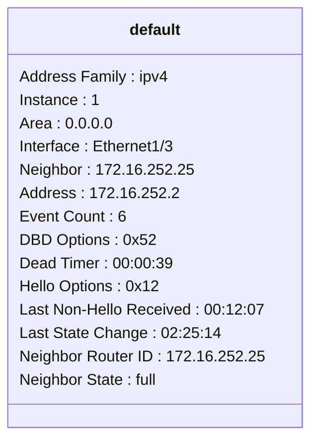
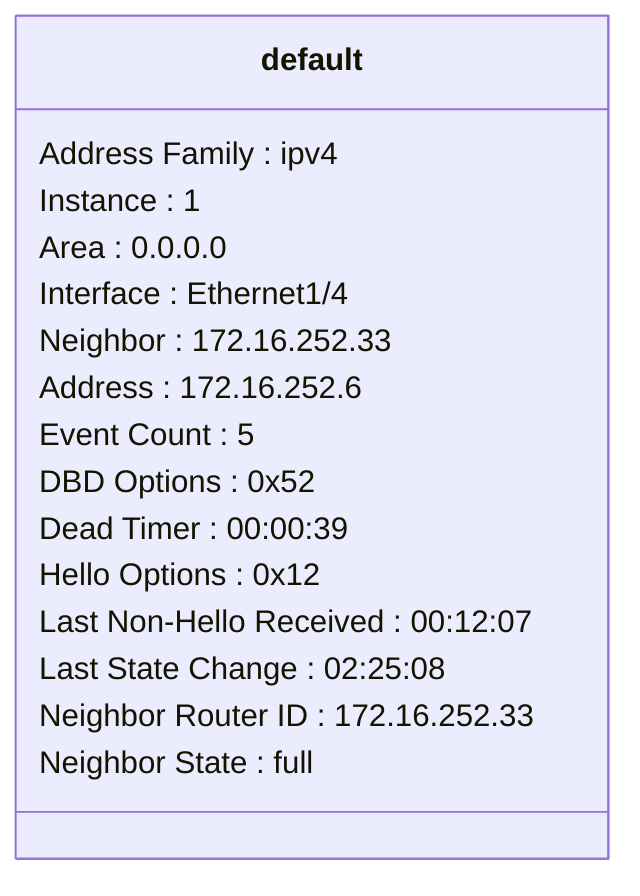

```mermaid
classDiagram
class default {
Address Family : ipv4
Instance : 1
Area : 0.0.0.0
Interface : Ethernet1/3
Neighbor : 172.16.252.25
Address : 172.16.252.2
Event Count : 6
DBD Options : 0x52
Dead Timer : 00:00:39
Hello Options : 0x12
Last Non-Hello Received : 00:12:07
Last State Change : 02:25:14
Neighbor Router ID : 172.16.252.25
Neighbor State : full
}
```

```mermaid
classDiagram
class default {
Address Family : ipv4
Instance : 1
Area : 0.0.0.0
Interface : Ethernet1/4
Neighbor : 172.16.252.33
Address : 172.16.252.6
Event Count : 5
DBD Options : 0x52
Dead Timer : 00:00:39
Hello Options : 0x12
Last Non-Hello Received : 00:12:07
Last State Change : 02:25:08
Neighbor Router ID : 172.16.252.33
Neighbor State : full
}
```