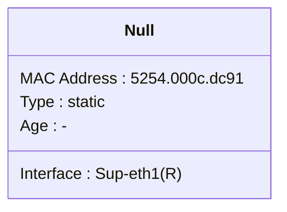
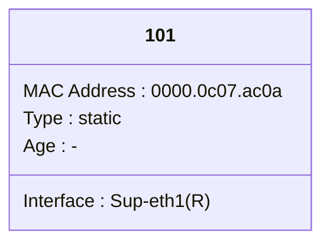
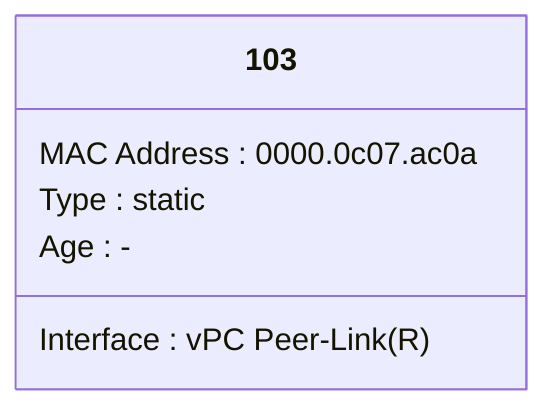
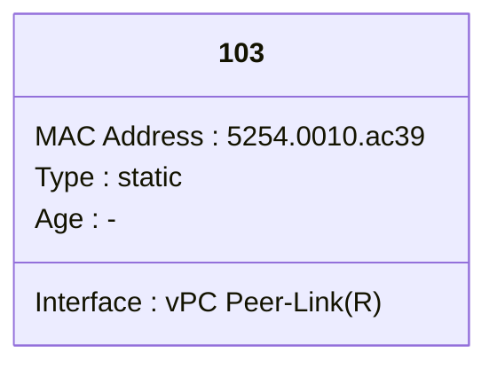
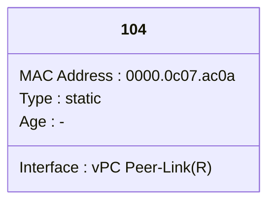
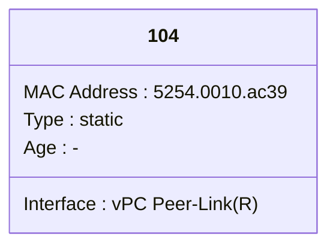
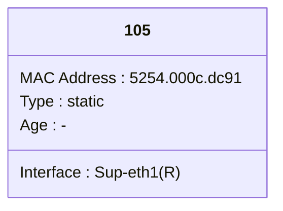

```mermaid
classDiagram
class Null {
MAC Address : 5254.000c.dc91
Interface : Sup-eth1(R)
Type : static
Age : -
}
```

```mermaid
classDiagram
class 101 {
MAC Address : 0000.0c07.ac0a
Interface : Sup-eth1(R)
Type : static
Age : -
}
```

```mermaid
classDiagram
class 101 {
MAC Address : 5254.000c.dc91
Interface : Sup-eth1(R)
Type : static
Age : -
}
```

```mermaid
classDiagram
class 101 {
MAC Address : 5254.0010.ac39
Interface : vPC Peer-Link(R)
Type : static
Age : -
}
```

```mermaid
classDiagram
class 102 {
MAC Address : 0000.0c07.ac0a
Interface : vPC Peer-Link(R)
Type : static
Age : -
}
```

```mermaid
classDiagram
class 102 {
MAC Address : 5254.000c.dc91
Interface : Sup-eth1(R)
Type : static
Age : -
}
```

```mermaid
classDiagram
class 102 {
MAC Address : 5254.0010.ac39
Interface : vPC Peer-Link(R)
Type : static
Age : -
}
```

```mermaid
classDiagram
class 103 {
MAC Address : 0000.0c07.ac0a
Interface : vPC Peer-Link(R)
Type : static
Age : -
}
```

```mermaid
classDiagram
class 103 {
MAC Address : 5254.000c.dc91
Interface : Sup-eth1(R)
Type : static
Age : -
}
```

```mermaid
classDiagram
class 103 {
MAC Address : 5254.0010.ac39
Interface : vPC Peer-Link(R)
Type : static
Age : -
}
```

```mermaid
classDiagram
class 104 {
MAC Address : 0000.0c07.ac0a
Interface : vPC Peer-Link(R)
Type : static
Age : -
}
```

```mermaid
classDiagram
class 104 {
MAC Address : 5254.000c.dc91
Interface : Sup-eth1(R)
Type : static
Age : -
}
```

```mermaid
classDiagram
class 104 {
MAC Address : 5254.0010.ac39
Interface : vPC Peer-Link(R)
Type : static
Age : -
}
```

```mermaid
classDiagram
class 105 {
MAC Address : 0000.0c07.ac0a
Interface : vPC Peer-Link(R)
Type : static
Age : -
}
```

```mermaid
classDiagram
class 105 {
MAC Address : 5254.000c.dc91
Interface : Sup-eth1(R)
Type : static
Age : -
}
```

```mermaid
classDiagram
class 105 {
MAC Address : 5254.0010.ac39
Interface : vPC Peer-Link(R)
Type : static
Age : -
}
```