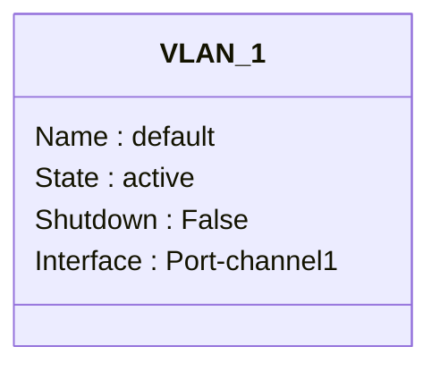
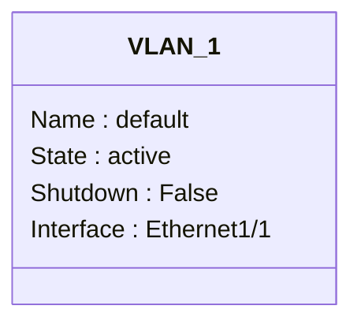
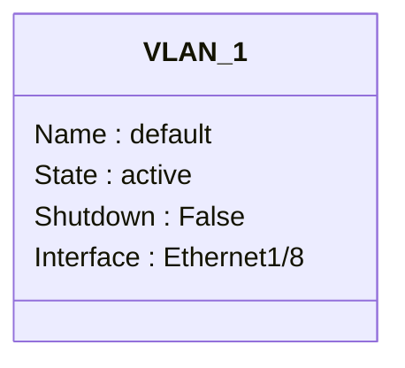
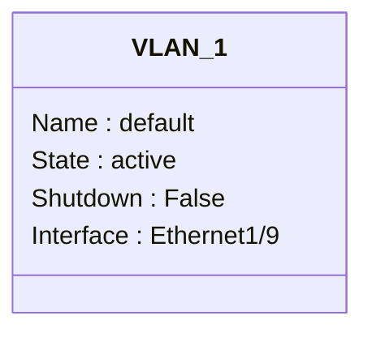
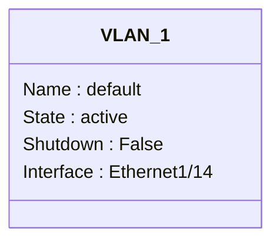
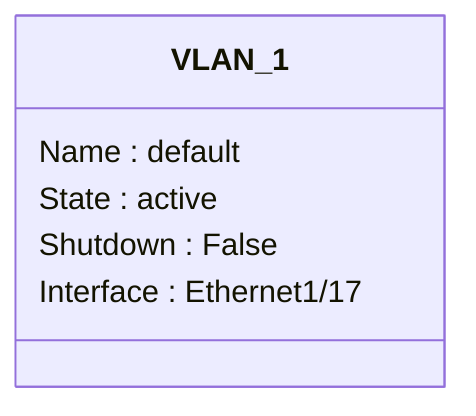
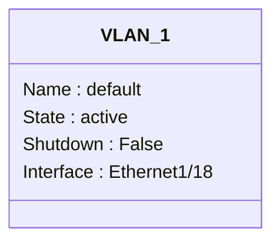
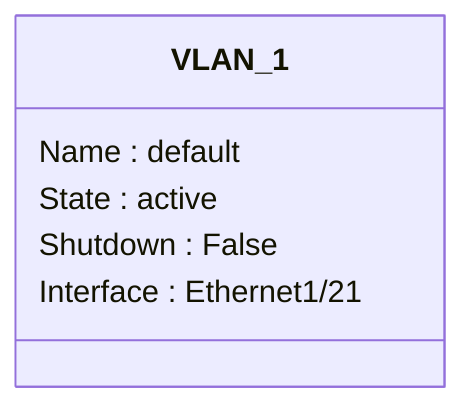

```mermaid
classDiagram
class VLAN_1 {
Name : default
State : active
Shutdown : False
Interface : Ethernet1/23
}
```
```mermaid
classDiagram
class VLAN_1 {
Name : default
State : active
Shutdown : False
Interface : Ethernet1/24
}
```
```mermaid
classDiagram
class VLAN_1 {
Name : default
State : active
Shutdown : False
Interface : Ethernet1/25
}
```
```mermaid
classDiagram
class VLAN_1 {
Name : default
State : active
Shutdown : False
Interface : Ethernet1/26
}
```
```mermaid
classDiagram
class VLAN_1 {
Name : default
State : active
Shutdown : False
Interface : Ethernet1/27
}
```
```mermaid
classDiagram
class VLAN_1 {
Name : default
State : active
Shutdown : False
Interface : Ethernet1/28
}
```
```mermaid
classDiagram
class VLAN_1 {
Name : default
State : active
Shutdown : False
Interface : Ethernet1/29
}
```
```mermaid
classDiagram
class VLAN_1 {
Name : default
State : active
Shutdown : False
Interface : Ethernet1/30
}
```
```mermaid
classDiagram
class VLAN_1 {
Name : default
State : active
Shutdown : False
Interface : Ethernet1/31
}
```
```mermaid
classDiagram
class VLAN_1 {
Name : default
State : active
Shutdown : False
Interface : Ethernet1/32
}
```
```mermaid
classDiagram
class VLAN_1 {
Name : default
State : active
Shutdown : False
Interface : Ethernet1/33
}
```
```mermaid
classDiagram
class VLAN_1 {
Name : default
State : active
Shutdown : False
Interface : Ethernet1/34
}
```
```mermaid
classDiagram
class VLAN_1 {
Name : default
State : active
Shutdown : False
Interface : Ethernet1/35
}
```
```mermaid
classDiagram
class VLAN_1 {
Name : default
State : active
Shutdown : False
Interface : Ethernet1/36
}
```
```mermaid
classDiagram
class VLAN_1 {
Name : default
State : active
Shutdown : False
Interface : Ethernet1/37
}
```
```mermaid
classDiagram
class VLAN_1 {
Name : default
State : active
Shutdown : False
Interface : Ethernet1/38
}
```
```mermaid
classDiagram
class VLAN_1 {
Name : default
State : active
Shutdown : False
Interface : Ethernet1/39
}
```
```mermaid
classDiagram
class VLAN_1 {
Name : default
State : active
Shutdown : False
Interface : Ethernet1/40
}
```
```mermaid
classDiagram
class VLAN_1 {
Name : default
State : active
Shutdown : False
Interface : Ethernet1/41
}
```
```mermaid
classDiagram
class VLAN_1 {
Name : default
State : active
Shutdown : False
Interface : Ethernet1/42
}
```
```mermaid
classDiagram
class VLAN_1 {
Name : default
State : active
Shutdown : False
Interface : Ethernet1/43
}
```
```mermaid
classDiagram
class VLAN_1 {
Name : default
State : active
Shutdown : False
Interface : Ethernet1/44
}
```
```mermaid
classDiagram
class VLAN_1 {
Name : default
State : active
Shutdown : False
Interface : Ethernet1/45
}
```
```mermaid
classDiagram
class VLAN_1 {
Name : default
State : active
Shutdown : False
Interface : Ethernet1/46
}
```
```mermaid
classDiagram
class VLAN_1 {
Name : default
State : active
Shutdown : False
Interface : Ethernet1/47
}
```
```mermaid
classDiagram
class VLAN_1 {
Name : default
State : active
Shutdown : False
Interface : Ethernet1/48
}
```
```mermaid
classDiagram
class VLAN_1 {
Name : default
State : active
Shutdown : False
Interface : Ethernet1/49
}
```
```mermaid
classDiagram
class VLAN_1 {
Name : default
State : active
Shutdown : False
Interface : Ethernet1/50
}
```
```mermaid
classDiagram
class VLAN_1 {
Name : default
State : active
Shutdown : False
Interface : Ethernet1/51
}
```
```mermaid
classDiagram
class VLAN_1 {
Name : default
State : active
Shutdown : False
Interface : Ethernet1/52
}
```
```mermaid
classDiagram
class VLAN_1 {
Name : default
State : active
Shutdown : False
Interface : Ethernet1/53
}
```
```mermaid
classDiagram
class VLAN_1 {
Name : default
State : active
Shutdown : False
Interface : Ethernet1/54
}
```
```mermaid
classDiagram
class VLAN_1 {
Name : default
State : active
Shutdown : False
Interface : Ethernet1/55
}
```
```mermaid
classDiagram
class VLAN_1 {
Name : default
State : active
Shutdown : False
Interface : Ethernet1/56
}
```
```mermaid
classDiagram
class VLAN_1 {
Name : default
State : active
Shutdown : False
Interface : Ethernet1/57
}
```
```mermaid
classDiagram
class VLAN_1 {
Name : default
State : active
Shutdown : False
Interface : Ethernet1/58
}
```
```mermaid
classDiagram
class VLAN_1 {
Name : default
State : active
Shutdown : False
Interface : Ethernet1/59
}
```
```mermaid
classDiagram
class VLAN_1 {
Name : default
State : active
Shutdown : False
Interface : Ethernet1/60
}
```
```mermaid
classDiagram
class VLAN_1 {
Name : default
State : active
Shutdown : False
Interface : Ethernet1/61
}
```
```mermaid
classDiagram
class VLAN_1 {
Name : default
State : active
Shutdown : False
Interface : Ethernet1/62
}
```
```mermaid
classDiagram
class VLAN_1 {
Name : default
State : active
Shutdown : False
Interface : Ethernet1/63
}
```
```mermaid
classDiagram
class VLAN_1 {
Name : default
State : active
Shutdown : False
Interface : Ethernet1/64
}
```
```mermaid
classDiagram
class VLAN_1 {
Name : default
State : active
Shutdown : False
Interface : Ethernet1/65
}
```
```mermaid
classDiagram
class VLAN_1 {
Name : default
State : active
Shutdown : False
Interface : Ethernet1/66
}
```
```mermaid
classDiagram
class VLAN_1 {
Name : default
State : active
Shutdown : False
Interface : Ethernet1/67
}
```
```mermaid
classDiagram
class VLAN_1 {
Name : default
State : active
Shutdown : False
Interface : Ethernet1/68
}
```
```mermaid
classDiagram
class VLAN_1 {
Name : default
State : active
Shutdown : False
Interface : Ethernet1/69
}
```
```mermaid
classDiagram
class VLAN_1 {
Name : default
State : active
Shutdown : False
Interface : Ethernet1/70
}
```
```mermaid
classDiagram
class VLAN_1 {
Name : default
State : active
Shutdown : False
Interface : Ethernet1/71
}
```
```mermaid
classDiagram
class VLAN_1 {
Name : default
State : active
Shutdown : False
Interface : Ethernet1/72
}
```
```mermaid
classDiagram
class VLAN_1 {
Name : default
State : active
Shutdown : False
Interface : Ethernet1/73
}
```
```mermaid
classDiagram
class VLAN_1 {
Name : default
State : active
Shutdown : False
Interface : Ethernet1/74
}
```
```mermaid
classDiagram
class VLAN_1 {
Name : default
State : active
Shutdown : False
Interface : Ethernet1/75
}
```
```mermaid
classDiagram
class VLAN_1 {
Name : default
State : active
Shutdown : False
Interface : Ethernet1/76
}
```
```mermaid
classDiagram
class VLAN_1 {
Name : default
State : active
Shutdown : False
Interface : Ethernet1/77
}
```
```mermaid
classDiagram
class VLAN_1 {
Name : default
State : active
Shutdown : False
Interface : Ethernet1/78
}
```
```mermaid
classDiagram
class VLAN_1 {
Name : default
State : active
Shutdown : False
Interface : Ethernet1/79
}
```
```mermaid
classDiagram
class VLAN_1 {
Name : default
State : active
Shutdown : False
Interface : Ethernet1/80
}
```
```mermaid
classDiagram
class VLAN_1 {
Name : default
State : active
Shutdown : False
Interface : Ethernet1/81
}
```
```mermaid
classDiagram
class VLAN_1 {
Name : default
State : active
Shutdown : False
Interface : Ethernet1/82
}
```
```mermaid
classDiagram
class VLAN_1 {
Name : default
State : active
Shutdown : False
Interface : Ethernet1/83
}
```
```mermaid
classDiagram
class VLAN_1 {
Name : default
State : active
Shutdown : False
Interface : Ethernet1/84
}
```
```mermaid
classDiagram
class VLAN_1 {
Name : default
State : active
Shutdown : False
Interface : Ethernet1/85
}
```
```mermaid
classDiagram
class VLAN_1 {
Name : default
State : active
Shutdown : False
Interface : Ethernet1/86
}
```
```mermaid
classDiagram
class VLAN_1 {
Name : default
State : active
Shutdown : False
Interface : Ethernet1/87
}
```
```mermaid
classDiagram
class VLAN_1 {
Name : default
State : active
Shutdown : False
Interface : Ethernet1/88
}
```
```mermaid
classDiagram
class VLAN_1 {
Name : default
State : active
Shutdown : False
Interface : Ethernet1/89
}
```
```mermaid
classDiagram
class VLAN_1 {
Name : default
State : active
Shutdown : False
Interface : Ethernet1/90
}
```
```mermaid
classDiagram
class VLAN_1 {
Name : default
State : active
Shutdown : False
Interface : Ethernet1/91
}
```
```mermaid
classDiagram
class VLAN_1 {
Name : default
State : active
Shutdown : False
Interface : Ethernet1/92
}
```
```mermaid
classDiagram
class VLAN_1 {
Name : default
State : active
Shutdown : False
Interface : Ethernet1/93
}
```
```mermaid
classDiagram
class VLAN_1 {
Name : default
State : active
Shutdown : False
Interface : Ethernet1/94
}
```
```mermaid
classDiagram
class VLAN_1 {
Name : default
State : active
Shutdown : False
Interface : Ethernet1/95
}
```
```mermaid
classDiagram
class VLAN_1 {
Name : default
State : active
Shutdown : False
Interface : Ethernet1/96
}
```
```mermaid
classDiagram
class VLAN_1 {
Name : default
State : active
Shutdown : False
Interface : Ethernet1/97
}
```
```mermaid
classDiagram
class VLAN_1 {
Name : default
State : active
Shutdown : False
Interface : Ethernet1/98
}
```
```mermaid
classDiagram
class VLAN_1 {
Name : default
State : active
Shutdown : False
Interface : Ethernet1/99
}
```
```mermaid
classDiagram
class VLAN_1 {
Name : default
State : active
Shutdown : False
Interface : Ethernet1/100
}
```
```mermaid
classDiagram
class VLAN_1 {
Name : default
State : active
Shutdown : False
Interface : Ethernet1/101
}
```
```mermaid
classDiagram
class VLAN_1 {
Name : default
State : active
Shutdown : False
Interface : Ethernet1/102
}
```
```mermaid
classDiagram
class VLAN_1 {
Name : default
State : active
Shutdown : False
Interface : Ethernet1/103
}
```
```mermaid
classDiagram
class VLAN_1 {
Name : default
State : active
Shutdown : False
Interface : Ethernet1/104
}
```
```mermaid
classDiagram
class VLAN_1 {
Name : default
State : active
Shutdown : False
Interface : Ethernet1/105
}
```
```mermaid
classDiagram
class VLAN_1 {
Name : default
State : active
Shutdown : False
Interface : Ethernet1/106
}
```
```mermaid
classDiagram
class VLAN_1 {
Name : default
State : active
Shutdown : False
Interface : Ethernet1/107
}
```
```mermaid
classDiagram
class VLAN_1 {
Name : default
State : active
Shutdown : False
Interface : Ethernet1/108
}
```
```mermaid
classDiagram
class VLAN_1 {
Name : default
State : active
Shutdown : False
Interface : Ethernet1/109
}
```
```mermaid
classDiagram
class VLAN_1 {
Name : default
State : active
Shutdown : False
Interface : Ethernet1/110
}
```
```mermaid
classDiagram
class VLAN_1 {
Name : default
State : active
Shutdown : False
Interface : Ethernet1/111
}
```
```mermaid
classDiagram
class VLAN_1 {
Name : default
State : active
Shutdown : False
Interface : Ethernet1/112
}
```
```mermaid
classDiagram
class VLAN_1 {
Name : default
State : active
Shutdown : False
Interface : Ethernet1/113
}
```
```mermaid
classDiagram
class VLAN_1 {
Name : default
State : active
Shutdown : False
Interface : Ethernet1/114
}
```
```mermaid
classDiagram
class VLAN_1 {
Name : default
State : active
Shutdown : False
Interface : Ethernet1/115
}
```
```mermaid
classDiagram
class VLAN_1 {
Name : default
State : active
Shutdown : False
Interface : Ethernet1/116
}
```
```mermaid
classDiagram
class VLAN_1 {
Name : default
State : active
Shutdown : False
Interface : Ethernet1/117
}
```
```mermaid
classDiagram
class VLAN_1 {
Name : default
State : active
Shutdown : False
Interface : Ethernet1/118
}
```
```mermaid
classDiagram
class VLAN_1 {
Name : default
State : active
Shutdown : False
Interface : Ethernet1/119
}
```
```mermaid
classDiagram
class VLAN_1 {
Name : default
State : active
Shutdown : False
Interface : Ethernet1/120
}
```
```mermaid
classDiagram
class VLAN_1 {
Name : default
State : active
Shutdown : False
Interface : Ethernet1/121
}
```
```mermaid
classDiagram
class VLAN_1 {
Name : default
State : active
Shutdown : False
Interface : Ethernet1/122
}
```
```mermaid
classDiagram
class VLAN_1 {
Name : default
State : active
Shutdown : False
Interface : Ethernet1/123
}
```
```mermaid
classDiagram
class VLAN_1 {
Name : default
State : active
Shutdown : False
Interface : Ethernet1/124
}
```
```mermaid
classDiagram
class VLAN_1 {
Name : default
State : active
Shutdown : False
Interface : Ethernet1/125
}
```
```mermaid
classDiagram
class VLAN_1 {
Name : default
State : active
Shutdown : False
Interface : Ethernet1/126
}
```
```mermaid
classDiagram
class VLAN_1 {
Name : default
State : active
Shutdown : False
Interface : Ethernet1/127
}
```
```mermaid
classDiagram
class VLAN_1 {
Name : default
State : active
Shutdown : False
Interface : Ethernet1/128
}
```
```mermaid
classDiagram
class VLAN_101 {
Name : prod
State : active
Shutdown : False
Interface : Port-channel1
}
```
```mermaid
classDiagram
class VLAN_101 {
Name : prod
State : active
Shutdown : False
Interface : Ethernet1/1
}
```
```mermaid
classDiagram
class VLAN_101 {
Name : prod
State : active
Shutdown : False
Interface : Ethernet1/2
}
```
```mermaid
classDiagram
class VLAN_101 {
Name : prod
State : active
Shutdown : False
Interface : Ethernet1/11
}
```
```mermaid
classDiagram
class VLAN_102 {
Name : dev
State : active
Shutdown : False
Interface : Port-channel1
}
```
```mermaid
classDiagram
class VLAN_102 {
Name : dev
State : active
Shutdown : False
Interface : Ethernet1/1
}
```
```mermaid
classDiagram
class VLAN_102 {
Name : dev
State : active
Shutdown : False
Interface : Ethernet1/2
}
```
```mermaid
classDiagram
class VLAN_103 {
Name : test
State : active
Shutdown : False
Interface : Port-channel1
}
```
```mermaid
classDiagram
class VLAN_103 {
Name : test
State : active
Shutdown : False
Interface : Ethernet1/1
}
```
```mermaid
classDiagram
class VLAN_103 {
Name : test
State : active
Shutdown : False
Interface : Ethernet1/2
}
```
```mermaid
classDiagram
class VLAN_104 {
Name : security
State : active
Shutdown : False
Interface : Port-channel1
}
```
```mermaid
classDiagram
class VLAN_104 {
Name : security
State : active
Shutdown : False
Interface : Ethernet1/1
}
```
```mermaid
classDiagram
class VLAN_104 {
Name : security
State : active
Shutdown : False
Interface : Ethernet1/2
}
```
```mermaid
classDiagram
class VLAN_105 {
Name : iot
State : active
Shutdown : False
Interface : Port-channel1
}
```
```mermaid
classDiagram
class VLAN_105 {
Name : iot
State : active
Shutdown : False
Interface : Ethernet1/1
}
```
```mermaid
classDiagram
class VLAN_105 {
Name : iot
State : active
Shutdown : False
Interface : Ethernet1/2
}
```
```mermaid
classDiagram
class VLAN_configuration {
Name : 
State : 
Shutdown : 
```
```mermaid
classDiagram
class VLAN_interface_vlan_enabled {
Name : 
State : 
Shutdown : 
```
```mermaid
classDiagram
class VLAN_vn_segment_vlan_based_enabled {
Name : 
State : 
Shutdown : 
```