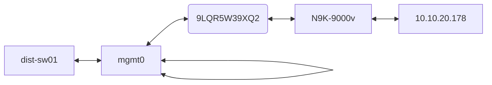
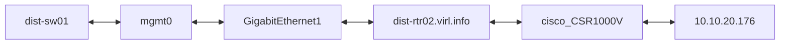
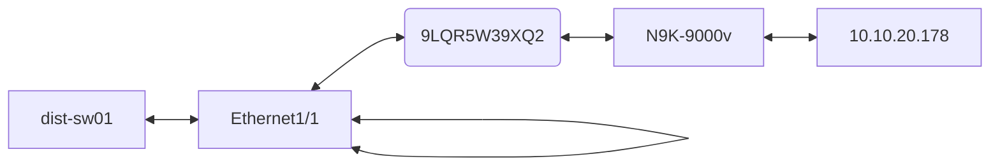
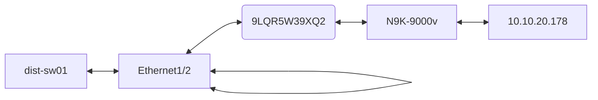
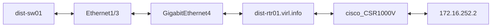

```mermaid
flowchart LR;
dist-sw01 <--> mgmt0 <--> GigabitEthernet1 <--> dist-rtr01.virl.info <--> cisco_CSR1000V <--> 10.10.20.175 
```

```mermaid
flowchart LR;
dist-sw01 <--> mgmt0 <--> mgmt0 <--> dist-sw02(9LQR5W39XQ2) <--> N9K-9000v <--> 10.10.20.178 
```

```mermaid
flowchart LR;
dist-sw01 <--> mgmt0 <--> GigabitEthernet1 <--> dist-rtr02.virl.info <--> cisco_CSR1000V <--> 10.10.20.176 
```

```mermaid
flowchart LR;
dist-sw01 <--> Ethernet1/1 <--> Ethernet1/1 <--> dist-sw02(9LQR5W39XQ2) <--> N9K-9000v <--> 10.10.20.178 
```

```mermaid
flowchart LR;
dist-sw01 <--> Ethernet1/2 <--> Ethernet1/2 <--> dist-sw02(9LQR5W39XQ2) <--> N9K-9000v <--> 10.10.20.178 
```

```mermaid
flowchart LR;
dist-sw01 <--> Ethernet1/3 <--> GigabitEthernet4 <--> dist-rtr01.virl.info <--> cisco_CSR1000V <--> 172.16.252.2 
```

```mermaid
flowchart LR;
dist-sw01 <--> Ethernet1/4 <--> GigabitEthernet4 <--> dist-rtr02.virl.info <--> cisco_CSR1000V <--> 172.16.252.6 
```
