   
```mermaid
flowchart LR;
dist-sw01 <--> Ethernet1/1 <--> VPC Peer Link <--> up <--> True <--> up <--> 5254.000d.e744 <--> True
```   
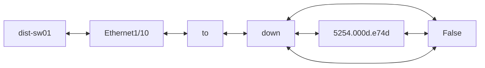
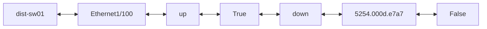
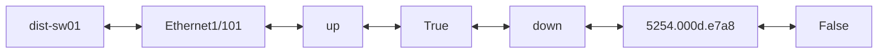

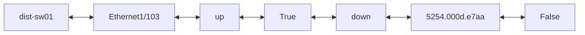

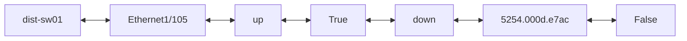


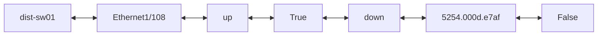
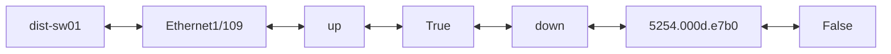
```mermaid
flowchart LR;
dist-sw01 <--> Ethernet1/11 <--> Link to inside-host01 <--> up <--> True <--> up <--> 5254.000d.e74e <--> False
```   
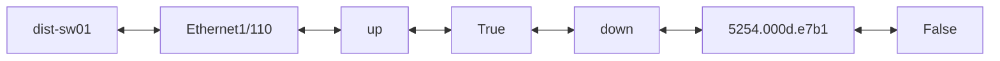
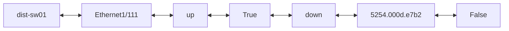
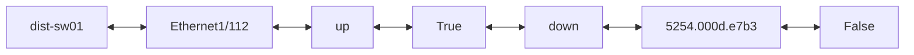

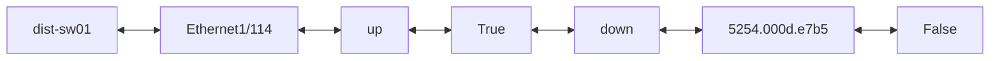
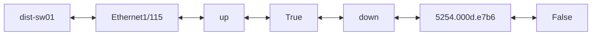

```mermaid
flowchart LR;
dist-sw01 <--> Ethernet1/117 <--> up <--> True <--> down <--> 5254.000d.e7b8 <--> False
```   
```mermaid
flowchart LR;
dist-sw01 <--> Ethernet1/118 <--> up <--> True <--> down <--> 5254.000d.e7b9 <--> False
```   
```mermaid
flowchart LR;
dist-sw01 <--> Ethernet1/119 <--> up <--> True <--> down <--> 5254.000d.e7ba <--> False
```   
```mermaid
flowchart LR;
dist-sw01 <--> Ethernet1/12 <--> up <--> True <--> down <--> 5254.000d.e74f <--> False
```   
```mermaid
flowchart LR;
dist-sw01 <--> Ethernet1/120 <--> up <--> True <--> down <--> 5254.000d.e7bb <--> False
```   
```mermaid
flowchart LR;
dist-sw01 <--> Ethernet1/121 <--> up <--> True <--> down <--> 5254.000d.e7bc <--> False
```   
```mermaid
flowchart LR;
dist-sw01 <--> Ethernet1/122 <--> up <--> True <--> down <--> 5254.000d.e7bd <--> False
```   
```mermaid
flowchart LR;
dist-sw01 <--> Ethernet1/123 <--> up <--> True <--> down <--> 5254.000d.e7be <--> False
```   
```mermaid
flowchart LR;
dist-sw01 <--> Ethernet1/124 <--> up <--> True <--> down <--> 5254.000d.e7bf <--> False
```   
```mermaid
flowchart LR;
dist-sw01 <--> Ethernet1/125 <--> up <--> True <--> down <--> 5254.000d.e7c0 <--> False
```   
```mermaid
flowchart LR;
dist-sw01 <--> Ethernet1/126 <--> up <--> True <--> down <--> 5254.000d.e7c1 <--> False
```   
```mermaid
flowchart LR;
dist-sw01 <--> Ethernet1/127 <--> up <--> True <--> down <--> 5254.000d.e7c2 <--> False
```   
```mermaid
flowchart LR;
dist-sw01 <--> Ethernet1/128 <--> up <--> True <--> down <--> 5254.000d.e7c3 <--> False
```   
```mermaid
flowchart LR;
dist-sw01 <--> Ethernet1/13 <--> up <--> True <--> down <--> 5254.000d.e750 <--> False
```   
```mermaid
flowchart LR;
dist-sw01 <--> Ethernet1/14 <--> up <--> True <--> down <--> 5254.000d.e751 <--> False
```   
```mermaid
flowchart LR;
dist-sw01 <--> Ethernet1/15 <--> up <--> True <--> down <--> 5254.000d.e752 <--> False
```   
```mermaid
flowchart LR;
dist-sw01 <--> Ethernet1/16 <--> up <--> True <--> down <--> 5254.000d.e753 <--> False
```   
```mermaid
flowchart LR;
dist-sw01 <--> Ethernet1/17 <--> up <--> True <--> down <--> 5254.000d.e754 <--> False
```   
```mermaid
flowchart LR;
dist-sw01 <--> Ethernet1/18 <--> up <--> True <--> down <--> 5254.000d.e755 <--> False
```   
```mermaid
flowchart LR;
dist-sw01 <--> Ethernet1/19 <--> up <--> True <--> down <--> 5254.000d.e756 <--> False
```   
```mermaid
flowchart LR;
dist-sw01 <--> Ethernet1/2 <--> VPC Peer Link <--> up <--> True <--> up <--> 5254.000d.e745 <--> True
```   
```mermaid
flowchart LR;
dist-sw01 <--> Ethernet1/20 <--> up <--> True <--> down <--> 5254.000d.e757 <--> False
```   
```mermaid
flowchart LR;
dist-sw01 <--> Ethernet1/21 <--> up <--> True <--> down <--> 5254.000d.e758 <--> False
```   
```mermaid
flowchart LR;
dist-sw01 <--> Ethernet1/22 <--> up <--> True <--> down <--> 5254.000d.e759 <--> False
```   
```mermaid
flowchart LR;
dist-sw01 <--> Ethernet1/23 <--> up <--> True <--> down <--> 5254.000d.e75a <--> False
```   
```mermaid
flowchart LR;
dist-sw01 <--> Ethernet1/24 <--> up <--> True <--> down <--> 5254.000d.e75b <--> False
```   
```mermaid
flowchart LR;
dist-sw01 <--> Ethernet1/25 <--> up <--> True <--> down <--> 5254.000d.e75c <--> False
```   
```mermaid
flowchart LR;
dist-sw01 <--> Ethernet1/26 <--> up <--> True <--> down <--> 5254.000d.e75d <--> False
```   
```mermaid
flowchart LR;
dist-sw01 <--> Ethernet1/27 <--> up <--> True <--> down <--> 5254.000d.e75e <--> False
```   
```mermaid
flowchart LR;
dist-sw01 <--> Ethernet1/28 <--> up <--> True <--> down <--> 5254.000d.e75f <--> False
```   
```mermaid
flowchart LR;
dist-sw01 <--> Ethernet1/29 <--> up <--> True <--> down <--> 5254.000d.e760 <--> False
```   
```mermaid
flowchart LR;
dist-sw01 <--> Ethernet1/3 <--> L3 link to dist-rtr01 <--> up <--> True <--> up <--> 5254.000d.e743 <--> 172.16.252.1/30 <--> False
```   
```mermaid
flowchart LR;
dist-sw01 <--> Ethernet1/30 <--> up <--> True <--> down <--> 5254.000d.e761 <--> False
```   
```mermaid
flowchart LR;
dist-sw01 <--> Ethernet1/31 <--> up <--> True <--> down <--> 5254.000d.e762 <--> False
```   
```mermaid
flowchart LR;
dist-sw01 <--> Ethernet1/32 <--> up <--> True <--> down <--> 5254.000d.e763 <--> False
```   
```mermaid
flowchart LR;
dist-sw01 <--> Ethernet1/33 <--> up <--> True <--> down <--> 5254.000d.e764 <--> False
```   
```mermaid
flowchart LR;
dist-sw01 <--> Ethernet1/34 <--> up <--> True <--> down <--> 5254.000d.e765 <--> False
```   
```mermaid
flowchart LR;
dist-sw01 <--> Ethernet1/35 <--> up <--> True <--> down <--> 5254.000d.e766 <--> False
```   
```mermaid
flowchart LR;
dist-sw01 <--> Ethernet1/36 <--> up <--> True <--> down <--> 5254.000d.e767 <--> False
```   
```mermaid
flowchart LR;
dist-sw01 <--> Ethernet1/37 <--> up <--> True <--> down <--> 5254.000d.e768 <--> False
```   
```mermaid
flowchart LR;
dist-sw01 <--> Ethernet1/38 <--> up <--> True <--> down <--> 5254.000d.e769 <--> False
```   
```mermaid
flowchart LR;
dist-sw01 <--> Ethernet1/39 <--> up <--> True <--> down <--> 5254.000d.e76a <--> False
```   
```mermaid
flowchart LR;
dist-sw01 <--> Ethernet1/4 <--> L3 link to dist-rtr02 <--> up <--> True <--> up <--> 5254.000d.e743 <--> 172.16.252.5/30 <--> False
```   
```mermaid
flowchart LR;
dist-sw01 <--> Ethernet1/40 <--> up <--> True <--> down <--> 5254.000d.e76b <--> False
```   
```mermaid
flowchart LR;
dist-sw01 <--> Ethernet1/41 <--> up <--> True <--> down <--> 5254.000d.e76c <--> False
```   
```mermaid
flowchart LR;
dist-sw01 <--> Ethernet1/42 <--> up <--> True <--> down <--> 5254.000d.e76d <--> False
```   
```mermaid
flowchart LR;
dist-sw01 <--> Ethernet1/43 <--> up <--> True <--> down <--> 5254.000d.e76e <--> False
```   
```mermaid
flowchart LR;
dist-sw01 <--> Ethernet1/44 <--> up <--> True <--> down <--> 5254.000d.e76f <--> False
```   
```mermaid
flowchart LR;
dist-sw01 <--> Ethernet1/45 <--> up <--> True <--> down <--> 5254.000d.e770 <--> False
```   
```mermaid
flowchart LR;
dist-sw01 <--> Ethernet1/46 <--> up <--> True <--> down <--> 5254.000d.e771 <--> False
```   
```mermaid
flowchart LR;
dist-sw01 <--> Ethernet1/47 <--> up <--> True <--> down <--> 5254.000d.e772 <--> False
```   
```mermaid
flowchart LR;
dist-sw01 <--> Ethernet1/48 <--> up <--> True <--> down <--> 5254.000d.e773 <--> False
```   
```mermaid
flowchart LR;
dist-sw01 <--> Ethernet1/49 <--> up <--> True <--> down <--> 5254.000d.e774 <--> False
```   
```mermaid
flowchart LR;
dist-sw01 <--> Ethernet1/5 <--> to <--> down <--> False <--> down <--> 5254.000d.e748 <--> False
```   
```mermaid
flowchart LR;
dist-sw01 <--> Ethernet1/50 <--> up <--> True <--> down <--> 5254.000d.e775 <--> False
```   
```mermaid
flowchart LR;
dist-sw01 <--> Ethernet1/51 <--> up <--> True <--> down <--> 5254.000d.e776 <--> False
```   
```mermaid
flowchart LR;
dist-sw01 <--> Ethernet1/52 <--> up <--> True <--> down <--> 5254.000d.e777 <--> False
```   
```mermaid
flowchart LR;
dist-sw01 <--> Ethernet1/53 <--> up <--> True <--> down <--> 5254.000d.e778 <--> False
```   
```mermaid
flowchart LR;
dist-sw01 <--> Ethernet1/54 <--> up <--> True <--> down <--> 5254.000d.e779 <--> False
```   
```mermaid
flowchart LR;
dist-sw01 <--> Ethernet1/55 <--> up <--> True <--> down <--> 5254.000d.e77a <--> False
```   
```mermaid
flowchart LR;
dist-sw01 <--> Ethernet1/56 <--> up <--> True <--> down <--> 5254.000d.e77b <--> False
```   
```mermaid
flowchart LR;
dist-sw01 <--> Ethernet1/57 <--> up <--> True <--> down <--> 5254.000d.e77c <--> False
```   
```mermaid
flowchart LR;
dist-sw01 <--> Ethernet1/58 <--> up <--> True <--> down <--> 5254.000d.e77d <--> False
```   
```mermaid
flowchart LR;
dist-sw01 <--> Ethernet1/59 <--> up <--> True <--> down <--> 5254.000d.e77e <--> False
```   
```mermaid
flowchart LR;
dist-sw01 <--> Ethernet1/6 <--> to <--> down <--> False <--> down <--> 5254.000d.e749 <--> False
```   
```mermaid
flowchart LR;
dist-sw01 <--> Ethernet1/60 <--> up <--> True <--> down <--> 5254.000d.e77f <--> False
```   
```mermaid
flowchart LR;
dist-sw01 <--> Ethernet1/61 <--> up <--> True <--> down <--> 5254.000d.e780 <--> False
```   
```mermaid
flowchart LR;
dist-sw01 <--> Ethernet1/62 <--> up <--> True <--> down <--> 5254.000d.e781 <--> False
```   
```mermaid
flowchart LR;
dist-sw01 <--> Ethernet1/63 <--> up <--> True <--> down <--> 5254.000d.e782 <--> False
```   
```mermaid
flowchart LR;
dist-sw01 <--> Ethernet1/64 <--> up <--> True <--> down <--> 5254.000d.e783 <--> False
```   
```mermaid
flowchart LR;
dist-sw01 <--> Ethernet1/65 <--> up <--> True <--> down <--> 5254.000d.e784 <--> False
```   
```mermaid
flowchart LR;
dist-sw01 <--> Ethernet1/66 <--> up <--> True <--> down <--> 5254.000d.e785 <--> False
```   
```mermaid
flowchart LR;
dist-sw01 <--> Ethernet1/67 <--> up <--> True <--> down <--> 5254.000d.e786 <--> False
```   
```mermaid
flowchart LR;
dist-sw01 <--> Ethernet1/68 <--> up <--> True <--> down <--> 5254.000d.e787 <--> False
```   
```mermaid
flowchart LR;
dist-sw01 <--> Ethernet1/69 <--> up <--> True <--> down <--> 5254.000d.e788 <--> False
```   
```mermaid
flowchart LR;
dist-sw01 <--> Ethernet1/7 <--> to <--> down <--> False <--> down <--> 5254.000d.e74a <--> False
```   
```mermaid
flowchart LR;
dist-sw01 <--> Ethernet1/70 <--> up <--> True <--> down <--> 5254.000d.e789 <--> False
```   
```mermaid
flowchart LR;
dist-sw01 <--> Ethernet1/71 <--> up <--> True <--> down <--> 5254.000d.e78a <--> False
```   
```mermaid
flowchart LR;
dist-sw01 <--> Ethernet1/72 <--> up <--> True <--> down <--> 5254.000d.e78b <--> False
```   
```mermaid
flowchart LR;
dist-sw01 <--> Ethernet1/73 <--> up <--> True <--> down <--> 5254.000d.e78c <--> False
```   
```mermaid
flowchart LR;
dist-sw01 <--> Ethernet1/74 <--> up <--> True <--> down <--> 5254.000d.e78d <--> False
```   
```mermaid
flowchart LR;
dist-sw01 <--> Ethernet1/75 <--> up <--> True <--> down <--> 5254.000d.e78e <--> False
```   
```mermaid
flowchart LR;
dist-sw01 <--> Ethernet1/76 <--> up <--> True <--> down <--> 5254.000d.e78f <--> False
```   
```mermaid
flowchart LR;
dist-sw01 <--> Ethernet1/77 <--> up <--> True <--> down <--> 5254.000d.e790 <--> False
```   
```mermaid
flowchart LR;
dist-sw01 <--> Ethernet1/78 <--> up <--> True <--> down <--> 5254.000d.e791 <--> False
```   
```mermaid
flowchart LR;
dist-sw01 <--> Ethernet1/79 <--> up <--> True <--> down <--> 5254.000d.e792 <--> False
```   
```mermaid
flowchart LR;
dist-sw01 <--> Ethernet1/8 <--> to <--> down <--> False <--> down <--> 5254.000d.e74b <--> False
```   
```mermaid
flowchart LR;
dist-sw01 <--> Ethernet1/80 <--> up <--> True <--> down <--> 5254.000d.e793 <--> False
```   
```mermaid
flowchart LR;
dist-sw01 <--> Ethernet1/81 <--> up <--> True <--> down <--> 5254.000d.e794 <--> False
```   
```mermaid
flowchart LR;
dist-sw01 <--> Ethernet1/82 <--> up <--> True <--> down <--> 5254.000d.e795 <--> False
```   
```mermaid
flowchart LR;
dist-sw01 <--> Ethernet1/83 <--> up <--> True <--> down <--> 5254.000d.e796 <--> False
```   
```mermaid
flowchart LR;
dist-sw01 <--> Ethernet1/84 <--> up <--> True <--> down <--> 5254.000d.e797 <--> False
```   
```mermaid
flowchart LR;
dist-sw01 <--> Ethernet1/85 <--> up <--> True <--> down <--> 5254.000d.e798 <--> False
```   
```mermaid
flowchart LR;
dist-sw01 <--> Ethernet1/86 <--> up <--> True <--> down <--> 5254.000d.e799 <--> False
```   
```mermaid
flowchart LR;
dist-sw01 <--> Ethernet1/87 <--> up <--> True <--> down <--> 5254.000d.e79a <--> False
```   
```mermaid
flowchart LR;
dist-sw01 <--> Ethernet1/88 <--> up <--> True <--> down <--> 5254.000d.e79b <--> False
```   
```mermaid
flowchart LR;
dist-sw01 <--> Ethernet1/89 <--> up <--> True <--> down <--> 5254.000d.e79c <--> False
```   
```mermaid
flowchart LR;
dist-sw01 <--> Ethernet1/9 <--> to <--> down <--> False <--> down <--> 5254.000d.e74c <--> False
```   
```mermaid
flowchart LR;
dist-sw01 <--> Ethernet1/90 <--> up <--> True <--> down <--> 5254.000d.e79d <--> False
```   
```mermaid
flowchart LR;
dist-sw01 <--> Ethernet1/91 <--> up <--> True <--> down <--> 5254.000d.e79e <--> False
```   
```mermaid
flowchart LR;
dist-sw01 <--> Ethernet1/92 <--> up <--> True <--> down <--> 5254.000d.e79f <--> False
```   
```mermaid
flowchart LR;
dist-sw01 <--> Ethernet1/93 <--> up <--> True <--> down <--> 5254.000d.e7a0 <--> False
```   
```mermaid
flowchart LR;
dist-sw01 <--> Ethernet1/94 <--> up <--> True <--> down <--> 5254.000d.e7a1 <--> False
```   
```mermaid
flowchart LR;
dist-sw01 <--> Ethernet1/95 <--> up <--> True <--> down <--> 5254.000d.e7a2 <--> False
```   
```mermaid
flowchart LR;
dist-sw01 <--> Ethernet1/96 <--> up <--> True <--> down <--> 5254.000d.e7a3 <--> False
```   
```mermaid
flowchart LR;
dist-sw01 <--> Ethernet1/97 <--> up <--> True <--> down <--> 5254.000d.e7a4 <--> False
```   
```mermaid
flowchart LR;
dist-sw01 <--> Ethernet1/98 <--> up <--> True <--> down <--> 5254.000d.e7a5 <--> False
```   
```mermaid
flowchart LR;
dist-sw01 <--> Ethernet1/99 <--> up <--> True <--> down <--> 5254.000d.e7a6 <--> False
```   
```mermaid
flowchart LR;
dist-sw01 <--> Vlan1 <--> False <--> down <--> 5254.000d.e743 <--> False
```   
```mermaid
flowchart LR;
dist-sw01 <--> Vlan101 <--> prod svi  <--> True <--> up <--> 5254.000d.e743 <--> 172.16.101.2/24 <--> False
```   
```mermaid
flowchart LR;
dist-sw01 <--> Vlan102 <--> dev svi  <--> True <--> up <--> 5254.000d.e743 <--> 172.16.102.2/24 <--> False
```   
```mermaid
flowchart LR;
dist-sw01 <--> Vlan103 <--> test svi  <--> True <--> up <--> 5254.000d.e743 <--> 172.16.103.2/24 <--> False
```   
```mermaid
flowchart LR;
dist-sw01 <--> Vlan104 <--> security svi  <--> True <--> up <--> 5254.000d.e743 <--> 172.16.104.2/24 <--> False
```   
```mermaid
flowchart LR;
dist-sw01 <--> Vlan105 <--> iot svi  <--> True <--> up <--> 5254.000d.e743 <--> 172.16.105.2/24 <--> False
```   
```mermaid
flowchart LR;
dist-sw01 <--> loopback0 <--> to <--> down <--> False <--> down <--> False
```   
```mermaid
flowchart LR;
dist-sw01 <--> mgmt0 <--> to port8.sandbox-backend <--> up <--> True <--> up <--> 5254.000d.e73c <--> 10.10.20.177/24 <--> False
```   
```mermaid
flowchart LR;
dist-sw01 <--> port-channel1 <--> up <--> True <--> up <--> True
```