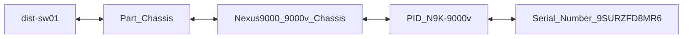
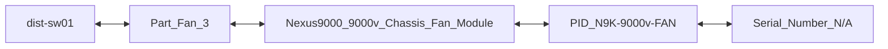
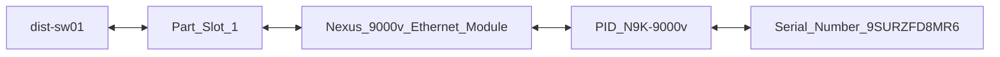

```mermaid
flowchart LR;
dist-sw01 <--> Part_Chassis <--> Nexus9000_9000v_Chassis <--> PID_N9K-9000v <--> Serial_Number_9SURZFD8MR6
```

```mermaid
flowchart LR;
dist-sw01 <--> Part_Fan_1 <--> Nexus9000_9000v_Chassis_Fan_Module <--> PID_N9K-9000v-FAN <--> Serial_Number_N/A
```

```mermaid
flowchart LR;
dist-sw01 <--> Part_Fan_2 <--> Nexus9000_9000v_Chassis_Fan_Module <--> PID_N9K-9000v-FAN <--> Serial_Number_N/A
```

```mermaid
flowchart LR;
dist-sw01 <--> Part_Fan_3 <--> Nexus9000_9000v_Chassis_Fan_Module <--> PID_N9K-9000v-FAN <--> Serial_Number_N/A
```

```mermaid
flowchart LR;
dist-sw01 <--> Part_Slot_1 <--> Nexus_9000v_Ethernet_Module <--> PID_N9K-9000v <--> Serial_Number_9SURZFD8MR6
```