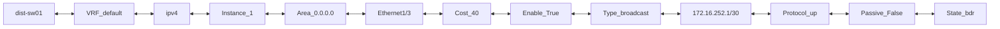
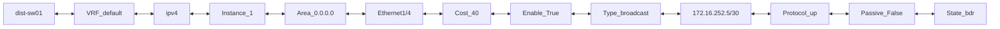
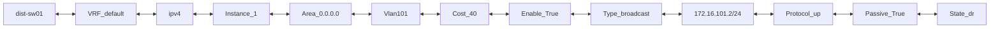
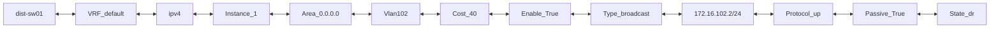
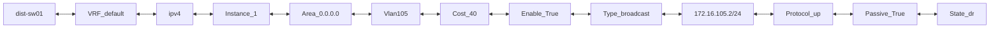

```mermaid
flowchart LR;
dist-sw01 <--> VRF_default <--> ipv4 <--> Instance_1 <--> Area_0.0.0.0 <--> Ethernet1/3 <--> Cost_40 <--> Enable_True <--> Type_broadcast <--> 172.16.252.1/30 <--> Protocol_up <--> Passive_False <--> State_bdr
```

```mermaid
flowchart LR;
dist-sw01 <--> VRF_default <--> ipv4 <--> Instance_1 <--> Area_0.0.0.0 <--> Ethernet1/4 <--> Cost_40 <--> Enable_True <--> Type_broadcast <--> 172.16.252.5/30 <--> Protocol_up <--> Passive_False <--> State_bdr
```

```mermaid
flowchart LR;
dist-sw01 <--> VRF_default <--> ipv4 <--> Instance_1 <--> Area_0.0.0.0 <--> Vlan101 <--> Cost_40 <--> Enable_True <--> Type_broadcast <--> 172.16.101.2/24 <--> Protocol_up <--> Passive_True <--> State_dr
```

```mermaid
flowchart LR;
dist-sw01 <--> VRF_default <--> ipv4 <--> Instance_1 <--> Area_0.0.0.0 <--> Vlan102 <--> Cost_40 <--> Enable_True <--> Type_broadcast <--> 172.16.102.2/24 <--> Protocol_up <--> Passive_True <--> State_dr
```

```mermaid
flowchart LR;
dist-sw01 <--> VRF_default <--> ipv4 <--> Instance_1 <--> Area_0.0.0.0 <--> Vlan103 <--> Cost_40 <--> Enable_True <--> Type_broadcast <--> 172.16.103.2/24 <--> Protocol_up <--> Passive_True <--> State_dr
```

```mermaid
flowchart LR;
dist-sw01 <--> VRF_default <--> ipv4 <--> Instance_1 <--> Area_0.0.0.0 <--> Vlan104 <--> Cost_40 <--> Enable_True <--> Type_broadcast <--> 172.16.104.2/24 <--> Protocol_up <--> Passive_True <--> State_dr
```

```mermaid
flowchart LR;
dist-sw01 <--> VRF_default <--> ipv4 <--> Instance_1 <--> Area_0.0.0.0 <--> Vlan105 <--> Cost_40 <--> Enable_True <--> Type_broadcast <--> 172.16.105.2/24 <--> Protocol_up <--> Passive_True <--> State_dr
```