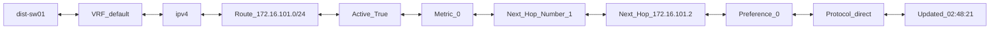
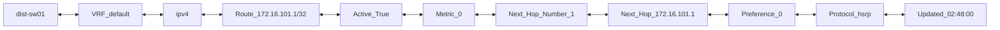
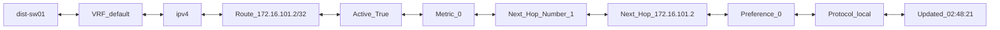

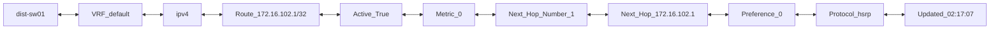
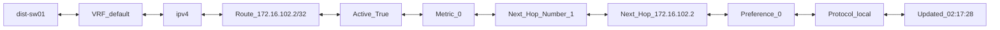
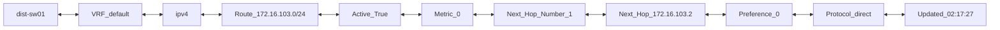

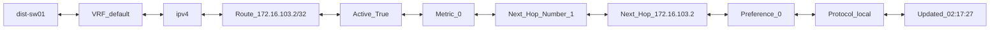
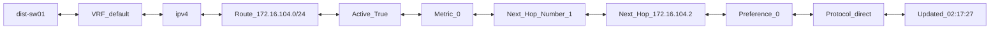
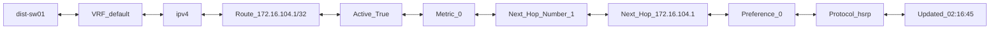

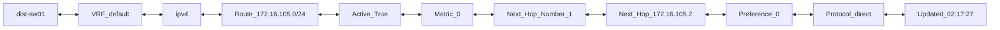
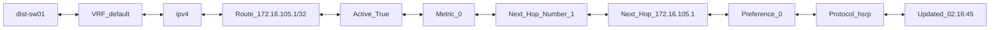
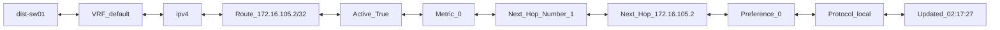
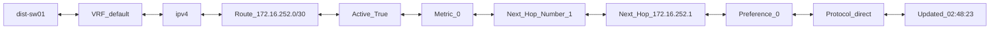
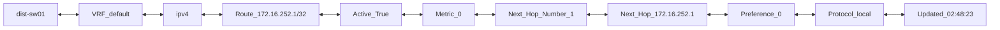

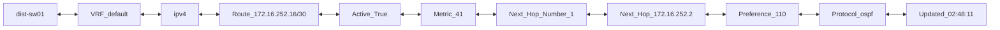

```mermaid
flowchart LR;
dist-sw01 <--> VRF_default <--> ipv4 <--> Route_172.16.252.20/30 <--> Active_True <--> Metric_41 <--> Next_Hop_Number_1 <--> Next_Hop_172.16.252.2 <--> Preference_110 <--> Protocol_ospf <--> Updated_02:48:14
```
```mermaid
flowchart LR;
dist-sw01 <--> VRF_default <--> ipv4 <--> Route_172.16.252.24/30 <--> Active_True <--> Metric_41 <--> Next_Hop_Number_1 <--> Next_Hop_172.16.252.2 <--> Preference_110 <--> Protocol_ospf <--> Updated_02:48:14
```
```mermaid
flowchart LR;
dist-sw01 <--> VRF_default <--> ipv4 <--> Route_172.16.252.28/30 <--> Active_True <--> Metric_41 <--> Next_Hop_Number_1 <--> Next_Hop_172.16.252.6 <--> Preference_110 <--> Protocol_ospf <--> Updated_02:48:11
```
```mermaid
flowchart LR;
dist-sw01 <--> VRF_default <--> ipv4 <--> Route_172.16.252.32/30 <--> Active_True <--> Metric_41 <--> Next_Hop_Number_1 <--> Next_Hop_172.16.252.6 <--> Preference_110 <--> Protocol_ospf <--> Updated_02:48:11
```
```mermaid
flowchart LR;
dist-sw01 <--> VRF_default <--> ipv4 <--> Route_172.16.252.4/30 <--> Active_True <--> Metric_0 <--> Next_Hop_Number_1 <--> Next_Hop_172.16.252.5 <--> Preference_0 <--> Protocol_direct <--> Updated_02:48:23
```
```mermaid
flowchart LR;
dist-sw01 <--> VRF_default <--> ipv4 <--> Route_172.16.252.5/32 <--> Active_True <--> Metric_0 <--> Next_Hop_Number_1 <--> Next_Hop_172.16.252.5 <--> Preference_0 <--> Protocol_local <--> Updated_02:48:23
```
```mermaid
flowchart LR;
dist-sw01 <--> VRF_default <--> ipv4 <--> Route_172.16.252.8/30 <--> Active_True <--> Metric_41 <--> Next_Hop_Number_1 <--> Next_Hop_172.16.252.2 <--> Preference_110 <--> Protocol_ospf <--> Updated_02:48:14
```
```mermaid
flowchart LR;
dist-sw01 <--> VRF_management <--> ipv4 <--> Route_0.0.0.0/0 <--> Active_True <--> Metric_0 <--> Next_Hop_Number_1 <--> Next_Hop_10.10.20.254 <--> Preference_1 <--> Protocol_static <--> Updated_02:42:21
```
```mermaid
flowchart LR;
dist-sw01 <--> VRF_management <--> ipv4 <--> Route_10.10.20.0/24 <--> Active_True <--> Metric_0 <--> Next_Hop_Number_1 <--> Next_Hop_10.10.20.177 <--> Preference_0 <--> Protocol_direct <--> Updated_02:48:19
```
```mermaid
flowchart LR;
dist-sw01 <--> VRF_management <--> ipv4 <--> Route_10.10.20.177/32 <--> Active_True <--> Metric_0 <--> Next_Hop_Number_1 <--> Next_Hop_10.10.20.177 <--> Preference_0 <--> Protocol_local <--> Updated_02:48:19
```