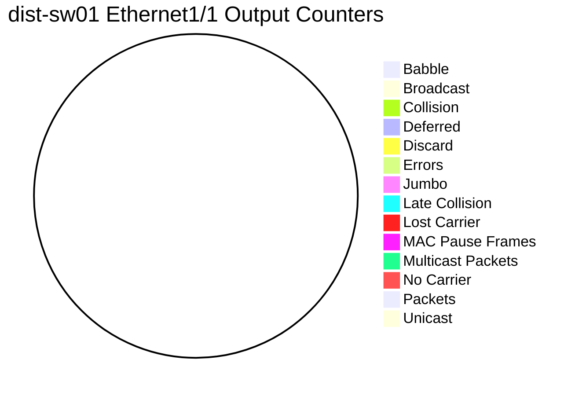
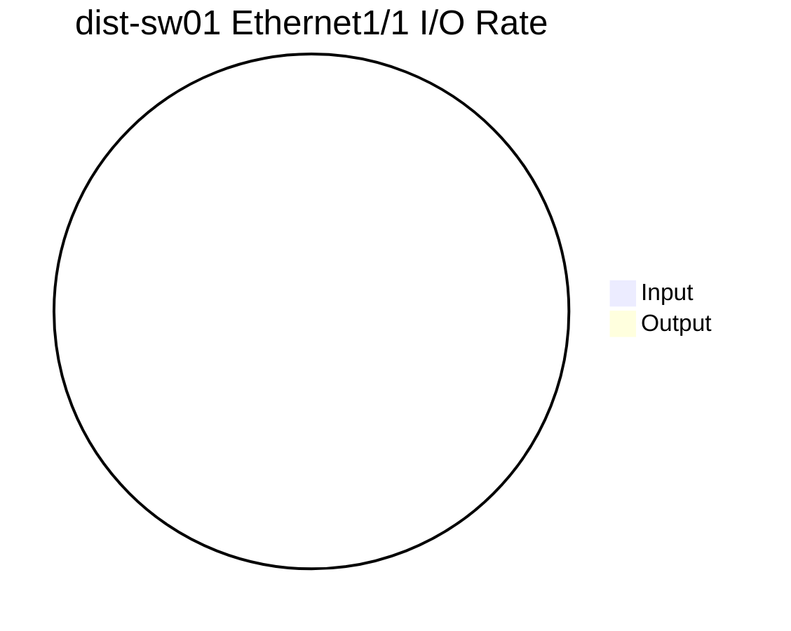
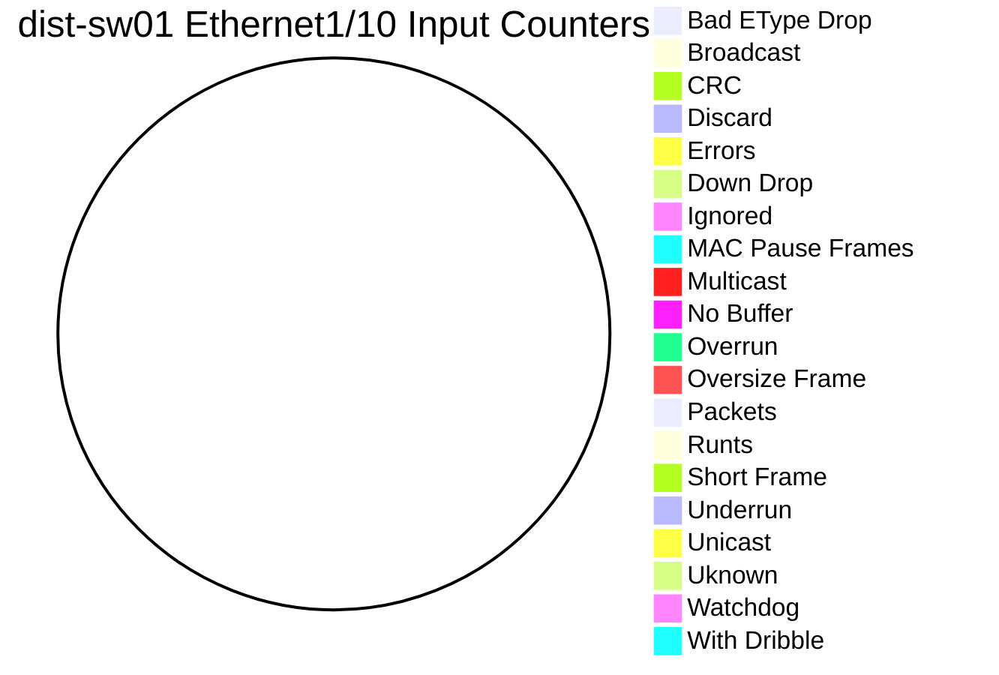
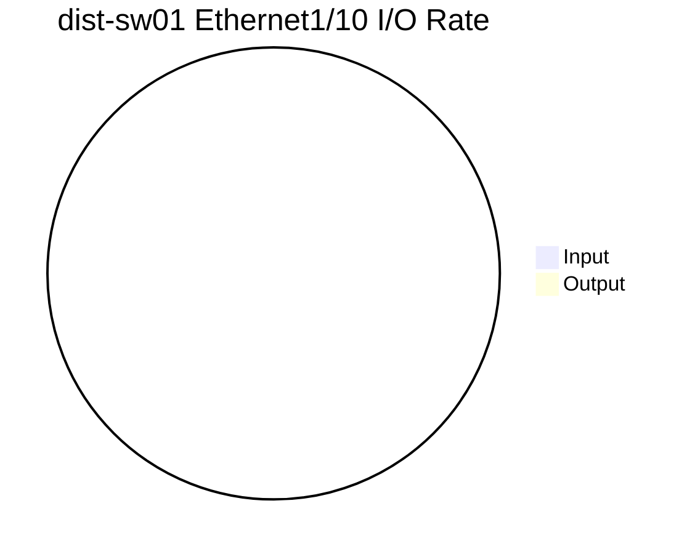
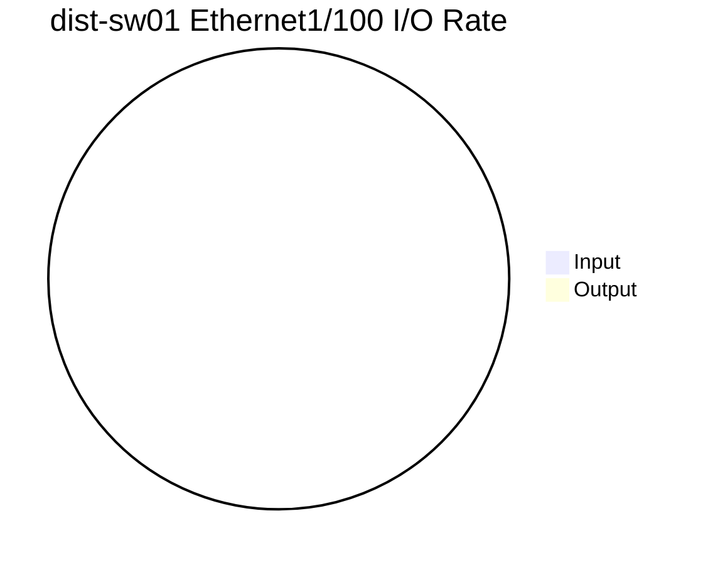
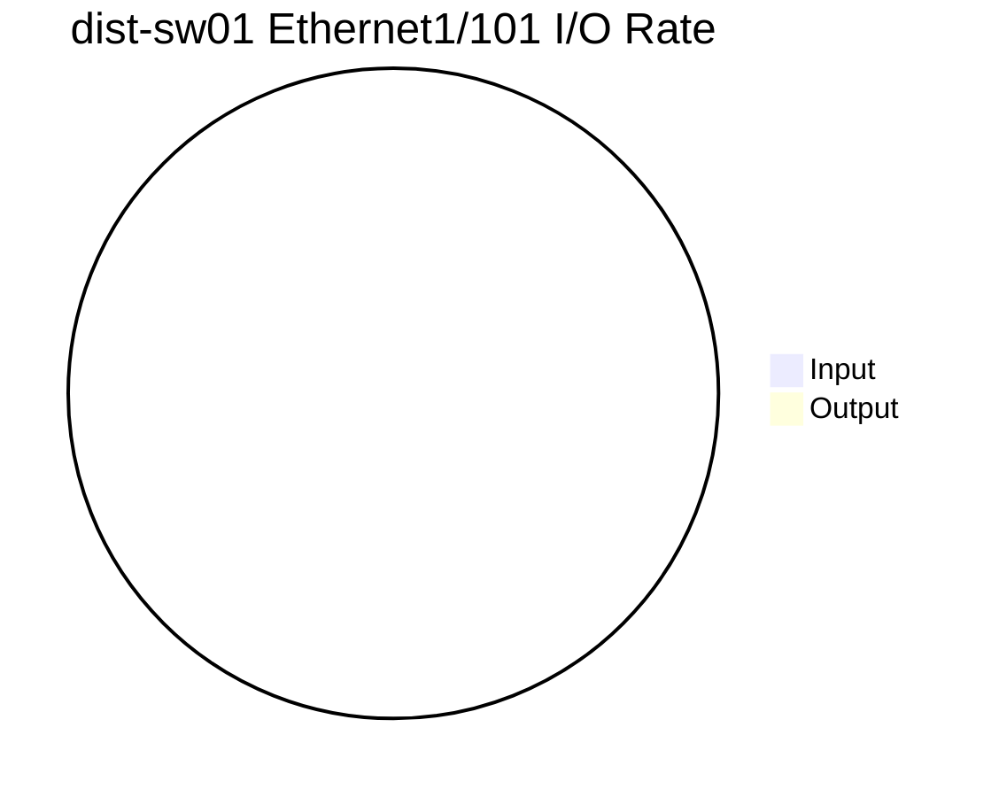
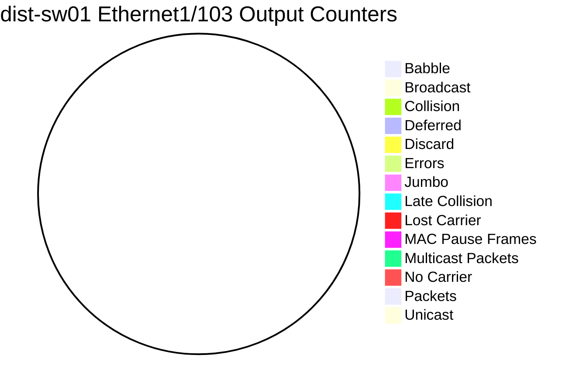

```mermaid
pie
title dist-sw01 Ethernet1/104 I/O Rate
"Input" : 0
"Output" : 0
```
```mermaid
pie
title dist-sw01 Ethernet1/105 Input Counters
"Bad EType Drop": 0
"Broadcast" : 0
"CRC" : 0
"Discard" : 0
"Errors" : 0
"Down Drop" : 0
"Ignored" : 0
"MAC Pause Frames" : 0
"Multicast" : 0
"No Buffer" : 0
"Overrun" : 0
"Oversize Frame" : 0
"Packets" : 0
"Runts" : 0
"Short Frame" : 0
"Underrun" : 0
"Unicast" : 0
"Uknown" : 0
"Watchdog" : 0
"With Dribble" : 0
```
```mermaid
pie
title dist-sw01 Ethernet1/105 Output Counters
"Babble" : 0
"Broadcast" : 0
"Collision" : 0
"Deferred" : 0
"Discard" : 0
"Errors" : 0
"Jumbo" : 0
"Late Collision" : 0
"Lost Carrier" : 0
"MAC Pause Frames" : 0
"Multicast Packets" : 0
"No Carrier" : 0
"Packets" : 0
"Unicast" : 0
```
```mermaid
pie
title dist-sw01 Ethernet1/105 I/O Rate
"Input" : 0
"Output" : 0
```
```mermaid
pie
title dist-sw01 Ethernet1/106 Input Counters
"Bad EType Drop": 0
"Broadcast" : 0
"CRC" : 0
"Discard" : 0
"Errors" : 0
"Down Drop" : 0
"Ignored" : 0
"MAC Pause Frames" : 0
"Multicast" : 0
"No Buffer" : 0
"Overrun" : 0
"Oversize Frame" : 0
"Packets" : 0
"Runts" : 0
"Short Frame" : 0
"Underrun" : 0
"Unicast" : 0
"Uknown" : 0
"Watchdog" : 0
"With Dribble" : 0
```
```mermaid
pie
title dist-sw01 Ethernet1/106 Output Counters
"Babble" : 0
"Broadcast" : 0
"Collision" : 0
"Deferred" : 0
"Discard" : 0
"Errors" : 0
"Jumbo" : 0
"Late Collision" : 0
"Lost Carrier" : 0
"MAC Pause Frames" : 0
"Multicast Packets" : 0
"No Carrier" : 0
"Packets" : 0
"Unicast" : 0
```
```mermaid
pie
title dist-sw01 Ethernet1/106 I/O Rate
"Input" : 0
"Output" : 0
```
```mermaid
pie
title dist-sw01 Ethernet1/107 Input Counters
"Bad EType Drop": 0
"Broadcast" : 0
"CRC" : 0
"Discard" : 0
"Errors" : 0
"Down Drop" : 0
"Ignored" : 0
"MAC Pause Frames" : 0
"Multicast" : 0
"No Buffer" : 0
"Overrun" : 0
"Oversize Frame" : 0
"Packets" : 0
"Runts" : 0
"Short Frame" : 0
"Underrun" : 0
"Unicast" : 0
"Uknown" : 0
"Watchdog" : 0
"With Dribble" : 0
```
```mermaid
pie
title dist-sw01 Ethernet1/107 Output Counters
"Babble" : 0
"Broadcast" : 0
"Collision" : 0
"Deferred" : 0
"Discard" : 0
"Errors" : 0
"Jumbo" : 0
"Late Collision" : 0
"Lost Carrier" : 0
"MAC Pause Frames" : 0
"Multicast Packets" : 0
"No Carrier" : 0
"Packets" : 0
"Unicast" : 0
```
```mermaid
pie
title dist-sw01 Ethernet1/107 I/O Rate
"Input" : 0
"Output" : 0
```
```mermaid
pie
title dist-sw01 Ethernet1/108 Input Counters
"Bad EType Drop": 0
"Broadcast" : 0
"CRC" : 0
"Discard" : 0
"Errors" : 0
"Down Drop" : 0
"Ignored" : 0
"MAC Pause Frames" : 0
"Multicast" : 0
"No Buffer" : 0
"Overrun" : 0
"Oversize Frame" : 0
"Packets" : 0
"Runts" : 0
"Short Frame" : 0
"Underrun" : 0
"Unicast" : 0
"Uknown" : 0
"Watchdog" : 0
"With Dribble" : 0
```
```mermaid
pie
title dist-sw01 Ethernet1/108 Output Counters
"Babble" : 0
"Broadcast" : 0
"Collision" : 0
"Deferred" : 0
"Discard" : 0
"Errors" : 0
"Jumbo" : 0
"Late Collision" : 0
"Lost Carrier" : 0
"MAC Pause Frames" : 0
"Multicast Packets" : 0
"No Carrier" : 0
"Packets" : 0
"Unicast" : 0
```
```mermaid
pie
title dist-sw01 Ethernet1/108 I/O Rate
"Input" : 0
"Output" : 0
```
```mermaid
pie
title dist-sw01 Ethernet1/109 Input Counters
"Bad EType Drop": 0
"Broadcast" : 0
"CRC" : 0
"Discard" : 0
"Errors" : 0
"Down Drop" : 0
"Ignored" : 0
"MAC Pause Frames" : 0
"Multicast" : 0
"No Buffer" : 0
"Overrun" : 0
"Oversize Frame" : 0
"Packets" : 0
"Runts" : 0
"Short Frame" : 0
"Underrun" : 0
"Unicast" : 0
"Uknown" : 0
"Watchdog" : 0
"With Dribble" : 0
```
```mermaid
pie
title dist-sw01 Ethernet1/109 Output Counters
"Babble" : 0
"Broadcast" : 0
"Collision" : 0
"Deferred" : 0
"Discard" : 0
"Errors" : 0
"Jumbo" : 0
"Late Collision" : 0
"Lost Carrier" : 0
"MAC Pause Frames" : 0
"Multicast Packets" : 0
"No Carrier" : 0
"Packets" : 0
"Unicast" : 0
```
```mermaid
pie
title dist-sw01 Ethernet1/109 I/O Rate
"Input" : 0
"Output" : 0
```
```mermaid
pie
title dist-sw01 Ethernet1/11 Input Counters
"Bad EType Drop": 0
"Broadcast" : 0
"CRC" : 0
"Discard" : 0
"Errors" : 0
"Down Drop" : 0
"Ignored" : 0
"MAC Pause Frames" : 0
"Multicast" : 0
"No Buffer" : 0
"Overrun" : 0
"Oversize Frame" : 0
"Packets" : 0
"Runts" : 0
"Short Frame" : 0
"Underrun" : 0
"Unicast" : 0
"Uknown" : 0
"Watchdog" : 0
"With Dribble" : 0
```
```mermaid
pie
title dist-sw01 Ethernet1/11 Output Counters
"Babble" : 0
"Broadcast" : 0
"Collision" : 0
"Deferred" : 0
"Discard" : 0
"Errors" : 0
"Jumbo" : 0
"Late Collision" : 0
"Lost Carrier" : 0
"MAC Pause Frames" : 0
"Multicast Packets" : 0
"No Carrier" : 0
"Packets" : 0
"Unicast" : 0
```
```mermaid
pie
title dist-sw01 Ethernet1/11 I/O Rate
"Input" : 0
"Output" : 0
```
```mermaid
pie
title dist-sw01 Ethernet1/110 Input Counters
"Bad EType Drop": 0
"Broadcast" : 0
"CRC" : 0
"Discard" : 0
"Errors" : 0
"Down Drop" : 0
"Ignored" : 0
"MAC Pause Frames" : 0
"Multicast" : 0
"No Buffer" : 0
"Overrun" : 0
"Oversize Frame" : 0
"Packets" : 0
"Runts" : 0
"Short Frame" : 0
"Underrun" : 0
"Unicast" : 0
"Uknown" : 0
"Watchdog" : 0
"With Dribble" : 0
```
```mermaid
pie
title dist-sw01 Ethernet1/110 Output Counters
"Babble" : 0
"Broadcast" : 0
"Collision" : 0
"Deferred" : 0
"Discard" : 0
"Errors" : 0
"Jumbo" : 0
"Late Collision" : 0
"Lost Carrier" : 0
"MAC Pause Frames" : 0
"Multicast Packets" : 0
"No Carrier" : 0
"Packets" : 0
"Unicast" : 0
```
```mermaid
pie
title dist-sw01 Ethernet1/110 I/O Rate
"Input" : 0
"Output" : 0
```
```mermaid
pie
title dist-sw01 Ethernet1/111 Input Counters
"Bad EType Drop": 0
"Broadcast" : 0
"CRC" : 0
"Discard" : 0
"Errors" : 0
"Down Drop" : 0
"Ignored" : 0
"MAC Pause Frames" : 0
"Multicast" : 0
"No Buffer" : 0
"Overrun" : 0
"Oversize Frame" : 0
"Packets" : 0
"Runts" : 0
"Short Frame" : 0
"Underrun" : 0
"Unicast" : 0
"Uknown" : 0
"Watchdog" : 0
"With Dribble" : 0
```
```mermaid
pie
title dist-sw01 Ethernet1/111 Output Counters
"Babble" : 0
"Broadcast" : 0
"Collision" : 0
"Deferred" : 0
"Discard" : 0
"Errors" : 0
"Jumbo" : 0
"Late Collision" : 0
"Lost Carrier" : 0
"MAC Pause Frames" : 0
"Multicast Packets" : 0
"No Carrier" : 0
"Packets" : 0
"Unicast" : 0
```
```mermaid
pie
title dist-sw01 Ethernet1/111 I/O Rate
"Input" : 0
"Output" : 0
```
```mermaid
pie
title dist-sw01 Ethernet1/112 Input Counters
"Bad EType Drop": 0
"Broadcast" : 0
"CRC" : 0
"Discard" : 0
"Errors" : 0
"Down Drop" : 0
"Ignored" : 0
"MAC Pause Frames" : 0
"Multicast" : 0
"No Buffer" : 0
"Overrun" : 0
"Oversize Frame" : 0
"Packets" : 0
"Runts" : 0
"Short Frame" : 0
"Underrun" : 0
"Unicast" : 0
"Uknown" : 0
"Watchdog" : 0
"With Dribble" : 0
```
```mermaid
pie
title dist-sw01 Ethernet1/112 Output Counters
"Babble" : 0
"Broadcast" : 0
"Collision" : 0
"Deferred" : 0
"Discard" : 0
"Errors" : 0
"Jumbo" : 0
"Late Collision" : 0
"Lost Carrier" : 0
"MAC Pause Frames" : 0
"Multicast Packets" : 0
"No Carrier" : 0
"Packets" : 0
"Unicast" : 0
```
```mermaid
pie
title dist-sw01 Ethernet1/112 I/O Rate
"Input" : 0
"Output" : 0
```
```mermaid
pie
title dist-sw01 Ethernet1/113 Input Counters
"Bad EType Drop": 0
"Broadcast" : 0
"CRC" : 0
"Discard" : 0
"Errors" : 0
"Down Drop" : 0
"Ignored" : 0
"MAC Pause Frames" : 0
"Multicast" : 0
"No Buffer" : 0
"Overrun" : 0
"Oversize Frame" : 0
"Packets" : 0
"Runts" : 0
"Short Frame" : 0
"Underrun" : 0
"Unicast" : 0
"Uknown" : 0
"Watchdog" : 0
"With Dribble" : 0
```
```mermaid
pie
title dist-sw01 Ethernet1/113 Output Counters
"Babble" : 0
"Broadcast" : 0
"Collision" : 0
"Deferred" : 0
"Discard" : 0
"Errors" : 0
"Jumbo" : 0
"Late Collision" : 0
"Lost Carrier" : 0
"MAC Pause Frames" : 0
"Multicast Packets" : 0
"No Carrier" : 0
"Packets" : 0
"Unicast" : 0
```
```mermaid
pie
title dist-sw01 Ethernet1/113 I/O Rate
"Input" : 0
"Output" : 0
```
```mermaid
pie
title dist-sw01 Ethernet1/114 Input Counters
"Bad EType Drop": 0
"Broadcast" : 0
"CRC" : 0
"Discard" : 0
"Errors" : 0
"Down Drop" : 0
"Ignored" : 0
"MAC Pause Frames" : 0
"Multicast" : 0
"No Buffer" : 0
"Overrun" : 0
"Oversize Frame" : 0
"Packets" : 0
"Runts" : 0
"Short Frame" : 0
"Underrun" : 0
"Unicast" : 0
"Uknown" : 0
"Watchdog" : 0
"With Dribble" : 0
```
```mermaid
pie
title dist-sw01 Ethernet1/114 Output Counters
"Babble" : 0
"Broadcast" : 0
"Collision" : 0
"Deferred" : 0
"Discard" : 0
"Errors" : 0
"Jumbo" : 0
"Late Collision" : 0
"Lost Carrier" : 0
"MAC Pause Frames" : 0
"Multicast Packets" : 0
"No Carrier" : 0
"Packets" : 0
"Unicast" : 0
```
```mermaid
pie
title dist-sw01 Ethernet1/114 I/O Rate
"Input" : 0
"Output" : 0
```
```mermaid
pie
title dist-sw01 Ethernet1/115 Input Counters
"Bad EType Drop": 0
"Broadcast" : 0
"CRC" : 0
"Discard" : 0
"Errors" : 0
"Down Drop" : 0
"Ignored" : 0
"MAC Pause Frames" : 0
"Multicast" : 0
"No Buffer" : 0
"Overrun" : 0
"Oversize Frame" : 0
"Packets" : 0
"Runts" : 0
"Short Frame" : 0
"Underrun" : 0
"Unicast" : 0
"Uknown" : 0
"Watchdog" : 0
"With Dribble" : 0
```
```mermaid
pie
title dist-sw01 Ethernet1/115 Output Counters
"Babble" : 0
"Broadcast" : 0
"Collision" : 0
"Deferred" : 0
"Discard" : 0
"Errors" : 0
"Jumbo" : 0
"Late Collision" : 0
"Lost Carrier" : 0
"MAC Pause Frames" : 0
"Multicast Packets" : 0
"No Carrier" : 0
"Packets" : 0
"Unicast" : 0
```
```mermaid
pie
title dist-sw01 Ethernet1/115 I/O Rate
"Input" : 0
"Output" : 0
```
```mermaid
pie
title dist-sw01 Ethernet1/116 Input Counters
"Bad EType Drop": 0
"Broadcast" : 0
"CRC" : 0
"Discard" : 0
"Errors" : 0
"Down Drop" : 0
"Ignored" : 0
"MAC Pause Frames" : 0
"Multicast" : 0
"No Buffer" : 0
"Overrun" : 0
"Oversize Frame" : 0
"Packets" : 0
"Runts" : 0
"Short Frame" : 0
"Underrun" : 0
"Unicast" : 0
"Uknown" : 0
"Watchdog" : 0
"With Dribble" : 0
```
```mermaid
pie
title dist-sw01 Ethernet1/116 Output Counters
"Babble" : 0
"Broadcast" : 0
"Collision" : 0
"Deferred" : 0
"Discard" : 0
"Errors" : 0
"Jumbo" : 0
"Late Collision" : 0
"Lost Carrier" : 0
"MAC Pause Frames" : 0
"Multicast Packets" : 0
"No Carrier" : 0
"Packets" : 0
"Unicast" : 0
```
```mermaid
pie
title dist-sw01 Ethernet1/116 I/O Rate
"Input" : 0
"Output" : 0
```
```mermaid
pie
title dist-sw01 Ethernet1/117 Input Counters
"Bad EType Drop": 0
"Broadcast" : 0
"CRC" : 0
"Discard" : 0
"Errors" : 0
"Down Drop" : 0
"Ignored" : 0
"MAC Pause Frames" : 0
"Multicast" : 0
"No Buffer" : 0
"Overrun" : 0
"Oversize Frame" : 0
"Packets" : 0
"Runts" : 0
"Short Frame" : 0
"Underrun" : 0
"Unicast" : 0
"Uknown" : 0
"Watchdog" : 0
"With Dribble" : 0
```
```mermaid
pie
title dist-sw01 Ethernet1/117 Output Counters
"Babble" : 0
"Broadcast" : 0
"Collision" : 0
"Deferred" : 0
"Discard" : 0
"Errors" : 0
"Jumbo" : 0
"Late Collision" : 0
"Lost Carrier" : 0
"MAC Pause Frames" : 0
"Multicast Packets" : 0
"No Carrier" : 0
"Packets" : 0
"Unicast" : 0
```
```mermaid
pie
title dist-sw01 Ethernet1/117 I/O Rate
"Input" : 0
"Output" : 0
```
```mermaid
pie
title dist-sw01 Ethernet1/118 Input Counters
"Bad EType Drop": 0
"Broadcast" : 0
"CRC" : 0
"Discard" : 0
"Errors" : 0
"Down Drop" : 0
"Ignored" : 0
"MAC Pause Frames" : 0
"Multicast" : 0
"No Buffer" : 0
"Overrun" : 0
"Oversize Frame" : 0
"Packets" : 0
"Runts" : 0
"Short Frame" : 0
"Underrun" : 0
"Unicast" : 0
"Uknown" : 0
"Watchdog" : 0
"With Dribble" : 0
```
```mermaid
pie
title dist-sw01 Ethernet1/118 Output Counters
"Babble" : 0
"Broadcast" : 0
"Collision" : 0
"Deferred" : 0
"Discard" : 0
"Errors" : 0
"Jumbo" : 0
"Late Collision" : 0
"Lost Carrier" : 0
"MAC Pause Frames" : 0
"Multicast Packets" : 0
"No Carrier" : 0
"Packets" : 0
"Unicast" : 0
```
```mermaid
pie
title dist-sw01 Ethernet1/118 I/O Rate
"Input" : 0
"Output" : 0
```
```mermaid
pie
title dist-sw01 Ethernet1/119 Input Counters
"Bad EType Drop": 0
"Broadcast" : 0
"CRC" : 0
"Discard" : 0
"Errors" : 0
"Down Drop" : 0
"Ignored" : 0
"MAC Pause Frames" : 0
"Multicast" : 0
"No Buffer" : 0
"Overrun" : 0
"Oversize Frame" : 0
"Packets" : 0
"Runts" : 0
"Short Frame" : 0
"Underrun" : 0
"Unicast" : 0
"Uknown" : 0
"Watchdog" : 0
"With Dribble" : 0
```
```mermaid
pie
title dist-sw01 Ethernet1/119 Output Counters
"Babble" : 0
"Broadcast" : 0
"Collision" : 0
"Deferred" : 0
"Discard" : 0
"Errors" : 0
"Jumbo" : 0
"Late Collision" : 0
"Lost Carrier" : 0
"MAC Pause Frames" : 0
"Multicast Packets" : 0
"No Carrier" : 0
"Packets" : 0
"Unicast" : 0
```
```mermaid
pie
title dist-sw01 Ethernet1/119 I/O Rate
"Input" : 0
"Output" : 0
```
```mermaid
pie
title dist-sw01 Ethernet1/12 Input Counters
"Bad EType Drop": 0
"Broadcast" : 0
"CRC" : 0
"Discard" : 0
"Errors" : 0
"Down Drop" : 0
"Ignored" : 0
"MAC Pause Frames" : 0
"Multicast" : 0
"No Buffer" : 0
"Overrun" : 0
"Oversize Frame" : 0
"Packets" : 0
"Runts" : 0
"Short Frame" : 0
"Underrun" : 0
"Unicast" : 0
"Uknown" : 0
"Watchdog" : 0
"With Dribble" : 0
```
```mermaid
pie
title dist-sw01 Ethernet1/12 Output Counters
"Babble" : 0
"Broadcast" : 0
"Collision" : 0
"Deferred" : 0
"Discard" : 0
"Errors" : 0
"Jumbo" : 0
"Late Collision" : 0
"Lost Carrier" : 0
"MAC Pause Frames" : 0
"Multicast Packets" : 0
"No Carrier" : 0
"Packets" : 0
"Unicast" : 0
```
```mermaid
pie
title dist-sw01 Ethernet1/12 I/O Rate
"Input" : 0
"Output" : 0
```
```mermaid
pie
title dist-sw01 Ethernet1/120 Input Counters
"Bad EType Drop": 0
"Broadcast" : 0
"CRC" : 0
"Discard" : 0
"Errors" : 0
"Down Drop" : 0
"Ignored" : 0
"MAC Pause Frames" : 0
"Multicast" : 0
"No Buffer" : 0
"Overrun" : 0
"Oversize Frame" : 0
"Packets" : 0
"Runts" : 0
"Short Frame" : 0
"Underrun" : 0
"Unicast" : 0
"Uknown" : 0
"Watchdog" : 0
"With Dribble" : 0
```
```mermaid
pie
title dist-sw01 Ethernet1/120 Output Counters
"Babble" : 0
"Broadcast" : 0
"Collision" : 0
"Deferred" : 0
"Discard" : 0
"Errors" : 0
"Jumbo" : 0
"Late Collision" : 0
"Lost Carrier" : 0
"MAC Pause Frames" : 0
"Multicast Packets" : 0
"No Carrier" : 0
"Packets" : 0
"Unicast" : 0
```
```mermaid
pie
title dist-sw01 Ethernet1/120 I/O Rate
"Input" : 0
"Output" : 0
```
```mermaid
pie
title dist-sw01 Ethernet1/121 Input Counters
"Bad EType Drop": 0
"Broadcast" : 0
"CRC" : 0
"Discard" : 0
"Errors" : 0
"Down Drop" : 0
"Ignored" : 0
"MAC Pause Frames" : 0
"Multicast" : 0
"No Buffer" : 0
"Overrun" : 0
"Oversize Frame" : 0
"Packets" : 0
"Runts" : 0
"Short Frame" : 0
"Underrun" : 0
"Unicast" : 0
"Uknown" : 0
"Watchdog" : 0
"With Dribble" : 0
```
```mermaid
pie
title dist-sw01 Ethernet1/121 Output Counters
"Babble" : 0
"Broadcast" : 0
"Collision" : 0
"Deferred" : 0
"Discard" : 0
"Errors" : 0
"Jumbo" : 0
"Late Collision" : 0
"Lost Carrier" : 0
"MAC Pause Frames" : 0
"Multicast Packets" : 0
"No Carrier" : 0
"Packets" : 0
"Unicast" : 0
```
```mermaid
pie
title dist-sw01 Ethernet1/121 I/O Rate
"Input" : 0
"Output" : 0
```
```mermaid
pie
title dist-sw01 Ethernet1/122 Input Counters
"Bad EType Drop": 0
"Broadcast" : 0
"CRC" : 0
"Discard" : 0
"Errors" : 0
"Down Drop" : 0
"Ignored" : 0
"MAC Pause Frames" : 0
"Multicast" : 0
"No Buffer" : 0
"Overrun" : 0
"Oversize Frame" : 0
"Packets" : 0
"Runts" : 0
"Short Frame" : 0
"Underrun" : 0
"Unicast" : 0
"Uknown" : 0
"Watchdog" : 0
"With Dribble" : 0
```
```mermaid
pie
title dist-sw01 Ethernet1/122 Output Counters
"Babble" : 0
"Broadcast" : 0
"Collision" : 0
"Deferred" : 0
"Discard" : 0
"Errors" : 0
"Jumbo" : 0
"Late Collision" : 0
"Lost Carrier" : 0
"MAC Pause Frames" : 0
"Multicast Packets" : 0
"No Carrier" : 0
"Packets" : 0
"Unicast" : 0
```
```mermaid
pie
title dist-sw01 Ethernet1/122 I/O Rate
"Input" : 0
"Output" : 0
```
```mermaid
pie
title dist-sw01 Ethernet1/123 Input Counters
"Bad EType Drop": 0
"Broadcast" : 0
"CRC" : 0
"Discard" : 0
"Errors" : 0
"Down Drop" : 0
"Ignored" : 0
"MAC Pause Frames" : 0
"Multicast" : 0
"No Buffer" : 0
"Overrun" : 0
"Oversize Frame" : 0
"Packets" : 0
"Runts" : 0
"Short Frame" : 0
"Underrun" : 0
"Unicast" : 0
"Uknown" : 0
"Watchdog" : 0
"With Dribble" : 0
```
```mermaid
pie
title dist-sw01 Ethernet1/123 Output Counters
"Babble" : 0
"Broadcast" : 0
"Collision" : 0
"Deferred" : 0
"Discard" : 0
"Errors" : 0
"Jumbo" : 0
"Late Collision" : 0
"Lost Carrier" : 0
"MAC Pause Frames" : 0
"Multicast Packets" : 0
"No Carrier" : 0
"Packets" : 0
"Unicast" : 0
```
```mermaid
pie
title dist-sw01 Ethernet1/123 I/O Rate
"Input" : 0
"Output" : 0
```
```mermaid
pie
title dist-sw01 Ethernet1/124 Input Counters
"Bad EType Drop": 0
"Broadcast" : 0
"CRC" : 0
"Discard" : 0
"Errors" : 0
"Down Drop" : 0
"Ignored" : 0
"MAC Pause Frames" : 0
"Multicast" : 0
"No Buffer" : 0
"Overrun" : 0
"Oversize Frame" : 0
"Packets" : 0
"Runts" : 0
"Short Frame" : 0
"Underrun" : 0
"Unicast" : 0
"Uknown" : 0
"Watchdog" : 0
"With Dribble" : 0
```
```mermaid
pie
title dist-sw01 Ethernet1/124 Output Counters
"Babble" : 0
"Broadcast" : 0
"Collision" : 0
"Deferred" : 0
"Discard" : 0
"Errors" : 0
"Jumbo" : 0
"Late Collision" : 0
"Lost Carrier" : 0
"MAC Pause Frames" : 0
"Multicast Packets" : 0
"No Carrier" : 0
"Packets" : 0
"Unicast" : 0
```
```mermaid
pie
title dist-sw01 Ethernet1/124 I/O Rate
"Input" : 0
"Output" : 0
```
```mermaid
pie
title dist-sw01 Ethernet1/125 Input Counters
"Bad EType Drop": 0
"Broadcast" : 0
"CRC" : 0
"Discard" : 0
"Errors" : 0
"Down Drop" : 0
"Ignored" : 0
"MAC Pause Frames" : 0
"Multicast" : 0
"No Buffer" : 0
"Overrun" : 0
"Oversize Frame" : 0
"Packets" : 0
"Runts" : 0
"Short Frame" : 0
"Underrun" : 0
"Unicast" : 0
"Uknown" : 0
"Watchdog" : 0
"With Dribble" : 0
```
```mermaid
pie
title dist-sw01 Ethernet1/125 Output Counters
"Babble" : 0
"Broadcast" : 0
"Collision" : 0
"Deferred" : 0
"Discard" : 0
"Errors" : 0
"Jumbo" : 0
"Late Collision" : 0
"Lost Carrier" : 0
"MAC Pause Frames" : 0
"Multicast Packets" : 0
"No Carrier" : 0
"Packets" : 0
"Unicast" : 0
```
```mermaid
pie
title dist-sw01 Ethernet1/125 I/O Rate
"Input" : 0
"Output" : 0
```
```mermaid
pie
title dist-sw01 Ethernet1/126 Input Counters
"Bad EType Drop": 0
"Broadcast" : 0
"CRC" : 0
"Discard" : 0
"Errors" : 0
"Down Drop" : 0
"Ignored" : 0
"MAC Pause Frames" : 0
"Multicast" : 0
"No Buffer" : 0
"Overrun" : 0
"Oversize Frame" : 0
"Packets" : 0
"Runts" : 0
"Short Frame" : 0
"Underrun" : 0
"Unicast" : 0
"Uknown" : 0
"Watchdog" : 0
"With Dribble" : 0
```
```mermaid
pie
title dist-sw01 Ethernet1/126 Output Counters
"Babble" : 0
"Broadcast" : 0
"Collision" : 0
"Deferred" : 0
"Discard" : 0
"Errors" : 0
"Jumbo" : 0
"Late Collision" : 0
"Lost Carrier" : 0
"MAC Pause Frames" : 0
"Multicast Packets" : 0
"No Carrier" : 0
"Packets" : 0
"Unicast" : 0
```
```mermaid
pie
title dist-sw01 Ethernet1/126 I/O Rate
"Input" : 0
"Output" : 0
```
```mermaid
pie
title dist-sw01 Ethernet1/127 Input Counters
"Bad EType Drop": 0
"Broadcast" : 0
"CRC" : 0
"Discard" : 0
"Errors" : 0
"Down Drop" : 0
"Ignored" : 0
"MAC Pause Frames" : 0
"Multicast" : 0
"No Buffer" : 0
"Overrun" : 0
"Oversize Frame" : 0
"Packets" : 0
"Runts" : 0
"Short Frame" : 0
"Underrun" : 0
"Unicast" : 0
"Uknown" : 0
"Watchdog" : 0
"With Dribble" : 0
```
```mermaid
pie
title dist-sw01 Ethernet1/127 Output Counters
"Babble" : 0
"Broadcast" : 0
"Collision" : 0
"Deferred" : 0
"Discard" : 0
"Errors" : 0
"Jumbo" : 0
"Late Collision" : 0
"Lost Carrier" : 0
"MAC Pause Frames" : 0
"Multicast Packets" : 0
"No Carrier" : 0
"Packets" : 0
"Unicast" : 0
```
```mermaid
pie
title dist-sw01 Ethernet1/127 I/O Rate
"Input" : 0
"Output" : 0
```
```mermaid
pie
title dist-sw01 Ethernet1/128 Input Counters
"Bad EType Drop": 0
"Broadcast" : 0
"CRC" : 0
"Discard" : 0
"Errors" : 0
"Down Drop" : 0
"Ignored" : 0
"MAC Pause Frames" : 0
"Multicast" : 0
"No Buffer" : 0
"Overrun" : 0
"Oversize Frame" : 0
"Packets" : 0
"Runts" : 0
"Short Frame" : 0
"Underrun" : 0
"Unicast" : 0
"Uknown" : 0
"Watchdog" : 0
"With Dribble" : 0
```
```mermaid
pie
title dist-sw01 Ethernet1/128 Output Counters
"Babble" : 0
"Broadcast" : 0
"Collision" : 0
"Deferred" : 0
"Discard" : 0
"Errors" : 0
"Jumbo" : 0
"Late Collision" : 0
"Lost Carrier" : 0
"MAC Pause Frames" : 0
"Multicast Packets" : 0
"No Carrier" : 0
"Packets" : 0
"Unicast" : 0
```
```mermaid
pie
title dist-sw01 Ethernet1/128 I/O Rate
"Input" : 0
"Output" : 0
```
```mermaid
pie
title dist-sw01 Ethernet1/13 Input Counters
"Bad EType Drop": 0
"Broadcast" : 0
"CRC" : 0
"Discard" : 0
"Errors" : 0
"Down Drop" : 0
"Ignored" : 0
"MAC Pause Frames" : 0
"Multicast" : 0
"No Buffer" : 0
"Overrun" : 0
"Oversize Frame" : 0
"Packets" : 0
"Runts" : 0
"Short Frame" : 0
"Underrun" : 0
"Unicast" : 0
"Uknown" : 0
"Watchdog" : 0
"With Dribble" : 0
```
```mermaid
pie
title dist-sw01 Ethernet1/13 Output Counters
"Babble" : 0
"Broadcast" : 0
"Collision" : 0
"Deferred" : 0
"Discard" : 0
"Errors" : 0
"Jumbo" : 0
"Late Collision" : 0
"Lost Carrier" : 0
"MAC Pause Frames" : 0
"Multicast Packets" : 0
"No Carrier" : 0
"Packets" : 0
"Unicast" : 0
```
```mermaid
pie
title dist-sw01 Ethernet1/13 I/O Rate
"Input" : 0
"Output" : 0
```
```mermaid
pie
title dist-sw01 Ethernet1/14 Input Counters
"Bad EType Drop": 0
"Broadcast" : 0
"CRC" : 0
"Discard" : 0
"Errors" : 0
"Down Drop" : 0
"Ignored" : 0
"MAC Pause Frames" : 0
"Multicast" : 0
"No Buffer" : 0
"Overrun" : 0
"Oversize Frame" : 0
"Packets" : 0
"Runts" : 0
"Short Frame" : 0
"Underrun" : 0
"Unicast" : 0
"Uknown" : 0
"Watchdog" : 0
"With Dribble" : 0
```
```mermaid
pie
title dist-sw01 Ethernet1/14 Output Counters
"Babble" : 0
"Broadcast" : 0
"Collision" : 0
"Deferred" : 0
"Discard" : 0
"Errors" : 0
"Jumbo" : 0
"Late Collision" : 0
"Lost Carrier" : 0
"MAC Pause Frames" : 0
"Multicast Packets" : 0
"No Carrier" : 0
"Packets" : 0
"Unicast" : 0
```
```mermaid
pie
title dist-sw01 Ethernet1/14 I/O Rate
"Input" : 0
"Output" : 0
```
```mermaid
pie
title dist-sw01 Ethernet1/15 Input Counters
"Bad EType Drop": 0
"Broadcast" : 0
"CRC" : 0
"Discard" : 0
"Errors" : 0
"Down Drop" : 0
"Ignored" : 0
"MAC Pause Frames" : 0
"Multicast" : 0
"No Buffer" : 0
"Overrun" : 0
"Oversize Frame" : 0
"Packets" : 0
"Runts" : 0
"Short Frame" : 0
"Underrun" : 0
"Unicast" : 0
"Uknown" : 0
"Watchdog" : 0
"With Dribble" : 0
```
```mermaid
pie
title dist-sw01 Ethernet1/15 Output Counters
"Babble" : 0
"Broadcast" : 0
"Collision" : 0
"Deferred" : 0
"Discard" : 0
"Errors" : 0
"Jumbo" : 0
"Late Collision" : 0
"Lost Carrier" : 0
"MAC Pause Frames" : 0
"Multicast Packets" : 0
"No Carrier" : 0
"Packets" : 0
"Unicast" : 0
```
```mermaid
pie
title dist-sw01 Ethernet1/15 I/O Rate
"Input" : 0
"Output" : 0
```
```mermaid
pie
title dist-sw01 Ethernet1/16 Input Counters
"Bad EType Drop": 0
"Broadcast" : 0
"CRC" : 0
"Discard" : 0
"Errors" : 0
"Down Drop" : 0
"Ignored" : 0
"MAC Pause Frames" : 0
"Multicast" : 0
"No Buffer" : 0
"Overrun" : 0
"Oversize Frame" : 0
"Packets" : 0
"Runts" : 0
"Short Frame" : 0
"Underrun" : 0
"Unicast" : 0
"Uknown" : 0
"Watchdog" : 0
"With Dribble" : 0
```
```mermaid
pie
title dist-sw01 Ethernet1/16 Output Counters
"Babble" : 0
"Broadcast" : 0
"Collision" : 0
"Deferred" : 0
"Discard" : 0
"Errors" : 0
"Jumbo" : 0
"Late Collision" : 0
"Lost Carrier" : 0
"MAC Pause Frames" : 0
"Multicast Packets" : 0
"No Carrier" : 0
"Packets" : 0
"Unicast" : 0
```
```mermaid
pie
title dist-sw01 Ethernet1/16 I/O Rate
"Input" : 0
"Output" : 0
```
```mermaid
pie
title dist-sw01 Ethernet1/17 Input Counters
"Bad EType Drop": 0
"Broadcast" : 0
"CRC" : 0
"Discard" : 0
"Errors" : 0
"Down Drop" : 0
"Ignored" : 0
"MAC Pause Frames" : 0
"Multicast" : 0
"No Buffer" : 0
"Overrun" : 0
"Oversize Frame" : 0
"Packets" : 0
"Runts" : 0
"Short Frame" : 0
"Underrun" : 0
"Unicast" : 0
"Uknown" : 0
"Watchdog" : 0
"With Dribble" : 0
```
```mermaid
pie
title dist-sw01 Ethernet1/17 Output Counters
"Babble" : 0
"Broadcast" : 0
"Collision" : 0
"Deferred" : 0
"Discard" : 0
"Errors" : 0
"Jumbo" : 0
"Late Collision" : 0
"Lost Carrier" : 0
"MAC Pause Frames" : 0
"Multicast Packets" : 0
"No Carrier" : 0
"Packets" : 0
"Unicast" : 0
```
```mermaid
pie
title dist-sw01 Ethernet1/17 I/O Rate
"Input" : 0
"Output" : 0
```
```mermaid
pie
title dist-sw01 Ethernet1/18 Input Counters
"Bad EType Drop": 0
"Broadcast" : 0
"CRC" : 0
"Discard" : 0
"Errors" : 0
"Down Drop" : 0
"Ignored" : 0
"MAC Pause Frames" : 0
"Multicast" : 0
"No Buffer" : 0
"Overrun" : 0
"Oversize Frame" : 0
"Packets" : 0
"Runts" : 0
"Short Frame" : 0
"Underrun" : 0
"Unicast" : 0
"Uknown" : 0
"Watchdog" : 0
"With Dribble" : 0
```
```mermaid
pie
title dist-sw01 Ethernet1/18 Output Counters
"Babble" : 0
"Broadcast" : 0
"Collision" : 0
"Deferred" : 0
"Discard" : 0
"Errors" : 0
"Jumbo" : 0
"Late Collision" : 0
"Lost Carrier" : 0
"MAC Pause Frames" : 0
"Multicast Packets" : 0
"No Carrier" : 0
"Packets" : 0
"Unicast" : 0
```
```mermaid
pie
title dist-sw01 Ethernet1/18 I/O Rate
"Input" : 0
"Output" : 0
```
```mermaid
pie
title dist-sw01 Ethernet1/19 Input Counters
"Bad EType Drop": 0
"Broadcast" : 0
"CRC" : 0
"Discard" : 0
"Errors" : 0
"Down Drop" : 0
"Ignored" : 0
"MAC Pause Frames" : 0
"Multicast" : 0
"No Buffer" : 0
"Overrun" : 0
"Oversize Frame" : 0
"Packets" : 0
"Runts" : 0
"Short Frame" : 0
"Underrun" : 0
"Unicast" : 0
"Uknown" : 0
"Watchdog" : 0
"With Dribble" : 0
```
```mermaid
pie
title dist-sw01 Ethernet1/19 Output Counters
"Babble" : 0
"Broadcast" : 0
"Collision" : 0
"Deferred" : 0
"Discard" : 0
"Errors" : 0
"Jumbo" : 0
"Late Collision" : 0
"Lost Carrier" : 0
"MAC Pause Frames" : 0
"Multicast Packets" : 0
"No Carrier" : 0
"Packets" : 0
"Unicast" : 0
```
```mermaid
pie
title dist-sw01 Ethernet1/19 I/O Rate
"Input" : 0
"Output" : 0
```
```mermaid
pie
title dist-sw01 Ethernet1/2 Input Counters
"Bad EType Drop": 0
"Broadcast" : 0
"CRC" : 0
"Discard" : 0
"Errors" : 0
"Down Drop" : 0
"Ignored" : 0
"MAC Pause Frames" : 0
"Multicast" : 0
"No Buffer" : 0
"Overrun" : 0
"Oversize Frame" : 0
"Packets" : 0
"Runts" : 0
"Short Frame" : 0
"Underrun" : 0
"Unicast" : 0
"Uknown" : 0
"Watchdog" : 0
"With Dribble" : 0
```
```mermaid
pie
title dist-sw01 Ethernet1/2 Output Counters
"Babble" : 0
"Broadcast" : 0
"Collision" : 0
"Deferred" : 0
"Discard" : 0
"Errors" : 0
"Jumbo" : 0
"Late Collision" : 0
"Lost Carrier" : 0
"MAC Pause Frames" : 0
"Multicast Packets" : 0
"No Carrier" : 0
"Packets" : 0
"Unicast" : 0
```
```mermaid
pie
title dist-sw01 Ethernet1/2 I/O Rate
"Input" : 0
"Output" : 0
```
```mermaid
pie
title dist-sw01 Ethernet1/20 Input Counters
"Bad EType Drop": 0
"Broadcast" : 0
"CRC" : 0
"Discard" : 0
"Errors" : 0
"Down Drop" : 0
"Ignored" : 0
"MAC Pause Frames" : 0
"Multicast" : 0
"No Buffer" : 0
"Overrun" : 0
"Oversize Frame" : 0
"Packets" : 0
"Runts" : 0
"Short Frame" : 0
"Underrun" : 0
"Unicast" : 0
"Uknown" : 0
"Watchdog" : 0
"With Dribble" : 0
```
```mermaid
pie
title dist-sw01 Ethernet1/20 Output Counters
"Babble" : 0
"Broadcast" : 0
"Collision" : 0
"Deferred" : 0
"Discard" : 0
"Errors" : 0
"Jumbo" : 0
"Late Collision" : 0
"Lost Carrier" : 0
"MAC Pause Frames" : 0
"Multicast Packets" : 0
"No Carrier" : 0
"Packets" : 0
"Unicast" : 0
```
```mermaid
pie
title dist-sw01 Ethernet1/20 I/O Rate
"Input" : 0
"Output" : 0
```
```mermaid
pie
title dist-sw01 Ethernet1/21 Input Counters
"Bad EType Drop": 0
"Broadcast" : 0
"CRC" : 0
"Discard" : 0
"Errors" : 0
"Down Drop" : 0
"Ignored" : 0
"MAC Pause Frames" : 0
"Multicast" : 0
"No Buffer" : 0
"Overrun" : 0
"Oversize Frame" : 0
"Packets" : 0
"Runts" : 0
"Short Frame" : 0
"Underrun" : 0
"Unicast" : 0
"Uknown" : 0
"Watchdog" : 0
"With Dribble" : 0
```
```mermaid
pie
title dist-sw01 Ethernet1/21 Output Counters
"Babble" : 0
"Broadcast" : 0
"Collision" : 0
"Deferred" : 0
"Discard" : 0
"Errors" : 0
"Jumbo" : 0
"Late Collision" : 0
"Lost Carrier" : 0
"MAC Pause Frames" : 0
"Multicast Packets" : 0
"No Carrier" : 0
"Packets" : 0
"Unicast" : 0
```
```mermaid
pie
title dist-sw01 Ethernet1/21 I/O Rate
"Input" : 0
"Output" : 0
```
```mermaid
pie
title dist-sw01 Ethernet1/22 Input Counters
"Bad EType Drop": 0
"Broadcast" : 0
"CRC" : 0
"Discard" : 0
"Errors" : 0
"Down Drop" : 0
"Ignored" : 0
"MAC Pause Frames" : 0
"Multicast" : 0
"No Buffer" : 0
"Overrun" : 0
"Oversize Frame" : 0
"Packets" : 0
"Runts" : 0
"Short Frame" : 0
"Underrun" : 0
"Unicast" : 0
"Uknown" : 0
"Watchdog" : 0
"With Dribble" : 0
```
```mermaid
pie
title dist-sw01 Ethernet1/22 Output Counters
"Babble" : 0
"Broadcast" : 0
"Collision" : 0
"Deferred" : 0
"Discard" : 0
"Errors" : 0
"Jumbo" : 0
"Late Collision" : 0
"Lost Carrier" : 0
"MAC Pause Frames" : 0
"Multicast Packets" : 0
"No Carrier" : 0
"Packets" : 0
"Unicast" : 0
```
```mermaid
pie
title dist-sw01 Ethernet1/22 I/O Rate
"Input" : 0
"Output" : 0
```
```mermaid
pie
title dist-sw01 Ethernet1/23 Input Counters
"Bad EType Drop": 0
"Broadcast" : 0
"CRC" : 0
"Discard" : 0
"Errors" : 0
"Down Drop" : 0
"Ignored" : 0
"MAC Pause Frames" : 0
"Multicast" : 0
"No Buffer" : 0
"Overrun" : 0
"Oversize Frame" : 0
"Packets" : 0
"Runts" : 0
"Short Frame" : 0
"Underrun" : 0
"Unicast" : 0
"Uknown" : 0
"Watchdog" : 0
"With Dribble" : 0
```
```mermaid
pie
title dist-sw01 Ethernet1/23 Output Counters
"Babble" : 0
"Broadcast" : 0
"Collision" : 0
"Deferred" : 0
"Discard" : 0
"Errors" : 0
"Jumbo" : 0
"Late Collision" : 0
"Lost Carrier" : 0
"MAC Pause Frames" : 0
"Multicast Packets" : 0
"No Carrier" : 0
"Packets" : 0
"Unicast" : 0
```
```mermaid
pie
title dist-sw01 Ethernet1/23 I/O Rate
"Input" : 0
"Output" : 0
```
```mermaid
pie
title dist-sw01 Ethernet1/24 Input Counters
"Bad EType Drop": 0
"Broadcast" : 0
"CRC" : 0
"Discard" : 0
"Errors" : 0
"Down Drop" : 0
"Ignored" : 0
"MAC Pause Frames" : 0
"Multicast" : 0
"No Buffer" : 0
"Overrun" : 0
"Oversize Frame" : 0
"Packets" : 0
"Runts" : 0
"Short Frame" : 0
"Underrun" : 0
"Unicast" : 0
"Uknown" : 0
"Watchdog" : 0
"With Dribble" : 0
```
```mermaid
pie
title dist-sw01 Ethernet1/24 Output Counters
"Babble" : 0
"Broadcast" : 0
"Collision" : 0
"Deferred" : 0
"Discard" : 0
"Errors" : 0
"Jumbo" : 0
"Late Collision" : 0
"Lost Carrier" : 0
"MAC Pause Frames" : 0
"Multicast Packets" : 0
"No Carrier" : 0
"Packets" : 0
"Unicast" : 0
```
```mermaid
pie
title dist-sw01 Ethernet1/24 I/O Rate
"Input" : 0
"Output" : 0
```
```mermaid
pie
title dist-sw01 Ethernet1/25 Input Counters
"Bad EType Drop": 0
"Broadcast" : 0
"CRC" : 0
"Discard" : 0
"Errors" : 0
"Down Drop" : 0
"Ignored" : 0
"MAC Pause Frames" : 0
"Multicast" : 0
"No Buffer" : 0
"Overrun" : 0
"Oversize Frame" : 0
"Packets" : 0
"Runts" : 0
"Short Frame" : 0
"Underrun" : 0
"Unicast" : 0
"Uknown" : 0
"Watchdog" : 0
"With Dribble" : 0
```
```mermaid
pie
title dist-sw01 Ethernet1/25 Output Counters
"Babble" : 0
"Broadcast" : 0
"Collision" : 0
"Deferred" : 0
"Discard" : 0
"Errors" : 0
"Jumbo" : 0
"Late Collision" : 0
"Lost Carrier" : 0
"MAC Pause Frames" : 0
"Multicast Packets" : 0
"No Carrier" : 0
"Packets" : 0
"Unicast" : 0
```
```mermaid
pie
title dist-sw01 Ethernet1/25 I/O Rate
"Input" : 0
"Output" : 0
```
```mermaid
pie
title dist-sw01 Ethernet1/26 Input Counters
"Bad EType Drop": 0
"Broadcast" : 0
"CRC" : 0
"Discard" : 0
"Errors" : 0
"Down Drop" : 0
"Ignored" : 0
"MAC Pause Frames" : 0
"Multicast" : 0
"No Buffer" : 0
"Overrun" : 0
"Oversize Frame" : 0
"Packets" : 0
"Runts" : 0
"Short Frame" : 0
"Underrun" : 0
"Unicast" : 0
"Uknown" : 0
"Watchdog" : 0
"With Dribble" : 0
```
```mermaid
pie
title dist-sw01 Ethernet1/26 Output Counters
"Babble" : 0
"Broadcast" : 0
"Collision" : 0
"Deferred" : 0
"Discard" : 0
"Errors" : 0
"Jumbo" : 0
"Late Collision" : 0
"Lost Carrier" : 0
"MAC Pause Frames" : 0
"Multicast Packets" : 0
"No Carrier" : 0
"Packets" : 0
"Unicast" : 0
```
```mermaid
pie
title dist-sw01 Ethernet1/26 I/O Rate
"Input" : 0
"Output" : 0
```
```mermaid
pie
title dist-sw01 Ethernet1/27 Input Counters
"Bad EType Drop": 0
"Broadcast" : 0
"CRC" : 0
"Discard" : 0
"Errors" : 0
"Down Drop" : 0
"Ignored" : 0
"MAC Pause Frames" : 0
"Multicast" : 0
"No Buffer" : 0
"Overrun" : 0
"Oversize Frame" : 0
"Packets" : 0
"Runts" : 0
"Short Frame" : 0
"Underrun" : 0
"Unicast" : 0
"Uknown" : 0
"Watchdog" : 0
"With Dribble" : 0
```
```mermaid
pie
title dist-sw01 Ethernet1/27 Output Counters
"Babble" : 0
"Broadcast" : 0
"Collision" : 0
"Deferred" : 0
"Discard" : 0
"Errors" : 0
"Jumbo" : 0
"Late Collision" : 0
"Lost Carrier" : 0
"MAC Pause Frames" : 0
"Multicast Packets" : 0
"No Carrier" : 0
"Packets" : 0
"Unicast" : 0
```
```mermaid
pie
title dist-sw01 Ethernet1/27 I/O Rate
"Input" : 0
"Output" : 0
```
```mermaid
pie
title dist-sw01 Ethernet1/28 Input Counters
"Bad EType Drop": 0
"Broadcast" : 0
"CRC" : 0
"Discard" : 0
"Errors" : 0
"Down Drop" : 0
"Ignored" : 0
"MAC Pause Frames" : 0
"Multicast" : 0
"No Buffer" : 0
"Overrun" : 0
"Oversize Frame" : 0
"Packets" : 0
"Runts" : 0
"Short Frame" : 0
"Underrun" : 0
"Unicast" : 0
"Uknown" : 0
"Watchdog" : 0
"With Dribble" : 0
```
```mermaid
pie
title dist-sw01 Ethernet1/28 Output Counters
"Babble" : 0
"Broadcast" : 0
"Collision" : 0
"Deferred" : 0
"Discard" : 0
"Errors" : 0
"Jumbo" : 0
"Late Collision" : 0
"Lost Carrier" : 0
"MAC Pause Frames" : 0
"Multicast Packets" : 0
"No Carrier" : 0
"Packets" : 0
"Unicast" : 0
```
```mermaid
pie
title dist-sw01 Ethernet1/28 I/O Rate
"Input" : 0
"Output" : 0
```
```mermaid
pie
title dist-sw01 Ethernet1/29 Input Counters
"Bad EType Drop": 0
"Broadcast" : 0
"CRC" : 0
"Discard" : 0
"Errors" : 0
"Down Drop" : 0
"Ignored" : 0
"MAC Pause Frames" : 0
"Multicast" : 0
"No Buffer" : 0
"Overrun" : 0
"Oversize Frame" : 0
"Packets" : 0
"Runts" : 0
"Short Frame" : 0
"Underrun" : 0
"Unicast" : 0
"Uknown" : 0
"Watchdog" : 0
"With Dribble" : 0
```
```mermaid
pie
title dist-sw01 Ethernet1/29 Output Counters
"Babble" : 0
"Broadcast" : 0
"Collision" : 0
"Deferred" : 0
"Discard" : 0
"Errors" : 0
"Jumbo" : 0
"Late Collision" : 0
"Lost Carrier" : 0
"MAC Pause Frames" : 0
"Multicast Packets" : 0
"No Carrier" : 0
"Packets" : 0
"Unicast" : 0
```
```mermaid
pie
title dist-sw01 Ethernet1/29 I/O Rate
"Input" : 0
"Output" : 0
```
```mermaid
pie
title dist-sw01 Ethernet1/3 Input Counters
"Bad EType Drop": 0
"Broadcast" : 0
"CRC" : 0
"Discard" : 0
"Errors" : 0
"Down Drop" : 0
"Ignored" : 0
"MAC Pause Frames" : 0
"Multicast" : 0
"No Buffer" : 0
"Overrun" : 0
"Oversize Frame" : 0
"Packets" : 0
"Runts" : 0
"Short Frame" : 0
"Underrun" : 0
"Unicast" : 0
"Uknown" : 0
"Watchdog" : 0
"With Dribble" : 0
```
```mermaid
pie
title dist-sw01 Ethernet1/3 Output Counters
"Babble" : 0
"Broadcast" : 0
"Collision" : 0
"Deferred" : 0
"Discard" : 0
"Errors" : 0
"Jumbo" : 0
"Late Collision" : 0
"Lost Carrier" : 0
"MAC Pause Frames" : 0
"Multicast Packets" : 0
"No Carrier" : 0
"Packets" : 0
"Unicast" : 0
```
```mermaid
pie
title dist-sw01 Ethernet1/3 I/O Rate
"Input" : 0
"Output" : 0
```
```mermaid
pie
title dist-sw01 Ethernet1/30 Input Counters
"Bad EType Drop": 0
"Broadcast" : 0
"CRC" : 0
"Discard" : 0
"Errors" : 0
"Down Drop" : 0
"Ignored" : 0
"MAC Pause Frames" : 0
"Multicast" : 0
"No Buffer" : 0
"Overrun" : 0
"Oversize Frame" : 0
"Packets" : 0
"Runts" : 0
"Short Frame" : 0
"Underrun" : 0
"Unicast" : 0
"Uknown" : 0
"Watchdog" : 0
"With Dribble" : 0
```
```mermaid
pie
title dist-sw01 Ethernet1/30 Output Counters
"Babble" : 0
"Broadcast" : 0
"Collision" : 0
"Deferred" : 0
"Discard" : 0
"Errors" : 0
"Jumbo" : 0
"Late Collision" : 0
"Lost Carrier" : 0
"MAC Pause Frames" : 0
"Multicast Packets" : 0
"No Carrier" : 0
"Packets" : 0
"Unicast" : 0
```
```mermaid
pie
title dist-sw01 Ethernet1/30 I/O Rate
"Input" : 0
"Output" : 0
```
```mermaid
pie
title dist-sw01 Ethernet1/31 Input Counters
"Bad EType Drop": 0
"Broadcast" : 0
"CRC" : 0
"Discard" : 0
"Errors" : 0
"Down Drop" : 0
"Ignored" : 0
"MAC Pause Frames" : 0
"Multicast" : 0
"No Buffer" : 0
"Overrun" : 0
"Oversize Frame" : 0
"Packets" : 0
"Runts" : 0
"Short Frame" : 0
"Underrun" : 0
"Unicast" : 0
"Uknown" : 0
"Watchdog" : 0
"With Dribble" : 0
```
```mermaid
pie
title dist-sw01 Ethernet1/31 Output Counters
"Babble" : 0
"Broadcast" : 0
"Collision" : 0
"Deferred" : 0
"Discard" : 0
"Errors" : 0
"Jumbo" : 0
"Late Collision" : 0
"Lost Carrier" : 0
"MAC Pause Frames" : 0
"Multicast Packets" : 0
"No Carrier" : 0
"Packets" : 0
"Unicast" : 0
```
```mermaid
pie
title dist-sw01 Ethernet1/31 I/O Rate
"Input" : 0
"Output" : 0
```
```mermaid
pie
title dist-sw01 Ethernet1/32 Input Counters
"Bad EType Drop": 0
"Broadcast" : 0
"CRC" : 0
"Discard" : 0
"Errors" : 0
"Down Drop" : 0
"Ignored" : 0
"MAC Pause Frames" : 0
"Multicast" : 0
"No Buffer" : 0
"Overrun" : 0
"Oversize Frame" : 0
"Packets" : 0
"Runts" : 0
"Short Frame" : 0
"Underrun" : 0
"Unicast" : 0
"Uknown" : 0
"Watchdog" : 0
"With Dribble" : 0
```
```mermaid
pie
title dist-sw01 Ethernet1/32 Output Counters
"Babble" : 0
"Broadcast" : 0
"Collision" : 0
"Deferred" : 0
"Discard" : 0
"Errors" : 0
"Jumbo" : 0
"Late Collision" : 0
"Lost Carrier" : 0
"MAC Pause Frames" : 0
"Multicast Packets" : 0
"No Carrier" : 0
"Packets" : 0
"Unicast" : 0
```
```mermaid
pie
title dist-sw01 Ethernet1/32 I/O Rate
"Input" : 0
"Output" : 0
```
```mermaid
pie
title dist-sw01 Ethernet1/33 Input Counters
"Bad EType Drop": 0
"Broadcast" : 0
"CRC" : 0
"Discard" : 0
"Errors" : 0
"Down Drop" : 0
"Ignored" : 0
"MAC Pause Frames" : 0
"Multicast" : 0
"No Buffer" : 0
"Overrun" : 0
"Oversize Frame" : 0
"Packets" : 0
"Runts" : 0
"Short Frame" : 0
"Underrun" : 0
"Unicast" : 0
"Uknown" : 0
"Watchdog" : 0
"With Dribble" : 0
```
```mermaid
pie
title dist-sw01 Ethernet1/33 Output Counters
"Babble" : 0
"Broadcast" : 0
"Collision" : 0
"Deferred" : 0
"Discard" : 0
"Errors" : 0
"Jumbo" : 0
"Late Collision" : 0
"Lost Carrier" : 0
"MAC Pause Frames" : 0
"Multicast Packets" : 0
"No Carrier" : 0
"Packets" : 0
"Unicast" : 0
```
```mermaid
pie
title dist-sw01 Ethernet1/33 I/O Rate
"Input" : 0
"Output" : 0
```
```mermaid
pie
title dist-sw01 Ethernet1/34 Input Counters
"Bad EType Drop": 0
"Broadcast" : 0
"CRC" : 0
"Discard" : 0
"Errors" : 0
"Down Drop" : 0
"Ignored" : 0
"MAC Pause Frames" : 0
"Multicast" : 0
"No Buffer" : 0
"Overrun" : 0
"Oversize Frame" : 0
"Packets" : 0
"Runts" : 0
"Short Frame" : 0
"Underrun" : 0
"Unicast" : 0
"Uknown" : 0
"Watchdog" : 0
"With Dribble" : 0
```
```mermaid
pie
title dist-sw01 Ethernet1/34 Output Counters
"Babble" : 0
"Broadcast" : 0
"Collision" : 0
"Deferred" : 0
"Discard" : 0
"Errors" : 0
"Jumbo" : 0
"Late Collision" : 0
"Lost Carrier" : 0
"MAC Pause Frames" : 0
"Multicast Packets" : 0
"No Carrier" : 0
"Packets" : 0
"Unicast" : 0
```
```mermaid
pie
title dist-sw01 Ethernet1/34 I/O Rate
"Input" : 0
"Output" : 0
```
```mermaid
pie
title dist-sw01 Ethernet1/35 Input Counters
"Bad EType Drop": 0
"Broadcast" : 0
"CRC" : 0
"Discard" : 0
"Errors" : 0
"Down Drop" : 0
"Ignored" : 0
"MAC Pause Frames" : 0
"Multicast" : 0
"No Buffer" : 0
"Overrun" : 0
"Oversize Frame" : 0
"Packets" : 0
"Runts" : 0
"Short Frame" : 0
"Underrun" : 0
"Unicast" : 0
"Uknown" : 0
"Watchdog" : 0
"With Dribble" : 0
```
```mermaid
pie
title dist-sw01 Ethernet1/35 Output Counters
"Babble" : 0
"Broadcast" : 0
"Collision" : 0
"Deferred" : 0
"Discard" : 0
"Errors" : 0
"Jumbo" : 0
"Late Collision" : 0
"Lost Carrier" : 0
"MAC Pause Frames" : 0
"Multicast Packets" : 0
"No Carrier" : 0
"Packets" : 0
"Unicast" : 0
```
```mermaid
pie
title dist-sw01 Ethernet1/35 I/O Rate
"Input" : 0
"Output" : 0
```
```mermaid
pie
title dist-sw01 Ethernet1/36 Input Counters
"Bad EType Drop": 0
"Broadcast" : 0
"CRC" : 0
"Discard" : 0
"Errors" : 0
"Down Drop" : 0
"Ignored" : 0
"MAC Pause Frames" : 0
"Multicast" : 0
"No Buffer" : 0
"Overrun" : 0
"Oversize Frame" : 0
"Packets" : 0
"Runts" : 0
"Short Frame" : 0
"Underrun" : 0
"Unicast" : 0
"Uknown" : 0
"Watchdog" : 0
"With Dribble" : 0
```
```mermaid
pie
title dist-sw01 Ethernet1/36 Output Counters
"Babble" : 0
"Broadcast" : 0
"Collision" : 0
"Deferred" : 0
"Discard" : 0
"Errors" : 0
"Jumbo" : 0
"Late Collision" : 0
"Lost Carrier" : 0
"MAC Pause Frames" : 0
"Multicast Packets" : 0
"No Carrier" : 0
"Packets" : 0
"Unicast" : 0
```
```mermaid
pie
title dist-sw01 Ethernet1/36 I/O Rate
"Input" : 0
"Output" : 0
```
```mermaid
pie
title dist-sw01 Ethernet1/37 Input Counters
"Bad EType Drop": 0
"Broadcast" : 0
"CRC" : 0
"Discard" : 0
"Errors" : 0
"Down Drop" : 0
"Ignored" : 0
"MAC Pause Frames" : 0
"Multicast" : 0
"No Buffer" : 0
"Overrun" : 0
"Oversize Frame" : 0
"Packets" : 0
"Runts" : 0
"Short Frame" : 0
"Underrun" : 0
"Unicast" : 0
"Uknown" : 0
"Watchdog" : 0
"With Dribble" : 0
```
```mermaid
pie
title dist-sw01 Ethernet1/37 Output Counters
"Babble" : 0
"Broadcast" : 0
"Collision" : 0
"Deferred" : 0
"Discard" : 0
"Errors" : 0
"Jumbo" : 0
"Late Collision" : 0
"Lost Carrier" : 0
"MAC Pause Frames" : 0
"Multicast Packets" : 0
"No Carrier" : 0
"Packets" : 0
"Unicast" : 0
```
```mermaid
pie
title dist-sw01 Ethernet1/37 I/O Rate
"Input" : 0
"Output" : 0
```
```mermaid
pie
title dist-sw01 Ethernet1/38 Input Counters
"Bad EType Drop": 0
"Broadcast" : 0
"CRC" : 0
"Discard" : 0
"Errors" : 0
"Down Drop" : 0
"Ignored" : 0
"MAC Pause Frames" : 0
"Multicast" : 0
"No Buffer" : 0
"Overrun" : 0
"Oversize Frame" : 0
"Packets" : 0
"Runts" : 0
"Short Frame" : 0
"Underrun" : 0
"Unicast" : 0
"Uknown" : 0
"Watchdog" : 0
"With Dribble" : 0
```
```mermaid
pie
title dist-sw01 Ethernet1/38 Output Counters
"Babble" : 0
"Broadcast" : 0
"Collision" : 0
"Deferred" : 0
"Discard" : 0
"Errors" : 0
"Jumbo" : 0
"Late Collision" : 0
"Lost Carrier" : 0
"MAC Pause Frames" : 0
"Multicast Packets" : 0
"No Carrier" : 0
"Packets" : 0
"Unicast" : 0
```
```mermaid
pie
title dist-sw01 Ethernet1/38 I/O Rate
"Input" : 0
"Output" : 0
```
```mermaid
pie
title dist-sw01 Ethernet1/39 Input Counters
"Bad EType Drop": 0
"Broadcast" : 0
"CRC" : 0
"Discard" : 0
"Errors" : 0
"Down Drop" : 0
"Ignored" : 0
"MAC Pause Frames" : 0
"Multicast" : 0
"No Buffer" : 0
"Overrun" : 0
"Oversize Frame" : 0
"Packets" : 0
"Runts" : 0
"Short Frame" : 0
"Underrun" : 0
"Unicast" : 0
"Uknown" : 0
"Watchdog" : 0
"With Dribble" : 0
```
```mermaid
pie
title dist-sw01 Ethernet1/39 Output Counters
"Babble" : 0
"Broadcast" : 0
"Collision" : 0
"Deferred" : 0
"Discard" : 0
"Errors" : 0
"Jumbo" : 0
"Late Collision" : 0
"Lost Carrier" : 0
"MAC Pause Frames" : 0
"Multicast Packets" : 0
"No Carrier" : 0
"Packets" : 0
"Unicast" : 0
```
```mermaid
pie
title dist-sw01 Ethernet1/39 I/O Rate
"Input" : 0
"Output" : 0
```
```mermaid
pie
title dist-sw01 Ethernet1/4 Input Counters
"Bad EType Drop": 0
"Broadcast" : 0
"CRC" : 0
"Discard" : 0
"Errors" : 0
"Down Drop" : 0
"Ignored" : 0
"MAC Pause Frames" : 0
"Multicast" : 0
"No Buffer" : 0
"Overrun" : 0
"Oversize Frame" : 0
"Packets" : 0
"Runts" : 0
"Short Frame" : 0
"Underrun" : 0
"Unicast" : 0
"Uknown" : 0
"Watchdog" : 0
"With Dribble" : 0
```
```mermaid
pie
title dist-sw01 Ethernet1/4 Output Counters
"Babble" : 0
"Broadcast" : 0
"Collision" : 0
"Deferred" : 0
"Discard" : 0
"Errors" : 0
"Jumbo" : 0
"Late Collision" : 0
"Lost Carrier" : 0
"MAC Pause Frames" : 0
"Multicast Packets" : 0
"No Carrier" : 0
"Packets" : 0
"Unicast" : 0
```
```mermaid
pie
title dist-sw01 Ethernet1/4 I/O Rate
"Input" : 0
"Output" : 0
```
```mermaid
pie
title dist-sw01 Ethernet1/40 Input Counters
"Bad EType Drop": 0
"Broadcast" : 0
"CRC" : 0
"Discard" : 0
"Errors" : 0
"Down Drop" : 0
"Ignored" : 0
"MAC Pause Frames" : 0
"Multicast" : 0
"No Buffer" : 0
"Overrun" : 0
"Oversize Frame" : 0
"Packets" : 0
"Runts" : 0
"Short Frame" : 0
"Underrun" : 0
"Unicast" : 0
"Uknown" : 0
"Watchdog" : 0
"With Dribble" : 0
```
```mermaid
pie
title dist-sw01 Ethernet1/40 Output Counters
"Babble" : 0
"Broadcast" : 0
"Collision" : 0
"Deferred" : 0
"Discard" : 0
"Errors" : 0
"Jumbo" : 0
"Late Collision" : 0
"Lost Carrier" : 0
"MAC Pause Frames" : 0
"Multicast Packets" : 0
"No Carrier" : 0
"Packets" : 0
"Unicast" : 0
```
```mermaid
pie
title dist-sw01 Ethernet1/40 I/O Rate
"Input" : 0
"Output" : 0
```
```mermaid
pie
title dist-sw01 Ethernet1/41 Input Counters
"Bad EType Drop": 0
"Broadcast" : 0
"CRC" : 0
"Discard" : 0
"Errors" : 0
"Down Drop" : 0
"Ignored" : 0
"MAC Pause Frames" : 0
"Multicast" : 0
"No Buffer" : 0
"Overrun" : 0
"Oversize Frame" : 0
"Packets" : 0
"Runts" : 0
"Short Frame" : 0
"Underrun" : 0
"Unicast" : 0
"Uknown" : 0
"Watchdog" : 0
"With Dribble" : 0
```
```mermaid
pie
title dist-sw01 Ethernet1/41 Output Counters
"Babble" : 0
"Broadcast" : 0
"Collision" : 0
"Deferred" : 0
"Discard" : 0
"Errors" : 0
"Jumbo" : 0
"Late Collision" : 0
"Lost Carrier" : 0
"MAC Pause Frames" : 0
"Multicast Packets" : 0
"No Carrier" : 0
"Packets" : 0
"Unicast" : 0
```
```mermaid
pie
title dist-sw01 Ethernet1/41 I/O Rate
"Input" : 0
"Output" : 0
```
```mermaid
pie
title dist-sw01 Ethernet1/42 Input Counters
"Bad EType Drop": 0
"Broadcast" : 0
"CRC" : 0
"Discard" : 0
"Errors" : 0
"Down Drop" : 0
"Ignored" : 0
"MAC Pause Frames" : 0
"Multicast" : 0
"No Buffer" : 0
"Overrun" : 0
"Oversize Frame" : 0
"Packets" : 0
"Runts" : 0
"Short Frame" : 0
"Underrun" : 0
"Unicast" : 0
"Uknown" : 0
"Watchdog" : 0
"With Dribble" : 0
```
```mermaid
pie
title dist-sw01 Ethernet1/42 Output Counters
"Babble" : 0
"Broadcast" : 0
"Collision" : 0
"Deferred" : 0
"Discard" : 0
"Errors" : 0
"Jumbo" : 0
"Late Collision" : 0
"Lost Carrier" : 0
"MAC Pause Frames" : 0
"Multicast Packets" : 0
"No Carrier" : 0
"Packets" : 0
"Unicast" : 0
```
```mermaid
pie
title dist-sw01 Ethernet1/42 I/O Rate
"Input" : 0
"Output" : 0
```
```mermaid
pie
title dist-sw01 Ethernet1/43 Input Counters
"Bad EType Drop": 0
"Broadcast" : 0
"CRC" : 0
"Discard" : 0
"Errors" : 0
"Down Drop" : 0
"Ignored" : 0
"MAC Pause Frames" : 0
"Multicast" : 0
"No Buffer" : 0
"Overrun" : 0
"Oversize Frame" : 0
"Packets" : 0
"Runts" : 0
"Short Frame" : 0
"Underrun" : 0
"Unicast" : 0
"Uknown" : 0
"Watchdog" : 0
"With Dribble" : 0
```
```mermaid
pie
title dist-sw01 Ethernet1/43 Output Counters
"Babble" : 0
"Broadcast" : 0
"Collision" : 0
"Deferred" : 0
"Discard" : 0
"Errors" : 0
"Jumbo" : 0
"Late Collision" : 0
"Lost Carrier" : 0
"MAC Pause Frames" : 0
"Multicast Packets" : 0
"No Carrier" : 0
"Packets" : 0
"Unicast" : 0
```
```mermaid
pie
title dist-sw01 Ethernet1/43 I/O Rate
"Input" : 0
"Output" : 0
```
```mermaid
pie
title dist-sw01 Ethernet1/44 Input Counters
"Bad EType Drop": 0
"Broadcast" : 0
"CRC" : 0
"Discard" : 0
"Errors" : 0
"Down Drop" : 0
"Ignored" : 0
"MAC Pause Frames" : 0
"Multicast" : 0
"No Buffer" : 0
"Overrun" : 0
"Oversize Frame" : 0
"Packets" : 0
"Runts" : 0
"Short Frame" : 0
"Underrun" : 0
"Unicast" : 0
"Uknown" : 0
"Watchdog" : 0
"With Dribble" : 0
```
```mermaid
pie
title dist-sw01 Ethernet1/44 Output Counters
"Babble" : 0
"Broadcast" : 0
"Collision" : 0
"Deferred" : 0
"Discard" : 0
"Errors" : 0
"Jumbo" : 0
"Late Collision" : 0
"Lost Carrier" : 0
"MAC Pause Frames" : 0
"Multicast Packets" : 0
"No Carrier" : 0
"Packets" : 0
"Unicast" : 0
```
```mermaid
pie
title dist-sw01 Ethernet1/44 I/O Rate
"Input" : 0
"Output" : 0
```
```mermaid
pie
title dist-sw01 Ethernet1/45 Input Counters
"Bad EType Drop": 0
"Broadcast" : 0
"CRC" : 0
"Discard" : 0
"Errors" : 0
"Down Drop" : 0
"Ignored" : 0
"MAC Pause Frames" : 0
"Multicast" : 0
"No Buffer" : 0
"Overrun" : 0
"Oversize Frame" : 0
"Packets" : 0
"Runts" : 0
"Short Frame" : 0
"Underrun" : 0
"Unicast" : 0
"Uknown" : 0
"Watchdog" : 0
"With Dribble" : 0
```
```mermaid
pie
title dist-sw01 Ethernet1/45 Output Counters
"Babble" : 0
"Broadcast" : 0
"Collision" : 0
"Deferred" : 0
"Discard" : 0
"Errors" : 0
"Jumbo" : 0
"Late Collision" : 0
"Lost Carrier" : 0
"MAC Pause Frames" : 0
"Multicast Packets" : 0
"No Carrier" : 0
"Packets" : 0
"Unicast" : 0
```
```mermaid
pie
title dist-sw01 Ethernet1/45 I/O Rate
"Input" : 0
"Output" : 0
```
```mermaid
pie
title dist-sw01 Ethernet1/46 Input Counters
"Bad EType Drop": 0
"Broadcast" : 0
"CRC" : 0
"Discard" : 0
"Errors" : 0
"Down Drop" : 0
"Ignored" : 0
"MAC Pause Frames" : 0
"Multicast" : 0
"No Buffer" : 0
"Overrun" : 0
"Oversize Frame" : 0
"Packets" : 0
"Runts" : 0
"Short Frame" : 0
"Underrun" : 0
"Unicast" : 0
"Uknown" : 0
"Watchdog" : 0
"With Dribble" : 0
```
```mermaid
pie
title dist-sw01 Ethernet1/46 Output Counters
"Babble" : 0
"Broadcast" : 0
"Collision" : 0
"Deferred" : 0
"Discard" : 0
"Errors" : 0
"Jumbo" : 0
"Late Collision" : 0
"Lost Carrier" : 0
"MAC Pause Frames" : 0
"Multicast Packets" : 0
"No Carrier" : 0
"Packets" : 0
"Unicast" : 0
```
```mermaid
pie
title dist-sw01 Ethernet1/46 I/O Rate
"Input" : 0
"Output" : 0
```
```mermaid
pie
title dist-sw01 Ethernet1/47 Input Counters
"Bad EType Drop": 0
"Broadcast" : 0
"CRC" : 0
"Discard" : 0
"Errors" : 0
"Down Drop" : 0
"Ignored" : 0
"MAC Pause Frames" : 0
"Multicast" : 0
"No Buffer" : 0
"Overrun" : 0
"Oversize Frame" : 0
"Packets" : 0
"Runts" : 0
"Short Frame" : 0
"Underrun" : 0
"Unicast" : 0
"Uknown" : 0
"Watchdog" : 0
"With Dribble" : 0
```
```mermaid
pie
title dist-sw01 Ethernet1/47 Output Counters
"Babble" : 0
"Broadcast" : 0
"Collision" : 0
"Deferred" : 0
"Discard" : 0
"Errors" : 0
"Jumbo" : 0
"Late Collision" : 0
"Lost Carrier" : 0
"MAC Pause Frames" : 0
"Multicast Packets" : 0
"No Carrier" : 0
"Packets" : 0
"Unicast" : 0
```
```mermaid
pie
title dist-sw01 Ethernet1/47 I/O Rate
"Input" : 0
"Output" : 0
```
```mermaid
pie
title dist-sw01 Ethernet1/48 Input Counters
"Bad EType Drop": 0
"Broadcast" : 0
"CRC" : 0
"Discard" : 0
"Errors" : 0
"Down Drop" : 0
"Ignored" : 0
"MAC Pause Frames" : 0
"Multicast" : 0
"No Buffer" : 0
"Overrun" : 0
"Oversize Frame" : 0
"Packets" : 0
"Runts" : 0
"Short Frame" : 0
"Underrun" : 0
"Unicast" : 0
"Uknown" : 0
"Watchdog" : 0
"With Dribble" : 0
```
```mermaid
pie
title dist-sw01 Ethernet1/48 Output Counters
"Babble" : 0
"Broadcast" : 0
"Collision" : 0
"Deferred" : 0
"Discard" : 0
"Errors" : 0
"Jumbo" : 0
"Late Collision" : 0
"Lost Carrier" : 0
"MAC Pause Frames" : 0
"Multicast Packets" : 0
"No Carrier" : 0
"Packets" : 0
"Unicast" : 0
```
```mermaid
pie
title dist-sw01 Ethernet1/48 I/O Rate
"Input" : 0
"Output" : 0
```
```mermaid
pie
title dist-sw01 Ethernet1/49 Input Counters
"Bad EType Drop": 0
"Broadcast" : 0
"CRC" : 0
"Discard" : 0
"Errors" : 0
"Down Drop" : 0
"Ignored" : 0
"MAC Pause Frames" : 0
"Multicast" : 0
"No Buffer" : 0
"Overrun" : 0
"Oversize Frame" : 0
"Packets" : 0
"Runts" : 0
"Short Frame" : 0
"Underrun" : 0
"Unicast" : 0
"Uknown" : 0
"Watchdog" : 0
"With Dribble" : 0
```
```mermaid
pie
title dist-sw01 Ethernet1/49 Output Counters
"Babble" : 0
"Broadcast" : 0
"Collision" : 0
"Deferred" : 0
"Discard" : 0
"Errors" : 0
"Jumbo" : 0
"Late Collision" : 0
"Lost Carrier" : 0
"MAC Pause Frames" : 0
"Multicast Packets" : 0
"No Carrier" : 0
"Packets" : 0
"Unicast" : 0
```
```mermaid
pie
title dist-sw01 Ethernet1/49 I/O Rate
"Input" : 0
"Output" : 0
```
```mermaid
pie
title dist-sw01 Ethernet1/5 Input Counters
"Bad EType Drop": 0
"Broadcast" : 0
"CRC" : 0
"Discard" : 0
"Errors" : 0
"Down Drop" : 0
"Ignored" : 0
"MAC Pause Frames" : 0
"Multicast" : 0
"No Buffer" : 0
"Overrun" : 0
"Oversize Frame" : 0
"Packets" : 0
"Runts" : 0
"Short Frame" : 0
"Underrun" : 0
"Unicast" : 0
"Uknown" : 0
"Watchdog" : 0
"With Dribble" : 0
```
```mermaid
pie
title dist-sw01 Ethernet1/5 Output Counters
"Babble" : 0
"Broadcast" : 0
"Collision" : 0
"Deferred" : 0
"Discard" : 0
"Errors" : 0
"Jumbo" : 0
"Late Collision" : 0
"Lost Carrier" : 0
"MAC Pause Frames" : 0
"Multicast Packets" : 0
"No Carrier" : 0
"Packets" : 0
"Unicast" : 0
```
```mermaid
pie
title dist-sw01 Ethernet1/5 I/O Rate
"Input" : 0
"Output" : 0
```
```mermaid
pie
title dist-sw01 Ethernet1/50 Input Counters
"Bad EType Drop": 0
"Broadcast" : 0
"CRC" : 0
"Discard" : 0
"Errors" : 0
"Down Drop" : 0
"Ignored" : 0
"MAC Pause Frames" : 0
"Multicast" : 0
"No Buffer" : 0
"Overrun" : 0
"Oversize Frame" : 0
"Packets" : 0
"Runts" : 0
"Short Frame" : 0
"Underrun" : 0
"Unicast" : 0
"Uknown" : 0
"Watchdog" : 0
"With Dribble" : 0
```
```mermaid
pie
title dist-sw01 Ethernet1/50 Output Counters
"Babble" : 0
"Broadcast" : 0
"Collision" : 0
"Deferred" : 0
"Discard" : 0
"Errors" : 0
"Jumbo" : 0
"Late Collision" : 0
"Lost Carrier" : 0
"MAC Pause Frames" : 0
"Multicast Packets" : 0
"No Carrier" : 0
"Packets" : 0
"Unicast" : 0
```
```mermaid
pie
title dist-sw01 Ethernet1/50 I/O Rate
"Input" : 0
"Output" : 0
```
```mermaid
pie
title dist-sw01 Ethernet1/51 Input Counters
"Bad EType Drop": 0
"Broadcast" : 0
"CRC" : 0
"Discard" : 0
"Errors" : 0
"Down Drop" : 0
"Ignored" : 0
"MAC Pause Frames" : 0
"Multicast" : 0
"No Buffer" : 0
"Overrun" : 0
"Oversize Frame" : 0
"Packets" : 0
"Runts" : 0
"Short Frame" : 0
"Underrun" : 0
"Unicast" : 0
"Uknown" : 0
"Watchdog" : 0
"With Dribble" : 0
```
```mermaid
pie
title dist-sw01 Ethernet1/51 Output Counters
"Babble" : 0
"Broadcast" : 0
"Collision" : 0
"Deferred" : 0
"Discard" : 0
"Errors" : 0
"Jumbo" : 0
"Late Collision" : 0
"Lost Carrier" : 0
"MAC Pause Frames" : 0
"Multicast Packets" : 0
"No Carrier" : 0
"Packets" : 0
"Unicast" : 0
```
```mermaid
pie
title dist-sw01 Ethernet1/51 I/O Rate
"Input" : 0
"Output" : 0
```
```mermaid
pie
title dist-sw01 Ethernet1/52 Input Counters
"Bad EType Drop": 0
"Broadcast" : 0
"CRC" : 0
"Discard" : 0
"Errors" : 0
"Down Drop" : 0
"Ignored" : 0
"MAC Pause Frames" : 0
"Multicast" : 0
"No Buffer" : 0
"Overrun" : 0
"Oversize Frame" : 0
"Packets" : 0
"Runts" : 0
"Short Frame" : 0
"Underrun" : 0
"Unicast" : 0
"Uknown" : 0
"Watchdog" : 0
"With Dribble" : 0
```
```mermaid
pie
title dist-sw01 Ethernet1/52 Output Counters
"Babble" : 0
"Broadcast" : 0
"Collision" : 0
"Deferred" : 0
"Discard" : 0
"Errors" : 0
"Jumbo" : 0
"Late Collision" : 0
"Lost Carrier" : 0
"MAC Pause Frames" : 0
"Multicast Packets" : 0
"No Carrier" : 0
"Packets" : 0
"Unicast" : 0
```
```mermaid
pie
title dist-sw01 Ethernet1/52 I/O Rate
"Input" : 0
"Output" : 0
```
```mermaid
pie
title dist-sw01 Ethernet1/53 Input Counters
"Bad EType Drop": 0
"Broadcast" : 0
"CRC" : 0
"Discard" : 0
"Errors" : 0
"Down Drop" : 0
"Ignored" : 0
"MAC Pause Frames" : 0
"Multicast" : 0
"No Buffer" : 0
"Overrun" : 0
"Oversize Frame" : 0
"Packets" : 0
"Runts" : 0
"Short Frame" : 0
"Underrun" : 0
"Unicast" : 0
"Uknown" : 0
"Watchdog" : 0
"With Dribble" : 0
```
```mermaid
pie
title dist-sw01 Ethernet1/53 Output Counters
"Babble" : 0
"Broadcast" : 0
"Collision" : 0
"Deferred" : 0
"Discard" : 0
"Errors" : 0
"Jumbo" : 0
"Late Collision" : 0
"Lost Carrier" : 0
"MAC Pause Frames" : 0
"Multicast Packets" : 0
"No Carrier" : 0
"Packets" : 0
"Unicast" : 0
```
```mermaid
pie
title dist-sw01 Ethernet1/53 I/O Rate
"Input" : 0
"Output" : 0
```
```mermaid
pie
title dist-sw01 Ethernet1/54 Input Counters
"Bad EType Drop": 0
"Broadcast" : 0
"CRC" : 0
"Discard" : 0
"Errors" : 0
"Down Drop" : 0
"Ignored" : 0
"MAC Pause Frames" : 0
"Multicast" : 0
"No Buffer" : 0
"Overrun" : 0
"Oversize Frame" : 0
"Packets" : 0
"Runts" : 0
"Short Frame" : 0
"Underrun" : 0
"Unicast" : 0
"Uknown" : 0
"Watchdog" : 0
"With Dribble" : 0
```
```mermaid
pie
title dist-sw01 Ethernet1/54 Output Counters
"Babble" : 0
"Broadcast" : 0
"Collision" : 0
"Deferred" : 0
"Discard" : 0
"Errors" : 0
"Jumbo" : 0
"Late Collision" : 0
"Lost Carrier" : 0
"MAC Pause Frames" : 0
"Multicast Packets" : 0
"No Carrier" : 0
"Packets" : 0
"Unicast" : 0
```
```mermaid
pie
title dist-sw01 Ethernet1/54 I/O Rate
"Input" : 0
"Output" : 0
```
```mermaid
pie
title dist-sw01 Ethernet1/55 Input Counters
"Bad EType Drop": 0
"Broadcast" : 0
"CRC" : 0
"Discard" : 0
"Errors" : 0
"Down Drop" : 0
"Ignored" : 0
"MAC Pause Frames" : 0
"Multicast" : 0
"No Buffer" : 0
"Overrun" : 0
"Oversize Frame" : 0
"Packets" : 0
"Runts" : 0
"Short Frame" : 0
"Underrun" : 0
"Unicast" : 0
"Uknown" : 0
"Watchdog" : 0
"With Dribble" : 0
```
```mermaid
pie
title dist-sw01 Ethernet1/55 Output Counters
"Babble" : 0
"Broadcast" : 0
"Collision" : 0
"Deferred" : 0
"Discard" : 0
"Errors" : 0
"Jumbo" : 0
"Late Collision" : 0
"Lost Carrier" : 0
"MAC Pause Frames" : 0
"Multicast Packets" : 0
"No Carrier" : 0
"Packets" : 0
"Unicast" : 0
```
```mermaid
pie
title dist-sw01 Ethernet1/55 I/O Rate
"Input" : 0
"Output" : 0
```
```mermaid
pie
title dist-sw01 Ethernet1/56 Input Counters
"Bad EType Drop": 0
"Broadcast" : 0
"CRC" : 0
"Discard" : 0
"Errors" : 0
"Down Drop" : 0
"Ignored" : 0
"MAC Pause Frames" : 0
"Multicast" : 0
"No Buffer" : 0
"Overrun" : 0
"Oversize Frame" : 0
"Packets" : 0
"Runts" : 0
"Short Frame" : 0
"Underrun" : 0
"Unicast" : 0
"Uknown" : 0
"Watchdog" : 0
"With Dribble" : 0
```
```mermaid
pie
title dist-sw01 Ethernet1/56 Output Counters
"Babble" : 0
"Broadcast" : 0
"Collision" : 0
"Deferred" : 0
"Discard" : 0
"Errors" : 0
"Jumbo" : 0
"Late Collision" : 0
"Lost Carrier" : 0
"MAC Pause Frames" : 0
"Multicast Packets" : 0
"No Carrier" : 0
"Packets" : 0
"Unicast" : 0
```
```mermaid
pie
title dist-sw01 Ethernet1/56 I/O Rate
"Input" : 0
"Output" : 0
```
```mermaid
pie
title dist-sw01 Ethernet1/57 Input Counters
"Bad EType Drop": 0
"Broadcast" : 0
"CRC" : 0
"Discard" : 0
"Errors" : 0
"Down Drop" : 0
"Ignored" : 0
"MAC Pause Frames" : 0
"Multicast" : 0
"No Buffer" : 0
"Overrun" : 0
"Oversize Frame" : 0
"Packets" : 0
"Runts" : 0
"Short Frame" : 0
"Underrun" : 0
"Unicast" : 0
"Uknown" : 0
"Watchdog" : 0
"With Dribble" : 0
```
```mermaid
pie
title dist-sw01 Ethernet1/57 Output Counters
"Babble" : 0
"Broadcast" : 0
"Collision" : 0
"Deferred" : 0
"Discard" : 0
"Errors" : 0
"Jumbo" : 0
"Late Collision" : 0
"Lost Carrier" : 0
"MAC Pause Frames" : 0
"Multicast Packets" : 0
"No Carrier" : 0
"Packets" : 0
"Unicast" : 0
```
```mermaid
pie
title dist-sw01 Ethernet1/57 I/O Rate
"Input" : 0
"Output" : 0
```
```mermaid
pie
title dist-sw01 Ethernet1/58 Input Counters
"Bad EType Drop": 0
"Broadcast" : 0
"CRC" : 0
"Discard" : 0
"Errors" : 0
"Down Drop" : 0
"Ignored" : 0
"MAC Pause Frames" : 0
"Multicast" : 0
"No Buffer" : 0
"Overrun" : 0
"Oversize Frame" : 0
"Packets" : 0
"Runts" : 0
"Short Frame" : 0
"Underrun" : 0
"Unicast" : 0
"Uknown" : 0
"Watchdog" : 0
"With Dribble" : 0
```
```mermaid
pie
title dist-sw01 Ethernet1/58 Output Counters
"Babble" : 0
"Broadcast" : 0
"Collision" : 0
"Deferred" : 0
"Discard" : 0
"Errors" : 0
"Jumbo" : 0
"Late Collision" : 0
"Lost Carrier" : 0
"MAC Pause Frames" : 0
"Multicast Packets" : 0
"No Carrier" : 0
"Packets" : 0
"Unicast" : 0
```
```mermaid
pie
title dist-sw01 Ethernet1/58 I/O Rate
"Input" : 0
"Output" : 0
```
```mermaid
pie
title dist-sw01 Ethernet1/59 Input Counters
"Bad EType Drop": 0
"Broadcast" : 0
"CRC" : 0
"Discard" : 0
"Errors" : 0
"Down Drop" : 0
"Ignored" : 0
"MAC Pause Frames" : 0
"Multicast" : 0
"No Buffer" : 0
"Overrun" : 0
"Oversize Frame" : 0
"Packets" : 0
"Runts" : 0
"Short Frame" : 0
"Underrun" : 0
"Unicast" : 0
"Uknown" : 0
"Watchdog" : 0
"With Dribble" : 0
```
```mermaid
pie
title dist-sw01 Ethernet1/59 Output Counters
"Babble" : 0
"Broadcast" : 0
"Collision" : 0
"Deferred" : 0
"Discard" : 0
"Errors" : 0
"Jumbo" : 0
"Late Collision" : 0
"Lost Carrier" : 0
"MAC Pause Frames" : 0
"Multicast Packets" : 0
"No Carrier" : 0
"Packets" : 0
"Unicast" : 0
```
```mermaid
pie
title dist-sw01 Ethernet1/59 I/O Rate
"Input" : 0
"Output" : 0
```
```mermaid
pie
title dist-sw01 Ethernet1/6 Input Counters
"Bad EType Drop": 0
"Broadcast" : 0
"CRC" : 0
"Discard" : 0
"Errors" : 0
"Down Drop" : 0
"Ignored" : 0
"MAC Pause Frames" : 0
"Multicast" : 0
"No Buffer" : 0
"Overrun" : 0
"Oversize Frame" : 0
"Packets" : 0
"Runts" : 0
"Short Frame" : 0
"Underrun" : 0
"Unicast" : 0
"Uknown" : 0
"Watchdog" : 0
"With Dribble" : 0
```
```mermaid
pie
title dist-sw01 Ethernet1/6 Output Counters
"Babble" : 0
"Broadcast" : 0
"Collision" : 0
"Deferred" : 0
"Discard" : 0
"Errors" : 0
"Jumbo" : 0
"Late Collision" : 0
"Lost Carrier" : 0
"MAC Pause Frames" : 0
"Multicast Packets" : 0
"No Carrier" : 0
"Packets" : 0
"Unicast" : 0
```
```mermaid
pie
title dist-sw01 Ethernet1/6 I/O Rate
"Input" : 0
"Output" : 0
```
```mermaid
pie
title dist-sw01 Ethernet1/60 Input Counters
"Bad EType Drop": 0
"Broadcast" : 0
"CRC" : 0
"Discard" : 0
"Errors" : 0
"Down Drop" : 0
"Ignored" : 0
"MAC Pause Frames" : 0
"Multicast" : 0
"No Buffer" : 0
"Overrun" : 0
"Oversize Frame" : 0
"Packets" : 0
"Runts" : 0
"Short Frame" : 0
"Underrun" : 0
"Unicast" : 0
"Uknown" : 0
"Watchdog" : 0
"With Dribble" : 0
```
```mermaid
pie
title dist-sw01 Ethernet1/60 Output Counters
"Babble" : 0
"Broadcast" : 0
"Collision" : 0
"Deferred" : 0
"Discard" : 0
"Errors" : 0
"Jumbo" : 0
"Late Collision" : 0
"Lost Carrier" : 0
"MAC Pause Frames" : 0
"Multicast Packets" : 0
"No Carrier" : 0
"Packets" : 0
"Unicast" : 0
```
```mermaid
pie
title dist-sw01 Ethernet1/60 I/O Rate
"Input" : 0
"Output" : 0
```
```mermaid
pie
title dist-sw01 Ethernet1/61 Input Counters
"Bad EType Drop": 0
"Broadcast" : 0
"CRC" : 0
"Discard" : 0
"Errors" : 0
"Down Drop" : 0
"Ignored" : 0
"MAC Pause Frames" : 0
"Multicast" : 0
"No Buffer" : 0
"Overrun" : 0
"Oversize Frame" : 0
"Packets" : 0
"Runts" : 0
"Short Frame" : 0
"Underrun" : 0
"Unicast" : 0
"Uknown" : 0
"Watchdog" : 0
"With Dribble" : 0
```
```mermaid
pie
title dist-sw01 Ethernet1/61 Output Counters
"Babble" : 0
"Broadcast" : 0
"Collision" : 0
"Deferred" : 0
"Discard" : 0
"Errors" : 0
"Jumbo" : 0
"Late Collision" : 0
"Lost Carrier" : 0
"MAC Pause Frames" : 0
"Multicast Packets" : 0
"No Carrier" : 0
"Packets" : 0
"Unicast" : 0
```
```mermaid
pie
title dist-sw01 Ethernet1/61 I/O Rate
"Input" : 0
"Output" : 0
```
```mermaid
pie
title dist-sw01 Ethernet1/62 Input Counters
"Bad EType Drop": 0
"Broadcast" : 0
"CRC" : 0
"Discard" : 0
"Errors" : 0
"Down Drop" : 0
"Ignored" : 0
"MAC Pause Frames" : 0
"Multicast" : 0
"No Buffer" : 0
"Overrun" : 0
"Oversize Frame" : 0
"Packets" : 0
"Runts" : 0
"Short Frame" : 0
"Underrun" : 0
"Unicast" : 0
"Uknown" : 0
"Watchdog" : 0
"With Dribble" : 0
```
```mermaid
pie
title dist-sw01 Ethernet1/62 Output Counters
"Babble" : 0
"Broadcast" : 0
"Collision" : 0
"Deferred" : 0
"Discard" : 0
"Errors" : 0
"Jumbo" : 0
"Late Collision" : 0
"Lost Carrier" : 0
"MAC Pause Frames" : 0
"Multicast Packets" : 0
"No Carrier" : 0
"Packets" : 0
"Unicast" : 0
```
```mermaid
pie
title dist-sw01 Ethernet1/62 I/O Rate
"Input" : 0
"Output" : 0
```
```mermaid
pie
title dist-sw01 Ethernet1/63 Input Counters
"Bad EType Drop": 0
"Broadcast" : 0
"CRC" : 0
"Discard" : 0
"Errors" : 0
"Down Drop" : 0
"Ignored" : 0
"MAC Pause Frames" : 0
"Multicast" : 0
"No Buffer" : 0
"Overrun" : 0
"Oversize Frame" : 0
"Packets" : 0
"Runts" : 0
"Short Frame" : 0
"Underrun" : 0
"Unicast" : 0
"Uknown" : 0
"Watchdog" : 0
"With Dribble" : 0
```
```mermaid
pie
title dist-sw01 Ethernet1/63 Output Counters
"Babble" : 0
"Broadcast" : 0
"Collision" : 0
"Deferred" : 0
"Discard" : 0
"Errors" : 0
"Jumbo" : 0
"Late Collision" : 0
"Lost Carrier" : 0
"MAC Pause Frames" : 0
"Multicast Packets" : 0
"No Carrier" : 0
"Packets" : 0
"Unicast" : 0
```
```mermaid
pie
title dist-sw01 Ethernet1/63 I/O Rate
"Input" : 0
"Output" : 0
```
```mermaid
pie
title dist-sw01 Ethernet1/64 Input Counters
"Bad EType Drop": 0
"Broadcast" : 0
"CRC" : 0
"Discard" : 0
"Errors" : 0
"Down Drop" : 0
"Ignored" : 0
"MAC Pause Frames" : 0
"Multicast" : 0
"No Buffer" : 0
"Overrun" : 0
"Oversize Frame" : 0
"Packets" : 0
"Runts" : 0
"Short Frame" : 0
"Underrun" : 0
"Unicast" : 0
"Uknown" : 0
"Watchdog" : 0
"With Dribble" : 0
```
```mermaid
pie
title dist-sw01 Ethernet1/64 Output Counters
"Babble" : 0
"Broadcast" : 0
"Collision" : 0
"Deferred" : 0
"Discard" : 0
"Errors" : 0
"Jumbo" : 0
"Late Collision" : 0
"Lost Carrier" : 0
"MAC Pause Frames" : 0
"Multicast Packets" : 0
"No Carrier" : 0
"Packets" : 0
"Unicast" : 0
```
```mermaid
pie
title dist-sw01 Ethernet1/64 I/O Rate
"Input" : 0
"Output" : 0
```
```mermaid
pie
title dist-sw01 Ethernet1/65 Input Counters
"Bad EType Drop": 0
"Broadcast" : 0
"CRC" : 0
"Discard" : 0
"Errors" : 0
"Down Drop" : 0
"Ignored" : 0
"MAC Pause Frames" : 0
"Multicast" : 0
"No Buffer" : 0
"Overrun" : 0
"Oversize Frame" : 0
"Packets" : 0
"Runts" : 0
"Short Frame" : 0
"Underrun" : 0
"Unicast" : 0
"Uknown" : 0
"Watchdog" : 0
"With Dribble" : 0
```
```mermaid
pie
title dist-sw01 Ethernet1/65 Output Counters
"Babble" : 0
"Broadcast" : 0
"Collision" : 0
"Deferred" : 0
"Discard" : 0
"Errors" : 0
"Jumbo" : 0
"Late Collision" : 0
"Lost Carrier" : 0
"MAC Pause Frames" : 0
"Multicast Packets" : 0
"No Carrier" : 0
"Packets" : 0
"Unicast" : 0
```
```mermaid
pie
title dist-sw01 Ethernet1/65 I/O Rate
"Input" : 0
"Output" : 0
```
```mermaid
pie
title dist-sw01 Ethernet1/66 Input Counters
"Bad EType Drop": 0
"Broadcast" : 0
"CRC" : 0
"Discard" : 0
"Errors" : 0
"Down Drop" : 0
"Ignored" : 0
"MAC Pause Frames" : 0
"Multicast" : 0
"No Buffer" : 0
"Overrun" : 0
"Oversize Frame" : 0
"Packets" : 0
"Runts" : 0
"Short Frame" : 0
"Underrun" : 0
"Unicast" : 0
"Uknown" : 0
"Watchdog" : 0
"With Dribble" : 0
```
```mermaid
pie
title dist-sw01 Ethernet1/66 Output Counters
"Babble" : 0
"Broadcast" : 0
"Collision" : 0
"Deferred" : 0
"Discard" : 0
"Errors" : 0
"Jumbo" : 0
"Late Collision" : 0
"Lost Carrier" : 0
"MAC Pause Frames" : 0
"Multicast Packets" : 0
"No Carrier" : 0
"Packets" : 0
"Unicast" : 0
```
```mermaid
pie
title dist-sw01 Ethernet1/66 I/O Rate
"Input" : 0
"Output" : 0
```
```mermaid
pie
title dist-sw01 Ethernet1/67 Input Counters
"Bad EType Drop": 0
"Broadcast" : 0
"CRC" : 0
"Discard" : 0
"Errors" : 0
"Down Drop" : 0
"Ignored" : 0
"MAC Pause Frames" : 0
"Multicast" : 0
"No Buffer" : 0
"Overrun" : 0
"Oversize Frame" : 0
"Packets" : 0
"Runts" : 0
"Short Frame" : 0
"Underrun" : 0
"Unicast" : 0
"Uknown" : 0
"Watchdog" : 0
"With Dribble" : 0
```
```mermaid
pie
title dist-sw01 Ethernet1/67 Output Counters
"Babble" : 0
"Broadcast" : 0
"Collision" : 0
"Deferred" : 0
"Discard" : 0
"Errors" : 0
"Jumbo" : 0
"Late Collision" : 0
"Lost Carrier" : 0
"MAC Pause Frames" : 0
"Multicast Packets" : 0
"No Carrier" : 0
"Packets" : 0
"Unicast" : 0
```
```mermaid
pie
title dist-sw01 Ethernet1/67 I/O Rate
"Input" : 0
"Output" : 0
```
```mermaid
pie
title dist-sw01 Ethernet1/68 Input Counters
"Bad EType Drop": 0
"Broadcast" : 0
"CRC" : 0
"Discard" : 0
"Errors" : 0
"Down Drop" : 0
"Ignored" : 0
"MAC Pause Frames" : 0
"Multicast" : 0
"No Buffer" : 0
"Overrun" : 0
"Oversize Frame" : 0
"Packets" : 0
"Runts" : 0
"Short Frame" : 0
"Underrun" : 0
"Unicast" : 0
"Uknown" : 0
"Watchdog" : 0
"With Dribble" : 0
```
```mermaid
pie
title dist-sw01 Ethernet1/68 Output Counters
"Babble" : 0
"Broadcast" : 0
"Collision" : 0
"Deferred" : 0
"Discard" : 0
"Errors" : 0
"Jumbo" : 0
"Late Collision" : 0
"Lost Carrier" : 0
"MAC Pause Frames" : 0
"Multicast Packets" : 0
"No Carrier" : 0
"Packets" : 0
"Unicast" : 0
```
```mermaid
pie
title dist-sw01 Ethernet1/68 I/O Rate
"Input" : 0
"Output" : 0
```
```mermaid
pie
title dist-sw01 Ethernet1/69 Input Counters
"Bad EType Drop": 0
"Broadcast" : 0
"CRC" : 0
"Discard" : 0
"Errors" : 0
"Down Drop" : 0
"Ignored" : 0
"MAC Pause Frames" : 0
"Multicast" : 0
"No Buffer" : 0
"Overrun" : 0
"Oversize Frame" : 0
"Packets" : 0
"Runts" : 0
"Short Frame" : 0
"Underrun" : 0
"Unicast" : 0
"Uknown" : 0
"Watchdog" : 0
"With Dribble" : 0
```
```mermaid
pie
title dist-sw01 Ethernet1/69 Output Counters
"Babble" : 0
"Broadcast" : 0
"Collision" : 0
"Deferred" : 0
"Discard" : 0
"Errors" : 0
"Jumbo" : 0
"Late Collision" : 0
"Lost Carrier" : 0
"MAC Pause Frames" : 0
"Multicast Packets" : 0
"No Carrier" : 0
"Packets" : 0
"Unicast" : 0
```
```mermaid
pie
title dist-sw01 Ethernet1/69 I/O Rate
"Input" : 0
"Output" : 0
```
```mermaid
pie
title dist-sw01 Ethernet1/7 Input Counters
"Bad EType Drop": 0
"Broadcast" : 0
"CRC" : 0
"Discard" : 0
"Errors" : 0
"Down Drop" : 0
"Ignored" : 0
"MAC Pause Frames" : 0
"Multicast" : 0
"No Buffer" : 0
"Overrun" : 0
"Oversize Frame" : 0
"Packets" : 0
"Runts" : 0
"Short Frame" : 0
"Underrun" : 0
"Unicast" : 0
"Uknown" : 0
"Watchdog" : 0
"With Dribble" : 0
```
```mermaid
pie
title dist-sw01 Ethernet1/7 Output Counters
"Babble" : 0
"Broadcast" : 0
"Collision" : 0
"Deferred" : 0
"Discard" : 0
"Errors" : 0
"Jumbo" : 0
"Late Collision" : 0
"Lost Carrier" : 0
"MAC Pause Frames" : 0
"Multicast Packets" : 0
"No Carrier" : 0
"Packets" : 0
"Unicast" : 0
```
```mermaid
pie
title dist-sw01 Ethernet1/7 I/O Rate
"Input" : 0
"Output" : 0
```
```mermaid
pie
title dist-sw01 Ethernet1/70 Input Counters
"Bad EType Drop": 0
"Broadcast" : 0
"CRC" : 0
"Discard" : 0
"Errors" : 0
"Down Drop" : 0
"Ignored" : 0
"MAC Pause Frames" : 0
"Multicast" : 0
"No Buffer" : 0
"Overrun" : 0
"Oversize Frame" : 0
"Packets" : 0
"Runts" : 0
"Short Frame" : 0
"Underrun" : 0
"Unicast" : 0
"Uknown" : 0
"Watchdog" : 0
"With Dribble" : 0
```
```mermaid
pie
title dist-sw01 Ethernet1/70 Output Counters
"Babble" : 0
"Broadcast" : 0
"Collision" : 0
"Deferred" : 0
"Discard" : 0
"Errors" : 0
"Jumbo" : 0
"Late Collision" : 0
"Lost Carrier" : 0
"MAC Pause Frames" : 0
"Multicast Packets" : 0
"No Carrier" : 0
"Packets" : 0
"Unicast" : 0
```
```mermaid
pie
title dist-sw01 Ethernet1/70 I/O Rate
"Input" : 0
"Output" : 0
```
```mermaid
pie
title dist-sw01 Ethernet1/71 Input Counters
"Bad EType Drop": 0
"Broadcast" : 0
"CRC" : 0
"Discard" : 0
"Errors" : 0
"Down Drop" : 0
"Ignored" : 0
"MAC Pause Frames" : 0
"Multicast" : 0
"No Buffer" : 0
"Overrun" : 0
"Oversize Frame" : 0
"Packets" : 0
"Runts" : 0
"Short Frame" : 0
"Underrun" : 0
"Unicast" : 0
"Uknown" : 0
"Watchdog" : 0
"With Dribble" : 0
```
```mermaid
pie
title dist-sw01 Ethernet1/71 Output Counters
"Babble" : 0
"Broadcast" : 0
"Collision" : 0
"Deferred" : 0
"Discard" : 0
"Errors" : 0
"Jumbo" : 0
"Late Collision" : 0
"Lost Carrier" : 0
"MAC Pause Frames" : 0
"Multicast Packets" : 0
"No Carrier" : 0
"Packets" : 0
"Unicast" : 0
```
```mermaid
pie
title dist-sw01 Ethernet1/71 I/O Rate
"Input" : 0
"Output" : 0
```
```mermaid
pie
title dist-sw01 Ethernet1/72 Input Counters
"Bad EType Drop": 0
"Broadcast" : 0
"CRC" : 0
"Discard" : 0
"Errors" : 0
"Down Drop" : 0
"Ignored" : 0
"MAC Pause Frames" : 0
"Multicast" : 0
"No Buffer" : 0
"Overrun" : 0
"Oversize Frame" : 0
"Packets" : 0
"Runts" : 0
"Short Frame" : 0
"Underrun" : 0
"Unicast" : 0
"Uknown" : 0
"Watchdog" : 0
"With Dribble" : 0
```
```mermaid
pie
title dist-sw01 Ethernet1/72 Output Counters
"Babble" : 0
"Broadcast" : 0
"Collision" : 0
"Deferred" : 0
"Discard" : 0
"Errors" : 0
"Jumbo" : 0
"Late Collision" : 0
"Lost Carrier" : 0
"MAC Pause Frames" : 0
"Multicast Packets" : 0
"No Carrier" : 0
"Packets" : 0
"Unicast" : 0
```
```mermaid
pie
title dist-sw01 Ethernet1/72 I/O Rate
"Input" : 0
"Output" : 0
```
```mermaid
pie
title dist-sw01 Ethernet1/73 Input Counters
"Bad EType Drop": 0
"Broadcast" : 0
"CRC" : 0
"Discard" : 0
"Errors" : 0
"Down Drop" : 0
"Ignored" : 0
"MAC Pause Frames" : 0
"Multicast" : 0
"No Buffer" : 0
"Overrun" : 0
"Oversize Frame" : 0
"Packets" : 0
"Runts" : 0
"Short Frame" : 0
"Underrun" : 0
"Unicast" : 0
"Uknown" : 0
"Watchdog" : 0
"With Dribble" : 0
```
```mermaid
pie
title dist-sw01 Ethernet1/73 Output Counters
"Babble" : 0
"Broadcast" : 0
"Collision" : 0
"Deferred" : 0
"Discard" : 0
"Errors" : 0
"Jumbo" : 0
"Late Collision" : 0
"Lost Carrier" : 0
"MAC Pause Frames" : 0
"Multicast Packets" : 0
"No Carrier" : 0
"Packets" : 0
"Unicast" : 0
```
```mermaid
pie
title dist-sw01 Ethernet1/73 I/O Rate
"Input" : 0
"Output" : 0
```
```mermaid
pie
title dist-sw01 Ethernet1/74 Input Counters
"Bad EType Drop": 0
"Broadcast" : 0
"CRC" : 0
"Discard" : 0
"Errors" : 0
"Down Drop" : 0
"Ignored" : 0
"MAC Pause Frames" : 0
"Multicast" : 0
"No Buffer" : 0
"Overrun" : 0
"Oversize Frame" : 0
"Packets" : 0
"Runts" : 0
"Short Frame" : 0
"Underrun" : 0
"Unicast" : 0
"Uknown" : 0
"Watchdog" : 0
"With Dribble" : 0
```
```mermaid
pie
title dist-sw01 Ethernet1/74 Output Counters
"Babble" : 0
"Broadcast" : 0
"Collision" : 0
"Deferred" : 0
"Discard" : 0
"Errors" : 0
"Jumbo" : 0
"Late Collision" : 0
"Lost Carrier" : 0
"MAC Pause Frames" : 0
"Multicast Packets" : 0
"No Carrier" : 0
"Packets" : 0
"Unicast" : 0
```
```mermaid
pie
title dist-sw01 Ethernet1/74 I/O Rate
"Input" : 0
"Output" : 0
```
```mermaid
pie
title dist-sw01 Ethernet1/75 Input Counters
"Bad EType Drop": 0
"Broadcast" : 0
"CRC" : 0
"Discard" : 0
"Errors" : 0
"Down Drop" : 0
"Ignored" : 0
"MAC Pause Frames" : 0
"Multicast" : 0
"No Buffer" : 0
"Overrun" : 0
"Oversize Frame" : 0
"Packets" : 0
"Runts" : 0
"Short Frame" : 0
"Underrun" : 0
"Unicast" : 0
"Uknown" : 0
"Watchdog" : 0
"With Dribble" : 0
```
```mermaid
pie
title dist-sw01 Ethernet1/75 Output Counters
"Babble" : 0
"Broadcast" : 0
"Collision" : 0
"Deferred" : 0
"Discard" : 0
"Errors" : 0
"Jumbo" : 0
"Late Collision" : 0
"Lost Carrier" : 0
"MAC Pause Frames" : 0
"Multicast Packets" : 0
"No Carrier" : 0
"Packets" : 0
"Unicast" : 0
```
```mermaid
pie
title dist-sw01 Ethernet1/75 I/O Rate
"Input" : 0
"Output" : 0
```
```mermaid
pie
title dist-sw01 Ethernet1/76 Input Counters
"Bad EType Drop": 0
"Broadcast" : 0
"CRC" : 0
"Discard" : 0
"Errors" : 0
"Down Drop" : 0
"Ignored" : 0
"MAC Pause Frames" : 0
"Multicast" : 0
"No Buffer" : 0
"Overrun" : 0
"Oversize Frame" : 0
"Packets" : 0
"Runts" : 0
"Short Frame" : 0
"Underrun" : 0
"Unicast" : 0
"Uknown" : 0
"Watchdog" : 0
"With Dribble" : 0
```
```mermaid
pie
title dist-sw01 Ethernet1/76 Output Counters
"Babble" : 0
"Broadcast" : 0
"Collision" : 0
"Deferred" : 0
"Discard" : 0
"Errors" : 0
"Jumbo" : 0
"Late Collision" : 0
"Lost Carrier" : 0
"MAC Pause Frames" : 0
"Multicast Packets" : 0
"No Carrier" : 0
"Packets" : 0
"Unicast" : 0
```
```mermaid
pie
title dist-sw01 Ethernet1/76 I/O Rate
"Input" : 0
"Output" : 0
```
```mermaid
pie
title dist-sw01 Ethernet1/77 Input Counters
"Bad EType Drop": 0
"Broadcast" : 0
"CRC" : 0
"Discard" : 0
"Errors" : 0
"Down Drop" : 0
"Ignored" : 0
"MAC Pause Frames" : 0
"Multicast" : 0
"No Buffer" : 0
"Overrun" : 0
"Oversize Frame" : 0
"Packets" : 0
"Runts" : 0
"Short Frame" : 0
"Underrun" : 0
"Unicast" : 0
"Uknown" : 0
"Watchdog" : 0
"With Dribble" : 0
```
```mermaid
pie
title dist-sw01 Ethernet1/77 Output Counters
"Babble" : 0
"Broadcast" : 0
"Collision" : 0
"Deferred" : 0
"Discard" : 0
"Errors" : 0
"Jumbo" : 0
"Late Collision" : 0
"Lost Carrier" : 0
"MAC Pause Frames" : 0
"Multicast Packets" : 0
"No Carrier" : 0
"Packets" : 0
"Unicast" : 0
```
```mermaid
pie
title dist-sw01 Ethernet1/77 I/O Rate
"Input" : 0
"Output" : 0
```
```mermaid
pie
title dist-sw01 Ethernet1/78 Input Counters
"Bad EType Drop": 0
"Broadcast" : 0
"CRC" : 0
"Discard" : 0
"Errors" : 0
"Down Drop" : 0
"Ignored" : 0
"MAC Pause Frames" : 0
"Multicast" : 0
"No Buffer" : 0
"Overrun" : 0
"Oversize Frame" : 0
"Packets" : 0
"Runts" : 0
"Short Frame" : 0
"Underrun" : 0
"Unicast" : 0
"Uknown" : 0
"Watchdog" : 0
"With Dribble" : 0
```
```mermaid
pie
title dist-sw01 Ethernet1/78 Output Counters
"Babble" : 0
"Broadcast" : 0
"Collision" : 0
"Deferred" : 0
"Discard" : 0
"Errors" : 0
"Jumbo" : 0
"Late Collision" : 0
"Lost Carrier" : 0
"MAC Pause Frames" : 0
"Multicast Packets" : 0
"No Carrier" : 0
"Packets" : 0
"Unicast" : 0
```
```mermaid
pie
title dist-sw01 Ethernet1/78 I/O Rate
"Input" : 0
"Output" : 0
```
```mermaid
pie
title dist-sw01 Ethernet1/79 Input Counters
"Bad EType Drop": 0
"Broadcast" : 0
"CRC" : 0
"Discard" : 0
"Errors" : 0
"Down Drop" : 0
"Ignored" : 0
"MAC Pause Frames" : 0
"Multicast" : 0
"No Buffer" : 0
"Overrun" : 0
"Oversize Frame" : 0
"Packets" : 0
"Runts" : 0
"Short Frame" : 0
"Underrun" : 0
"Unicast" : 0
"Uknown" : 0
"Watchdog" : 0
"With Dribble" : 0
```
```mermaid
pie
title dist-sw01 Ethernet1/79 Output Counters
"Babble" : 0
"Broadcast" : 0
"Collision" : 0
"Deferred" : 0
"Discard" : 0
"Errors" : 0
"Jumbo" : 0
"Late Collision" : 0
"Lost Carrier" : 0
"MAC Pause Frames" : 0
"Multicast Packets" : 0
"No Carrier" : 0
"Packets" : 0
"Unicast" : 0
```
```mermaid
pie
title dist-sw01 Ethernet1/79 I/O Rate
"Input" : 0
"Output" : 0
```
```mermaid
pie
title dist-sw01 Ethernet1/8 Input Counters
"Bad EType Drop": 0
"Broadcast" : 0
"CRC" : 0
"Discard" : 0
"Errors" : 0
"Down Drop" : 0
"Ignored" : 0
"MAC Pause Frames" : 0
"Multicast" : 0
"No Buffer" : 0
"Overrun" : 0
"Oversize Frame" : 0
"Packets" : 0
"Runts" : 0
"Short Frame" : 0
"Underrun" : 0
"Unicast" : 0
"Uknown" : 0
"Watchdog" : 0
"With Dribble" : 0
```
```mermaid
pie
title dist-sw01 Ethernet1/8 Output Counters
"Babble" : 0
"Broadcast" : 0
"Collision" : 0
"Deferred" : 0
"Discard" : 0
"Errors" : 0
"Jumbo" : 0
"Late Collision" : 0
"Lost Carrier" : 0
"MAC Pause Frames" : 0
"Multicast Packets" : 0
"No Carrier" : 0
"Packets" : 0
"Unicast" : 0
```
```mermaid
pie
title dist-sw01 Ethernet1/8 I/O Rate
"Input" : 0
"Output" : 0
```
```mermaid
pie
title dist-sw01 Ethernet1/80 Input Counters
"Bad EType Drop": 0
"Broadcast" : 0
"CRC" : 0
"Discard" : 0
"Errors" : 0
"Down Drop" : 0
"Ignored" : 0
"MAC Pause Frames" : 0
"Multicast" : 0
"No Buffer" : 0
"Overrun" : 0
"Oversize Frame" : 0
"Packets" : 0
"Runts" : 0
"Short Frame" : 0
"Underrun" : 0
"Unicast" : 0
"Uknown" : 0
"Watchdog" : 0
"With Dribble" : 0
```
```mermaid
pie
title dist-sw01 Ethernet1/80 Output Counters
"Babble" : 0
"Broadcast" : 0
"Collision" : 0
"Deferred" : 0
"Discard" : 0
"Errors" : 0
"Jumbo" : 0
"Late Collision" : 0
"Lost Carrier" : 0
"MAC Pause Frames" : 0
"Multicast Packets" : 0
"No Carrier" : 0
"Packets" : 0
"Unicast" : 0
```
```mermaid
pie
title dist-sw01 Ethernet1/80 I/O Rate
"Input" : 0
"Output" : 0
```
```mermaid
pie
title dist-sw01 Ethernet1/81 Input Counters
"Bad EType Drop": 0
"Broadcast" : 0
"CRC" : 0
"Discard" : 0
"Errors" : 0
"Down Drop" : 0
"Ignored" : 0
"MAC Pause Frames" : 0
"Multicast" : 0
"No Buffer" : 0
"Overrun" : 0
"Oversize Frame" : 0
"Packets" : 0
"Runts" : 0
"Short Frame" : 0
"Underrun" : 0
"Unicast" : 0
"Uknown" : 0
"Watchdog" : 0
"With Dribble" : 0
```
```mermaid
pie
title dist-sw01 Ethernet1/81 Output Counters
"Babble" : 0
"Broadcast" : 0
"Collision" : 0
"Deferred" : 0
"Discard" : 0
"Errors" : 0
"Jumbo" : 0
"Late Collision" : 0
"Lost Carrier" : 0
"MAC Pause Frames" : 0
"Multicast Packets" : 0
"No Carrier" : 0
"Packets" : 0
"Unicast" : 0
```
```mermaid
pie
title dist-sw01 Ethernet1/81 I/O Rate
"Input" : 0
"Output" : 0
```
```mermaid
pie
title dist-sw01 Ethernet1/82 Input Counters
"Bad EType Drop": 0
"Broadcast" : 0
"CRC" : 0
"Discard" : 0
"Errors" : 0
"Down Drop" : 0
"Ignored" : 0
"MAC Pause Frames" : 0
"Multicast" : 0
"No Buffer" : 0
"Overrun" : 0
"Oversize Frame" : 0
"Packets" : 0
"Runts" : 0
"Short Frame" : 0
"Underrun" : 0
"Unicast" : 0
"Uknown" : 0
"Watchdog" : 0
"With Dribble" : 0
```
```mermaid
pie
title dist-sw01 Ethernet1/82 Output Counters
"Babble" : 0
"Broadcast" : 0
"Collision" : 0
"Deferred" : 0
"Discard" : 0
"Errors" : 0
"Jumbo" : 0
"Late Collision" : 0
"Lost Carrier" : 0
"MAC Pause Frames" : 0
"Multicast Packets" : 0
"No Carrier" : 0
"Packets" : 0
"Unicast" : 0
```
```mermaid
pie
title dist-sw01 Ethernet1/82 I/O Rate
"Input" : 0
"Output" : 0
```
```mermaid
pie
title dist-sw01 Ethernet1/83 Input Counters
"Bad EType Drop": 0
"Broadcast" : 0
"CRC" : 0
"Discard" : 0
"Errors" : 0
"Down Drop" : 0
"Ignored" : 0
"MAC Pause Frames" : 0
"Multicast" : 0
"No Buffer" : 0
"Overrun" : 0
"Oversize Frame" : 0
"Packets" : 0
"Runts" : 0
"Short Frame" : 0
"Underrun" : 0
"Unicast" : 0
"Uknown" : 0
"Watchdog" : 0
"With Dribble" : 0
```
```mermaid
pie
title dist-sw01 Ethernet1/83 Output Counters
"Babble" : 0
"Broadcast" : 0
"Collision" : 0
"Deferred" : 0
"Discard" : 0
"Errors" : 0
"Jumbo" : 0
"Late Collision" : 0
"Lost Carrier" : 0
"MAC Pause Frames" : 0
"Multicast Packets" : 0
"No Carrier" : 0
"Packets" : 0
"Unicast" : 0
```
```mermaid
pie
title dist-sw01 Ethernet1/83 I/O Rate
"Input" : 0
"Output" : 0
```
```mermaid
pie
title dist-sw01 Ethernet1/84 Input Counters
"Bad EType Drop": 0
"Broadcast" : 0
"CRC" : 0
"Discard" : 0
"Errors" : 0
"Down Drop" : 0
"Ignored" : 0
"MAC Pause Frames" : 0
"Multicast" : 0
"No Buffer" : 0
"Overrun" : 0
"Oversize Frame" : 0
"Packets" : 0
"Runts" : 0
"Short Frame" : 0
"Underrun" : 0
"Unicast" : 0
"Uknown" : 0
"Watchdog" : 0
"With Dribble" : 0
```
```mermaid
pie
title dist-sw01 Ethernet1/84 Output Counters
"Babble" : 0
"Broadcast" : 0
"Collision" : 0
"Deferred" : 0
"Discard" : 0
"Errors" : 0
"Jumbo" : 0
"Late Collision" : 0
"Lost Carrier" : 0
"MAC Pause Frames" : 0
"Multicast Packets" : 0
"No Carrier" : 0
"Packets" : 0
"Unicast" : 0
```
```mermaid
pie
title dist-sw01 Ethernet1/84 I/O Rate
"Input" : 0
"Output" : 0
```
```mermaid
pie
title dist-sw01 Ethernet1/85 Input Counters
"Bad EType Drop": 0
"Broadcast" : 0
"CRC" : 0
"Discard" : 0
"Errors" : 0
"Down Drop" : 0
"Ignored" : 0
"MAC Pause Frames" : 0
"Multicast" : 0
"No Buffer" : 0
"Overrun" : 0
"Oversize Frame" : 0
"Packets" : 0
"Runts" : 0
"Short Frame" : 0
"Underrun" : 0
"Unicast" : 0
"Uknown" : 0
"Watchdog" : 0
"With Dribble" : 0
```
```mermaid
pie
title dist-sw01 Ethernet1/85 Output Counters
"Babble" : 0
"Broadcast" : 0
"Collision" : 0
"Deferred" : 0
"Discard" : 0
"Errors" : 0
"Jumbo" : 0
"Late Collision" : 0
"Lost Carrier" : 0
"MAC Pause Frames" : 0
"Multicast Packets" : 0
"No Carrier" : 0
"Packets" : 0
"Unicast" : 0
```
```mermaid
pie
title dist-sw01 Ethernet1/85 I/O Rate
"Input" : 0
"Output" : 0
```
```mermaid
pie
title dist-sw01 Ethernet1/86 Input Counters
"Bad EType Drop": 0
"Broadcast" : 0
"CRC" : 0
"Discard" : 0
"Errors" : 0
"Down Drop" : 0
"Ignored" : 0
"MAC Pause Frames" : 0
"Multicast" : 0
"No Buffer" : 0
"Overrun" : 0
"Oversize Frame" : 0
"Packets" : 0
"Runts" : 0
"Short Frame" : 0
"Underrun" : 0
"Unicast" : 0
"Uknown" : 0
"Watchdog" : 0
"With Dribble" : 0
```
```mermaid
pie
title dist-sw01 Ethernet1/86 Output Counters
"Babble" : 0
"Broadcast" : 0
"Collision" : 0
"Deferred" : 0
"Discard" : 0
"Errors" : 0
"Jumbo" : 0
"Late Collision" : 0
"Lost Carrier" : 0
"MAC Pause Frames" : 0
"Multicast Packets" : 0
"No Carrier" : 0
"Packets" : 0
"Unicast" : 0
```
```mermaid
pie
title dist-sw01 Ethernet1/86 I/O Rate
"Input" : 0
"Output" : 0
```
```mermaid
pie
title dist-sw01 Ethernet1/87 Input Counters
"Bad EType Drop": 0
"Broadcast" : 0
"CRC" : 0
"Discard" : 0
"Errors" : 0
"Down Drop" : 0
"Ignored" : 0
"MAC Pause Frames" : 0
"Multicast" : 0
"No Buffer" : 0
"Overrun" : 0
"Oversize Frame" : 0
"Packets" : 0
"Runts" : 0
"Short Frame" : 0
"Underrun" : 0
"Unicast" : 0
"Uknown" : 0
"Watchdog" : 0
"With Dribble" : 0
```
```mermaid
pie
title dist-sw01 Ethernet1/87 Output Counters
"Babble" : 0
"Broadcast" : 0
"Collision" : 0
"Deferred" : 0
"Discard" : 0
"Errors" : 0
"Jumbo" : 0
"Late Collision" : 0
"Lost Carrier" : 0
"MAC Pause Frames" : 0
"Multicast Packets" : 0
"No Carrier" : 0
"Packets" : 0
"Unicast" : 0
```
```mermaid
pie
title dist-sw01 Ethernet1/87 I/O Rate
"Input" : 0
"Output" : 0
```
```mermaid
pie
title dist-sw01 Ethernet1/88 Input Counters
"Bad EType Drop": 0
"Broadcast" : 0
"CRC" : 0
"Discard" : 0
"Errors" : 0
"Down Drop" : 0
"Ignored" : 0
"MAC Pause Frames" : 0
"Multicast" : 0
"No Buffer" : 0
"Overrun" : 0
"Oversize Frame" : 0
"Packets" : 0
"Runts" : 0
"Short Frame" : 0
"Underrun" : 0
"Unicast" : 0
"Uknown" : 0
"Watchdog" : 0
"With Dribble" : 0
```
```mermaid
pie
title dist-sw01 Ethernet1/88 Output Counters
"Babble" : 0
"Broadcast" : 0
"Collision" : 0
"Deferred" : 0
"Discard" : 0
"Errors" : 0
"Jumbo" : 0
"Late Collision" : 0
"Lost Carrier" : 0
"MAC Pause Frames" : 0
"Multicast Packets" : 0
"No Carrier" : 0
"Packets" : 0
"Unicast" : 0
```
```mermaid
pie
title dist-sw01 Ethernet1/88 I/O Rate
"Input" : 0
"Output" : 0
```
```mermaid
pie
title dist-sw01 Ethernet1/89 Input Counters
"Bad EType Drop": 0
"Broadcast" : 0
"CRC" : 0
"Discard" : 0
"Errors" : 0
"Down Drop" : 0
"Ignored" : 0
"MAC Pause Frames" : 0
"Multicast" : 0
"No Buffer" : 0
"Overrun" : 0
"Oversize Frame" : 0
"Packets" : 0
"Runts" : 0
"Short Frame" : 0
"Underrun" : 0
"Unicast" : 0
"Uknown" : 0
"Watchdog" : 0
"With Dribble" : 0
```
```mermaid
pie
title dist-sw01 Ethernet1/89 Output Counters
"Babble" : 0
"Broadcast" : 0
"Collision" : 0
"Deferred" : 0
"Discard" : 0
"Errors" : 0
"Jumbo" : 0
"Late Collision" : 0
"Lost Carrier" : 0
"MAC Pause Frames" : 0
"Multicast Packets" : 0
"No Carrier" : 0
"Packets" : 0
"Unicast" : 0
```
```mermaid
pie
title dist-sw01 Ethernet1/89 I/O Rate
"Input" : 0
"Output" : 0
```
```mermaid
pie
title dist-sw01 Ethernet1/9 Input Counters
"Bad EType Drop": 0
"Broadcast" : 0
"CRC" : 0
"Discard" : 0
"Errors" : 0
"Down Drop" : 0
"Ignored" : 0
"MAC Pause Frames" : 0
"Multicast" : 0
"No Buffer" : 0
"Overrun" : 0
"Oversize Frame" : 0
"Packets" : 0
"Runts" : 0
"Short Frame" : 0
"Underrun" : 0
"Unicast" : 0
"Uknown" : 0
"Watchdog" : 0
"With Dribble" : 0
```
```mermaid
pie
title dist-sw01 Ethernet1/9 Output Counters
"Babble" : 0
"Broadcast" : 0
"Collision" : 0
"Deferred" : 0
"Discard" : 0
"Errors" : 0
"Jumbo" : 0
"Late Collision" : 0
"Lost Carrier" : 0
"MAC Pause Frames" : 0
"Multicast Packets" : 0
"No Carrier" : 0
"Packets" : 0
"Unicast" : 0
```
```mermaid
pie
title dist-sw01 Ethernet1/9 I/O Rate
"Input" : 0
"Output" : 0
```
```mermaid
pie
title dist-sw01 Ethernet1/90 Input Counters
"Bad EType Drop": 0
"Broadcast" : 0
"CRC" : 0
"Discard" : 0
"Errors" : 0
"Down Drop" : 0
"Ignored" : 0
"MAC Pause Frames" : 0
"Multicast" : 0
"No Buffer" : 0
"Overrun" : 0
"Oversize Frame" : 0
"Packets" : 0
"Runts" : 0
"Short Frame" : 0
"Underrun" : 0
"Unicast" : 0
"Uknown" : 0
"Watchdog" : 0
"With Dribble" : 0
```
```mermaid
pie
title dist-sw01 Ethernet1/90 Output Counters
"Babble" : 0
"Broadcast" : 0
"Collision" : 0
"Deferred" : 0
"Discard" : 0
"Errors" : 0
"Jumbo" : 0
"Late Collision" : 0
"Lost Carrier" : 0
"MAC Pause Frames" : 0
"Multicast Packets" : 0
"No Carrier" : 0
"Packets" : 0
"Unicast" : 0
```
```mermaid
pie
title dist-sw01 Ethernet1/90 I/O Rate
"Input" : 0
"Output" : 0
```
```mermaid
pie
title dist-sw01 Ethernet1/91 Input Counters
"Bad EType Drop": 0
"Broadcast" : 0
"CRC" : 0
"Discard" : 0
"Errors" : 0
"Down Drop" : 0
"Ignored" : 0
"MAC Pause Frames" : 0
"Multicast" : 0
"No Buffer" : 0
"Overrun" : 0
"Oversize Frame" : 0
"Packets" : 0
"Runts" : 0
"Short Frame" : 0
"Underrun" : 0
"Unicast" : 0
"Uknown" : 0
"Watchdog" : 0
"With Dribble" : 0
```
```mermaid
pie
title dist-sw01 Ethernet1/91 Output Counters
"Babble" : 0
"Broadcast" : 0
"Collision" : 0
"Deferred" : 0
"Discard" : 0
"Errors" : 0
"Jumbo" : 0
"Late Collision" : 0
"Lost Carrier" : 0
"MAC Pause Frames" : 0
"Multicast Packets" : 0
"No Carrier" : 0
"Packets" : 0
"Unicast" : 0
```
```mermaid
pie
title dist-sw01 Ethernet1/91 I/O Rate
"Input" : 0
"Output" : 0
```
```mermaid
pie
title dist-sw01 Ethernet1/92 Input Counters
"Bad EType Drop": 0
"Broadcast" : 0
"CRC" : 0
"Discard" : 0
"Errors" : 0
"Down Drop" : 0
"Ignored" : 0
"MAC Pause Frames" : 0
"Multicast" : 0
"No Buffer" : 0
"Overrun" : 0
"Oversize Frame" : 0
"Packets" : 0
"Runts" : 0
"Short Frame" : 0
"Underrun" : 0
"Unicast" : 0
"Uknown" : 0
"Watchdog" : 0
"With Dribble" : 0
```
```mermaid
pie
title dist-sw01 Ethernet1/92 Output Counters
"Babble" : 0
"Broadcast" : 0
"Collision" : 0
"Deferred" : 0
"Discard" : 0
"Errors" : 0
"Jumbo" : 0
"Late Collision" : 0
"Lost Carrier" : 0
"MAC Pause Frames" : 0
"Multicast Packets" : 0
"No Carrier" : 0
"Packets" : 0
"Unicast" : 0
```
```mermaid
pie
title dist-sw01 Ethernet1/92 I/O Rate
"Input" : 0
"Output" : 0
```
```mermaid
pie
title dist-sw01 Ethernet1/93 Input Counters
"Bad EType Drop": 0
"Broadcast" : 0
"CRC" : 0
"Discard" : 0
"Errors" : 0
"Down Drop" : 0
"Ignored" : 0
"MAC Pause Frames" : 0
"Multicast" : 0
"No Buffer" : 0
"Overrun" : 0
"Oversize Frame" : 0
"Packets" : 0
"Runts" : 0
"Short Frame" : 0
"Underrun" : 0
"Unicast" : 0
"Uknown" : 0
"Watchdog" : 0
"With Dribble" : 0
```
```mermaid
pie
title dist-sw01 Ethernet1/93 Output Counters
"Babble" : 0
"Broadcast" : 0
"Collision" : 0
"Deferred" : 0
"Discard" : 0
"Errors" : 0
"Jumbo" : 0
"Late Collision" : 0
"Lost Carrier" : 0
"MAC Pause Frames" : 0
"Multicast Packets" : 0
"No Carrier" : 0
"Packets" : 0
"Unicast" : 0
```
```mermaid
pie
title dist-sw01 Ethernet1/93 I/O Rate
"Input" : 0
"Output" : 0
```
```mermaid
pie
title dist-sw01 Ethernet1/94 Input Counters
"Bad EType Drop": 0
"Broadcast" : 0
"CRC" : 0
"Discard" : 0
"Errors" : 0
"Down Drop" : 0
"Ignored" : 0
"MAC Pause Frames" : 0
"Multicast" : 0
"No Buffer" : 0
"Overrun" : 0
"Oversize Frame" : 0
"Packets" : 0
"Runts" : 0
"Short Frame" : 0
"Underrun" : 0
"Unicast" : 0
"Uknown" : 0
"Watchdog" : 0
"With Dribble" : 0
```
```mermaid
pie
title dist-sw01 Ethernet1/94 Output Counters
"Babble" : 0
"Broadcast" : 0
"Collision" : 0
"Deferred" : 0
"Discard" : 0
"Errors" : 0
"Jumbo" : 0
"Late Collision" : 0
"Lost Carrier" : 0
"MAC Pause Frames" : 0
"Multicast Packets" : 0
"No Carrier" : 0
"Packets" : 0
"Unicast" : 0
```
```mermaid
pie
title dist-sw01 Ethernet1/94 I/O Rate
"Input" : 0
"Output" : 0
```
```mermaid
pie
title dist-sw01 Ethernet1/95 Input Counters
"Bad EType Drop": 0
"Broadcast" : 0
"CRC" : 0
"Discard" : 0
"Errors" : 0
"Down Drop" : 0
"Ignored" : 0
"MAC Pause Frames" : 0
"Multicast" : 0
"No Buffer" : 0
"Overrun" : 0
"Oversize Frame" : 0
"Packets" : 0
"Runts" : 0
"Short Frame" : 0
"Underrun" : 0
"Unicast" : 0
"Uknown" : 0
"Watchdog" : 0
"With Dribble" : 0
```
```mermaid
pie
title dist-sw01 Ethernet1/95 Output Counters
"Babble" : 0
"Broadcast" : 0
"Collision" : 0
"Deferred" : 0
"Discard" : 0
"Errors" : 0
"Jumbo" : 0
"Late Collision" : 0
"Lost Carrier" : 0
"MAC Pause Frames" : 0
"Multicast Packets" : 0
"No Carrier" : 0
"Packets" : 0
"Unicast" : 0
```
```mermaid
pie
title dist-sw01 Ethernet1/95 I/O Rate
"Input" : 0
"Output" : 0
```
```mermaid
pie
title dist-sw01 Ethernet1/96 Input Counters
"Bad EType Drop": 0
"Broadcast" : 0
"CRC" : 0
"Discard" : 0
"Errors" : 0
"Down Drop" : 0
"Ignored" : 0
"MAC Pause Frames" : 0
"Multicast" : 0
"No Buffer" : 0
"Overrun" : 0
"Oversize Frame" : 0
"Packets" : 0
"Runts" : 0
"Short Frame" : 0
"Underrun" : 0
"Unicast" : 0
"Uknown" : 0
"Watchdog" : 0
"With Dribble" : 0
```
```mermaid
pie
title dist-sw01 Ethernet1/96 Output Counters
"Babble" : 0
"Broadcast" : 0
"Collision" : 0
"Deferred" : 0
"Discard" : 0
"Errors" : 0
"Jumbo" : 0
"Late Collision" : 0
"Lost Carrier" : 0
"MAC Pause Frames" : 0
"Multicast Packets" : 0
"No Carrier" : 0
"Packets" : 0
"Unicast" : 0
```
```mermaid
pie
title dist-sw01 Ethernet1/96 I/O Rate
"Input" : 0
"Output" : 0
```
```mermaid
pie
title dist-sw01 Ethernet1/97 Input Counters
"Bad EType Drop": 0
"Broadcast" : 0
"CRC" : 0
"Discard" : 0
"Errors" : 0
"Down Drop" : 0
"Ignored" : 0
"MAC Pause Frames" : 0
"Multicast" : 0
"No Buffer" : 0
"Overrun" : 0
"Oversize Frame" : 0
"Packets" : 0
"Runts" : 0
"Short Frame" : 0
"Underrun" : 0
"Unicast" : 0
"Uknown" : 0
"Watchdog" : 0
"With Dribble" : 0
```
```mermaid
pie
title dist-sw01 Ethernet1/97 Output Counters
"Babble" : 0
"Broadcast" : 0
"Collision" : 0
"Deferred" : 0
"Discard" : 0
"Errors" : 0
"Jumbo" : 0
"Late Collision" : 0
"Lost Carrier" : 0
"MAC Pause Frames" : 0
"Multicast Packets" : 0
"No Carrier" : 0
"Packets" : 0
"Unicast" : 0
```
```mermaid
pie
title dist-sw01 Ethernet1/97 I/O Rate
"Input" : 0
"Output" : 0
```
```mermaid
pie
title dist-sw01 Ethernet1/98 Input Counters
"Bad EType Drop": 0
"Broadcast" : 0
"CRC" : 0
"Discard" : 0
"Errors" : 0
"Down Drop" : 0
"Ignored" : 0
"MAC Pause Frames" : 0
"Multicast" : 0
"No Buffer" : 0
"Overrun" : 0
"Oversize Frame" : 0
"Packets" : 0
"Runts" : 0
"Short Frame" : 0
"Underrun" : 0
"Unicast" : 0
"Uknown" : 0
"Watchdog" : 0
"With Dribble" : 0
```
```mermaid
pie
title dist-sw01 Ethernet1/98 Output Counters
"Babble" : 0
"Broadcast" : 0
"Collision" : 0
"Deferred" : 0
"Discard" : 0
"Errors" : 0
"Jumbo" : 0
"Late Collision" : 0
"Lost Carrier" : 0
"MAC Pause Frames" : 0
"Multicast Packets" : 0
"No Carrier" : 0
"Packets" : 0
"Unicast" : 0
```
```mermaid
pie
title dist-sw01 Ethernet1/98 I/O Rate
"Input" : 0
"Output" : 0
```
```mermaid
pie
title dist-sw01 Ethernet1/99 Input Counters
"Bad EType Drop": 0
"Broadcast" : 0
"CRC" : 0
"Discard" : 0
"Errors" : 0
"Down Drop" : 0
"Ignored" : 0
"MAC Pause Frames" : 0
"Multicast" : 0
"No Buffer" : 0
"Overrun" : 0
"Oversize Frame" : 0
"Packets" : 0
"Runts" : 0
"Short Frame" : 0
"Underrun" : 0
"Unicast" : 0
"Uknown" : 0
"Watchdog" : 0
"With Dribble" : 0
```
```mermaid
pie
title dist-sw01 Ethernet1/99 Output Counters
"Babble" : 0
"Broadcast" : 0
"Collision" : 0
"Deferred" : 0
"Discard" : 0
"Errors" : 0
"Jumbo" : 0
"Late Collision" : 0
"Lost Carrier" : 0
"MAC Pause Frames" : 0
"Multicast Packets" : 0
"No Carrier" : 0
"Packets" : 0
"Unicast" : 0
```
```mermaid
pie
title dist-sw01 Ethernet1/99 I/O Rate
"Input" : 0
"Output" : 0
```
```mermaid
pie
title dist-sw01 mgmt0 Input Counters
"Broadcast" : 7
"Multicast" : 933
"Packets" : 60688
"Unicast" : 58853
```
```mermaid
pie
title dist-sw01 mgmt0 Output Counters
```
```mermaid
pie
title dist-sw01 mgmt0 I/O Rate
"Input" : 15960
"Output" : 167768
```
```mermaid
pie
title dist-sw01 port-channel1 Input Counters
"Bad EType Drop": 0
"Broadcast" : 0
"CRC" : 0
"Discard" : 0
"Errors" : 0
"Down Drop" : 0
"Ignored" : 0
"MAC Pause Frames" : 0
"Multicast" : 0
"No Buffer" : 0
"Overrun" : 0
"Oversize Frame" : 0
"Packets" : 0
"Runts" : 0
"Short Frame" : 0
"Underrun" : 0
"Unicast" : 0
"Uknown" : 0
"Watchdog" : 0
"With Dribble" : 0
```
```mermaid
pie
title dist-sw01 port-channel1 Output Counters
"Babble" : 0
"Broadcast" : 0
"Collision" : 0
"Deferred" : 0
"Discard" : 0
"Errors" : 0
"Jumbo" : 0
"Late Collision" : 0
"Lost Carrier" : 0
"MAC Pause Frames" : 0
"Multicast Packets" : 0
"No Carrier" : 0
"Packets" : 0
"Unicast" : 0
```
```mermaid
pie
title dist-sw01 port-channel1 I/O Rate
"Input" : 0
"Output" : 0
```