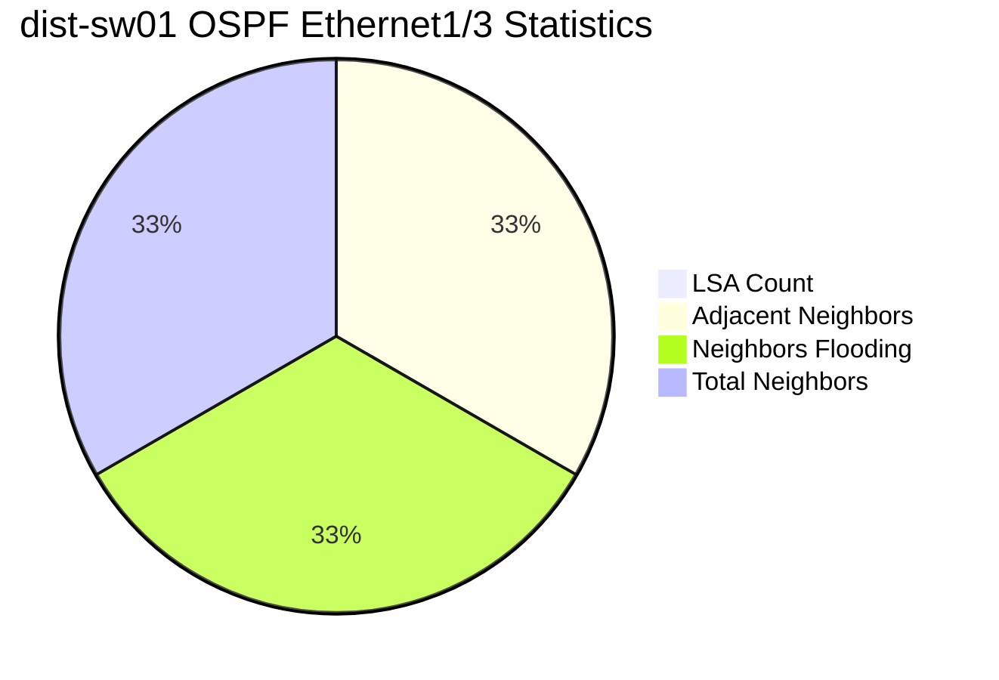
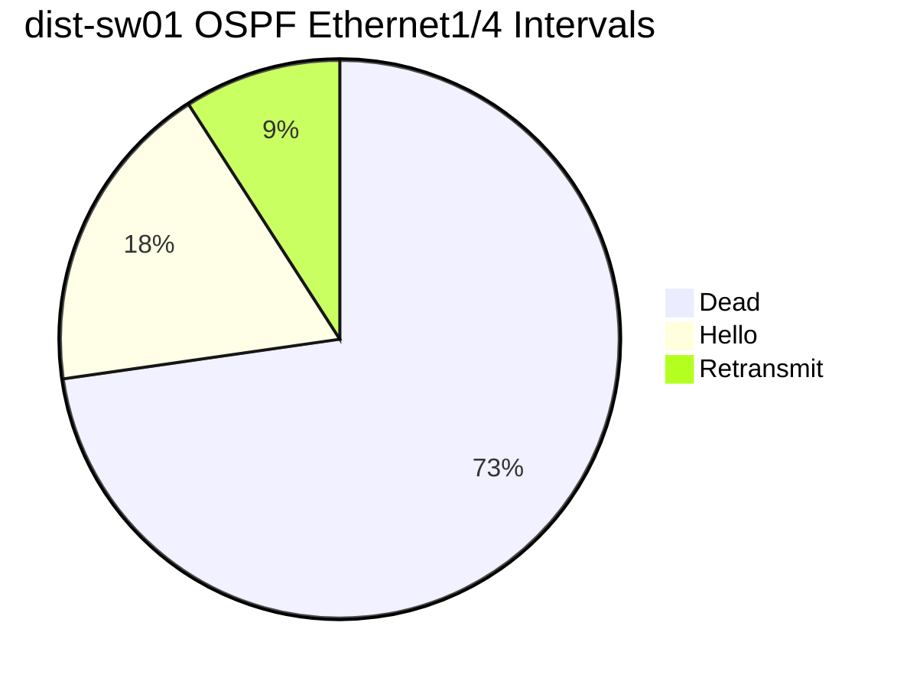
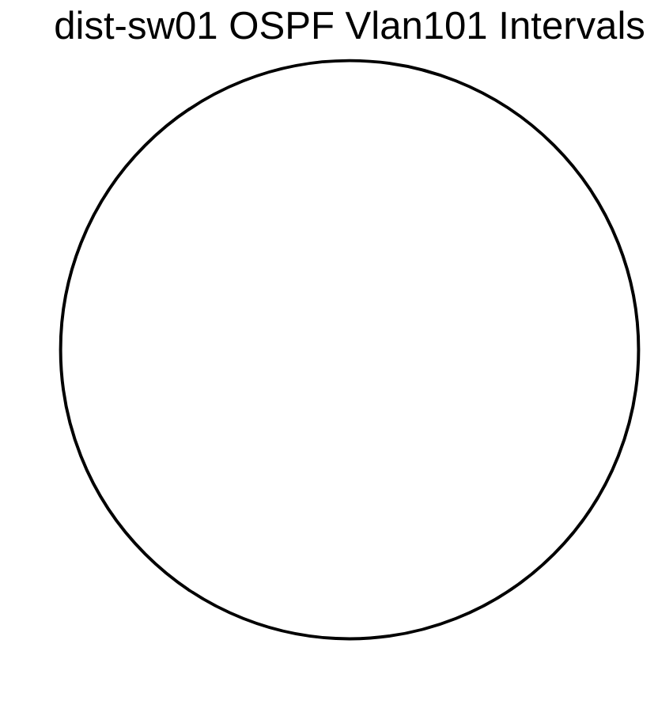
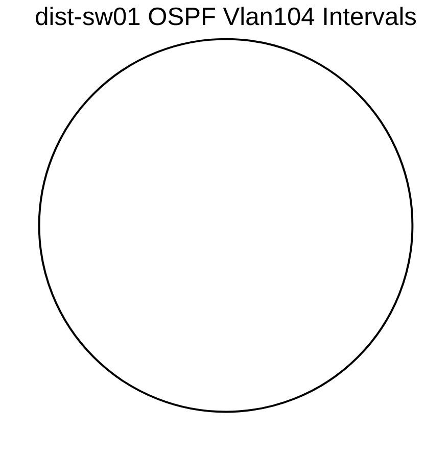
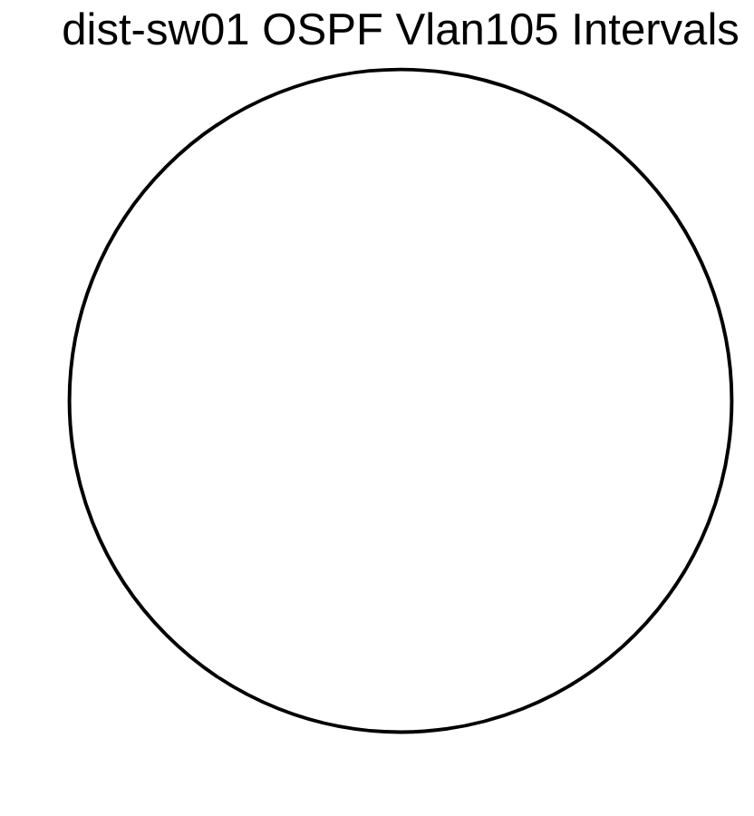

```mermaid
pie
title dist-sw01 OSPF Ethernet1/3 Intervals
"Dead" : 40
"Hello" : 10
"Retransmit" : 5
```

```mermaid
pie
title dist-sw01 OSPF Ethernet1/3 Statistics
"LSA Count" : 0
"Adjacent Neighbors" : 1
"Neighbors Flooding" : 1
"Total Neighbors" : 1
```

```mermaid
pie
title dist-sw01 OSPF Ethernet1/4 Intervals
"Dead" : 40
"Hello" : 10
"Retransmit" : 5
```

```mermaid
pie
title dist-sw01 OSPF Ethernet1/4 Statistics
"LSA Count" : 0
"Adjacent Neighbors" : 1
"Neighbors Flooding" : 1
"Total Neighbors" : 1
```

```mermaid
pie
title dist-sw01 OSPF Vlan101 Intervals
```

```mermaid
pie
title dist-sw01 OSPF Vlan102 Intervals
```

```mermaid
pie
title dist-sw01 OSPF Vlan103 Intervals
```

```mermaid
pie
title dist-sw01 OSPF Vlan104 Intervals
```

```mermaid
pie
title dist-sw01 OSPF Vlan105 Intervals
```