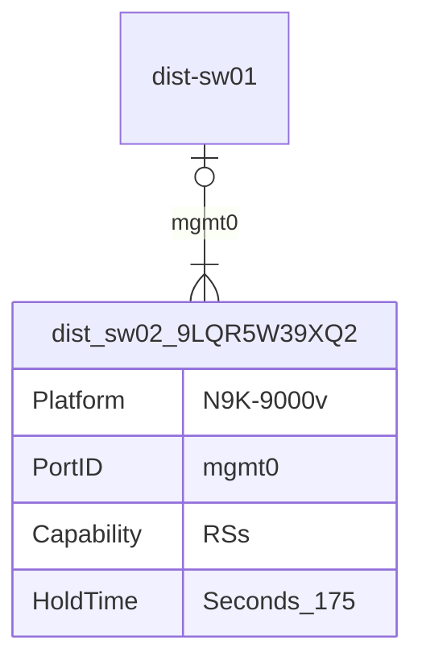
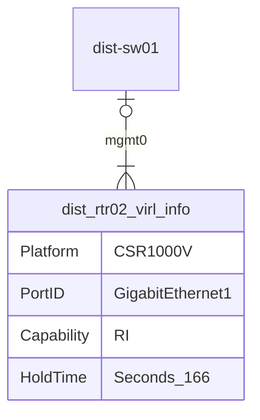

```mermaid
erDiagram
    dist-sw01 |o--|{ dist_sw02_9LQR5W39XQ2 : Ethernet1/1
    dist_sw02_9LQR5W39XQ2 {
        Platform N9K-9000v
        PortID Ethernet1/1
        Capability RSIs
        HoldTime Seconds_169
    }
```
```mermaid
erDiagram
    dist-sw01 |o--|{ dist_sw02_9LQR5W39XQ2 : Ethernet1/2
    dist_sw02_9LQR5W39XQ2 {
        Platform N9K-9000v
        PortID Ethernet1/2
        Capability RSIs
        HoldTime Seconds_170
    }
```
```mermaid
erDiagram
    dist-sw01 |o--|{ dist_rtr01_virl_info : Ethernet1/3
    dist_rtr01_virl_info {
        Platform CSR1000V
        PortID GigabitEthernet4
        Capability RI
        HoldTime Seconds_178
    }
```
```mermaid
erDiagram
    dist-sw01 |o--|{ dist_rtr02_virl_info : Ethernet1/4
    dist_rtr02_virl_info {
        Platform CSR1000V
        PortID GigabitEthernet4
        Capability RI
        HoldTime Seconds_164
    }
```