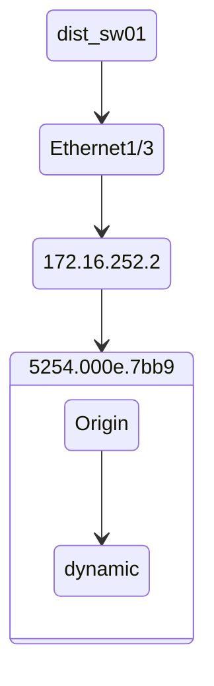
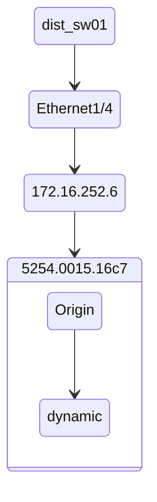
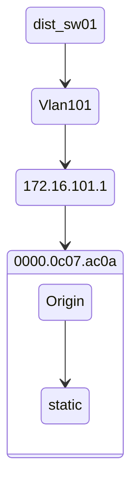

```mermaid
stateDiagram
dist_sw01 --> Ethernet1/3
Ethernet1/3 --> 172.16.252.2
172.16.252.2 --> 5254.000e.7bb9
state 5254.000e.7bb9{
Origin --> dynamic
}
```

```mermaid
stateDiagram
dist_sw01 --> Ethernet1/4
Ethernet1/4 --> 172.16.252.6
172.16.252.6 --> 5254.0015.16c7
state 5254.0015.16c7{
Origin --> dynamic
}
```

```mermaid
stateDiagram
dist_sw01 --> Vlan101
Vlan101 --> 172.16.101.1
172.16.101.1 --> 0000.0c07.ac0a
state 0000.0c07.ac0a{
Origin --> static
}
```