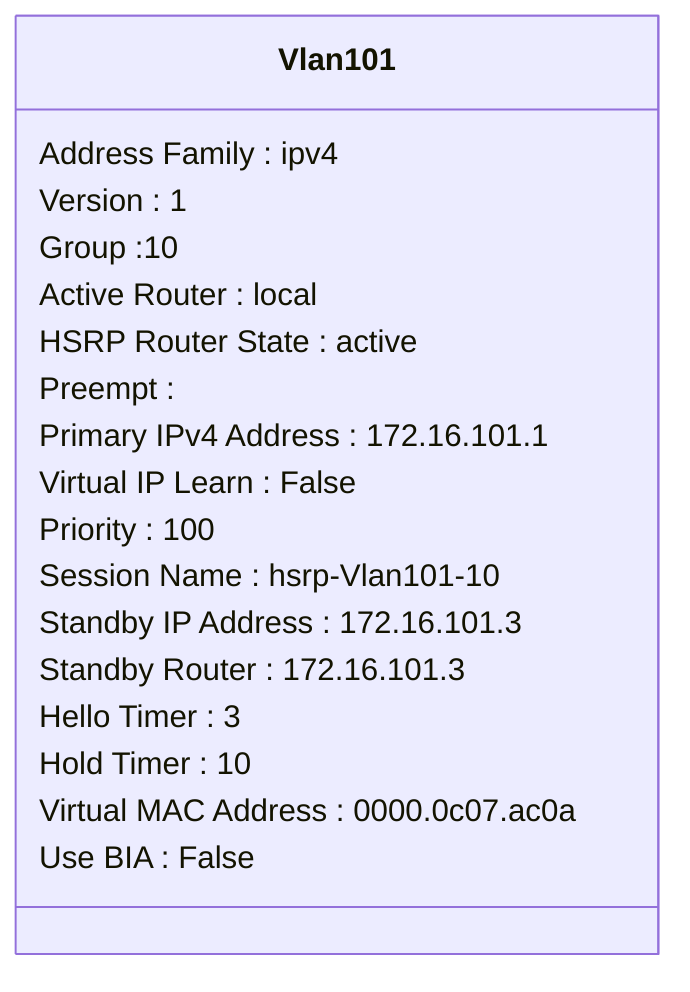
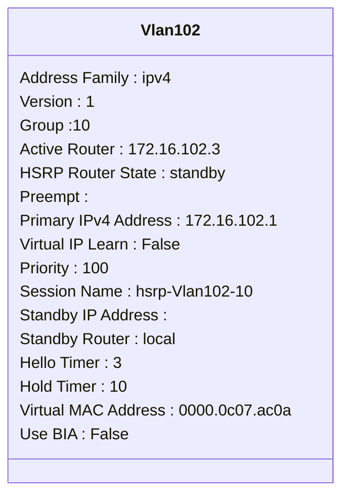

```mermaid
classDiagram
class Vlan101 {
Address Family : ipv4
Version : 1
Group :10
Active Router : local
HSRP Router State : active
Preempt : 
Primary IPv4 Address : 172.16.101.1
Virtual IP Learn : False
Priority : 100
Session Name : hsrp-Vlan101-10
Standby IP Address : 172.16.101.3
Standby Router : 172.16.101.3
Hello Timer : 3
Hold Timer : 10
Virtual MAC Address : 0000.0c07.ac0a
Use BIA : False
}
```

```mermaid
classDiagram
class Vlan102 {
Address Family : ipv4
Version : 1
Group :10
Active Router : 172.16.102.3
HSRP Router State : standby
Preempt : 
Primary IPv4 Address : 172.16.102.1
Virtual IP Learn : False
Priority : 100
Session Name : hsrp-Vlan102-10
Standby IP Address : 
Standby Router : local
Hello Timer : 3
Hold Timer : 10
Virtual MAC Address : 0000.0c07.ac0a
Use BIA : False
}
```

```mermaid
classDiagram
class Vlan103 {
Address Family : ipv4
Version : 1
Group :10
Active Router : 172.16.103.3
HSRP Router State : standby
Preempt : 
Primary IPv4 Address : 172.16.103.1
Virtual IP Learn : False
Priority : 100
Session Name : hsrp-Vlan103-10
Standby IP Address : 
Standby Router : local
Hello Timer : 3
Hold Timer : 10
Virtual MAC Address : 0000.0c07.ac0a
Use BIA : False
}
```

```mermaid
classDiagram
class Vlan104 {
Address Family : ipv4
Version : 1
Group :10
Active Router : 172.16.104.3
HSRP Router State : standby
Preempt : 
Primary IPv4 Address : 172.16.104.1
Virtual IP Learn : False
Priority : 100
Session Name : hsrp-Vlan104-10
Standby IP Address : 
Standby Router : local
Hello Timer : 3
Hold Timer : 10
Virtual MAC Address : 0000.0c07.ac0a
Use BIA : False
}
```

```mermaid
classDiagram
class Vlan105 {
Address Family : ipv4
Version : 1
Group :10
Active Router : 172.16.105.3
HSRP Router State : standby
Preempt : 
Primary IPv4 Address : 172.16.105.1
Virtual IP Learn : False
Priority : 100
Session Name : hsrp-Vlan105-10
Standby IP Address : 
Standby Router : local
Hello Timer : 3
Hold Timer : 10
Virtual MAC Address : 0000.0c07.ac0a
Use BIA : False
}
```