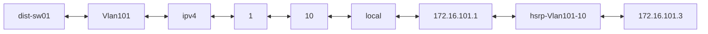
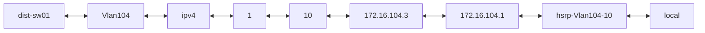
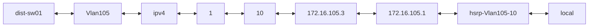

```mermaid
flowchart LR;
dist-sw01 <--> Vlan101 <--> ipv4 <--> 1 <--> 10 <--> local <--> 172.16.101.1 <--> hsrp-Vlan101-10 <--> 172.16.101.3
```

```mermaid
flowchart LR;
dist-sw01 <--> Vlan102 <--> ipv4 <--> 1 <--> 10 <--> 172.16.102.3 <--> 172.16.102.1 <--> hsrp-Vlan102-10 <--> local
```

```mermaid
flowchart LR;
dist-sw01 <--> Vlan103 <--> ipv4 <--> 1 <--> 10 <--> 172.16.103.3 <--> 172.16.103.1 <--> hsrp-Vlan103-10 <--> local
```

```mermaid
flowchart LR;
dist-sw01 <--> Vlan104 <--> ipv4 <--> 1 <--> 10 <--> 172.16.104.3 <--> 172.16.104.1 <--> hsrp-Vlan104-10 <--> local
```

```mermaid
flowchart LR;
dist-sw01 <--> Vlan105 <--> ipv4 <--> 1 <--> 10 <--> 172.16.105.3 <--> 172.16.105.1 <--> hsrp-Vlan105-10 <--> local
```