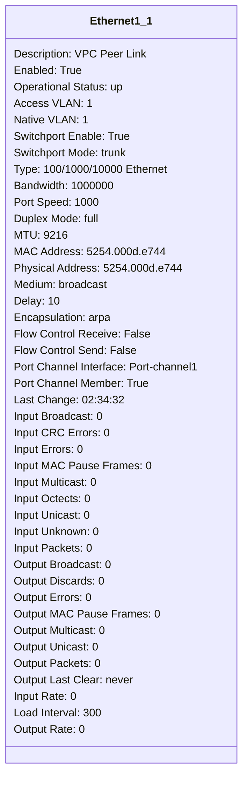
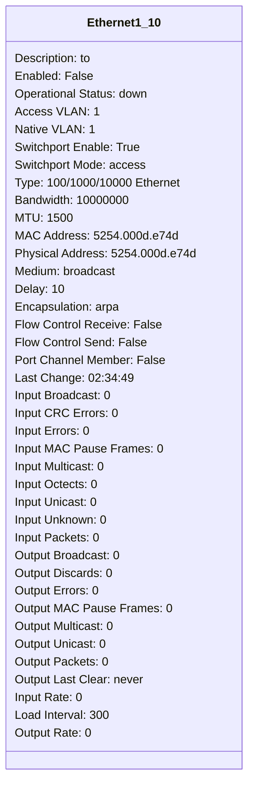
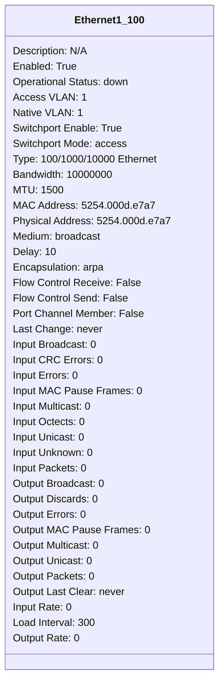

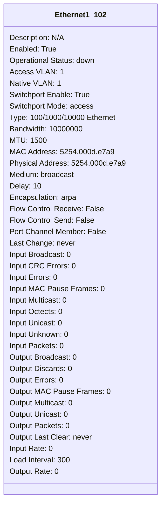


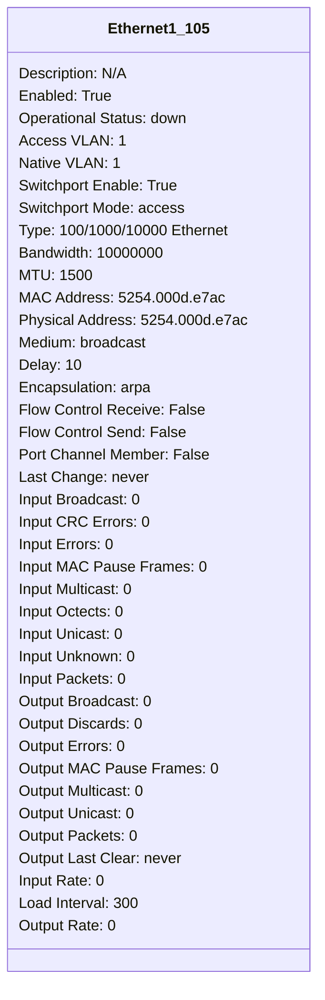
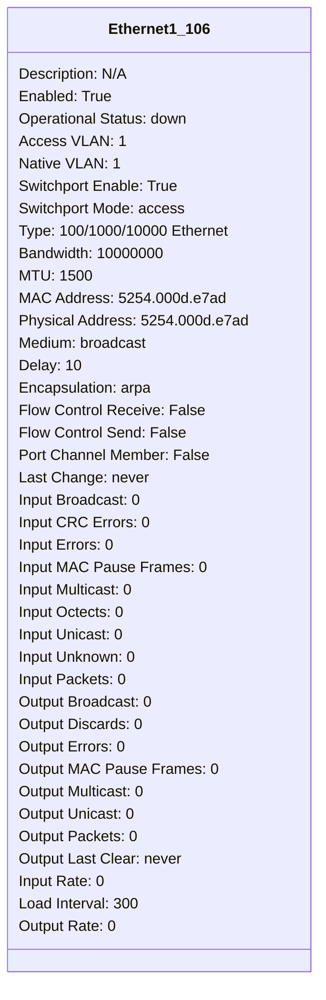

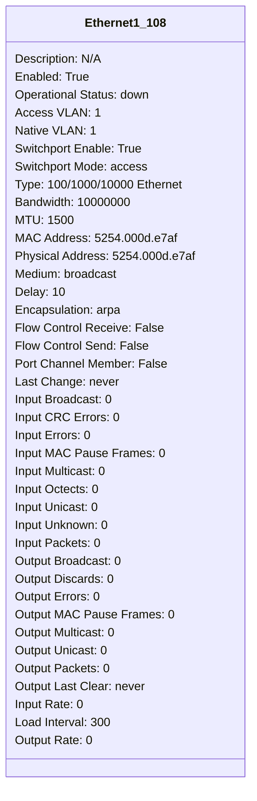

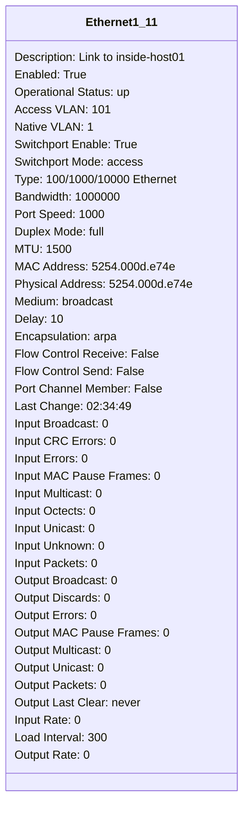
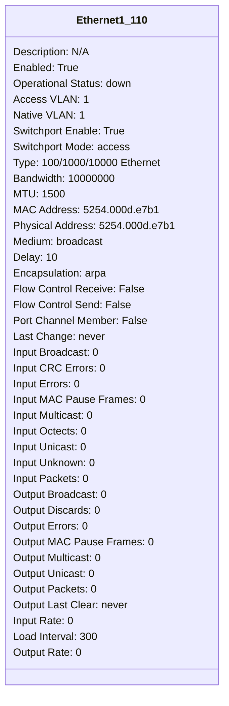
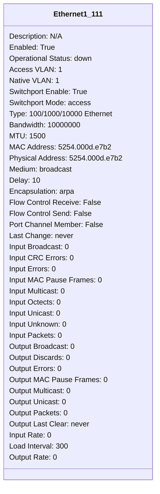


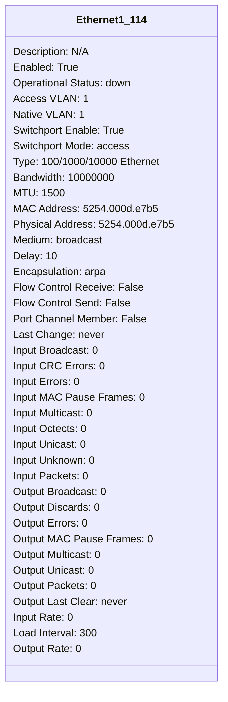
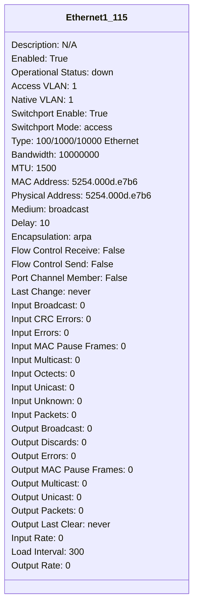
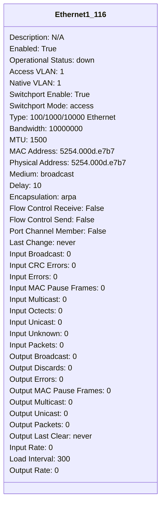
```mermaid
classDiagram
class Ethernet1_117{
Description: N/A
Enabled: True
Operational Status: down
Access VLAN: 1
Native VLAN: 1
Switchport Enable: True
Switchport Mode: access
Type: 100/1000/10000 Ethernet
Bandwidth: 10000000
MTU: 1500
MAC Address: 5254.000d.e7b8
Physical Address: 5254.000d.e7b8
Medium: broadcast
Delay: 10
Encapsulation: arpa
Flow Control Receive: False
Flow Control Send: False


Port Channel Member: False
Last Change: never
Input Broadcast: 0
Input CRC Errors: 0
Input Errors: 0
Input MAC Pause Frames: 0
Input Multicast: 0
Input Octects: 0
Input Unicast: 0
Input Unknown: 0
Input Packets: 0
Output Broadcast: 0
Output Discards: 0
Output Errors: 0
Output MAC Pause Frames: 0
Output Multicast: 0
Output Unicast: 0
Output Packets: 0
Output Last Clear: never
Input Rate: 0
Load Interval: 300
Output Rate: 0
}
```
```mermaid
classDiagram
class Ethernet1_118{
Description: N/A
Enabled: True
Operational Status: down
Access VLAN: 1
Native VLAN: 1
Switchport Enable: True
Switchport Mode: access
Type: 100/1000/10000 Ethernet
Bandwidth: 10000000
MTU: 1500
MAC Address: 5254.000d.e7b9
Physical Address: 5254.000d.e7b9
Medium: broadcast
Delay: 10
Encapsulation: arpa
Flow Control Receive: False
Flow Control Send: False


Port Channel Member: False
Last Change: never
Input Broadcast: 0
Input CRC Errors: 0
Input Errors: 0
Input MAC Pause Frames: 0
Input Multicast: 0
Input Octects: 0
Input Unicast: 0
Input Unknown: 0
Input Packets: 0
Output Broadcast: 0
Output Discards: 0
Output Errors: 0
Output MAC Pause Frames: 0
Output Multicast: 0
Output Unicast: 0
Output Packets: 0
Output Last Clear: never
Input Rate: 0
Load Interval: 300
Output Rate: 0
}
```
```mermaid
classDiagram
class Ethernet1_119{
Description: N/A
Enabled: True
Operational Status: down
Access VLAN: 1
Native VLAN: 1
Switchport Enable: True
Switchport Mode: access
Type: 100/1000/10000 Ethernet
Bandwidth: 10000000
MTU: 1500
MAC Address: 5254.000d.e7ba
Physical Address: 5254.000d.e7ba
Medium: broadcast
Delay: 10
Encapsulation: arpa
Flow Control Receive: False
Flow Control Send: False


Port Channel Member: False
Last Change: never
Input Broadcast: 0
Input CRC Errors: 0
Input Errors: 0
Input MAC Pause Frames: 0
Input Multicast: 0
Input Octects: 0
Input Unicast: 0
Input Unknown: 0
Input Packets: 0
Output Broadcast: 0
Output Discards: 0
Output Errors: 0
Output MAC Pause Frames: 0
Output Multicast: 0
Output Unicast: 0
Output Packets: 0
Output Last Clear: never
Input Rate: 0
Load Interval: 300
Output Rate: 0
}
```
```mermaid
classDiagram
class Ethernet1_12{
Description: N/A
Enabled: True
Operational Status: down
Access VLAN: 1
Native VLAN: 1
Switchport Enable: True
Switchport Mode: access
Type: 100/1000/10000 Ethernet
Bandwidth: 10000000
MTU: 1500
MAC Address: 5254.000d.e74f
Physical Address: 5254.000d.e74f
Medium: broadcast
Delay: 10
Encapsulation: arpa
Flow Control Receive: False
Flow Control Send: False


Port Channel Member: False
Last Change: never
Input Broadcast: 0
Input CRC Errors: 0
Input Errors: 0
Input MAC Pause Frames: 0
Input Multicast: 0
Input Octects: 0
Input Unicast: 0
Input Unknown: 0
Input Packets: 0
Output Broadcast: 0
Output Discards: 0
Output Errors: 0
Output MAC Pause Frames: 0
Output Multicast: 0
Output Unicast: 0
Output Packets: 0
Output Last Clear: never
Input Rate: 0
Load Interval: 300
Output Rate: 0
}
```
```mermaid
classDiagram
class Ethernet1_120{
Description: N/A
Enabled: True
Operational Status: down
Access VLAN: 1
Native VLAN: 1
Switchport Enable: True
Switchport Mode: access
Type: 100/1000/10000 Ethernet
Bandwidth: 10000000
MTU: 1500
MAC Address: 5254.000d.e7bb
Physical Address: 5254.000d.e7bb
Medium: broadcast
Delay: 10
Encapsulation: arpa
Flow Control Receive: False
Flow Control Send: False


Port Channel Member: False
Last Change: never
Input Broadcast: 0
Input CRC Errors: 0
Input Errors: 0
Input MAC Pause Frames: 0
Input Multicast: 0
Input Octects: 0
Input Unicast: 0
Input Unknown: 0
Input Packets: 0
Output Broadcast: 0
Output Discards: 0
Output Errors: 0
Output MAC Pause Frames: 0
Output Multicast: 0
Output Unicast: 0
Output Packets: 0
Output Last Clear: never
Input Rate: 0
Load Interval: 300
Output Rate: 0
}
```
```mermaid
classDiagram
class Ethernet1_121{
Description: N/A
Enabled: True
Operational Status: down
Access VLAN: 1
Native VLAN: 1
Switchport Enable: True
Switchport Mode: access
Type: 100/1000/10000 Ethernet
Bandwidth: 10000000
MTU: 1500
MAC Address: 5254.000d.e7bc
Physical Address: 5254.000d.e7bc
Medium: broadcast
Delay: 10
Encapsulation: arpa
Flow Control Receive: False
Flow Control Send: False


Port Channel Member: False
Last Change: never
Input Broadcast: 0
Input CRC Errors: 0
Input Errors: 0
Input MAC Pause Frames: 0
Input Multicast: 0
Input Octects: 0
Input Unicast: 0
Input Unknown: 0
Input Packets: 0
Output Broadcast: 0
Output Discards: 0
Output Errors: 0
Output MAC Pause Frames: 0
Output Multicast: 0
Output Unicast: 0
Output Packets: 0
Output Last Clear: never
Input Rate: 0
Load Interval: 300
Output Rate: 0
}
```
```mermaid
classDiagram
class Ethernet1_122{
Description: N/A
Enabled: True
Operational Status: down
Access VLAN: 1
Native VLAN: 1
Switchport Enable: True
Switchport Mode: access
Type: 100/1000/10000 Ethernet
Bandwidth: 10000000
MTU: 1500
MAC Address: 5254.000d.e7bd
Physical Address: 5254.000d.e7bd
Medium: broadcast
Delay: 10
Encapsulation: arpa
Flow Control Receive: False
Flow Control Send: False


Port Channel Member: False
Last Change: never
Input Broadcast: 0
Input CRC Errors: 0
Input Errors: 0
Input MAC Pause Frames: 0
Input Multicast: 0
Input Octects: 0
Input Unicast: 0
Input Unknown: 0
Input Packets: 0
Output Broadcast: 0
Output Discards: 0
Output Errors: 0
Output MAC Pause Frames: 0
Output Multicast: 0
Output Unicast: 0
Output Packets: 0
Output Last Clear: never
Input Rate: 0
Load Interval: 300
Output Rate: 0
}
```
```mermaid
classDiagram
class Ethernet1_123{
Description: N/A
Enabled: True
Operational Status: down
Access VLAN: 1
Native VLAN: 1
Switchport Enable: True
Switchport Mode: access
Type: 100/1000/10000 Ethernet
Bandwidth: 10000000
MTU: 1500
MAC Address: 5254.000d.e7be
Physical Address: 5254.000d.e7be
Medium: broadcast
Delay: 10
Encapsulation: arpa
Flow Control Receive: False
Flow Control Send: False


Port Channel Member: False
Last Change: never
Input Broadcast: 0
Input CRC Errors: 0
Input Errors: 0
Input MAC Pause Frames: 0
Input Multicast: 0
Input Octects: 0
Input Unicast: 0
Input Unknown: 0
Input Packets: 0
Output Broadcast: 0
Output Discards: 0
Output Errors: 0
Output MAC Pause Frames: 0
Output Multicast: 0
Output Unicast: 0
Output Packets: 0
Output Last Clear: never
Input Rate: 0
Load Interval: 300
Output Rate: 0
}
```
```mermaid
classDiagram
class Ethernet1_124{
Description: N/A
Enabled: True
Operational Status: down
Access VLAN: 1
Native VLAN: 1
Switchport Enable: True
Switchport Mode: access
Type: 100/1000/10000 Ethernet
Bandwidth: 10000000
MTU: 1500
MAC Address: 5254.000d.e7bf
Physical Address: 5254.000d.e7bf
Medium: broadcast
Delay: 10
Encapsulation: arpa
Flow Control Receive: False
Flow Control Send: False


Port Channel Member: False
Last Change: never
Input Broadcast: 0
Input CRC Errors: 0
Input Errors: 0
Input MAC Pause Frames: 0
Input Multicast: 0
Input Octects: 0
Input Unicast: 0
Input Unknown: 0
Input Packets: 0
Output Broadcast: 0
Output Discards: 0
Output Errors: 0
Output MAC Pause Frames: 0
Output Multicast: 0
Output Unicast: 0
Output Packets: 0
Output Last Clear: never
Input Rate: 0
Load Interval: 300
Output Rate: 0
}
```
```mermaid
classDiagram
class Ethernet1_125{
Description: N/A
Enabled: True
Operational Status: down
Access VLAN: 1
Native VLAN: 1
Switchport Enable: True
Switchport Mode: access
Type: 100/1000/10000 Ethernet
Bandwidth: 10000000
MTU: 1500
MAC Address: 5254.000d.e7c0
Physical Address: 5254.000d.e7c0
Medium: broadcast
Delay: 10
Encapsulation: arpa
Flow Control Receive: False
Flow Control Send: False


Port Channel Member: False
Last Change: never
Input Broadcast: 0
Input CRC Errors: 0
Input Errors: 0
Input MAC Pause Frames: 0
Input Multicast: 0
Input Octects: 0
Input Unicast: 0
Input Unknown: 0
Input Packets: 0
Output Broadcast: 0
Output Discards: 0
Output Errors: 0
Output MAC Pause Frames: 0
Output Multicast: 0
Output Unicast: 0
Output Packets: 0
Output Last Clear: never
Input Rate: 0
Load Interval: 300
Output Rate: 0
}
```
```mermaid
classDiagram
class Ethernet1_126{
Description: N/A
Enabled: True
Operational Status: down
Access VLAN: 1
Native VLAN: 1
Switchport Enable: True
Switchport Mode: access
Type: 100/1000/10000 Ethernet
Bandwidth: 10000000
MTU: 1500
MAC Address: 5254.000d.e7c1
Physical Address: 5254.000d.e7c1
Medium: broadcast
Delay: 10
Encapsulation: arpa
Flow Control Receive: False
Flow Control Send: False


Port Channel Member: False
Last Change: never
Input Broadcast: 0
Input CRC Errors: 0
Input Errors: 0
Input MAC Pause Frames: 0
Input Multicast: 0
Input Octects: 0
Input Unicast: 0
Input Unknown: 0
Input Packets: 0
Output Broadcast: 0
Output Discards: 0
Output Errors: 0
Output MAC Pause Frames: 0
Output Multicast: 0
Output Unicast: 0
Output Packets: 0
Output Last Clear: never
Input Rate: 0
Load Interval: 300
Output Rate: 0
}
```
```mermaid
classDiagram
class Ethernet1_127{
Description: N/A
Enabled: True
Operational Status: down
Access VLAN: 1
Native VLAN: 1
Switchport Enable: True
Switchport Mode: access
Type: 100/1000/10000 Ethernet
Bandwidth: 10000000
MTU: 1500
MAC Address: 5254.000d.e7c2
Physical Address: 5254.000d.e7c2
Medium: broadcast
Delay: 10
Encapsulation: arpa
Flow Control Receive: False
Flow Control Send: False


Port Channel Member: False
Last Change: never
Input Broadcast: 0
Input CRC Errors: 0
Input Errors: 0
Input MAC Pause Frames: 0
Input Multicast: 0
Input Octects: 0
Input Unicast: 0
Input Unknown: 0
Input Packets: 0
Output Broadcast: 0
Output Discards: 0
Output Errors: 0
Output MAC Pause Frames: 0
Output Multicast: 0
Output Unicast: 0
Output Packets: 0
Output Last Clear: never
Input Rate: 0
Load Interval: 300
Output Rate: 0
}
```
```mermaid
classDiagram
class Ethernet1_128{
Description: N/A
Enabled: True
Operational Status: down
Access VLAN: 1
Native VLAN: 1
Switchport Enable: True
Switchport Mode: access
Type: 100/1000/10000 Ethernet
Bandwidth: 10000000
MTU: 1500
MAC Address: 5254.000d.e7c3
Physical Address: 5254.000d.e7c3
Medium: broadcast
Delay: 10
Encapsulation: arpa
Flow Control Receive: False
Flow Control Send: False


Port Channel Member: False
Last Change: never
Input Broadcast: 0
Input CRC Errors: 0
Input Errors: 0
Input MAC Pause Frames: 0
Input Multicast: 0
Input Octects: 0
Input Unicast: 0
Input Unknown: 0
Input Packets: 0
Output Broadcast: 0
Output Discards: 0
Output Errors: 0
Output MAC Pause Frames: 0
Output Multicast: 0
Output Unicast: 0
Output Packets: 0
Output Last Clear: never
Input Rate: 0
Load Interval: 300
Output Rate: 0
}
```
```mermaid
classDiagram
class Ethernet1_13{
Description: N/A
Enabled: True
Operational Status: down
Access VLAN: 1
Native VLAN: 1
Switchport Enable: True
Switchport Mode: access
Type: 100/1000/10000 Ethernet
Bandwidth: 10000000
MTU: 1500
MAC Address: 5254.000d.e750
Physical Address: 5254.000d.e750
Medium: broadcast
Delay: 10
Encapsulation: arpa
Flow Control Receive: False
Flow Control Send: False


Port Channel Member: False
Last Change: never
Input Broadcast: 0
Input CRC Errors: 0
Input Errors: 0
Input MAC Pause Frames: 0
Input Multicast: 0
Input Octects: 0
Input Unicast: 0
Input Unknown: 0
Input Packets: 0
Output Broadcast: 0
Output Discards: 0
Output Errors: 0
Output MAC Pause Frames: 0
Output Multicast: 0
Output Unicast: 0
Output Packets: 0
Output Last Clear: never
Input Rate: 0
Load Interval: 300
Output Rate: 0
}
```
```mermaid
classDiagram
class Ethernet1_14{
Description: N/A
Enabled: True
Operational Status: down
Access VLAN: 1
Native VLAN: 1
Switchport Enable: True
Switchport Mode: access
Type: 100/1000/10000 Ethernet
Bandwidth: 10000000
MTU: 1500
MAC Address: 5254.000d.e751
Physical Address: 5254.000d.e751
Medium: broadcast
Delay: 10
Encapsulation: arpa
Flow Control Receive: False
Flow Control Send: False


Port Channel Member: False
Last Change: never
Input Broadcast: 0
Input CRC Errors: 0
Input Errors: 0
Input MAC Pause Frames: 0
Input Multicast: 0
Input Octects: 0
Input Unicast: 0
Input Unknown: 0
Input Packets: 0
Output Broadcast: 0
Output Discards: 0
Output Errors: 0
Output MAC Pause Frames: 0
Output Multicast: 0
Output Unicast: 0
Output Packets: 0
Output Last Clear: never
Input Rate: 0
Load Interval: 300
Output Rate: 0
}
```
```mermaid
classDiagram
class Ethernet1_15{
Description: N/A
Enabled: True
Operational Status: down
Access VLAN: 1
Native VLAN: 1
Switchport Enable: True
Switchport Mode: access
Type: 100/1000/10000 Ethernet
Bandwidth: 10000000
MTU: 1500
MAC Address: 5254.000d.e752
Physical Address: 5254.000d.e752
Medium: broadcast
Delay: 10
Encapsulation: arpa
Flow Control Receive: False
Flow Control Send: False


Port Channel Member: False
Last Change: never
Input Broadcast: 0
Input CRC Errors: 0
Input Errors: 0
Input MAC Pause Frames: 0
Input Multicast: 0
Input Octects: 0
Input Unicast: 0
Input Unknown: 0
Input Packets: 0
Output Broadcast: 0
Output Discards: 0
Output Errors: 0
Output MAC Pause Frames: 0
Output Multicast: 0
Output Unicast: 0
Output Packets: 0
Output Last Clear: never
Input Rate: 0
Load Interval: 300
Output Rate: 0
}
```
```mermaid
classDiagram
class Ethernet1_16{
Description: N/A
Enabled: True
Operational Status: down
Access VLAN: 1
Native VLAN: 1
Switchport Enable: True
Switchport Mode: access
Type: 100/1000/10000 Ethernet
Bandwidth: 10000000
MTU: 1500
MAC Address: 5254.000d.e753
Physical Address: 5254.000d.e753
Medium: broadcast
Delay: 10
Encapsulation: arpa
Flow Control Receive: False
Flow Control Send: False


Port Channel Member: False
Last Change: never
Input Broadcast: 0
Input CRC Errors: 0
Input Errors: 0
Input MAC Pause Frames: 0
Input Multicast: 0
Input Octects: 0
Input Unicast: 0
Input Unknown: 0
Input Packets: 0
Output Broadcast: 0
Output Discards: 0
Output Errors: 0
Output MAC Pause Frames: 0
Output Multicast: 0
Output Unicast: 0
Output Packets: 0
Output Last Clear: never
Input Rate: 0
Load Interval: 300
Output Rate: 0
}
```
```mermaid
classDiagram
class Ethernet1_17{
Description: N/A
Enabled: True
Operational Status: down
Access VLAN: 1
Native VLAN: 1
Switchport Enable: True
Switchport Mode: access
Type: 100/1000/10000 Ethernet
Bandwidth: 10000000
MTU: 1500
MAC Address: 5254.000d.e754
Physical Address: 5254.000d.e754
Medium: broadcast
Delay: 10
Encapsulation: arpa
Flow Control Receive: False
Flow Control Send: False


Port Channel Member: False
Last Change: never
Input Broadcast: 0
Input CRC Errors: 0
Input Errors: 0
Input MAC Pause Frames: 0
Input Multicast: 0
Input Octects: 0
Input Unicast: 0
Input Unknown: 0
Input Packets: 0
Output Broadcast: 0
Output Discards: 0
Output Errors: 0
Output MAC Pause Frames: 0
Output Multicast: 0
Output Unicast: 0
Output Packets: 0
Output Last Clear: never
Input Rate: 0
Load Interval: 300
Output Rate: 0
}
```
```mermaid
classDiagram
class Ethernet1_18{
Description: N/A
Enabled: True
Operational Status: down
Access VLAN: 1
Native VLAN: 1
Switchport Enable: True
Switchport Mode: access
Type: 100/1000/10000 Ethernet
Bandwidth: 10000000
MTU: 1500
MAC Address: 5254.000d.e755
Physical Address: 5254.000d.e755
Medium: broadcast
Delay: 10
Encapsulation: arpa
Flow Control Receive: False
Flow Control Send: False


Port Channel Member: False
Last Change: never
Input Broadcast: 0
Input CRC Errors: 0
Input Errors: 0
Input MAC Pause Frames: 0
Input Multicast: 0
Input Octects: 0
Input Unicast: 0
Input Unknown: 0
Input Packets: 0
Output Broadcast: 0
Output Discards: 0
Output Errors: 0
Output MAC Pause Frames: 0
Output Multicast: 0
Output Unicast: 0
Output Packets: 0
Output Last Clear: never
Input Rate: 0
Load Interval: 300
Output Rate: 0
}
```
```mermaid
classDiagram
class Ethernet1_19{
Description: N/A
Enabled: True
Operational Status: down
Access VLAN: 1
Native VLAN: 1
Switchport Enable: True
Switchport Mode: access
Type: 100/1000/10000 Ethernet
Bandwidth: 10000000
MTU: 1500
MAC Address: 5254.000d.e756
Physical Address: 5254.000d.e756
Medium: broadcast
Delay: 10
Encapsulation: arpa
Flow Control Receive: False
Flow Control Send: False


Port Channel Member: False
Last Change: never
Input Broadcast: 0
Input CRC Errors: 0
Input Errors: 0
Input MAC Pause Frames: 0
Input Multicast: 0
Input Octects: 0
Input Unicast: 0
Input Unknown: 0
Input Packets: 0
Output Broadcast: 0
Output Discards: 0
Output Errors: 0
Output MAC Pause Frames: 0
Output Multicast: 0
Output Unicast: 0
Output Packets: 0
Output Last Clear: never
Input Rate: 0
Load Interval: 300
Output Rate: 0
}
```
```mermaid
classDiagram
class Ethernet1_2{
Description: VPC Peer Link
Enabled: True
Operational Status: up
Access VLAN: 1
Native VLAN: 1
Switchport Enable: True
Switchport Mode: trunk
Type: 100/1000/10000 Ethernet
Bandwidth: 1000000
Port Speed: 1000
Duplex Mode: full
MTU: 9216
MAC Address: 5254.000d.e745
Physical Address: 5254.000d.e745
Medium: broadcast
Delay: 10
Encapsulation: arpa
Flow Control Receive: False
Flow Control Send: False

Port Channel Interface: Port-channel1


Port Channel Member: True
Last Change: 02:34:33
Input Broadcast: 0
Input CRC Errors: 0
Input Errors: 0
Input MAC Pause Frames: 0
Input Multicast: 0
Input Octects: 0
Input Unicast: 0
Input Unknown: 0
Input Packets: 0
Output Broadcast: 0
Output Discards: 0
Output Errors: 0
Output MAC Pause Frames: 0
Output Multicast: 0
Output Unicast: 0
Output Packets: 0
Output Last Clear: never
Input Rate: 0
Load Interval: 300
Output Rate: 0
}
```
```mermaid
classDiagram
class Ethernet1_20{
Description: N/A
Enabled: True
Operational Status: down
Access VLAN: 1
Native VLAN: 1
Switchport Enable: True
Switchport Mode: access
Type: 100/1000/10000 Ethernet
Bandwidth: 10000000
MTU: 1500
MAC Address: 5254.000d.e757
Physical Address: 5254.000d.e757
Medium: broadcast
Delay: 10
Encapsulation: arpa
Flow Control Receive: False
Flow Control Send: False


Port Channel Member: False
Last Change: never
Input Broadcast: 0
Input CRC Errors: 0
Input Errors: 0
Input MAC Pause Frames: 0
Input Multicast: 0
Input Octects: 0
Input Unicast: 0
Input Unknown: 0
Input Packets: 0
Output Broadcast: 0
Output Discards: 0
Output Errors: 0
Output MAC Pause Frames: 0
Output Multicast: 0
Output Unicast: 0
Output Packets: 0
Output Last Clear: never
Input Rate: 0
Load Interval: 300
Output Rate: 0
}
```
```mermaid
classDiagram
class Ethernet1_21{
Description: N/A
Enabled: True
Operational Status: down
Access VLAN: 1
Native VLAN: 1
Switchport Enable: True
Switchport Mode: access
Type: 100/1000/10000 Ethernet
Bandwidth: 10000000
MTU: 1500
MAC Address: 5254.000d.e758
Physical Address: 5254.000d.e758
Medium: broadcast
Delay: 10
Encapsulation: arpa
Flow Control Receive: False
Flow Control Send: False


Port Channel Member: False
Last Change: never
Input Broadcast: 0
Input CRC Errors: 0
Input Errors: 0
Input MAC Pause Frames: 0
Input Multicast: 0
Input Octects: 0
Input Unicast: 0
Input Unknown: 0
Input Packets: 0
Output Broadcast: 0
Output Discards: 0
Output Errors: 0
Output MAC Pause Frames: 0
Output Multicast: 0
Output Unicast: 0
Output Packets: 0
Output Last Clear: never
Input Rate: 0
Load Interval: 300
Output Rate: 0
}
```
```mermaid
classDiagram
class Ethernet1_22{
Description: N/A
Enabled: True
Operational Status: down
Access VLAN: 1
Native VLAN: 1
Switchport Enable: True
Switchport Mode: access
Type: 100/1000/10000 Ethernet
Bandwidth: 10000000
MTU: 1500
MAC Address: 5254.000d.e759
Physical Address: 5254.000d.e759
Medium: broadcast
Delay: 10
Encapsulation: arpa
Flow Control Receive: False
Flow Control Send: False


Port Channel Member: False
Last Change: never
Input Broadcast: 0
Input CRC Errors: 0
Input Errors: 0
Input MAC Pause Frames: 0
Input Multicast: 0
Input Octects: 0
Input Unicast: 0
Input Unknown: 0
Input Packets: 0
Output Broadcast: 0
Output Discards: 0
Output Errors: 0
Output MAC Pause Frames: 0
Output Multicast: 0
Output Unicast: 0
Output Packets: 0
Output Last Clear: never
Input Rate: 0
Load Interval: 300
Output Rate: 0
}
```
```mermaid
classDiagram
class Ethernet1_23{
Description: N/A
Enabled: True
Operational Status: down
Access VLAN: 1
Native VLAN: 1
Switchport Enable: True
Switchport Mode: access
Type: 100/1000/10000 Ethernet
Bandwidth: 10000000
MTU: 1500
MAC Address: 5254.000d.e75a
Physical Address: 5254.000d.e75a
Medium: broadcast
Delay: 10
Encapsulation: arpa
Flow Control Receive: False
Flow Control Send: False


Port Channel Member: False
Last Change: never
Input Broadcast: 0
Input CRC Errors: 0
Input Errors: 0
Input MAC Pause Frames: 0
Input Multicast: 0
Input Octects: 0
Input Unicast: 0
Input Unknown: 0
Input Packets: 0
Output Broadcast: 0
Output Discards: 0
Output Errors: 0
Output MAC Pause Frames: 0
Output Multicast: 0
Output Unicast: 0
Output Packets: 0
Output Last Clear: never
Input Rate: 0
Load Interval: 300
Output Rate: 0
}
```
```mermaid
classDiagram
class Ethernet1_24{
Description: N/A
Enabled: True
Operational Status: down
Access VLAN: 1
Native VLAN: 1
Switchport Enable: True
Switchport Mode: access
Type: 100/1000/10000 Ethernet
Bandwidth: 10000000
MTU: 1500
MAC Address: 5254.000d.e75b
Physical Address: 5254.000d.e75b
Medium: broadcast
Delay: 10
Encapsulation: arpa
Flow Control Receive: False
Flow Control Send: False


Port Channel Member: False
Last Change: never
Input Broadcast: 0
Input CRC Errors: 0
Input Errors: 0
Input MAC Pause Frames: 0
Input Multicast: 0
Input Octects: 0
Input Unicast: 0
Input Unknown: 0
Input Packets: 0
Output Broadcast: 0
Output Discards: 0
Output Errors: 0
Output MAC Pause Frames: 0
Output Multicast: 0
Output Unicast: 0
Output Packets: 0
Output Last Clear: never
Input Rate: 0
Load Interval: 300
Output Rate: 0
}
```
```mermaid
classDiagram
class Ethernet1_25{
Description: N/A
Enabled: True
Operational Status: down
Access VLAN: 1
Native VLAN: 1
Switchport Enable: True
Switchport Mode: access
Type: 100/1000/10000 Ethernet
Bandwidth: 10000000
MTU: 1500
MAC Address: 5254.000d.e75c
Physical Address: 5254.000d.e75c
Medium: broadcast
Delay: 10
Encapsulation: arpa
Flow Control Receive: False
Flow Control Send: False


Port Channel Member: False
Last Change: never
Input Broadcast: 0
Input CRC Errors: 0
Input Errors: 0
Input MAC Pause Frames: 0
Input Multicast: 0
Input Octects: 0
Input Unicast: 0
Input Unknown: 0
Input Packets: 0
Output Broadcast: 0
Output Discards: 0
Output Errors: 0
Output MAC Pause Frames: 0
Output Multicast: 0
Output Unicast: 0
Output Packets: 0
Output Last Clear: never
Input Rate: 0
Load Interval: 300
Output Rate: 0
}
```
```mermaid
classDiagram
class Ethernet1_26{
Description: N/A
Enabled: True
Operational Status: down
Access VLAN: 1
Native VLAN: 1
Switchport Enable: True
Switchport Mode: access
Type: 100/1000/10000 Ethernet
Bandwidth: 10000000
MTU: 1500
MAC Address: 5254.000d.e75d
Physical Address: 5254.000d.e75d
Medium: broadcast
Delay: 10
Encapsulation: arpa
Flow Control Receive: False
Flow Control Send: False


Port Channel Member: False
Last Change: never
Input Broadcast: 0
Input CRC Errors: 0
Input Errors: 0
Input MAC Pause Frames: 0
Input Multicast: 0
Input Octects: 0
Input Unicast: 0
Input Unknown: 0
Input Packets: 0
Output Broadcast: 0
Output Discards: 0
Output Errors: 0
Output MAC Pause Frames: 0
Output Multicast: 0
Output Unicast: 0
Output Packets: 0
Output Last Clear: never
Input Rate: 0
Load Interval: 300
Output Rate: 0
}
```
```mermaid
classDiagram
class Ethernet1_27{
Description: N/A
Enabled: True
Operational Status: down
Access VLAN: 1
Native VLAN: 1
Switchport Enable: True
Switchport Mode: access
Type: 100/1000/10000 Ethernet
Bandwidth: 10000000
MTU: 1500
MAC Address: 5254.000d.e75e
Physical Address: 5254.000d.e75e
Medium: broadcast
Delay: 10
Encapsulation: arpa
Flow Control Receive: False
Flow Control Send: False


Port Channel Member: False
Last Change: never
Input Broadcast: 0
Input CRC Errors: 0
Input Errors: 0
Input MAC Pause Frames: 0
Input Multicast: 0
Input Octects: 0
Input Unicast: 0
Input Unknown: 0
Input Packets: 0
Output Broadcast: 0
Output Discards: 0
Output Errors: 0
Output MAC Pause Frames: 0
Output Multicast: 0
Output Unicast: 0
Output Packets: 0
Output Last Clear: never
Input Rate: 0
Load Interval: 300
Output Rate: 0
}
```
```mermaid
classDiagram
class Ethernet1_28{
Description: N/A
Enabled: True
Operational Status: down
Access VLAN: 1
Native VLAN: 1
Switchport Enable: True
Switchport Mode: access
Type: 100/1000/10000 Ethernet
Bandwidth: 10000000
MTU: 1500
MAC Address: 5254.000d.e75f
Physical Address: 5254.000d.e75f
Medium: broadcast
Delay: 10
Encapsulation: arpa
Flow Control Receive: False
Flow Control Send: False


Port Channel Member: False
Last Change: never
Input Broadcast: 0
Input CRC Errors: 0
Input Errors: 0
Input MAC Pause Frames: 0
Input Multicast: 0
Input Octects: 0
Input Unicast: 0
Input Unknown: 0
Input Packets: 0
Output Broadcast: 0
Output Discards: 0
Output Errors: 0
Output MAC Pause Frames: 0
Output Multicast: 0
Output Unicast: 0
Output Packets: 0
Output Last Clear: never
Input Rate: 0
Load Interval: 300
Output Rate: 0
}
```
```mermaid
classDiagram
class Ethernet1_29{
Description: N/A
Enabled: True
Operational Status: down
Access VLAN: 1
Native VLAN: 1
Switchport Enable: True
Switchport Mode: access
Type: 100/1000/10000 Ethernet
Bandwidth: 10000000
MTU: 1500
MAC Address: 5254.000d.e760
Physical Address: 5254.000d.e760
Medium: broadcast
Delay: 10
Encapsulation: arpa
Flow Control Receive: False
Flow Control Send: False


Port Channel Member: False
Last Change: never
Input Broadcast: 0
Input CRC Errors: 0
Input Errors: 0
Input MAC Pause Frames: 0
Input Multicast: 0
Input Octects: 0
Input Unicast: 0
Input Unknown: 0
Input Packets: 0
Output Broadcast: 0
Output Discards: 0
Output Errors: 0
Output MAC Pause Frames: 0
Output Multicast: 0
Output Unicast: 0
Output Packets: 0
Output Last Clear: never
Input Rate: 0
Load Interval: 300
Output Rate: 0
}
```
```mermaid
classDiagram
class Ethernet1_3{
Description: L3 link to dist-rtr01
Enabled: True
Operational Status: up
Type: 100/1000/10000 Ethernet
Bandwidth: 1000000
Port Speed: 1000
Duplex Mode: full
MTU: 1500
MAC Address: 5254.000d.e743
Physical Address: 5254.000d.e746
IP Address: 172.16.252.1/30
Medium: broadcast
Delay: 10
Encapsulation: arpa
Flow Control Receive: False
Flow Control Send: False


Port Channel Member: False
Last Change: 02:34:51
Input Broadcast: 0
Input CRC Errors: 0
Input Errors: 0
Input MAC Pause Frames: 0
Input Multicast: 0
Input Octects: 0
Input Unicast: 0
Input Unknown: 0
Input Packets: 0
Output Broadcast: 0
Output Discards: 0
Output Errors: 0
Output MAC Pause Frames: 0
Output Multicast: 0
Output Unicast: 0
Output Packets: 0
Output Last Clear: never
Input Rate: 0
Load Interval: 300
Output Rate: 0
}
```
```mermaid
classDiagram
class Ethernet1_30{
Description: N/A
Enabled: True
Operational Status: down
Access VLAN: 1
Native VLAN: 1
Switchport Enable: True
Switchport Mode: access
Type: 100/1000/10000 Ethernet
Bandwidth: 10000000
MTU: 1500
MAC Address: 5254.000d.e761
Physical Address: 5254.000d.e761
Medium: broadcast
Delay: 10
Encapsulation: arpa
Flow Control Receive: False
Flow Control Send: False


Port Channel Member: False
Last Change: never
Input Broadcast: 0
Input CRC Errors: 0
Input Errors: 0
Input MAC Pause Frames: 0
Input Multicast: 0
Input Octects: 0
Input Unicast: 0
Input Unknown: 0
Input Packets: 0
Output Broadcast: 0
Output Discards: 0
Output Errors: 0
Output MAC Pause Frames: 0
Output Multicast: 0
Output Unicast: 0
Output Packets: 0
Output Last Clear: never
Input Rate: 0
Load Interval: 300
Output Rate: 0
}
```
```mermaid
classDiagram
class Ethernet1_31{
Description: N/A
Enabled: True
Operational Status: down
Access VLAN: 1
Native VLAN: 1
Switchport Enable: True
Switchport Mode: access
Type: 100/1000/10000 Ethernet
Bandwidth: 10000000
MTU: 1500
MAC Address: 5254.000d.e762
Physical Address: 5254.000d.e762
Medium: broadcast
Delay: 10
Encapsulation: arpa
Flow Control Receive: False
Flow Control Send: False


Port Channel Member: False
Last Change: never
Input Broadcast: 0
Input CRC Errors: 0
Input Errors: 0
Input MAC Pause Frames: 0
Input Multicast: 0
Input Octects: 0
Input Unicast: 0
Input Unknown: 0
Input Packets: 0
Output Broadcast: 0
Output Discards: 0
Output Errors: 0
Output MAC Pause Frames: 0
Output Multicast: 0
Output Unicast: 0
Output Packets: 0
Output Last Clear: never
Input Rate: 0
Load Interval: 300
Output Rate: 0
}
```
```mermaid
classDiagram
class Ethernet1_32{
Description: N/A
Enabled: True
Operational Status: down
Access VLAN: 1
Native VLAN: 1
Switchport Enable: True
Switchport Mode: access
Type: 100/1000/10000 Ethernet
Bandwidth: 10000000
MTU: 1500
MAC Address: 5254.000d.e763
Physical Address: 5254.000d.e763
Medium: broadcast
Delay: 10
Encapsulation: arpa
Flow Control Receive: False
Flow Control Send: False


Port Channel Member: False
Last Change: never
Input Broadcast: 0
Input CRC Errors: 0
Input Errors: 0
Input MAC Pause Frames: 0
Input Multicast: 0
Input Octects: 0
Input Unicast: 0
Input Unknown: 0
Input Packets: 0
Output Broadcast: 0
Output Discards: 0
Output Errors: 0
Output MAC Pause Frames: 0
Output Multicast: 0
Output Unicast: 0
Output Packets: 0
Output Last Clear: never
Input Rate: 0
Load Interval: 300
Output Rate: 0
}
```
```mermaid
classDiagram
class Ethernet1_33{
Description: N/A
Enabled: True
Operational Status: down
Access VLAN: 1
Native VLAN: 1
Switchport Enable: True
Switchport Mode: access
Type: 100/1000/10000 Ethernet
Bandwidth: 10000000
MTU: 1500
MAC Address: 5254.000d.e764
Physical Address: 5254.000d.e764
Medium: broadcast
Delay: 10
Encapsulation: arpa
Flow Control Receive: False
Flow Control Send: False


Port Channel Member: False
Last Change: never
Input Broadcast: 0
Input CRC Errors: 0
Input Errors: 0
Input MAC Pause Frames: 0
Input Multicast: 0
Input Octects: 0
Input Unicast: 0
Input Unknown: 0
Input Packets: 0
Output Broadcast: 0
Output Discards: 0
Output Errors: 0
Output MAC Pause Frames: 0
Output Multicast: 0
Output Unicast: 0
Output Packets: 0
Output Last Clear: never
Input Rate: 0
Load Interval: 300
Output Rate: 0
}
```
```mermaid
classDiagram
class Ethernet1_34{
Description: N/A
Enabled: True
Operational Status: down
Access VLAN: 1
Native VLAN: 1
Switchport Enable: True
Switchport Mode: access
Type: 100/1000/10000 Ethernet
Bandwidth: 10000000
MTU: 1500
MAC Address: 5254.000d.e765
Physical Address: 5254.000d.e765
Medium: broadcast
Delay: 10
Encapsulation: arpa
Flow Control Receive: False
Flow Control Send: False


Port Channel Member: False
Last Change: never
Input Broadcast: 0
Input CRC Errors: 0
Input Errors: 0
Input MAC Pause Frames: 0
Input Multicast: 0
Input Octects: 0
Input Unicast: 0
Input Unknown: 0
Input Packets: 0
Output Broadcast: 0
Output Discards: 0
Output Errors: 0
Output MAC Pause Frames: 0
Output Multicast: 0
Output Unicast: 0
Output Packets: 0
Output Last Clear: never
Input Rate: 0
Load Interval: 300
Output Rate: 0
}
```
```mermaid
classDiagram
class Ethernet1_35{
Description: N/A
Enabled: True
Operational Status: down
Access VLAN: 1
Native VLAN: 1
Switchport Enable: True
Switchport Mode: access
Type: 100/1000/10000 Ethernet
Bandwidth: 10000000
MTU: 1500
MAC Address: 5254.000d.e766
Physical Address: 5254.000d.e766
Medium: broadcast
Delay: 10
Encapsulation: arpa
Flow Control Receive: False
Flow Control Send: False


Port Channel Member: False
Last Change: never
Input Broadcast: 0
Input CRC Errors: 0
Input Errors: 0
Input MAC Pause Frames: 0
Input Multicast: 0
Input Octects: 0
Input Unicast: 0
Input Unknown: 0
Input Packets: 0
Output Broadcast: 0
Output Discards: 0
Output Errors: 0
Output MAC Pause Frames: 0
Output Multicast: 0
Output Unicast: 0
Output Packets: 0
Output Last Clear: never
Input Rate: 0
Load Interval: 300
Output Rate: 0
}
```
```mermaid
classDiagram
class Ethernet1_36{
Description: N/A
Enabled: True
Operational Status: down
Access VLAN: 1
Native VLAN: 1
Switchport Enable: True
Switchport Mode: access
Type: 100/1000/10000 Ethernet
Bandwidth: 10000000
MTU: 1500
MAC Address: 5254.000d.e767
Physical Address: 5254.000d.e767
Medium: broadcast
Delay: 10
Encapsulation: arpa
Flow Control Receive: False
Flow Control Send: False


Port Channel Member: False
Last Change: never
Input Broadcast: 0
Input CRC Errors: 0
Input Errors: 0
Input MAC Pause Frames: 0
Input Multicast: 0
Input Octects: 0
Input Unicast: 0
Input Unknown: 0
Input Packets: 0
Output Broadcast: 0
Output Discards: 0
Output Errors: 0
Output MAC Pause Frames: 0
Output Multicast: 0
Output Unicast: 0
Output Packets: 0
Output Last Clear: never
Input Rate: 0
Load Interval: 300
Output Rate: 0
}
```
```mermaid
classDiagram
class Ethernet1_37{
Description: N/A
Enabled: True
Operational Status: down
Access VLAN: 1
Native VLAN: 1
Switchport Enable: True
Switchport Mode: access
Type: 100/1000/10000 Ethernet
Bandwidth: 10000000
MTU: 1500
MAC Address: 5254.000d.e768
Physical Address: 5254.000d.e768
Medium: broadcast
Delay: 10
Encapsulation: arpa
Flow Control Receive: False
Flow Control Send: False


Port Channel Member: False
Last Change: never
Input Broadcast: 0
Input CRC Errors: 0
Input Errors: 0
Input MAC Pause Frames: 0
Input Multicast: 0
Input Octects: 0
Input Unicast: 0
Input Unknown: 0
Input Packets: 0
Output Broadcast: 0
Output Discards: 0
Output Errors: 0
Output MAC Pause Frames: 0
Output Multicast: 0
Output Unicast: 0
Output Packets: 0
Output Last Clear: never
Input Rate: 0
Load Interval: 300
Output Rate: 0
}
```
```mermaid
classDiagram
class Ethernet1_38{
Description: N/A
Enabled: True
Operational Status: down
Access VLAN: 1
Native VLAN: 1
Switchport Enable: True
Switchport Mode: access
Type: 100/1000/10000 Ethernet
Bandwidth: 10000000
MTU: 1500
MAC Address: 5254.000d.e769
Physical Address: 5254.000d.e769
Medium: broadcast
Delay: 10
Encapsulation: arpa
Flow Control Receive: False
Flow Control Send: False


Port Channel Member: False
Last Change: never
Input Broadcast: 0
Input CRC Errors: 0
Input Errors: 0
Input MAC Pause Frames: 0
Input Multicast: 0
Input Octects: 0
Input Unicast: 0
Input Unknown: 0
Input Packets: 0
Output Broadcast: 0
Output Discards: 0
Output Errors: 0
Output MAC Pause Frames: 0
Output Multicast: 0
Output Unicast: 0
Output Packets: 0
Output Last Clear: never
Input Rate: 0
Load Interval: 300
Output Rate: 0
}
```
```mermaid
classDiagram
class Ethernet1_39{
Description: N/A
Enabled: True
Operational Status: down
Access VLAN: 1
Native VLAN: 1
Switchport Enable: True
Switchport Mode: access
Type: 100/1000/10000 Ethernet
Bandwidth: 10000000
MTU: 1500
MAC Address: 5254.000d.e76a
Physical Address: 5254.000d.e76a
Medium: broadcast
Delay: 10
Encapsulation: arpa
Flow Control Receive: False
Flow Control Send: False


Port Channel Member: False
Last Change: never
Input Broadcast: 0
Input CRC Errors: 0
Input Errors: 0
Input MAC Pause Frames: 0
Input Multicast: 0
Input Octects: 0
Input Unicast: 0
Input Unknown: 0
Input Packets: 0
Output Broadcast: 0
Output Discards: 0
Output Errors: 0
Output MAC Pause Frames: 0
Output Multicast: 0
Output Unicast: 0
Output Packets: 0
Output Last Clear: never
Input Rate: 0
Load Interval: 300
Output Rate: 0
}
```
```mermaid
classDiagram
class Ethernet1_4{
Description: L3 link to dist-rtr02
Enabled: True
Operational Status: up
Type: 100/1000/10000 Ethernet
Bandwidth: 1000000
Port Speed: 1000
Duplex Mode: full
MTU: 1500
MAC Address: 5254.000d.e743
Physical Address: 5254.000d.e747
IP Address: 172.16.252.5/30
Medium: broadcast
Delay: 10
Encapsulation: arpa
Flow Control Receive: False
Flow Control Send: False


Port Channel Member: False
Last Change: 02:34:51
Input Broadcast: 0
Input CRC Errors: 0
Input Errors: 0
Input MAC Pause Frames: 0
Input Multicast: 0
Input Octects: 0
Input Unicast: 0
Input Unknown: 0
Input Packets: 0
Output Broadcast: 0
Output Discards: 0
Output Errors: 0
Output MAC Pause Frames: 0
Output Multicast: 0
Output Unicast: 0
Output Packets: 0
Output Last Clear: never
Input Rate: 0
Load Interval: 300
Output Rate: 0
}
```
```mermaid
classDiagram
class Ethernet1_40{
Description: N/A
Enabled: True
Operational Status: down
Access VLAN: 1
Native VLAN: 1
Switchport Enable: True
Switchport Mode: access
Type: 100/1000/10000 Ethernet
Bandwidth: 10000000
MTU: 1500
MAC Address: 5254.000d.e76b
Physical Address: 5254.000d.e76b
Medium: broadcast
Delay: 10
Encapsulation: arpa
Flow Control Receive: False
Flow Control Send: False


Port Channel Member: False
Last Change: never
Input Broadcast: 0
Input CRC Errors: 0
Input Errors: 0
Input MAC Pause Frames: 0
Input Multicast: 0
Input Octects: 0
Input Unicast: 0
Input Unknown: 0
Input Packets: 0
Output Broadcast: 0
Output Discards: 0
Output Errors: 0
Output MAC Pause Frames: 0
Output Multicast: 0
Output Unicast: 0
Output Packets: 0
Output Last Clear: never
Input Rate: 0
Load Interval: 300
Output Rate: 0
}
```
```mermaid
classDiagram
class Ethernet1_41{
Description: N/A
Enabled: True
Operational Status: down
Access VLAN: 1
Native VLAN: 1
Switchport Enable: True
Switchport Mode: access
Type: 100/1000/10000 Ethernet
Bandwidth: 10000000
MTU: 1500
MAC Address: 5254.000d.e76c
Physical Address: 5254.000d.e76c
Medium: broadcast
Delay: 10
Encapsulation: arpa
Flow Control Receive: False
Flow Control Send: False


Port Channel Member: False
Last Change: never
Input Broadcast: 0
Input CRC Errors: 0
Input Errors: 0
Input MAC Pause Frames: 0
Input Multicast: 0
Input Octects: 0
Input Unicast: 0
Input Unknown: 0
Input Packets: 0
Output Broadcast: 0
Output Discards: 0
Output Errors: 0
Output MAC Pause Frames: 0
Output Multicast: 0
Output Unicast: 0
Output Packets: 0
Output Last Clear: never
Input Rate: 0
Load Interval: 300
Output Rate: 0
}
```
```mermaid
classDiagram
class Ethernet1_42{
Description: N/A
Enabled: True
Operational Status: down
Access VLAN: 1
Native VLAN: 1
Switchport Enable: True
Switchport Mode: access
Type: 100/1000/10000 Ethernet
Bandwidth: 10000000
MTU: 1500
MAC Address: 5254.000d.e76d
Physical Address: 5254.000d.e76d
Medium: broadcast
Delay: 10
Encapsulation: arpa
Flow Control Receive: False
Flow Control Send: False


Port Channel Member: False
Last Change: never
Input Broadcast: 0
Input CRC Errors: 0
Input Errors: 0
Input MAC Pause Frames: 0
Input Multicast: 0
Input Octects: 0
Input Unicast: 0
Input Unknown: 0
Input Packets: 0
Output Broadcast: 0
Output Discards: 0
Output Errors: 0
Output MAC Pause Frames: 0
Output Multicast: 0
Output Unicast: 0
Output Packets: 0
Output Last Clear: never
Input Rate: 0
Load Interval: 300
Output Rate: 0
}
```
```mermaid
classDiagram
class Ethernet1_43{
Description: N/A
Enabled: True
Operational Status: down
Access VLAN: 1
Native VLAN: 1
Switchport Enable: True
Switchport Mode: access
Type: 100/1000/10000 Ethernet
Bandwidth: 10000000
MTU: 1500
MAC Address: 5254.000d.e76e
Physical Address: 5254.000d.e76e
Medium: broadcast
Delay: 10
Encapsulation: arpa
Flow Control Receive: False
Flow Control Send: False


Port Channel Member: False
Last Change: never
Input Broadcast: 0
Input CRC Errors: 0
Input Errors: 0
Input MAC Pause Frames: 0
Input Multicast: 0
Input Octects: 0
Input Unicast: 0
Input Unknown: 0
Input Packets: 0
Output Broadcast: 0
Output Discards: 0
Output Errors: 0
Output MAC Pause Frames: 0
Output Multicast: 0
Output Unicast: 0
Output Packets: 0
Output Last Clear: never
Input Rate: 0
Load Interval: 300
Output Rate: 0
}
```
```mermaid
classDiagram
class Ethernet1_44{
Description: N/A
Enabled: True
Operational Status: down
Access VLAN: 1
Native VLAN: 1
Switchport Enable: True
Switchport Mode: access
Type: 100/1000/10000 Ethernet
Bandwidth: 10000000
MTU: 1500
MAC Address: 5254.000d.e76f
Physical Address: 5254.000d.e76f
Medium: broadcast
Delay: 10
Encapsulation: arpa
Flow Control Receive: False
Flow Control Send: False


Port Channel Member: False
Last Change: never
Input Broadcast: 0
Input CRC Errors: 0
Input Errors: 0
Input MAC Pause Frames: 0
Input Multicast: 0
Input Octects: 0
Input Unicast: 0
Input Unknown: 0
Input Packets: 0
Output Broadcast: 0
Output Discards: 0
Output Errors: 0
Output MAC Pause Frames: 0
Output Multicast: 0
Output Unicast: 0
Output Packets: 0
Output Last Clear: never
Input Rate: 0
Load Interval: 300
Output Rate: 0
}
```
```mermaid
classDiagram
class Ethernet1_45{
Description: N/A
Enabled: True
Operational Status: down
Access VLAN: 1
Native VLAN: 1
Switchport Enable: True
Switchport Mode: access
Type: 100/1000/10000 Ethernet
Bandwidth: 10000000
MTU: 1500
MAC Address: 5254.000d.e770
Physical Address: 5254.000d.e770
Medium: broadcast
Delay: 10
Encapsulation: arpa
Flow Control Receive: False
Flow Control Send: False


Port Channel Member: False
Last Change: never
Input Broadcast: 0
Input CRC Errors: 0
Input Errors: 0
Input MAC Pause Frames: 0
Input Multicast: 0
Input Octects: 0
Input Unicast: 0
Input Unknown: 0
Input Packets: 0
Output Broadcast: 0
Output Discards: 0
Output Errors: 0
Output MAC Pause Frames: 0
Output Multicast: 0
Output Unicast: 0
Output Packets: 0
Output Last Clear: never
Input Rate: 0
Load Interval: 300
Output Rate: 0
}
```
```mermaid
classDiagram
class Ethernet1_46{
Description: N/A
Enabled: True
Operational Status: down
Access VLAN: 1
Native VLAN: 1
Switchport Enable: True
Switchport Mode: access
Type: 100/1000/10000 Ethernet
Bandwidth: 10000000
MTU: 1500
MAC Address: 5254.000d.e771
Physical Address: 5254.000d.e771
Medium: broadcast
Delay: 10
Encapsulation: arpa
Flow Control Receive: False
Flow Control Send: False


Port Channel Member: False
Last Change: never
Input Broadcast: 0
Input CRC Errors: 0
Input Errors: 0
Input MAC Pause Frames: 0
Input Multicast: 0
Input Octects: 0
Input Unicast: 0
Input Unknown: 0
Input Packets: 0
Output Broadcast: 0
Output Discards: 0
Output Errors: 0
Output MAC Pause Frames: 0
Output Multicast: 0
Output Unicast: 0
Output Packets: 0
Output Last Clear: never
Input Rate: 0
Load Interval: 300
Output Rate: 0
}
```
```mermaid
classDiagram
class Ethernet1_47{
Description: N/A
Enabled: True
Operational Status: down
Access VLAN: 1
Native VLAN: 1
Switchport Enable: True
Switchport Mode: access
Type: 100/1000/10000 Ethernet
Bandwidth: 10000000
MTU: 1500
MAC Address: 5254.000d.e772
Physical Address: 5254.000d.e772
Medium: broadcast
Delay: 10
Encapsulation: arpa
Flow Control Receive: False
Flow Control Send: False


Port Channel Member: False
Last Change: never
Input Broadcast: 0
Input CRC Errors: 0
Input Errors: 0
Input MAC Pause Frames: 0
Input Multicast: 0
Input Octects: 0
Input Unicast: 0
Input Unknown: 0
Input Packets: 0
Output Broadcast: 0
Output Discards: 0
Output Errors: 0
Output MAC Pause Frames: 0
Output Multicast: 0
Output Unicast: 0
Output Packets: 0
Output Last Clear: never
Input Rate: 0
Load Interval: 300
Output Rate: 0
}
```
```mermaid
classDiagram
class Ethernet1_48{
Description: N/A
Enabled: True
Operational Status: down
Access VLAN: 1
Native VLAN: 1
Switchport Enable: True
Switchport Mode: access
Type: 100/1000/10000 Ethernet
Bandwidth: 10000000
MTU: 1500
MAC Address: 5254.000d.e773
Physical Address: 5254.000d.e773
Medium: broadcast
Delay: 10
Encapsulation: arpa
Flow Control Receive: False
Flow Control Send: False


Port Channel Member: False
Last Change: never
Input Broadcast: 0
Input CRC Errors: 0
Input Errors: 0
Input MAC Pause Frames: 0
Input Multicast: 0
Input Octects: 0
Input Unicast: 0
Input Unknown: 0
Input Packets: 0
Output Broadcast: 0
Output Discards: 0
Output Errors: 0
Output MAC Pause Frames: 0
Output Multicast: 0
Output Unicast: 0
Output Packets: 0
Output Last Clear: never
Input Rate: 0
Load Interval: 300
Output Rate: 0
}
```
```mermaid
classDiagram
class Ethernet1_49{
Description: N/A
Enabled: True
Operational Status: down
Access VLAN: 1
Native VLAN: 1
Switchport Enable: True
Switchport Mode: access
Type: 100/1000/10000 Ethernet
Bandwidth: 10000000
MTU: 1500
MAC Address: 5254.000d.e774
Physical Address: 5254.000d.e774
Medium: broadcast
Delay: 10
Encapsulation: arpa
Flow Control Receive: False
Flow Control Send: False


Port Channel Member: False
Last Change: never
Input Broadcast: 0
Input CRC Errors: 0
Input Errors: 0
Input MAC Pause Frames: 0
Input Multicast: 0
Input Octects: 0
Input Unicast: 0
Input Unknown: 0
Input Packets: 0
Output Broadcast: 0
Output Discards: 0
Output Errors: 0
Output MAC Pause Frames: 0
Output Multicast: 0
Output Unicast: 0
Output Packets: 0
Output Last Clear: never
Input Rate: 0
Load Interval: 300
Output Rate: 0
}
```
```mermaid
classDiagram
class Ethernet1_5{
Description: to
Enabled: False
Operational Status: down
Access VLAN: 1
Native VLAN: 1
Switchport Enable: True
Switchport Mode: access
Type: 100/1000/10000 Ethernet
Bandwidth: 10000000
MTU: 1500
MAC Address: 5254.000d.e748
Physical Address: 5254.000d.e748
Medium: broadcast
Delay: 10
Encapsulation: arpa
Flow Control Receive: False
Flow Control Send: False


Port Channel Member: False
Last Change: 02:34:51
Input Broadcast: 0
Input CRC Errors: 0
Input Errors: 0
Input MAC Pause Frames: 0
Input Multicast: 0
Input Octects: 0
Input Unicast: 0
Input Unknown: 0
Input Packets: 0
Output Broadcast: 0
Output Discards: 0
Output Errors: 0
Output MAC Pause Frames: 0
Output Multicast: 0
Output Unicast: 0
Output Packets: 0
Output Last Clear: never
Input Rate: 0
Load Interval: 300
Output Rate: 0
}
```
```mermaid
classDiagram
class Ethernet1_50{
Description: N/A
Enabled: True
Operational Status: down
Access VLAN: 1
Native VLAN: 1
Switchport Enable: True
Switchport Mode: access
Type: 100/1000/10000 Ethernet
Bandwidth: 10000000
MTU: 1500
MAC Address: 5254.000d.e775
Physical Address: 5254.000d.e775
Medium: broadcast
Delay: 10
Encapsulation: arpa
Flow Control Receive: False
Flow Control Send: False


Port Channel Member: False
Last Change: never
Input Broadcast: 0
Input CRC Errors: 0
Input Errors: 0
Input MAC Pause Frames: 0
Input Multicast: 0
Input Octects: 0
Input Unicast: 0
Input Unknown: 0
Input Packets: 0
Output Broadcast: 0
Output Discards: 0
Output Errors: 0
Output MAC Pause Frames: 0
Output Multicast: 0
Output Unicast: 0
Output Packets: 0
Output Last Clear: never
Input Rate: 0
Load Interval: 300
Output Rate: 0
}
```
```mermaid
classDiagram
class Ethernet1_51{
Description: N/A
Enabled: True
Operational Status: down
Access VLAN: 1
Native VLAN: 1
Switchport Enable: True
Switchport Mode: access
Type: 100/1000/10000 Ethernet
Bandwidth: 10000000
MTU: 1500
MAC Address: 5254.000d.e776
Physical Address: 5254.000d.e776
Medium: broadcast
Delay: 10
Encapsulation: arpa
Flow Control Receive: False
Flow Control Send: False


Port Channel Member: False
Last Change: never
Input Broadcast: 0
Input CRC Errors: 0
Input Errors: 0
Input MAC Pause Frames: 0
Input Multicast: 0
Input Octects: 0
Input Unicast: 0
Input Unknown: 0
Input Packets: 0
Output Broadcast: 0
Output Discards: 0
Output Errors: 0
Output MAC Pause Frames: 0
Output Multicast: 0
Output Unicast: 0
Output Packets: 0
Output Last Clear: never
Input Rate: 0
Load Interval: 300
Output Rate: 0
}
```
```mermaid
classDiagram
class Ethernet1_52{
Description: N/A
Enabled: True
Operational Status: down
Access VLAN: 1
Native VLAN: 1
Switchport Enable: True
Switchport Mode: access
Type: 100/1000/10000 Ethernet
Bandwidth: 10000000
MTU: 1500
MAC Address: 5254.000d.e777
Physical Address: 5254.000d.e777
Medium: broadcast
Delay: 10
Encapsulation: arpa
Flow Control Receive: False
Flow Control Send: False


Port Channel Member: False
Last Change: never
Input Broadcast: 0
Input CRC Errors: 0
Input Errors: 0
Input MAC Pause Frames: 0
Input Multicast: 0
Input Octects: 0
Input Unicast: 0
Input Unknown: 0
Input Packets: 0
Output Broadcast: 0
Output Discards: 0
Output Errors: 0
Output MAC Pause Frames: 0
Output Multicast: 0
Output Unicast: 0
Output Packets: 0
Output Last Clear: never
Input Rate: 0
Load Interval: 300
Output Rate: 0
}
```
```mermaid
classDiagram
class Ethernet1_53{
Description: N/A
Enabled: True
Operational Status: down
Access VLAN: 1
Native VLAN: 1
Switchport Enable: True
Switchport Mode: access
Type: 100/1000/10000 Ethernet
Bandwidth: 10000000
MTU: 1500
MAC Address: 5254.000d.e778
Physical Address: 5254.000d.e778
Medium: broadcast
Delay: 10
Encapsulation: arpa
Flow Control Receive: False
Flow Control Send: False


Port Channel Member: False
Last Change: never
Input Broadcast: 0
Input CRC Errors: 0
Input Errors: 0
Input MAC Pause Frames: 0
Input Multicast: 0
Input Octects: 0
Input Unicast: 0
Input Unknown: 0
Input Packets: 0
Output Broadcast: 0
Output Discards: 0
Output Errors: 0
Output MAC Pause Frames: 0
Output Multicast: 0
Output Unicast: 0
Output Packets: 0
Output Last Clear: never
Input Rate: 0
Load Interval: 300
Output Rate: 0
}
```
```mermaid
classDiagram
class Ethernet1_54{
Description: N/A
Enabled: True
Operational Status: down
Access VLAN: 1
Native VLAN: 1
Switchport Enable: True
Switchport Mode: access
Type: 100/1000/10000 Ethernet
Bandwidth: 10000000
MTU: 1500
MAC Address: 5254.000d.e779
Physical Address: 5254.000d.e779
Medium: broadcast
Delay: 10
Encapsulation: arpa
Flow Control Receive: False
Flow Control Send: False


Port Channel Member: False
Last Change: never
Input Broadcast: 0
Input CRC Errors: 0
Input Errors: 0
Input MAC Pause Frames: 0
Input Multicast: 0
Input Octects: 0
Input Unicast: 0
Input Unknown: 0
Input Packets: 0
Output Broadcast: 0
Output Discards: 0
Output Errors: 0
Output MAC Pause Frames: 0
Output Multicast: 0
Output Unicast: 0
Output Packets: 0
Output Last Clear: never
Input Rate: 0
Load Interval: 300
Output Rate: 0
}
```
```mermaid
classDiagram
class Ethernet1_55{
Description: N/A
Enabled: True
Operational Status: down
Access VLAN: 1
Native VLAN: 1
Switchport Enable: True
Switchport Mode: access
Type: 100/1000/10000 Ethernet
Bandwidth: 10000000
MTU: 1500
MAC Address: 5254.000d.e77a
Physical Address: 5254.000d.e77a
Medium: broadcast
Delay: 10
Encapsulation: arpa
Flow Control Receive: False
Flow Control Send: False


Port Channel Member: False
Last Change: never
Input Broadcast: 0
Input CRC Errors: 0
Input Errors: 0
Input MAC Pause Frames: 0
Input Multicast: 0
Input Octects: 0
Input Unicast: 0
Input Unknown: 0
Input Packets: 0
Output Broadcast: 0
Output Discards: 0
Output Errors: 0
Output MAC Pause Frames: 0
Output Multicast: 0
Output Unicast: 0
Output Packets: 0
Output Last Clear: never
Input Rate: 0
Load Interval: 300
Output Rate: 0
}
```
```mermaid
classDiagram
class Ethernet1_56{
Description: N/A
Enabled: True
Operational Status: down
Access VLAN: 1
Native VLAN: 1
Switchport Enable: True
Switchport Mode: access
Type: 100/1000/10000 Ethernet
Bandwidth: 10000000
MTU: 1500
MAC Address: 5254.000d.e77b
Physical Address: 5254.000d.e77b
Medium: broadcast
Delay: 10
Encapsulation: arpa
Flow Control Receive: False
Flow Control Send: False


Port Channel Member: False
Last Change: never
Input Broadcast: 0
Input CRC Errors: 0
Input Errors: 0
Input MAC Pause Frames: 0
Input Multicast: 0
Input Octects: 0
Input Unicast: 0
Input Unknown: 0
Input Packets: 0
Output Broadcast: 0
Output Discards: 0
Output Errors: 0
Output MAC Pause Frames: 0
Output Multicast: 0
Output Unicast: 0
Output Packets: 0
Output Last Clear: never
Input Rate: 0
Load Interval: 300
Output Rate: 0
}
```
```mermaid
classDiagram
class Ethernet1_57{
Description: N/A
Enabled: True
Operational Status: down
Access VLAN: 1
Native VLAN: 1
Switchport Enable: True
Switchport Mode: access
Type: 100/1000/10000 Ethernet
Bandwidth: 10000000
MTU: 1500
MAC Address: 5254.000d.e77c
Physical Address: 5254.000d.e77c
Medium: broadcast
Delay: 10
Encapsulation: arpa
Flow Control Receive: False
Flow Control Send: False


Port Channel Member: False
Last Change: never
Input Broadcast: 0
Input CRC Errors: 0
Input Errors: 0
Input MAC Pause Frames: 0
Input Multicast: 0
Input Octects: 0
Input Unicast: 0
Input Unknown: 0
Input Packets: 0
Output Broadcast: 0
Output Discards: 0
Output Errors: 0
Output MAC Pause Frames: 0
Output Multicast: 0
Output Unicast: 0
Output Packets: 0
Output Last Clear: never
Input Rate: 0
Load Interval: 300
Output Rate: 0
}
```
```mermaid
classDiagram
class Ethernet1_58{
Description: N/A
Enabled: True
Operational Status: down
Access VLAN: 1
Native VLAN: 1
Switchport Enable: True
Switchport Mode: access
Type: 100/1000/10000 Ethernet
Bandwidth: 10000000
MTU: 1500
MAC Address: 5254.000d.e77d
Physical Address: 5254.000d.e77d
Medium: broadcast
Delay: 10
Encapsulation: arpa
Flow Control Receive: False
Flow Control Send: False


Port Channel Member: False
Last Change: never
Input Broadcast: 0
Input CRC Errors: 0
Input Errors: 0
Input MAC Pause Frames: 0
Input Multicast: 0
Input Octects: 0
Input Unicast: 0
Input Unknown: 0
Input Packets: 0
Output Broadcast: 0
Output Discards: 0
Output Errors: 0
Output MAC Pause Frames: 0
Output Multicast: 0
Output Unicast: 0
Output Packets: 0
Output Last Clear: never
Input Rate: 0
Load Interval: 300
Output Rate: 0
}
```
```mermaid
classDiagram
class Ethernet1_59{
Description: N/A
Enabled: True
Operational Status: down
Access VLAN: 1
Native VLAN: 1
Switchport Enable: True
Switchport Mode: access
Type: 100/1000/10000 Ethernet
Bandwidth: 10000000
MTU: 1500
MAC Address: 5254.000d.e77e
Physical Address: 5254.000d.e77e
Medium: broadcast
Delay: 10
Encapsulation: arpa
Flow Control Receive: False
Flow Control Send: False


Port Channel Member: False
Last Change: never
Input Broadcast: 0
Input CRC Errors: 0
Input Errors: 0
Input MAC Pause Frames: 0
Input Multicast: 0
Input Octects: 0
Input Unicast: 0
Input Unknown: 0
Input Packets: 0
Output Broadcast: 0
Output Discards: 0
Output Errors: 0
Output MAC Pause Frames: 0
Output Multicast: 0
Output Unicast: 0
Output Packets: 0
Output Last Clear: never
Input Rate: 0
Load Interval: 300
Output Rate: 0
}
```
```mermaid
classDiagram
class Ethernet1_6{
Description: to
Enabled: False
Operational Status: down
Access VLAN: 1
Native VLAN: 1
Switchport Enable: True
Switchport Mode: access
Type: 100/1000/10000 Ethernet
Bandwidth: 10000000
MTU: 1500
MAC Address: 5254.000d.e749
Physical Address: 5254.000d.e749
Medium: broadcast
Delay: 10
Encapsulation: arpa
Flow Control Receive: False
Flow Control Send: False


Port Channel Member: False
Last Change: 02:34:51
Input Broadcast: 0
Input CRC Errors: 0
Input Errors: 0
Input MAC Pause Frames: 0
Input Multicast: 0
Input Octects: 0
Input Unicast: 0
Input Unknown: 0
Input Packets: 0
Output Broadcast: 0
Output Discards: 0
Output Errors: 0
Output MAC Pause Frames: 0
Output Multicast: 0
Output Unicast: 0
Output Packets: 0
Output Last Clear: never
Input Rate: 0
Load Interval: 300
Output Rate: 0
}
```
```mermaid
classDiagram
class Ethernet1_60{
Description: N/A
Enabled: True
Operational Status: down
Access VLAN: 1
Native VLAN: 1
Switchport Enable: True
Switchport Mode: access
Type: 100/1000/10000 Ethernet
Bandwidth: 10000000
MTU: 1500
MAC Address: 5254.000d.e77f
Physical Address: 5254.000d.e77f
Medium: broadcast
Delay: 10
Encapsulation: arpa
Flow Control Receive: False
Flow Control Send: False


Port Channel Member: False
Last Change: never
Input Broadcast: 0
Input CRC Errors: 0
Input Errors: 0
Input MAC Pause Frames: 0
Input Multicast: 0
Input Octects: 0
Input Unicast: 0
Input Unknown: 0
Input Packets: 0
Output Broadcast: 0
Output Discards: 0
Output Errors: 0
Output MAC Pause Frames: 0
Output Multicast: 0
Output Unicast: 0
Output Packets: 0
Output Last Clear: never
Input Rate: 0
Load Interval: 300
Output Rate: 0
}
```
```mermaid
classDiagram
class Ethernet1_61{
Description: N/A
Enabled: True
Operational Status: down
Access VLAN: 1
Native VLAN: 1
Switchport Enable: True
Switchport Mode: access
Type: 100/1000/10000 Ethernet
Bandwidth: 10000000
MTU: 1500
MAC Address: 5254.000d.e780
Physical Address: 5254.000d.e780
Medium: broadcast
Delay: 10
Encapsulation: arpa
Flow Control Receive: False
Flow Control Send: False


Port Channel Member: False
Last Change: never
Input Broadcast: 0
Input CRC Errors: 0
Input Errors: 0
Input MAC Pause Frames: 0
Input Multicast: 0
Input Octects: 0
Input Unicast: 0
Input Unknown: 0
Input Packets: 0
Output Broadcast: 0
Output Discards: 0
Output Errors: 0
Output MAC Pause Frames: 0
Output Multicast: 0
Output Unicast: 0
Output Packets: 0
Output Last Clear: never
Input Rate: 0
Load Interval: 300
Output Rate: 0
}
```
```mermaid
classDiagram
class Ethernet1_62{
Description: N/A
Enabled: True
Operational Status: down
Access VLAN: 1
Native VLAN: 1
Switchport Enable: True
Switchport Mode: access
Type: 100/1000/10000 Ethernet
Bandwidth: 10000000
MTU: 1500
MAC Address: 5254.000d.e781
Physical Address: 5254.000d.e781
Medium: broadcast
Delay: 10
Encapsulation: arpa
Flow Control Receive: False
Flow Control Send: False


Port Channel Member: False
Last Change: never
Input Broadcast: 0
Input CRC Errors: 0
Input Errors: 0
Input MAC Pause Frames: 0
Input Multicast: 0
Input Octects: 0
Input Unicast: 0
Input Unknown: 0
Input Packets: 0
Output Broadcast: 0
Output Discards: 0
Output Errors: 0
Output MAC Pause Frames: 0
Output Multicast: 0
Output Unicast: 0
Output Packets: 0
Output Last Clear: never
Input Rate: 0
Load Interval: 300
Output Rate: 0
}
```
```mermaid
classDiagram
class Ethernet1_63{
Description: N/A
Enabled: True
Operational Status: down
Access VLAN: 1
Native VLAN: 1
Switchport Enable: True
Switchport Mode: access
Type: 100/1000/10000 Ethernet
Bandwidth: 10000000
MTU: 1500
MAC Address: 5254.000d.e782
Physical Address: 5254.000d.e782
Medium: broadcast
Delay: 10
Encapsulation: arpa
Flow Control Receive: False
Flow Control Send: False


Port Channel Member: False
Last Change: never
Input Broadcast: 0
Input CRC Errors: 0
Input Errors: 0
Input MAC Pause Frames: 0
Input Multicast: 0
Input Octects: 0
Input Unicast: 0
Input Unknown: 0
Input Packets: 0
Output Broadcast: 0
Output Discards: 0
Output Errors: 0
Output MAC Pause Frames: 0
Output Multicast: 0
Output Unicast: 0
Output Packets: 0
Output Last Clear: never
Input Rate: 0
Load Interval: 300
Output Rate: 0
}
```
```mermaid
classDiagram
class Ethernet1_64{
Description: N/A
Enabled: True
Operational Status: down
Access VLAN: 1
Native VLAN: 1
Switchport Enable: True
Switchport Mode: access
Type: 100/1000/10000 Ethernet
Bandwidth: 10000000
MTU: 1500
MAC Address: 5254.000d.e783
Physical Address: 5254.000d.e783
Medium: broadcast
Delay: 10
Encapsulation: arpa
Flow Control Receive: False
Flow Control Send: False


Port Channel Member: False
Last Change: never
Input Broadcast: 0
Input CRC Errors: 0
Input Errors: 0
Input MAC Pause Frames: 0
Input Multicast: 0
Input Octects: 0
Input Unicast: 0
Input Unknown: 0
Input Packets: 0
Output Broadcast: 0
Output Discards: 0
Output Errors: 0
Output MAC Pause Frames: 0
Output Multicast: 0
Output Unicast: 0
Output Packets: 0
Output Last Clear: never
Input Rate: 0
Load Interval: 300
Output Rate: 0
}
```
```mermaid
classDiagram
class Ethernet1_65{
Description: N/A
Enabled: True
Operational Status: down
Access VLAN: 1
Native VLAN: 1
Switchport Enable: True
Switchport Mode: access
Type: 100/1000/10000 Ethernet
Bandwidth: 10000000
MTU: 1500
MAC Address: 5254.000d.e784
Physical Address: 5254.000d.e784
Medium: broadcast
Delay: 10
Encapsulation: arpa
Flow Control Receive: False
Flow Control Send: False


Port Channel Member: False
Last Change: never
Input Broadcast: 0
Input CRC Errors: 0
Input Errors: 0
Input MAC Pause Frames: 0
Input Multicast: 0
Input Octects: 0
Input Unicast: 0
Input Unknown: 0
Input Packets: 0
Output Broadcast: 0
Output Discards: 0
Output Errors: 0
Output MAC Pause Frames: 0
Output Multicast: 0
Output Unicast: 0
Output Packets: 0
Output Last Clear: never
Input Rate: 0
Load Interval: 300
Output Rate: 0
}
```
```mermaid
classDiagram
class Ethernet1_66{
Description: N/A
Enabled: True
Operational Status: down
Access VLAN: 1
Native VLAN: 1
Switchport Enable: True
Switchport Mode: access
Type: 100/1000/10000 Ethernet
Bandwidth: 10000000
MTU: 1500
MAC Address: 5254.000d.e785
Physical Address: 5254.000d.e785
Medium: broadcast
Delay: 10
Encapsulation: arpa
Flow Control Receive: False
Flow Control Send: False


Port Channel Member: False
Last Change: never
Input Broadcast: 0
Input CRC Errors: 0
Input Errors: 0
Input MAC Pause Frames: 0
Input Multicast: 0
Input Octects: 0
Input Unicast: 0
Input Unknown: 0
Input Packets: 0
Output Broadcast: 0
Output Discards: 0
Output Errors: 0
Output MAC Pause Frames: 0
Output Multicast: 0
Output Unicast: 0
Output Packets: 0
Output Last Clear: never
Input Rate: 0
Load Interval: 300
Output Rate: 0
}
```
```mermaid
classDiagram
class Ethernet1_67{
Description: N/A
Enabled: True
Operational Status: down
Access VLAN: 1
Native VLAN: 1
Switchport Enable: True
Switchport Mode: access
Type: 100/1000/10000 Ethernet
Bandwidth: 10000000
MTU: 1500
MAC Address: 5254.000d.e786
Physical Address: 5254.000d.e786
Medium: broadcast
Delay: 10
Encapsulation: arpa
Flow Control Receive: False
Flow Control Send: False


Port Channel Member: False
Last Change: never
Input Broadcast: 0
Input CRC Errors: 0
Input Errors: 0
Input MAC Pause Frames: 0
Input Multicast: 0
Input Octects: 0
Input Unicast: 0
Input Unknown: 0
Input Packets: 0
Output Broadcast: 0
Output Discards: 0
Output Errors: 0
Output MAC Pause Frames: 0
Output Multicast: 0
Output Unicast: 0
Output Packets: 0
Output Last Clear: never
Input Rate: 0
Load Interval: 300
Output Rate: 0
}
```
```mermaid
classDiagram
class Ethernet1_68{
Description: N/A
Enabled: True
Operational Status: down
Access VLAN: 1
Native VLAN: 1
Switchport Enable: True
Switchport Mode: access
Type: 100/1000/10000 Ethernet
Bandwidth: 10000000
MTU: 1500
MAC Address: 5254.000d.e787
Physical Address: 5254.000d.e787
Medium: broadcast
Delay: 10
Encapsulation: arpa
Flow Control Receive: False
Flow Control Send: False


Port Channel Member: False
Last Change: never
Input Broadcast: 0
Input CRC Errors: 0
Input Errors: 0
Input MAC Pause Frames: 0
Input Multicast: 0
Input Octects: 0
Input Unicast: 0
Input Unknown: 0
Input Packets: 0
Output Broadcast: 0
Output Discards: 0
Output Errors: 0
Output MAC Pause Frames: 0
Output Multicast: 0
Output Unicast: 0
Output Packets: 0
Output Last Clear: never
Input Rate: 0
Load Interval: 300
Output Rate: 0
}
```
```mermaid
classDiagram
class Ethernet1_69{
Description: N/A
Enabled: True
Operational Status: down
Access VLAN: 1
Native VLAN: 1
Switchport Enable: True
Switchport Mode: access
Type: 100/1000/10000 Ethernet
Bandwidth: 10000000
MTU: 1500
MAC Address: 5254.000d.e788
Physical Address: 5254.000d.e788
Medium: broadcast
Delay: 10
Encapsulation: arpa
Flow Control Receive: False
Flow Control Send: False


Port Channel Member: False
Last Change: never
Input Broadcast: 0
Input CRC Errors: 0
Input Errors: 0
Input MAC Pause Frames: 0
Input Multicast: 0
Input Octects: 0
Input Unicast: 0
Input Unknown: 0
Input Packets: 0
Output Broadcast: 0
Output Discards: 0
Output Errors: 0
Output MAC Pause Frames: 0
Output Multicast: 0
Output Unicast: 0
Output Packets: 0
Output Last Clear: never
Input Rate: 0
Load Interval: 300
Output Rate: 0
}
```
```mermaid
classDiagram
class Ethernet1_7{
Description: to
Enabled: False
Operational Status: down
Access VLAN: 1
Native VLAN: 1
Switchport Enable: True
Switchport Mode: access
Type: 100/1000/10000 Ethernet
Bandwidth: 10000000
MTU: 1500
MAC Address: 5254.000d.e74a
Physical Address: 5254.000d.e74a
Medium: broadcast
Delay: 10
Encapsulation: arpa
Flow Control Receive: False
Flow Control Send: False


Port Channel Member: False
Last Change: 02:34:50
Input Broadcast: 0
Input CRC Errors: 0
Input Errors: 0
Input MAC Pause Frames: 0
Input Multicast: 0
Input Octects: 0
Input Unicast: 0
Input Unknown: 0
Input Packets: 0
Output Broadcast: 0
Output Discards: 0
Output Errors: 0
Output MAC Pause Frames: 0
Output Multicast: 0
Output Unicast: 0
Output Packets: 0
Output Last Clear: never
Input Rate: 0
Load Interval: 300
Output Rate: 0
}
```
```mermaid
classDiagram
class Ethernet1_70{
Description: N/A
Enabled: True
Operational Status: down
Access VLAN: 1
Native VLAN: 1
Switchport Enable: True
Switchport Mode: access
Type: 100/1000/10000 Ethernet
Bandwidth: 10000000
MTU: 1500
MAC Address: 5254.000d.e789
Physical Address: 5254.000d.e789
Medium: broadcast
Delay: 10
Encapsulation: arpa
Flow Control Receive: False
Flow Control Send: False


Port Channel Member: False
Last Change: never
Input Broadcast: 0
Input CRC Errors: 0
Input Errors: 0
Input MAC Pause Frames: 0
Input Multicast: 0
Input Octects: 0
Input Unicast: 0
Input Unknown: 0
Input Packets: 0
Output Broadcast: 0
Output Discards: 0
Output Errors: 0
Output MAC Pause Frames: 0
Output Multicast: 0
Output Unicast: 0
Output Packets: 0
Output Last Clear: never
Input Rate: 0
Load Interval: 300
Output Rate: 0
}
```
```mermaid
classDiagram
class Ethernet1_71{
Description: N/A
Enabled: True
Operational Status: down
Access VLAN: 1
Native VLAN: 1
Switchport Enable: True
Switchport Mode: access
Type: 100/1000/10000 Ethernet
Bandwidth: 10000000
MTU: 1500
MAC Address: 5254.000d.e78a
Physical Address: 5254.000d.e78a
Medium: broadcast
Delay: 10
Encapsulation: arpa
Flow Control Receive: False
Flow Control Send: False


Port Channel Member: False
Last Change: never
Input Broadcast: 0
Input CRC Errors: 0
Input Errors: 0
Input MAC Pause Frames: 0
Input Multicast: 0
Input Octects: 0
Input Unicast: 0
Input Unknown: 0
Input Packets: 0
Output Broadcast: 0
Output Discards: 0
Output Errors: 0
Output MAC Pause Frames: 0
Output Multicast: 0
Output Unicast: 0
Output Packets: 0
Output Last Clear: never
Input Rate: 0
Load Interval: 300
Output Rate: 0
}
```
```mermaid
classDiagram
class Ethernet1_72{
Description: N/A
Enabled: True
Operational Status: down
Access VLAN: 1
Native VLAN: 1
Switchport Enable: True
Switchport Mode: access
Type: 100/1000/10000 Ethernet
Bandwidth: 10000000
MTU: 1500
MAC Address: 5254.000d.e78b
Physical Address: 5254.000d.e78b
Medium: broadcast
Delay: 10
Encapsulation: arpa
Flow Control Receive: False
Flow Control Send: False


Port Channel Member: False
Last Change: never
Input Broadcast: 0
Input CRC Errors: 0
Input Errors: 0
Input MAC Pause Frames: 0
Input Multicast: 0
Input Octects: 0
Input Unicast: 0
Input Unknown: 0
Input Packets: 0
Output Broadcast: 0
Output Discards: 0
Output Errors: 0
Output MAC Pause Frames: 0
Output Multicast: 0
Output Unicast: 0
Output Packets: 0
Output Last Clear: never
Input Rate: 0
Load Interval: 300
Output Rate: 0
}
```
```mermaid
classDiagram
class Ethernet1_73{
Description: N/A
Enabled: True
Operational Status: down
Access VLAN: 1
Native VLAN: 1
Switchport Enable: True
Switchport Mode: access
Type: 100/1000/10000 Ethernet
Bandwidth: 10000000
MTU: 1500
MAC Address: 5254.000d.e78c
Physical Address: 5254.000d.e78c
Medium: broadcast
Delay: 10
Encapsulation: arpa
Flow Control Receive: False
Flow Control Send: False


Port Channel Member: False
Last Change: never
Input Broadcast: 0
Input CRC Errors: 0
Input Errors: 0
Input MAC Pause Frames: 0
Input Multicast: 0
Input Octects: 0
Input Unicast: 0
Input Unknown: 0
Input Packets: 0
Output Broadcast: 0
Output Discards: 0
Output Errors: 0
Output MAC Pause Frames: 0
Output Multicast: 0
Output Unicast: 0
Output Packets: 0
Output Last Clear: never
Input Rate: 0
Load Interval: 300
Output Rate: 0
}
```
```mermaid
classDiagram
class Ethernet1_74{
Description: N/A
Enabled: True
Operational Status: down
Access VLAN: 1
Native VLAN: 1
Switchport Enable: True
Switchport Mode: access
Type: 100/1000/10000 Ethernet
Bandwidth: 10000000
MTU: 1500
MAC Address: 5254.000d.e78d
Physical Address: 5254.000d.e78d
Medium: broadcast
Delay: 10
Encapsulation: arpa
Flow Control Receive: False
Flow Control Send: False


Port Channel Member: False
Last Change: never
Input Broadcast: 0
Input CRC Errors: 0
Input Errors: 0
Input MAC Pause Frames: 0
Input Multicast: 0
Input Octects: 0
Input Unicast: 0
Input Unknown: 0
Input Packets: 0
Output Broadcast: 0
Output Discards: 0
Output Errors: 0
Output MAC Pause Frames: 0
Output Multicast: 0
Output Unicast: 0
Output Packets: 0
Output Last Clear: never
Input Rate: 0
Load Interval: 300
Output Rate: 0
}
```
```mermaid
classDiagram
class Ethernet1_75{
Description: N/A
Enabled: True
Operational Status: down
Access VLAN: 1
Native VLAN: 1
Switchport Enable: True
Switchport Mode: access
Type: 100/1000/10000 Ethernet
Bandwidth: 10000000
MTU: 1500
MAC Address: 5254.000d.e78e
Physical Address: 5254.000d.e78e
Medium: broadcast
Delay: 10
Encapsulation: arpa
Flow Control Receive: False
Flow Control Send: False


Port Channel Member: False
Last Change: never
Input Broadcast: 0
Input CRC Errors: 0
Input Errors: 0
Input MAC Pause Frames: 0
Input Multicast: 0
Input Octects: 0
Input Unicast: 0
Input Unknown: 0
Input Packets: 0
Output Broadcast: 0
Output Discards: 0
Output Errors: 0
Output MAC Pause Frames: 0
Output Multicast: 0
Output Unicast: 0
Output Packets: 0
Output Last Clear: never
Input Rate: 0
Load Interval: 300
Output Rate: 0
}
```
```mermaid
classDiagram
class Ethernet1_76{
Description: N/A
Enabled: True
Operational Status: down
Access VLAN: 1
Native VLAN: 1
Switchport Enable: True
Switchport Mode: access
Type: 100/1000/10000 Ethernet
Bandwidth: 10000000
MTU: 1500
MAC Address: 5254.000d.e78f
Physical Address: 5254.000d.e78f
Medium: broadcast
Delay: 10
Encapsulation: arpa
Flow Control Receive: False
Flow Control Send: False


Port Channel Member: False
Last Change: never
Input Broadcast: 0
Input CRC Errors: 0
Input Errors: 0
Input MAC Pause Frames: 0
Input Multicast: 0
Input Octects: 0
Input Unicast: 0
Input Unknown: 0
Input Packets: 0
Output Broadcast: 0
Output Discards: 0
Output Errors: 0
Output MAC Pause Frames: 0
Output Multicast: 0
Output Unicast: 0
Output Packets: 0
Output Last Clear: never
Input Rate: 0
Load Interval: 300
Output Rate: 0
}
```
```mermaid
classDiagram
class Ethernet1_77{
Description: N/A
Enabled: True
Operational Status: down
Access VLAN: 1
Native VLAN: 1
Switchport Enable: True
Switchport Mode: access
Type: 100/1000/10000 Ethernet
Bandwidth: 10000000
MTU: 1500
MAC Address: 5254.000d.e790
Physical Address: 5254.000d.e790
Medium: broadcast
Delay: 10
Encapsulation: arpa
Flow Control Receive: False
Flow Control Send: False


Port Channel Member: False
Last Change: never
Input Broadcast: 0
Input CRC Errors: 0
Input Errors: 0
Input MAC Pause Frames: 0
Input Multicast: 0
Input Octects: 0
Input Unicast: 0
Input Unknown: 0
Input Packets: 0
Output Broadcast: 0
Output Discards: 0
Output Errors: 0
Output MAC Pause Frames: 0
Output Multicast: 0
Output Unicast: 0
Output Packets: 0
Output Last Clear: never
Input Rate: 0
Load Interval: 300
Output Rate: 0
}
```
```mermaid
classDiagram
class Ethernet1_78{
Description: N/A
Enabled: True
Operational Status: down
Access VLAN: 1
Native VLAN: 1
Switchport Enable: True
Switchport Mode: access
Type: 100/1000/10000 Ethernet
Bandwidth: 10000000
MTU: 1500
MAC Address: 5254.000d.e791
Physical Address: 5254.000d.e791
Medium: broadcast
Delay: 10
Encapsulation: arpa
Flow Control Receive: False
Flow Control Send: False


Port Channel Member: False
Last Change: never
Input Broadcast: 0
Input CRC Errors: 0
Input Errors: 0
Input MAC Pause Frames: 0
Input Multicast: 0
Input Octects: 0
Input Unicast: 0
Input Unknown: 0
Input Packets: 0
Output Broadcast: 0
Output Discards: 0
Output Errors: 0
Output MAC Pause Frames: 0
Output Multicast: 0
Output Unicast: 0
Output Packets: 0
Output Last Clear: never
Input Rate: 0
Load Interval: 300
Output Rate: 0
}
```
```mermaid
classDiagram
class Ethernet1_79{
Description: N/A
Enabled: True
Operational Status: down
Access VLAN: 1
Native VLAN: 1
Switchport Enable: True
Switchport Mode: access
Type: 100/1000/10000 Ethernet
Bandwidth: 10000000
MTU: 1500
MAC Address: 5254.000d.e792
Physical Address: 5254.000d.e792
Medium: broadcast
Delay: 10
Encapsulation: arpa
Flow Control Receive: False
Flow Control Send: False


Port Channel Member: False
Last Change: never
Input Broadcast: 0
Input CRC Errors: 0
Input Errors: 0
Input MAC Pause Frames: 0
Input Multicast: 0
Input Octects: 0
Input Unicast: 0
Input Unknown: 0
Input Packets: 0
Output Broadcast: 0
Output Discards: 0
Output Errors: 0
Output MAC Pause Frames: 0
Output Multicast: 0
Output Unicast: 0
Output Packets: 0
Output Last Clear: never
Input Rate: 0
Load Interval: 300
Output Rate: 0
}
```
```mermaid
classDiagram
class Ethernet1_8{
Description: to
Enabled: False
Operational Status: down
Access VLAN: 1
Native VLAN: 1
Switchport Enable: True
Switchport Mode: access
Type: 100/1000/10000 Ethernet
Bandwidth: 10000000
MTU: 1500
MAC Address: 5254.000d.e74b
Physical Address: 5254.000d.e74b
Medium: broadcast
Delay: 10
Encapsulation: arpa
Flow Control Receive: False
Flow Control Send: False


Port Channel Member: False
Last Change: 02:34:50
Input Broadcast: 0
Input CRC Errors: 0
Input Errors: 0
Input MAC Pause Frames: 0
Input Multicast: 0
Input Octects: 0
Input Unicast: 0
Input Unknown: 0
Input Packets: 0
Output Broadcast: 0
Output Discards: 0
Output Errors: 0
Output MAC Pause Frames: 0
Output Multicast: 0
Output Unicast: 0
Output Packets: 0
Output Last Clear: never
Input Rate: 0
Load Interval: 300
Output Rate: 0
}
```
```mermaid
classDiagram
class Ethernet1_80{
Description: N/A
Enabled: True
Operational Status: down
Access VLAN: 1
Native VLAN: 1
Switchport Enable: True
Switchport Mode: access
Type: 100/1000/10000 Ethernet
Bandwidth: 10000000
MTU: 1500
MAC Address: 5254.000d.e793
Physical Address: 5254.000d.e793
Medium: broadcast
Delay: 10
Encapsulation: arpa
Flow Control Receive: False
Flow Control Send: False


Port Channel Member: False
Last Change: never
Input Broadcast: 0
Input CRC Errors: 0
Input Errors: 0
Input MAC Pause Frames: 0
Input Multicast: 0
Input Octects: 0
Input Unicast: 0
Input Unknown: 0
Input Packets: 0
Output Broadcast: 0
Output Discards: 0
Output Errors: 0
Output MAC Pause Frames: 0
Output Multicast: 0
Output Unicast: 0
Output Packets: 0
Output Last Clear: never
Input Rate: 0
Load Interval: 300
Output Rate: 0
}
```
```mermaid
classDiagram
class Ethernet1_81{
Description: N/A
Enabled: True
Operational Status: down
Access VLAN: 1
Native VLAN: 1
Switchport Enable: True
Switchport Mode: access
Type: 100/1000/10000 Ethernet
Bandwidth: 10000000
MTU: 1500
MAC Address: 5254.000d.e794
Physical Address: 5254.000d.e794
Medium: broadcast
Delay: 10
Encapsulation: arpa
Flow Control Receive: False
Flow Control Send: False


Port Channel Member: False
Last Change: never
Input Broadcast: 0
Input CRC Errors: 0
Input Errors: 0
Input MAC Pause Frames: 0
Input Multicast: 0
Input Octects: 0
Input Unicast: 0
Input Unknown: 0
Input Packets: 0
Output Broadcast: 0
Output Discards: 0
Output Errors: 0
Output MAC Pause Frames: 0
Output Multicast: 0
Output Unicast: 0
Output Packets: 0
Output Last Clear: never
Input Rate: 0
Load Interval: 300
Output Rate: 0
}
```
```mermaid
classDiagram
class Ethernet1_82{
Description: N/A
Enabled: True
Operational Status: down
Access VLAN: 1
Native VLAN: 1
Switchport Enable: True
Switchport Mode: access
Type: 100/1000/10000 Ethernet
Bandwidth: 10000000
MTU: 1500
MAC Address: 5254.000d.e795
Physical Address: 5254.000d.e795
Medium: broadcast
Delay: 10
Encapsulation: arpa
Flow Control Receive: False
Flow Control Send: False


Port Channel Member: False
Last Change: never
Input Broadcast: 0
Input CRC Errors: 0
Input Errors: 0
Input MAC Pause Frames: 0
Input Multicast: 0
Input Octects: 0
Input Unicast: 0
Input Unknown: 0
Input Packets: 0
Output Broadcast: 0
Output Discards: 0
Output Errors: 0
Output MAC Pause Frames: 0
Output Multicast: 0
Output Unicast: 0
Output Packets: 0
Output Last Clear: never
Input Rate: 0
Load Interval: 300
Output Rate: 0
}
```
```mermaid
classDiagram
class Ethernet1_83{
Description: N/A
Enabled: True
Operational Status: down
Access VLAN: 1
Native VLAN: 1
Switchport Enable: True
Switchport Mode: access
Type: 100/1000/10000 Ethernet
Bandwidth: 10000000
MTU: 1500
MAC Address: 5254.000d.e796
Physical Address: 5254.000d.e796
Medium: broadcast
Delay: 10
Encapsulation: arpa
Flow Control Receive: False
Flow Control Send: False


Port Channel Member: False
Last Change: never
Input Broadcast: 0
Input CRC Errors: 0
Input Errors: 0
Input MAC Pause Frames: 0
Input Multicast: 0
Input Octects: 0
Input Unicast: 0
Input Unknown: 0
Input Packets: 0
Output Broadcast: 0
Output Discards: 0
Output Errors: 0
Output MAC Pause Frames: 0
Output Multicast: 0
Output Unicast: 0
Output Packets: 0
Output Last Clear: never
Input Rate: 0
Load Interval: 300
Output Rate: 0
}
```
```mermaid
classDiagram
class Ethernet1_84{
Description: N/A
Enabled: True
Operational Status: down
Access VLAN: 1
Native VLAN: 1
Switchport Enable: True
Switchport Mode: access
Type: 100/1000/10000 Ethernet
Bandwidth: 10000000
MTU: 1500
MAC Address: 5254.000d.e797
Physical Address: 5254.000d.e797
Medium: broadcast
Delay: 10
Encapsulation: arpa
Flow Control Receive: False
Flow Control Send: False


Port Channel Member: False
Last Change: never
Input Broadcast: 0
Input CRC Errors: 0
Input Errors: 0
Input MAC Pause Frames: 0
Input Multicast: 0
Input Octects: 0
Input Unicast: 0
Input Unknown: 0
Input Packets: 0
Output Broadcast: 0
Output Discards: 0
Output Errors: 0
Output MAC Pause Frames: 0
Output Multicast: 0
Output Unicast: 0
Output Packets: 0
Output Last Clear: never
Input Rate: 0
Load Interval: 300
Output Rate: 0
}
```
```mermaid
classDiagram
class Ethernet1_85{
Description: N/A
Enabled: True
Operational Status: down
Access VLAN: 1
Native VLAN: 1
Switchport Enable: True
Switchport Mode: access
Type: 100/1000/10000 Ethernet
Bandwidth: 10000000
MTU: 1500
MAC Address: 5254.000d.e798
Physical Address: 5254.000d.e798
Medium: broadcast
Delay: 10
Encapsulation: arpa
Flow Control Receive: False
Flow Control Send: False


Port Channel Member: False
Last Change: never
Input Broadcast: 0
Input CRC Errors: 0
Input Errors: 0
Input MAC Pause Frames: 0
Input Multicast: 0
Input Octects: 0
Input Unicast: 0
Input Unknown: 0
Input Packets: 0
Output Broadcast: 0
Output Discards: 0
Output Errors: 0
Output MAC Pause Frames: 0
Output Multicast: 0
Output Unicast: 0
Output Packets: 0
Output Last Clear: never
Input Rate: 0
Load Interval: 300
Output Rate: 0
}
```
```mermaid
classDiagram
class Ethernet1_86{
Description: N/A
Enabled: True
Operational Status: down
Access VLAN: 1
Native VLAN: 1
Switchport Enable: True
Switchport Mode: access
Type: 100/1000/10000 Ethernet
Bandwidth: 10000000
MTU: 1500
MAC Address: 5254.000d.e799
Physical Address: 5254.000d.e799
Medium: broadcast
Delay: 10
Encapsulation: arpa
Flow Control Receive: False
Flow Control Send: False


Port Channel Member: False
Last Change: never
Input Broadcast: 0
Input CRC Errors: 0
Input Errors: 0
Input MAC Pause Frames: 0
Input Multicast: 0
Input Octects: 0
Input Unicast: 0
Input Unknown: 0
Input Packets: 0
Output Broadcast: 0
Output Discards: 0
Output Errors: 0
Output MAC Pause Frames: 0
Output Multicast: 0
Output Unicast: 0
Output Packets: 0
Output Last Clear: never
Input Rate: 0
Load Interval: 300
Output Rate: 0
}
```
```mermaid
classDiagram
class Ethernet1_87{
Description: N/A
Enabled: True
Operational Status: down
Access VLAN: 1
Native VLAN: 1
Switchport Enable: True
Switchport Mode: access
Type: 100/1000/10000 Ethernet
Bandwidth: 10000000
MTU: 1500
MAC Address: 5254.000d.e79a
Physical Address: 5254.000d.e79a
Medium: broadcast
Delay: 10
Encapsulation: arpa
Flow Control Receive: False
Flow Control Send: False


Port Channel Member: False
Last Change: never
Input Broadcast: 0
Input CRC Errors: 0
Input Errors: 0
Input MAC Pause Frames: 0
Input Multicast: 0
Input Octects: 0
Input Unicast: 0
Input Unknown: 0
Input Packets: 0
Output Broadcast: 0
Output Discards: 0
Output Errors: 0
Output MAC Pause Frames: 0
Output Multicast: 0
Output Unicast: 0
Output Packets: 0
Output Last Clear: never
Input Rate: 0
Load Interval: 300
Output Rate: 0
}
```
```mermaid
classDiagram
class Ethernet1_88{
Description: N/A
Enabled: True
Operational Status: down
Access VLAN: 1
Native VLAN: 1
Switchport Enable: True
Switchport Mode: access
Type: 100/1000/10000 Ethernet
Bandwidth: 10000000
MTU: 1500
MAC Address: 5254.000d.e79b
Physical Address: 5254.000d.e79b
Medium: broadcast
Delay: 10
Encapsulation: arpa
Flow Control Receive: False
Flow Control Send: False


Port Channel Member: False
Last Change: never
Input Broadcast: 0
Input CRC Errors: 0
Input Errors: 0
Input MAC Pause Frames: 0
Input Multicast: 0
Input Octects: 0
Input Unicast: 0
Input Unknown: 0
Input Packets: 0
Output Broadcast: 0
Output Discards: 0
Output Errors: 0
Output MAC Pause Frames: 0
Output Multicast: 0
Output Unicast: 0
Output Packets: 0
Output Last Clear: never
Input Rate: 0
Load Interval: 300
Output Rate: 0
}
```
```mermaid
classDiagram
class Ethernet1_89{
Description: N/A
Enabled: True
Operational Status: down
Access VLAN: 1
Native VLAN: 1
Switchport Enable: True
Switchport Mode: access
Type: 100/1000/10000 Ethernet
Bandwidth: 10000000
MTU: 1500
MAC Address: 5254.000d.e79c
Physical Address: 5254.000d.e79c
Medium: broadcast
Delay: 10
Encapsulation: arpa
Flow Control Receive: False
Flow Control Send: False


Port Channel Member: False
Last Change: never
Input Broadcast: 0
Input CRC Errors: 0
Input Errors: 0
Input MAC Pause Frames: 0
Input Multicast: 0
Input Octects: 0
Input Unicast: 0
Input Unknown: 0
Input Packets: 0
Output Broadcast: 0
Output Discards: 0
Output Errors: 0
Output MAC Pause Frames: 0
Output Multicast: 0
Output Unicast: 0
Output Packets: 0
Output Last Clear: never
Input Rate: 0
Load Interval: 300
Output Rate: 0
}
```
```mermaid
classDiagram
class Ethernet1_9{
Description: to
Enabled: False
Operational Status: down
Access VLAN: 1
Native VLAN: 1
Switchport Enable: True
Switchport Mode: access
Type: 100/1000/10000 Ethernet
Bandwidth: 10000000
MTU: 1500
MAC Address: 5254.000d.e74c
Physical Address: 5254.000d.e74c
Medium: broadcast
Delay: 10
Encapsulation: arpa
Flow Control Receive: False
Flow Control Send: False


Port Channel Member: False
Last Change: 02:34:50
Input Broadcast: 0
Input CRC Errors: 0
Input Errors: 0
Input MAC Pause Frames: 0
Input Multicast: 0
Input Octects: 0
Input Unicast: 0
Input Unknown: 0
Input Packets: 0
Output Broadcast: 0
Output Discards: 0
Output Errors: 0
Output MAC Pause Frames: 0
Output Multicast: 0
Output Unicast: 0
Output Packets: 0
Output Last Clear: never
Input Rate: 0
Load Interval: 300
Output Rate: 0
}
```
```mermaid
classDiagram
class Ethernet1_90{
Description: N/A
Enabled: True
Operational Status: down
Access VLAN: 1
Native VLAN: 1
Switchport Enable: True
Switchport Mode: access
Type: 100/1000/10000 Ethernet
Bandwidth: 10000000
MTU: 1500
MAC Address: 5254.000d.e79d
Physical Address: 5254.000d.e79d
Medium: broadcast
Delay: 10
Encapsulation: arpa
Flow Control Receive: False
Flow Control Send: False


Port Channel Member: False
Last Change: never
Input Broadcast: 0
Input CRC Errors: 0
Input Errors: 0
Input MAC Pause Frames: 0
Input Multicast: 0
Input Octects: 0
Input Unicast: 0
Input Unknown: 0
Input Packets: 0
Output Broadcast: 0
Output Discards: 0
Output Errors: 0
Output MAC Pause Frames: 0
Output Multicast: 0
Output Unicast: 0
Output Packets: 0
Output Last Clear: never
Input Rate: 0
Load Interval: 300
Output Rate: 0
}
```
```mermaid
classDiagram
class Ethernet1_91{
Description: N/A
Enabled: True
Operational Status: down
Access VLAN: 1
Native VLAN: 1
Switchport Enable: True
Switchport Mode: access
Type: 100/1000/10000 Ethernet
Bandwidth: 10000000
MTU: 1500
MAC Address: 5254.000d.e79e
Physical Address: 5254.000d.e79e
Medium: broadcast
Delay: 10
Encapsulation: arpa
Flow Control Receive: False
Flow Control Send: False


Port Channel Member: False
Last Change: never
Input Broadcast: 0
Input CRC Errors: 0
Input Errors: 0
Input MAC Pause Frames: 0
Input Multicast: 0
Input Octects: 0
Input Unicast: 0
Input Unknown: 0
Input Packets: 0
Output Broadcast: 0
Output Discards: 0
Output Errors: 0
Output MAC Pause Frames: 0
Output Multicast: 0
Output Unicast: 0
Output Packets: 0
Output Last Clear: never
Input Rate: 0
Load Interval: 300
Output Rate: 0
}
```
```mermaid
classDiagram
class Ethernet1_92{
Description: N/A
Enabled: True
Operational Status: down
Access VLAN: 1
Native VLAN: 1
Switchport Enable: True
Switchport Mode: access
Type: 100/1000/10000 Ethernet
Bandwidth: 10000000
MTU: 1500
MAC Address: 5254.000d.e79f
Physical Address: 5254.000d.e79f
Medium: broadcast
Delay: 10
Encapsulation: arpa
Flow Control Receive: False
Flow Control Send: False


Port Channel Member: False
Last Change: never
Input Broadcast: 0
Input CRC Errors: 0
Input Errors: 0
Input MAC Pause Frames: 0
Input Multicast: 0
Input Octects: 0
Input Unicast: 0
Input Unknown: 0
Input Packets: 0
Output Broadcast: 0
Output Discards: 0
Output Errors: 0
Output MAC Pause Frames: 0
Output Multicast: 0
Output Unicast: 0
Output Packets: 0
Output Last Clear: never
Input Rate: 0
Load Interval: 300
Output Rate: 0
}
```
```mermaid
classDiagram
class Ethernet1_93{
Description: N/A
Enabled: True
Operational Status: down
Access VLAN: 1
Native VLAN: 1
Switchport Enable: True
Switchport Mode: access
Type: 100/1000/10000 Ethernet
Bandwidth: 10000000
MTU: 1500
MAC Address: 5254.000d.e7a0
Physical Address: 5254.000d.e7a0
Medium: broadcast
Delay: 10
Encapsulation: arpa
Flow Control Receive: False
Flow Control Send: False


Port Channel Member: False
Last Change: never
Input Broadcast: 0
Input CRC Errors: 0
Input Errors: 0
Input MAC Pause Frames: 0
Input Multicast: 0
Input Octects: 0
Input Unicast: 0
Input Unknown: 0
Input Packets: 0
Output Broadcast: 0
Output Discards: 0
Output Errors: 0
Output MAC Pause Frames: 0
Output Multicast: 0
Output Unicast: 0
Output Packets: 0
Output Last Clear: never
Input Rate: 0
Load Interval: 300
Output Rate: 0
}
```
```mermaid
classDiagram
class Ethernet1_94{
Description: N/A
Enabled: True
Operational Status: down
Access VLAN: 1
Native VLAN: 1
Switchport Enable: True
Switchport Mode: access
Type: 100/1000/10000 Ethernet
Bandwidth: 10000000
MTU: 1500
MAC Address: 5254.000d.e7a1
Physical Address: 5254.000d.e7a1
Medium: broadcast
Delay: 10
Encapsulation: arpa
Flow Control Receive: False
Flow Control Send: False


Port Channel Member: False
Last Change: never
Input Broadcast: 0
Input CRC Errors: 0
Input Errors: 0
Input MAC Pause Frames: 0
Input Multicast: 0
Input Octects: 0
Input Unicast: 0
Input Unknown: 0
Input Packets: 0
Output Broadcast: 0
Output Discards: 0
Output Errors: 0
Output MAC Pause Frames: 0
Output Multicast: 0
Output Unicast: 0
Output Packets: 0
Output Last Clear: never
Input Rate: 0
Load Interval: 300
Output Rate: 0
}
```
```mermaid
classDiagram
class Ethernet1_95{
Description: N/A
Enabled: True
Operational Status: down
Access VLAN: 1
Native VLAN: 1
Switchport Enable: True
Switchport Mode: access
Type: 100/1000/10000 Ethernet
Bandwidth: 10000000
MTU: 1500
MAC Address: 5254.000d.e7a2
Physical Address: 5254.000d.e7a2
Medium: broadcast
Delay: 10
Encapsulation: arpa
Flow Control Receive: False
Flow Control Send: False


Port Channel Member: False
Last Change: never
Input Broadcast: 0
Input CRC Errors: 0
Input Errors: 0
Input MAC Pause Frames: 0
Input Multicast: 0
Input Octects: 0
Input Unicast: 0
Input Unknown: 0
Input Packets: 0
Output Broadcast: 0
Output Discards: 0
Output Errors: 0
Output MAC Pause Frames: 0
Output Multicast: 0
Output Unicast: 0
Output Packets: 0
Output Last Clear: never
Input Rate: 0
Load Interval: 300
Output Rate: 0
}
```
```mermaid
classDiagram
class Ethernet1_96{
Description: N/A
Enabled: True
Operational Status: down
Access VLAN: 1
Native VLAN: 1
Switchport Enable: True
Switchport Mode: access
Type: 100/1000/10000 Ethernet
Bandwidth: 10000000
MTU: 1500
MAC Address: 5254.000d.e7a3
Physical Address: 5254.000d.e7a3
Medium: broadcast
Delay: 10
Encapsulation: arpa
Flow Control Receive: False
Flow Control Send: False


Port Channel Member: False
Last Change: never
Input Broadcast: 0
Input CRC Errors: 0
Input Errors: 0
Input MAC Pause Frames: 0
Input Multicast: 0
Input Octects: 0
Input Unicast: 0
Input Unknown: 0
Input Packets: 0
Output Broadcast: 0
Output Discards: 0
Output Errors: 0
Output MAC Pause Frames: 0
Output Multicast: 0
Output Unicast: 0
Output Packets: 0
Output Last Clear: never
Input Rate: 0
Load Interval: 300
Output Rate: 0
}
```
```mermaid
classDiagram
class Ethernet1_97{
Description: N/A
Enabled: True
Operational Status: down
Access VLAN: 1
Native VLAN: 1
Switchport Enable: True
Switchport Mode: access
Type: 100/1000/10000 Ethernet
Bandwidth: 10000000
MTU: 1500
MAC Address: 5254.000d.e7a4
Physical Address: 5254.000d.e7a4
Medium: broadcast
Delay: 10
Encapsulation: arpa
Flow Control Receive: False
Flow Control Send: False


Port Channel Member: False
Last Change: never
Input Broadcast: 0
Input CRC Errors: 0
Input Errors: 0
Input MAC Pause Frames: 0
Input Multicast: 0
Input Octects: 0
Input Unicast: 0
Input Unknown: 0
Input Packets: 0
Output Broadcast: 0
Output Discards: 0
Output Errors: 0
Output MAC Pause Frames: 0
Output Multicast: 0
Output Unicast: 0
Output Packets: 0
Output Last Clear: never
Input Rate: 0
Load Interval: 300
Output Rate: 0
}
```
```mermaid
classDiagram
class Ethernet1_98{
Description: N/A
Enabled: True
Operational Status: down
Access VLAN: 1
Native VLAN: 1
Switchport Enable: True
Switchport Mode: access
Type: 100/1000/10000 Ethernet
Bandwidth: 10000000
MTU: 1500
MAC Address: 5254.000d.e7a5
Physical Address: 5254.000d.e7a5
Medium: broadcast
Delay: 10
Encapsulation: arpa
Flow Control Receive: False
Flow Control Send: False


Port Channel Member: False
Last Change: never
Input Broadcast: 0
Input CRC Errors: 0
Input Errors: 0
Input MAC Pause Frames: 0
Input Multicast: 0
Input Octects: 0
Input Unicast: 0
Input Unknown: 0
Input Packets: 0
Output Broadcast: 0
Output Discards: 0
Output Errors: 0
Output MAC Pause Frames: 0
Output Multicast: 0
Output Unicast: 0
Output Packets: 0
Output Last Clear: never
Input Rate: 0
Load Interval: 300
Output Rate: 0
}
```
```mermaid
classDiagram
class Ethernet1_99{
Description: N/A
Enabled: True
Operational Status: down
Access VLAN: 1
Native VLAN: 1
Switchport Enable: True
Switchport Mode: access
Type: 100/1000/10000 Ethernet
Bandwidth: 10000000
MTU: 1500
MAC Address: 5254.000d.e7a6
Physical Address: 5254.000d.e7a6
Medium: broadcast
Delay: 10
Encapsulation: arpa
Flow Control Receive: False
Flow Control Send: False


Port Channel Member: False
Last Change: never
Input Broadcast: 0
Input CRC Errors: 0
Input Errors: 0
Input MAC Pause Frames: 0
Input Multicast: 0
Input Octects: 0
Input Unicast: 0
Input Unknown: 0
Input Packets: 0
Output Broadcast: 0
Output Discards: 0
Output Errors: 0
Output MAC Pause Frames: 0
Output Multicast: 0
Output Unicast: 0
Output Packets: 0
Output Last Clear: never
Input Rate: 0
Load Interval: 300
Output Rate: 0
}
```
```mermaid
classDiagram
class Loopback0{
Description: to
Enabled: False
Operational Status: down
Bandwidth: 8000000
MTU: 1500
Medium: broadcast
Delay: 5000
Encapsulation: loopback


Port Channel Member: False
}
```
```mermaid
classDiagram
class Mgmt0{
Description: to port8.sandbox-backend
Enabled: True
Operational Status: up
Type: Ethernet
Bandwidth: 1000000
Auto Negotiate: True
Port Speed: 1000
Duplex Mode: full
MTU: 1500
MAC Address: 5254.000d.e73c
Physical Address: 5254.000d.e73c
IP Address: 10.10.20.177/24
Medium: broadcast
Delay: 10
Encapsulation: arpa


Port Channel Member: False
Input Broadcast: 9
Input Multicast: 315
Input Octects: 4920729
Input Unicast: 13523
Input Packets: 14302
Input Rate: 17592
Load Interval: 1
Output Rate: 189896
}
```
```mermaid
classDiagram
class Null0{
Description: N/A
Enabled: N/A
Operational Status: N/A
}
```
```mermaid
classDiagram
class Port-channel1{
Description: N/A
Enabled: True
Operational Status: up
Access VLAN: 1
Native VLAN: 1
Switchport Enable: True
Switchport Mode: trunk
Bandwidth: 2000000
Port Speed: 1000
Duplex Mode: full
MTU: 9216
Medium: broadcast
Delay: 10
Encapsulation: arpa
Flow Control Receive: False
Flow Control Send: False


Member: Ethernet1/1
Member: Ethernet1/2

Input Broadcast: 0
Input CRC Errors: 0
Input Errors: 0
Input MAC Pause Frames: 0
Input Multicast: 0
Input Octects: 0
Input Unicast: 0
Input Unknown: 0
Input Packets: 0
Output Broadcast: 0
Output Discards: 0
Output Errors: 0
Output MAC Pause Frames: 0
Output Multicast: 0
Output Unicast: 0
Output Packets: 0
Output Last Clear: never
Input Rate: 0
Load Interval: 300
Output Rate: 0
}
```
```mermaid
classDiagram
class Vlan1{
Description: N/A
Enabled: False
Operational Status: down
Type: EtherSVI
Bandwidth: 1000000
MTU: 1500
MAC Address: 5254.000d.e743
Delay: 10
Encapsulation: arpa


Port Channel Member: False
}
```
```mermaid
classDiagram
class Vlan101{
Description: prod svi 
Enabled: True
Operational Status: up
Type: EtherSVI
Bandwidth: 1000000
MTU: 1500
MAC Address: 5254.000d.e743
IP Address: 172.16.101.2/24
Delay: 10
Encapsulation: arpa


Port Channel Member: False
}
```
```mermaid
classDiagram
class Vlan102{
Description: dev svi 
Enabled: True
Operational Status: up
Type: EtherSVI
Bandwidth: 1000000
MTU: 1500
MAC Address: 5254.000d.e743
IP Address: 172.16.102.2/24
Delay: 10
Encapsulation: arpa


Port Channel Member: False
}
```
```mermaid
classDiagram
class Vlan103{
Description: test svi 
Enabled: True
Operational Status: up
Type: EtherSVI
Bandwidth: 1000000
MTU: 1500
MAC Address: 5254.000d.e743
IP Address: 172.16.103.2/24
Delay: 10
Encapsulation: arpa


Port Channel Member: False
}
```
```mermaid
classDiagram
class Vlan104{
Description: security svi 
Enabled: True
Operational Status: up
Type: EtherSVI
Bandwidth: 1000000
MTU: 1500
MAC Address: 5254.000d.e743
IP Address: 172.16.104.2/24
Delay: 10
Encapsulation: arpa


Port Channel Member: False
}
```
```mermaid
classDiagram
class Vlan105{
Description: iot svi 
Enabled: True
Operational Status: up
Type: EtherSVI
Bandwidth: 1000000
MTU: 1500
MAC Address: 5254.000d.e743
IP Address: 172.16.105.2/24
Delay: 10
Encapsulation: arpa


Port Channel Member: False
}
```