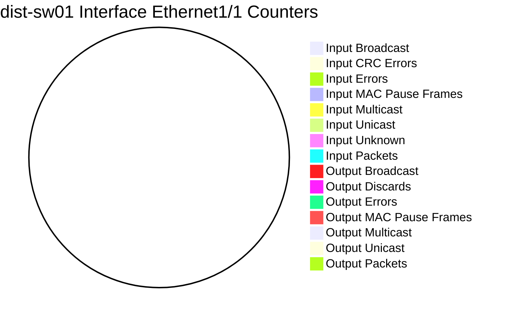
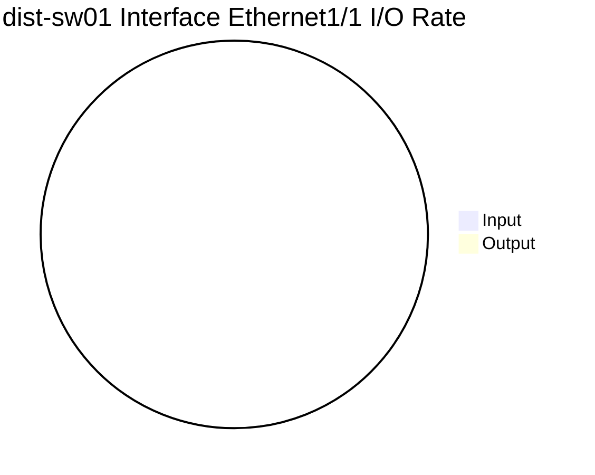
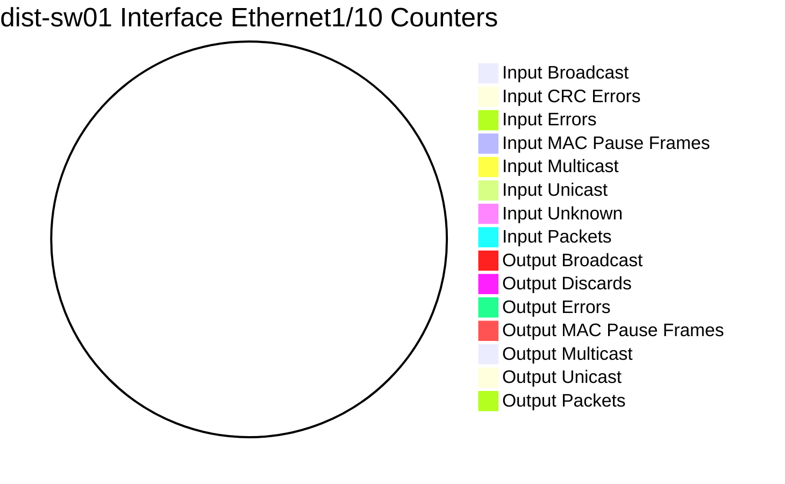
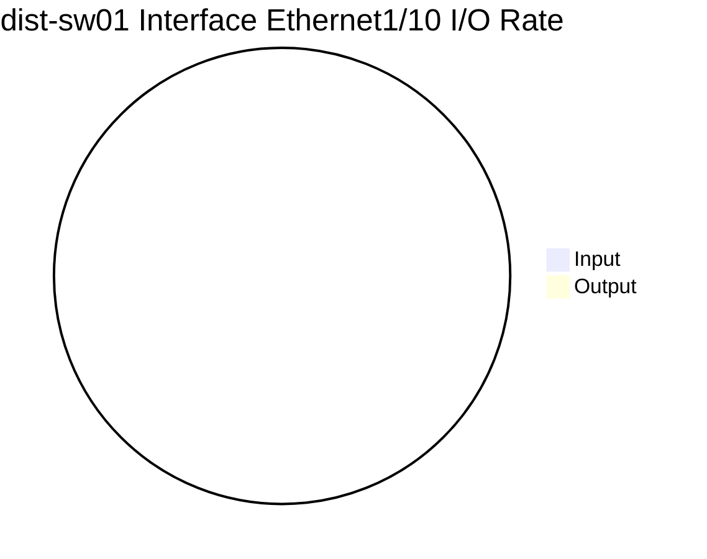
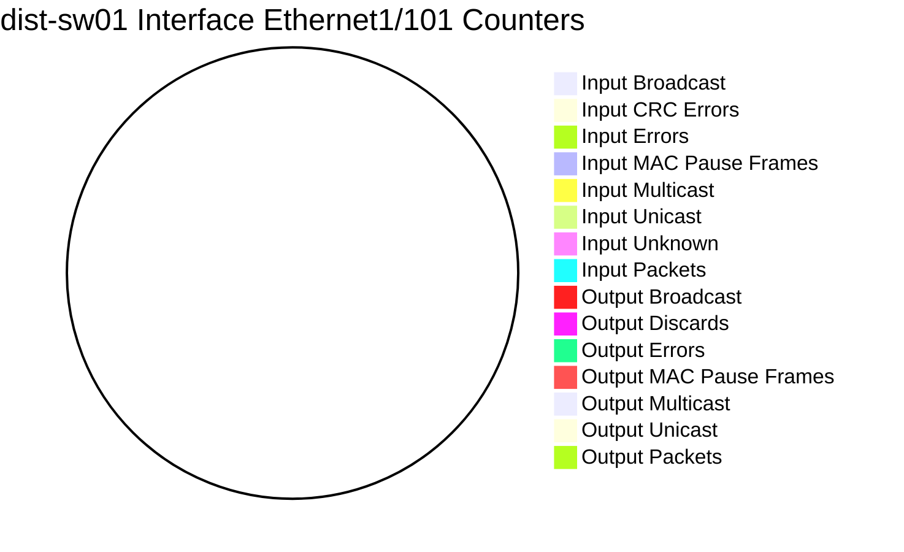
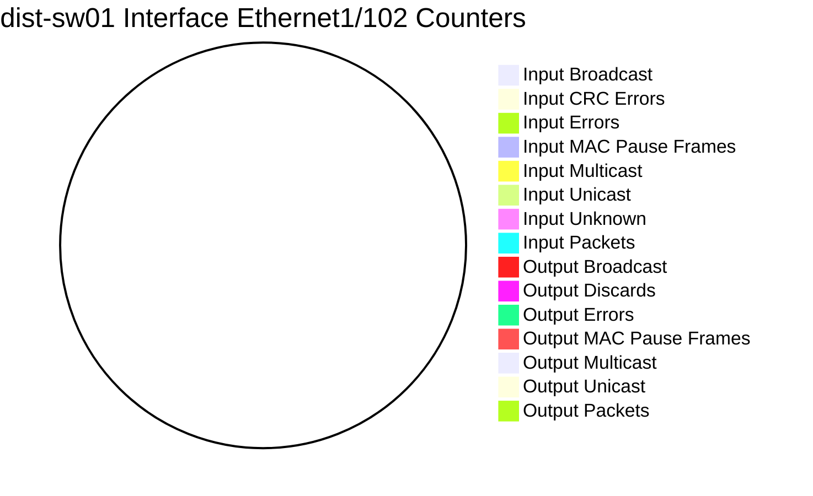
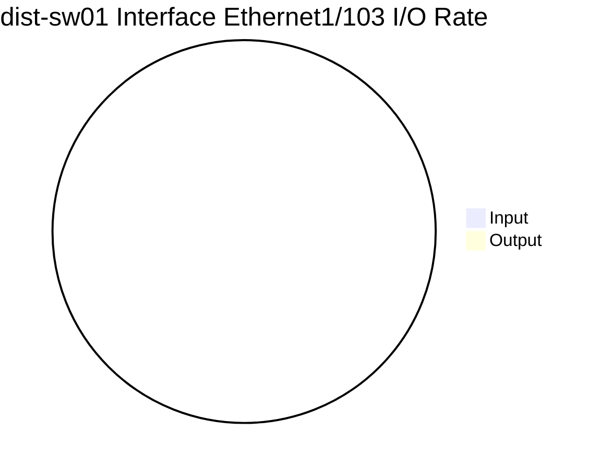
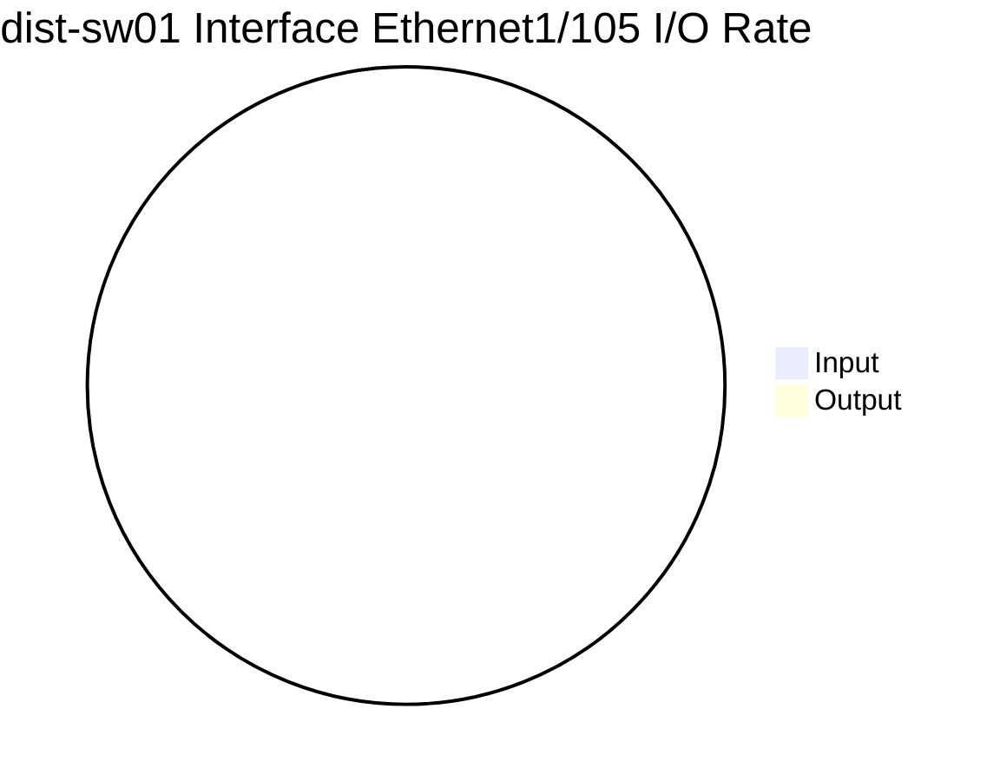

```mermaid
pie
    title dist-sw01 Interface Ethernet1/108 Counters
"Input Broadcast" : 0
"Input CRC Errors" : 0
"Input Errors " : 0
"Input MAC Pause Frames" : 0
"Input Multicast" : 0
"Input Unicast" : 0
"Input Unknown" : 0
"Input Packets" : 0
"Output Broadcast" : 0
"Output Discards" : 0
"Output Errors" : 0
"Output MAC Pause Frames" : 0
"Output Multicast" : 0
"Output Unicast" : 0
"Output Packets" : 0
```
```mermaid
pie
    title dist-sw01 Interface Ethernet1/108 I/O Rate
"Input" : 0
"Output" : 0
```
```mermaid
pie
    title dist-sw01 Interface Ethernet1/109 Counters
"Input Broadcast" : 0
"Input CRC Errors" : 0
"Input Errors " : 0
"Input MAC Pause Frames" : 0
"Input Multicast" : 0
"Input Unicast" : 0
"Input Unknown" : 0
"Input Packets" : 0
"Output Broadcast" : 0
"Output Discards" : 0
"Output Errors" : 0
"Output MAC Pause Frames" : 0
"Output Multicast" : 0
"Output Unicast" : 0
"Output Packets" : 0
```
```mermaid
pie
    title dist-sw01 Interface Ethernet1/109 I/O Rate
"Input" : 0
"Output" : 0
```
```mermaid
pie
    title dist-sw01 Interface Ethernet1/11 Counters
"Input Broadcast" : 0
"Input CRC Errors" : 0
"Input Errors " : 0
"Input MAC Pause Frames" : 0
"Input Multicast" : 0
"Input Unicast" : 0
"Input Unknown" : 0
"Input Packets" : 0
"Output Broadcast" : 0
"Output Discards" : 0
"Output Errors" : 0
"Output MAC Pause Frames" : 0
"Output Multicast" : 0
"Output Unicast" : 0
"Output Packets" : 0
```
```mermaid
pie
    title dist-sw01 Interface Ethernet1/11 I/O Rate
"Input" : 0
"Output" : 0
```
```mermaid
pie
    title dist-sw01 Interface Ethernet1/110 Counters
"Input Broadcast" : 0
"Input CRC Errors" : 0
"Input Errors " : 0
"Input MAC Pause Frames" : 0
"Input Multicast" : 0
"Input Unicast" : 0
"Input Unknown" : 0
"Input Packets" : 0
"Output Broadcast" : 0
"Output Discards" : 0
"Output Errors" : 0
"Output MAC Pause Frames" : 0
"Output Multicast" : 0
"Output Unicast" : 0
"Output Packets" : 0
```
```mermaid
pie
    title dist-sw01 Interface Ethernet1/110 I/O Rate
"Input" : 0
"Output" : 0
```
```mermaid
pie
    title dist-sw01 Interface Ethernet1/111 Counters
"Input Broadcast" : 0
"Input CRC Errors" : 0
"Input Errors " : 0
"Input MAC Pause Frames" : 0
"Input Multicast" : 0
"Input Unicast" : 0
"Input Unknown" : 0
"Input Packets" : 0
"Output Broadcast" : 0
"Output Discards" : 0
"Output Errors" : 0
"Output MAC Pause Frames" : 0
"Output Multicast" : 0
"Output Unicast" : 0
"Output Packets" : 0
```
```mermaid
pie
    title dist-sw01 Interface Ethernet1/111 I/O Rate
"Input" : 0
"Output" : 0
```
```mermaid
pie
    title dist-sw01 Interface Ethernet1/112 Counters
"Input Broadcast" : 0
"Input CRC Errors" : 0
"Input Errors " : 0
"Input MAC Pause Frames" : 0
"Input Multicast" : 0
"Input Unicast" : 0
"Input Unknown" : 0
"Input Packets" : 0
"Output Broadcast" : 0
"Output Discards" : 0
"Output Errors" : 0
"Output MAC Pause Frames" : 0
"Output Multicast" : 0
"Output Unicast" : 0
"Output Packets" : 0
```
```mermaid
pie
    title dist-sw01 Interface Ethernet1/112 I/O Rate
"Input" : 0
"Output" : 0
```
```mermaid
pie
    title dist-sw01 Interface Ethernet1/113 Counters
"Input Broadcast" : 0
"Input CRC Errors" : 0
"Input Errors " : 0
"Input MAC Pause Frames" : 0
"Input Multicast" : 0
"Input Unicast" : 0
"Input Unknown" : 0
"Input Packets" : 0
"Output Broadcast" : 0
"Output Discards" : 0
"Output Errors" : 0
"Output MAC Pause Frames" : 0
"Output Multicast" : 0
"Output Unicast" : 0
"Output Packets" : 0
```
```mermaid
pie
    title dist-sw01 Interface Ethernet1/113 I/O Rate
"Input" : 0
"Output" : 0
```
```mermaid
pie
    title dist-sw01 Interface Ethernet1/114 Counters
"Input Broadcast" : 0
"Input CRC Errors" : 0
"Input Errors " : 0
"Input MAC Pause Frames" : 0
"Input Multicast" : 0
"Input Unicast" : 0
"Input Unknown" : 0
"Input Packets" : 0
"Output Broadcast" : 0
"Output Discards" : 0
"Output Errors" : 0
"Output MAC Pause Frames" : 0
"Output Multicast" : 0
"Output Unicast" : 0
"Output Packets" : 0
```
```mermaid
pie
    title dist-sw01 Interface Ethernet1/114 I/O Rate
"Input" : 0
"Output" : 0
```
```mermaid
pie
    title dist-sw01 Interface Ethernet1/115 Counters
"Input Broadcast" : 0
"Input CRC Errors" : 0
"Input Errors " : 0
"Input MAC Pause Frames" : 0
"Input Multicast" : 0
"Input Unicast" : 0
"Input Unknown" : 0
"Input Packets" : 0
"Output Broadcast" : 0
"Output Discards" : 0
"Output Errors" : 0
"Output MAC Pause Frames" : 0
"Output Multicast" : 0
"Output Unicast" : 0
"Output Packets" : 0
```
```mermaid
pie
    title dist-sw01 Interface Ethernet1/115 I/O Rate
"Input" : 0
"Output" : 0
```
```mermaid
pie
    title dist-sw01 Interface Ethernet1/116 Counters
"Input Broadcast" : 0
"Input CRC Errors" : 0
"Input Errors " : 0
"Input MAC Pause Frames" : 0
"Input Multicast" : 0
"Input Unicast" : 0
"Input Unknown" : 0
"Input Packets" : 0
"Output Broadcast" : 0
"Output Discards" : 0
"Output Errors" : 0
"Output MAC Pause Frames" : 0
"Output Multicast" : 0
"Output Unicast" : 0
"Output Packets" : 0
```
```mermaid
pie
    title dist-sw01 Interface Ethernet1/116 I/O Rate
"Input" : 0
"Output" : 0
```
```mermaid
pie
    title dist-sw01 Interface Ethernet1/117 Counters
"Input Broadcast" : 0
"Input CRC Errors" : 0
"Input Errors " : 0
"Input MAC Pause Frames" : 0
"Input Multicast" : 0
"Input Unicast" : 0
"Input Unknown" : 0
"Input Packets" : 0
"Output Broadcast" : 0
"Output Discards" : 0
"Output Errors" : 0
"Output MAC Pause Frames" : 0
"Output Multicast" : 0
"Output Unicast" : 0
"Output Packets" : 0
```
```mermaid
pie
    title dist-sw01 Interface Ethernet1/117 I/O Rate
"Input" : 0
"Output" : 0
```
```mermaid
pie
    title dist-sw01 Interface Ethernet1/118 Counters
"Input Broadcast" : 0
"Input CRC Errors" : 0
"Input Errors " : 0
"Input MAC Pause Frames" : 0
"Input Multicast" : 0
"Input Unicast" : 0
"Input Unknown" : 0
"Input Packets" : 0
"Output Broadcast" : 0
"Output Discards" : 0
"Output Errors" : 0
"Output MAC Pause Frames" : 0
"Output Multicast" : 0
"Output Unicast" : 0
"Output Packets" : 0
```
```mermaid
pie
    title dist-sw01 Interface Ethernet1/118 I/O Rate
"Input" : 0
"Output" : 0
```
```mermaid
pie
    title dist-sw01 Interface Ethernet1/119 Counters
"Input Broadcast" : 0
"Input CRC Errors" : 0
"Input Errors " : 0
"Input MAC Pause Frames" : 0
"Input Multicast" : 0
"Input Unicast" : 0
"Input Unknown" : 0
"Input Packets" : 0
"Output Broadcast" : 0
"Output Discards" : 0
"Output Errors" : 0
"Output MAC Pause Frames" : 0
"Output Multicast" : 0
"Output Unicast" : 0
"Output Packets" : 0
```
```mermaid
pie
    title dist-sw01 Interface Ethernet1/119 I/O Rate
"Input" : 0
"Output" : 0
```
```mermaid
pie
    title dist-sw01 Interface Ethernet1/12 Counters
"Input Broadcast" : 0
"Input CRC Errors" : 0
"Input Errors " : 0
"Input MAC Pause Frames" : 0
"Input Multicast" : 0
"Input Unicast" : 0
"Input Unknown" : 0
"Input Packets" : 0
"Output Broadcast" : 0
"Output Discards" : 0
"Output Errors" : 0
"Output MAC Pause Frames" : 0
"Output Multicast" : 0
"Output Unicast" : 0
"Output Packets" : 0
```
```mermaid
pie
    title dist-sw01 Interface Ethernet1/12 I/O Rate
"Input" : 0
"Output" : 0
```
```mermaid
pie
    title dist-sw01 Interface Ethernet1/120 Counters
"Input Broadcast" : 0
"Input CRC Errors" : 0
"Input Errors " : 0
"Input MAC Pause Frames" : 0
"Input Multicast" : 0
"Input Unicast" : 0
"Input Unknown" : 0
"Input Packets" : 0
"Output Broadcast" : 0
"Output Discards" : 0
"Output Errors" : 0
"Output MAC Pause Frames" : 0
"Output Multicast" : 0
"Output Unicast" : 0
"Output Packets" : 0
```
```mermaid
pie
    title dist-sw01 Interface Ethernet1/120 I/O Rate
"Input" : 0
"Output" : 0
```
```mermaid
pie
    title dist-sw01 Interface Ethernet1/121 Counters
"Input Broadcast" : 0
"Input CRC Errors" : 0
"Input Errors " : 0
"Input MAC Pause Frames" : 0
"Input Multicast" : 0
"Input Unicast" : 0
"Input Unknown" : 0
"Input Packets" : 0
"Output Broadcast" : 0
"Output Discards" : 0
"Output Errors" : 0
"Output MAC Pause Frames" : 0
"Output Multicast" : 0
"Output Unicast" : 0
"Output Packets" : 0
```
```mermaid
pie
    title dist-sw01 Interface Ethernet1/121 I/O Rate
"Input" : 0
"Output" : 0
```
```mermaid
pie
    title dist-sw01 Interface Ethernet1/122 Counters
"Input Broadcast" : 0
"Input CRC Errors" : 0
"Input Errors " : 0
"Input MAC Pause Frames" : 0
"Input Multicast" : 0
"Input Unicast" : 0
"Input Unknown" : 0
"Input Packets" : 0
"Output Broadcast" : 0
"Output Discards" : 0
"Output Errors" : 0
"Output MAC Pause Frames" : 0
"Output Multicast" : 0
"Output Unicast" : 0
"Output Packets" : 0
```
```mermaid
pie
    title dist-sw01 Interface Ethernet1/122 I/O Rate
"Input" : 0
"Output" : 0
```
```mermaid
pie
    title dist-sw01 Interface Ethernet1/123 Counters
"Input Broadcast" : 0
"Input CRC Errors" : 0
"Input Errors " : 0
"Input MAC Pause Frames" : 0
"Input Multicast" : 0
"Input Unicast" : 0
"Input Unknown" : 0
"Input Packets" : 0
"Output Broadcast" : 0
"Output Discards" : 0
"Output Errors" : 0
"Output MAC Pause Frames" : 0
"Output Multicast" : 0
"Output Unicast" : 0
"Output Packets" : 0
```
```mermaid
pie
    title dist-sw01 Interface Ethernet1/123 I/O Rate
"Input" : 0
"Output" : 0
```
```mermaid
pie
    title dist-sw01 Interface Ethernet1/124 Counters
"Input Broadcast" : 0
"Input CRC Errors" : 0
"Input Errors " : 0
"Input MAC Pause Frames" : 0
"Input Multicast" : 0
"Input Unicast" : 0
"Input Unknown" : 0
"Input Packets" : 0
"Output Broadcast" : 0
"Output Discards" : 0
"Output Errors" : 0
"Output MAC Pause Frames" : 0
"Output Multicast" : 0
"Output Unicast" : 0
"Output Packets" : 0
```
```mermaid
pie
    title dist-sw01 Interface Ethernet1/124 I/O Rate
"Input" : 0
"Output" : 0
```
```mermaid
pie
    title dist-sw01 Interface Ethernet1/125 Counters
"Input Broadcast" : 0
"Input CRC Errors" : 0
"Input Errors " : 0
"Input MAC Pause Frames" : 0
"Input Multicast" : 0
"Input Unicast" : 0
"Input Unknown" : 0
"Input Packets" : 0
"Output Broadcast" : 0
"Output Discards" : 0
"Output Errors" : 0
"Output MAC Pause Frames" : 0
"Output Multicast" : 0
"Output Unicast" : 0
"Output Packets" : 0
```
```mermaid
pie
    title dist-sw01 Interface Ethernet1/125 I/O Rate
"Input" : 0
"Output" : 0
```
```mermaid
pie
    title dist-sw01 Interface Ethernet1/126 Counters
"Input Broadcast" : 0
"Input CRC Errors" : 0
"Input Errors " : 0
"Input MAC Pause Frames" : 0
"Input Multicast" : 0
"Input Unicast" : 0
"Input Unknown" : 0
"Input Packets" : 0
"Output Broadcast" : 0
"Output Discards" : 0
"Output Errors" : 0
"Output MAC Pause Frames" : 0
"Output Multicast" : 0
"Output Unicast" : 0
"Output Packets" : 0
```
```mermaid
pie
    title dist-sw01 Interface Ethernet1/126 I/O Rate
"Input" : 0
"Output" : 0
```
```mermaid
pie
    title dist-sw01 Interface Ethernet1/127 Counters
"Input Broadcast" : 0
"Input CRC Errors" : 0
"Input Errors " : 0
"Input MAC Pause Frames" : 0
"Input Multicast" : 0
"Input Unicast" : 0
"Input Unknown" : 0
"Input Packets" : 0
"Output Broadcast" : 0
"Output Discards" : 0
"Output Errors" : 0
"Output MAC Pause Frames" : 0
"Output Multicast" : 0
"Output Unicast" : 0
"Output Packets" : 0
```
```mermaid
pie
    title dist-sw01 Interface Ethernet1/127 I/O Rate
"Input" : 0
"Output" : 0
```
```mermaid
pie
    title dist-sw01 Interface Ethernet1/128 Counters
"Input Broadcast" : 0
"Input CRC Errors" : 0
"Input Errors " : 0
"Input MAC Pause Frames" : 0
"Input Multicast" : 0
"Input Unicast" : 0
"Input Unknown" : 0
"Input Packets" : 0
"Output Broadcast" : 0
"Output Discards" : 0
"Output Errors" : 0
"Output MAC Pause Frames" : 0
"Output Multicast" : 0
"Output Unicast" : 0
"Output Packets" : 0
```
```mermaid
pie
    title dist-sw01 Interface Ethernet1/128 I/O Rate
"Input" : 0
"Output" : 0
```
```mermaid
pie
    title dist-sw01 Interface Ethernet1/13 Counters
"Input Broadcast" : 0
"Input CRC Errors" : 0
"Input Errors " : 0
"Input MAC Pause Frames" : 0
"Input Multicast" : 0
"Input Unicast" : 0
"Input Unknown" : 0
"Input Packets" : 0
"Output Broadcast" : 0
"Output Discards" : 0
"Output Errors" : 0
"Output MAC Pause Frames" : 0
"Output Multicast" : 0
"Output Unicast" : 0
"Output Packets" : 0
```
```mermaid
pie
    title dist-sw01 Interface Ethernet1/13 I/O Rate
"Input" : 0
"Output" : 0
```
```mermaid
pie
    title dist-sw01 Interface Ethernet1/14 Counters
"Input Broadcast" : 0
"Input CRC Errors" : 0
"Input Errors " : 0
"Input MAC Pause Frames" : 0
"Input Multicast" : 0
"Input Unicast" : 0
"Input Unknown" : 0
"Input Packets" : 0
"Output Broadcast" : 0
"Output Discards" : 0
"Output Errors" : 0
"Output MAC Pause Frames" : 0
"Output Multicast" : 0
"Output Unicast" : 0
"Output Packets" : 0
```
```mermaid
pie
    title dist-sw01 Interface Ethernet1/14 I/O Rate
"Input" : 0
"Output" : 0
```
```mermaid
pie
    title dist-sw01 Interface Ethernet1/15 Counters
"Input Broadcast" : 0
"Input CRC Errors" : 0
"Input Errors " : 0
"Input MAC Pause Frames" : 0
"Input Multicast" : 0
"Input Unicast" : 0
"Input Unknown" : 0
"Input Packets" : 0
"Output Broadcast" : 0
"Output Discards" : 0
"Output Errors" : 0
"Output MAC Pause Frames" : 0
"Output Multicast" : 0
"Output Unicast" : 0
"Output Packets" : 0
```
```mermaid
pie
    title dist-sw01 Interface Ethernet1/15 I/O Rate
"Input" : 0
"Output" : 0
```
```mermaid
pie
    title dist-sw01 Interface Ethernet1/16 Counters
"Input Broadcast" : 0
"Input CRC Errors" : 0
"Input Errors " : 0
"Input MAC Pause Frames" : 0
"Input Multicast" : 0
"Input Unicast" : 0
"Input Unknown" : 0
"Input Packets" : 0
"Output Broadcast" : 0
"Output Discards" : 0
"Output Errors" : 0
"Output MAC Pause Frames" : 0
"Output Multicast" : 0
"Output Unicast" : 0
"Output Packets" : 0
```
```mermaid
pie
    title dist-sw01 Interface Ethernet1/16 I/O Rate
"Input" : 0
"Output" : 0
```
```mermaid
pie
    title dist-sw01 Interface Ethernet1/17 Counters
"Input Broadcast" : 0
"Input CRC Errors" : 0
"Input Errors " : 0
"Input MAC Pause Frames" : 0
"Input Multicast" : 0
"Input Unicast" : 0
"Input Unknown" : 0
"Input Packets" : 0
"Output Broadcast" : 0
"Output Discards" : 0
"Output Errors" : 0
"Output MAC Pause Frames" : 0
"Output Multicast" : 0
"Output Unicast" : 0
"Output Packets" : 0
```
```mermaid
pie
    title dist-sw01 Interface Ethernet1/17 I/O Rate
"Input" : 0
"Output" : 0
```
```mermaid
pie
    title dist-sw01 Interface Ethernet1/18 Counters
"Input Broadcast" : 0
"Input CRC Errors" : 0
"Input Errors " : 0
"Input MAC Pause Frames" : 0
"Input Multicast" : 0
"Input Unicast" : 0
"Input Unknown" : 0
"Input Packets" : 0
"Output Broadcast" : 0
"Output Discards" : 0
"Output Errors" : 0
"Output MAC Pause Frames" : 0
"Output Multicast" : 0
"Output Unicast" : 0
"Output Packets" : 0
```
```mermaid
pie
    title dist-sw01 Interface Ethernet1/18 I/O Rate
"Input" : 0
"Output" : 0
```
```mermaid
pie
    title dist-sw01 Interface Ethernet1/19 Counters
"Input Broadcast" : 0
"Input CRC Errors" : 0
"Input Errors " : 0
"Input MAC Pause Frames" : 0
"Input Multicast" : 0
"Input Unicast" : 0
"Input Unknown" : 0
"Input Packets" : 0
"Output Broadcast" : 0
"Output Discards" : 0
"Output Errors" : 0
"Output MAC Pause Frames" : 0
"Output Multicast" : 0
"Output Unicast" : 0
"Output Packets" : 0
```
```mermaid
pie
    title dist-sw01 Interface Ethernet1/19 I/O Rate
"Input" : 0
"Output" : 0
```
```mermaid
pie
    title dist-sw01 Interface Ethernet1/2 Counters
"Input Broadcast" : 0
"Input CRC Errors" : 0
"Input Errors " : 0
"Input MAC Pause Frames" : 0
"Input Multicast" : 0
"Input Unicast" : 0
"Input Unknown" : 0
"Input Packets" : 0
"Output Broadcast" : 0
"Output Discards" : 0
"Output Errors" : 0
"Output MAC Pause Frames" : 0
"Output Multicast" : 0
"Output Unicast" : 0
"Output Packets" : 0
```
```mermaid
pie
    title dist-sw01 Interface Ethernet1/2 I/O Rate
"Input" : 0
"Output" : 0
```
```mermaid
pie
    title dist-sw01 Interface Ethernet1/20 Counters
"Input Broadcast" : 0
"Input CRC Errors" : 0
"Input Errors " : 0
"Input MAC Pause Frames" : 0
"Input Multicast" : 0
"Input Unicast" : 0
"Input Unknown" : 0
"Input Packets" : 0
"Output Broadcast" : 0
"Output Discards" : 0
"Output Errors" : 0
"Output MAC Pause Frames" : 0
"Output Multicast" : 0
"Output Unicast" : 0
"Output Packets" : 0
```
```mermaid
pie
    title dist-sw01 Interface Ethernet1/20 I/O Rate
"Input" : 0
"Output" : 0
```
```mermaid
pie
    title dist-sw01 Interface Ethernet1/21 Counters
"Input Broadcast" : 0
"Input CRC Errors" : 0
"Input Errors " : 0
"Input MAC Pause Frames" : 0
"Input Multicast" : 0
"Input Unicast" : 0
"Input Unknown" : 0
"Input Packets" : 0
"Output Broadcast" : 0
"Output Discards" : 0
"Output Errors" : 0
"Output MAC Pause Frames" : 0
"Output Multicast" : 0
"Output Unicast" : 0
"Output Packets" : 0
```
```mermaid
pie
    title dist-sw01 Interface Ethernet1/21 I/O Rate
"Input" : 0
"Output" : 0
```
```mermaid
pie
    title dist-sw01 Interface Ethernet1/22 Counters
"Input Broadcast" : 0
"Input CRC Errors" : 0
"Input Errors " : 0
"Input MAC Pause Frames" : 0
"Input Multicast" : 0
"Input Unicast" : 0
"Input Unknown" : 0
"Input Packets" : 0
"Output Broadcast" : 0
"Output Discards" : 0
"Output Errors" : 0
"Output MAC Pause Frames" : 0
"Output Multicast" : 0
"Output Unicast" : 0
"Output Packets" : 0
```
```mermaid
pie
    title dist-sw01 Interface Ethernet1/22 I/O Rate
"Input" : 0
"Output" : 0
```
```mermaid
pie
    title dist-sw01 Interface Ethernet1/23 Counters
"Input Broadcast" : 0
"Input CRC Errors" : 0
"Input Errors " : 0
"Input MAC Pause Frames" : 0
"Input Multicast" : 0
"Input Unicast" : 0
"Input Unknown" : 0
"Input Packets" : 0
"Output Broadcast" : 0
"Output Discards" : 0
"Output Errors" : 0
"Output MAC Pause Frames" : 0
"Output Multicast" : 0
"Output Unicast" : 0
"Output Packets" : 0
```
```mermaid
pie
    title dist-sw01 Interface Ethernet1/23 I/O Rate
"Input" : 0
"Output" : 0
```
```mermaid
pie
    title dist-sw01 Interface Ethernet1/24 Counters
"Input Broadcast" : 0
"Input CRC Errors" : 0
"Input Errors " : 0
"Input MAC Pause Frames" : 0
"Input Multicast" : 0
"Input Unicast" : 0
"Input Unknown" : 0
"Input Packets" : 0
"Output Broadcast" : 0
"Output Discards" : 0
"Output Errors" : 0
"Output MAC Pause Frames" : 0
"Output Multicast" : 0
"Output Unicast" : 0
"Output Packets" : 0
```
```mermaid
pie
    title dist-sw01 Interface Ethernet1/24 I/O Rate
"Input" : 0
"Output" : 0
```
```mermaid
pie
    title dist-sw01 Interface Ethernet1/25 Counters
"Input Broadcast" : 0
"Input CRC Errors" : 0
"Input Errors " : 0
"Input MAC Pause Frames" : 0
"Input Multicast" : 0
"Input Unicast" : 0
"Input Unknown" : 0
"Input Packets" : 0
"Output Broadcast" : 0
"Output Discards" : 0
"Output Errors" : 0
"Output MAC Pause Frames" : 0
"Output Multicast" : 0
"Output Unicast" : 0
"Output Packets" : 0
```
```mermaid
pie
    title dist-sw01 Interface Ethernet1/25 I/O Rate
"Input" : 0
"Output" : 0
```
```mermaid
pie
    title dist-sw01 Interface Ethernet1/26 Counters
"Input Broadcast" : 0
"Input CRC Errors" : 0
"Input Errors " : 0
"Input MAC Pause Frames" : 0
"Input Multicast" : 0
"Input Unicast" : 0
"Input Unknown" : 0
"Input Packets" : 0
"Output Broadcast" : 0
"Output Discards" : 0
"Output Errors" : 0
"Output MAC Pause Frames" : 0
"Output Multicast" : 0
"Output Unicast" : 0
"Output Packets" : 0
```
```mermaid
pie
    title dist-sw01 Interface Ethernet1/26 I/O Rate
"Input" : 0
"Output" : 0
```
```mermaid
pie
    title dist-sw01 Interface Ethernet1/27 Counters
"Input Broadcast" : 0
"Input CRC Errors" : 0
"Input Errors " : 0
"Input MAC Pause Frames" : 0
"Input Multicast" : 0
"Input Unicast" : 0
"Input Unknown" : 0
"Input Packets" : 0
"Output Broadcast" : 0
"Output Discards" : 0
"Output Errors" : 0
"Output MAC Pause Frames" : 0
"Output Multicast" : 0
"Output Unicast" : 0
"Output Packets" : 0
```
```mermaid
pie
    title dist-sw01 Interface Ethernet1/27 I/O Rate
"Input" : 0
"Output" : 0
```
```mermaid
pie
    title dist-sw01 Interface Ethernet1/28 Counters
"Input Broadcast" : 0
"Input CRC Errors" : 0
"Input Errors " : 0
"Input MAC Pause Frames" : 0
"Input Multicast" : 0
"Input Unicast" : 0
"Input Unknown" : 0
"Input Packets" : 0
"Output Broadcast" : 0
"Output Discards" : 0
"Output Errors" : 0
"Output MAC Pause Frames" : 0
"Output Multicast" : 0
"Output Unicast" : 0
"Output Packets" : 0
```
```mermaid
pie
    title dist-sw01 Interface Ethernet1/28 I/O Rate
"Input" : 0
"Output" : 0
```
```mermaid
pie
    title dist-sw01 Interface Ethernet1/29 Counters
"Input Broadcast" : 0
"Input CRC Errors" : 0
"Input Errors " : 0
"Input MAC Pause Frames" : 0
"Input Multicast" : 0
"Input Unicast" : 0
"Input Unknown" : 0
"Input Packets" : 0
"Output Broadcast" : 0
"Output Discards" : 0
"Output Errors" : 0
"Output MAC Pause Frames" : 0
"Output Multicast" : 0
"Output Unicast" : 0
"Output Packets" : 0
```
```mermaid
pie
    title dist-sw01 Interface Ethernet1/29 I/O Rate
"Input" : 0
"Output" : 0
```
```mermaid
pie
    title dist-sw01 Interface Ethernet1/3 Counters
"Input Broadcast" : 0
"Input CRC Errors" : 0
"Input Errors " : 0
"Input MAC Pause Frames" : 0
"Input Multicast" : 0
"Input Unicast" : 0
"Input Unknown" : 0
"Input Packets" : 0
"Output Broadcast" : 0
"Output Discards" : 0
"Output Errors" : 0
"Output MAC Pause Frames" : 0
"Output Multicast" : 0
"Output Unicast" : 0
"Output Packets" : 0
```
```mermaid
pie
    title dist-sw01 Interface Ethernet1/3 I/O Rate
"Input" : 0
"Output" : 0
```
```mermaid
pie
    title dist-sw01 Interface Ethernet1/30 Counters
"Input Broadcast" : 0
"Input CRC Errors" : 0
"Input Errors " : 0
"Input MAC Pause Frames" : 0
"Input Multicast" : 0
"Input Unicast" : 0
"Input Unknown" : 0
"Input Packets" : 0
"Output Broadcast" : 0
"Output Discards" : 0
"Output Errors" : 0
"Output MAC Pause Frames" : 0
"Output Multicast" : 0
"Output Unicast" : 0
"Output Packets" : 0
```
```mermaid
pie
    title dist-sw01 Interface Ethernet1/30 I/O Rate
"Input" : 0
"Output" : 0
```
```mermaid
pie
    title dist-sw01 Interface Ethernet1/31 Counters
"Input Broadcast" : 0
"Input CRC Errors" : 0
"Input Errors " : 0
"Input MAC Pause Frames" : 0
"Input Multicast" : 0
"Input Unicast" : 0
"Input Unknown" : 0
"Input Packets" : 0
"Output Broadcast" : 0
"Output Discards" : 0
"Output Errors" : 0
"Output MAC Pause Frames" : 0
"Output Multicast" : 0
"Output Unicast" : 0
"Output Packets" : 0
```
```mermaid
pie
    title dist-sw01 Interface Ethernet1/31 I/O Rate
"Input" : 0
"Output" : 0
```
```mermaid
pie
    title dist-sw01 Interface Ethernet1/32 Counters
"Input Broadcast" : 0
"Input CRC Errors" : 0
"Input Errors " : 0
"Input MAC Pause Frames" : 0
"Input Multicast" : 0
"Input Unicast" : 0
"Input Unknown" : 0
"Input Packets" : 0
"Output Broadcast" : 0
"Output Discards" : 0
"Output Errors" : 0
"Output MAC Pause Frames" : 0
"Output Multicast" : 0
"Output Unicast" : 0
"Output Packets" : 0
```
```mermaid
pie
    title dist-sw01 Interface Ethernet1/32 I/O Rate
"Input" : 0
"Output" : 0
```
```mermaid
pie
    title dist-sw01 Interface Ethernet1/33 Counters
"Input Broadcast" : 0
"Input CRC Errors" : 0
"Input Errors " : 0
"Input MAC Pause Frames" : 0
"Input Multicast" : 0
"Input Unicast" : 0
"Input Unknown" : 0
"Input Packets" : 0
"Output Broadcast" : 0
"Output Discards" : 0
"Output Errors" : 0
"Output MAC Pause Frames" : 0
"Output Multicast" : 0
"Output Unicast" : 0
"Output Packets" : 0
```
```mermaid
pie
    title dist-sw01 Interface Ethernet1/33 I/O Rate
"Input" : 0
"Output" : 0
```
```mermaid
pie
    title dist-sw01 Interface Ethernet1/34 Counters
"Input Broadcast" : 0
"Input CRC Errors" : 0
"Input Errors " : 0
"Input MAC Pause Frames" : 0
"Input Multicast" : 0
"Input Unicast" : 0
"Input Unknown" : 0
"Input Packets" : 0
"Output Broadcast" : 0
"Output Discards" : 0
"Output Errors" : 0
"Output MAC Pause Frames" : 0
"Output Multicast" : 0
"Output Unicast" : 0
"Output Packets" : 0
```
```mermaid
pie
    title dist-sw01 Interface Ethernet1/34 I/O Rate
"Input" : 0
"Output" : 0
```
```mermaid
pie
    title dist-sw01 Interface Ethernet1/35 Counters
"Input Broadcast" : 0
"Input CRC Errors" : 0
"Input Errors " : 0
"Input MAC Pause Frames" : 0
"Input Multicast" : 0
"Input Unicast" : 0
"Input Unknown" : 0
"Input Packets" : 0
"Output Broadcast" : 0
"Output Discards" : 0
"Output Errors" : 0
"Output MAC Pause Frames" : 0
"Output Multicast" : 0
"Output Unicast" : 0
"Output Packets" : 0
```
```mermaid
pie
    title dist-sw01 Interface Ethernet1/35 I/O Rate
"Input" : 0
"Output" : 0
```
```mermaid
pie
    title dist-sw01 Interface Ethernet1/36 Counters
"Input Broadcast" : 0
"Input CRC Errors" : 0
"Input Errors " : 0
"Input MAC Pause Frames" : 0
"Input Multicast" : 0
"Input Unicast" : 0
"Input Unknown" : 0
"Input Packets" : 0
"Output Broadcast" : 0
"Output Discards" : 0
"Output Errors" : 0
"Output MAC Pause Frames" : 0
"Output Multicast" : 0
"Output Unicast" : 0
"Output Packets" : 0
```
```mermaid
pie
    title dist-sw01 Interface Ethernet1/36 I/O Rate
"Input" : 0
"Output" : 0
```
```mermaid
pie
    title dist-sw01 Interface Ethernet1/37 Counters
"Input Broadcast" : 0
"Input CRC Errors" : 0
"Input Errors " : 0
"Input MAC Pause Frames" : 0
"Input Multicast" : 0
"Input Unicast" : 0
"Input Unknown" : 0
"Input Packets" : 0
"Output Broadcast" : 0
"Output Discards" : 0
"Output Errors" : 0
"Output MAC Pause Frames" : 0
"Output Multicast" : 0
"Output Unicast" : 0
"Output Packets" : 0
```
```mermaid
pie
    title dist-sw01 Interface Ethernet1/37 I/O Rate
"Input" : 0
"Output" : 0
```
```mermaid
pie
    title dist-sw01 Interface Ethernet1/38 Counters
"Input Broadcast" : 0
"Input CRC Errors" : 0
"Input Errors " : 0
"Input MAC Pause Frames" : 0
"Input Multicast" : 0
"Input Unicast" : 0
"Input Unknown" : 0
"Input Packets" : 0
"Output Broadcast" : 0
"Output Discards" : 0
"Output Errors" : 0
"Output MAC Pause Frames" : 0
"Output Multicast" : 0
"Output Unicast" : 0
"Output Packets" : 0
```
```mermaid
pie
    title dist-sw01 Interface Ethernet1/38 I/O Rate
"Input" : 0
"Output" : 0
```
```mermaid
pie
    title dist-sw01 Interface Ethernet1/39 Counters
"Input Broadcast" : 0
"Input CRC Errors" : 0
"Input Errors " : 0
"Input MAC Pause Frames" : 0
"Input Multicast" : 0
"Input Unicast" : 0
"Input Unknown" : 0
"Input Packets" : 0
"Output Broadcast" : 0
"Output Discards" : 0
"Output Errors" : 0
"Output MAC Pause Frames" : 0
"Output Multicast" : 0
"Output Unicast" : 0
"Output Packets" : 0
```
```mermaid
pie
    title dist-sw01 Interface Ethernet1/39 I/O Rate
"Input" : 0
"Output" : 0
```
```mermaid
pie
    title dist-sw01 Interface Ethernet1/4 Counters
"Input Broadcast" : 0
"Input CRC Errors" : 0
"Input Errors " : 0
"Input MAC Pause Frames" : 0
"Input Multicast" : 0
"Input Unicast" : 0
"Input Unknown" : 0
"Input Packets" : 0
"Output Broadcast" : 0
"Output Discards" : 0
"Output Errors" : 0
"Output MAC Pause Frames" : 0
"Output Multicast" : 0
"Output Unicast" : 0
"Output Packets" : 0
```
```mermaid
pie
    title dist-sw01 Interface Ethernet1/4 I/O Rate
"Input" : 0
"Output" : 0
```
```mermaid
pie
    title dist-sw01 Interface Ethernet1/40 Counters
"Input Broadcast" : 0
"Input CRC Errors" : 0
"Input Errors " : 0
"Input MAC Pause Frames" : 0
"Input Multicast" : 0
"Input Unicast" : 0
"Input Unknown" : 0
"Input Packets" : 0
"Output Broadcast" : 0
"Output Discards" : 0
"Output Errors" : 0
"Output MAC Pause Frames" : 0
"Output Multicast" : 0
"Output Unicast" : 0
"Output Packets" : 0
```
```mermaid
pie
    title dist-sw01 Interface Ethernet1/40 I/O Rate
"Input" : 0
"Output" : 0
```
```mermaid
pie
    title dist-sw01 Interface Ethernet1/41 Counters
"Input Broadcast" : 0
"Input CRC Errors" : 0
"Input Errors " : 0
"Input MAC Pause Frames" : 0
"Input Multicast" : 0
"Input Unicast" : 0
"Input Unknown" : 0
"Input Packets" : 0
"Output Broadcast" : 0
"Output Discards" : 0
"Output Errors" : 0
"Output MAC Pause Frames" : 0
"Output Multicast" : 0
"Output Unicast" : 0
"Output Packets" : 0
```
```mermaid
pie
    title dist-sw01 Interface Ethernet1/41 I/O Rate
"Input" : 0
"Output" : 0
```
```mermaid
pie
    title dist-sw01 Interface Ethernet1/42 Counters
"Input Broadcast" : 0
"Input CRC Errors" : 0
"Input Errors " : 0
"Input MAC Pause Frames" : 0
"Input Multicast" : 0
"Input Unicast" : 0
"Input Unknown" : 0
"Input Packets" : 0
"Output Broadcast" : 0
"Output Discards" : 0
"Output Errors" : 0
"Output MAC Pause Frames" : 0
"Output Multicast" : 0
"Output Unicast" : 0
"Output Packets" : 0
```
```mermaid
pie
    title dist-sw01 Interface Ethernet1/42 I/O Rate
"Input" : 0
"Output" : 0
```
```mermaid
pie
    title dist-sw01 Interface Ethernet1/43 Counters
"Input Broadcast" : 0
"Input CRC Errors" : 0
"Input Errors " : 0
"Input MAC Pause Frames" : 0
"Input Multicast" : 0
"Input Unicast" : 0
"Input Unknown" : 0
"Input Packets" : 0
"Output Broadcast" : 0
"Output Discards" : 0
"Output Errors" : 0
"Output MAC Pause Frames" : 0
"Output Multicast" : 0
"Output Unicast" : 0
"Output Packets" : 0
```
```mermaid
pie
    title dist-sw01 Interface Ethernet1/43 I/O Rate
"Input" : 0
"Output" : 0
```
```mermaid
pie
    title dist-sw01 Interface Ethernet1/44 Counters
"Input Broadcast" : 0
"Input CRC Errors" : 0
"Input Errors " : 0
"Input MAC Pause Frames" : 0
"Input Multicast" : 0
"Input Unicast" : 0
"Input Unknown" : 0
"Input Packets" : 0
"Output Broadcast" : 0
"Output Discards" : 0
"Output Errors" : 0
"Output MAC Pause Frames" : 0
"Output Multicast" : 0
"Output Unicast" : 0
"Output Packets" : 0
```
```mermaid
pie
    title dist-sw01 Interface Ethernet1/44 I/O Rate
"Input" : 0
"Output" : 0
```
```mermaid
pie
    title dist-sw01 Interface Ethernet1/45 Counters
"Input Broadcast" : 0
"Input CRC Errors" : 0
"Input Errors " : 0
"Input MAC Pause Frames" : 0
"Input Multicast" : 0
"Input Unicast" : 0
"Input Unknown" : 0
"Input Packets" : 0
"Output Broadcast" : 0
"Output Discards" : 0
"Output Errors" : 0
"Output MAC Pause Frames" : 0
"Output Multicast" : 0
"Output Unicast" : 0
"Output Packets" : 0
```
```mermaid
pie
    title dist-sw01 Interface Ethernet1/45 I/O Rate
"Input" : 0
"Output" : 0
```
```mermaid
pie
    title dist-sw01 Interface Ethernet1/46 Counters
"Input Broadcast" : 0
"Input CRC Errors" : 0
"Input Errors " : 0
"Input MAC Pause Frames" : 0
"Input Multicast" : 0
"Input Unicast" : 0
"Input Unknown" : 0
"Input Packets" : 0
"Output Broadcast" : 0
"Output Discards" : 0
"Output Errors" : 0
"Output MAC Pause Frames" : 0
"Output Multicast" : 0
"Output Unicast" : 0
"Output Packets" : 0
```
```mermaid
pie
    title dist-sw01 Interface Ethernet1/46 I/O Rate
"Input" : 0
"Output" : 0
```
```mermaid
pie
    title dist-sw01 Interface Ethernet1/47 Counters
"Input Broadcast" : 0
"Input CRC Errors" : 0
"Input Errors " : 0
"Input MAC Pause Frames" : 0
"Input Multicast" : 0
"Input Unicast" : 0
"Input Unknown" : 0
"Input Packets" : 0
"Output Broadcast" : 0
"Output Discards" : 0
"Output Errors" : 0
"Output MAC Pause Frames" : 0
"Output Multicast" : 0
"Output Unicast" : 0
"Output Packets" : 0
```
```mermaid
pie
    title dist-sw01 Interface Ethernet1/47 I/O Rate
"Input" : 0
"Output" : 0
```
```mermaid
pie
    title dist-sw01 Interface Ethernet1/48 Counters
"Input Broadcast" : 0
"Input CRC Errors" : 0
"Input Errors " : 0
"Input MAC Pause Frames" : 0
"Input Multicast" : 0
"Input Unicast" : 0
"Input Unknown" : 0
"Input Packets" : 0
"Output Broadcast" : 0
"Output Discards" : 0
"Output Errors" : 0
"Output MAC Pause Frames" : 0
"Output Multicast" : 0
"Output Unicast" : 0
"Output Packets" : 0
```
```mermaid
pie
    title dist-sw01 Interface Ethernet1/48 I/O Rate
"Input" : 0
"Output" : 0
```
```mermaid
pie
    title dist-sw01 Interface Ethernet1/49 Counters
"Input Broadcast" : 0
"Input CRC Errors" : 0
"Input Errors " : 0
"Input MAC Pause Frames" : 0
"Input Multicast" : 0
"Input Unicast" : 0
"Input Unknown" : 0
"Input Packets" : 0
"Output Broadcast" : 0
"Output Discards" : 0
"Output Errors" : 0
"Output MAC Pause Frames" : 0
"Output Multicast" : 0
"Output Unicast" : 0
"Output Packets" : 0
```
```mermaid
pie
    title dist-sw01 Interface Ethernet1/49 I/O Rate
"Input" : 0
"Output" : 0
```
```mermaid
pie
    title dist-sw01 Interface Ethernet1/5 Counters
"Input Broadcast" : 0
"Input CRC Errors" : 0
"Input Errors " : 0
"Input MAC Pause Frames" : 0
"Input Multicast" : 0
"Input Unicast" : 0
"Input Unknown" : 0
"Input Packets" : 0
"Output Broadcast" : 0
"Output Discards" : 0
"Output Errors" : 0
"Output MAC Pause Frames" : 0
"Output Multicast" : 0
"Output Unicast" : 0
"Output Packets" : 0
```
```mermaid
pie
    title dist-sw01 Interface Ethernet1/5 I/O Rate
"Input" : 0
"Output" : 0
```
```mermaid
pie
    title dist-sw01 Interface Ethernet1/50 Counters
"Input Broadcast" : 0
"Input CRC Errors" : 0
"Input Errors " : 0
"Input MAC Pause Frames" : 0
"Input Multicast" : 0
"Input Unicast" : 0
"Input Unknown" : 0
"Input Packets" : 0
"Output Broadcast" : 0
"Output Discards" : 0
"Output Errors" : 0
"Output MAC Pause Frames" : 0
"Output Multicast" : 0
"Output Unicast" : 0
"Output Packets" : 0
```
```mermaid
pie
    title dist-sw01 Interface Ethernet1/50 I/O Rate
"Input" : 0
"Output" : 0
```
```mermaid
pie
    title dist-sw01 Interface Ethernet1/51 Counters
"Input Broadcast" : 0
"Input CRC Errors" : 0
"Input Errors " : 0
"Input MAC Pause Frames" : 0
"Input Multicast" : 0
"Input Unicast" : 0
"Input Unknown" : 0
"Input Packets" : 0
"Output Broadcast" : 0
"Output Discards" : 0
"Output Errors" : 0
"Output MAC Pause Frames" : 0
"Output Multicast" : 0
"Output Unicast" : 0
"Output Packets" : 0
```
```mermaid
pie
    title dist-sw01 Interface Ethernet1/51 I/O Rate
"Input" : 0
"Output" : 0
```
```mermaid
pie
    title dist-sw01 Interface Ethernet1/52 Counters
"Input Broadcast" : 0
"Input CRC Errors" : 0
"Input Errors " : 0
"Input MAC Pause Frames" : 0
"Input Multicast" : 0
"Input Unicast" : 0
"Input Unknown" : 0
"Input Packets" : 0
"Output Broadcast" : 0
"Output Discards" : 0
"Output Errors" : 0
"Output MAC Pause Frames" : 0
"Output Multicast" : 0
"Output Unicast" : 0
"Output Packets" : 0
```
```mermaid
pie
    title dist-sw01 Interface Ethernet1/52 I/O Rate
"Input" : 0
"Output" : 0
```
```mermaid
pie
    title dist-sw01 Interface Ethernet1/53 Counters
"Input Broadcast" : 0
"Input CRC Errors" : 0
"Input Errors " : 0
"Input MAC Pause Frames" : 0
"Input Multicast" : 0
"Input Unicast" : 0
"Input Unknown" : 0
"Input Packets" : 0
"Output Broadcast" : 0
"Output Discards" : 0
"Output Errors" : 0
"Output MAC Pause Frames" : 0
"Output Multicast" : 0
"Output Unicast" : 0
"Output Packets" : 0
```
```mermaid
pie
    title dist-sw01 Interface Ethernet1/53 I/O Rate
"Input" : 0
"Output" : 0
```
```mermaid
pie
    title dist-sw01 Interface Ethernet1/54 Counters
"Input Broadcast" : 0
"Input CRC Errors" : 0
"Input Errors " : 0
"Input MAC Pause Frames" : 0
"Input Multicast" : 0
"Input Unicast" : 0
"Input Unknown" : 0
"Input Packets" : 0
"Output Broadcast" : 0
"Output Discards" : 0
"Output Errors" : 0
"Output MAC Pause Frames" : 0
"Output Multicast" : 0
"Output Unicast" : 0
"Output Packets" : 0
```
```mermaid
pie
    title dist-sw01 Interface Ethernet1/54 I/O Rate
"Input" : 0
"Output" : 0
```
```mermaid
pie
    title dist-sw01 Interface Ethernet1/55 Counters
"Input Broadcast" : 0
"Input CRC Errors" : 0
"Input Errors " : 0
"Input MAC Pause Frames" : 0
"Input Multicast" : 0
"Input Unicast" : 0
"Input Unknown" : 0
"Input Packets" : 0
"Output Broadcast" : 0
"Output Discards" : 0
"Output Errors" : 0
"Output MAC Pause Frames" : 0
"Output Multicast" : 0
"Output Unicast" : 0
"Output Packets" : 0
```
```mermaid
pie
    title dist-sw01 Interface Ethernet1/55 I/O Rate
"Input" : 0
"Output" : 0
```
```mermaid
pie
    title dist-sw01 Interface Ethernet1/56 Counters
"Input Broadcast" : 0
"Input CRC Errors" : 0
"Input Errors " : 0
"Input MAC Pause Frames" : 0
"Input Multicast" : 0
"Input Unicast" : 0
"Input Unknown" : 0
"Input Packets" : 0
"Output Broadcast" : 0
"Output Discards" : 0
"Output Errors" : 0
"Output MAC Pause Frames" : 0
"Output Multicast" : 0
"Output Unicast" : 0
"Output Packets" : 0
```
```mermaid
pie
    title dist-sw01 Interface Ethernet1/56 I/O Rate
"Input" : 0
"Output" : 0
```
```mermaid
pie
    title dist-sw01 Interface Ethernet1/57 Counters
"Input Broadcast" : 0
"Input CRC Errors" : 0
"Input Errors " : 0
"Input MAC Pause Frames" : 0
"Input Multicast" : 0
"Input Unicast" : 0
"Input Unknown" : 0
"Input Packets" : 0
"Output Broadcast" : 0
"Output Discards" : 0
"Output Errors" : 0
"Output MAC Pause Frames" : 0
"Output Multicast" : 0
"Output Unicast" : 0
"Output Packets" : 0
```
```mermaid
pie
    title dist-sw01 Interface Ethernet1/57 I/O Rate
"Input" : 0
"Output" : 0
```
```mermaid
pie
    title dist-sw01 Interface Ethernet1/58 Counters
"Input Broadcast" : 0
"Input CRC Errors" : 0
"Input Errors " : 0
"Input MAC Pause Frames" : 0
"Input Multicast" : 0
"Input Unicast" : 0
"Input Unknown" : 0
"Input Packets" : 0
"Output Broadcast" : 0
"Output Discards" : 0
"Output Errors" : 0
"Output MAC Pause Frames" : 0
"Output Multicast" : 0
"Output Unicast" : 0
"Output Packets" : 0
```
```mermaid
pie
    title dist-sw01 Interface Ethernet1/58 I/O Rate
"Input" : 0
"Output" : 0
```
```mermaid
pie
    title dist-sw01 Interface Ethernet1/59 Counters
"Input Broadcast" : 0
"Input CRC Errors" : 0
"Input Errors " : 0
"Input MAC Pause Frames" : 0
"Input Multicast" : 0
"Input Unicast" : 0
"Input Unknown" : 0
"Input Packets" : 0
"Output Broadcast" : 0
"Output Discards" : 0
"Output Errors" : 0
"Output MAC Pause Frames" : 0
"Output Multicast" : 0
"Output Unicast" : 0
"Output Packets" : 0
```
```mermaid
pie
    title dist-sw01 Interface Ethernet1/59 I/O Rate
"Input" : 0
"Output" : 0
```
```mermaid
pie
    title dist-sw01 Interface Ethernet1/6 Counters
"Input Broadcast" : 0
"Input CRC Errors" : 0
"Input Errors " : 0
"Input MAC Pause Frames" : 0
"Input Multicast" : 0
"Input Unicast" : 0
"Input Unknown" : 0
"Input Packets" : 0
"Output Broadcast" : 0
"Output Discards" : 0
"Output Errors" : 0
"Output MAC Pause Frames" : 0
"Output Multicast" : 0
"Output Unicast" : 0
"Output Packets" : 0
```
```mermaid
pie
    title dist-sw01 Interface Ethernet1/6 I/O Rate
"Input" : 0
"Output" : 0
```
```mermaid
pie
    title dist-sw01 Interface Ethernet1/60 Counters
"Input Broadcast" : 0
"Input CRC Errors" : 0
"Input Errors " : 0
"Input MAC Pause Frames" : 0
"Input Multicast" : 0
"Input Unicast" : 0
"Input Unknown" : 0
"Input Packets" : 0
"Output Broadcast" : 0
"Output Discards" : 0
"Output Errors" : 0
"Output MAC Pause Frames" : 0
"Output Multicast" : 0
"Output Unicast" : 0
"Output Packets" : 0
```
```mermaid
pie
    title dist-sw01 Interface Ethernet1/60 I/O Rate
"Input" : 0
"Output" : 0
```
```mermaid
pie
    title dist-sw01 Interface Ethernet1/61 Counters
"Input Broadcast" : 0
"Input CRC Errors" : 0
"Input Errors " : 0
"Input MAC Pause Frames" : 0
"Input Multicast" : 0
"Input Unicast" : 0
"Input Unknown" : 0
"Input Packets" : 0
"Output Broadcast" : 0
"Output Discards" : 0
"Output Errors" : 0
"Output MAC Pause Frames" : 0
"Output Multicast" : 0
"Output Unicast" : 0
"Output Packets" : 0
```
```mermaid
pie
    title dist-sw01 Interface Ethernet1/61 I/O Rate
"Input" : 0
"Output" : 0
```
```mermaid
pie
    title dist-sw01 Interface Ethernet1/62 Counters
"Input Broadcast" : 0
"Input CRC Errors" : 0
"Input Errors " : 0
"Input MAC Pause Frames" : 0
"Input Multicast" : 0
"Input Unicast" : 0
"Input Unknown" : 0
"Input Packets" : 0
"Output Broadcast" : 0
"Output Discards" : 0
"Output Errors" : 0
"Output MAC Pause Frames" : 0
"Output Multicast" : 0
"Output Unicast" : 0
"Output Packets" : 0
```
```mermaid
pie
    title dist-sw01 Interface Ethernet1/62 I/O Rate
"Input" : 0
"Output" : 0
```
```mermaid
pie
    title dist-sw01 Interface Ethernet1/63 Counters
"Input Broadcast" : 0
"Input CRC Errors" : 0
"Input Errors " : 0
"Input MAC Pause Frames" : 0
"Input Multicast" : 0
"Input Unicast" : 0
"Input Unknown" : 0
"Input Packets" : 0
"Output Broadcast" : 0
"Output Discards" : 0
"Output Errors" : 0
"Output MAC Pause Frames" : 0
"Output Multicast" : 0
"Output Unicast" : 0
"Output Packets" : 0
```
```mermaid
pie
    title dist-sw01 Interface Ethernet1/63 I/O Rate
"Input" : 0
"Output" : 0
```
```mermaid
pie
    title dist-sw01 Interface Ethernet1/64 Counters
"Input Broadcast" : 0
"Input CRC Errors" : 0
"Input Errors " : 0
"Input MAC Pause Frames" : 0
"Input Multicast" : 0
"Input Unicast" : 0
"Input Unknown" : 0
"Input Packets" : 0
"Output Broadcast" : 0
"Output Discards" : 0
"Output Errors" : 0
"Output MAC Pause Frames" : 0
"Output Multicast" : 0
"Output Unicast" : 0
"Output Packets" : 0
```
```mermaid
pie
    title dist-sw01 Interface Ethernet1/64 I/O Rate
"Input" : 0
"Output" : 0
```
```mermaid
pie
    title dist-sw01 Interface Ethernet1/65 Counters
"Input Broadcast" : 0
"Input CRC Errors" : 0
"Input Errors " : 0
"Input MAC Pause Frames" : 0
"Input Multicast" : 0
"Input Unicast" : 0
"Input Unknown" : 0
"Input Packets" : 0
"Output Broadcast" : 0
"Output Discards" : 0
"Output Errors" : 0
"Output MAC Pause Frames" : 0
"Output Multicast" : 0
"Output Unicast" : 0
"Output Packets" : 0
```
```mermaid
pie
    title dist-sw01 Interface Ethernet1/65 I/O Rate
"Input" : 0
"Output" : 0
```
```mermaid
pie
    title dist-sw01 Interface Ethernet1/66 Counters
"Input Broadcast" : 0
"Input CRC Errors" : 0
"Input Errors " : 0
"Input MAC Pause Frames" : 0
"Input Multicast" : 0
"Input Unicast" : 0
"Input Unknown" : 0
"Input Packets" : 0
"Output Broadcast" : 0
"Output Discards" : 0
"Output Errors" : 0
"Output MAC Pause Frames" : 0
"Output Multicast" : 0
"Output Unicast" : 0
"Output Packets" : 0
```
```mermaid
pie
    title dist-sw01 Interface Ethernet1/66 I/O Rate
"Input" : 0
"Output" : 0
```
```mermaid
pie
    title dist-sw01 Interface Ethernet1/67 Counters
"Input Broadcast" : 0
"Input CRC Errors" : 0
"Input Errors " : 0
"Input MAC Pause Frames" : 0
"Input Multicast" : 0
"Input Unicast" : 0
"Input Unknown" : 0
"Input Packets" : 0
"Output Broadcast" : 0
"Output Discards" : 0
"Output Errors" : 0
"Output MAC Pause Frames" : 0
"Output Multicast" : 0
"Output Unicast" : 0
"Output Packets" : 0
```
```mermaid
pie
    title dist-sw01 Interface Ethernet1/67 I/O Rate
"Input" : 0
"Output" : 0
```
```mermaid
pie
    title dist-sw01 Interface Ethernet1/68 Counters
"Input Broadcast" : 0
"Input CRC Errors" : 0
"Input Errors " : 0
"Input MAC Pause Frames" : 0
"Input Multicast" : 0
"Input Unicast" : 0
"Input Unknown" : 0
"Input Packets" : 0
"Output Broadcast" : 0
"Output Discards" : 0
"Output Errors" : 0
"Output MAC Pause Frames" : 0
"Output Multicast" : 0
"Output Unicast" : 0
"Output Packets" : 0
```
```mermaid
pie
    title dist-sw01 Interface Ethernet1/68 I/O Rate
"Input" : 0
"Output" : 0
```
```mermaid
pie
    title dist-sw01 Interface Ethernet1/69 Counters
"Input Broadcast" : 0
"Input CRC Errors" : 0
"Input Errors " : 0
"Input MAC Pause Frames" : 0
"Input Multicast" : 0
"Input Unicast" : 0
"Input Unknown" : 0
"Input Packets" : 0
"Output Broadcast" : 0
"Output Discards" : 0
"Output Errors" : 0
"Output MAC Pause Frames" : 0
"Output Multicast" : 0
"Output Unicast" : 0
"Output Packets" : 0
```
```mermaid
pie
    title dist-sw01 Interface Ethernet1/69 I/O Rate
"Input" : 0
"Output" : 0
```
```mermaid
pie
    title dist-sw01 Interface Ethernet1/7 Counters
"Input Broadcast" : 0
"Input CRC Errors" : 0
"Input Errors " : 0
"Input MAC Pause Frames" : 0
"Input Multicast" : 0
"Input Unicast" : 0
"Input Unknown" : 0
"Input Packets" : 0
"Output Broadcast" : 0
"Output Discards" : 0
"Output Errors" : 0
"Output MAC Pause Frames" : 0
"Output Multicast" : 0
"Output Unicast" : 0
"Output Packets" : 0
```
```mermaid
pie
    title dist-sw01 Interface Ethernet1/7 I/O Rate
"Input" : 0
"Output" : 0
```
```mermaid
pie
    title dist-sw01 Interface Ethernet1/70 Counters
"Input Broadcast" : 0
"Input CRC Errors" : 0
"Input Errors " : 0
"Input MAC Pause Frames" : 0
"Input Multicast" : 0
"Input Unicast" : 0
"Input Unknown" : 0
"Input Packets" : 0
"Output Broadcast" : 0
"Output Discards" : 0
"Output Errors" : 0
"Output MAC Pause Frames" : 0
"Output Multicast" : 0
"Output Unicast" : 0
"Output Packets" : 0
```
```mermaid
pie
    title dist-sw01 Interface Ethernet1/70 I/O Rate
"Input" : 0
"Output" : 0
```
```mermaid
pie
    title dist-sw01 Interface Ethernet1/71 Counters
"Input Broadcast" : 0
"Input CRC Errors" : 0
"Input Errors " : 0
"Input MAC Pause Frames" : 0
"Input Multicast" : 0
"Input Unicast" : 0
"Input Unknown" : 0
"Input Packets" : 0
"Output Broadcast" : 0
"Output Discards" : 0
"Output Errors" : 0
"Output MAC Pause Frames" : 0
"Output Multicast" : 0
"Output Unicast" : 0
"Output Packets" : 0
```
```mermaid
pie
    title dist-sw01 Interface Ethernet1/71 I/O Rate
"Input" : 0
"Output" : 0
```
```mermaid
pie
    title dist-sw01 Interface Ethernet1/72 Counters
"Input Broadcast" : 0
"Input CRC Errors" : 0
"Input Errors " : 0
"Input MAC Pause Frames" : 0
"Input Multicast" : 0
"Input Unicast" : 0
"Input Unknown" : 0
"Input Packets" : 0
"Output Broadcast" : 0
"Output Discards" : 0
"Output Errors" : 0
"Output MAC Pause Frames" : 0
"Output Multicast" : 0
"Output Unicast" : 0
"Output Packets" : 0
```
```mermaid
pie
    title dist-sw01 Interface Ethernet1/72 I/O Rate
"Input" : 0
"Output" : 0
```
```mermaid
pie
    title dist-sw01 Interface Ethernet1/73 Counters
"Input Broadcast" : 0
"Input CRC Errors" : 0
"Input Errors " : 0
"Input MAC Pause Frames" : 0
"Input Multicast" : 0
"Input Unicast" : 0
"Input Unknown" : 0
"Input Packets" : 0
"Output Broadcast" : 0
"Output Discards" : 0
"Output Errors" : 0
"Output MAC Pause Frames" : 0
"Output Multicast" : 0
"Output Unicast" : 0
"Output Packets" : 0
```
```mermaid
pie
    title dist-sw01 Interface Ethernet1/73 I/O Rate
"Input" : 0
"Output" : 0
```
```mermaid
pie
    title dist-sw01 Interface Ethernet1/74 Counters
"Input Broadcast" : 0
"Input CRC Errors" : 0
"Input Errors " : 0
"Input MAC Pause Frames" : 0
"Input Multicast" : 0
"Input Unicast" : 0
"Input Unknown" : 0
"Input Packets" : 0
"Output Broadcast" : 0
"Output Discards" : 0
"Output Errors" : 0
"Output MAC Pause Frames" : 0
"Output Multicast" : 0
"Output Unicast" : 0
"Output Packets" : 0
```
```mermaid
pie
    title dist-sw01 Interface Ethernet1/74 I/O Rate
"Input" : 0
"Output" : 0
```
```mermaid
pie
    title dist-sw01 Interface Ethernet1/75 Counters
"Input Broadcast" : 0
"Input CRC Errors" : 0
"Input Errors " : 0
"Input MAC Pause Frames" : 0
"Input Multicast" : 0
"Input Unicast" : 0
"Input Unknown" : 0
"Input Packets" : 0
"Output Broadcast" : 0
"Output Discards" : 0
"Output Errors" : 0
"Output MAC Pause Frames" : 0
"Output Multicast" : 0
"Output Unicast" : 0
"Output Packets" : 0
```
```mermaid
pie
    title dist-sw01 Interface Ethernet1/75 I/O Rate
"Input" : 0
"Output" : 0
```
```mermaid
pie
    title dist-sw01 Interface Ethernet1/76 Counters
"Input Broadcast" : 0
"Input CRC Errors" : 0
"Input Errors " : 0
"Input MAC Pause Frames" : 0
"Input Multicast" : 0
"Input Unicast" : 0
"Input Unknown" : 0
"Input Packets" : 0
"Output Broadcast" : 0
"Output Discards" : 0
"Output Errors" : 0
"Output MAC Pause Frames" : 0
"Output Multicast" : 0
"Output Unicast" : 0
"Output Packets" : 0
```
```mermaid
pie
    title dist-sw01 Interface Ethernet1/76 I/O Rate
"Input" : 0
"Output" : 0
```
```mermaid
pie
    title dist-sw01 Interface Ethernet1/77 Counters
"Input Broadcast" : 0
"Input CRC Errors" : 0
"Input Errors " : 0
"Input MAC Pause Frames" : 0
"Input Multicast" : 0
"Input Unicast" : 0
"Input Unknown" : 0
"Input Packets" : 0
"Output Broadcast" : 0
"Output Discards" : 0
"Output Errors" : 0
"Output MAC Pause Frames" : 0
"Output Multicast" : 0
"Output Unicast" : 0
"Output Packets" : 0
```
```mermaid
pie
    title dist-sw01 Interface Ethernet1/77 I/O Rate
"Input" : 0
"Output" : 0
```
```mermaid
pie
    title dist-sw01 Interface Ethernet1/78 Counters
"Input Broadcast" : 0
"Input CRC Errors" : 0
"Input Errors " : 0
"Input MAC Pause Frames" : 0
"Input Multicast" : 0
"Input Unicast" : 0
"Input Unknown" : 0
"Input Packets" : 0
"Output Broadcast" : 0
"Output Discards" : 0
"Output Errors" : 0
"Output MAC Pause Frames" : 0
"Output Multicast" : 0
"Output Unicast" : 0
"Output Packets" : 0
```
```mermaid
pie
    title dist-sw01 Interface Ethernet1/78 I/O Rate
"Input" : 0
"Output" : 0
```
```mermaid
pie
    title dist-sw01 Interface Ethernet1/79 Counters
"Input Broadcast" : 0
"Input CRC Errors" : 0
"Input Errors " : 0
"Input MAC Pause Frames" : 0
"Input Multicast" : 0
"Input Unicast" : 0
"Input Unknown" : 0
"Input Packets" : 0
"Output Broadcast" : 0
"Output Discards" : 0
"Output Errors" : 0
"Output MAC Pause Frames" : 0
"Output Multicast" : 0
"Output Unicast" : 0
"Output Packets" : 0
```
```mermaid
pie
    title dist-sw01 Interface Ethernet1/79 I/O Rate
"Input" : 0
"Output" : 0
```
```mermaid
pie
    title dist-sw01 Interface Ethernet1/8 Counters
"Input Broadcast" : 0
"Input CRC Errors" : 0
"Input Errors " : 0
"Input MAC Pause Frames" : 0
"Input Multicast" : 0
"Input Unicast" : 0
"Input Unknown" : 0
"Input Packets" : 0
"Output Broadcast" : 0
"Output Discards" : 0
"Output Errors" : 0
"Output MAC Pause Frames" : 0
"Output Multicast" : 0
"Output Unicast" : 0
"Output Packets" : 0
```
```mermaid
pie
    title dist-sw01 Interface Ethernet1/8 I/O Rate
"Input" : 0
"Output" : 0
```
```mermaid
pie
    title dist-sw01 Interface Ethernet1/80 Counters
"Input Broadcast" : 0
"Input CRC Errors" : 0
"Input Errors " : 0
"Input MAC Pause Frames" : 0
"Input Multicast" : 0
"Input Unicast" : 0
"Input Unknown" : 0
"Input Packets" : 0
"Output Broadcast" : 0
"Output Discards" : 0
"Output Errors" : 0
"Output MAC Pause Frames" : 0
"Output Multicast" : 0
"Output Unicast" : 0
"Output Packets" : 0
```
```mermaid
pie
    title dist-sw01 Interface Ethernet1/80 I/O Rate
"Input" : 0
"Output" : 0
```
```mermaid
pie
    title dist-sw01 Interface Ethernet1/81 Counters
"Input Broadcast" : 0
"Input CRC Errors" : 0
"Input Errors " : 0
"Input MAC Pause Frames" : 0
"Input Multicast" : 0
"Input Unicast" : 0
"Input Unknown" : 0
"Input Packets" : 0
"Output Broadcast" : 0
"Output Discards" : 0
"Output Errors" : 0
"Output MAC Pause Frames" : 0
"Output Multicast" : 0
"Output Unicast" : 0
"Output Packets" : 0
```
```mermaid
pie
    title dist-sw01 Interface Ethernet1/81 I/O Rate
"Input" : 0
"Output" : 0
```
```mermaid
pie
    title dist-sw01 Interface Ethernet1/82 Counters
"Input Broadcast" : 0
"Input CRC Errors" : 0
"Input Errors " : 0
"Input MAC Pause Frames" : 0
"Input Multicast" : 0
"Input Unicast" : 0
"Input Unknown" : 0
"Input Packets" : 0
"Output Broadcast" : 0
"Output Discards" : 0
"Output Errors" : 0
"Output MAC Pause Frames" : 0
"Output Multicast" : 0
"Output Unicast" : 0
"Output Packets" : 0
```
```mermaid
pie
    title dist-sw01 Interface Ethernet1/82 I/O Rate
"Input" : 0
"Output" : 0
```
```mermaid
pie
    title dist-sw01 Interface Ethernet1/83 Counters
"Input Broadcast" : 0
"Input CRC Errors" : 0
"Input Errors " : 0
"Input MAC Pause Frames" : 0
"Input Multicast" : 0
"Input Unicast" : 0
"Input Unknown" : 0
"Input Packets" : 0
"Output Broadcast" : 0
"Output Discards" : 0
"Output Errors" : 0
"Output MAC Pause Frames" : 0
"Output Multicast" : 0
"Output Unicast" : 0
"Output Packets" : 0
```
```mermaid
pie
    title dist-sw01 Interface Ethernet1/83 I/O Rate
"Input" : 0
"Output" : 0
```
```mermaid
pie
    title dist-sw01 Interface Ethernet1/84 Counters
"Input Broadcast" : 0
"Input CRC Errors" : 0
"Input Errors " : 0
"Input MAC Pause Frames" : 0
"Input Multicast" : 0
"Input Unicast" : 0
"Input Unknown" : 0
"Input Packets" : 0
"Output Broadcast" : 0
"Output Discards" : 0
"Output Errors" : 0
"Output MAC Pause Frames" : 0
"Output Multicast" : 0
"Output Unicast" : 0
"Output Packets" : 0
```
```mermaid
pie
    title dist-sw01 Interface Ethernet1/84 I/O Rate
"Input" : 0
"Output" : 0
```
```mermaid
pie
    title dist-sw01 Interface Ethernet1/85 Counters
"Input Broadcast" : 0
"Input CRC Errors" : 0
"Input Errors " : 0
"Input MAC Pause Frames" : 0
"Input Multicast" : 0
"Input Unicast" : 0
"Input Unknown" : 0
"Input Packets" : 0
"Output Broadcast" : 0
"Output Discards" : 0
"Output Errors" : 0
"Output MAC Pause Frames" : 0
"Output Multicast" : 0
"Output Unicast" : 0
"Output Packets" : 0
```
```mermaid
pie
    title dist-sw01 Interface Ethernet1/85 I/O Rate
"Input" : 0
"Output" : 0
```
```mermaid
pie
    title dist-sw01 Interface Ethernet1/86 Counters
"Input Broadcast" : 0
"Input CRC Errors" : 0
"Input Errors " : 0
"Input MAC Pause Frames" : 0
"Input Multicast" : 0
"Input Unicast" : 0
"Input Unknown" : 0
"Input Packets" : 0
"Output Broadcast" : 0
"Output Discards" : 0
"Output Errors" : 0
"Output MAC Pause Frames" : 0
"Output Multicast" : 0
"Output Unicast" : 0
"Output Packets" : 0
```
```mermaid
pie
    title dist-sw01 Interface Ethernet1/86 I/O Rate
"Input" : 0
"Output" : 0
```
```mermaid
pie
    title dist-sw01 Interface Ethernet1/87 Counters
"Input Broadcast" : 0
"Input CRC Errors" : 0
"Input Errors " : 0
"Input MAC Pause Frames" : 0
"Input Multicast" : 0
"Input Unicast" : 0
"Input Unknown" : 0
"Input Packets" : 0
"Output Broadcast" : 0
"Output Discards" : 0
"Output Errors" : 0
"Output MAC Pause Frames" : 0
"Output Multicast" : 0
"Output Unicast" : 0
"Output Packets" : 0
```
```mermaid
pie
    title dist-sw01 Interface Ethernet1/87 I/O Rate
"Input" : 0
"Output" : 0
```
```mermaid
pie
    title dist-sw01 Interface Ethernet1/88 Counters
"Input Broadcast" : 0
"Input CRC Errors" : 0
"Input Errors " : 0
"Input MAC Pause Frames" : 0
"Input Multicast" : 0
"Input Unicast" : 0
"Input Unknown" : 0
"Input Packets" : 0
"Output Broadcast" : 0
"Output Discards" : 0
"Output Errors" : 0
"Output MAC Pause Frames" : 0
"Output Multicast" : 0
"Output Unicast" : 0
"Output Packets" : 0
```
```mermaid
pie
    title dist-sw01 Interface Ethernet1/88 I/O Rate
"Input" : 0
"Output" : 0
```
```mermaid
pie
    title dist-sw01 Interface Ethernet1/89 Counters
"Input Broadcast" : 0
"Input CRC Errors" : 0
"Input Errors " : 0
"Input MAC Pause Frames" : 0
"Input Multicast" : 0
"Input Unicast" : 0
"Input Unknown" : 0
"Input Packets" : 0
"Output Broadcast" : 0
"Output Discards" : 0
"Output Errors" : 0
"Output MAC Pause Frames" : 0
"Output Multicast" : 0
"Output Unicast" : 0
"Output Packets" : 0
```
```mermaid
pie
    title dist-sw01 Interface Ethernet1/89 I/O Rate
"Input" : 0
"Output" : 0
```
```mermaid
pie
    title dist-sw01 Interface Ethernet1/9 Counters
"Input Broadcast" : 0
"Input CRC Errors" : 0
"Input Errors " : 0
"Input MAC Pause Frames" : 0
"Input Multicast" : 0
"Input Unicast" : 0
"Input Unknown" : 0
"Input Packets" : 0
"Output Broadcast" : 0
"Output Discards" : 0
"Output Errors" : 0
"Output MAC Pause Frames" : 0
"Output Multicast" : 0
"Output Unicast" : 0
"Output Packets" : 0
```
```mermaid
pie
    title dist-sw01 Interface Ethernet1/9 I/O Rate
"Input" : 0
"Output" : 0
```
```mermaid
pie
    title dist-sw01 Interface Ethernet1/90 Counters
"Input Broadcast" : 0
"Input CRC Errors" : 0
"Input Errors " : 0
"Input MAC Pause Frames" : 0
"Input Multicast" : 0
"Input Unicast" : 0
"Input Unknown" : 0
"Input Packets" : 0
"Output Broadcast" : 0
"Output Discards" : 0
"Output Errors" : 0
"Output MAC Pause Frames" : 0
"Output Multicast" : 0
"Output Unicast" : 0
"Output Packets" : 0
```
```mermaid
pie
    title dist-sw01 Interface Ethernet1/90 I/O Rate
"Input" : 0
"Output" : 0
```
```mermaid
pie
    title dist-sw01 Interface Ethernet1/91 Counters
"Input Broadcast" : 0
"Input CRC Errors" : 0
"Input Errors " : 0
"Input MAC Pause Frames" : 0
"Input Multicast" : 0
"Input Unicast" : 0
"Input Unknown" : 0
"Input Packets" : 0
"Output Broadcast" : 0
"Output Discards" : 0
"Output Errors" : 0
"Output MAC Pause Frames" : 0
"Output Multicast" : 0
"Output Unicast" : 0
"Output Packets" : 0
```
```mermaid
pie
    title dist-sw01 Interface Ethernet1/91 I/O Rate
"Input" : 0
"Output" : 0
```
```mermaid
pie
    title dist-sw01 Interface Ethernet1/92 Counters
"Input Broadcast" : 0
"Input CRC Errors" : 0
"Input Errors " : 0
"Input MAC Pause Frames" : 0
"Input Multicast" : 0
"Input Unicast" : 0
"Input Unknown" : 0
"Input Packets" : 0
"Output Broadcast" : 0
"Output Discards" : 0
"Output Errors" : 0
"Output MAC Pause Frames" : 0
"Output Multicast" : 0
"Output Unicast" : 0
"Output Packets" : 0
```
```mermaid
pie
    title dist-sw01 Interface Ethernet1/92 I/O Rate
"Input" : 0
"Output" : 0
```
```mermaid
pie
    title dist-sw01 Interface Ethernet1/93 Counters
"Input Broadcast" : 0
"Input CRC Errors" : 0
"Input Errors " : 0
"Input MAC Pause Frames" : 0
"Input Multicast" : 0
"Input Unicast" : 0
"Input Unknown" : 0
"Input Packets" : 0
"Output Broadcast" : 0
"Output Discards" : 0
"Output Errors" : 0
"Output MAC Pause Frames" : 0
"Output Multicast" : 0
"Output Unicast" : 0
"Output Packets" : 0
```
```mermaid
pie
    title dist-sw01 Interface Ethernet1/93 I/O Rate
"Input" : 0
"Output" : 0
```
```mermaid
pie
    title dist-sw01 Interface Ethernet1/94 Counters
"Input Broadcast" : 0
"Input CRC Errors" : 0
"Input Errors " : 0
"Input MAC Pause Frames" : 0
"Input Multicast" : 0
"Input Unicast" : 0
"Input Unknown" : 0
"Input Packets" : 0
"Output Broadcast" : 0
"Output Discards" : 0
"Output Errors" : 0
"Output MAC Pause Frames" : 0
"Output Multicast" : 0
"Output Unicast" : 0
"Output Packets" : 0
```
```mermaid
pie
    title dist-sw01 Interface Ethernet1/94 I/O Rate
"Input" : 0
"Output" : 0
```
```mermaid
pie
    title dist-sw01 Interface Ethernet1/95 Counters
"Input Broadcast" : 0
"Input CRC Errors" : 0
"Input Errors " : 0
"Input MAC Pause Frames" : 0
"Input Multicast" : 0
"Input Unicast" : 0
"Input Unknown" : 0
"Input Packets" : 0
"Output Broadcast" : 0
"Output Discards" : 0
"Output Errors" : 0
"Output MAC Pause Frames" : 0
"Output Multicast" : 0
"Output Unicast" : 0
"Output Packets" : 0
```
```mermaid
pie
    title dist-sw01 Interface Ethernet1/95 I/O Rate
"Input" : 0
"Output" : 0
```
```mermaid
pie
    title dist-sw01 Interface Ethernet1/96 Counters
"Input Broadcast" : 0
"Input CRC Errors" : 0
"Input Errors " : 0
"Input MAC Pause Frames" : 0
"Input Multicast" : 0
"Input Unicast" : 0
"Input Unknown" : 0
"Input Packets" : 0
"Output Broadcast" : 0
"Output Discards" : 0
"Output Errors" : 0
"Output MAC Pause Frames" : 0
"Output Multicast" : 0
"Output Unicast" : 0
"Output Packets" : 0
```
```mermaid
pie
    title dist-sw01 Interface Ethernet1/96 I/O Rate
"Input" : 0
"Output" : 0
```
```mermaid
pie
    title dist-sw01 Interface Ethernet1/97 Counters
"Input Broadcast" : 0
"Input CRC Errors" : 0
"Input Errors " : 0
"Input MAC Pause Frames" : 0
"Input Multicast" : 0
"Input Unicast" : 0
"Input Unknown" : 0
"Input Packets" : 0
"Output Broadcast" : 0
"Output Discards" : 0
"Output Errors" : 0
"Output MAC Pause Frames" : 0
"Output Multicast" : 0
"Output Unicast" : 0
"Output Packets" : 0
```
```mermaid
pie
    title dist-sw01 Interface Ethernet1/97 I/O Rate
"Input" : 0
"Output" : 0
```
```mermaid
pie
    title dist-sw01 Interface Ethernet1/98 Counters
"Input Broadcast" : 0
"Input CRC Errors" : 0
"Input Errors " : 0
"Input MAC Pause Frames" : 0
"Input Multicast" : 0
"Input Unicast" : 0
"Input Unknown" : 0
"Input Packets" : 0
"Output Broadcast" : 0
"Output Discards" : 0
"Output Errors" : 0
"Output MAC Pause Frames" : 0
"Output Multicast" : 0
"Output Unicast" : 0
"Output Packets" : 0
```
```mermaid
pie
    title dist-sw01 Interface Ethernet1/98 I/O Rate
"Input" : 0
"Output" : 0
```
```mermaid
pie
    title dist-sw01 Interface Ethernet1/99 Counters
"Input Broadcast" : 0
"Input CRC Errors" : 0
"Input Errors " : 0
"Input MAC Pause Frames" : 0
"Input Multicast" : 0
"Input Unicast" : 0
"Input Unknown" : 0
"Input Packets" : 0
"Output Broadcast" : 0
"Output Discards" : 0
"Output Errors" : 0
"Output MAC Pause Frames" : 0
"Output Multicast" : 0
"Output Unicast" : 0
"Output Packets" : 0
```
```mermaid
pie
    title dist-sw01 Interface Ethernet1/99 I/O Rate
"Input" : 0
"Output" : 0
```
```mermaid
pie
    title dist-sw01 Interface Mgmt0 Counters
"Input Broadcast" : 9
"Input Multicast" : 315
"Input Unicast" : 13523
"Input Packets" : 14302
```
```mermaid
pie
    title dist-sw01 Interface Mgmt0 I/O Rate
"Input" : 17592
"Output" : 189896
```
```mermaid
pie
    title dist-sw01 Interface Port-channel1 Counters
"Input Broadcast" : 0
"Input CRC Errors" : 0
"Input Errors " : 0
"Input MAC Pause Frames" : 0
"Input Multicast" : 0
"Input Unicast" : 0
"Input Unknown" : 0
"Input Packets" : 0
"Output Broadcast" : 0
"Output Discards" : 0
"Output Errors" : 0
"Output MAC Pause Frames" : 0
"Output Multicast" : 0
"Output Unicast" : 0
"Output Packets" : 0
```
```mermaid
pie
    title dist-sw01 Interface Port-channel1 I/O Rate
"Input" : 0
"Output" : 0
```