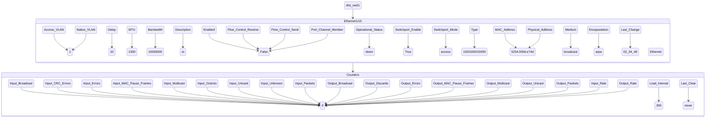
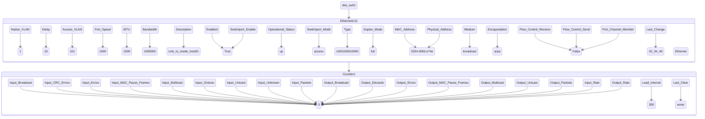

```mermaid
stateDiagram
dist_sw01 --> Ethernet1/105
Ethernet1/105 --> Counters
    state Ethernet1/105{
Description -->  N/A
Enabled -->  True
Operational_Status -->  down
Access_VLAN -->  1
Native_VLAN -->  1
Switchport_Enable -->  True
Switchport_Mode -->  access
Type -->  100/1000/10000 Ethernet
Bandwidth -->  10000000
MTU -->  1500
MAC_Address -->  5254.000d.e7ac
Physical_Address -->  5254.000d.e7ac
Medium -->  broadcast
Delay -->  10
Encapsulation -->  arpa
Flow_Control_Receive -->  False
Flow_Control_Send -->  False


Port_Channel_Member -->  False
Last_Change -->  never
    }
state Counters{
Input_Broadcast -->  0
Input_CRC_Errors -->  0
Input_Errors -->  0
Input_MAC_Pause_Frames -->  0
Input_Multicast -->  0
Input_Octects -->  0
Input_Unicast -->  0
Input_Unknown -->  0
Input_Packets -->  0
Output_Broadcast -->  0
Output_Discards -->  0
Output_Errors -->  0
Output_MAC_Pause_Frames -->  0
Output_Multicast -->  0
Output_Unicast -->  0
Output_Packets -->  0
Last_Clear -->  never
Input_Rate -->  0
Load_Interval -->  300
Output_Rate -->  0
}
```

```mermaid
stateDiagram
dist_sw01 --> Ethernet1/114
Ethernet1/114 --> Counters
    state Ethernet1/114{
Description -->  N/A
Enabled -->  True
Operational_Status -->  down
Access_VLAN -->  1
Native_VLAN -->  1
Switchport_Enable -->  True
Switchport_Mode -->  access
Type -->  100/1000/10000 Ethernet
Bandwidth -->  10000000
MTU -->  1500
MAC_Address -->  5254.000d.e7b5
Physical_Address -->  5254.000d.e7b5
Medium -->  broadcast
Delay -->  10
Encapsulation -->  arpa
Flow_Control_Receive -->  False
Flow_Control_Send -->  False


Port_Channel_Member -->  False
Last_Change -->  never
    }
state Counters{
Input_Broadcast -->  0
Input_CRC_Errors -->  0
Input_Errors -->  0
Input_MAC_Pause_Frames -->  0
Input_Multicast -->  0
Input_Octects -->  0
Input_Unicast -->  0
Input_Unknown -->  0
Input_Packets -->  0
Output_Broadcast -->  0
Output_Discards -->  0
Output_Errors -->  0
Output_MAC_Pause_Frames -->  0
Output_Multicast -->  0
Output_Unicast -->  0
Output_Packets -->  0
Last_Clear -->  never
Input_Rate -->  0
Load_Interval -->  300
Output_Rate -->  0
}
```

```mermaid
stateDiagram
dist_sw01 --> Ethernet1/1
Ethernet1/1 --> Counters
    state Ethernet1/1{
Description -->  VPC_Peer_Link
Enabled -->  True
Operational_Status -->  up
Access_VLAN -->  1
Native_VLAN -->  1
Switchport_Enable -->  True
Switchport_Mode -->  trunk
Type -->  100/1000/10000 Ethernet
Bandwidth -->  1000000
Port_Speed -->  1000
Duplex_Mode -->  full
MTU -->  9216
MAC_Address -->  5254.000d.e744
Physical_Address -->  5254.000d.e744
Medium -->  broadcast
Delay -->  10
Encapsulation -->  arpa
Flow_Control_Receive -->  False
Flow_Control_Send -->  False

Port_Channel_Interface -->  Port-channel1


Port_Channel_Member -->  True
Last_Change -->  02_34_32
    }
state Counters{
Input_Broadcast -->  0
Input_CRC_Errors -->  0
Input_Errors -->  0
Input_MAC_Pause_Frames -->  0
Input_Multicast -->  0
Input_Octects -->  0
Input_Unicast -->  0
Input_Unknown -->  0
Input_Packets -->  0
Output_Broadcast -->  0
Output_Discards -->  0
Output_Errors -->  0
Output_MAC_Pause_Frames -->  0
Output_Multicast -->  0
Output_Unicast -->  0
Output_Packets -->  0
Last_Clear -->  never
Input_Rate -->  0
Load_Interval -->  300
Output_Rate -->  0
}
```












```mermaid
stateDiagram
dist_sw01 --> Ethernet1/117
Ethernet1/117 --> Counters
    state Ethernet1/117{
Description -->  N/A
Enabled -->  True
Operational_Status -->  down
Access_VLAN -->  1
Native_VLAN -->  1
Switchport_Enable -->  True
Switchport_Mode -->  access
Type -->  100/1000/10000 Ethernet
Bandwidth -->  10000000
MTU -->  1500
MAC_Address -->  5254.000d.e7b8
Physical_Address -->  5254.000d.e7b8
Medium -->  broadcast
Delay -->  10
Encapsulation -->  arpa
Flow_Control_Receive -->  False
Flow_Control_Send -->  False


Port_Channel_Member -->  False
Last_Change -->  never
    }
state Counters{
Input_Broadcast -->  0
Input_CRC_Errors -->  0
Input_Errors -->  0
Input_MAC_Pause_Frames -->  0
Input_Multicast -->  0
Input_Octects -->  0
Input_Unicast -->  0
Input_Unknown -->  0
Input_Packets -->  0
Output_Broadcast -->  0
Output_Discards -->  0
Output_Errors -->  0
Output_MAC_Pause_Frames -->  0
Output_Multicast -->  0
Output_Unicast -->  0
Output_Packets -->  0
Last_Clear -->  never
Input_Rate -->  0
Load_Interval -->  300
Output_Rate -->  0
}
```
```mermaid
stateDiagram
dist_sw01 --> Ethernet1/118
Ethernet1/118 --> Counters
    state Ethernet1/118{
Description -->  N/A
Enabled -->  True
Operational_Status -->  down
Access_VLAN -->  1
Native_VLAN -->  1
Switchport_Enable -->  True
Switchport_Mode -->  access
Type -->  100/1000/10000 Ethernet
Bandwidth -->  10000000
MTU -->  1500
MAC_Address -->  5254.000d.e7b9
Physical_Address -->  5254.000d.e7b9
Medium -->  broadcast
Delay -->  10
Encapsulation -->  arpa
Flow_Control_Receive -->  False
Flow_Control_Send -->  False


Port_Channel_Member -->  False
Last_Change -->  never
    }
state Counters{
Input_Broadcast -->  0
Input_CRC_Errors -->  0
Input_Errors -->  0
Input_MAC_Pause_Frames -->  0
Input_Multicast -->  0
Input_Octects -->  0
Input_Unicast -->  0
Input_Unknown -->  0
Input_Packets -->  0
Output_Broadcast -->  0
Output_Discards -->  0
Output_Errors -->  0
Output_MAC_Pause_Frames -->  0
Output_Multicast -->  0
Output_Unicast -->  0
Output_Packets -->  0
Last_Clear -->  never
Input_Rate -->  0
Load_Interval -->  300
Output_Rate -->  0
}
```
```mermaid
stateDiagram
dist_sw01 --> Ethernet1/119
Ethernet1/119 --> Counters
    state Ethernet1/119{
Description -->  N/A
Enabled -->  True
Operational_Status -->  down
Access_VLAN -->  1
Native_VLAN -->  1
Switchport_Enable -->  True
Switchport_Mode -->  access
Type -->  100/1000/10000 Ethernet
Bandwidth -->  10000000
MTU -->  1500
MAC_Address -->  5254.000d.e7ba
Physical_Address -->  5254.000d.e7ba
Medium -->  broadcast
Delay -->  10
Encapsulation -->  arpa
Flow_Control_Receive -->  False
Flow_Control_Send -->  False


Port_Channel_Member -->  False
Last_Change -->  never
    }
state Counters{
Input_Broadcast -->  0
Input_CRC_Errors -->  0
Input_Errors -->  0
Input_MAC_Pause_Frames -->  0
Input_Multicast -->  0
Input_Octects -->  0
Input_Unicast -->  0
Input_Unknown -->  0
Input_Packets -->  0
Output_Broadcast -->  0
Output_Discards -->  0
Output_Errors -->  0
Output_MAC_Pause_Frames -->  0
Output_Multicast -->  0
Output_Unicast -->  0
Output_Packets -->  0
Last_Clear -->  never
Input_Rate -->  0
Load_Interval -->  300
Output_Rate -->  0
}
```
```mermaid
stateDiagram
dist_sw01 --> Ethernet1/12
Ethernet1/12 --> Counters
    state Ethernet1/12{
Description -->  N/A
Enabled -->  True
Operational_Status -->  down
Access_VLAN -->  1
Native_VLAN -->  1
Switchport_Enable -->  True
Switchport_Mode -->  access
Type -->  100/1000/10000 Ethernet
Bandwidth -->  10000000
MTU -->  1500
MAC_Address -->  5254.000d.e74f
Physical_Address -->  5254.000d.e74f
Medium -->  broadcast
Delay -->  10
Encapsulation -->  arpa
Flow_Control_Receive -->  False
Flow_Control_Send -->  False


Port_Channel_Member -->  False
Last_Change -->  never
    }
state Counters{
Input_Broadcast -->  0
Input_CRC_Errors -->  0
Input_Errors -->  0
Input_MAC_Pause_Frames -->  0
Input_Multicast -->  0
Input_Octects -->  0
Input_Unicast -->  0
Input_Unknown -->  0
Input_Packets -->  0
Output_Broadcast -->  0
Output_Discards -->  0
Output_Errors -->  0
Output_MAC_Pause_Frames -->  0
Output_Multicast -->  0
Output_Unicast -->  0
Output_Packets -->  0
Last_Clear -->  never
Input_Rate -->  0
Load_Interval -->  300
Output_Rate -->  0
}
```
```mermaid
stateDiagram
dist_sw01 --> Ethernet1/120
Ethernet1/120 --> Counters
    state Ethernet1/120{
Description -->  N/A
Enabled -->  True
Operational_Status -->  down
Access_VLAN -->  1
Native_VLAN -->  1
Switchport_Enable -->  True
Switchport_Mode -->  access
Type -->  100/1000/10000 Ethernet
Bandwidth -->  10000000
MTU -->  1500
MAC_Address -->  5254.000d.e7bb
Physical_Address -->  5254.000d.e7bb
Medium -->  broadcast
Delay -->  10
Encapsulation -->  arpa
Flow_Control_Receive -->  False
Flow_Control_Send -->  False


Port_Channel_Member -->  False
Last_Change -->  never
    }
state Counters{
Input_Broadcast -->  0
Input_CRC_Errors -->  0
Input_Errors -->  0
Input_MAC_Pause_Frames -->  0
Input_Multicast -->  0
Input_Octects -->  0
Input_Unicast -->  0
Input_Unknown -->  0
Input_Packets -->  0
Output_Broadcast -->  0
Output_Discards -->  0
Output_Errors -->  0
Output_MAC_Pause_Frames -->  0
Output_Multicast -->  0
Output_Unicast -->  0
Output_Packets -->  0
Last_Clear -->  never
Input_Rate -->  0
Load_Interval -->  300
Output_Rate -->  0
}
```
```mermaid
stateDiagram
dist_sw01 --> Ethernet1/121
Ethernet1/121 --> Counters
    state Ethernet1/121{
Description -->  N/A
Enabled -->  True
Operational_Status -->  down
Access_VLAN -->  1
Native_VLAN -->  1
Switchport_Enable -->  True
Switchport_Mode -->  access
Type -->  100/1000/10000 Ethernet
Bandwidth -->  10000000
MTU -->  1500
MAC_Address -->  5254.000d.e7bc
Physical_Address -->  5254.000d.e7bc
Medium -->  broadcast
Delay -->  10
Encapsulation -->  arpa
Flow_Control_Receive -->  False
Flow_Control_Send -->  False


Port_Channel_Member -->  False
Last_Change -->  never
    }
state Counters{
Input_Broadcast -->  0
Input_CRC_Errors -->  0
Input_Errors -->  0
Input_MAC_Pause_Frames -->  0
Input_Multicast -->  0
Input_Octects -->  0
Input_Unicast -->  0
Input_Unknown -->  0
Input_Packets -->  0
Output_Broadcast -->  0
Output_Discards -->  0
Output_Errors -->  0
Output_MAC_Pause_Frames -->  0
Output_Multicast -->  0
Output_Unicast -->  0
Output_Packets -->  0
Last_Clear -->  never
Input_Rate -->  0
Load_Interval -->  300
Output_Rate -->  0
}
```
```mermaid
stateDiagram
dist_sw01 --> Ethernet1/122
Ethernet1/122 --> Counters
    state Ethernet1/122{
Description -->  N/A
Enabled -->  True
Operational_Status -->  down
Access_VLAN -->  1
Native_VLAN -->  1
Switchport_Enable -->  True
Switchport_Mode -->  access
Type -->  100/1000/10000 Ethernet
Bandwidth -->  10000000
MTU -->  1500
MAC_Address -->  5254.000d.e7bd
Physical_Address -->  5254.000d.e7bd
Medium -->  broadcast
Delay -->  10
Encapsulation -->  arpa
Flow_Control_Receive -->  False
Flow_Control_Send -->  False


Port_Channel_Member -->  False
Last_Change -->  never
    }
state Counters{
Input_Broadcast -->  0
Input_CRC_Errors -->  0
Input_Errors -->  0
Input_MAC_Pause_Frames -->  0
Input_Multicast -->  0
Input_Octects -->  0
Input_Unicast -->  0
Input_Unknown -->  0
Input_Packets -->  0
Output_Broadcast -->  0
Output_Discards -->  0
Output_Errors -->  0
Output_MAC_Pause_Frames -->  0
Output_Multicast -->  0
Output_Unicast -->  0
Output_Packets -->  0
Last_Clear -->  never
Input_Rate -->  0
Load_Interval -->  300
Output_Rate -->  0
}
```
```mermaid
stateDiagram
dist_sw01 --> Ethernet1/123
Ethernet1/123 --> Counters
    state Ethernet1/123{
Description -->  N/A
Enabled -->  True
Operational_Status -->  down
Access_VLAN -->  1
Native_VLAN -->  1
Switchport_Enable -->  True
Switchport_Mode -->  access
Type -->  100/1000/10000 Ethernet
Bandwidth -->  10000000
MTU -->  1500
MAC_Address -->  5254.000d.e7be
Physical_Address -->  5254.000d.e7be
Medium -->  broadcast
Delay -->  10
Encapsulation -->  arpa
Flow_Control_Receive -->  False
Flow_Control_Send -->  False


Port_Channel_Member -->  False
Last_Change -->  never
    }
state Counters{
Input_Broadcast -->  0
Input_CRC_Errors -->  0
Input_Errors -->  0
Input_MAC_Pause_Frames -->  0
Input_Multicast -->  0
Input_Octects -->  0
Input_Unicast -->  0
Input_Unknown -->  0
Input_Packets -->  0
Output_Broadcast -->  0
Output_Discards -->  0
Output_Errors -->  0
Output_MAC_Pause_Frames -->  0
Output_Multicast -->  0
Output_Unicast -->  0
Output_Packets -->  0
Last_Clear -->  never
Input_Rate -->  0
Load_Interval -->  300
Output_Rate -->  0
}
```
```mermaid
stateDiagram
dist_sw01 --> Ethernet1/124
Ethernet1/124 --> Counters
    state Ethernet1/124{
Description -->  N/A
Enabled -->  True
Operational_Status -->  down
Access_VLAN -->  1
Native_VLAN -->  1
Switchport_Enable -->  True
Switchport_Mode -->  access
Type -->  100/1000/10000 Ethernet
Bandwidth -->  10000000
MTU -->  1500
MAC_Address -->  5254.000d.e7bf
Physical_Address -->  5254.000d.e7bf
Medium -->  broadcast
Delay -->  10
Encapsulation -->  arpa
Flow_Control_Receive -->  False
Flow_Control_Send -->  False


Port_Channel_Member -->  False
Last_Change -->  never
    }
state Counters{
Input_Broadcast -->  0
Input_CRC_Errors -->  0
Input_Errors -->  0
Input_MAC_Pause_Frames -->  0
Input_Multicast -->  0
Input_Octects -->  0
Input_Unicast -->  0
Input_Unknown -->  0
Input_Packets -->  0
Output_Broadcast -->  0
Output_Discards -->  0
Output_Errors -->  0
Output_MAC_Pause_Frames -->  0
Output_Multicast -->  0
Output_Unicast -->  0
Output_Packets -->  0
Last_Clear -->  never
Input_Rate -->  0
Load_Interval -->  300
Output_Rate -->  0
}
```
```mermaid
stateDiagram
dist_sw01 --> Ethernet1/125
Ethernet1/125 --> Counters
    state Ethernet1/125{
Description -->  N/A
Enabled -->  True
Operational_Status -->  down
Access_VLAN -->  1
Native_VLAN -->  1
Switchport_Enable -->  True
Switchport_Mode -->  access
Type -->  100/1000/10000 Ethernet
Bandwidth -->  10000000
MTU -->  1500
MAC_Address -->  5254.000d.e7c0
Physical_Address -->  5254.000d.e7c0
Medium -->  broadcast
Delay -->  10
Encapsulation -->  arpa
Flow_Control_Receive -->  False
Flow_Control_Send -->  False


Port_Channel_Member -->  False
Last_Change -->  never
    }
state Counters{
Input_Broadcast -->  0
Input_CRC_Errors -->  0
Input_Errors -->  0
Input_MAC_Pause_Frames -->  0
Input_Multicast -->  0
Input_Octects -->  0
Input_Unicast -->  0
Input_Unknown -->  0
Input_Packets -->  0
Output_Broadcast -->  0
Output_Discards -->  0
Output_Errors -->  0
Output_MAC_Pause_Frames -->  0
Output_Multicast -->  0
Output_Unicast -->  0
Output_Packets -->  0
Last_Clear -->  never
Input_Rate -->  0
Load_Interval -->  300
Output_Rate -->  0
}
```
```mermaid
stateDiagram
dist_sw01 --> Ethernet1/126
Ethernet1/126 --> Counters
    state Ethernet1/126{
Description -->  N/A
Enabled -->  True
Operational_Status -->  down
Access_VLAN -->  1
Native_VLAN -->  1
Switchport_Enable -->  True
Switchport_Mode -->  access
Type -->  100/1000/10000 Ethernet
Bandwidth -->  10000000
MTU -->  1500
MAC_Address -->  5254.000d.e7c1
Physical_Address -->  5254.000d.e7c1
Medium -->  broadcast
Delay -->  10
Encapsulation -->  arpa
Flow_Control_Receive -->  False
Flow_Control_Send -->  False


Port_Channel_Member -->  False
Last_Change -->  never
    }
state Counters{
Input_Broadcast -->  0
Input_CRC_Errors -->  0
Input_Errors -->  0
Input_MAC_Pause_Frames -->  0
Input_Multicast -->  0
Input_Octects -->  0
Input_Unicast -->  0
Input_Unknown -->  0
Input_Packets -->  0
Output_Broadcast -->  0
Output_Discards -->  0
Output_Errors -->  0
Output_MAC_Pause_Frames -->  0
Output_Multicast -->  0
Output_Unicast -->  0
Output_Packets -->  0
Last_Clear -->  never
Input_Rate -->  0
Load_Interval -->  300
Output_Rate -->  0
}
```
```mermaid
stateDiagram
dist_sw01 --> Ethernet1/127
Ethernet1/127 --> Counters
    state Ethernet1/127{
Description -->  N/A
Enabled -->  True
Operational_Status -->  down
Access_VLAN -->  1
Native_VLAN -->  1
Switchport_Enable -->  True
Switchport_Mode -->  access
Type -->  100/1000/10000 Ethernet
Bandwidth -->  10000000
MTU -->  1500
MAC_Address -->  5254.000d.e7c2
Physical_Address -->  5254.000d.e7c2
Medium -->  broadcast
Delay -->  10
Encapsulation -->  arpa
Flow_Control_Receive -->  False
Flow_Control_Send -->  False


Port_Channel_Member -->  False
Last_Change -->  never
    }
state Counters{
Input_Broadcast -->  0
Input_CRC_Errors -->  0
Input_Errors -->  0
Input_MAC_Pause_Frames -->  0
Input_Multicast -->  0
Input_Octects -->  0
Input_Unicast -->  0
Input_Unknown -->  0
Input_Packets -->  0
Output_Broadcast -->  0
Output_Discards -->  0
Output_Errors -->  0
Output_MAC_Pause_Frames -->  0
Output_Multicast -->  0
Output_Unicast -->  0
Output_Packets -->  0
Last_Clear -->  never
Input_Rate -->  0
Load_Interval -->  300
Output_Rate -->  0
}
```
```mermaid
stateDiagram
dist_sw01 --> Ethernet1/128
Ethernet1/128 --> Counters
    state Ethernet1/128{
Description -->  N/A
Enabled -->  True
Operational_Status -->  down
Access_VLAN -->  1
Native_VLAN -->  1
Switchport_Enable -->  True
Switchport_Mode -->  access
Type -->  100/1000/10000 Ethernet
Bandwidth -->  10000000
MTU -->  1500
MAC_Address -->  5254.000d.e7c3
Physical_Address -->  5254.000d.e7c3
Medium -->  broadcast
Delay -->  10
Encapsulation -->  arpa
Flow_Control_Receive -->  False
Flow_Control_Send -->  False


Port_Channel_Member -->  False
Last_Change -->  never
    }
state Counters{
Input_Broadcast -->  0
Input_CRC_Errors -->  0
Input_Errors -->  0
Input_MAC_Pause_Frames -->  0
Input_Multicast -->  0
Input_Octects -->  0
Input_Unicast -->  0
Input_Unknown -->  0
Input_Packets -->  0
Output_Broadcast -->  0
Output_Discards -->  0
Output_Errors -->  0
Output_MAC_Pause_Frames -->  0
Output_Multicast -->  0
Output_Unicast -->  0
Output_Packets -->  0
Last_Clear -->  never
Input_Rate -->  0
Load_Interval -->  300
Output_Rate -->  0
}
```
```mermaid
stateDiagram
dist_sw01 --> Ethernet1/13
Ethernet1/13 --> Counters
    state Ethernet1/13{
Description -->  N/A
Enabled -->  True
Operational_Status -->  down
Access_VLAN -->  1
Native_VLAN -->  1
Switchport_Enable -->  True
Switchport_Mode -->  access
Type -->  100/1000/10000 Ethernet
Bandwidth -->  10000000
MTU -->  1500
MAC_Address -->  5254.000d.e750
Physical_Address -->  5254.000d.e750
Medium -->  broadcast
Delay -->  10
Encapsulation -->  arpa
Flow_Control_Receive -->  False
Flow_Control_Send -->  False


Port_Channel_Member -->  False
Last_Change -->  never
    }
state Counters{
Input_Broadcast -->  0
Input_CRC_Errors -->  0
Input_Errors -->  0
Input_MAC_Pause_Frames -->  0
Input_Multicast -->  0
Input_Octects -->  0
Input_Unicast -->  0
Input_Unknown -->  0
Input_Packets -->  0
Output_Broadcast -->  0
Output_Discards -->  0
Output_Errors -->  0
Output_MAC_Pause_Frames -->  0
Output_Multicast -->  0
Output_Unicast -->  0
Output_Packets -->  0
Last_Clear -->  never
Input_Rate -->  0
Load_Interval -->  300
Output_Rate -->  0
}
```
```mermaid
stateDiagram
dist_sw01 --> Ethernet1/14
Ethernet1/14 --> Counters
    state Ethernet1/14{
Description -->  N/A
Enabled -->  True
Operational_Status -->  down
Access_VLAN -->  1
Native_VLAN -->  1
Switchport_Enable -->  True
Switchport_Mode -->  access
Type -->  100/1000/10000 Ethernet
Bandwidth -->  10000000
MTU -->  1500
MAC_Address -->  5254.000d.e751
Physical_Address -->  5254.000d.e751
Medium -->  broadcast
Delay -->  10
Encapsulation -->  arpa
Flow_Control_Receive -->  False
Flow_Control_Send -->  False


Port_Channel_Member -->  False
Last_Change -->  never
    }
state Counters{
Input_Broadcast -->  0
Input_CRC_Errors -->  0
Input_Errors -->  0
Input_MAC_Pause_Frames -->  0
Input_Multicast -->  0
Input_Octects -->  0
Input_Unicast -->  0
Input_Unknown -->  0
Input_Packets -->  0
Output_Broadcast -->  0
Output_Discards -->  0
Output_Errors -->  0
Output_MAC_Pause_Frames -->  0
Output_Multicast -->  0
Output_Unicast -->  0
Output_Packets -->  0
Last_Clear -->  never
Input_Rate -->  0
Load_Interval -->  300
Output_Rate -->  0
}
```
```mermaid
stateDiagram
dist_sw01 --> Ethernet1/15
Ethernet1/15 --> Counters
    state Ethernet1/15{
Description -->  N/A
Enabled -->  True
Operational_Status -->  down
Access_VLAN -->  1
Native_VLAN -->  1
Switchport_Enable -->  True
Switchport_Mode -->  access
Type -->  100/1000/10000 Ethernet
Bandwidth -->  10000000
MTU -->  1500
MAC_Address -->  5254.000d.e752
Physical_Address -->  5254.000d.e752
Medium -->  broadcast
Delay -->  10
Encapsulation -->  arpa
Flow_Control_Receive -->  False
Flow_Control_Send -->  False


Port_Channel_Member -->  False
Last_Change -->  never
    }
state Counters{
Input_Broadcast -->  0
Input_CRC_Errors -->  0
Input_Errors -->  0
Input_MAC_Pause_Frames -->  0
Input_Multicast -->  0
Input_Octects -->  0
Input_Unicast -->  0
Input_Unknown -->  0
Input_Packets -->  0
Output_Broadcast -->  0
Output_Discards -->  0
Output_Errors -->  0
Output_MAC_Pause_Frames -->  0
Output_Multicast -->  0
Output_Unicast -->  0
Output_Packets -->  0
Last_Clear -->  never
Input_Rate -->  0
Load_Interval -->  300
Output_Rate -->  0
}
```
```mermaid
stateDiagram
dist_sw01 --> Ethernet1/16
Ethernet1/16 --> Counters
    state Ethernet1/16{
Description -->  N/A
Enabled -->  True
Operational_Status -->  down
Access_VLAN -->  1
Native_VLAN -->  1
Switchport_Enable -->  True
Switchport_Mode -->  access
Type -->  100/1000/10000 Ethernet
Bandwidth -->  10000000
MTU -->  1500
MAC_Address -->  5254.000d.e753
Physical_Address -->  5254.000d.e753
Medium -->  broadcast
Delay -->  10
Encapsulation -->  arpa
Flow_Control_Receive -->  False
Flow_Control_Send -->  False


Port_Channel_Member -->  False
Last_Change -->  never
    }
state Counters{
Input_Broadcast -->  0
Input_CRC_Errors -->  0
Input_Errors -->  0
Input_MAC_Pause_Frames -->  0
Input_Multicast -->  0
Input_Octects -->  0
Input_Unicast -->  0
Input_Unknown -->  0
Input_Packets -->  0
Output_Broadcast -->  0
Output_Discards -->  0
Output_Errors -->  0
Output_MAC_Pause_Frames -->  0
Output_Multicast -->  0
Output_Unicast -->  0
Output_Packets -->  0
Last_Clear -->  never
Input_Rate -->  0
Load_Interval -->  300
Output_Rate -->  0
}
```
```mermaid
stateDiagram
dist_sw01 --> Ethernet1/17
Ethernet1/17 --> Counters
    state Ethernet1/17{
Description -->  N/A
Enabled -->  True
Operational_Status -->  down
Access_VLAN -->  1
Native_VLAN -->  1
Switchport_Enable -->  True
Switchport_Mode -->  access
Type -->  100/1000/10000 Ethernet
Bandwidth -->  10000000
MTU -->  1500
MAC_Address -->  5254.000d.e754
Physical_Address -->  5254.000d.e754
Medium -->  broadcast
Delay -->  10
Encapsulation -->  arpa
Flow_Control_Receive -->  False
Flow_Control_Send -->  False


Port_Channel_Member -->  False
Last_Change -->  never
    }
state Counters{
Input_Broadcast -->  0
Input_CRC_Errors -->  0
Input_Errors -->  0
Input_MAC_Pause_Frames -->  0
Input_Multicast -->  0
Input_Octects -->  0
Input_Unicast -->  0
Input_Unknown -->  0
Input_Packets -->  0
Output_Broadcast -->  0
Output_Discards -->  0
Output_Errors -->  0
Output_MAC_Pause_Frames -->  0
Output_Multicast -->  0
Output_Unicast -->  0
Output_Packets -->  0
Last_Clear -->  never
Input_Rate -->  0
Load_Interval -->  300
Output_Rate -->  0
}
```
```mermaid
stateDiagram
dist_sw01 --> Ethernet1/18
Ethernet1/18 --> Counters
    state Ethernet1/18{
Description -->  N/A
Enabled -->  True
Operational_Status -->  down
Access_VLAN -->  1
Native_VLAN -->  1
Switchport_Enable -->  True
Switchport_Mode -->  access
Type -->  100/1000/10000 Ethernet
Bandwidth -->  10000000
MTU -->  1500
MAC_Address -->  5254.000d.e755
Physical_Address -->  5254.000d.e755
Medium -->  broadcast
Delay -->  10
Encapsulation -->  arpa
Flow_Control_Receive -->  False
Flow_Control_Send -->  False


Port_Channel_Member -->  False
Last_Change -->  never
    }
state Counters{
Input_Broadcast -->  0
Input_CRC_Errors -->  0
Input_Errors -->  0
Input_MAC_Pause_Frames -->  0
Input_Multicast -->  0
Input_Octects -->  0
Input_Unicast -->  0
Input_Unknown -->  0
Input_Packets -->  0
Output_Broadcast -->  0
Output_Discards -->  0
Output_Errors -->  0
Output_MAC_Pause_Frames -->  0
Output_Multicast -->  0
Output_Unicast -->  0
Output_Packets -->  0
Last_Clear -->  never
Input_Rate -->  0
Load_Interval -->  300
Output_Rate -->  0
}
```
```mermaid
stateDiagram
dist_sw01 --> Ethernet1/19
Ethernet1/19 --> Counters
    state Ethernet1/19{
Description -->  N/A
Enabled -->  True
Operational_Status -->  down
Access_VLAN -->  1
Native_VLAN -->  1
Switchport_Enable -->  True
Switchport_Mode -->  access
Type -->  100/1000/10000 Ethernet
Bandwidth -->  10000000
MTU -->  1500
MAC_Address -->  5254.000d.e756
Physical_Address -->  5254.000d.e756
Medium -->  broadcast
Delay -->  10
Encapsulation -->  arpa
Flow_Control_Receive -->  False
Flow_Control_Send -->  False


Port_Channel_Member -->  False
Last_Change -->  never
    }
state Counters{
Input_Broadcast -->  0
Input_CRC_Errors -->  0
Input_Errors -->  0
Input_MAC_Pause_Frames -->  0
Input_Multicast -->  0
Input_Octects -->  0
Input_Unicast -->  0
Input_Unknown -->  0
Input_Packets -->  0
Output_Broadcast -->  0
Output_Discards -->  0
Output_Errors -->  0
Output_MAC_Pause_Frames -->  0
Output_Multicast -->  0
Output_Unicast -->  0
Output_Packets -->  0
Last_Clear -->  never
Input_Rate -->  0
Load_Interval -->  300
Output_Rate -->  0
}
```
```mermaid
stateDiagram
dist_sw01 --> Ethernet1/2
Ethernet1/2 --> Counters
    state Ethernet1/2{
Description -->  VPC_Peer_Link
Enabled -->  True
Operational_Status -->  up
Access_VLAN -->  1
Native_VLAN -->  1
Switchport_Enable -->  True
Switchport_Mode -->  trunk
Type -->  100/1000/10000 Ethernet
Bandwidth -->  1000000
Port_Speed -->  1000
Duplex_Mode -->  full
MTU -->  9216
MAC_Address -->  5254.000d.e745
Physical_Address -->  5254.000d.e745
Medium -->  broadcast
Delay -->  10
Encapsulation -->  arpa
Flow_Control_Receive -->  False
Flow_Control_Send -->  False

Port_Channel_Interface -->  Port-channel1


Port_Channel_Member -->  True
Last_Change -->  02_34_33
    }
state Counters{
Input_Broadcast -->  0
Input_CRC_Errors -->  0
Input_Errors -->  0
Input_MAC_Pause_Frames -->  0
Input_Multicast -->  0
Input_Octects -->  0
Input_Unicast -->  0
Input_Unknown -->  0
Input_Packets -->  0
Output_Broadcast -->  0
Output_Discards -->  0
Output_Errors -->  0
Output_MAC_Pause_Frames -->  0
Output_Multicast -->  0
Output_Unicast -->  0
Output_Packets -->  0
Last_Clear -->  never
Input_Rate -->  0
Load_Interval -->  300
Output_Rate -->  0
}
```
```mermaid
stateDiagram
dist_sw01 --> Ethernet1/20
Ethernet1/20 --> Counters
    state Ethernet1/20{
Description -->  N/A
Enabled -->  True
Operational_Status -->  down
Access_VLAN -->  1
Native_VLAN -->  1
Switchport_Enable -->  True
Switchport_Mode -->  access
Type -->  100/1000/10000 Ethernet
Bandwidth -->  10000000
MTU -->  1500
MAC_Address -->  5254.000d.e757
Physical_Address -->  5254.000d.e757
Medium -->  broadcast
Delay -->  10
Encapsulation -->  arpa
Flow_Control_Receive -->  False
Flow_Control_Send -->  False


Port_Channel_Member -->  False
Last_Change -->  never
    }
state Counters{
Input_Broadcast -->  0
Input_CRC_Errors -->  0
Input_Errors -->  0
Input_MAC_Pause_Frames -->  0
Input_Multicast -->  0
Input_Octects -->  0
Input_Unicast -->  0
Input_Unknown -->  0
Input_Packets -->  0
Output_Broadcast -->  0
Output_Discards -->  0
Output_Errors -->  0
Output_MAC_Pause_Frames -->  0
Output_Multicast -->  0
Output_Unicast -->  0
Output_Packets -->  0
Last_Clear -->  never
Input_Rate -->  0
Load_Interval -->  300
Output_Rate -->  0
}
```
```mermaid
stateDiagram
dist_sw01 --> Ethernet1/21
Ethernet1/21 --> Counters
    state Ethernet1/21{
Description -->  N/A
Enabled -->  True
Operational_Status -->  down
Access_VLAN -->  1
Native_VLAN -->  1
Switchport_Enable -->  True
Switchport_Mode -->  access
Type -->  100/1000/10000 Ethernet
Bandwidth -->  10000000
MTU -->  1500
MAC_Address -->  5254.000d.e758
Physical_Address -->  5254.000d.e758
Medium -->  broadcast
Delay -->  10
Encapsulation -->  arpa
Flow_Control_Receive -->  False
Flow_Control_Send -->  False


Port_Channel_Member -->  False
Last_Change -->  never
    }
state Counters{
Input_Broadcast -->  0
Input_CRC_Errors -->  0
Input_Errors -->  0
Input_MAC_Pause_Frames -->  0
Input_Multicast -->  0
Input_Octects -->  0
Input_Unicast -->  0
Input_Unknown -->  0
Input_Packets -->  0
Output_Broadcast -->  0
Output_Discards -->  0
Output_Errors -->  0
Output_MAC_Pause_Frames -->  0
Output_Multicast -->  0
Output_Unicast -->  0
Output_Packets -->  0
Last_Clear -->  never
Input_Rate -->  0
Load_Interval -->  300
Output_Rate -->  0
}
```
```mermaid
stateDiagram
dist_sw01 --> Ethernet1/22
Ethernet1/22 --> Counters
    state Ethernet1/22{
Description -->  N/A
Enabled -->  True
Operational_Status -->  down
Access_VLAN -->  1
Native_VLAN -->  1
Switchport_Enable -->  True
Switchport_Mode -->  access
Type -->  100/1000/10000 Ethernet
Bandwidth -->  10000000
MTU -->  1500
MAC_Address -->  5254.000d.e759
Physical_Address -->  5254.000d.e759
Medium -->  broadcast
Delay -->  10
Encapsulation -->  arpa
Flow_Control_Receive -->  False
Flow_Control_Send -->  False


Port_Channel_Member -->  False
Last_Change -->  never
    }
state Counters{
Input_Broadcast -->  0
Input_CRC_Errors -->  0
Input_Errors -->  0
Input_MAC_Pause_Frames -->  0
Input_Multicast -->  0
Input_Octects -->  0
Input_Unicast -->  0
Input_Unknown -->  0
Input_Packets -->  0
Output_Broadcast -->  0
Output_Discards -->  0
Output_Errors -->  0
Output_MAC_Pause_Frames -->  0
Output_Multicast -->  0
Output_Unicast -->  0
Output_Packets -->  0
Last_Clear -->  never
Input_Rate -->  0
Load_Interval -->  300
Output_Rate -->  0
}
```
```mermaid
stateDiagram
dist_sw01 --> Ethernet1/23
Ethernet1/23 --> Counters
    state Ethernet1/23{
Description -->  N/A
Enabled -->  True
Operational_Status -->  down
Access_VLAN -->  1
Native_VLAN -->  1
Switchport_Enable -->  True
Switchport_Mode -->  access
Type -->  100/1000/10000 Ethernet
Bandwidth -->  10000000
MTU -->  1500
MAC_Address -->  5254.000d.e75a
Physical_Address -->  5254.000d.e75a
Medium -->  broadcast
Delay -->  10
Encapsulation -->  arpa
Flow_Control_Receive -->  False
Flow_Control_Send -->  False


Port_Channel_Member -->  False
Last_Change -->  never
    }
state Counters{
Input_Broadcast -->  0
Input_CRC_Errors -->  0
Input_Errors -->  0
Input_MAC_Pause_Frames -->  0
Input_Multicast -->  0
Input_Octects -->  0
Input_Unicast -->  0
Input_Unknown -->  0
Input_Packets -->  0
Output_Broadcast -->  0
Output_Discards -->  0
Output_Errors -->  0
Output_MAC_Pause_Frames -->  0
Output_Multicast -->  0
Output_Unicast -->  0
Output_Packets -->  0
Last_Clear -->  never
Input_Rate -->  0
Load_Interval -->  300
Output_Rate -->  0
}
```
```mermaid
stateDiagram
dist_sw01 --> Ethernet1/24
Ethernet1/24 --> Counters
    state Ethernet1/24{
Description -->  N/A
Enabled -->  True
Operational_Status -->  down
Access_VLAN -->  1
Native_VLAN -->  1
Switchport_Enable -->  True
Switchport_Mode -->  access
Type -->  100/1000/10000 Ethernet
Bandwidth -->  10000000
MTU -->  1500
MAC_Address -->  5254.000d.e75b
Physical_Address -->  5254.000d.e75b
Medium -->  broadcast
Delay -->  10
Encapsulation -->  arpa
Flow_Control_Receive -->  False
Flow_Control_Send -->  False


Port_Channel_Member -->  False
Last_Change -->  never
    }
state Counters{
Input_Broadcast -->  0
Input_CRC_Errors -->  0
Input_Errors -->  0
Input_MAC_Pause_Frames -->  0
Input_Multicast -->  0
Input_Octects -->  0
Input_Unicast -->  0
Input_Unknown -->  0
Input_Packets -->  0
Output_Broadcast -->  0
Output_Discards -->  0
Output_Errors -->  0
Output_MAC_Pause_Frames -->  0
Output_Multicast -->  0
Output_Unicast -->  0
Output_Packets -->  0
Last_Clear -->  never
Input_Rate -->  0
Load_Interval -->  300
Output_Rate -->  0
}
```
```mermaid
stateDiagram
dist_sw01 --> Ethernet1/25
Ethernet1/25 --> Counters
    state Ethernet1/25{
Description -->  N/A
Enabled -->  True
Operational_Status -->  down
Access_VLAN -->  1
Native_VLAN -->  1
Switchport_Enable -->  True
Switchport_Mode -->  access
Type -->  100/1000/10000 Ethernet
Bandwidth -->  10000000
MTU -->  1500
MAC_Address -->  5254.000d.e75c
Physical_Address -->  5254.000d.e75c
Medium -->  broadcast
Delay -->  10
Encapsulation -->  arpa
Flow_Control_Receive -->  False
Flow_Control_Send -->  False


Port_Channel_Member -->  False
Last_Change -->  never
    }
state Counters{
Input_Broadcast -->  0
Input_CRC_Errors -->  0
Input_Errors -->  0
Input_MAC_Pause_Frames -->  0
Input_Multicast -->  0
Input_Octects -->  0
Input_Unicast -->  0
Input_Unknown -->  0
Input_Packets -->  0
Output_Broadcast -->  0
Output_Discards -->  0
Output_Errors -->  0
Output_MAC_Pause_Frames -->  0
Output_Multicast -->  0
Output_Unicast -->  0
Output_Packets -->  0
Last_Clear -->  never
Input_Rate -->  0
Load_Interval -->  300
Output_Rate -->  0
}
```
```mermaid
stateDiagram
dist_sw01 --> Ethernet1/26
Ethernet1/26 --> Counters
    state Ethernet1/26{
Description -->  N/A
Enabled -->  True
Operational_Status -->  down
Access_VLAN -->  1
Native_VLAN -->  1
Switchport_Enable -->  True
Switchport_Mode -->  access
Type -->  100/1000/10000 Ethernet
Bandwidth -->  10000000
MTU -->  1500
MAC_Address -->  5254.000d.e75d
Physical_Address -->  5254.000d.e75d
Medium -->  broadcast
Delay -->  10
Encapsulation -->  arpa
Flow_Control_Receive -->  False
Flow_Control_Send -->  False


Port_Channel_Member -->  False
Last_Change -->  never
    }
state Counters{
Input_Broadcast -->  0
Input_CRC_Errors -->  0
Input_Errors -->  0
Input_MAC_Pause_Frames -->  0
Input_Multicast -->  0
Input_Octects -->  0
Input_Unicast -->  0
Input_Unknown -->  0
Input_Packets -->  0
Output_Broadcast -->  0
Output_Discards -->  0
Output_Errors -->  0
Output_MAC_Pause_Frames -->  0
Output_Multicast -->  0
Output_Unicast -->  0
Output_Packets -->  0
Last_Clear -->  never
Input_Rate -->  0
Load_Interval -->  300
Output_Rate -->  0
}
```
```mermaid
stateDiagram
dist_sw01 --> Ethernet1/27
Ethernet1/27 --> Counters
    state Ethernet1/27{
Description -->  N/A
Enabled -->  True
Operational_Status -->  down
Access_VLAN -->  1
Native_VLAN -->  1
Switchport_Enable -->  True
Switchport_Mode -->  access
Type -->  100/1000/10000 Ethernet
Bandwidth -->  10000000
MTU -->  1500
MAC_Address -->  5254.000d.e75e
Physical_Address -->  5254.000d.e75e
Medium -->  broadcast
Delay -->  10
Encapsulation -->  arpa
Flow_Control_Receive -->  False
Flow_Control_Send -->  False


Port_Channel_Member -->  False
Last_Change -->  never
    }
state Counters{
Input_Broadcast -->  0
Input_CRC_Errors -->  0
Input_Errors -->  0
Input_MAC_Pause_Frames -->  0
Input_Multicast -->  0
Input_Octects -->  0
Input_Unicast -->  0
Input_Unknown -->  0
Input_Packets -->  0
Output_Broadcast -->  0
Output_Discards -->  0
Output_Errors -->  0
Output_MAC_Pause_Frames -->  0
Output_Multicast -->  0
Output_Unicast -->  0
Output_Packets -->  0
Last_Clear -->  never
Input_Rate -->  0
Load_Interval -->  300
Output_Rate -->  0
}
```
```mermaid
stateDiagram
dist_sw01 --> Ethernet1/28
Ethernet1/28 --> Counters
    state Ethernet1/28{
Description -->  N/A
Enabled -->  True
Operational_Status -->  down
Access_VLAN -->  1
Native_VLAN -->  1
Switchport_Enable -->  True
Switchport_Mode -->  access
Type -->  100/1000/10000 Ethernet
Bandwidth -->  10000000
MTU -->  1500
MAC_Address -->  5254.000d.e75f
Physical_Address -->  5254.000d.e75f
Medium -->  broadcast
Delay -->  10
Encapsulation -->  arpa
Flow_Control_Receive -->  False
Flow_Control_Send -->  False


Port_Channel_Member -->  False
Last_Change -->  never
    }
state Counters{
Input_Broadcast -->  0
Input_CRC_Errors -->  0
Input_Errors -->  0
Input_MAC_Pause_Frames -->  0
Input_Multicast -->  0
Input_Octects -->  0
Input_Unicast -->  0
Input_Unknown -->  0
Input_Packets -->  0
Output_Broadcast -->  0
Output_Discards -->  0
Output_Errors -->  0
Output_MAC_Pause_Frames -->  0
Output_Multicast -->  0
Output_Unicast -->  0
Output_Packets -->  0
Last_Clear -->  never
Input_Rate -->  0
Load_Interval -->  300
Output_Rate -->  0
}
```
```mermaid
stateDiagram
dist_sw01 --> Ethernet1/29
Ethernet1/29 --> Counters
    state Ethernet1/29{
Description -->  N/A
Enabled -->  True
Operational_Status -->  down
Access_VLAN -->  1
Native_VLAN -->  1
Switchport_Enable -->  True
Switchport_Mode -->  access
Type -->  100/1000/10000 Ethernet
Bandwidth -->  10000000
MTU -->  1500
MAC_Address -->  5254.000d.e760
Physical_Address -->  5254.000d.e760
Medium -->  broadcast
Delay -->  10
Encapsulation -->  arpa
Flow_Control_Receive -->  False
Flow_Control_Send -->  False


Port_Channel_Member -->  False
Last_Change -->  never
    }
state Counters{
Input_Broadcast -->  0
Input_CRC_Errors -->  0
Input_Errors -->  0
Input_MAC_Pause_Frames -->  0
Input_Multicast -->  0
Input_Octects -->  0
Input_Unicast -->  0
Input_Unknown -->  0
Input_Packets -->  0
Output_Broadcast -->  0
Output_Discards -->  0
Output_Errors -->  0
Output_MAC_Pause_Frames -->  0
Output_Multicast -->  0
Output_Unicast -->  0
Output_Packets -->  0
Last_Clear -->  never
Input_Rate -->  0
Load_Interval -->  300
Output_Rate -->  0
}
```
```mermaid
stateDiagram
dist_sw01 --> Ethernet1/3
Ethernet1/3 --> Counters
    state Ethernet1/3{
Description -->  L3_link_to_dist_rtr01
Enabled -->  True
Operational_Status -->  up
Type -->  100/1000/10000 Ethernet
Bandwidth -->  1000000
Port_Speed -->  1000
Duplex_Mode -->  full
MTU -->  1500
MAC_Address -->  5254.000d.e743
Physical_Address -->  5254.000d.e746
IP_Address -->  172.16.252.1/30
Medium -->  broadcast
Delay -->  10
Encapsulation -->  arpa
Flow_Control_Receive -->  False
Flow_Control_Send -->  False


Port_Channel_Member -->  False
Last_Change -->  02_34_51
    }
state Counters{
Input_Broadcast -->  0
Input_CRC_Errors -->  0
Input_Errors -->  0
Input_MAC_Pause_Frames -->  0
Input_Multicast -->  0
Input_Octects -->  0
Input_Unicast -->  0
Input_Unknown -->  0
Input_Packets -->  0
Output_Broadcast -->  0
Output_Discards -->  0
Output_Errors -->  0
Output_MAC_Pause_Frames -->  0
Output_Multicast -->  0
Output_Unicast -->  0
Output_Packets -->  0
Last_Clear -->  never
Input_Rate -->  0
Load_Interval -->  300
Output_Rate -->  0
}
```
```mermaid
stateDiagram
dist_sw01 --> Ethernet1/30
Ethernet1/30 --> Counters
    state Ethernet1/30{
Description -->  N/A
Enabled -->  True
Operational_Status -->  down
Access_VLAN -->  1
Native_VLAN -->  1
Switchport_Enable -->  True
Switchport_Mode -->  access
Type -->  100/1000/10000 Ethernet
Bandwidth -->  10000000
MTU -->  1500
MAC_Address -->  5254.000d.e761
Physical_Address -->  5254.000d.e761
Medium -->  broadcast
Delay -->  10
Encapsulation -->  arpa
Flow_Control_Receive -->  False
Flow_Control_Send -->  False


Port_Channel_Member -->  False
Last_Change -->  never
    }
state Counters{
Input_Broadcast -->  0
Input_CRC_Errors -->  0
Input_Errors -->  0
Input_MAC_Pause_Frames -->  0
Input_Multicast -->  0
Input_Octects -->  0
Input_Unicast -->  0
Input_Unknown -->  0
Input_Packets -->  0
Output_Broadcast -->  0
Output_Discards -->  0
Output_Errors -->  0
Output_MAC_Pause_Frames -->  0
Output_Multicast -->  0
Output_Unicast -->  0
Output_Packets -->  0
Last_Clear -->  never
Input_Rate -->  0
Load_Interval -->  300
Output_Rate -->  0
}
```
```mermaid
stateDiagram
dist_sw01 --> Ethernet1/31
Ethernet1/31 --> Counters
    state Ethernet1/31{
Description -->  N/A
Enabled -->  True
Operational_Status -->  down
Access_VLAN -->  1
Native_VLAN -->  1
Switchport_Enable -->  True
Switchport_Mode -->  access
Type -->  100/1000/10000 Ethernet
Bandwidth -->  10000000
MTU -->  1500
MAC_Address -->  5254.000d.e762
Physical_Address -->  5254.000d.e762
Medium -->  broadcast
Delay -->  10
Encapsulation -->  arpa
Flow_Control_Receive -->  False
Flow_Control_Send -->  False


Port_Channel_Member -->  False
Last_Change -->  never
    }
state Counters{
Input_Broadcast -->  0
Input_CRC_Errors -->  0
Input_Errors -->  0
Input_MAC_Pause_Frames -->  0
Input_Multicast -->  0
Input_Octects -->  0
Input_Unicast -->  0
Input_Unknown -->  0
Input_Packets -->  0
Output_Broadcast -->  0
Output_Discards -->  0
Output_Errors -->  0
Output_MAC_Pause_Frames -->  0
Output_Multicast -->  0
Output_Unicast -->  0
Output_Packets -->  0
Last_Clear -->  never
Input_Rate -->  0
Load_Interval -->  300
Output_Rate -->  0
}
```
```mermaid
stateDiagram
dist_sw01 --> Ethernet1/32
Ethernet1/32 --> Counters
    state Ethernet1/32{
Description -->  N/A
Enabled -->  True
Operational_Status -->  down
Access_VLAN -->  1
Native_VLAN -->  1
Switchport_Enable -->  True
Switchport_Mode -->  access
Type -->  100/1000/10000 Ethernet
Bandwidth -->  10000000
MTU -->  1500
MAC_Address -->  5254.000d.e763
Physical_Address -->  5254.000d.e763
Medium -->  broadcast
Delay -->  10
Encapsulation -->  arpa
Flow_Control_Receive -->  False
Flow_Control_Send -->  False


Port_Channel_Member -->  False
Last_Change -->  never
    }
state Counters{
Input_Broadcast -->  0
Input_CRC_Errors -->  0
Input_Errors -->  0
Input_MAC_Pause_Frames -->  0
Input_Multicast -->  0
Input_Octects -->  0
Input_Unicast -->  0
Input_Unknown -->  0
Input_Packets -->  0
Output_Broadcast -->  0
Output_Discards -->  0
Output_Errors -->  0
Output_MAC_Pause_Frames -->  0
Output_Multicast -->  0
Output_Unicast -->  0
Output_Packets -->  0
Last_Clear -->  never
Input_Rate -->  0
Load_Interval -->  300
Output_Rate -->  0
}
```
```mermaid
stateDiagram
dist_sw01 --> Ethernet1/33
Ethernet1/33 --> Counters
    state Ethernet1/33{
Description -->  N/A
Enabled -->  True
Operational_Status -->  down
Access_VLAN -->  1
Native_VLAN -->  1
Switchport_Enable -->  True
Switchport_Mode -->  access
Type -->  100/1000/10000 Ethernet
Bandwidth -->  10000000
MTU -->  1500
MAC_Address -->  5254.000d.e764
Physical_Address -->  5254.000d.e764
Medium -->  broadcast
Delay -->  10
Encapsulation -->  arpa
Flow_Control_Receive -->  False
Flow_Control_Send -->  False


Port_Channel_Member -->  False
Last_Change -->  never
    }
state Counters{
Input_Broadcast -->  0
Input_CRC_Errors -->  0
Input_Errors -->  0
Input_MAC_Pause_Frames -->  0
Input_Multicast -->  0
Input_Octects -->  0
Input_Unicast -->  0
Input_Unknown -->  0
Input_Packets -->  0
Output_Broadcast -->  0
Output_Discards -->  0
Output_Errors -->  0
Output_MAC_Pause_Frames -->  0
Output_Multicast -->  0
Output_Unicast -->  0
Output_Packets -->  0
Last_Clear -->  never
Input_Rate -->  0
Load_Interval -->  300
Output_Rate -->  0
}
```
```mermaid
stateDiagram
dist_sw01 --> Ethernet1/34
Ethernet1/34 --> Counters
    state Ethernet1/34{
Description -->  N/A
Enabled -->  True
Operational_Status -->  down
Access_VLAN -->  1
Native_VLAN -->  1
Switchport_Enable -->  True
Switchport_Mode -->  access
Type -->  100/1000/10000 Ethernet
Bandwidth -->  10000000
MTU -->  1500
MAC_Address -->  5254.000d.e765
Physical_Address -->  5254.000d.e765
Medium -->  broadcast
Delay -->  10
Encapsulation -->  arpa
Flow_Control_Receive -->  False
Flow_Control_Send -->  False


Port_Channel_Member -->  False
Last_Change -->  never
    }
state Counters{
Input_Broadcast -->  0
Input_CRC_Errors -->  0
Input_Errors -->  0
Input_MAC_Pause_Frames -->  0
Input_Multicast -->  0
Input_Octects -->  0
Input_Unicast -->  0
Input_Unknown -->  0
Input_Packets -->  0
Output_Broadcast -->  0
Output_Discards -->  0
Output_Errors -->  0
Output_MAC_Pause_Frames -->  0
Output_Multicast -->  0
Output_Unicast -->  0
Output_Packets -->  0
Last_Clear -->  never
Input_Rate -->  0
Load_Interval -->  300
Output_Rate -->  0
}
```
```mermaid
stateDiagram
dist_sw01 --> Ethernet1/35
Ethernet1/35 --> Counters
    state Ethernet1/35{
Description -->  N/A
Enabled -->  True
Operational_Status -->  down
Access_VLAN -->  1
Native_VLAN -->  1
Switchport_Enable -->  True
Switchport_Mode -->  access
Type -->  100/1000/10000 Ethernet
Bandwidth -->  10000000
MTU -->  1500
MAC_Address -->  5254.000d.e766
Physical_Address -->  5254.000d.e766
Medium -->  broadcast
Delay -->  10
Encapsulation -->  arpa
Flow_Control_Receive -->  False
Flow_Control_Send -->  False


Port_Channel_Member -->  False
Last_Change -->  never
    }
state Counters{
Input_Broadcast -->  0
Input_CRC_Errors -->  0
Input_Errors -->  0
Input_MAC_Pause_Frames -->  0
Input_Multicast -->  0
Input_Octects -->  0
Input_Unicast -->  0
Input_Unknown -->  0
Input_Packets -->  0
Output_Broadcast -->  0
Output_Discards -->  0
Output_Errors -->  0
Output_MAC_Pause_Frames -->  0
Output_Multicast -->  0
Output_Unicast -->  0
Output_Packets -->  0
Last_Clear -->  never
Input_Rate -->  0
Load_Interval -->  300
Output_Rate -->  0
}
```
```mermaid
stateDiagram
dist_sw01 --> Ethernet1/36
Ethernet1/36 --> Counters
    state Ethernet1/36{
Description -->  N/A
Enabled -->  True
Operational_Status -->  down
Access_VLAN -->  1
Native_VLAN -->  1
Switchport_Enable -->  True
Switchport_Mode -->  access
Type -->  100/1000/10000 Ethernet
Bandwidth -->  10000000
MTU -->  1500
MAC_Address -->  5254.000d.e767
Physical_Address -->  5254.000d.e767
Medium -->  broadcast
Delay -->  10
Encapsulation -->  arpa
Flow_Control_Receive -->  False
Flow_Control_Send -->  False


Port_Channel_Member -->  False
Last_Change -->  never
    }
state Counters{
Input_Broadcast -->  0
Input_CRC_Errors -->  0
Input_Errors -->  0
Input_MAC_Pause_Frames -->  0
Input_Multicast -->  0
Input_Octects -->  0
Input_Unicast -->  0
Input_Unknown -->  0
Input_Packets -->  0
Output_Broadcast -->  0
Output_Discards -->  0
Output_Errors -->  0
Output_MAC_Pause_Frames -->  0
Output_Multicast -->  0
Output_Unicast -->  0
Output_Packets -->  0
Last_Clear -->  never
Input_Rate -->  0
Load_Interval -->  300
Output_Rate -->  0
}
```
```mermaid
stateDiagram
dist_sw01 --> Ethernet1/37
Ethernet1/37 --> Counters
    state Ethernet1/37{
Description -->  N/A
Enabled -->  True
Operational_Status -->  down
Access_VLAN -->  1
Native_VLAN -->  1
Switchport_Enable -->  True
Switchport_Mode -->  access
Type -->  100/1000/10000 Ethernet
Bandwidth -->  10000000
MTU -->  1500
MAC_Address -->  5254.000d.e768
Physical_Address -->  5254.000d.e768
Medium -->  broadcast
Delay -->  10
Encapsulation -->  arpa
Flow_Control_Receive -->  False
Flow_Control_Send -->  False


Port_Channel_Member -->  False
Last_Change -->  never
    }
state Counters{
Input_Broadcast -->  0
Input_CRC_Errors -->  0
Input_Errors -->  0
Input_MAC_Pause_Frames -->  0
Input_Multicast -->  0
Input_Octects -->  0
Input_Unicast -->  0
Input_Unknown -->  0
Input_Packets -->  0
Output_Broadcast -->  0
Output_Discards -->  0
Output_Errors -->  0
Output_MAC_Pause_Frames -->  0
Output_Multicast -->  0
Output_Unicast -->  0
Output_Packets -->  0
Last_Clear -->  never
Input_Rate -->  0
Load_Interval -->  300
Output_Rate -->  0
}
```
```mermaid
stateDiagram
dist_sw01 --> Ethernet1/38
Ethernet1/38 --> Counters
    state Ethernet1/38{
Description -->  N/A
Enabled -->  True
Operational_Status -->  down
Access_VLAN -->  1
Native_VLAN -->  1
Switchport_Enable -->  True
Switchport_Mode -->  access
Type -->  100/1000/10000 Ethernet
Bandwidth -->  10000000
MTU -->  1500
MAC_Address -->  5254.000d.e769
Physical_Address -->  5254.000d.e769
Medium -->  broadcast
Delay -->  10
Encapsulation -->  arpa
Flow_Control_Receive -->  False
Flow_Control_Send -->  False


Port_Channel_Member -->  False
Last_Change -->  never
    }
state Counters{
Input_Broadcast -->  0
Input_CRC_Errors -->  0
Input_Errors -->  0
Input_MAC_Pause_Frames -->  0
Input_Multicast -->  0
Input_Octects -->  0
Input_Unicast -->  0
Input_Unknown -->  0
Input_Packets -->  0
Output_Broadcast -->  0
Output_Discards -->  0
Output_Errors -->  0
Output_MAC_Pause_Frames -->  0
Output_Multicast -->  0
Output_Unicast -->  0
Output_Packets -->  0
Last_Clear -->  never
Input_Rate -->  0
Load_Interval -->  300
Output_Rate -->  0
}
```
```mermaid
stateDiagram
dist_sw01 --> Ethernet1/39
Ethernet1/39 --> Counters
    state Ethernet1/39{
Description -->  N/A
Enabled -->  True
Operational_Status -->  down
Access_VLAN -->  1
Native_VLAN -->  1
Switchport_Enable -->  True
Switchport_Mode -->  access
Type -->  100/1000/10000 Ethernet
Bandwidth -->  10000000
MTU -->  1500
MAC_Address -->  5254.000d.e76a
Physical_Address -->  5254.000d.e76a
Medium -->  broadcast
Delay -->  10
Encapsulation -->  arpa
Flow_Control_Receive -->  False
Flow_Control_Send -->  False


Port_Channel_Member -->  False
Last_Change -->  never
    }
state Counters{
Input_Broadcast -->  0
Input_CRC_Errors -->  0
Input_Errors -->  0
Input_MAC_Pause_Frames -->  0
Input_Multicast -->  0
Input_Octects -->  0
Input_Unicast -->  0
Input_Unknown -->  0
Input_Packets -->  0
Output_Broadcast -->  0
Output_Discards -->  0
Output_Errors -->  0
Output_MAC_Pause_Frames -->  0
Output_Multicast -->  0
Output_Unicast -->  0
Output_Packets -->  0
Last_Clear -->  never
Input_Rate -->  0
Load_Interval -->  300
Output_Rate -->  0
}
```
```mermaid
stateDiagram
dist_sw01 --> Ethernet1/4
Ethernet1/4 --> Counters
    state Ethernet1/4{
Description -->  L3_link_to_dist_rtr02
Enabled -->  True
Operational_Status -->  up
Type -->  100/1000/10000 Ethernet
Bandwidth -->  1000000
Port_Speed -->  1000
Duplex_Mode -->  full
MTU -->  1500
MAC_Address -->  5254.000d.e743
Physical_Address -->  5254.000d.e747
IP_Address -->  172.16.252.5/30
Medium -->  broadcast
Delay -->  10
Encapsulation -->  arpa
Flow_Control_Receive -->  False
Flow_Control_Send -->  False


Port_Channel_Member -->  False
Last_Change -->  02_34_51
    }
state Counters{
Input_Broadcast -->  0
Input_CRC_Errors -->  0
Input_Errors -->  0
Input_MAC_Pause_Frames -->  0
Input_Multicast -->  0
Input_Octects -->  0
Input_Unicast -->  0
Input_Unknown -->  0
Input_Packets -->  0
Output_Broadcast -->  0
Output_Discards -->  0
Output_Errors -->  0
Output_MAC_Pause_Frames -->  0
Output_Multicast -->  0
Output_Unicast -->  0
Output_Packets -->  0
Last_Clear -->  never
Input_Rate -->  0
Load_Interval -->  300
Output_Rate -->  0
}
```
```mermaid
stateDiagram
dist_sw01 --> Ethernet1/40
Ethernet1/40 --> Counters
    state Ethernet1/40{
Description -->  N/A
Enabled -->  True
Operational_Status -->  down
Access_VLAN -->  1
Native_VLAN -->  1
Switchport_Enable -->  True
Switchport_Mode -->  access
Type -->  100/1000/10000 Ethernet
Bandwidth -->  10000000
MTU -->  1500
MAC_Address -->  5254.000d.e76b
Physical_Address -->  5254.000d.e76b
Medium -->  broadcast
Delay -->  10
Encapsulation -->  arpa
Flow_Control_Receive -->  False
Flow_Control_Send -->  False


Port_Channel_Member -->  False
Last_Change -->  never
    }
state Counters{
Input_Broadcast -->  0
Input_CRC_Errors -->  0
Input_Errors -->  0
Input_MAC_Pause_Frames -->  0
Input_Multicast -->  0
Input_Octects -->  0
Input_Unicast -->  0
Input_Unknown -->  0
Input_Packets -->  0
Output_Broadcast -->  0
Output_Discards -->  0
Output_Errors -->  0
Output_MAC_Pause_Frames -->  0
Output_Multicast -->  0
Output_Unicast -->  0
Output_Packets -->  0
Last_Clear -->  never
Input_Rate -->  0
Load_Interval -->  300
Output_Rate -->  0
}
```
```mermaid
stateDiagram
dist_sw01 --> Ethernet1/41
Ethernet1/41 --> Counters
    state Ethernet1/41{
Description -->  N/A
Enabled -->  True
Operational_Status -->  down
Access_VLAN -->  1
Native_VLAN -->  1
Switchport_Enable -->  True
Switchport_Mode -->  access
Type -->  100/1000/10000 Ethernet
Bandwidth -->  10000000
MTU -->  1500
MAC_Address -->  5254.000d.e76c
Physical_Address -->  5254.000d.e76c
Medium -->  broadcast
Delay -->  10
Encapsulation -->  arpa
Flow_Control_Receive -->  False
Flow_Control_Send -->  False


Port_Channel_Member -->  False
Last_Change -->  never
    }
state Counters{
Input_Broadcast -->  0
Input_CRC_Errors -->  0
Input_Errors -->  0
Input_MAC_Pause_Frames -->  0
Input_Multicast -->  0
Input_Octects -->  0
Input_Unicast -->  0
Input_Unknown -->  0
Input_Packets -->  0
Output_Broadcast -->  0
Output_Discards -->  0
Output_Errors -->  0
Output_MAC_Pause_Frames -->  0
Output_Multicast -->  0
Output_Unicast -->  0
Output_Packets -->  0
Last_Clear -->  never
Input_Rate -->  0
Load_Interval -->  300
Output_Rate -->  0
}
```
```mermaid
stateDiagram
dist_sw01 --> Ethernet1/42
Ethernet1/42 --> Counters
    state Ethernet1/42{
Description -->  N/A
Enabled -->  True
Operational_Status -->  down
Access_VLAN -->  1
Native_VLAN -->  1
Switchport_Enable -->  True
Switchport_Mode -->  access
Type -->  100/1000/10000 Ethernet
Bandwidth -->  10000000
MTU -->  1500
MAC_Address -->  5254.000d.e76d
Physical_Address -->  5254.000d.e76d
Medium -->  broadcast
Delay -->  10
Encapsulation -->  arpa
Flow_Control_Receive -->  False
Flow_Control_Send -->  False


Port_Channel_Member -->  False
Last_Change -->  never
    }
state Counters{
Input_Broadcast -->  0
Input_CRC_Errors -->  0
Input_Errors -->  0
Input_MAC_Pause_Frames -->  0
Input_Multicast -->  0
Input_Octects -->  0
Input_Unicast -->  0
Input_Unknown -->  0
Input_Packets -->  0
Output_Broadcast -->  0
Output_Discards -->  0
Output_Errors -->  0
Output_MAC_Pause_Frames -->  0
Output_Multicast -->  0
Output_Unicast -->  0
Output_Packets -->  0
Last_Clear -->  never
Input_Rate -->  0
Load_Interval -->  300
Output_Rate -->  0
}
```
```mermaid
stateDiagram
dist_sw01 --> Ethernet1/43
Ethernet1/43 --> Counters
    state Ethernet1/43{
Description -->  N/A
Enabled -->  True
Operational_Status -->  down
Access_VLAN -->  1
Native_VLAN -->  1
Switchport_Enable -->  True
Switchport_Mode -->  access
Type -->  100/1000/10000 Ethernet
Bandwidth -->  10000000
MTU -->  1500
MAC_Address -->  5254.000d.e76e
Physical_Address -->  5254.000d.e76e
Medium -->  broadcast
Delay -->  10
Encapsulation -->  arpa
Flow_Control_Receive -->  False
Flow_Control_Send -->  False


Port_Channel_Member -->  False
Last_Change -->  never
    }
state Counters{
Input_Broadcast -->  0
Input_CRC_Errors -->  0
Input_Errors -->  0
Input_MAC_Pause_Frames -->  0
Input_Multicast -->  0
Input_Octects -->  0
Input_Unicast -->  0
Input_Unknown -->  0
Input_Packets -->  0
Output_Broadcast -->  0
Output_Discards -->  0
Output_Errors -->  0
Output_MAC_Pause_Frames -->  0
Output_Multicast -->  0
Output_Unicast -->  0
Output_Packets -->  0
Last_Clear -->  never
Input_Rate -->  0
Load_Interval -->  300
Output_Rate -->  0
}
```
```mermaid
stateDiagram
dist_sw01 --> Ethernet1/44
Ethernet1/44 --> Counters
    state Ethernet1/44{
Description -->  N/A
Enabled -->  True
Operational_Status -->  down
Access_VLAN -->  1
Native_VLAN -->  1
Switchport_Enable -->  True
Switchport_Mode -->  access
Type -->  100/1000/10000 Ethernet
Bandwidth -->  10000000
MTU -->  1500
MAC_Address -->  5254.000d.e76f
Physical_Address -->  5254.000d.e76f
Medium -->  broadcast
Delay -->  10
Encapsulation -->  arpa
Flow_Control_Receive -->  False
Flow_Control_Send -->  False


Port_Channel_Member -->  False
Last_Change -->  never
    }
state Counters{
Input_Broadcast -->  0
Input_CRC_Errors -->  0
Input_Errors -->  0
Input_MAC_Pause_Frames -->  0
Input_Multicast -->  0
Input_Octects -->  0
Input_Unicast -->  0
Input_Unknown -->  0
Input_Packets -->  0
Output_Broadcast -->  0
Output_Discards -->  0
Output_Errors -->  0
Output_MAC_Pause_Frames -->  0
Output_Multicast -->  0
Output_Unicast -->  0
Output_Packets -->  0
Last_Clear -->  never
Input_Rate -->  0
Load_Interval -->  300
Output_Rate -->  0
}
```
```mermaid
stateDiagram
dist_sw01 --> Ethernet1/45
Ethernet1/45 --> Counters
    state Ethernet1/45{
Description -->  N/A
Enabled -->  True
Operational_Status -->  down
Access_VLAN -->  1
Native_VLAN -->  1
Switchport_Enable -->  True
Switchport_Mode -->  access
Type -->  100/1000/10000 Ethernet
Bandwidth -->  10000000
MTU -->  1500
MAC_Address -->  5254.000d.e770
Physical_Address -->  5254.000d.e770
Medium -->  broadcast
Delay -->  10
Encapsulation -->  arpa
Flow_Control_Receive -->  False
Flow_Control_Send -->  False


Port_Channel_Member -->  False
Last_Change -->  never
    }
state Counters{
Input_Broadcast -->  0
Input_CRC_Errors -->  0
Input_Errors -->  0
Input_MAC_Pause_Frames -->  0
Input_Multicast -->  0
Input_Octects -->  0
Input_Unicast -->  0
Input_Unknown -->  0
Input_Packets -->  0
Output_Broadcast -->  0
Output_Discards -->  0
Output_Errors -->  0
Output_MAC_Pause_Frames -->  0
Output_Multicast -->  0
Output_Unicast -->  0
Output_Packets -->  0
Last_Clear -->  never
Input_Rate -->  0
Load_Interval -->  300
Output_Rate -->  0
}
```
```mermaid
stateDiagram
dist_sw01 --> Ethernet1/46
Ethernet1/46 --> Counters
    state Ethernet1/46{
Description -->  N/A
Enabled -->  True
Operational_Status -->  down
Access_VLAN -->  1
Native_VLAN -->  1
Switchport_Enable -->  True
Switchport_Mode -->  access
Type -->  100/1000/10000 Ethernet
Bandwidth -->  10000000
MTU -->  1500
MAC_Address -->  5254.000d.e771
Physical_Address -->  5254.000d.e771
Medium -->  broadcast
Delay -->  10
Encapsulation -->  arpa
Flow_Control_Receive -->  False
Flow_Control_Send -->  False


Port_Channel_Member -->  False
Last_Change -->  never
    }
state Counters{
Input_Broadcast -->  0
Input_CRC_Errors -->  0
Input_Errors -->  0
Input_MAC_Pause_Frames -->  0
Input_Multicast -->  0
Input_Octects -->  0
Input_Unicast -->  0
Input_Unknown -->  0
Input_Packets -->  0
Output_Broadcast -->  0
Output_Discards -->  0
Output_Errors -->  0
Output_MAC_Pause_Frames -->  0
Output_Multicast -->  0
Output_Unicast -->  0
Output_Packets -->  0
Last_Clear -->  never
Input_Rate -->  0
Load_Interval -->  300
Output_Rate -->  0
}
```
```mermaid
stateDiagram
dist_sw01 --> Ethernet1/47
Ethernet1/47 --> Counters
    state Ethernet1/47{
Description -->  N/A
Enabled -->  True
Operational_Status -->  down
Access_VLAN -->  1
Native_VLAN -->  1
Switchport_Enable -->  True
Switchport_Mode -->  access
Type -->  100/1000/10000 Ethernet
Bandwidth -->  10000000
MTU -->  1500
MAC_Address -->  5254.000d.e772
Physical_Address -->  5254.000d.e772
Medium -->  broadcast
Delay -->  10
Encapsulation -->  arpa
Flow_Control_Receive -->  False
Flow_Control_Send -->  False


Port_Channel_Member -->  False
Last_Change -->  never
    }
state Counters{
Input_Broadcast -->  0
Input_CRC_Errors -->  0
Input_Errors -->  0
Input_MAC_Pause_Frames -->  0
Input_Multicast -->  0
Input_Octects -->  0
Input_Unicast -->  0
Input_Unknown -->  0
Input_Packets -->  0
Output_Broadcast -->  0
Output_Discards -->  0
Output_Errors -->  0
Output_MAC_Pause_Frames -->  0
Output_Multicast -->  0
Output_Unicast -->  0
Output_Packets -->  0
Last_Clear -->  never
Input_Rate -->  0
Load_Interval -->  300
Output_Rate -->  0
}
```
```mermaid
stateDiagram
dist_sw01 --> Ethernet1/48
Ethernet1/48 --> Counters
    state Ethernet1/48{
Description -->  N/A
Enabled -->  True
Operational_Status -->  down
Access_VLAN -->  1
Native_VLAN -->  1
Switchport_Enable -->  True
Switchport_Mode -->  access
Type -->  100/1000/10000 Ethernet
Bandwidth -->  10000000
MTU -->  1500
MAC_Address -->  5254.000d.e773
Physical_Address -->  5254.000d.e773
Medium -->  broadcast
Delay -->  10
Encapsulation -->  arpa
Flow_Control_Receive -->  False
Flow_Control_Send -->  False


Port_Channel_Member -->  False
Last_Change -->  never
    }
state Counters{
Input_Broadcast -->  0
Input_CRC_Errors -->  0
Input_Errors -->  0
Input_MAC_Pause_Frames -->  0
Input_Multicast -->  0
Input_Octects -->  0
Input_Unicast -->  0
Input_Unknown -->  0
Input_Packets -->  0
Output_Broadcast -->  0
Output_Discards -->  0
Output_Errors -->  0
Output_MAC_Pause_Frames -->  0
Output_Multicast -->  0
Output_Unicast -->  0
Output_Packets -->  0
Last_Clear -->  never
Input_Rate -->  0
Load_Interval -->  300
Output_Rate -->  0
}
```
```mermaid
stateDiagram
dist_sw01 --> Ethernet1/49
Ethernet1/49 --> Counters
    state Ethernet1/49{
Description -->  N/A
Enabled -->  True
Operational_Status -->  down
Access_VLAN -->  1
Native_VLAN -->  1
Switchport_Enable -->  True
Switchport_Mode -->  access
Type -->  100/1000/10000 Ethernet
Bandwidth -->  10000000
MTU -->  1500
MAC_Address -->  5254.000d.e774
Physical_Address -->  5254.000d.e774
Medium -->  broadcast
Delay -->  10
Encapsulation -->  arpa
Flow_Control_Receive -->  False
Flow_Control_Send -->  False


Port_Channel_Member -->  False
Last_Change -->  never
    }
state Counters{
Input_Broadcast -->  0
Input_CRC_Errors -->  0
Input_Errors -->  0
Input_MAC_Pause_Frames -->  0
Input_Multicast -->  0
Input_Octects -->  0
Input_Unicast -->  0
Input_Unknown -->  0
Input_Packets -->  0
Output_Broadcast -->  0
Output_Discards -->  0
Output_Errors -->  0
Output_MAC_Pause_Frames -->  0
Output_Multicast -->  0
Output_Unicast -->  0
Output_Packets -->  0
Last_Clear -->  never
Input_Rate -->  0
Load_Interval -->  300
Output_Rate -->  0
}
```
```mermaid
stateDiagram
dist_sw01 --> Ethernet1/5
Ethernet1/5 --> Counters
    state Ethernet1/5{
Description -->  to
Enabled -->  False
Operational_Status -->  down
Access_VLAN -->  1
Native_VLAN -->  1
Switchport_Enable -->  True
Switchport_Mode -->  access
Type -->  100/1000/10000 Ethernet
Bandwidth -->  10000000
MTU -->  1500
MAC_Address -->  5254.000d.e748
Physical_Address -->  5254.000d.e748
Medium -->  broadcast
Delay -->  10
Encapsulation -->  arpa
Flow_Control_Receive -->  False
Flow_Control_Send -->  False


Port_Channel_Member -->  False
Last_Change -->  02_34_51
    }
state Counters{
Input_Broadcast -->  0
Input_CRC_Errors -->  0
Input_Errors -->  0
Input_MAC_Pause_Frames -->  0
Input_Multicast -->  0
Input_Octects -->  0
Input_Unicast -->  0
Input_Unknown -->  0
Input_Packets -->  0
Output_Broadcast -->  0
Output_Discards -->  0
Output_Errors -->  0
Output_MAC_Pause_Frames -->  0
Output_Multicast -->  0
Output_Unicast -->  0
Output_Packets -->  0
Last_Clear -->  never
Input_Rate -->  0
Load_Interval -->  300
Output_Rate -->  0
}
```
```mermaid
stateDiagram
dist_sw01 --> Ethernet1/50
Ethernet1/50 --> Counters
    state Ethernet1/50{
Description -->  N/A
Enabled -->  True
Operational_Status -->  down
Access_VLAN -->  1
Native_VLAN -->  1
Switchport_Enable -->  True
Switchport_Mode -->  access
Type -->  100/1000/10000 Ethernet
Bandwidth -->  10000000
MTU -->  1500
MAC_Address -->  5254.000d.e775
Physical_Address -->  5254.000d.e775
Medium -->  broadcast
Delay -->  10
Encapsulation -->  arpa
Flow_Control_Receive -->  False
Flow_Control_Send -->  False


Port_Channel_Member -->  False
Last_Change -->  never
    }
state Counters{
Input_Broadcast -->  0
Input_CRC_Errors -->  0
Input_Errors -->  0
Input_MAC_Pause_Frames -->  0
Input_Multicast -->  0
Input_Octects -->  0
Input_Unicast -->  0
Input_Unknown -->  0
Input_Packets -->  0
Output_Broadcast -->  0
Output_Discards -->  0
Output_Errors -->  0
Output_MAC_Pause_Frames -->  0
Output_Multicast -->  0
Output_Unicast -->  0
Output_Packets -->  0
Last_Clear -->  never
Input_Rate -->  0
Load_Interval -->  300
Output_Rate -->  0
}
```
```mermaid
stateDiagram
dist_sw01 --> Ethernet1/51
Ethernet1/51 --> Counters
    state Ethernet1/51{
Description -->  N/A
Enabled -->  True
Operational_Status -->  down
Access_VLAN -->  1
Native_VLAN -->  1
Switchport_Enable -->  True
Switchport_Mode -->  access
Type -->  100/1000/10000 Ethernet
Bandwidth -->  10000000
MTU -->  1500
MAC_Address -->  5254.000d.e776
Physical_Address -->  5254.000d.e776
Medium -->  broadcast
Delay -->  10
Encapsulation -->  arpa
Flow_Control_Receive -->  False
Flow_Control_Send -->  False


Port_Channel_Member -->  False
Last_Change -->  never
    }
state Counters{
Input_Broadcast -->  0
Input_CRC_Errors -->  0
Input_Errors -->  0
Input_MAC_Pause_Frames -->  0
Input_Multicast -->  0
Input_Octects -->  0
Input_Unicast -->  0
Input_Unknown -->  0
Input_Packets -->  0
Output_Broadcast -->  0
Output_Discards -->  0
Output_Errors -->  0
Output_MAC_Pause_Frames -->  0
Output_Multicast -->  0
Output_Unicast -->  0
Output_Packets -->  0
Last_Clear -->  never
Input_Rate -->  0
Load_Interval -->  300
Output_Rate -->  0
}
```
```mermaid
stateDiagram
dist_sw01 --> Ethernet1/52
Ethernet1/52 --> Counters
    state Ethernet1/52{
Description -->  N/A
Enabled -->  True
Operational_Status -->  down
Access_VLAN -->  1
Native_VLAN -->  1
Switchport_Enable -->  True
Switchport_Mode -->  access
Type -->  100/1000/10000 Ethernet
Bandwidth -->  10000000
MTU -->  1500
MAC_Address -->  5254.000d.e777
Physical_Address -->  5254.000d.e777
Medium -->  broadcast
Delay -->  10
Encapsulation -->  arpa
Flow_Control_Receive -->  False
Flow_Control_Send -->  False


Port_Channel_Member -->  False
Last_Change -->  never
    }
state Counters{
Input_Broadcast -->  0
Input_CRC_Errors -->  0
Input_Errors -->  0
Input_MAC_Pause_Frames -->  0
Input_Multicast -->  0
Input_Octects -->  0
Input_Unicast -->  0
Input_Unknown -->  0
Input_Packets -->  0
Output_Broadcast -->  0
Output_Discards -->  0
Output_Errors -->  0
Output_MAC_Pause_Frames -->  0
Output_Multicast -->  0
Output_Unicast -->  0
Output_Packets -->  0
Last_Clear -->  never
Input_Rate -->  0
Load_Interval -->  300
Output_Rate -->  0
}
```
```mermaid
stateDiagram
dist_sw01 --> Ethernet1/53
Ethernet1/53 --> Counters
    state Ethernet1/53{
Description -->  N/A
Enabled -->  True
Operational_Status -->  down
Access_VLAN -->  1
Native_VLAN -->  1
Switchport_Enable -->  True
Switchport_Mode -->  access
Type -->  100/1000/10000 Ethernet
Bandwidth -->  10000000
MTU -->  1500
MAC_Address -->  5254.000d.e778
Physical_Address -->  5254.000d.e778
Medium -->  broadcast
Delay -->  10
Encapsulation -->  arpa
Flow_Control_Receive -->  False
Flow_Control_Send -->  False


Port_Channel_Member -->  False
Last_Change -->  never
    }
state Counters{
Input_Broadcast -->  0
Input_CRC_Errors -->  0
Input_Errors -->  0
Input_MAC_Pause_Frames -->  0
Input_Multicast -->  0
Input_Octects -->  0
Input_Unicast -->  0
Input_Unknown -->  0
Input_Packets -->  0
Output_Broadcast -->  0
Output_Discards -->  0
Output_Errors -->  0
Output_MAC_Pause_Frames -->  0
Output_Multicast -->  0
Output_Unicast -->  0
Output_Packets -->  0
Last_Clear -->  never
Input_Rate -->  0
Load_Interval -->  300
Output_Rate -->  0
}
```
```mermaid
stateDiagram
dist_sw01 --> Ethernet1/54
Ethernet1/54 --> Counters
    state Ethernet1/54{
Description -->  N/A
Enabled -->  True
Operational_Status -->  down
Access_VLAN -->  1
Native_VLAN -->  1
Switchport_Enable -->  True
Switchport_Mode -->  access
Type -->  100/1000/10000 Ethernet
Bandwidth -->  10000000
MTU -->  1500
MAC_Address -->  5254.000d.e779
Physical_Address -->  5254.000d.e779
Medium -->  broadcast
Delay -->  10
Encapsulation -->  arpa
Flow_Control_Receive -->  False
Flow_Control_Send -->  False


Port_Channel_Member -->  False
Last_Change -->  never
    }
state Counters{
Input_Broadcast -->  0
Input_CRC_Errors -->  0
Input_Errors -->  0
Input_MAC_Pause_Frames -->  0
Input_Multicast -->  0
Input_Octects -->  0
Input_Unicast -->  0
Input_Unknown -->  0
Input_Packets -->  0
Output_Broadcast -->  0
Output_Discards -->  0
Output_Errors -->  0
Output_MAC_Pause_Frames -->  0
Output_Multicast -->  0
Output_Unicast -->  0
Output_Packets -->  0
Last_Clear -->  never
Input_Rate -->  0
Load_Interval -->  300
Output_Rate -->  0
}
```
```mermaid
stateDiagram
dist_sw01 --> Ethernet1/55
Ethernet1/55 --> Counters
    state Ethernet1/55{
Description -->  N/A
Enabled -->  True
Operational_Status -->  down
Access_VLAN -->  1
Native_VLAN -->  1
Switchport_Enable -->  True
Switchport_Mode -->  access
Type -->  100/1000/10000 Ethernet
Bandwidth -->  10000000
MTU -->  1500
MAC_Address -->  5254.000d.e77a
Physical_Address -->  5254.000d.e77a
Medium -->  broadcast
Delay -->  10
Encapsulation -->  arpa
Flow_Control_Receive -->  False
Flow_Control_Send -->  False


Port_Channel_Member -->  False
Last_Change -->  never
    }
state Counters{
Input_Broadcast -->  0
Input_CRC_Errors -->  0
Input_Errors -->  0
Input_MAC_Pause_Frames -->  0
Input_Multicast -->  0
Input_Octects -->  0
Input_Unicast -->  0
Input_Unknown -->  0
Input_Packets -->  0
Output_Broadcast -->  0
Output_Discards -->  0
Output_Errors -->  0
Output_MAC_Pause_Frames -->  0
Output_Multicast -->  0
Output_Unicast -->  0
Output_Packets -->  0
Last_Clear -->  never
Input_Rate -->  0
Load_Interval -->  300
Output_Rate -->  0
}
```
```mermaid
stateDiagram
dist_sw01 --> Ethernet1/56
Ethernet1/56 --> Counters
    state Ethernet1/56{
Description -->  N/A
Enabled -->  True
Operational_Status -->  down
Access_VLAN -->  1
Native_VLAN -->  1
Switchport_Enable -->  True
Switchport_Mode -->  access
Type -->  100/1000/10000 Ethernet
Bandwidth -->  10000000
MTU -->  1500
MAC_Address -->  5254.000d.e77b
Physical_Address -->  5254.000d.e77b
Medium -->  broadcast
Delay -->  10
Encapsulation -->  arpa
Flow_Control_Receive -->  False
Flow_Control_Send -->  False


Port_Channel_Member -->  False
Last_Change -->  never
    }
state Counters{
Input_Broadcast -->  0
Input_CRC_Errors -->  0
Input_Errors -->  0
Input_MAC_Pause_Frames -->  0
Input_Multicast -->  0
Input_Octects -->  0
Input_Unicast -->  0
Input_Unknown -->  0
Input_Packets -->  0
Output_Broadcast -->  0
Output_Discards -->  0
Output_Errors -->  0
Output_MAC_Pause_Frames -->  0
Output_Multicast -->  0
Output_Unicast -->  0
Output_Packets -->  0
Last_Clear -->  never
Input_Rate -->  0
Load_Interval -->  300
Output_Rate -->  0
}
```
```mermaid
stateDiagram
dist_sw01 --> Ethernet1/57
Ethernet1/57 --> Counters
    state Ethernet1/57{
Description -->  N/A
Enabled -->  True
Operational_Status -->  down
Access_VLAN -->  1
Native_VLAN -->  1
Switchport_Enable -->  True
Switchport_Mode -->  access
Type -->  100/1000/10000 Ethernet
Bandwidth -->  10000000
MTU -->  1500
MAC_Address -->  5254.000d.e77c
Physical_Address -->  5254.000d.e77c
Medium -->  broadcast
Delay -->  10
Encapsulation -->  arpa
Flow_Control_Receive -->  False
Flow_Control_Send -->  False


Port_Channel_Member -->  False
Last_Change -->  never
    }
state Counters{
Input_Broadcast -->  0
Input_CRC_Errors -->  0
Input_Errors -->  0
Input_MAC_Pause_Frames -->  0
Input_Multicast -->  0
Input_Octects -->  0
Input_Unicast -->  0
Input_Unknown -->  0
Input_Packets -->  0
Output_Broadcast -->  0
Output_Discards -->  0
Output_Errors -->  0
Output_MAC_Pause_Frames -->  0
Output_Multicast -->  0
Output_Unicast -->  0
Output_Packets -->  0
Last_Clear -->  never
Input_Rate -->  0
Load_Interval -->  300
Output_Rate -->  0
}
```
```mermaid
stateDiagram
dist_sw01 --> Ethernet1/58
Ethernet1/58 --> Counters
    state Ethernet1/58{
Description -->  N/A
Enabled -->  True
Operational_Status -->  down
Access_VLAN -->  1
Native_VLAN -->  1
Switchport_Enable -->  True
Switchport_Mode -->  access
Type -->  100/1000/10000 Ethernet
Bandwidth -->  10000000
MTU -->  1500
MAC_Address -->  5254.000d.e77d
Physical_Address -->  5254.000d.e77d
Medium -->  broadcast
Delay -->  10
Encapsulation -->  arpa
Flow_Control_Receive -->  False
Flow_Control_Send -->  False


Port_Channel_Member -->  False
Last_Change -->  never
    }
state Counters{
Input_Broadcast -->  0
Input_CRC_Errors -->  0
Input_Errors -->  0
Input_MAC_Pause_Frames -->  0
Input_Multicast -->  0
Input_Octects -->  0
Input_Unicast -->  0
Input_Unknown -->  0
Input_Packets -->  0
Output_Broadcast -->  0
Output_Discards -->  0
Output_Errors -->  0
Output_MAC_Pause_Frames -->  0
Output_Multicast -->  0
Output_Unicast -->  0
Output_Packets -->  0
Last_Clear -->  never
Input_Rate -->  0
Load_Interval -->  300
Output_Rate -->  0
}
```
```mermaid
stateDiagram
dist_sw01 --> Ethernet1/59
Ethernet1/59 --> Counters
    state Ethernet1/59{
Description -->  N/A
Enabled -->  True
Operational_Status -->  down
Access_VLAN -->  1
Native_VLAN -->  1
Switchport_Enable -->  True
Switchport_Mode -->  access
Type -->  100/1000/10000 Ethernet
Bandwidth -->  10000000
MTU -->  1500
MAC_Address -->  5254.000d.e77e
Physical_Address -->  5254.000d.e77e
Medium -->  broadcast
Delay -->  10
Encapsulation -->  arpa
Flow_Control_Receive -->  False
Flow_Control_Send -->  False


Port_Channel_Member -->  False
Last_Change -->  never
    }
state Counters{
Input_Broadcast -->  0
Input_CRC_Errors -->  0
Input_Errors -->  0
Input_MAC_Pause_Frames -->  0
Input_Multicast -->  0
Input_Octects -->  0
Input_Unicast -->  0
Input_Unknown -->  0
Input_Packets -->  0
Output_Broadcast -->  0
Output_Discards -->  0
Output_Errors -->  0
Output_MAC_Pause_Frames -->  0
Output_Multicast -->  0
Output_Unicast -->  0
Output_Packets -->  0
Last_Clear -->  never
Input_Rate -->  0
Load_Interval -->  300
Output_Rate -->  0
}
```
```mermaid
stateDiagram
dist_sw01 --> Ethernet1/6
Ethernet1/6 --> Counters
    state Ethernet1/6{
Description -->  to
Enabled -->  False
Operational_Status -->  down
Access_VLAN -->  1
Native_VLAN -->  1
Switchport_Enable -->  True
Switchport_Mode -->  access
Type -->  100/1000/10000 Ethernet
Bandwidth -->  10000000
MTU -->  1500
MAC_Address -->  5254.000d.e749
Physical_Address -->  5254.000d.e749
Medium -->  broadcast
Delay -->  10
Encapsulation -->  arpa
Flow_Control_Receive -->  False
Flow_Control_Send -->  False


Port_Channel_Member -->  False
Last_Change -->  02_34_51
    }
state Counters{
Input_Broadcast -->  0
Input_CRC_Errors -->  0
Input_Errors -->  0
Input_MAC_Pause_Frames -->  0
Input_Multicast -->  0
Input_Octects -->  0
Input_Unicast -->  0
Input_Unknown -->  0
Input_Packets -->  0
Output_Broadcast -->  0
Output_Discards -->  0
Output_Errors -->  0
Output_MAC_Pause_Frames -->  0
Output_Multicast -->  0
Output_Unicast -->  0
Output_Packets -->  0
Last_Clear -->  never
Input_Rate -->  0
Load_Interval -->  300
Output_Rate -->  0
}
```
```mermaid
stateDiagram
dist_sw01 --> Ethernet1/60
Ethernet1/60 --> Counters
    state Ethernet1/60{
Description -->  N/A
Enabled -->  True
Operational_Status -->  down
Access_VLAN -->  1
Native_VLAN -->  1
Switchport_Enable -->  True
Switchport_Mode -->  access
Type -->  100/1000/10000 Ethernet
Bandwidth -->  10000000
MTU -->  1500
MAC_Address -->  5254.000d.e77f
Physical_Address -->  5254.000d.e77f
Medium -->  broadcast
Delay -->  10
Encapsulation -->  arpa
Flow_Control_Receive -->  False
Flow_Control_Send -->  False


Port_Channel_Member -->  False
Last_Change -->  never
    }
state Counters{
Input_Broadcast -->  0
Input_CRC_Errors -->  0
Input_Errors -->  0
Input_MAC_Pause_Frames -->  0
Input_Multicast -->  0
Input_Octects -->  0
Input_Unicast -->  0
Input_Unknown -->  0
Input_Packets -->  0
Output_Broadcast -->  0
Output_Discards -->  0
Output_Errors -->  0
Output_MAC_Pause_Frames -->  0
Output_Multicast -->  0
Output_Unicast -->  0
Output_Packets -->  0
Last_Clear -->  never
Input_Rate -->  0
Load_Interval -->  300
Output_Rate -->  0
}
```
```mermaid
stateDiagram
dist_sw01 --> Ethernet1/61
Ethernet1/61 --> Counters
    state Ethernet1/61{
Description -->  N/A
Enabled -->  True
Operational_Status -->  down
Access_VLAN -->  1
Native_VLAN -->  1
Switchport_Enable -->  True
Switchport_Mode -->  access
Type -->  100/1000/10000 Ethernet
Bandwidth -->  10000000
MTU -->  1500
MAC_Address -->  5254.000d.e780
Physical_Address -->  5254.000d.e780
Medium -->  broadcast
Delay -->  10
Encapsulation -->  arpa
Flow_Control_Receive -->  False
Flow_Control_Send -->  False


Port_Channel_Member -->  False
Last_Change -->  never
    }
state Counters{
Input_Broadcast -->  0
Input_CRC_Errors -->  0
Input_Errors -->  0
Input_MAC_Pause_Frames -->  0
Input_Multicast -->  0
Input_Octects -->  0
Input_Unicast -->  0
Input_Unknown -->  0
Input_Packets -->  0
Output_Broadcast -->  0
Output_Discards -->  0
Output_Errors -->  0
Output_MAC_Pause_Frames -->  0
Output_Multicast -->  0
Output_Unicast -->  0
Output_Packets -->  0
Last_Clear -->  never
Input_Rate -->  0
Load_Interval -->  300
Output_Rate -->  0
}
```
```mermaid
stateDiagram
dist_sw01 --> Ethernet1/62
Ethernet1/62 --> Counters
    state Ethernet1/62{
Description -->  N/A
Enabled -->  True
Operational_Status -->  down
Access_VLAN -->  1
Native_VLAN -->  1
Switchport_Enable -->  True
Switchport_Mode -->  access
Type -->  100/1000/10000 Ethernet
Bandwidth -->  10000000
MTU -->  1500
MAC_Address -->  5254.000d.e781
Physical_Address -->  5254.000d.e781
Medium -->  broadcast
Delay -->  10
Encapsulation -->  arpa
Flow_Control_Receive -->  False
Flow_Control_Send -->  False


Port_Channel_Member -->  False
Last_Change -->  never
    }
state Counters{
Input_Broadcast -->  0
Input_CRC_Errors -->  0
Input_Errors -->  0
Input_MAC_Pause_Frames -->  0
Input_Multicast -->  0
Input_Octects -->  0
Input_Unicast -->  0
Input_Unknown -->  0
Input_Packets -->  0
Output_Broadcast -->  0
Output_Discards -->  0
Output_Errors -->  0
Output_MAC_Pause_Frames -->  0
Output_Multicast -->  0
Output_Unicast -->  0
Output_Packets -->  0
Last_Clear -->  never
Input_Rate -->  0
Load_Interval -->  300
Output_Rate -->  0
}
```
```mermaid
stateDiagram
dist_sw01 --> Ethernet1/63
Ethernet1/63 --> Counters
    state Ethernet1/63{
Description -->  N/A
Enabled -->  True
Operational_Status -->  down
Access_VLAN -->  1
Native_VLAN -->  1
Switchport_Enable -->  True
Switchport_Mode -->  access
Type -->  100/1000/10000 Ethernet
Bandwidth -->  10000000
MTU -->  1500
MAC_Address -->  5254.000d.e782
Physical_Address -->  5254.000d.e782
Medium -->  broadcast
Delay -->  10
Encapsulation -->  arpa
Flow_Control_Receive -->  False
Flow_Control_Send -->  False


Port_Channel_Member -->  False
Last_Change -->  never
    }
state Counters{
Input_Broadcast -->  0
Input_CRC_Errors -->  0
Input_Errors -->  0
Input_MAC_Pause_Frames -->  0
Input_Multicast -->  0
Input_Octects -->  0
Input_Unicast -->  0
Input_Unknown -->  0
Input_Packets -->  0
Output_Broadcast -->  0
Output_Discards -->  0
Output_Errors -->  0
Output_MAC_Pause_Frames -->  0
Output_Multicast -->  0
Output_Unicast -->  0
Output_Packets -->  0
Last_Clear -->  never
Input_Rate -->  0
Load_Interval -->  300
Output_Rate -->  0
}
```
```mermaid
stateDiagram
dist_sw01 --> Ethernet1/64
Ethernet1/64 --> Counters
    state Ethernet1/64{
Description -->  N/A
Enabled -->  True
Operational_Status -->  down
Access_VLAN -->  1
Native_VLAN -->  1
Switchport_Enable -->  True
Switchport_Mode -->  access
Type -->  100/1000/10000 Ethernet
Bandwidth -->  10000000
MTU -->  1500
MAC_Address -->  5254.000d.e783
Physical_Address -->  5254.000d.e783
Medium -->  broadcast
Delay -->  10
Encapsulation -->  arpa
Flow_Control_Receive -->  False
Flow_Control_Send -->  False


Port_Channel_Member -->  False
Last_Change -->  never
    }
state Counters{
Input_Broadcast -->  0
Input_CRC_Errors -->  0
Input_Errors -->  0
Input_MAC_Pause_Frames -->  0
Input_Multicast -->  0
Input_Octects -->  0
Input_Unicast -->  0
Input_Unknown -->  0
Input_Packets -->  0
Output_Broadcast -->  0
Output_Discards -->  0
Output_Errors -->  0
Output_MAC_Pause_Frames -->  0
Output_Multicast -->  0
Output_Unicast -->  0
Output_Packets -->  0
Last_Clear -->  never
Input_Rate -->  0
Load_Interval -->  300
Output_Rate -->  0
}
```
```mermaid
stateDiagram
dist_sw01 --> Ethernet1/65
Ethernet1/65 --> Counters
    state Ethernet1/65{
Description -->  N/A
Enabled -->  True
Operational_Status -->  down
Access_VLAN -->  1
Native_VLAN -->  1
Switchport_Enable -->  True
Switchport_Mode -->  access
Type -->  100/1000/10000 Ethernet
Bandwidth -->  10000000
MTU -->  1500
MAC_Address -->  5254.000d.e784
Physical_Address -->  5254.000d.e784
Medium -->  broadcast
Delay -->  10
Encapsulation -->  arpa
Flow_Control_Receive -->  False
Flow_Control_Send -->  False


Port_Channel_Member -->  False
Last_Change -->  never
    }
state Counters{
Input_Broadcast -->  0
Input_CRC_Errors -->  0
Input_Errors -->  0
Input_MAC_Pause_Frames -->  0
Input_Multicast -->  0
Input_Octects -->  0
Input_Unicast -->  0
Input_Unknown -->  0
Input_Packets -->  0
Output_Broadcast -->  0
Output_Discards -->  0
Output_Errors -->  0
Output_MAC_Pause_Frames -->  0
Output_Multicast -->  0
Output_Unicast -->  0
Output_Packets -->  0
Last_Clear -->  never
Input_Rate -->  0
Load_Interval -->  300
Output_Rate -->  0
}
```
```mermaid
stateDiagram
dist_sw01 --> Ethernet1/66
Ethernet1/66 --> Counters
    state Ethernet1/66{
Description -->  N/A
Enabled -->  True
Operational_Status -->  down
Access_VLAN -->  1
Native_VLAN -->  1
Switchport_Enable -->  True
Switchport_Mode -->  access
Type -->  100/1000/10000 Ethernet
Bandwidth -->  10000000
MTU -->  1500
MAC_Address -->  5254.000d.e785
Physical_Address -->  5254.000d.e785
Medium -->  broadcast
Delay -->  10
Encapsulation -->  arpa
Flow_Control_Receive -->  False
Flow_Control_Send -->  False


Port_Channel_Member -->  False
Last_Change -->  never
    }
state Counters{
Input_Broadcast -->  0
Input_CRC_Errors -->  0
Input_Errors -->  0
Input_MAC_Pause_Frames -->  0
Input_Multicast -->  0
Input_Octects -->  0
Input_Unicast -->  0
Input_Unknown -->  0
Input_Packets -->  0
Output_Broadcast -->  0
Output_Discards -->  0
Output_Errors -->  0
Output_MAC_Pause_Frames -->  0
Output_Multicast -->  0
Output_Unicast -->  0
Output_Packets -->  0
Last_Clear -->  never
Input_Rate -->  0
Load_Interval -->  300
Output_Rate -->  0
}
```
```mermaid
stateDiagram
dist_sw01 --> Ethernet1/67
Ethernet1/67 --> Counters
    state Ethernet1/67{
Description -->  N/A
Enabled -->  True
Operational_Status -->  down
Access_VLAN -->  1
Native_VLAN -->  1
Switchport_Enable -->  True
Switchport_Mode -->  access
Type -->  100/1000/10000 Ethernet
Bandwidth -->  10000000
MTU -->  1500
MAC_Address -->  5254.000d.e786
Physical_Address -->  5254.000d.e786
Medium -->  broadcast
Delay -->  10
Encapsulation -->  arpa
Flow_Control_Receive -->  False
Flow_Control_Send -->  False


Port_Channel_Member -->  False
Last_Change -->  never
    }
state Counters{
Input_Broadcast -->  0
Input_CRC_Errors -->  0
Input_Errors -->  0
Input_MAC_Pause_Frames -->  0
Input_Multicast -->  0
Input_Octects -->  0
Input_Unicast -->  0
Input_Unknown -->  0
Input_Packets -->  0
Output_Broadcast -->  0
Output_Discards -->  0
Output_Errors -->  0
Output_MAC_Pause_Frames -->  0
Output_Multicast -->  0
Output_Unicast -->  0
Output_Packets -->  0
Last_Clear -->  never
Input_Rate -->  0
Load_Interval -->  300
Output_Rate -->  0
}
```
```mermaid
stateDiagram
dist_sw01 --> Ethernet1/68
Ethernet1/68 --> Counters
    state Ethernet1/68{
Description -->  N/A
Enabled -->  True
Operational_Status -->  down
Access_VLAN -->  1
Native_VLAN -->  1
Switchport_Enable -->  True
Switchport_Mode -->  access
Type -->  100/1000/10000 Ethernet
Bandwidth -->  10000000
MTU -->  1500
MAC_Address -->  5254.000d.e787
Physical_Address -->  5254.000d.e787
Medium -->  broadcast
Delay -->  10
Encapsulation -->  arpa
Flow_Control_Receive -->  False
Flow_Control_Send -->  False


Port_Channel_Member -->  False
Last_Change -->  never
    }
state Counters{
Input_Broadcast -->  0
Input_CRC_Errors -->  0
Input_Errors -->  0
Input_MAC_Pause_Frames -->  0
Input_Multicast -->  0
Input_Octects -->  0
Input_Unicast -->  0
Input_Unknown -->  0
Input_Packets -->  0
Output_Broadcast -->  0
Output_Discards -->  0
Output_Errors -->  0
Output_MAC_Pause_Frames -->  0
Output_Multicast -->  0
Output_Unicast -->  0
Output_Packets -->  0
Last_Clear -->  never
Input_Rate -->  0
Load_Interval -->  300
Output_Rate -->  0
}
```
```mermaid
stateDiagram
dist_sw01 --> Ethernet1/69
Ethernet1/69 --> Counters
    state Ethernet1/69{
Description -->  N/A
Enabled -->  True
Operational_Status -->  down
Access_VLAN -->  1
Native_VLAN -->  1
Switchport_Enable -->  True
Switchport_Mode -->  access
Type -->  100/1000/10000 Ethernet
Bandwidth -->  10000000
MTU -->  1500
MAC_Address -->  5254.000d.e788
Physical_Address -->  5254.000d.e788
Medium -->  broadcast
Delay -->  10
Encapsulation -->  arpa
Flow_Control_Receive -->  False
Flow_Control_Send -->  False


Port_Channel_Member -->  False
Last_Change -->  never
    }
state Counters{
Input_Broadcast -->  0
Input_CRC_Errors -->  0
Input_Errors -->  0
Input_MAC_Pause_Frames -->  0
Input_Multicast -->  0
Input_Octects -->  0
Input_Unicast -->  0
Input_Unknown -->  0
Input_Packets -->  0
Output_Broadcast -->  0
Output_Discards -->  0
Output_Errors -->  0
Output_MAC_Pause_Frames -->  0
Output_Multicast -->  0
Output_Unicast -->  0
Output_Packets -->  0
Last_Clear -->  never
Input_Rate -->  0
Load_Interval -->  300
Output_Rate -->  0
}
```
```mermaid
stateDiagram
dist_sw01 --> Ethernet1/7
Ethernet1/7 --> Counters
    state Ethernet1/7{
Description -->  to
Enabled -->  False
Operational_Status -->  down
Access_VLAN -->  1
Native_VLAN -->  1
Switchport_Enable -->  True
Switchport_Mode -->  access
Type -->  100/1000/10000 Ethernet
Bandwidth -->  10000000
MTU -->  1500
MAC_Address -->  5254.000d.e74a
Physical_Address -->  5254.000d.e74a
Medium -->  broadcast
Delay -->  10
Encapsulation -->  arpa
Flow_Control_Receive -->  False
Flow_Control_Send -->  False


Port_Channel_Member -->  False
Last_Change -->  02_34_50
    }
state Counters{
Input_Broadcast -->  0
Input_CRC_Errors -->  0
Input_Errors -->  0
Input_MAC_Pause_Frames -->  0
Input_Multicast -->  0
Input_Octects -->  0
Input_Unicast -->  0
Input_Unknown -->  0
Input_Packets -->  0
Output_Broadcast -->  0
Output_Discards -->  0
Output_Errors -->  0
Output_MAC_Pause_Frames -->  0
Output_Multicast -->  0
Output_Unicast -->  0
Output_Packets -->  0
Last_Clear -->  never
Input_Rate -->  0
Load_Interval -->  300
Output_Rate -->  0
}
```
```mermaid
stateDiagram
dist_sw01 --> Ethernet1/70
Ethernet1/70 --> Counters
    state Ethernet1/70{
Description -->  N/A
Enabled -->  True
Operational_Status -->  down
Access_VLAN -->  1
Native_VLAN -->  1
Switchport_Enable -->  True
Switchport_Mode -->  access
Type -->  100/1000/10000 Ethernet
Bandwidth -->  10000000
MTU -->  1500
MAC_Address -->  5254.000d.e789
Physical_Address -->  5254.000d.e789
Medium -->  broadcast
Delay -->  10
Encapsulation -->  arpa
Flow_Control_Receive -->  False
Flow_Control_Send -->  False


Port_Channel_Member -->  False
Last_Change -->  never
    }
state Counters{
Input_Broadcast -->  0
Input_CRC_Errors -->  0
Input_Errors -->  0
Input_MAC_Pause_Frames -->  0
Input_Multicast -->  0
Input_Octects -->  0
Input_Unicast -->  0
Input_Unknown -->  0
Input_Packets -->  0
Output_Broadcast -->  0
Output_Discards -->  0
Output_Errors -->  0
Output_MAC_Pause_Frames -->  0
Output_Multicast -->  0
Output_Unicast -->  0
Output_Packets -->  0
Last_Clear -->  never
Input_Rate -->  0
Load_Interval -->  300
Output_Rate -->  0
}
```
```mermaid
stateDiagram
dist_sw01 --> Ethernet1/71
Ethernet1/71 --> Counters
    state Ethernet1/71{
Description -->  N/A
Enabled -->  True
Operational_Status -->  down
Access_VLAN -->  1
Native_VLAN -->  1
Switchport_Enable -->  True
Switchport_Mode -->  access
Type -->  100/1000/10000 Ethernet
Bandwidth -->  10000000
MTU -->  1500
MAC_Address -->  5254.000d.e78a
Physical_Address -->  5254.000d.e78a
Medium -->  broadcast
Delay -->  10
Encapsulation -->  arpa
Flow_Control_Receive -->  False
Flow_Control_Send -->  False


Port_Channel_Member -->  False
Last_Change -->  never
    }
state Counters{
Input_Broadcast -->  0
Input_CRC_Errors -->  0
Input_Errors -->  0
Input_MAC_Pause_Frames -->  0
Input_Multicast -->  0
Input_Octects -->  0
Input_Unicast -->  0
Input_Unknown -->  0
Input_Packets -->  0
Output_Broadcast -->  0
Output_Discards -->  0
Output_Errors -->  0
Output_MAC_Pause_Frames -->  0
Output_Multicast -->  0
Output_Unicast -->  0
Output_Packets -->  0
Last_Clear -->  never
Input_Rate -->  0
Load_Interval -->  300
Output_Rate -->  0
}
```
```mermaid
stateDiagram
dist_sw01 --> Ethernet1/72
Ethernet1/72 --> Counters
    state Ethernet1/72{
Description -->  N/A
Enabled -->  True
Operational_Status -->  down
Access_VLAN -->  1
Native_VLAN -->  1
Switchport_Enable -->  True
Switchport_Mode -->  access
Type -->  100/1000/10000 Ethernet
Bandwidth -->  10000000
MTU -->  1500
MAC_Address -->  5254.000d.e78b
Physical_Address -->  5254.000d.e78b
Medium -->  broadcast
Delay -->  10
Encapsulation -->  arpa
Flow_Control_Receive -->  False
Flow_Control_Send -->  False


Port_Channel_Member -->  False
Last_Change -->  never
    }
state Counters{
Input_Broadcast -->  0
Input_CRC_Errors -->  0
Input_Errors -->  0
Input_MAC_Pause_Frames -->  0
Input_Multicast -->  0
Input_Octects -->  0
Input_Unicast -->  0
Input_Unknown -->  0
Input_Packets -->  0
Output_Broadcast -->  0
Output_Discards -->  0
Output_Errors -->  0
Output_MAC_Pause_Frames -->  0
Output_Multicast -->  0
Output_Unicast -->  0
Output_Packets -->  0
Last_Clear -->  never
Input_Rate -->  0
Load_Interval -->  300
Output_Rate -->  0
}
```
```mermaid
stateDiagram
dist_sw01 --> Ethernet1/73
Ethernet1/73 --> Counters
    state Ethernet1/73{
Description -->  N/A
Enabled -->  True
Operational_Status -->  down
Access_VLAN -->  1
Native_VLAN -->  1
Switchport_Enable -->  True
Switchport_Mode -->  access
Type -->  100/1000/10000 Ethernet
Bandwidth -->  10000000
MTU -->  1500
MAC_Address -->  5254.000d.e78c
Physical_Address -->  5254.000d.e78c
Medium -->  broadcast
Delay -->  10
Encapsulation -->  arpa
Flow_Control_Receive -->  False
Flow_Control_Send -->  False


Port_Channel_Member -->  False
Last_Change -->  never
    }
state Counters{
Input_Broadcast -->  0
Input_CRC_Errors -->  0
Input_Errors -->  0
Input_MAC_Pause_Frames -->  0
Input_Multicast -->  0
Input_Octects -->  0
Input_Unicast -->  0
Input_Unknown -->  0
Input_Packets -->  0
Output_Broadcast -->  0
Output_Discards -->  0
Output_Errors -->  0
Output_MAC_Pause_Frames -->  0
Output_Multicast -->  0
Output_Unicast -->  0
Output_Packets -->  0
Last_Clear -->  never
Input_Rate -->  0
Load_Interval -->  300
Output_Rate -->  0
}
```
```mermaid
stateDiagram
dist_sw01 --> Ethernet1/74
Ethernet1/74 --> Counters
    state Ethernet1/74{
Description -->  N/A
Enabled -->  True
Operational_Status -->  down
Access_VLAN -->  1
Native_VLAN -->  1
Switchport_Enable -->  True
Switchport_Mode -->  access
Type -->  100/1000/10000 Ethernet
Bandwidth -->  10000000
MTU -->  1500
MAC_Address -->  5254.000d.e78d
Physical_Address -->  5254.000d.e78d
Medium -->  broadcast
Delay -->  10
Encapsulation -->  arpa
Flow_Control_Receive -->  False
Flow_Control_Send -->  False


Port_Channel_Member -->  False
Last_Change -->  never
    }
state Counters{
Input_Broadcast -->  0
Input_CRC_Errors -->  0
Input_Errors -->  0
Input_MAC_Pause_Frames -->  0
Input_Multicast -->  0
Input_Octects -->  0
Input_Unicast -->  0
Input_Unknown -->  0
Input_Packets -->  0
Output_Broadcast -->  0
Output_Discards -->  0
Output_Errors -->  0
Output_MAC_Pause_Frames -->  0
Output_Multicast -->  0
Output_Unicast -->  0
Output_Packets -->  0
Last_Clear -->  never
Input_Rate -->  0
Load_Interval -->  300
Output_Rate -->  0
}
```
```mermaid
stateDiagram
dist_sw01 --> Ethernet1/75
Ethernet1/75 --> Counters
    state Ethernet1/75{
Description -->  N/A
Enabled -->  True
Operational_Status -->  down
Access_VLAN -->  1
Native_VLAN -->  1
Switchport_Enable -->  True
Switchport_Mode -->  access
Type -->  100/1000/10000 Ethernet
Bandwidth -->  10000000
MTU -->  1500
MAC_Address -->  5254.000d.e78e
Physical_Address -->  5254.000d.e78e
Medium -->  broadcast
Delay -->  10
Encapsulation -->  arpa
Flow_Control_Receive -->  False
Flow_Control_Send -->  False


Port_Channel_Member -->  False
Last_Change -->  never
    }
state Counters{
Input_Broadcast -->  0
Input_CRC_Errors -->  0
Input_Errors -->  0
Input_MAC_Pause_Frames -->  0
Input_Multicast -->  0
Input_Octects -->  0
Input_Unicast -->  0
Input_Unknown -->  0
Input_Packets -->  0
Output_Broadcast -->  0
Output_Discards -->  0
Output_Errors -->  0
Output_MAC_Pause_Frames -->  0
Output_Multicast -->  0
Output_Unicast -->  0
Output_Packets -->  0
Last_Clear -->  never
Input_Rate -->  0
Load_Interval -->  300
Output_Rate -->  0
}
```
```mermaid
stateDiagram
dist_sw01 --> Ethernet1/76
Ethernet1/76 --> Counters
    state Ethernet1/76{
Description -->  N/A
Enabled -->  True
Operational_Status -->  down
Access_VLAN -->  1
Native_VLAN -->  1
Switchport_Enable -->  True
Switchport_Mode -->  access
Type -->  100/1000/10000 Ethernet
Bandwidth -->  10000000
MTU -->  1500
MAC_Address -->  5254.000d.e78f
Physical_Address -->  5254.000d.e78f
Medium -->  broadcast
Delay -->  10
Encapsulation -->  arpa
Flow_Control_Receive -->  False
Flow_Control_Send -->  False


Port_Channel_Member -->  False
Last_Change -->  never
    }
state Counters{
Input_Broadcast -->  0
Input_CRC_Errors -->  0
Input_Errors -->  0
Input_MAC_Pause_Frames -->  0
Input_Multicast -->  0
Input_Octects -->  0
Input_Unicast -->  0
Input_Unknown -->  0
Input_Packets -->  0
Output_Broadcast -->  0
Output_Discards -->  0
Output_Errors -->  0
Output_MAC_Pause_Frames -->  0
Output_Multicast -->  0
Output_Unicast -->  0
Output_Packets -->  0
Last_Clear -->  never
Input_Rate -->  0
Load_Interval -->  300
Output_Rate -->  0
}
```
```mermaid
stateDiagram
dist_sw01 --> Ethernet1/77
Ethernet1/77 --> Counters
    state Ethernet1/77{
Description -->  N/A
Enabled -->  True
Operational_Status -->  down
Access_VLAN -->  1
Native_VLAN -->  1
Switchport_Enable -->  True
Switchport_Mode -->  access
Type -->  100/1000/10000 Ethernet
Bandwidth -->  10000000
MTU -->  1500
MAC_Address -->  5254.000d.e790
Physical_Address -->  5254.000d.e790
Medium -->  broadcast
Delay -->  10
Encapsulation -->  arpa
Flow_Control_Receive -->  False
Flow_Control_Send -->  False


Port_Channel_Member -->  False
Last_Change -->  never
    }
state Counters{
Input_Broadcast -->  0
Input_CRC_Errors -->  0
Input_Errors -->  0
Input_MAC_Pause_Frames -->  0
Input_Multicast -->  0
Input_Octects -->  0
Input_Unicast -->  0
Input_Unknown -->  0
Input_Packets -->  0
Output_Broadcast -->  0
Output_Discards -->  0
Output_Errors -->  0
Output_MAC_Pause_Frames -->  0
Output_Multicast -->  0
Output_Unicast -->  0
Output_Packets -->  0
Last_Clear -->  never
Input_Rate -->  0
Load_Interval -->  300
Output_Rate -->  0
}
```
```mermaid
stateDiagram
dist_sw01 --> Ethernet1/78
Ethernet1/78 --> Counters
    state Ethernet1/78{
Description -->  N/A
Enabled -->  True
Operational_Status -->  down
Access_VLAN -->  1
Native_VLAN -->  1
Switchport_Enable -->  True
Switchport_Mode -->  access
Type -->  100/1000/10000 Ethernet
Bandwidth -->  10000000
MTU -->  1500
MAC_Address -->  5254.000d.e791
Physical_Address -->  5254.000d.e791
Medium -->  broadcast
Delay -->  10
Encapsulation -->  arpa
Flow_Control_Receive -->  False
Flow_Control_Send -->  False


Port_Channel_Member -->  False
Last_Change -->  never
    }
state Counters{
Input_Broadcast -->  0
Input_CRC_Errors -->  0
Input_Errors -->  0
Input_MAC_Pause_Frames -->  0
Input_Multicast -->  0
Input_Octects -->  0
Input_Unicast -->  0
Input_Unknown -->  0
Input_Packets -->  0
Output_Broadcast -->  0
Output_Discards -->  0
Output_Errors -->  0
Output_MAC_Pause_Frames -->  0
Output_Multicast -->  0
Output_Unicast -->  0
Output_Packets -->  0
Last_Clear -->  never
Input_Rate -->  0
Load_Interval -->  300
Output_Rate -->  0
}
```
```mermaid
stateDiagram
dist_sw01 --> Ethernet1/79
Ethernet1/79 --> Counters
    state Ethernet1/79{
Description -->  N/A
Enabled -->  True
Operational_Status -->  down
Access_VLAN -->  1
Native_VLAN -->  1
Switchport_Enable -->  True
Switchport_Mode -->  access
Type -->  100/1000/10000 Ethernet
Bandwidth -->  10000000
MTU -->  1500
MAC_Address -->  5254.000d.e792
Physical_Address -->  5254.000d.e792
Medium -->  broadcast
Delay -->  10
Encapsulation -->  arpa
Flow_Control_Receive -->  False
Flow_Control_Send -->  False


Port_Channel_Member -->  False
Last_Change -->  never
    }
state Counters{
Input_Broadcast -->  0
Input_CRC_Errors -->  0
Input_Errors -->  0
Input_MAC_Pause_Frames -->  0
Input_Multicast -->  0
Input_Octects -->  0
Input_Unicast -->  0
Input_Unknown -->  0
Input_Packets -->  0
Output_Broadcast -->  0
Output_Discards -->  0
Output_Errors -->  0
Output_MAC_Pause_Frames -->  0
Output_Multicast -->  0
Output_Unicast -->  0
Output_Packets -->  0
Last_Clear -->  never
Input_Rate -->  0
Load_Interval -->  300
Output_Rate -->  0
}
```
```mermaid
stateDiagram
dist_sw01 --> Ethernet1/8
Ethernet1/8 --> Counters
    state Ethernet1/8{
Description -->  to
Enabled -->  False
Operational_Status -->  down
Access_VLAN -->  1
Native_VLAN -->  1
Switchport_Enable -->  True
Switchport_Mode -->  access
Type -->  100/1000/10000 Ethernet
Bandwidth -->  10000000
MTU -->  1500
MAC_Address -->  5254.000d.e74b
Physical_Address -->  5254.000d.e74b
Medium -->  broadcast
Delay -->  10
Encapsulation -->  arpa
Flow_Control_Receive -->  False
Flow_Control_Send -->  False


Port_Channel_Member -->  False
Last_Change -->  02_34_50
    }
state Counters{
Input_Broadcast -->  0
Input_CRC_Errors -->  0
Input_Errors -->  0
Input_MAC_Pause_Frames -->  0
Input_Multicast -->  0
Input_Octects -->  0
Input_Unicast -->  0
Input_Unknown -->  0
Input_Packets -->  0
Output_Broadcast -->  0
Output_Discards -->  0
Output_Errors -->  0
Output_MAC_Pause_Frames -->  0
Output_Multicast -->  0
Output_Unicast -->  0
Output_Packets -->  0
Last_Clear -->  never
Input_Rate -->  0
Load_Interval -->  300
Output_Rate -->  0
}
```
```mermaid
stateDiagram
dist_sw01 --> Ethernet1/80
Ethernet1/80 --> Counters
    state Ethernet1/80{
Description -->  N/A
Enabled -->  True
Operational_Status -->  down
Access_VLAN -->  1
Native_VLAN -->  1
Switchport_Enable -->  True
Switchport_Mode -->  access
Type -->  100/1000/10000 Ethernet
Bandwidth -->  10000000
MTU -->  1500
MAC_Address -->  5254.000d.e793
Physical_Address -->  5254.000d.e793
Medium -->  broadcast
Delay -->  10
Encapsulation -->  arpa
Flow_Control_Receive -->  False
Flow_Control_Send -->  False


Port_Channel_Member -->  False
Last_Change -->  never
    }
state Counters{
Input_Broadcast -->  0
Input_CRC_Errors -->  0
Input_Errors -->  0
Input_MAC_Pause_Frames -->  0
Input_Multicast -->  0
Input_Octects -->  0
Input_Unicast -->  0
Input_Unknown -->  0
Input_Packets -->  0
Output_Broadcast -->  0
Output_Discards -->  0
Output_Errors -->  0
Output_MAC_Pause_Frames -->  0
Output_Multicast -->  0
Output_Unicast -->  0
Output_Packets -->  0
Last_Clear -->  never
Input_Rate -->  0
Load_Interval -->  300
Output_Rate -->  0
}
```
```mermaid
stateDiagram
dist_sw01 --> Ethernet1/81
Ethernet1/81 --> Counters
    state Ethernet1/81{
Description -->  N/A
Enabled -->  True
Operational_Status -->  down
Access_VLAN -->  1
Native_VLAN -->  1
Switchport_Enable -->  True
Switchport_Mode -->  access
Type -->  100/1000/10000 Ethernet
Bandwidth -->  10000000
MTU -->  1500
MAC_Address -->  5254.000d.e794
Physical_Address -->  5254.000d.e794
Medium -->  broadcast
Delay -->  10
Encapsulation -->  arpa
Flow_Control_Receive -->  False
Flow_Control_Send -->  False


Port_Channel_Member -->  False
Last_Change -->  never
    }
state Counters{
Input_Broadcast -->  0
Input_CRC_Errors -->  0
Input_Errors -->  0
Input_MAC_Pause_Frames -->  0
Input_Multicast -->  0
Input_Octects -->  0
Input_Unicast -->  0
Input_Unknown -->  0
Input_Packets -->  0
Output_Broadcast -->  0
Output_Discards -->  0
Output_Errors -->  0
Output_MAC_Pause_Frames -->  0
Output_Multicast -->  0
Output_Unicast -->  0
Output_Packets -->  0
Last_Clear -->  never
Input_Rate -->  0
Load_Interval -->  300
Output_Rate -->  0
}
```
```mermaid
stateDiagram
dist_sw01 --> Ethernet1/82
Ethernet1/82 --> Counters
    state Ethernet1/82{
Description -->  N/A
Enabled -->  True
Operational_Status -->  down
Access_VLAN -->  1
Native_VLAN -->  1
Switchport_Enable -->  True
Switchport_Mode -->  access
Type -->  100/1000/10000 Ethernet
Bandwidth -->  10000000
MTU -->  1500
MAC_Address -->  5254.000d.e795
Physical_Address -->  5254.000d.e795
Medium -->  broadcast
Delay -->  10
Encapsulation -->  arpa
Flow_Control_Receive -->  False
Flow_Control_Send -->  False


Port_Channel_Member -->  False
Last_Change -->  never
    }
state Counters{
Input_Broadcast -->  0
Input_CRC_Errors -->  0
Input_Errors -->  0
Input_MAC_Pause_Frames -->  0
Input_Multicast -->  0
Input_Octects -->  0
Input_Unicast -->  0
Input_Unknown -->  0
Input_Packets -->  0
Output_Broadcast -->  0
Output_Discards -->  0
Output_Errors -->  0
Output_MAC_Pause_Frames -->  0
Output_Multicast -->  0
Output_Unicast -->  0
Output_Packets -->  0
Last_Clear -->  never
Input_Rate -->  0
Load_Interval -->  300
Output_Rate -->  0
}
```
```mermaid
stateDiagram
dist_sw01 --> Ethernet1/83
Ethernet1/83 --> Counters
    state Ethernet1/83{
Description -->  N/A
Enabled -->  True
Operational_Status -->  down
Access_VLAN -->  1
Native_VLAN -->  1
Switchport_Enable -->  True
Switchport_Mode -->  access
Type -->  100/1000/10000 Ethernet
Bandwidth -->  10000000
MTU -->  1500
MAC_Address -->  5254.000d.e796
Physical_Address -->  5254.000d.e796
Medium -->  broadcast
Delay -->  10
Encapsulation -->  arpa
Flow_Control_Receive -->  False
Flow_Control_Send -->  False


Port_Channel_Member -->  False
Last_Change -->  never
    }
state Counters{
Input_Broadcast -->  0
Input_CRC_Errors -->  0
Input_Errors -->  0
Input_MAC_Pause_Frames -->  0
Input_Multicast -->  0
Input_Octects -->  0
Input_Unicast -->  0
Input_Unknown -->  0
Input_Packets -->  0
Output_Broadcast -->  0
Output_Discards -->  0
Output_Errors -->  0
Output_MAC_Pause_Frames -->  0
Output_Multicast -->  0
Output_Unicast -->  0
Output_Packets -->  0
Last_Clear -->  never
Input_Rate -->  0
Load_Interval -->  300
Output_Rate -->  0
}
```
```mermaid
stateDiagram
dist_sw01 --> Ethernet1/84
Ethernet1/84 --> Counters
    state Ethernet1/84{
Description -->  N/A
Enabled -->  True
Operational_Status -->  down
Access_VLAN -->  1
Native_VLAN -->  1
Switchport_Enable -->  True
Switchport_Mode -->  access
Type -->  100/1000/10000 Ethernet
Bandwidth -->  10000000
MTU -->  1500
MAC_Address -->  5254.000d.e797
Physical_Address -->  5254.000d.e797
Medium -->  broadcast
Delay -->  10
Encapsulation -->  arpa
Flow_Control_Receive -->  False
Flow_Control_Send -->  False


Port_Channel_Member -->  False
Last_Change -->  never
    }
state Counters{
Input_Broadcast -->  0
Input_CRC_Errors -->  0
Input_Errors -->  0
Input_MAC_Pause_Frames -->  0
Input_Multicast -->  0
Input_Octects -->  0
Input_Unicast -->  0
Input_Unknown -->  0
Input_Packets -->  0
Output_Broadcast -->  0
Output_Discards -->  0
Output_Errors -->  0
Output_MAC_Pause_Frames -->  0
Output_Multicast -->  0
Output_Unicast -->  0
Output_Packets -->  0
Last_Clear -->  never
Input_Rate -->  0
Load_Interval -->  300
Output_Rate -->  0
}
```
```mermaid
stateDiagram
dist_sw01 --> Ethernet1/85
Ethernet1/85 --> Counters
    state Ethernet1/85{
Description -->  N/A
Enabled -->  True
Operational_Status -->  down
Access_VLAN -->  1
Native_VLAN -->  1
Switchport_Enable -->  True
Switchport_Mode -->  access
Type -->  100/1000/10000 Ethernet
Bandwidth -->  10000000
MTU -->  1500
MAC_Address -->  5254.000d.e798
Physical_Address -->  5254.000d.e798
Medium -->  broadcast
Delay -->  10
Encapsulation -->  arpa
Flow_Control_Receive -->  False
Flow_Control_Send -->  False


Port_Channel_Member -->  False
Last_Change -->  never
    }
state Counters{
Input_Broadcast -->  0
Input_CRC_Errors -->  0
Input_Errors -->  0
Input_MAC_Pause_Frames -->  0
Input_Multicast -->  0
Input_Octects -->  0
Input_Unicast -->  0
Input_Unknown -->  0
Input_Packets -->  0
Output_Broadcast -->  0
Output_Discards -->  0
Output_Errors -->  0
Output_MAC_Pause_Frames -->  0
Output_Multicast -->  0
Output_Unicast -->  0
Output_Packets -->  0
Last_Clear -->  never
Input_Rate -->  0
Load_Interval -->  300
Output_Rate -->  0
}
```
```mermaid
stateDiagram
dist_sw01 --> Ethernet1/86
Ethernet1/86 --> Counters
    state Ethernet1/86{
Description -->  N/A
Enabled -->  True
Operational_Status -->  down
Access_VLAN -->  1
Native_VLAN -->  1
Switchport_Enable -->  True
Switchport_Mode -->  access
Type -->  100/1000/10000 Ethernet
Bandwidth -->  10000000
MTU -->  1500
MAC_Address -->  5254.000d.e799
Physical_Address -->  5254.000d.e799
Medium -->  broadcast
Delay -->  10
Encapsulation -->  arpa
Flow_Control_Receive -->  False
Flow_Control_Send -->  False


Port_Channel_Member -->  False
Last_Change -->  never
    }
state Counters{
Input_Broadcast -->  0
Input_CRC_Errors -->  0
Input_Errors -->  0
Input_MAC_Pause_Frames -->  0
Input_Multicast -->  0
Input_Octects -->  0
Input_Unicast -->  0
Input_Unknown -->  0
Input_Packets -->  0
Output_Broadcast -->  0
Output_Discards -->  0
Output_Errors -->  0
Output_MAC_Pause_Frames -->  0
Output_Multicast -->  0
Output_Unicast -->  0
Output_Packets -->  0
Last_Clear -->  never
Input_Rate -->  0
Load_Interval -->  300
Output_Rate -->  0
}
```
```mermaid
stateDiagram
dist_sw01 --> Ethernet1/87
Ethernet1/87 --> Counters
    state Ethernet1/87{
Description -->  N/A
Enabled -->  True
Operational_Status -->  down
Access_VLAN -->  1
Native_VLAN -->  1
Switchport_Enable -->  True
Switchport_Mode -->  access
Type -->  100/1000/10000 Ethernet
Bandwidth -->  10000000
MTU -->  1500
MAC_Address -->  5254.000d.e79a
Physical_Address -->  5254.000d.e79a
Medium -->  broadcast
Delay -->  10
Encapsulation -->  arpa
Flow_Control_Receive -->  False
Flow_Control_Send -->  False


Port_Channel_Member -->  False
Last_Change -->  never
    }
state Counters{
Input_Broadcast -->  0
Input_CRC_Errors -->  0
Input_Errors -->  0
Input_MAC_Pause_Frames -->  0
Input_Multicast -->  0
Input_Octects -->  0
Input_Unicast -->  0
Input_Unknown -->  0
Input_Packets -->  0
Output_Broadcast -->  0
Output_Discards -->  0
Output_Errors -->  0
Output_MAC_Pause_Frames -->  0
Output_Multicast -->  0
Output_Unicast -->  0
Output_Packets -->  0
Last_Clear -->  never
Input_Rate -->  0
Load_Interval -->  300
Output_Rate -->  0
}
```
```mermaid
stateDiagram
dist_sw01 --> Ethernet1/88
Ethernet1/88 --> Counters
    state Ethernet1/88{
Description -->  N/A
Enabled -->  True
Operational_Status -->  down
Access_VLAN -->  1
Native_VLAN -->  1
Switchport_Enable -->  True
Switchport_Mode -->  access
Type -->  100/1000/10000 Ethernet
Bandwidth -->  10000000
MTU -->  1500
MAC_Address -->  5254.000d.e79b
Physical_Address -->  5254.000d.e79b
Medium -->  broadcast
Delay -->  10
Encapsulation -->  arpa
Flow_Control_Receive -->  False
Flow_Control_Send -->  False


Port_Channel_Member -->  False
Last_Change -->  never
    }
state Counters{
Input_Broadcast -->  0
Input_CRC_Errors -->  0
Input_Errors -->  0
Input_MAC_Pause_Frames -->  0
Input_Multicast -->  0
Input_Octects -->  0
Input_Unicast -->  0
Input_Unknown -->  0
Input_Packets -->  0
Output_Broadcast -->  0
Output_Discards -->  0
Output_Errors -->  0
Output_MAC_Pause_Frames -->  0
Output_Multicast -->  0
Output_Unicast -->  0
Output_Packets -->  0
Last_Clear -->  never
Input_Rate -->  0
Load_Interval -->  300
Output_Rate -->  0
}
```
```mermaid
stateDiagram
dist_sw01 --> Ethernet1/89
Ethernet1/89 --> Counters
    state Ethernet1/89{
Description -->  N/A
Enabled -->  True
Operational_Status -->  down
Access_VLAN -->  1
Native_VLAN -->  1
Switchport_Enable -->  True
Switchport_Mode -->  access
Type -->  100/1000/10000 Ethernet
Bandwidth -->  10000000
MTU -->  1500
MAC_Address -->  5254.000d.e79c
Physical_Address -->  5254.000d.e79c
Medium -->  broadcast
Delay -->  10
Encapsulation -->  arpa
Flow_Control_Receive -->  False
Flow_Control_Send -->  False


Port_Channel_Member -->  False
Last_Change -->  never
    }
state Counters{
Input_Broadcast -->  0
Input_CRC_Errors -->  0
Input_Errors -->  0
Input_MAC_Pause_Frames -->  0
Input_Multicast -->  0
Input_Octects -->  0
Input_Unicast -->  0
Input_Unknown -->  0
Input_Packets -->  0
Output_Broadcast -->  0
Output_Discards -->  0
Output_Errors -->  0
Output_MAC_Pause_Frames -->  0
Output_Multicast -->  0
Output_Unicast -->  0
Output_Packets -->  0
Last_Clear -->  never
Input_Rate -->  0
Load_Interval -->  300
Output_Rate -->  0
}
```
```mermaid
stateDiagram
dist_sw01 --> Ethernet1/9
Ethernet1/9 --> Counters
    state Ethernet1/9{
Description -->  to
Enabled -->  False
Operational_Status -->  down
Access_VLAN -->  1
Native_VLAN -->  1
Switchport_Enable -->  True
Switchport_Mode -->  access
Type -->  100/1000/10000 Ethernet
Bandwidth -->  10000000
MTU -->  1500
MAC_Address -->  5254.000d.e74c
Physical_Address -->  5254.000d.e74c
Medium -->  broadcast
Delay -->  10
Encapsulation -->  arpa
Flow_Control_Receive -->  False
Flow_Control_Send -->  False


Port_Channel_Member -->  False
Last_Change -->  02_34_50
    }
state Counters{
Input_Broadcast -->  0
Input_CRC_Errors -->  0
Input_Errors -->  0
Input_MAC_Pause_Frames -->  0
Input_Multicast -->  0
Input_Octects -->  0
Input_Unicast -->  0
Input_Unknown -->  0
Input_Packets -->  0
Output_Broadcast -->  0
Output_Discards -->  0
Output_Errors -->  0
Output_MAC_Pause_Frames -->  0
Output_Multicast -->  0
Output_Unicast -->  0
Output_Packets -->  0
Last_Clear -->  never
Input_Rate -->  0
Load_Interval -->  300
Output_Rate -->  0
}
```
```mermaid
stateDiagram
dist_sw01 --> Ethernet1/90
Ethernet1/90 --> Counters
    state Ethernet1/90{
Description -->  N/A
Enabled -->  True
Operational_Status -->  down
Access_VLAN -->  1
Native_VLAN -->  1
Switchport_Enable -->  True
Switchport_Mode -->  access
Type -->  100/1000/10000 Ethernet
Bandwidth -->  10000000
MTU -->  1500
MAC_Address -->  5254.000d.e79d
Physical_Address -->  5254.000d.e79d
Medium -->  broadcast
Delay -->  10
Encapsulation -->  arpa
Flow_Control_Receive -->  False
Flow_Control_Send -->  False


Port_Channel_Member -->  False
Last_Change -->  never
    }
state Counters{
Input_Broadcast -->  0
Input_CRC_Errors -->  0
Input_Errors -->  0
Input_MAC_Pause_Frames -->  0
Input_Multicast -->  0
Input_Octects -->  0
Input_Unicast -->  0
Input_Unknown -->  0
Input_Packets -->  0
Output_Broadcast -->  0
Output_Discards -->  0
Output_Errors -->  0
Output_MAC_Pause_Frames -->  0
Output_Multicast -->  0
Output_Unicast -->  0
Output_Packets -->  0
Last_Clear -->  never
Input_Rate -->  0
Load_Interval -->  300
Output_Rate -->  0
}
```
```mermaid
stateDiagram
dist_sw01 --> Ethernet1/91
Ethernet1/91 --> Counters
    state Ethernet1/91{
Description -->  N/A
Enabled -->  True
Operational_Status -->  down
Access_VLAN -->  1
Native_VLAN -->  1
Switchport_Enable -->  True
Switchport_Mode -->  access
Type -->  100/1000/10000 Ethernet
Bandwidth -->  10000000
MTU -->  1500
MAC_Address -->  5254.000d.e79e
Physical_Address -->  5254.000d.e79e
Medium -->  broadcast
Delay -->  10
Encapsulation -->  arpa
Flow_Control_Receive -->  False
Flow_Control_Send -->  False


Port_Channel_Member -->  False
Last_Change -->  never
    }
state Counters{
Input_Broadcast -->  0
Input_CRC_Errors -->  0
Input_Errors -->  0
Input_MAC_Pause_Frames -->  0
Input_Multicast -->  0
Input_Octects -->  0
Input_Unicast -->  0
Input_Unknown -->  0
Input_Packets -->  0
Output_Broadcast -->  0
Output_Discards -->  0
Output_Errors -->  0
Output_MAC_Pause_Frames -->  0
Output_Multicast -->  0
Output_Unicast -->  0
Output_Packets -->  0
Last_Clear -->  never
Input_Rate -->  0
Load_Interval -->  300
Output_Rate -->  0
}
```
```mermaid
stateDiagram
dist_sw01 --> Ethernet1/92
Ethernet1/92 --> Counters
    state Ethernet1/92{
Description -->  N/A
Enabled -->  True
Operational_Status -->  down
Access_VLAN -->  1
Native_VLAN -->  1
Switchport_Enable -->  True
Switchport_Mode -->  access
Type -->  100/1000/10000 Ethernet
Bandwidth -->  10000000
MTU -->  1500
MAC_Address -->  5254.000d.e79f
Physical_Address -->  5254.000d.e79f
Medium -->  broadcast
Delay -->  10
Encapsulation -->  arpa
Flow_Control_Receive -->  False
Flow_Control_Send -->  False


Port_Channel_Member -->  False
Last_Change -->  never
    }
state Counters{
Input_Broadcast -->  0
Input_CRC_Errors -->  0
Input_Errors -->  0
Input_MAC_Pause_Frames -->  0
Input_Multicast -->  0
Input_Octects -->  0
Input_Unicast -->  0
Input_Unknown -->  0
Input_Packets -->  0
Output_Broadcast -->  0
Output_Discards -->  0
Output_Errors -->  0
Output_MAC_Pause_Frames -->  0
Output_Multicast -->  0
Output_Unicast -->  0
Output_Packets -->  0
Last_Clear -->  never
Input_Rate -->  0
Load_Interval -->  300
Output_Rate -->  0
}
```
```mermaid
stateDiagram
dist_sw01 --> Ethernet1/93
Ethernet1/93 --> Counters
    state Ethernet1/93{
Description -->  N/A
Enabled -->  True
Operational_Status -->  down
Access_VLAN -->  1
Native_VLAN -->  1
Switchport_Enable -->  True
Switchport_Mode -->  access
Type -->  100/1000/10000 Ethernet
Bandwidth -->  10000000
MTU -->  1500
MAC_Address -->  5254.000d.e7a0
Physical_Address -->  5254.000d.e7a0
Medium -->  broadcast
Delay -->  10
Encapsulation -->  arpa
Flow_Control_Receive -->  False
Flow_Control_Send -->  False


Port_Channel_Member -->  False
Last_Change -->  never
    }
state Counters{
Input_Broadcast -->  0
Input_CRC_Errors -->  0
Input_Errors -->  0
Input_MAC_Pause_Frames -->  0
Input_Multicast -->  0
Input_Octects -->  0
Input_Unicast -->  0
Input_Unknown -->  0
Input_Packets -->  0
Output_Broadcast -->  0
Output_Discards -->  0
Output_Errors -->  0
Output_MAC_Pause_Frames -->  0
Output_Multicast -->  0
Output_Unicast -->  0
Output_Packets -->  0
Last_Clear -->  never
Input_Rate -->  0
Load_Interval -->  300
Output_Rate -->  0
}
```
```mermaid
stateDiagram
dist_sw01 --> Ethernet1/94
Ethernet1/94 --> Counters
    state Ethernet1/94{
Description -->  N/A
Enabled -->  True
Operational_Status -->  down
Access_VLAN -->  1
Native_VLAN -->  1
Switchport_Enable -->  True
Switchport_Mode -->  access
Type -->  100/1000/10000 Ethernet
Bandwidth -->  10000000
MTU -->  1500
MAC_Address -->  5254.000d.e7a1
Physical_Address -->  5254.000d.e7a1
Medium -->  broadcast
Delay -->  10
Encapsulation -->  arpa
Flow_Control_Receive -->  False
Flow_Control_Send -->  False


Port_Channel_Member -->  False
Last_Change -->  never
    }
state Counters{
Input_Broadcast -->  0
Input_CRC_Errors -->  0
Input_Errors -->  0
Input_MAC_Pause_Frames -->  0
Input_Multicast -->  0
Input_Octects -->  0
Input_Unicast -->  0
Input_Unknown -->  0
Input_Packets -->  0
Output_Broadcast -->  0
Output_Discards -->  0
Output_Errors -->  0
Output_MAC_Pause_Frames -->  0
Output_Multicast -->  0
Output_Unicast -->  0
Output_Packets -->  0
Last_Clear -->  never
Input_Rate -->  0
Load_Interval -->  300
Output_Rate -->  0
}
```
```mermaid
stateDiagram
dist_sw01 --> Ethernet1/95
Ethernet1/95 --> Counters
    state Ethernet1/95{
Description -->  N/A
Enabled -->  True
Operational_Status -->  down
Access_VLAN -->  1
Native_VLAN -->  1
Switchport_Enable -->  True
Switchport_Mode -->  access
Type -->  100/1000/10000 Ethernet
Bandwidth -->  10000000
MTU -->  1500
MAC_Address -->  5254.000d.e7a2
Physical_Address -->  5254.000d.e7a2
Medium -->  broadcast
Delay -->  10
Encapsulation -->  arpa
Flow_Control_Receive -->  False
Flow_Control_Send -->  False


Port_Channel_Member -->  False
Last_Change -->  never
    }
state Counters{
Input_Broadcast -->  0
Input_CRC_Errors -->  0
Input_Errors -->  0
Input_MAC_Pause_Frames -->  0
Input_Multicast -->  0
Input_Octects -->  0
Input_Unicast -->  0
Input_Unknown -->  0
Input_Packets -->  0
Output_Broadcast -->  0
Output_Discards -->  0
Output_Errors -->  0
Output_MAC_Pause_Frames -->  0
Output_Multicast -->  0
Output_Unicast -->  0
Output_Packets -->  0
Last_Clear -->  never
Input_Rate -->  0
Load_Interval -->  300
Output_Rate -->  0
}
```
```mermaid
stateDiagram
dist_sw01 --> Ethernet1/96
Ethernet1/96 --> Counters
    state Ethernet1/96{
Description -->  N/A
Enabled -->  True
Operational_Status -->  down
Access_VLAN -->  1
Native_VLAN -->  1
Switchport_Enable -->  True
Switchport_Mode -->  access
Type -->  100/1000/10000 Ethernet
Bandwidth -->  10000000
MTU -->  1500
MAC_Address -->  5254.000d.e7a3
Physical_Address -->  5254.000d.e7a3
Medium -->  broadcast
Delay -->  10
Encapsulation -->  arpa
Flow_Control_Receive -->  False
Flow_Control_Send -->  False


Port_Channel_Member -->  False
Last_Change -->  never
    }
state Counters{
Input_Broadcast -->  0
Input_CRC_Errors -->  0
Input_Errors -->  0
Input_MAC_Pause_Frames -->  0
Input_Multicast -->  0
Input_Octects -->  0
Input_Unicast -->  0
Input_Unknown -->  0
Input_Packets -->  0
Output_Broadcast -->  0
Output_Discards -->  0
Output_Errors -->  0
Output_MAC_Pause_Frames -->  0
Output_Multicast -->  0
Output_Unicast -->  0
Output_Packets -->  0
Last_Clear -->  never
Input_Rate -->  0
Load_Interval -->  300
Output_Rate -->  0
}
```
```mermaid
stateDiagram
dist_sw01 --> Ethernet1/97
Ethernet1/97 --> Counters
    state Ethernet1/97{
Description -->  N/A
Enabled -->  True
Operational_Status -->  down
Access_VLAN -->  1
Native_VLAN -->  1
Switchport_Enable -->  True
Switchport_Mode -->  access
Type -->  100/1000/10000 Ethernet
Bandwidth -->  10000000
MTU -->  1500
MAC_Address -->  5254.000d.e7a4
Physical_Address -->  5254.000d.e7a4
Medium -->  broadcast
Delay -->  10
Encapsulation -->  arpa
Flow_Control_Receive -->  False
Flow_Control_Send -->  False


Port_Channel_Member -->  False
Last_Change -->  never
    }
state Counters{
Input_Broadcast -->  0
Input_CRC_Errors -->  0
Input_Errors -->  0
Input_MAC_Pause_Frames -->  0
Input_Multicast -->  0
Input_Octects -->  0
Input_Unicast -->  0
Input_Unknown -->  0
Input_Packets -->  0
Output_Broadcast -->  0
Output_Discards -->  0
Output_Errors -->  0
Output_MAC_Pause_Frames -->  0
Output_Multicast -->  0
Output_Unicast -->  0
Output_Packets -->  0
Last_Clear -->  never
Input_Rate -->  0
Load_Interval -->  300
Output_Rate -->  0
}
```
```mermaid
stateDiagram
dist_sw01 --> Ethernet1/98
Ethernet1/98 --> Counters
    state Ethernet1/98{
Description -->  N/A
Enabled -->  True
Operational_Status -->  down
Access_VLAN -->  1
Native_VLAN -->  1
Switchport_Enable -->  True
Switchport_Mode -->  access
Type -->  100/1000/10000 Ethernet
Bandwidth -->  10000000
MTU -->  1500
MAC_Address -->  5254.000d.e7a5
Physical_Address -->  5254.000d.e7a5
Medium -->  broadcast
Delay -->  10
Encapsulation -->  arpa
Flow_Control_Receive -->  False
Flow_Control_Send -->  False


Port_Channel_Member -->  False
Last_Change -->  never
    }
state Counters{
Input_Broadcast -->  0
Input_CRC_Errors -->  0
Input_Errors -->  0
Input_MAC_Pause_Frames -->  0
Input_Multicast -->  0
Input_Octects -->  0
Input_Unicast -->  0
Input_Unknown -->  0
Input_Packets -->  0
Output_Broadcast -->  0
Output_Discards -->  0
Output_Errors -->  0
Output_MAC_Pause_Frames -->  0
Output_Multicast -->  0
Output_Unicast -->  0
Output_Packets -->  0
Last_Clear -->  never
Input_Rate -->  0
Load_Interval -->  300
Output_Rate -->  0
}
```
```mermaid
stateDiagram
dist_sw01 --> Ethernet1/99
Ethernet1/99 --> Counters
    state Ethernet1/99{
Description -->  N/A
Enabled -->  True
Operational_Status -->  down
Access_VLAN -->  1
Native_VLAN -->  1
Switchport_Enable -->  True
Switchport_Mode -->  access
Type -->  100/1000/10000 Ethernet
Bandwidth -->  10000000
MTU -->  1500
MAC_Address -->  5254.000d.e7a6
Physical_Address -->  5254.000d.e7a6
Medium -->  broadcast
Delay -->  10
Encapsulation -->  arpa
Flow_Control_Receive -->  False
Flow_Control_Send -->  False


Port_Channel_Member -->  False
Last_Change -->  never
    }
state Counters{
Input_Broadcast -->  0
Input_CRC_Errors -->  0
Input_Errors -->  0
Input_MAC_Pause_Frames -->  0
Input_Multicast -->  0
Input_Octects -->  0
Input_Unicast -->  0
Input_Unknown -->  0
Input_Packets -->  0
Output_Broadcast -->  0
Output_Discards -->  0
Output_Errors -->  0
Output_MAC_Pause_Frames -->  0
Output_Multicast -->  0
Output_Unicast -->  0
Output_Packets -->  0
Last_Clear -->  never
Input_Rate -->  0
Load_Interval -->  300
Output_Rate -->  0
}
```
```mermaid
stateDiagram
dist_sw01 --> Loopback0
Loopback0 --> Counters
    state Loopback0{
Description -->  to
Enabled -->  False
Operational_Status -->  down
Bandwidth -->  8000000
MTU -->  1500
Medium -->  broadcast
Delay -->  5000
Encapsulation -->  loopback


Port_Channel_Member -->  False
    }
}
```
```mermaid
stateDiagram
dist_sw01 --> Mgmt0
Mgmt0 --> Counters
    state Mgmt0{
Description -->  to_port8_sandbox_backend
Enabled -->  True
Operational_Status -->  up
Type -->  Ethernet
Bandwidth -->  1000000
Auto_Negotiate -->  True
Port_Speed -->  1000
Duplex_Mode -->  full
MTU -->  1500
MAC_Address -->  5254.000d.e73c
Physical_Address -->  5254.000d.e73c
IP_Address -->  10.10.20.177/24
Medium -->  broadcast
Delay -->  10
Encapsulation -->  arpa


Port_Channel_Member -->  False
    }
state Counters{
Input_Broadcast -->  9
Input_Multicast -->  315
Input_Octects -->  4920729
Input_Unicast -->  13523
Input_Packets -->  14302
Input_Rate -->  17592
Load_Interval -->  1
Output_Rate -->  189896
}
```
```mermaid
stateDiagram
dist_sw01 --> Null0
Null0 --> Counters
    state Null0{
Description -->  N/A
Enabled -->  N/A
Operational_Status -->  N/A
    }
}
```
```mermaid
stateDiagram
dist_sw01 --> Port-channel1
Port-channel1 --> Counters
    state Port-channel1{
Description -->  N/A
Enabled -->  True
Operational_Status -->  up
Access_VLAN -->  1
Native_VLAN -->  1
Switchport_Enable -->  True
Switchport_Mode -->  trunk
Bandwidth -->  2000000
Port_Speed -->  1000
Duplex_Mode -->  full
MTU -->  9216
Medium -->  broadcast
Delay -->  10
Encapsulation -->  arpa
Flow_Control_Receive -->  False
Flow_Control_Send -->  False


Member -->  Ethernet1/1
Member -->  Ethernet1/2

    }
state Counters{
Input_Broadcast -->  0
Input_CRC_Errors -->  0
Input_Errors -->  0
Input_MAC_Pause_Frames -->  0
Input_Multicast -->  0
Input_Octects -->  0
Input_Unicast -->  0
Input_Unknown -->  0
Input_Packets -->  0
Output_Broadcast -->  0
Output_Discards -->  0
Output_Errors -->  0
Output_MAC_Pause_Frames -->  0
Output_Multicast -->  0
Output_Unicast -->  0
Output_Packets -->  0
Last_Clear -->  never
Input_Rate -->  0
Load_Interval -->  300
Output_Rate -->  0
}
```
```mermaid
stateDiagram
dist_sw01 --> Vlan1
Vlan1 --> Counters
    state Vlan1{
Description -->  N/A
Enabled -->  False
Operational_Status -->  down
Type -->  EtherSVI
Bandwidth -->  1000000
MTU -->  1500
MAC_Address -->  5254.000d.e743
Delay -->  10
Encapsulation -->  arpa


Port_Channel_Member -->  False
    }
}
```
```mermaid
stateDiagram
dist_sw01 --> Vlan101
Vlan101 --> Counters
    state Vlan101{
Description -->  prod_svi_
Enabled -->  True
Operational_Status -->  up
Type -->  EtherSVI
Bandwidth -->  1000000
MTU -->  1500
MAC_Address -->  5254.000d.e743
IP_Address -->  172.16.101.2/24
Delay -->  10
Encapsulation -->  arpa


Port_Channel_Member -->  False
    }
}
```
```mermaid
stateDiagram
dist_sw01 --> Vlan102
Vlan102 --> Counters
    state Vlan102{
Description -->  dev_svi_
Enabled -->  True
Operational_Status -->  up
Type -->  EtherSVI
Bandwidth -->  1000000
MTU -->  1500
MAC_Address -->  5254.000d.e743
IP_Address -->  172.16.102.2/24
Delay -->  10
Encapsulation -->  arpa


Port_Channel_Member -->  False
    }
}
```
```mermaid
stateDiagram
dist_sw01 --> Vlan103
Vlan103 --> Counters
    state Vlan103{
Description -->  test_svi_
Enabled -->  True
Operational_Status -->  up
Type -->  EtherSVI
Bandwidth -->  1000000
MTU -->  1500
MAC_Address -->  5254.000d.e743
IP_Address -->  172.16.103.2/24
Delay -->  10
Encapsulation -->  arpa


Port_Channel_Member -->  False
    }
}
```
```mermaid
stateDiagram
dist_sw01 --> Vlan104
Vlan104 --> Counters
    state Vlan104{
Description -->  security_svi_
Enabled -->  True
Operational_Status -->  up
Type -->  EtherSVI
Bandwidth -->  1000000
MTU -->  1500
MAC_Address -->  5254.000d.e743
IP_Address -->  172.16.104.2/24
Delay -->  10
Encapsulation -->  arpa


Port_Channel_Member -->  False
    }
}
```
```mermaid
stateDiagram
dist_sw01 --> Vlan105
Vlan105 --> Counters
    state Vlan105{
Description -->  iot_svi_
Enabled -->  True
Operational_Status -->  up
Type -->  EtherSVI
Bandwidth -->  1000000
MTU -->  1500
MAC_Address -->  5254.000d.e743
IP_Address -->  172.16.105.2/24
Delay -->  10
Encapsulation -->  arpa


Port_Channel_Member -->  False
    }
}
```