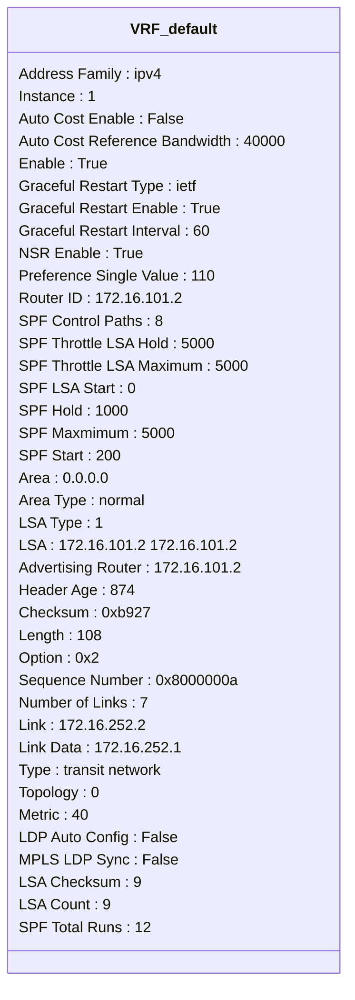
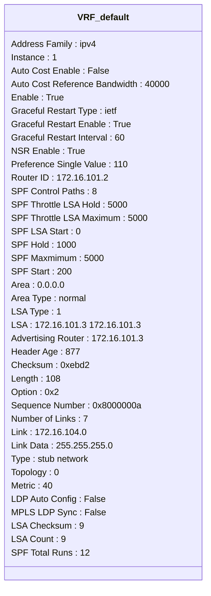
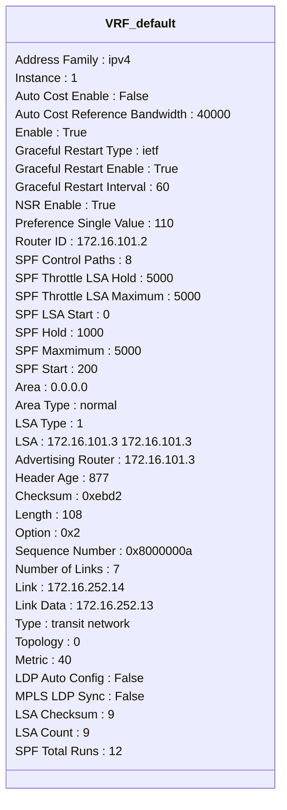
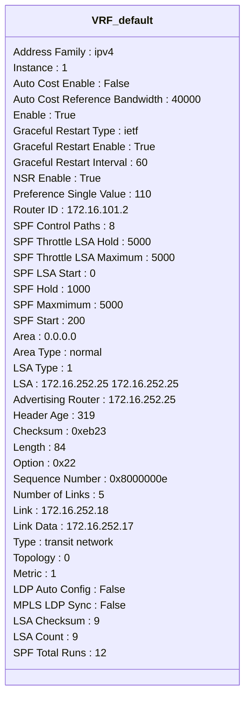
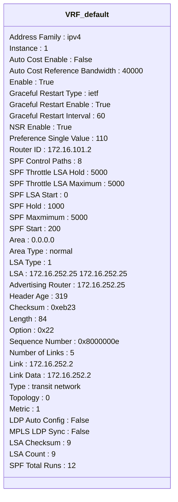
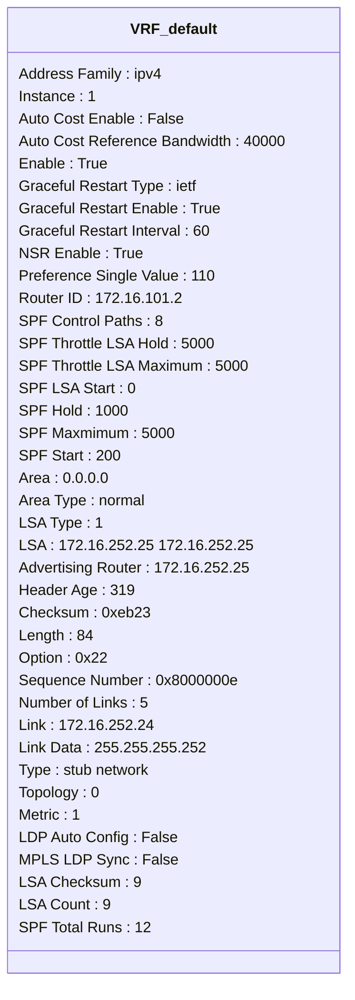
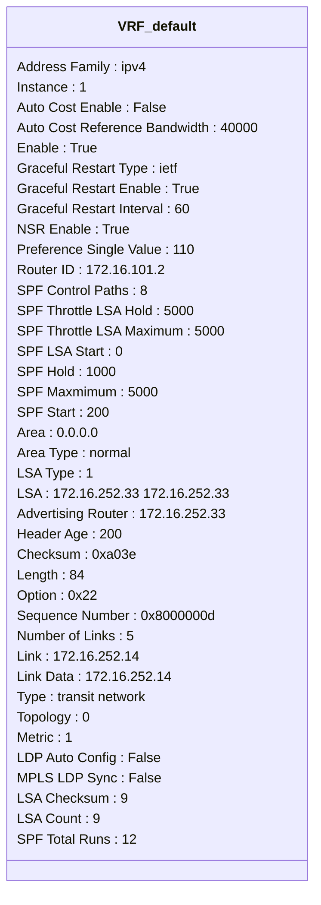

```mermaid
classDiagram
class VRF_default {
Address Family : ipv4
Instance : 1
Auto Cost Enable : False
Auto Cost Reference Bandwidth : 40000
Enable : True
Graceful Restart Type : ietf
Graceful Restart Enable : True
Graceful Restart Interval : 60
NSR Enable : True
Preference Single Value : 110
Router ID : 172.16.101.2
SPF Control Paths : 8
SPF Throttle LSA Hold : 5000
SPF Throttle LSA Maximum : 5000
SPF LSA Start : 0
SPF Hold : 1000
SPF Maxmimum : 5000
SPF Start : 200
Area : 0.0.0.0
Area Type : normal
LSA Type : 1
LSA : 172.16.252.33 172.16.252.33
Advertising Router : 172.16.252.33
Header Age : 200
Checksum : 0xa03e
Length : 84
Option : 0x22
Sequence Number : 0x8000000d
Number of Links : 5
Link : 172.16.252.18
Link Data : 172.16.252.18
Type : transit network
Topology : 0
Metric : 1
LDP Auto Config : False
MPLS LDP Sync : False
LSA Checksum : 9
LSA Count : 9
SPF Total Runs : 12
}
```
```mermaid
classDiagram
class VRF_default {
Address Family : ipv4
Instance : 1
Auto Cost Enable : False
Auto Cost Reference Bandwidth : 40000
Enable : True
Graceful Restart Type : ietf
Graceful Restart Enable : True
Graceful Restart Interval : 60
NSR Enable : True
Preference Single Value : 110
Router ID : 172.16.101.2
SPF Control Paths : 8
SPF Throttle LSA Hold : 5000
SPF Throttle LSA Maximum : 5000
SPF LSA Start : 0
SPF Hold : 1000
SPF Maxmimum : 5000
SPF Start : 200
Area : 0.0.0.0
Area Type : normal
LSA Type : 1
LSA : 172.16.252.33 172.16.252.33
Advertising Router : 172.16.252.33
Header Age : 200
Checksum : 0xa03e
Length : 84
Option : 0x22
Sequence Number : 0x8000000d
Number of Links : 5
Link : 172.16.252.28
Link Data : 255.255.255.252
Type : stub network
Topology : 0
Metric : 1
LDP Auto Config : False
MPLS LDP Sync : False
LSA Checksum : 9
LSA Count : 9
SPF Total Runs : 12
}
```
```mermaid
classDiagram
class VRF_default {
Address Family : ipv4
Instance : 1
Auto Cost Enable : False
Auto Cost Reference Bandwidth : 40000
Enable : True
Graceful Restart Type : ietf
Graceful Restart Enable : True
Graceful Restart Interval : 60
NSR Enable : True
Preference Single Value : 110
Router ID : 172.16.101.2
SPF Control Paths : 8
SPF Throttle LSA Hold : 5000
SPF Throttle LSA Maximum : 5000
SPF LSA Start : 0
SPF Hold : 1000
SPF Maxmimum : 5000
SPF Start : 200
Area : 0.0.0.0
Area Type : normal
LSA Type : 1
LSA : 172.16.252.33 172.16.252.33
Advertising Router : 172.16.252.33
Header Age : 200
Checksum : 0xa03e
Length : 84
Option : 0x22
Sequence Number : 0x8000000d
Number of Links : 5
Link : 172.16.252.32
Link Data : 255.255.255.252
Type : stub network
Topology : 0
Metric : 1
LDP Auto Config : False
MPLS LDP Sync : False
LSA Checksum : 9
LSA Count : 9
SPF Total Runs : 12
}
```
```mermaid
classDiagram
class VRF_default {
Address Family : ipv4
Instance : 1
Auto Cost Enable : False
Auto Cost Reference Bandwidth : 40000
Enable : True
Graceful Restart Type : ietf
Graceful Restart Enable : True
Graceful Restart Interval : 60
NSR Enable : True
Preference Single Value : 110
Router ID : 172.16.101.2
SPF Control Paths : 8
SPF Throttle LSA Hold : 5000
SPF Throttle LSA Maximum : 5000
SPF LSA Start : 0
SPF Hold : 1000
SPF Maxmimum : 5000
SPF Start : 200
Area : 0.0.0.0
Area Type : normal
LSA Type : 1
LSA : 172.16.252.33 172.16.252.33
Advertising Router : 172.16.252.33
Header Age : 200
Checksum : 0xa03e
Length : 84
Option : 0x22
Sequence Number : 0x8000000d
Number of Links : 5
Link : 172.16.252.6
Link Data : 172.16.252.6
Type : transit network
Topology : 0
Metric : 1
LDP Auto Config : False
MPLS LDP Sync : False
LSA Checksum : 9
LSA Count : 9
SPF Total Runs : 12
}
```
```mermaid
classDiagram
class VRF_default {
Address Family : ipv4
Instance : 1
Auto Cost Enable : False
Auto Cost Reference Bandwidth : 40000
Enable : True
Graceful Restart Type : ietf
Graceful Restart Enable : True
Graceful Restart Interval : 60
NSR Enable : True
Preference Single Value : 110
Router ID : 172.16.101.2
SPF Control Paths : 8
SPF Throttle LSA Hold : 5000
SPF Throttle LSA Maximum : 5000
SPF LSA Start : 0
SPF Hold : 1000
SPF Maxmimum : 5000
SPF Start : 200
Area : 0.0.0.0
Interface : Ethernet1/3
Interface Enable : True
Interface BFD Enable : False
Interface Cost : 40
Interface Dead Interval : 40
Interface Hello Interval : 10
Interface Hello Timer : 00:00:07
Interface Interface Type : broadcast
Interface Passive : False
Interface Retransmit Interval : 5
Interface LSA Checksum : 0
Interface LSA Count : 0
Interface Transmit Delay : 1
Neighbor : 172.16.252.25
Neighbor Address : 172.16.252.2
Neighbor Dead Timer : 00:00:32
Neighbor Last State Change : 02:16:28
Neighbor State : full
Neighbor Event Count : 6
}
```
```mermaid
classDiagram
class VRF_default {
Address Family : ipv4
Instance : 1
Auto Cost Enable : False
Auto Cost Reference Bandwidth : 40000
Enable : True
Graceful Restart Type : ietf
Graceful Restart Enable : True
Graceful Restart Interval : 60
NSR Enable : True
Preference Single Value : 110
Router ID : 172.16.101.2
SPF Control Paths : 8
SPF Throttle LSA Hold : 5000
SPF Throttle LSA Maximum : 5000
SPF LSA Start : 0
SPF Hold : 1000
SPF Maxmimum : 5000
SPF Start : 200
Area : 0.0.0.0
Interface : Ethernet1/4
Interface Enable : True
Interface BFD Enable : False
Interface Cost : 40
Interface Dead Interval : 40
Interface Hello Interval : 10
Interface Hello Timer : 00:00:03
Interface Interface Type : broadcast
Interface Passive : False
Interface Retransmit Interval : 5
Interface LSA Checksum : 0
Interface LSA Count : 0
Interface Transmit Delay : 1
Neighbor : 172.16.252.33
Neighbor Address : 172.16.252.6
Neighbor Dead Timer : 00:00:37
Neighbor Last State Change : 02:16:22
Neighbor State : full
Neighbor Event Count : 5
}
```