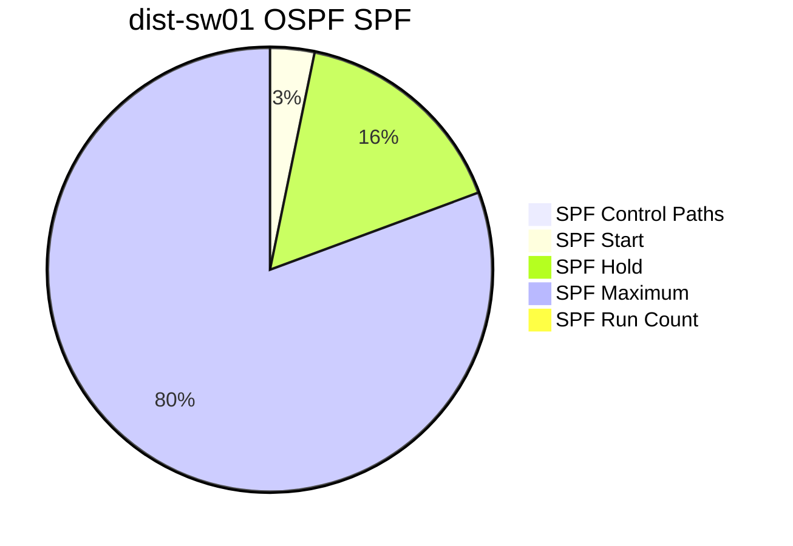
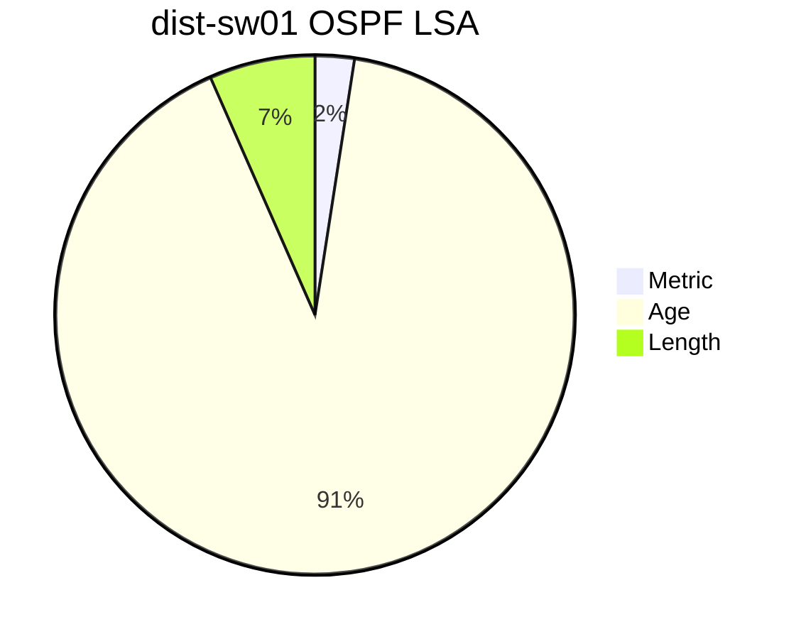

```mermaid
pie
title dist-sw01 OSPF Interface
"Cost" : 40
"Priority" : 
```
```mermaid
pie
title dist-sw01 OSPF SPF
"SPF Control Paths" : 8
"SPF Start" : 200
"SPF Hold" : 1000
"SPF Maximum" : 5000
"SPF Run Count" : 10
```
```mermaid
pie
title dist-sw01 OSPF LSA
"Metric" : 40
"Age" : 1489
"Length" : 108
```
```mermaid
pie
title dist-sw01 OSPF Interface
"Cost" : 40
"Priority" : 1
"Event Count" : 5
"Retransmit Queue Length" : 
```
```mermaid
pie
title dist-sw01 OSPF SPF
"SPF Control Paths" : 8
"SPF Start" : 200
"SPF Hold" : 1000
"SPF Maximum" : 5000
"SPF Run Count" : 10
```
```mermaid
pie
title dist-sw01 OSPF LSA
"Metric" : 40
"Age" : 1489
"Length" : 108
```
```mermaid
pie
title dist-sw01 OSPF Interface
"Cost" : 40
"Priority" : 1
"Event Count" : 6
"Retransmit Queue Length" : 
```
```mermaid
pie
title dist-sw01 OSPF SPF
"SPF Control Paths" : 8
"SPF Start" : 200
"SPF Hold" : 1000
"SPF Maximum" : 5000
"SPF Run Count" : 10
```
```mermaid
pie
title dist-sw01 OSPF LSA
"Metric" : 40
"Age" : 1489
"Length" : 108
```
```mermaid
pie
title dist-sw01 OSPF Interface
"Cost" : 40
"Priority" : 
```
```mermaid
pie
title dist-sw01 OSPF SPF
"SPF Control Paths" : 8
"SPF Start" : 200
"SPF Hold" : 1000
"SPF Maximum" : 5000
"SPF Run Count" : 10
```
```mermaid
pie
title dist-sw01 OSPF LSA
"Metric" : 40
"Age" : 1489
"Length" : 108
```
```mermaid
pie
title dist-sw01 OSPF Interface
"Cost" : 40
"Priority" : 
```
```mermaid
pie
title dist-sw01 OSPF SPF
"SPF Control Paths" : 8
"SPF Start" : 200
"SPF Hold" : 1000
"SPF Maximum" : 5000
"SPF Run Count" : 10
```
```mermaid
pie
title dist-sw01 OSPF LSA
"Metric" : 40
"Age" : 1489
"Length" : 108
```
```mermaid
pie
title dist-sw01 OSPF Interface
"Cost" : 40
"Priority" : 
```
```mermaid
pie
title dist-sw01 OSPF SPF
"SPF Control Paths" : 8
"SPF Start" : 200
"SPF Hold" : 1000
"SPF Maximum" : 5000
"SPF Run Count" : 10
```
```mermaid
pie
title dist-sw01 OSPF LSA
"Metric" : 40
"Age" : 1489
"Length" : 108
```
```mermaid
pie
title dist-sw01 OSPF Interface
"Cost" : 40
"Priority" : 
```
```mermaid
pie
title dist-sw01 OSPF SPF
"SPF Control Paths" : 8
"SPF Start" : 200
"SPF Hold" : 1000
"SPF Maximum" : 5000
"SPF Run Count" : 10
```
```mermaid
pie
title dist-sw01 OSPF LSA
"Metric" : 40
"Age" : 1489
"Length" : 108
```
```mermaid
pie
title dist-sw01 OSPF Interface
"Cost" : 40
"Priority" : 
```
```mermaid
pie
title dist-sw01 OSPF SPF
"SPF Control Paths" : 8
"SPF Start" : 200
"SPF Hold" : 1000
"SPF Maximum" : 5000
"SPF Run Count" : 10
```
```mermaid
pie
title dist-sw01 OSPF LSA
"Metric" : 40
"Age" : 1489
"Length" : 108
```
```mermaid
pie
title dist-sw01 OSPF Interface
"Cost" : 40
"Priority" : 1
"Event Count" : 5
"Retransmit Queue Length" : 
```
```mermaid
pie
title dist-sw01 OSPF SPF
"SPF Control Paths" : 8
"SPF Start" : 200
"SPF Hold" : 1000
"SPF Maximum" : 5000
"SPF Run Count" : 10
```
```mermaid
pie
title dist-sw01 OSPF LSA
"Metric" : 40
"Age" : 1489
"Length" : 108
```
```mermaid
pie
title dist-sw01 OSPF Interface
"Cost" : 40
"Priority" : 1
"Event Count" : 6
"Retransmit Queue Length" : 
```
```mermaid
pie
title dist-sw01 OSPF SPF
"SPF Control Paths" : 8
"SPF Start" : 200
"SPF Hold" : 1000
"SPF Maximum" : 5000
"SPF Run Count" : 10
```
```mermaid
pie
title dist-sw01 OSPF LSA
"Metric" : 40
"Age" : 1489
"Length" : 108
```
```mermaid
pie
title dist-sw01 OSPF Interface
"Cost" : 40
"Priority" : 
```
```mermaid
pie
title dist-sw01 OSPF SPF
"SPF Control Paths" : 8
"SPF Start" : 200
"SPF Hold" : 1000
"SPF Maximum" : 5000
"SPF Run Count" : 10
```
```mermaid
pie
title dist-sw01 OSPF LSA
"Metric" : 40
"Age" : 1489
"Length" : 108
```
```mermaid
pie
title dist-sw01 OSPF Interface
"Cost" : 40
"Priority" : 
```
```mermaid
pie
title dist-sw01 OSPF SPF
"SPF Control Paths" : 8
"SPF Start" : 200
"SPF Hold" : 1000
"SPF Maximum" : 5000
"SPF Run Count" : 10
```
```mermaid
pie
title dist-sw01 OSPF LSA
"Metric" : 40
"Age" : 1489
"Length" : 108
```
```mermaid
pie
title dist-sw01 OSPF Interface
"Cost" : 40
"Priority" : 
```
```mermaid
pie
title dist-sw01 OSPF SPF
"SPF Control Paths" : 8
"SPF Start" : 200
"SPF Hold" : 1000
"SPF Maximum" : 5000
"SPF Run Count" : 10
```
```mermaid
pie
title dist-sw01 OSPF LSA
"Metric" : 40
"Age" : 1489
"Length" : 108
```
```mermaid
pie
title dist-sw01 OSPF Interface
"Cost" : 40
"Priority" : 
```
```mermaid
pie
title dist-sw01 OSPF SPF
"SPF Control Paths" : 8
"SPF Start" : 200
"SPF Hold" : 1000
"SPF Maximum" : 5000
"SPF Run Count" : 10
```
```mermaid
pie
title dist-sw01 OSPF LSA
"Metric" : 40
"Age" : 1489
"Length" : 108
```
```mermaid
pie
title dist-sw01 OSPF Interface
"Cost" : 40
"Priority" : 
```
```mermaid
pie
title dist-sw01 OSPF SPF
"SPF Control Paths" : 8
"SPF Start" : 200
"SPF Hold" : 1000
"SPF Maximum" : 5000
"SPF Run Count" : 10
```
```mermaid
pie
title dist-sw01 OSPF LSA
"Metric" : 40
"Age" : 1489
"Length" : 108
```
```mermaid
pie
title dist-sw01 OSPF Interface
"Cost" : 40
"Priority" : 1
"Event Count" : 5
"Retransmit Queue Length" : 
```
```mermaid
pie
title dist-sw01 OSPF SPF
"SPF Control Paths" : 8
"SPF Start" : 200
"SPF Hold" : 1000
"SPF Maximum" : 5000
"SPF Run Count" : 10
```
```mermaid
pie
title dist-sw01 OSPF LSA
"Metric" : 40
"Age" : 1489
"Length" : 108
```
```mermaid
pie
title dist-sw01 OSPF Interface
"Cost" : 40
"Priority" : 1
"Event Count" : 6
"Retransmit Queue Length" : 
```
```mermaid
pie
title dist-sw01 OSPF SPF
"SPF Control Paths" : 8
"SPF Start" : 200
"SPF Hold" : 1000
"SPF Maximum" : 5000
"SPF Run Count" : 10
```
```mermaid
pie
title dist-sw01 OSPF LSA
"Metric" : 40
"Age" : 1489
"Length" : 108
```
```mermaid
pie
title dist-sw01 OSPF Interface
"Cost" : 40
"Priority" : 
```
```mermaid
pie
title dist-sw01 OSPF SPF
"SPF Control Paths" : 8
"SPF Start" : 200
"SPF Hold" : 1000
"SPF Maximum" : 5000
"SPF Run Count" : 10
```
```mermaid
pie
title dist-sw01 OSPF LSA
"Metric" : 40
"Age" : 1489
"Length" : 108
```
```mermaid
pie
title dist-sw01 OSPF Interface
"Cost" : 40
"Priority" : 
```
```mermaid
pie
title dist-sw01 OSPF SPF
"SPF Control Paths" : 8
"SPF Start" : 200
"SPF Hold" : 1000
"SPF Maximum" : 5000
"SPF Run Count" : 10
```
```mermaid
pie
title dist-sw01 OSPF LSA
"Metric" : 40
"Age" : 1489
"Length" : 108
```
```mermaid
pie
title dist-sw01 OSPF Interface
"Cost" : 40
"Priority" : 
```
```mermaid
pie
title dist-sw01 OSPF SPF
"SPF Control Paths" : 8
"SPF Start" : 200
"SPF Hold" : 1000
"SPF Maximum" : 5000
"SPF Run Count" : 10
```
```mermaid
pie
title dist-sw01 OSPF LSA
"Metric" : 40
"Age" : 1489
"Length" : 108
```
```mermaid
pie
title dist-sw01 OSPF Interface
"Cost" : 40
"Priority" : 
```
```mermaid
pie
title dist-sw01 OSPF SPF
"SPF Control Paths" : 8
"SPF Start" : 200
"SPF Hold" : 1000
"SPF Maximum" : 5000
"SPF Run Count" : 10
```
```mermaid
pie
title dist-sw01 OSPF LSA
"Metric" : 40
"Age" : 1489
"Length" : 108
```
```mermaid
pie
title dist-sw01 OSPF Interface
"Cost" : 40
"Priority" : 
```
```mermaid
pie
title dist-sw01 OSPF SPF
"SPF Control Paths" : 8
"SPF Start" : 200
"SPF Hold" : 1000
"SPF Maximum" : 5000
"SPF Run Count" : 10
```
```mermaid
pie
title dist-sw01 OSPF LSA
"Metric" : 40
"Age" : 1489
"Length" : 108
```
```mermaid
pie
title dist-sw01 OSPF Interface
"Cost" : 40
"Priority" : 1
"Event Count" : 5
"Retransmit Queue Length" : 
```
```mermaid
pie
title dist-sw01 OSPF SPF
"SPF Control Paths" : 8
"SPF Start" : 200
"SPF Hold" : 1000
"SPF Maximum" : 5000
"SPF Run Count" : 10
```
```mermaid
pie
title dist-sw01 OSPF LSA
"Metric" : 40
"Age" : 1489
"Length" : 108
```
```mermaid
pie
title dist-sw01 OSPF Interface
"Cost" : 40
"Priority" : 1
"Event Count" : 6
"Retransmit Queue Length" : 
```
```mermaid
pie
title dist-sw01 OSPF SPF
"SPF Control Paths" : 8
"SPF Start" : 200
"SPF Hold" : 1000
"SPF Maximum" : 5000
"SPF Run Count" : 10
```
```mermaid
pie
title dist-sw01 OSPF LSA
"Metric" : 40
"Age" : 1489
"Length" : 108
```
```mermaid
pie
title dist-sw01 OSPF Interface
"Cost" : 40
"Priority" : 
```
```mermaid
pie
title dist-sw01 OSPF SPF
"SPF Control Paths" : 8
"SPF Start" : 200
"SPF Hold" : 1000
"SPF Maximum" : 5000
"SPF Run Count" : 10
```
```mermaid
pie
title dist-sw01 OSPF LSA
"Metric" : 40
"Age" : 1489
"Length" : 108
```
```mermaid
pie
title dist-sw01 OSPF Interface
"Cost" : 40
"Priority" : 
```
```mermaid
pie
title dist-sw01 OSPF SPF
"SPF Control Paths" : 8
"SPF Start" : 200
"SPF Hold" : 1000
"SPF Maximum" : 5000
"SPF Run Count" : 10
```
```mermaid
pie
title dist-sw01 OSPF LSA
"Metric" : 40
"Age" : 1489
"Length" : 108
```
```mermaid
pie
title dist-sw01 OSPF Interface
"Cost" : 40
"Priority" : 
```
```mermaid
pie
title dist-sw01 OSPF SPF
"SPF Control Paths" : 8
"SPF Start" : 200
"SPF Hold" : 1000
"SPF Maximum" : 5000
"SPF Run Count" : 10
```
```mermaid
pie
title dist-sw01 OSPF LSA
"Metric" : 40
"Age" : 1489
"Length" : 108
```
```mermaid
pie
title dist-sw01 OSPF Interface
"Cost" : 40
"Priority" : 
```
```mermaid
pie
title dist-sw01 OSPF SPF
"SPF Control Paths" : 8
"SPF Start" : 200
"SPF Hold" : 1000
"SPF Maximum" : 5000
"SPF Run Count" : 10
```
```mermaid
pie
title dist-sw01 OSPF LSA
"Metric" : 40
"Age" : 1489
"Length" : 108
```
```mermaid
pie
title dist-sw01 OSPF Interface
"Cost" : 40
"Priority" : 
```
```mermaid
pie
title dist-sw01 OSPF SPF
"SPF Control Paths" : 8
"SPF Start" : 200
"SPF Hold" : 1000
"SPF Maximum" : 5000
"SPF Run Count" : 10
```
```mermaid
pie
title dist-sw01 OSPF LSA
"Metric" : 40
"Age" : 1489
"Length" : 108
```
```mermaid
pie
title dist-sw01 OSPF Interface
"Cost" : 40
"Priority" : 1
"Event Count" : 5
"Retransmit Queue Length" : 
```
```mermaid
pie
title dist-sw01 OSPF SPF
"SPF Control Paths" : 8
"SPF Start" : 200
"SPF Hold" : 1000
"SPF Maximum" : 5000
"SPF Run Count" : 10
```
```mermaid
pie
title dist-sw01 OSPF LSA
"Metric" : 40
"Age" : 1489
"Length" : 108
```
```mermaid
pie
title dist-sw01 OSPF Interface
"Cost" : 40
"Priority" : 1
"Event Count" : 6
"Retransmit Queue Length" : 
```
```mermaid
pie
title dist-sw01 OSPF SPF
"SPF Control Paths" : 8
"SPF Start" : 200
"SPF Hold" : 1000
"SPF Maximum" : 5000
"SPF Run Count" : 10
```
```mermaid
pie
title dist-sw01 OSPF LSA
"Metric" : 40
"Age" : 1489
"Length" : 108
```
```mermaid
pie
title dist-sw01 OSPF Interface
"Cost" : 40
"Priority" : 
```
```mermaid
pie
title dist-sw01 OSPF SPF
"SPF Control Paths" : 8
"SPF Start" : 200
"SPF Hold" : 1000
"SPF Maximum" : 5000
"SPF Run Count" : 10
```
```mermaid
pie
title dist-sw01 OSPF LSA
"Metric" : 40
"Age" : 1489
"Length" : 108
```
```mermaid
pie
title dist-sw01 OSPF Interface
"Cost" : 40
"Priority" : 
```
```mermaid
pie
title dist-sw01 OSPF SPF
"SPF Control Paths" : 8
"SPF Start" : 200
"SPF Hold" : 1000
"SPF Maximum" : 5000
"SPF Run Count" : 10
```
```mermaid
pie
title dist-sw01 OSPF LSA
"Metric" : 40
"Age" : 1489
"Length" : 108
```
```mermaid
pie
title dist-sw01 OSPF Interface
"Cost" : 40
"Priority" : 
```
```mermaid
pie
title dist-sw01 OSPF SPF
"SPF Control Paths" : 8
"SPF Start" : 200
"SPF Hold" : 1000
"SPF Maximum" : 5000
"SPF Run Count" : 10
```
```mermaid
pie
title dist-sw01 OSPF LSA
"Metric" : 40
"Age" : 1489
"Length" : 108
```
```mermaid
pie
title dist-sw01 OSPF Interface
"Cost" : 40
"Priority" : 
```
```mermaid
pie
title dist-sw01 OSPF SPF
"SPF Control Paths" : 8
"SPF Start" : 200
"SPF Hold" : 1000
"SPF Maximum" : 5000
"SPF Run Count" : 10
```
```mermaid
pie
title dist-sw01 OSPF LSA
"Metric" : 40
"Age" : 1489
"Length" : 108
```
```mermaid
pie
title dist-sw01 OSPF Interface
"Cost" : 40
"Priority" : 
```
```mermaid
pie
title dist-sw01 OSPF SPF
"SPF Control Paths" : 8
"SPF Start" : 200
"SPF Hold" : 1000
"SPF Maximum" : 5000
"SPF Run Count" : 10
```
```mermaid
pie
title dist-sw01 OSPF LSA
"Metric" : 40
"Age" : 1489
"Length" : 108
```
```mermaid
pie
title dist-sw01 OSPF Interface
"Cost" : 40
"Priority" : 1
"Event Count" : 5
"Retransmit Queue Length" : 
```
```mermaid
pie
title dist-sw01 OSPF SPF
"SPF Control Paths" : 8
"SPF Start" : 200
"SPF Hold" : 1000
"SPF Maximum" : 5000
"SPF Run Count" : 10
```
```mermaid
pie
title dist-sw01 OSPF LSA
"Metric" : 40
"Age" : 1489
"Length" : 108
```
```mermaid
pie
title dist-sw01 OSPF Interface
"Cost" : 40
"Priority" : 1
"Event Count" : 6
"Retransmit Queue Length" : 
```
```mermaid
pie
title dist-sw01 OSPF SPF
"SPF Control Paths" : 8
"SPF Start" : 200
"SPF Hold" : 1000
"SPF Maximum" : 5000
"SPF Run Count" : 10
```
```mermaid
pie
title dist-sw01 OSPF LSA
"Metric" : 40
"Age" : 1489
"Length" : 108
```
```mermaid
pie
title dist-sw01 OSPF Interface
"Cost" : 40
"Priority" : 
```
```mermaid
pie
title dist-sw01 OSPF SPF
"SPF Control Paths" : 8
"SPF Start" : 200
"SPF Hold" : 1000
"SPF Maximum" : 5000
"SPF Run Count" : 10
```
```mermaid
pie
title dist-sw01 OSPF LSA
"Metric" : 40
"Age" : 1489
"Length" : 108
```
```mermaid
pie
title dist-sw01 OSPF Interface
"Cost" : 40
"Priority" : 
```
```mermaid
pie
title dist-sw01 OSPF SPF
"SPF Control Paths" : 8
"SPF Start" : 200
"SPF Hold" : 1000
"SPF Maximum" : 5000
"SPF Run Count" : 10
```
```mermaid
pie
title dist-sw01 OSPF LSA
"Metric" : 40
"Age" : 1489
"Length" : 108
```
```mermaid
pie
title dist-sw01 OSPF Interface
"Cost" : 40
"Priority" : 
```
```mermaid
pie
title dist-sw01 OSPF SPF
"SPF Control Paths" : 8
"SPF Start" : 200
"SPF Hold" : 1000
"SPF Maximum" : 5000
"SPF Run Count" : 10
```
```mermaid
pie
title dist-sw01 OSPF LSA
"Metric" : 40
"Age" : 1489
"Length" : 108
```
```mermaid
pie
title dist-sw01 OSPF Interface
"Cost" : 40
"Priority" : 
```
```mermaid
pie
title dist-sw01 OSPF SPF
"SPF Control Paths" : 8
"SPF Start" : 200
"SPF Hold" : 1000
"SPF Maximum" : 5000
"SPF Run Count" : 10
```
```mermaid
pie
title dist-sw01 OSPF LSA
"Metric" : 40
"Age" : 1489
"Length" : 108
```
```mermaid
pie
title dist-sw01 OSPF Interface
"Cost" : 40
"Priority" : 
```
```mermaid
pie
title dist-sw01 OSPF SPF
"SPF Control Paths" : 8
"SPF Start" : 200
"SPF Hold" : 1000
"SPF Maximum" : 5000
"SPF Run Count" : 10
```
```mermaid
pie
title dist-sw01 OSPF LSA
"Metric" : 40
"Age" : 1478
"Length" : 108
```
```mermaid
pie
title dist-sw01 OSPF Interface
"Cost" : 40
"Priority" : 1
"Event Count" : 5
"Retransmit Queue Length" : 
```
```mermaid
pie
title dist-sw01 OSPF SPF
"SPF Control Paths" : 8
"SPF Start" : 200
"SPF Hold" : 1000
"SPF Maximum" : 5000
"SPF Run Count" : 10
```
```mermaid
pie
title dist-sw01 OSPF LSA
"Metric" : 40
"Age" : 1478
"Length" : 108
```
```mermaid
pie
title dist-sw01 OSPF Interface
"Cost" : 40
"Priority" : 1
"Event Count" : 6
"Retransmit Queue Length" : 
```
```mermaid
pie
title dist-sw01 OSPF SPF
"SPF Control Paths" : 8
"SPF Start" : 200
"SPF Hold" : 1000
"SPF Maximum" : 5000
"SPF Run Count" : 10
```
```mermaid
pie
title dist-sw01 OSPF LSA
"Metric" : 40
"Age" : 1478
"Length" : 108
```
```mermaid
pie
title dist-sw01 OSPF Interface
"Cost" : 40
"Priority" : 
```
```mermaid
pie
title dist-sw01 OSPF SPF
"SPF Control Paths" : 8
"SPF Start" : 200
"SPF Hold" : 1000
"SPF Maximum" : 5000
"SPF Run Count" : 10
```
```mermaid
pie
title dist-sw01 OSPF LSA
"Metric" : 40
"Age" : 1478
"Length" : 108
```
```mermaid
pie
title dist-sw01 OSPF Interface
"Cost" : 40
"Priority" : 
```
```mermaid
pie
title dist-sw01 OSPF SPF
"SPF Control Paths" : 8
"SPF Start" : 200
"SPF Hold" : 1000
"SPF Maximum" : 5000
"SPF Run Count" : 10
```
```mermaid
pie
title dist-sw01 OSPF LSA
"Metric" : 40
"Age" : 1478
"Length" : 108
```
```mermaid
pie
title dist-sw01 OSPF Interface
"Cost" : 40
"Priority" : 
```
```mermaid
pie
title dist-sw01 OSPF SPF
"SPF Control Paths" : 8
"SPF Start" : 200
"SPF Hold" : 1000
"SPF Maximum" : 5000
"SPF Run Count" : 10
```
```mermaid
pie
title dist-sw01 OSPF LSA
"Metric" : 40
"Age" : 1478
"Length" : 108
```
```mermaid
pie
title dist-sw01 OSPF Interface
"Cost" : 40
"Priority" : 
```
```mermaid
pie
title dist-sw01 OSPF SPF
"SPF Control Paths" : 8
"SPF Start" : 200
"SPF Hold" : 1000
"SPF Maximum" : 5000
"SPF Run Count" : 10
```
```mermaid
pie
title dist-sw01 OSPF LSA
"Metric" : 40
"Age" : 1478
"Length" : 108
```
```mermaid
pie
title dist-sw01 OSPF Interface
"Cost" : 40
"Priority" : 
```
```mermaid
pie
title dist-sw01 OSPF SPF
"SPF Control Paths" : 8
"SPF Start" : 200
"SPF Hold" : 1000
"SPF Maximum" : 5000
"SPF Run Count" : 10
```
```mermaid
pie
title dist-sw01 OSPF LSA
"Metric" : 40
"Age" : 1478
"Length" : 108
```
```mermaid
pie
title dist-sw01 OSPF Interface
"Cost" : 40
"Priority" : 1
"Event Count" : 5
"Retransmit Queue Length" : 
```
```mermaid
pie
title dist-sw01 OSPF SPF
"SPF Control Paths" : 8
"SPF Start" : 200
"SPF Hold" : 1000
"SPF Maximum" : 5000
"SPF Run Count" : 10
```
```mermaid
pie
title dist-sw01 OSPF LSA
"Metric" : 40
"Age" : 1478
"Length" : 108
```
```mermaid
pie
title dist-sw01 OSPF Interface
"Cost" : 40
"Priority" : 1
"Event Count" : 6
"Retransmit Queue Length" : 
```
```mermaid
pie
title dist-sw01 OSPF SPF
"SPF Control Paths" : 8
"SPF Start" : 200
"SPF Hold" : 1000
"SPF Maximum" : 5000
"SPF Run Count" : 10
```
```mermaid
pie
title dist-sw01 OSPF LSA
"Metric" : 40
"Age" : 1478
"Length" : 108
```
```mermaid
pie
title dist-sw01 OSPF Interface
"Cost" : 40
"Priority" : 
```
```mermaid
pie
title dist-sw01 OSPF SPF
"SPF Control Paths" : 8
"SPF Start" : 200
"SPF Hold" : 1000
"SPF Maximum" : 5000
"SPF Run Count" : 10
```
```mermaid
pie
title dist-sw01 OSPF LSA
"Metric" : 40
"Age" : 1478
"Length" : 108
```
```mermaid
pie
title dist-sw01 OSPF Interface
"Cost" : 40
"Priority" : 
```
```mermaid
pie
title dist-sw01 OSPF SPF
"SPF Control Paths" : 8
"SPF Start" : 200
"SPF Hold" : 1000
"SPF Maximum" : 5000
"SPF Run Count" : 10
```
```mermaid
pie
title dist-sw01 OSPF LSA
"Metric" : 40
"Age" : 1478
"Length" : 108
```
```mermaid
pie
title dist-sw01 OSPF Interface
"Cost" : 40
"Priority" : 
```
```mermaid
pie
title dist-sw01 OSPF SPF
"SPF Control Paths" : 8
"SPF Start" : 200
"SPF Hold" : 1000
"SPF Maximum" : 5000
"SPF Run Count" : 10
```
```mermaid
pie
title dist-sw01 OSPF LSA
"Metric" : 40
"Age" : 1478
"Length" : 108
```
```mermaid
pie
title dist-sw01 OSPF Interface
"Cost" : 40
"Priority" : 
```
```mermaid
pie
title dist-sw01 OSPF SPF
"SPF Control Paths" : 8
"SPF Start" : 200
"SPF Hold" : 1000
"SPF Maximum" : 5000
"SPF Run Count" : 10
```
```mermaid
pie
title dist-sw01 OSPF LSA
"Metric" : 40
"Age" : 1478
"Length" : 108
```
```mermaid
pie
title dist-sw01 OSPF Interface
"Cost" : 40
"Priority" : 
```
```mermaid
pie
title dist-sw01 OSPF SPF
"SPF Control Paths" : 8
"SPF Start" : 200
"SPF Hold" : 1000
"SPF Maximum" : 5000
"SPF Run Count" : 10
```
```mermaid
pie
title dist-sw01 OSPF LSA
"Metric" : 40
"Age" : 1478
"Length" : 108
```
```mermaid
pie
title dist-sw01 OSPF Interface
"Cost" : 40
"Priority" : 1
"Event Count" : 5
"Retransmit Queue Length" : 
```
```mermaid
pie
title dist-sw01 OSPF SPF
"SPF Control Paths" : 8
"SPF Start" : 200
"SPF Hold" : 1000
"SPF Maximum" : 5000
"SPF Run Count" : 10
```
```mermaid
pie
title dist-sw01 OSPF LSA
"Metric" : 40
"Age" : 1478
"Length" : 108
```
```mermaid
pie
title dist-sw01 OSPF Interface
"Cost" : 40
"Priority" : 1
"Event Count" : 6
"Retransmit Queue Length" : 
```
```mermaid
pie
title dist-sw01 OSPF SPF
"SPF Control Paths" : 8
"SPF Start" : 200
"SPF Hold" : 1000
"SPF Maximum" : 5000
"SPF Run Count" : 10
```
```mermaid
pie
title dist-sw01 OSPF LSA
"Metric" : 40
"Age" : 1478
"Length" : 108
```
```mermaid
pie
title dist-sw01 OSPF Interface
"Cost" : 40
"Priority" : 
```
```mermaid
pie
title dist-sw01 OSPF SPF
"SPF Control Paths" : 8
"SPF Start" : 200
"SPF Hold" : 1000
"SPF Maximum" : 5000
"SPF Run Count" : 10
```
```mermaid
pie
title dist-sw01 OSPF LSA
"Metric" : 40
"Age" : 1478
"Length" : 108
```
```mermaid
pie
title dist-sw01 OSPF Interface
"Cost" : 40
"Priority" : 
```
```mermaid
pie
title dist-sw01 OSPF SPF
"SPF Control Paths" : 8
"SPF Start" : 200
"SPF Hold" : 1000
"SPF Maximum" : 5000
"SPF Run Count" : 10
```
```mermaid
pie
title dist-sw01 OSPF LSA
"Metric" : 40
"Age" : 1478
"Length" : 108
```
```mermaid
pie
title dist-sw01 OSPF Interface
"Cost" : 40
"Priority" : 
```
```mermaid
pie
title dist-sw01 OSPF SPF
"SPF Control Paths" : 8
"SPF Start" : 200
"SPF Hold" : 1000
"SPF Maximum" : 5000
"SPF Run Count" : 10
```
```mermaid
pie
title dist-sw01 OSPF LSA
"Metric" : 40
"Age" : 1478
"Length" : 108
```
```mermaid
pie
title dist-sw01 OSPF Interface
"Cost" : 40
"Priority" : 
```
```mermaid
pie
title dist-sw01 OSPF SPF
"SPF Control Paths" : 8
"SPF Start" : 200
"SPF Hold" : 1000
"SPF Maximum" : 5000
"SPF Run Count" : 10
```
```mermaid
pie
title dist-sw01 OSPF LSA
"Metric" : 40
"Age" : 1478
"Length" : 108
```
```mermaid
pie
title dist-sw01 OSPF Interface
"Cost" : 40
"Priority" : 
```
```mermaid
pie
title dist-sw01 OSPF SPF
"SPF Control Paths" : 8
"SPF Start" : 200
"SPF Hold" : 1000
"SPF Maximum" : 5000
"SPF Run Count" : 10
```
```mermaid
pie
title dist-sw01 OSPF LSA
"Metric" : 40
"Age" : 1478
"Length" : 108
```
```mermaid
pie
title dist-sw01 OSPF Interface
"Cost" : 40
"Priority" : 1
"Event Count" : 5
"Retransmit Queue Length" : 
```
```mermaid
pie
title dist-sw01 OSPF SPF
"SPF Control Paths" : 8
"SPF Start" : 200
"SPF Hold" : 1000
"SPF Maximum" : 5000
"SPF Run Count" : 10
```
```mermaid
pie
title dist-sw01 OSPF LSA
"Metric" : 40
"Age" : 1478
"Length" : 108
```
```mermaid
pie
title dist-sw01 OSPF Interface
"Cost" : 40
"Priority" : 1
"Event Count" : 6
"Retransmit Queue Length" : 
```
```mermaid
pie
title dist-sw01 OSPF SPF
"SPF Control Paths" : 8
"SPF Start" : 200
"SPF Hold" : 1000
"SPF Maximum" : 5000
"SPF Run Count" : 10
```
```mermaid
pie
title dist-sw01 OSPF LSA
"Metric" : 40
"Age" : 1478
"Length" : 108
```
```mermaid
pie
title dist-sw01 OSPF Interface
"Cost" : 40
"Priority" : 
```
```mermaid
pie
title dist-sw01 OSPF SPF
"SPF Control Paths" : 8
"SPF Start" : 200
"SPF Hold" : 1000
"SPF Maximum" : 5000
"SPF Run Count" : 10
```
```mermaid
pie
title dist-sw01 OSPF LSA
"Metric" : 40
"Age" : 1478
"Length" : 108
```
```mermaid
pie
title dist-sw01 OSPF Interface
"Cost" : 40
"Priority" : 
```
```mermaid
pie
title dist-sw01 OSPF SPF
"SPF Control Paths" : 8
"SPF Start" : 200
"SPF Hold" : 1000
"SPF Maximum" : 5000
"SPF Run Count" : 10
```
```mermaid
pie
title dist-sw01 OSPF LSA
"Metric" : 40
"Age" : 1478
"Length" : 108
```
```mermaid
pie
title dist-sw01 OSPF Interface
"Cost" : 40
"Priority" : 
```
```mermaid
pie
title dist-sw01 OSPF SPF
"SPF Control Paths" : 8
"SPF Start" : 200
"SPF Hold" : 1000
"SPF Maximum" : 5000
"SPF Run Count" : 10
```
```mermaid
pie
title dist-sw01 OSPF LSA
"Metric" : 40
"Age" : 1478
"Length" : 108
```
```mermaid
pie
title dist-sw01 OSPF Interface
"Cost" : 40
"Priority" : 
```
```mermaid
pie
title dist-sw01 OSPF SPF
"SPF Control Paths" : 8
"SPF Start" : 200
"SPF Hold" : 1000
"SPF Maximum" : 5000
"SPF Run Count" : 10
```
```mermaid
pie
title dist-sw01 OSPF LSA
"Metric" : 40
"Age" : 1478
"Length" : 108
```
```mermaid
pie
title dist-sw01 OSPF Interface
"Cost" : 40
"Priority" : 
```
```mermaid
pie
title dist-sw01 OSPF SPF
"SPF Control Paths" : 8
"SPF Start" : 200
"SPF Hold" : 1000
"SPF Maximum" : 5000
"SPF Run Count" : 10
```
```mermaid
pie
title dist-sw01 OSPF LSA
"Metric" : 40
"Age" : 1478
"Length" : 108
```
```mermaid
pie
title dist-sw01 OSPF Interface
"Cost" : 40
"Priority" : 1
"Event Count" : 5
"Retransmit Queue Length" : 
```
```mermaid
pie
title dist-sw01 OSPF SPF
"SPF Control Paths" : 8
"SPF Start" : 200
"SPF Hold" : 1000
"SPF Maximum" : 5000
"SPF Run Count" : 10
```
```mermaid
pie
title dist-sw01 OSPF LSA
"Metric" : 40
"Age" : 1478
"Length" : 108
```
```mermaid
pie
title dist-sw01 OSPF Interface
"Cost" : 40
"Priority" : 1
"Event Count" : 6
"Retransmit Queue Length" : 
```
```mermaid
pie
title dist-sw01 OSPF SPF
"SPF Control Paths" : 8
"SPF Start" : 200
"SPF Hold" : 1000
"SPF Maximum" : 5000
"SPF Run Count" : 10
```
```mermaid
pie
title dist-sw01 OSPF LSA
"Metric" : 40
"Age" : 1478
"Length" : 108
```
```mermaid
pie
title dist-sw01 OSPF Interface
"Cost" : 40
"Priority" : 
```
```mermaid
pie
title dist-sw01 OSPF SPF
"SPF Control Paths" : 8
"SPF Start" : 200
"SPF Hold" : 1000
"SPF Maximum" : 5000
"SPF Run Count" : 10
```
```mermaid
pie
title dist-sw01 OSPF LSA
"Metric" : 40
"Age" : 1478
"Length" : 108
```
```mermaid
pie
title dist-sw01 OSPF Interface
"Cost" : 40
"Priority" : 
```
```mermaid
pie
title dist-sw01 OSPF SPF
"SPF Control Paths" : 8
"SPF Start" : 200
"SPF Hold" : 1000
"SPF Maximum" : 5000
"SPF Run Count" : 10
```
```mermaid
pie
title dist-sw01 OSPF LSA
"Metric" : 40
"Age" : 1478
"Length" : 108
```
```mermaid
pie
title dist-sw01 OSPF Interface
"Cost" : 40
"Priority" : 
```
```mermaid
pie
title dist-sw01 OSPF SPF
"SPF Control Paths" : 8
"SPF Start" : 200
"SPF Hold" : 1000
"SPF Maximum" : 5000
"SPF Run Count" : 10
```
```mermaid
pie
title dist-sw01 OSPF LSA
"Metric" : 40
"Age" : 1478
"Length" : 108
```
```mermaid
pie
title dist-sw01 OSPF Interface
"Cost" : 40
"Priority" : 
```
```mermaid
pie
title dist-sw01 OSPF SPF
"SPF Control Paths" : 8
"SPF Start" : 200
"SPF Hold" : 1000
"SPF Maximum" : 5000
"SPF Run Count" : 10
```
```mermaid
pie
title dist-sw01 OSPF LSA
"Metric" : 40
"Age" : 1478
"Length" : 108
```
```mermaid
pie
title dist-sw01 OSPF Interface
"Cost" : 40
"Priority" : 
```
```mermaid
pie
title dist-sw01 OSPF SPF
"SPF Control Paths" : 8
"SPF Start" : 200
"SPF Hold" : 1000
"SPF Maximum" : 5000
"SPF Run Count" : 10
```
```mermaid
pie
title dist-sw01 OSPF LSA
"Metric" : 40
"Age" : 1478
"Length" : 108
```
```mermaid
pie
title dist-sw01 OSPF Interface
"Cost" : 40
"Priority" : 1
"Event Count" : 5
"Retransmit Queue Length" : 
```
```mermaid
pie
title dist-sw01 OSPF SPF
"SPF Control Paths" : 8
"SPF Start" : 200
"SPF Hold" : 1000
"SPF Maximum" : 5000
"SPF Run Count" : 10
```
```mermaid
pie
title dist-sw01 OSPF LSA
"Metric" : 40
"Age" : 1478
"Length" : 108
```
```mermaid
pie
title dist-sw01 OSPF Interface
"Cost" : 40
"Priority" : 1
"Event Count" : 6
"Retransmit Queue Length" : 
```
```mermaid
pie
title dist-sw01 OSPF SPF
"SPF Control Paths" : 8
"SPF Start" : 200
"SPF Hold" : 1000
"SPF Maximum" : 5000
"SPF Run Count" : 10
```
```mermaid
pie
title dist-sw01 OSPF LSA
"Metric" : 40
"Age" : 1478
"Length" : 108
```
```mermaid
pie
title dist-sw01 OSPF Interface
"Cost" : 40
"Priority" : 
```
```mermaid
pie
title dist-sw01 OSPF SPF
"SPF Control Paths" : 8
"SPF Start" : 200
"SPF Hold" : 1000
"SPF Maximum" : 5000
"SPF Run Count" : 10
```
```mermaid
pie
title dist-sw01 OSPF LSA
"Metric" : 40
"Age" : 1478
"Length" : 108
```
```mermaid
pie
title dist-sw01 OSPF Interface
"Cost" : 40
"Priority" : 
```
```mermaid
pie
title dist-sw01 OSPF SPF
"SPF Control Paths" : 8
"SPF Start" : 200
"SPF Hold" : 1000
"SPF Maximum" : 5000
"SPF Run Count" : 10
```
```mermaid
pie
title dist-sw01 OSPF LSA
"Metric" : 40
"Age" : 1478
"Length" : 108
```
```mermaid
pie
title dist-sw01 OSPF Interface
"Cost" : 40
"Priority" : 
```
```mermaid
pie
title dist-sw01 OSPF SPF
"SPF Control Paths" : 8
"SPF Start" : 200
"SPF Hold" : 1000
"SPF Maximum" : 5000
"SPF Run Count" : 10
```
```mermaid
pie
title dist-sw01 OSPF LSA
"Metric" : 40
"Age" : 1478
"Length" : 108
```
```mermaid
pie
title dist-sw01 OSPF Interface
"Cost" : 40
"Priority" : 
```
```mermaid
pie
title dist-sw01 OSPF SPF
"SPF Control Paths" : 8
"SPF Start" : 200
"SPF Hold" : 1000
"SPF Maximum" : 5000
"SPF Run Count" : 10
```
```mermaid
pie
title dist-sw01 OSPF LSA
"Metric" : 40
"Age" : 1478
"Length" : 108
```
```mermaid
pie
title dist-sw01 OSPF Interface
"Cost" : 40
"Priority" : 
```
```mermaid
pie
title dist-sw01 OSPF SPF
"SPF Control Paths" : 8
"SPF Start" : 200
"SPF Hold" : 1000
"SPF Maximum" : 5000
"SPF Run Count" : 10
```
```mermaid
pie
title dist-sw01 OSPF LSA
"Metric" : 40
"Age" : 1478
"Length" : 108
```
```mermaid
pie
title dist-sw01 OSPF Interface
"Cost" : 40
"Priority" : 1
"Event Count" : 5
"Retransmit Queue Length" : 
```
```mermaid
pie
title dist-sw01 OSPF SPF
"SPF Control Paths" : 8
"SPF Start" : 200
"SPF Hold" : 1000
"SPF Maximum" : 5000
"SPF Run Count" : 10
```
```mermaid
pie
title dist-sw01 OSPF LSA
"Metric" : 40
"Age" : 1478
"Length" : 108
```
```mermaid
pie
title dist-sw01 OSPF Interface
"Cost" : 40
"Priority" : 1
"Event Count" : 6
"Retransmit Queue Length" : 
```
```mermaid
pie
title dist-sw01 OSPF SPF
"SPF Control Paths" : 8
"SPF Start" : 200
"SPF Hold" : 1000
"SPF Maximum" : 5000
"SPF Run Count" : 10
```
```mermaid
pie
title dist-sw01 OSPF LSA
"Metric" : 40
"Age" : 1478
"Length" : 108
```
```mermaid
pie
title dist-sw01 OSPF Interface
"Cost" : 40
"Priority" : 
```
```mermaid
pie
title dist-sw01 OSPF SPF
"SPF Control Paths" : 8
"SPF Start" : 200
"SPF Hold" : 1000
"SPF Maximum" : 5000
"SPF Run Count" : 10
```
```mermaid
pie
title dist-sw01 OSPF LSA
"Metric" : 40
"Age" : 1478
"Length" : 108
```
```mermaid
pie
title dist-sw01 OSPF Interface
"Cost" : 40
"Priority" : 
```
```mermaid
pie
title dist-sw01 OSPF SPF
"SPF Control Paths" : 8
"SPF Start" : 200
"SPF Hold" : 1000
"SPF Maximum" : 5000
"SPF Run Count" : 10
```
```mermaid
pie
title dist-sw01 OSPF LSA
"Metric" : 40
"Age" : 1478
"Length" : 108
```
```mermaid
pie
title dist-sw01 OSPF Interface
"Cost" : 40
"Priority" : 
```
```mermaid
pie
title dist-sw01 OSPF SPF
"SPF Control Paths" : 8
"SPF Start" : 200
"SPF Hold" : 1000
"SPF Maximum" : 5000
"SPF Run Count" : 10
```
```mermaid
pie
title dist-sw01 OSPF LSA
"Metric" : 40
"Age" : 1478
"Length" : 108
```
```mermaid
pie
title dist-sw01 OSPF Interface
"Cost" : 40
"Priority" : 
```
```mermaid
pie
title dist-sw01 OSPF SPF
"SPF Control Paths" : 8
"SPF Start" : 200
"SPF Hold" : 1000
"SPF Maximum" : 5000
"SPF Run Count" : 10
```
```mermaid
pie
title dist-sw01 OSPF LSA
"Metric" : 40
"Age" : 1478
"Length" : 108
```
```mermaid
pie
title dist-sw01 OSPF Interface
"Cost" : 40
"Priority" : 
```
```mermaid
pie
title dist-sw01 OSPF SPF
"SPF Control Paths" : 8
"SPF Start" : 200
"SPF Hold" : 1000
"SPF Maximum" : 5000
"SPF Run Count" : 10
```
```mermaid
pie
title dist-sw01 OSPF LSA
"Metric" : 1
"Age" : 621
"Length" : 84
```
```mermaid
pie
title dist-sw01 OSPF Interface
"Cost" : 40
"Priority" : 1
"Event Count" : 5
"Retransmit Queue Length" : 
```
```mermaid
pie
title dist-sw01 OSPF SPF
"SPF Control Paths" : 8
"SPF Start" : 200
"SPF Hold" : 1000
"SPF Maximum" : 5000
"SPF Run Count" : 10
```
```mermaid
pie
title dist-sw01 OSPF LSA
"Metric" : 1
"Age" : 621
"Length" : 84
```
```mermaid
pie
title dist-sw01 OSPF Interface
"Cost" : 40
"Priority" : 1
"Event Count" : 6
"Retransmit Queue Length" : 
```
```mermaid
pie
title dist-sw01 OSPF SPF
"SPF Control Paths" : 8
"SPF Start" : 200
"SPF Hold" : 1000
"SPF Maximum" : 5000
"SPF Run Count" : 10
```
```mermaid
pie
title dist-sw01 OSPF LSA
"Metric" : 1
"Age" : 621
"Length" : 84
```
```mermaid
pie
title dist-sw01 OSPF Interface
"Cost" : 40
"Priority" : 
```
```mermaid
pie
title dist-sw01 OSPF SPF
"SPF Control Paths" : 8
"SPF Start" : 200
"SPF Hold" : 1000
"SPF Maximum" : 5000
"SPF Run Count" : 10
```
```mermaid
pie
title dist-sw01 OSPF LSA
"Metric" : 1
"Age" : 621
"Length" : 84
```
```mermaid
pie
title dist-sw01 OSPF Interface
"Cost" : 40
"Priority" : 
```
```mermaid
pie
title dist-sw01 OSPF SPF
"SPF Control Paths" : 8
"SPF Start" : 200
"SPF Hold" : 1000
"SPF Maximum" : 5000
"SPF Run Count" : 10
```
```mermaid
pie
title dist-sw01 OSPF LSA
"Metric" : 1
"Age" : 621
"Length" : 84
```
```mermaid
pie
title dist-sw01 OSPF Interface
"Cost" : 40
"Priority" : 
```
```mermaid
pie
title dist-sw01 OSPF SPF
"SPF Control Paths" : 8
"SPF Start" : 200
"SPF Hold" : 1000
"SPF Maximum" : 5000
"SPF Run Count" : 10
```
```mermaid
pie
title dist-sw01 OSPF LSA
"Metric" : 1
"Age" : 621
"Length" : 84
```
```mermaid
pie
title dist-sw01 OSPF Interface
"Cost" : 40
"Priority" : 
```
```mermaid
pie
title dist-sw01 OSPF SPF
"SPF Control Paths" : 8
"SPF Start" : 200
"SPF Hold" : 1000
"SPF Maximum" : 5000
"SPF Run Count" : 10
```
```mermaid
pie
title dist-sw01 OSPF LSA
"Metric" : 1
"Age" : 621
"Length" : 84
```
```mermaid
pie
title dist-sw01 OSPF Interface
"Cost" : 40
"Priority" : 
```
```mermaid
pie
title dist-sw01 OSPF SPF
"SPF Control Paths" : 8
"SPF Start" : 200
"SPF Hold" : 1000
"SPF Maximum" : 5000
"SPF Run Count" : 10
```
```mermaid
pie
title dist-sw01 OSPF LSA
"Metric" : 1
"Age" : 621
"Length" : 84
```
```mermaid
pie
title dist-sw01 OSPF Interface
"Cost" : 40
"Priority" : 1
"Event Count" : 5
"Retransmit Queue Length" : 
```
```mermaid
pie
title dist-sw01 OSPF SPF
"SPF Control Paths" : 8
"SPF Start" : 200
"SPF Hold" : 1000
"SPF Maximum" : 5000
"SPF Run Count" : 10
```
```mermaid
pie
title dist-sw01 OSPF LSA
"Metric" : 1
"Age" : 621
"Length" : 84
```
```mermaid
pie
title dist-sw01 OSPF Interface
"Cost" : 40
"Priority" : 1
"Event Count" : 6
"Retransmit Queue Length" : 
```
```mermaid
pie
title dist-sw01 OSPF SPF
"SPF Control Paths" : 8
"SPF Start" : 200
"SPF Hold" : 1000
"SPF Maximum" : 5000
"SPF Run Count" : 10
```
```mermaid
pie
title dist-sw01 OSPF LSA
"Metric" : 1
"Age" : 621
"Length" : 84
```
```mermaid
pie
title dist-sw01 OSPF Interface
"Cost" : 40
"Priority" : 
```
```mermaid
pie
title dist-sw01 OSPF SPF
"SPF Control Paths" : 8
"SPF Start" : 200
"SPF Hold" : 1000
"SPF Maximum" : 5000
"SPF Run Count" : 10
```
```mermaid
pie
title dist-sw01 OSPF LSA
"Metric" : 1
"Age" : 621
"Length" : 84
```
```mermaid
pie
title dist-sw01 OSPF Interface
"Cost" : 40
"Priority" : 
```
```mermaid
pie
title dist-sw01 OSPF SPF
"SPF Control Paths" : 8
"SPF Start" : 200
"SPF Hold" : 1000
"SPF Maximum" : 5000
"SPF Run Count" : 10
```
```mermaid
pie
title dist-sw01 OSPF LSA
"Metric" : 1
"Age" : 621
"Length" : 84
```
```mermaid
pie
title dist-sw01 OSPF Interface
"Cost" : 40
"Priority" : 
```
```mermaid
pie
title dist-sw01 OSPF SPF
"SPF Control Paths" : 8
"SPF Start" : 200
"SPF Hold" : 1000
"SPF Maximum" : 5000
"SPF Run Count" : 10
```
```mermaid
pie
title dist-sw01 OSPF LSA
"Metric" : 1
"Age" : 621
"Length" : 84
```
```mermaid
pie
title dist-sw01 OSPF Interface
"Cost" : 40
"Priority" : 
```
```mermaid
pie
title dist-sw01 OSPF SPF
"SPF Control Paths" : 8
"SPF Start" : 200
"SPF Hold" : 1000
"SPF Maximum" : 5000
"SPF Run Count" : 10
```
```mermaid
pie
title dist-sw01 OSPF LSA
"Metric" : 1
"Age" : 621
"Length" : 84
```
```mermaid
pie
title dist-sw01 OSPF Interface
"Cost" : 40
"Priority" : 
```
```mermaid
pie
title dist-sw01 OSPF SPF
"SPF Control Paths" : 8
"SPF Start" : 200
"SPF Hold" : 1000
"SPF Maximum" : 5000
"SPF Run Count" : 10
```
```mermaid
pie
title dist-sw01 OSPF LSA
"Metric" : 1
"Age" : 621
"Length" : 84
```
```mermaid
pie
title dist-sw01 OSPF Interface
"Cost" : 40
"Priority" : 1
"Event Count" : 5
"Retransmit Queue Length" : 
```
```mermaid
pie
title dist-sw01 OSPF SPF
"SPF Control Paths" : 8
"SPF Start" : 200
"SPF Hold" : 1000
"SPF Maximum" : 5000
"SPF Run Count" : 10
```
```mermaid
pie
title dist-sw01 OSPF LSA
"Metric" : 1
"Age" : 621
"Length" : 84
```
```mermaid
pie
title dist-sw01 OSPF Interface
"Cost" : 40
"Priority" : 1
"Event Count" : 6
"Retransmit Queue Length" : 
```
```mermaid
pie
title dist-sw01 OSPF SPF
"SPF Control Paths" : 8
"SPF Start" : 200
"SPF Hold" : 1000
"SPF Maximum" : 5000
"SPF Run Count" : 10
```
```mermaid
pie
title dist-sw01 OSPF LSA
"Metric" : 1
"Age" : 621
"Length" : 84
```
```mermaid
pie
title dist-sw01 OSPF Interface
"Cost" : 40
"Priority" : 
```
```mermaid
pie
title dist-sw01 OSPF SPF
"SPF Control Paths" : 8
"SPF Start" : 200
"SPF Hold" : 1000
"SPF Maximum" : 5000
"SPF Run Count" : 10
```
```mermaid
pie
title dist-sw01 OSPF LSA
"Metric" : 1
"Age" : 621
"Length" : 84
```
```mermaid
pie
title dist-sw01 OSPF Interface
"Cost" : 40
"Priority" : 
```
```mermaid
pie
title dist-sw01 OSPF SPF
"SPF Control Paths" : 8
"SPF Start" : 200
"SPF Hold" : 1000
"SPF Maximum" : 5000
"SPF Run Count" : 10
```
```mermaid
pie
title dist-sw01 OSPF LSA
"Metric" : 1
"Age" : 621
"Length" : 84
```
```mermaid
pie
title dist-sw01 OSPF Interface
"Cost" : 40
"Priority" : 
```
```mermaid
pie
title dist-sw01 OSPF SPF
"SPF Control Paths" : 8
"SPF Start" : 200
"SPF Hold" : 1000
"SPF Maximum" : 5000
"SPF Run Count" : 10
```
```mermaid
pie
title dist-sw01 OSPF LSA
"Metric" : 1
"Age" : 621
"Length" : 84
```
```mermaid
pie
title dist-sw01 OSPF Interface
"Cost" : 40
"Priority" : 
```
```mermaid
pie
title dist-sw01 OSPF SPF
"SPF Control Paths" : 8
"SPF Start" : 200
"SPF Hold" : 1000
"SPF Maximum" : 5000
"SPF Run Count" : 10
```
```mermaid
pie
title dist-sw01 OSPF LSA
"Metric" : 1
"Age" : 621
"Length" : 84
```
```mermaid
pie
title dist-sw01 OSPF Interface
"Cost" : 40
"Priority" : 
```
```mermaid
pie
title dist-sw01 OSPF SPF
"SPF Control Paths" : 8
"SPF Start" : 200
"SPF Hold" : 1000
"SPF Maximum" : 5000
"SPF Run Count" : 10
```
```mermaid
pie
title dist-sw01 OSPF LSA
"Metric" : 1
"Age" : 621
"Length" : 84
```
```mermaid
pie
title dist-sw01 OSPF Interface
"Cost" : 40
"Priority" : 1
"Event Count" : 5
"Retransmit Queue Length" : 
```
```mermaid
pie
title dist-sw01 OSPF SPF
"SPF Control Paths" : 8
"SPF Start" : 200
"SPF Hold" : 1000
"SPF Maximum" : 5000
"SPF Run Count" : 10
```
```mermaid
pie
title dist-sw01 OSPF LSA
"Metric" : 1
"Age" : 621
"Length" : 84
```
```mermaid
pie
title dist-sw01 OSPF Interface
"Cost" : 40
"Priority" : 1
"Event Count" : 6
"Retransmit Queue Length" : 
```
```mermaid
pie
title dist-sw01 OSPF SPF
"SPF Control Paths" : 8
"SPF Start" : 200
"SPF Hold" : 1000
"SPF Maximum" : 5000
"SPF Run Count" : 10
```
```mermaid
pie
title dist-sw01 OSPF LSA
"Metric" : 1
"Age" : 621
"Length" : 84
```
```mermaid
pie
title dist-sw01 OSPF Interface
"Cost" : 40
"Priority" : 
```
```mermaid
pie
title dist-sw01 OSPF SPF
"SPF Control Paths" : 8
"SPF Start" : 200
"SPF Hold" : 1000
"SPF Maximum" : 5000
"SPF Run Count" : 10
```
```mermaid
pie
title dist-sw01 OSPF LSA
"Metric" : 1
"Age" : 621
"Length" : 84
```
```mermaid
pie
title dist-sw01 OSPF Interface
"Cost" : 40
"Priority" : 
```
```mermaid
pie
title dist-sw01 OSPF SPF
"SPF Control Paths" : 8
"SPF Start" : 200
"SPF Hold" : 1000
"SPF Maximum" : 5000
"SPF Run Count" : 10
```
```mermaid
pie
title dist-sw01 OSPF LSA
"Metric" : 1
"Age" : 621
"Length" : 84
```
```mermaid
pie
title dist-sw01 OSPF Interface
"Cost" : 40
"Priority" : 
```
```mermaid
pie
title dist-sw01 OSPF SPF
"SPF Control Paths" : 8
"SPF Start" : 200
"SPF Hold" : 1000
"SPF Maximum" : 5000
"SPF Run Count" : 10
```
```mermaid
pie
title dist-sw01 OSPF LSA
"Metric" : 1
"Age" : 621
"Length" : 84
```
```mermaid
pie
title dist-sw01 OSPF Interface
"Cost" : 40
"Priority" : 
```
```mermaid
pie
title dist-sw01 OSPF SPF
"SPF Control Paths" : 8
"SPF Start" : 200
"SPF Hold" : 1000
"SPF Maximum" : 5000
"SPF Run Count" : 10
```
```mermaid
pie
title dist-sw01 OSPF LSA
"Metric" : 1
"Age" : 621
"Length" : 84
```
```mermaid
pie
title dist-sw01 OSPF Interface
"Cost" : 40
"Priority" : 
```
```mermaid
pie
title dist-sw01 OSPF SPF
"SPF Control Paths" : 8
"SPF Start" : 200
"SPF Hold" : 1000
"SPF Maximum" : 5000
"SPF Run Count" : 10
```
```mermaid
pie
title dist-sw01 OSPF LSA
"Metric" : 1
"Age" : 621
"Length" : 84
```
```mermaid
pie
title dist-sw01 OSPF Interface
"Cost" : 40
"Priority" : 1
"Event Count" : 5
"Retransmit Queue Length" : 
```
```mermaid
pie
title dist-sw01 OSPF SPF
"SPF Control Paths" : 8
"SPF Start" : 200
"SPF Hold" : 1000
"SPF Maximum" : 5000
"SPF Run Count" : 10
```
```mermaid
pie
title dist-sw01 OSPF LSA
"Metric" : 1
"Age" : 621
"Length" : 84
```
```mermaid
pie
title dist-sw01 OSPF Interface
"Cost" : 40
"Priority" : 1
"Event Count" : 6
"Retransmit Queue Length" : 
```
```mermaid
pie
title dist-sw01 OSPF SPF
"SPF Control Paths" : 8
"SPF Start" : 200
"SPF Hold" : 1000
"SPF Maximum" : 5000
"SPF Run Count" : 10
```
```mermaid
pie
title dist-sw01 OSPF LSA
"Metric" : 1
"Age" : 621
"Length" : 84
```
```mermaid
pie
title dist-sw01 OSPF Interface
"Cost" : 40
"Priority" : 
```
```mermaid
pie
title dist-sw01 OSPF SPF
"SPF Control Paths" : 8
"SPF Start" : 200
"SPF Hold" : 1000
"SPF Maximum" : 5000
"SPF Run Count" : 10
```
```mermaid
pie
title dist-sw01 OSPF LSA
"Metric" : 1
"Age" : 621
"Length" : 84
```
```mermaid
pie
title dist-sw01 OSPF Interface
"Cost" : 40
"Priority" : 
```
```mermaid
pie
title dist-sw01 OSPF SPF
"SPF Control Paths" : 8
"SPF Start" : 200
"SPF Hold" : 1000
"SPF Maximum" : 5000
"SPF Run Count" : 10
```
```mermaid
pie
title dist-sw01 OSPF LSA
"Metric" : 1
"Age" : 621
"Length" : 84
```
```mermaid
pie
title dist-sw01 OSPF Interface
"Cost" : 40
"Priority" : 
```
```mermaid
pie
title dist-sw01 OSPF SPF
"SPF Control Paths" : 8
"SPF Start" : 200
"SPF Hold" : 1000
"SPF Maximum" : 5000
"SPF Run Count" : 10
```
```mermaid
pie
title dist-sw01 OSPF LSA
"Metric" : 1
"Age" : 621
"Length" : 84
```
```mermaid
pie
title dist-sw01 OSPF Interface
"Cost" : 40
"Priority" : 
```
```mermaid
pie
title dist-sw01 OSPF SPF
"SPF Control Paths" : 8
"SPF Start" : 200
"SPF Hold" : 1000
"SPF Maximum" : 5000
"SPF Run Count" : 10
```
```mermaid
pie
title dist-sw01 OSPF LSA
"Metric" : 1
"Age" : 621
"Length" : 84
```
```mermaid
pie
title dist-sw01 OSPF Interface
"Cost" : 40
"Priority" : 
```
```mermaid
pie
title dist-sw01 OSPF SPF
"SPF Control Paths" : 8
"SPF Start" : 200
"SPF Hold" : 1000
"SPF Maximum" : 5000
"SPF Run Count" : 10
```
```mermaid
pie
title dist-sw01 OSPF LSA
"Metric" : 1
"Age" : 451
"Length" : 84
```
```mermaid
pie
title dist-sw01 OSPF Interface
"Cost" : 40
"Priority" : 1
"Event Count" : 5
"Retransmit Queue Length" : 
```
```mermaid
pie
title dist-sw01 OSPF SPF
"SPF Control Paths" : 8
"SPF Start" : 200
"SPF Hold" : 1000
"SPF Maximum" : 5000
"SPF Run Count" : 10
```
```mermaid
pie
title dist-sw01 OSPF LSA
"Metric" : 1
"Age" : 451
"Length" : 84
```
```mermaid
pie
title dist-sw01 OSPF Interface
"Cost" : 40
"Priority" : 1
"Event Count" : 6
"Retransmit Queue Length" : 
```
```mermaid
pie
title dist-sw01 OSPF SPF
"SPF Control Paths" : 8
"SPF Start" : 200
"SPF Hold" : 1000
"SPF Maximum" : 5000
"SPF Run Count" : 10
```
```mermaid
pie
title dist-sw01 OSPF LSA
"Metric" : 1
"Age" : 451
"Length" : 84
```
```mermaid
pie
title dist-sw01 OSPF Interface
"Cost" : 40
"Priority" : 
```
```mermaid
pie
title dist-sw01 OSPF SPF
"SPF Control Paths" : 8
"SPF Start" : 200
"SPF Hold" : 1000
"SPF Maximum" : 5000
"SPF Run Count" : 10
```
```mermaid
pie
title dist-sw01 OSPF LSA
"Metric" : 1
"Age" : 451
"Length" : 84
```
```mermaid
pie
title dist-sw01 OSPF Interface
"Cost" : 40
"Priority" : 
```
```mermaid
pie
title dist-sw01 OSPF SPF
"SPF Control Paths" : 8
"SPF Start" : 200
"SPF Hold" : 1000
"SPF Maximum" : 5000
"SPF Run Count" : 10
```
```mermaid
pie
title dist-sw01 OSPF LSA
"Metric" : 1
"Age" : 451
"Length" : 84
```
```mermaid
pie
title dist-sw01 OSPF Interface
"Cost" : 40
"Priority" : 
```
```mermaid
pie
title dist-sw01 OSPF SPF
"SPF Control Paths" : 8
"SPF Start" : 200
"SPF Hold" : 1000
"SPF Maximum" : 5000
"SPF Run Count" : 10
```
```mermaid
pie
title dist-sw01 OSPF LSA
"Metric" : 1
"Age" : 451
"Length" : 84
```
```mermaid
pie
title dist-sw01 OSPF Interface
"Cost" : 40
"Priority" : 
```
```mermaid
pie
title dist-sw01 OSPF SPF
"SPF Control Paths" : 8
"SPF Start" : 200
"SPF Hold" : 1000
"SPF Maximum" : 5000
"SPF Run Count" : 10
```
```mermaid
pie
title dist-sw01 OSPF LSA
"Metric" : 1
"Age" : 451
"Length" : 84
```
```mermaid
pie
title dist-sw01 OSPF Interface
"Cost" : 40
"Priority" : 
```
```mermaid
pie
title dist-sw01 OSPF SPF
"SPF Control Paths" : 8
"SPF Start" : 200
"SPF Hold" : 1000
"SPF Maximum" : 5000
"SPF Run Count" : 10
```
```mermaid
pie
title dist-sw01 OSPF LSA
"Metric" : 1
"Age" : 451
"Length" : 84
```
```mermaid
pie
title dist-sw01 OSPF Interface
"Cost" : 40
"Priority" : 1
"Event Count" : 5
"Retransmit Queue Length" : 
```
```mermaid
pie
title dist-sw01 OSPF SPF
"SPF Control Paths" : 8
"SPF Start" : 200
"SPF Hold" : 1000
"SPF Maximum" : 5000
"SPF Run Count" : 10
```
```mermaid
pie
title dist-sw01 OSPF LSA
"Metric" : 1
"Age" : 451
"Length" : 84
```
```mermaid
pie
title dist-sw01 OSPF Interface
"Cost" : 40
"Priority" : 1
"Event Count" : 6
"Retransmit Queue Length" : 
```
```mermaid
pie
title dist-sw01 OSPF SPF
"SPF Control Paths" : 8
"SPF Start" : 200
"SPF Hold" : 1000
"SPF Maximum" : 5000
"SPF Run Count" : 10
```
```mermaid
pie
title dist-sw01 OSPF LSA
"Metric" : 1
"Age" : 451
"Length" : 84
```
```mermaid
pie
title dist-sw01 OSPF Interface
"Cost" : 40
"Priority" : 
```
```mermaid
pie
title dist-sw01 OSPF SPF
"SPF Control Paths" : 8
"SPF Start" : 200
"SPF Hold" : 1000
"SPF Maximum" : 5000
"SPF Run Count" : 10
```
```mermaid
pie
title dist-sw01 OSPF LSA
"Metric" : 1
"Age" : 451
"Length" : 84
```
```mermaid
pie
title dist-sw01 OSPF Interface
"Cost" : 40
"Priority" : 
```
```mermaid
pie
title dist-sw01 OSPF SPF
"SPF Control Paths" : 8
"SPF Start" : 200
"SPF Hold" : 1000
"SPF Maximum" : 5000
"SPF Run Count" : 10
```
```mermaid
pie
title dist-sw01 OSPF LSA
"Metric" : 1
"Age" : 451
"Length" : 84
```
```mermaid
pie
title dist-sw01 OSPF Interface
"Cost" : 40
"Priority" : 
```
```mermaid
pie
title dist-sw01 OSPF SPF
"SPF Control Paths" : 8
"SPF Start" : 200
"SPF Hold" : 1000
"SPF Maximum" : 5000
"SPF Run Count" : 10
```
```mermaid
pie
title dist-sw01 OSPF LSA
"Metric" : 1
"Age" : 451
"Length" : 84
```
```mermaid
pie
title dist-sw01 OSPF Interface
"Cost" : 40
"Priority" : 
```
```mermaid
pie
title dist-sw01 OSPF SPF
"SPF Control Paths" : 8
"SPF Start" : 200
"SPF Hold" : 1000
"SPF Maximum" : 5000
"SPF Run Count" : 10
```
```mermaid
pie
title dist-sw01 OSPF LSA
"Metric" : 1
"Age" : 451
"Length" : 84
```
```mermaid
pie
title dist-sw01 OSPF Interface
"Cost" : 40
"Priority" : 
```
```mermaid
pie
title dist-sw01 OSPF SPF
"SPF Control Paths" : 8
"SPF Start" : 200
"SPF Hold" : 1000
"SPF Maximum" : 5000
"SPF Run Count" : 10
```
```mermaid
pie
title dist-sw01 OSPF LSA
"Metric" : 1
"Age" : 451
"Length" : 84
```
```mermaid
pie
title dist-sw01 OSPF Interface
"Cost" : 40
"Priority" : 1
"Event Count" : 5
"Retransmit Queue Length" : 
```
```mermaid
pie
title dist-sw01 OSPF SPF
"SPF Control Paths" : 8
"SPF Start" : 200
"SPF Hold" : 1000
"SPF Maximum" : 5000
"SPF Run Count" : 10
```
```mermaid
pie
title dist-sw01 OSPF LSA
"Metric" : 1
"Age" : 451
"Length" : 84
```
```mermaid
pie
title dist-sw01 OSPF Interface
"Cost" : 40
"Priority" : 1
"Event Count" : 6
"Retransmit Queue Length" : 
```
```mermaid
pie
title dist-sw01 OSPF SPF
"SPF Control Paths" : 8
"SPF Start" : 200
"SPF Hold" : 1000
"SPF Maximum" : 5000
"SPF Run Count" : 10
```
```mermaid
pie
title dist-sw01 OSPF LSA
"Metric" : 1
"Age" : 451
"Length" : 84
```
```mermaid
pie
title dist-sw01 OSPF Interface
"Cost" : 40
"Priority" : 
```
```mermaid
pie
title dist-sw01 OSPF SPF
"SPF Control Paths" : 8
"SPF Start" : 200
"SPF Hold" : 1000
"SPF Maximum" : 5000
"SPF Run Count" : 10
```
```mermaid
pie
title dist-sw01 OSPF LSA
"Metric" : 1
"Age" : 451
"Length" : 84
```
```mermaid
pie
title dist-sw01 OSPF Interface
"Cost" : 40
"Priority" : 
```
```mermaid
pie
title dist-sw01 OSPF SPF
"SPF Control Paths" : 8
"SPF Start" : 200
"SPF Hold" : 1000
"SPF Maximum" : 5000
"SPF Run Count" : 10
```
```mermaid
pie
title dist-sw01 OSPF LSA
"Metric" : 1
"Age" : 451
"Length" : 84
```
```mermaid
pie
title dist-sw01 OSPF Interface
"Cost" : 40
"Priority" : 
```
```mermaid
pie
title dist-sw01 OSPF SPF
"SPF Control Paths" : 8
"SPF Start" : 200
"SPF Hold" : 1000
"SPF Maximum" : 5000
"SPF Run Count" : 10
```
```mermaid
pie
title dist-sw01 OSPF LSA
"Metric" : 1
"Age" : 451
"Length" : 84
```
```mermaid
pie
title dist-sw01 OSPF Interface
"Cost" : 40
"Priority" : 
```
```mermaid
pie
title dist-sw01 OSPF SPF
"SPF Control Paths" : 8
"SPF Start" : 200
"SPF Hold" : 1000
"SPF Maximum" : 5000
"SPF Run Count" : 10
```
```mermaid
pie
title dist-sw01 OSPF LSA
"Metric" : 1
"Age" : 451
"Length" : 84
```
```mermaid
pie
title dist-sw01 OSPF Interface
"Cost" : 40
"Priority" : 
```
```mermaid
pie
title dist-sw01 OSPF SPF
"SPF Control Paths" : 8
"SPF Start" : 200
"SPF Hold" : 1000
"SPF Maximum" : 5000
"SPF Run Count" : 10
```
```mermaid
pie
title dist-sw01 OSPF LSA
"Metric" : 1
"Age" : 451
"Length" : 84
```
```mermaid
pie
title dist-sw01 OSPF Interface
"Cost" : 40
"Priority" : 1
"Event Count" : 5
"Retransmit Queue Length" : 
```
```mermaid
pie
title dist-sw01 OSPF SPF
"SPF Control Paths" : 8
"SPF Start" : 200
"SPF Hold" : 1000
"SPF Maximum" : 5000
"SPF Run Count" : 10
```
```mermaid
pie
title dist-sw01 OSPF LSA
"Metric" : 1
"Age" : 451
"Length" : 84
```
```mermaid
pie
title dist-sw01 OSPF Interface
"Cost" : 40
"Priority" : 1
"Event Count" : 6
"Retransmit Queue Length" : 
```
```mermaid
pie
title dist-sw01 OSPF SPF
"SPF Control Paths" : 8
"SPF Start" : 200
"SPF Hold" : 1000
"SPF Maximum" : 5000
"SPF Run Count" : 10
```
```mermaid
pie
title dist-sw01 OSPF LSA
"Metric" : 1
"Age" : 451
"Length" : 84
```
```mermaid
pie
title dist-sw01 OSPF Interface
"Cost" : 40
"Priority" : 
```
```mermaid
pie
title dist-sw01 OSPF SPF
"SPF Control Paths" : 8
"SPF Start" : 200
"SPF Hold" : 1000
"SPF Maximum" : 5000
"SPF Run Count" : 10
```
```mermaid
pie
title dist-sw01 OSPF LSA
"Metric" : 1
"Age" : 451
"Length" : 84
```
```mermaid
pie
title dist-sw01 OSPF Interface
"Cost" : 40
"Priority" : 
```
```mermaid
pie
title dist-sw01 OSPF SPF
"SPF Control Paths" : 8
"SPF Start" : 200
"SPF Hold" : 1000
"SPF Maximum" : 5000
"SPF Run Count" : 10
```
```mermaid
pie
title dist-sw01 OSPF LSA
"Metric" : 1
"Age" : 451
"Length" : 84
```
```mermaid
pie
title dist-sw01 OSPF Interface
"Cost" : 40
"Priority" : 
```
```mermaid
pie
title dist-sw01 OSPF SPF
"SPF Control Paths" : 8
"SPF Start" : 200
"SPF Hold" : 1000
"SPF Maximum" : 5000
"SPF Run Count" : 10
```
```mermaid
pie
title dist-sw01 OSPF LSA
"Metric" : 1
"Age" : 451
"Length" : 84
```
```mermaid
pie
title dist-sw01 OSPF Interface
"Cost" : 40
"Priority" : 
```
```mermaid
pie
title dist-sw01 OSPF SPF
"SPF Control Paths" : 8
"SPF Start" : 200
"SPF Hold" : 1000
"SPF Maximum" : 5000
"SPF Run Count" : 10
```
```mermaid
pie
title dist-sw01 OSPF LSA
"Metric" : 1
"Age" : 451
"Length" : 84
```
```mermaid
pie
title dist-sw01 OSPF Interface
"Cost" : 40
"Priority" : 
```
```mermaid
pie
title dist-sw01 OSPF SPF
"SPF Control Paths" : 8
"SPF Start" : 200
"SPF Hold" : 1000
"SPF Maximum" : 5000
"SPF Run Count" : 10
```
```mermaid
pie
title dist-sw01 OSPF LSA
"Metric" : 1
"Age" : 451
"Length" : 84
```
```mermaid
pie
title dist-sw01 OSPF Interface
"Cost" : 40
"Priority" : 1
"Event Count" : 5
"Retransmit Queue Length" : 
```
```mermaid
pie
title dist-sw01 OSPF SPF
"SPF Control Paths" : 8
"SPF Start" : 200
"SPF Hold" : 1000
"SPF Maximum" : 5000
"SPF Run Count" : 10
```
```mermaid
pie
title dist-sw01 OSPF LSA
"Metric" : 1
"Age" : 451
"Length" : 84
```
```mermaid
pie
title dist-sw01 OSPF Interface
"Cost" : 40
"Priority" : 1
"Event Count" : 6
"Retransmit Queue Length" : 
```
```mermaid
pie
title dist-sw01 OSPF SPF
"SPF Control Paths" : 8
"SPF Start" : 200
"SPF Hold" : 1000
"SPF Maximum" : 5000
"SPF Run Count" : 10
```
```mermaid
pie
title dist-sw01 OSPF LSA
"Metric" : 1
"Age" : 451
"Length" : 84
```
```mermaid
pie
title dist-sw01 OSPF Interface
"Cost" : 40
"Priority" : 
```
```mermaid
pie
title dist-sw01 OSPF SPF
"SPF Control Paths" : 8
"SPF Start" : 200
"SPF Hold" : 1000
"SPF Maximum" : 5000
"SPF Run Count" : 10
```
```mermaid
pie
title dist-sw01 OSPF LSA
"Metric" : 1
"Age" : 451
"Length" : 84
```
```mermaid
pie
title dist-sw01 OSPF Interface
"Cost" : 40
"Priority" : 
```
```mermaid
pie
title dist-sw01 OSPF SPF
"SPF Control Paths" : 8
"SPF Start" : 200
"SPF Hold" : 1000
"SPF Maximum" : 5000
"SPF Run Count" : 10
```
```mermaid
pie
title dist-sw01 OSPF LSA
"Metric" : 1
"Age" : 451
"Length" : 84
```
```mermaid
pie
title dist-sw01 OSPF Interface
"Cost" : 40
"Priority" : 
```
```mermaid
pie
title dist-sw01 OSPF SPF
"SPF Control Paths" : 8
"SPF Start" : 200
"SPF Hold" : 1000
"SPF Maximum" : 5000
"SPF Run Count" : 10
```
```mermaid
pie
title dist-sw01 OSPF LSA
"Metric" : 1
"Age" : 451
"Length" : 84
```
```mermaid
pie
title dist-sw01 OSPF Interface
"Cost" : 40
"Priority" : 
```
```mermaid
pie
title dist-sw01 OSPF SPF
"SPF Control Paths" : 8
"SPF Start" : 200
"SPF Hold" : 1000
"SPF Maximum" : 5000
"SPF Run Count" : 10
```
```mermaid
pie
title dist-sw01 OSPF LSA
"Metric" : 1
"Age" : 451
"Length" : 84
```
```mermaid
pie
title dist-sw01 OSPF Interface
"Cost" : 40
"Priority" : 
```