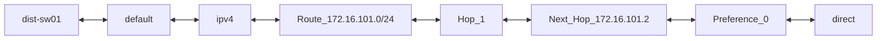
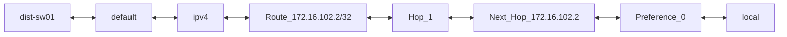
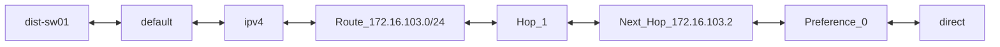
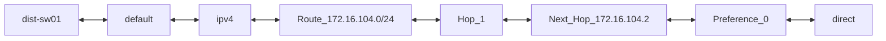
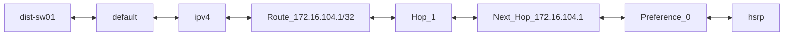
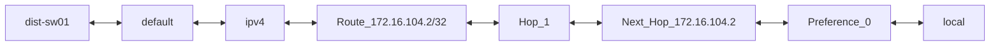
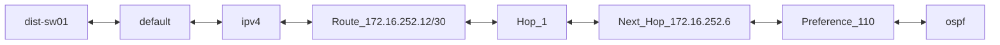
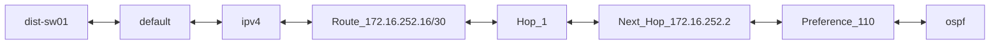
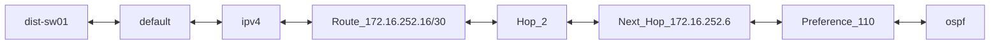

```mermaid
flowchart LR;
dist-sw01 <--> default <--> ipv4 <--> Route_172.16.252.20/30 <--> Hop_1 <--> Next_Hop_172.16.252.2 <--> Preference_110 <--> ospf
```
```mermaid
flowchart LR;
dist-sw01 <--> default <--> ipv4 <--> Route_172.16.252.24/30 <--> Hop_1 <--> Next_Hop_172.16.252.2 <--> Preference_110 <--> ospf
```
```mermaid
flowchart LR;
dist-sw01 <--> default <--> ipv4 <--> Route_172.16.252.28/30 <--> Hop_1 <--> Next_Hop_172.16.252.6 <--> Preference_110 <--> ospf
```
```mermaid
flowchart LR;
dist-sw01 <--> default <--> ipv4 <--> Route_172.16.252.32/30 <--> Hop_1 <--> Next_Hop_172.16.252.6 <--> Preference_110 <--> ospf
```
```mermaid
flowchart LR;
dist-sw01 <--> default <--> ipv4 <--> Route_172.16.252.4/30 <--> Hop_1 <--> Next_Hop_172.16.252.5 <--> Preference_0 <--> direct
```
```mermaid
flowchart LR;
dist-sw01 <--> default <--> ipv4 <--> Route_172.16.252.5/32 <--> Hop_1 <--> Next_Hop_172.16.252.5 <--> Preference_0 <--> local
```
```mermaid
flowchart LR;
dist-sw01 <--> default <--> ipv4 <--> Route_172.16.252.8/30 <--> Hop_1 <--> Next_Hop_172.16.252.2 <--> Preference_110 <--> ospf
```
```mermaid
flowchart LR;
dist-sw01 <--> management <--> ipv4 <--> Route_0.0.0.0/0 <--> Hop_1 <--> Next_Hop_10.10.20.254 <--> Preference_1 <--> static
```
```mermaid
flowchart LR;
dist-sw01 <--> management <--> ipv4 <--> Route_10.10.20.0/24 <--> Hop_1 <--> Next_Hop_10.10.20.177 <--> Preference_0 <--> direct
```
```mermaid
flowchart LR;
dist-sw01 <--> management <--> ipv4 <--> Route_10.10.20.177/32 <--> Hop_1 <--> Next_Hop_10.10.20.177 <--> Preference_0 <--> local
```