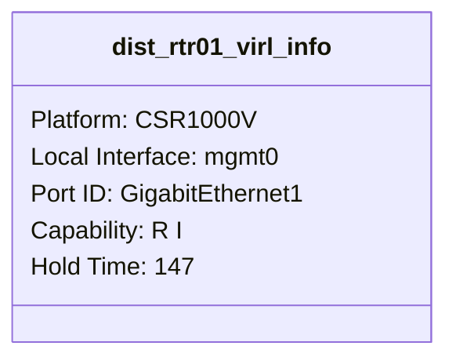
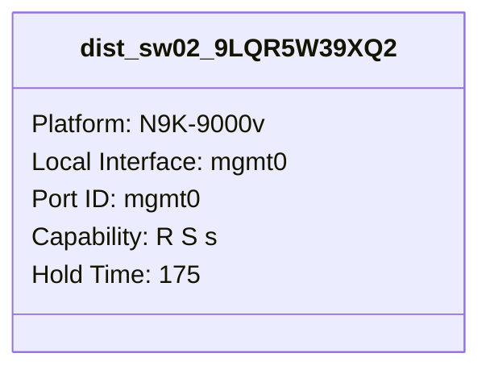
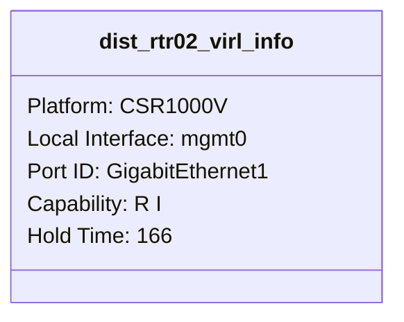
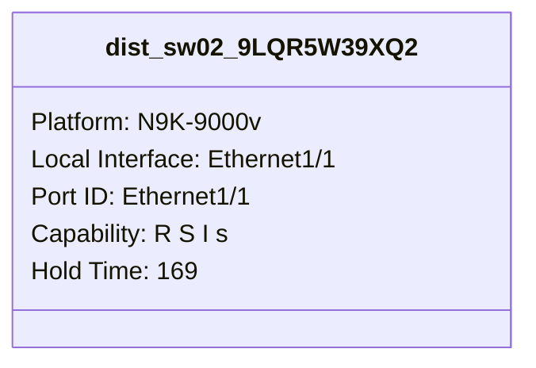
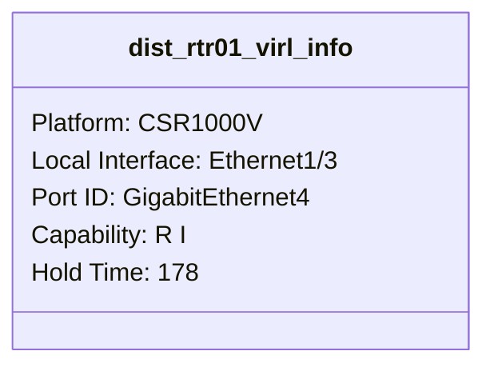
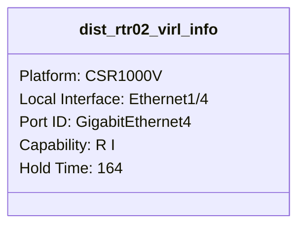

```mermaid
classDiagram
class dist_rtr01_virl_info{
Platform: CSR1000V
Local Interface: mgmt0
Port ID: GigabitEthernet1
Capability: R I
Hold Time: 147
}
```

```mermaid
classDiagram
class dist_sw02_9LQR5W39XQ2{
Platform: N9K-9000v
Local Interface: mgmt0
Port ID: mgmt0
Capability: R S s
Hold Time: 175
}
```

```mermaid
classDiagram
class dist_rtr02_virl_info{
Platform: CSR1000V
Local Interface: mgmt0
Port ID: GigabitEthernet1
Capability: R I
Hold Time: 166
}
```

```mermaid
classDiagram
class dist_sw02_9LQR5W39XQ2{
Platform: N9K-9000v
Local Interface: Ethernet1/1
Port ID: Ethernet1/1
Capability: R S I s
Hold Time: 169
}
```

```mermaid
classDiagram
class dist_sw02_9LQR5W39XQ2{
Platform: N9K-9000v
Local Interface: Ethernet1/2
Port ID: Ethernet1/2
Capability: R S I s
Hold Time: 170
}
```

```mermaid
classDiagram
class dist_rtr01_virl_info{
Platform: CSR1000V
Local Interface: Ethernet1/3
Port ID: GigabitEthernet4
Capability: R I
Hold Time: 178
}
```

```mermaid
classDiagram
class dist_rtr02_virl_info{
Platform: CSR1000V
Local Interface: Ethernet1/4
Port ID: GigabitEthernet4
Capability: R I
Hold Time: 164
}
```