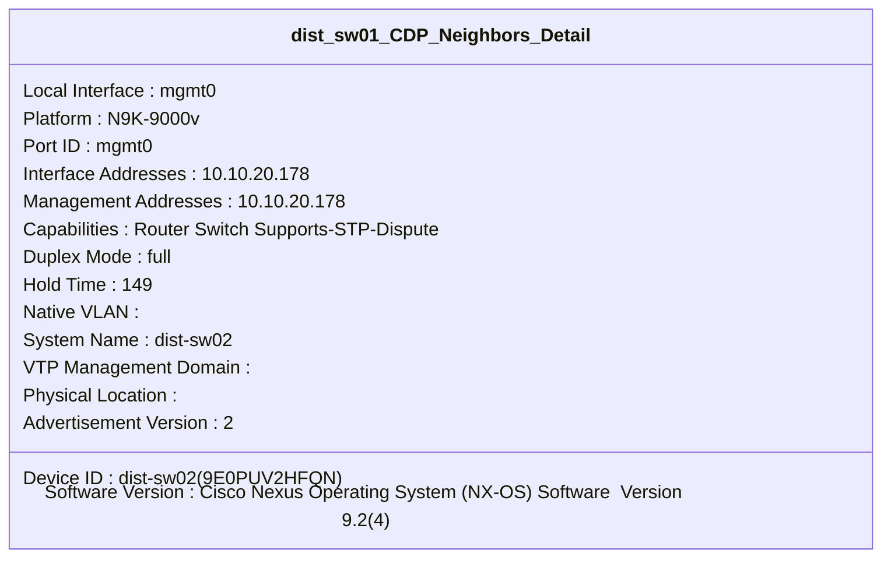
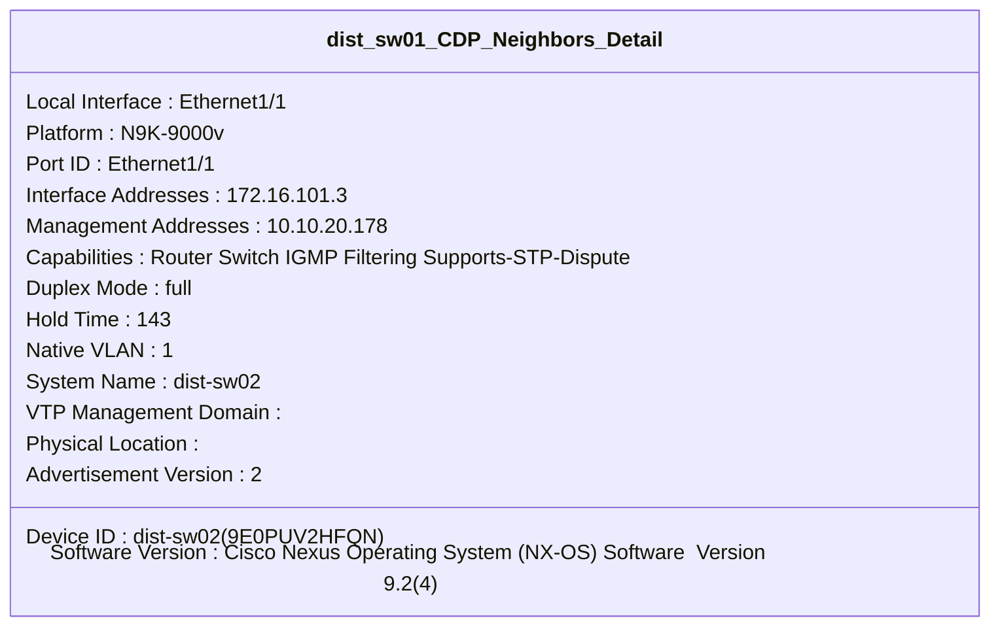
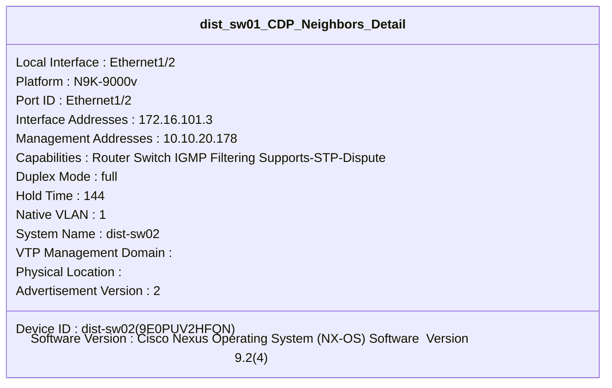

```mermaid
classDiagram
class dist_sw01_CDP_Neighbors_Detail {
Local Interface : mgmt0
Device ID : dist-sw02(9E0PUV2HFQN)
Platform : N9K-9000v
Port ID : mgmt0
Interface Addresses : 10.10.20.178 
Management Addresses : 10.10.20.178 
Capabilities : Router Switch Supports-STP-Dispute
Duplex Mode : full
Hold Time : 149
Native VLAN : 
Software Version : Cisco Nexus Operating System (NX-OS) Software  Version 9.2(4)
System Name : dist-sw02
VTP Management Domain : 
Physical Location : 
Advertisement Version : 2
}
```

```mermaid
classDiagram
class dist_sw01_CDP_Neighbors_Detail {
Local Interface : Ethernet1/1
Device ID : dist-sw02(9E0PUV2HFQN)
Platform : N9K-9000v
Port ID : Ethernet1/1
Interface Addresses : 172.16.101.3 
Management Addresses : 10.10.20.178 
Capabilities : Router Switch IGMP Filtering Supports-STP-Dispute
Duplex Mode : full
Hold Time : 143
Native VLAN : 1
Software Version : Cisco Nexus Operating System (NX-OS) Software  Version 9.2(4)
System Name : dist-sw02
VTP Management Domain : 
Physical Location : 
Advertisement Version : 2
}
```

```mermaid
classDiagram
class dist_sw01_CDP_Neighbors_Detail {
Local Interface : Ethernet1/2
Device ID : dist-sw02(9E0PUV2HFQN)
Platform : N9K-9000v
Port ID : Ethernet1/2
Interface Addresses : 172.16.101.3 
Management Addresses : 10.10.20.178 
Capabilities : Router Switch IGMP Filtering Supports-STP-Dispute
Duplex Mode : full
Hold Time : 144
Native VLAN : 1
Software Version : Cisco Nexus Operating System (NX-OS) Software  Version 9.2(4)
System Name : dist-sw02
VTP Management Domain : 
Physical Location : 
Advertisement Version : 2
}
```
