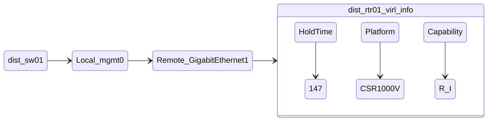
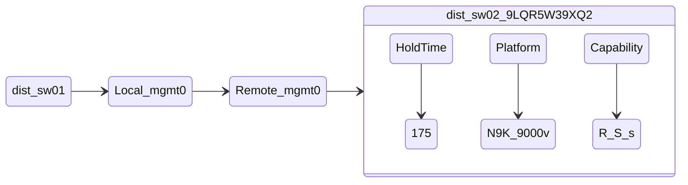
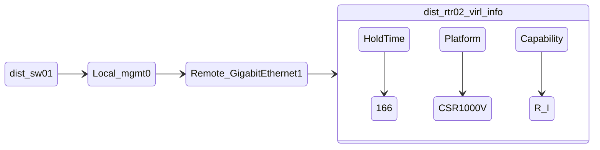
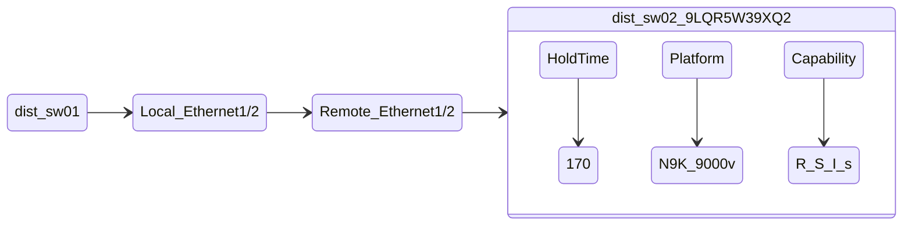
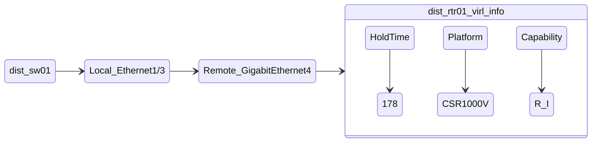
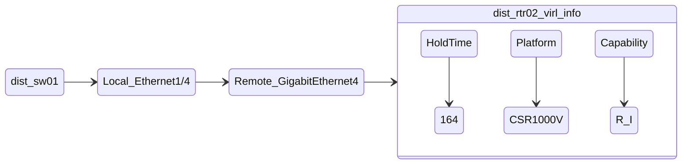

```mermaid
stateDiagram
    direction LR
dist_sw01 --> Local_mgmt0
Local_mgmt0 --> Remote_GigabitEthernet1
Remote_GigabitEthernet1 --> dist_rtr01_virl_info
    state dist_rtr01_virl_info{
        Platform --> CSR1000V
        Capability --> R_I
        HoldTime --> 147
}
```

```mermaid
stateDiagram
    direction LR
dist_sw01 --> Local_mgmt0
Local_mgmt0 --> Remote_mgmt0
Remote_mgmt0 --> dist_sw02_9LQR5W39XQ2
    state dist_sw02_9LQR5W39XQ2{
        Platform --> N9K_9000v
        Capability --> R_S_s
        HoldTime --> 175
}
```

```mermaid
stateDiagram
    direction LR
dist_sw01 --> Local_mgmt0
Local_mgmt0 --> Remote_GigabitEthernet1
Remote_GigabitEthernet1 --> dist_rtr02_virl_info
    state dist_rtr02_virl_info{
        Platform --> CSR1000V
        Capability --> R_I
        HoldTime --> 166
}
```

```mermaid
stateDiagram
    direction LR
dist_sw01 --> Local_Ethernet1/1
Local_Ethernet1/1 --> Remote_Ethernet1/1
Remote_Ethernet1/1 --> dist_sw02_9LQR5W39XQ2
    state dist_sw02_9LQR5W39XQ2{
        Platform --> N9K_9000v
        Capability --> R_S_I_s
        HoldTime --> 169
}
```

```mermaid
stateDiagram
    direction LR
dist_sw01 --> Local_Ethernet1/2
Local_Ethernet1/2 --> Remote_Ethernet1/2
Remote_Ethernet1/2 --> dist_sw02_9LQR5W39XQ2
    state dist_sw02_9LQR5W39XQ2{
        Platform --> N9K_9000v
        Capability --> R_S_I_s
        HoldTime --> 170
}
```

```mermaid
stateDiagram
    direction LR
dist_sw01 --> Local_Ethernet1/3
Local_Ethernet1/3 --> Remote_GigabitEthernet4
Remote_GigabitEthernet4 --> dist_rtr01_virl_info
    state dist_rtr01_virl_info{
        Platform --> CSR1000V
        Capability --> R_I
        HoldTime --> 178
}
```

```mermaid
stateDiagram
    direction LR
dist_sw01 --> Local_Ethernet1/4
Local_Ethernet1/4 --> Remote_GigabitEthernet4
Remote_GigabitEthernet4 --> dist_rtr02_virl_info
    state dist_rtr02_virl_info{
        Platform --> CSR1000V
        Capability --> R_I
        HoldTime --> 164
}
```