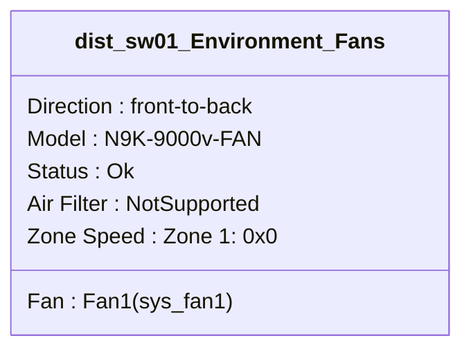
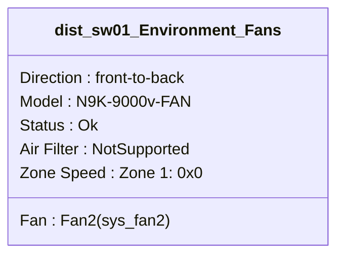
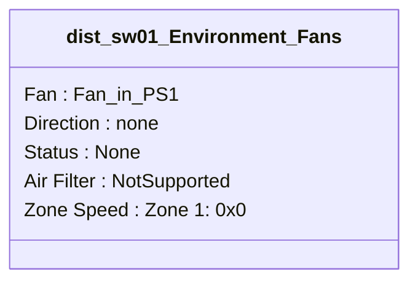
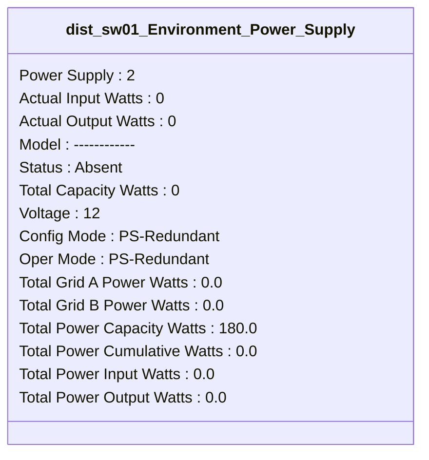

```mermaid
classDiagram
class dist_sw01_Environment_Fans {
```mermaid
classDiagram
class dist_sw01_Environment_Fans {
```mermaid
classDiagram
class dist_sw01_Environment_Power_Supply {
Power Supply : 1
Actual Input Watts : 0
Actual Output Watts : 0
Model : ------------
Status : Absent
Total Capacity Watts : 0
Voltage : 12
Config Mode : PS-Redundant
Oper Mode : PS-Redundant
Total Grid A Power Watts : 0.0
Total Grid B Power Watts : 0.0
Total Power Capacity Watts : 180.0
Total Power Cumulative Watts : 0.0
Total Power Input Watts : 0.0
Total Power Output Watts : 0.0
}
```
