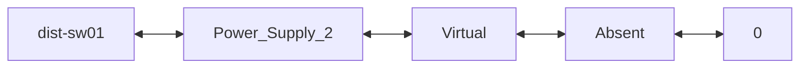

```mermaid
flowchart LR;
dist-sw01 <--> Fan1(sys_fan1) <--> front-to-back <--> N9K-9000v-FAN  <--> Ok
```

```mermaid
flowchart LR;
dist-sw01 <--> Fan2(sys_fan2) <--> front-to-back <--> N9K-9000v-FAN  <--> Ok
```

```mermaid
flowchart LR;
dist-sw01 <--> Fan3(sys_fan3) <--> front-to-back <--> N9K-9000v-FAN  <--> Ok
```

```mermaid
flowchart LR;
dist-sw01 <--> Fan_in_PS1 <--> none <--> None
```

```mermaid
flowchart LR;
dist-sw01 <--> Fan_in_PS2 <--> none <--> None
```

```mermaid
flowchart LR;
dist-sw01 <--> Power_Supply_1 <--> Virtual <--> Absent <--> 0
```

```mermaid
flowchart LR;
dist-sw01 <--> Power_Supply_2 <--> Virtual <--> Absent <--> 0
```