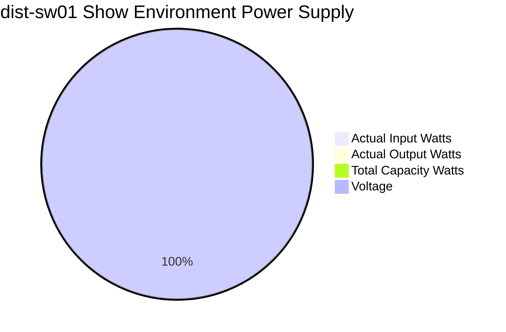
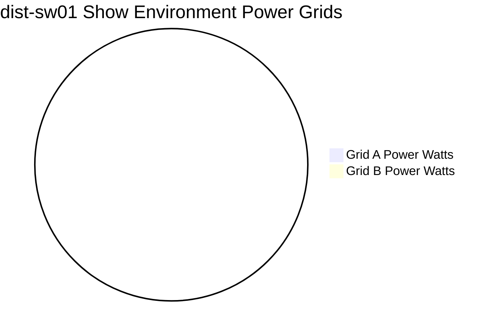
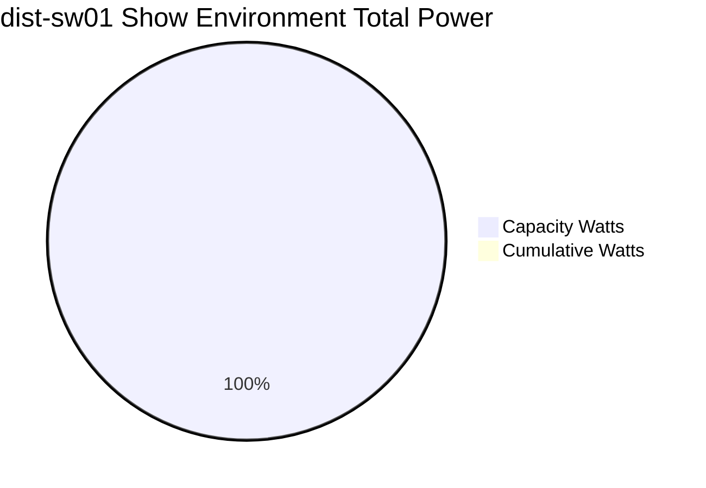
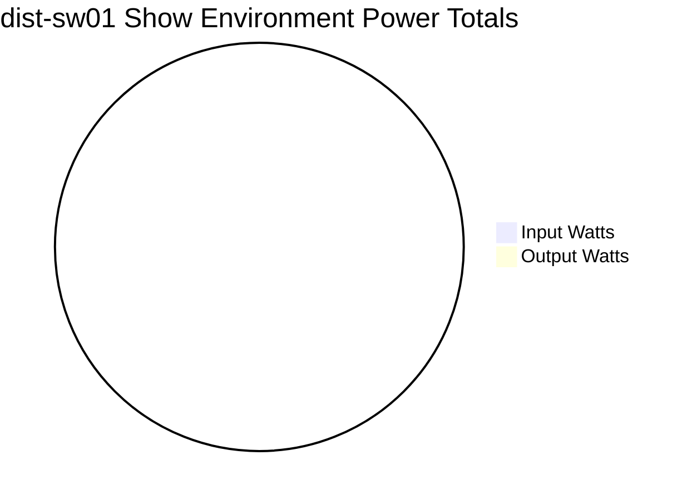

```mermaid
pie
title dist-sw01 Show Environment Power Supply
"Actual Input Watts" : 0
"Actual Output Watts" : 0
"Total Capacity Watts" : 0
"Voltage" : 12
```

```mermaid
pie
title dist-sw01 Show Environment Power Grids
"Grid A Power Watts" : 0.0
"Grid B Power Watts" : 0.0
```

```mermaid
pie
title dist-sw01 Show Environment Total Power
"Capacity Watts" : 180.0
"Cumulative Watts" : 0.0
```

```mermaid
pie
title dist-sw01 Show Environment Power Totals
"Input Watts" : 0.0
"Output Watts" : 0.0
```

```mermaid
pie
title dist-sw01 Show Environment Power Supply
"Actual Input Watts" : 0
"Actual Output Watts" : 0
"Total Capacity Watts" : 0
"Voltage" : 12
```

```mermaid
pie
title dist-sw01 Show Environment Power Grids
"Grid A Power Watts" : 0.0
"Grid B Power Watts" : 0.0
```

```mermaid
pie
title dist-sw01 Show Environment Total Power
"Capacity Watts" : 180.0
"Cumulative Watts" : 0.0
```

```mermaid
pie
title dist-sw01 Show Environment Power Totals
"Input Watts" : 0.0
"Output Watts" : 0.0
```