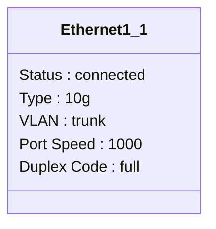
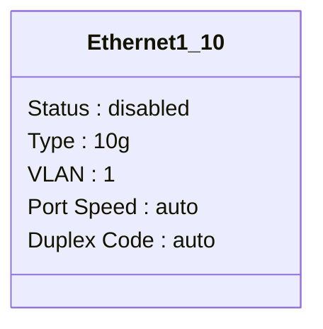
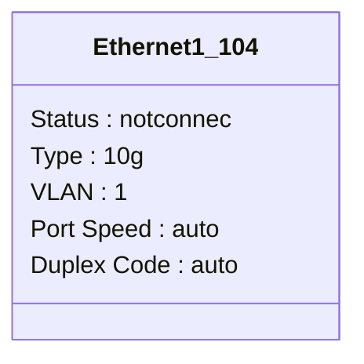
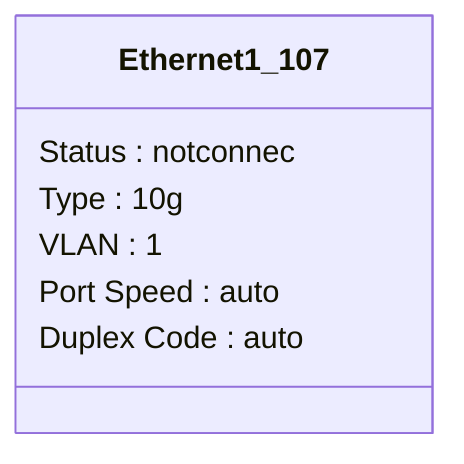
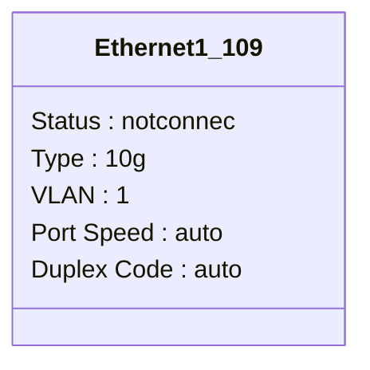
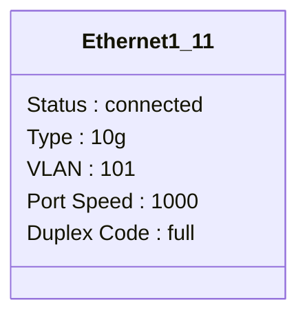
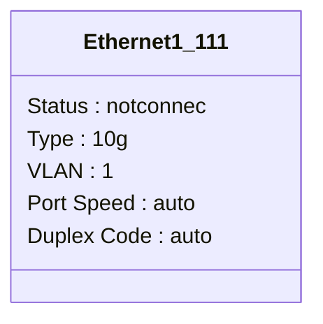
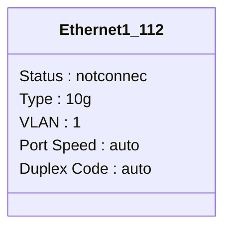
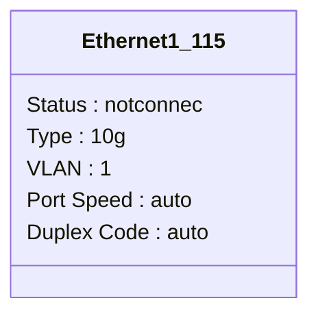

```mermaid
classDiagram
class Ethernet1_117 {
Status : notconnec
Type : 10g
VLAN : 1
Port Speed : auto
Duplex Code : auto
}
```
```mermaid
classDiagram
class Ethernet1_118 {
Status : notconnec
Type : 10g
VLAN : 1
Port Speed : auto
Duplex Code : auto
}
```
```mermaid
classDiagram
class Ethernet1_119 {
Status : notconnec
Type : 10g
VLAN : 1
Port Speed : auto
Duplex Code : auto
}
```
```mermaid
classDiagram
class Ethernet1_12 {
Status : notconnec
Type : 10g
VLAN : 1
Port Speed : auto
Duplex Code : auto
}
```
```mermaid
classDiagram
class Ethernet1_120 {
Status : notconnec
Type : 10g
VLAN : 1
Port Speed : auto
Duplex Code : auto
}
```
```mermaid
classDiagram
class Ethernet1_121 {
Status : notconnec
Type : 10g
VLAN : 1
Port Speed : auto
Duplex Code : auto
}
```
```mermaid
classDiagram
class Ethernet1_122 {
Status : notconnec
Type : 10g
VLAN : 1
Port Speed : auto
Duplex Code : auto
}
```
```mermaid
classDiagram
class Ethernet1_123 {
Status : notconnec
Type : 10g
VLAN : 1
Port Speed : auto
Duplex Code : auto
}
```
```mermaid
classDiagram
class Ethernet1_124 {
Status : notconnec
Type : 10g
VLAN : 1
Port Speed : auto
Duplex Code : auto
}
```
```mermaid
classDiagram
class Ethernet1_125 {
Status : notconnec
Type : 10g
VLAN : 1
Port Speed : auto
Duplex Code : auto
}
```
```mermaid
classDiagram
class Ethernet1_126 {
Status : notconnec
Type : 10g
VLAN : 1
Port Speed : auto
Duplex Code : auto
}
```
```mermaid
classDiagram
class Ethernet1_127 {
Status : notconnec
Type : 10g
VLAN : 1
Port Speed : auto
Duplex Code : auto
}
```
```mermaid
classDiagram
class Ethernet1_128 {
Status : notconnec
Type : 10g
VLAN : 1
Port Speed : auto
Duplex Code : auto
}
```
```mermaid
classDiagram
class Ethernet1_13 {
Status : notconnec
Type : 10g
VLAN : 1
Port Speed : auto
Duplex Code : auto
}
```
```mermaid
classDiagram
class Ethernet1_14 {
Status : notconnec
Type : 10g
VLAN : 1
Port Speed : auto
Duplex Code : auto
}
```
```mermaid
classDiagram
class Ethernet1_15 {
Status : notconnec
Type : 10g
VLAN : 1
Port Speed : auto
Duplex Code : auto
}
```
```mermaid
classDiagram
class Ethernet1_16 {
Status : notconnec
Type : 10g
VLAN : 1
Port Speed : auto
Duplex Code : auto
}
```
```mermaid
classDiagram
class Ethernet1_17 {
Status : notconnec
Type : 10g
VLAN : 1
Port Speed : auto
Duplex Code : auto
}
```
```mermaid
classDiagram
class Ethernet1_18 {
Status : notconnec
Type : 10g
VLAN : 1
Port Speed : auto
Duplex Code : auto
}
```
```mermaid
classDiagram
class Ethernet1_19 {
Status : notconnec
Type : 10g
VLAN : 1
Port Speed : auto
Duplex Code : auto
}
```
```mermaid
classDiagram
class Ethernet1_2 {
Status : connected
Type : 10g
VLAN : trunk
Port Speed : 1000
Duplex Code : full
}
```
```mermaid
classDiagram
class Ethernet1_20 {
Status : notconnec
Type : 10g
VLAN : 1
Port Speed : auto
Duplex Code : auto
}
```
```mermaid
classDiagram
class Ethernet1_21 {
Status : notconnec
Type : 10g
VLAN : 1
Port Speed : auto
Duplex Code : auto
}
```
```mermaid
classDiagram
class Ethernet1_22 {
Status : notconnec
Type : 10g
VLAN : 1
Port Speed : auto
Duplex Code : auto
}
```
```mermaid
classDiagram
class Ethernet1_23 {
Status : notconnec
Type : 10g
VLAN : 1
Port Speed : auto
Duplex Code : auto
}
```
```mermaid
classDiagram
class Ethernet1_24 {
Status : notconnec
Type : 10g
VLAN : 1
Port Speed : auto
Duplex Code : auto
}
```
```mermaid
classDiagram
class Ethernet1_25 {
Status : notconnec
Type : 10g
VLAN : 1
Port Speed : auto
Duplex Code : auto
}
```
```mermaid
classDiagram
class Ethernet1_26 {
Status : notconnec
Type : 10g
VLAN : 1
Port Speed : auto
Duplex Code : auto
}
```
```mermaid
classDiagram
class Ethernet1_27 {
Status : notconnec
Type : 10g
VLAN : 1
Port Speed : auto
Duplex Code : auto
}
```
```mermaid
classDiagram
class Ethernet1_28 {
Status : notconnec
Type : 10g
VLAN : 1
Port Speed : auto
Duplex Code : auto
}
```
```mermaid
classDiagram
class Ethernet1_29 {
Status : notconnec
Type : 10g
VLAN : 1
Port Speed : auto
Duplex Code : auto
}
```
```mermaid
classDiagram
class Ethernet1_3 {
Status : connected
Type : 10g
VLAN : routed
Port Speed : 1000
Duplex Code : full
}
```
```mermaid
classDiagram
class Ethernet1_30 {
Status : notconnec
Type : 10g
VLAN : 1
Port Speed : auto
Duplex Code : auto
}
```
```mermaid
classDiagram
class Ethernet1_31 {
Status : notconnec
Type : 10g
VLAN : 1
Port Speed : auto
Duplex Code : auto
}
```
```mermaid
classDiagram
class Ethernet1_32 {
Status : notconnec
Type : 10g
VLAN : 1
Port Speed : auto
Duplex Code : auto
}
```
```mermaid
classDiagram
class Ethernet1_33 {
Status : notconnec
Type : 10g
VLAN : 1
Port Speed : auto
Duplex Code : auto
}
```
```mermaid
classDiagram
class Ethernet1_34 {
Status : notconnec
Type : 10g
VLAN : 1
Port Speed : auto
Duplex Code : auto
}
```
```mermaid
classDiagram
class Ethernet1_35 {
Status : notconnec
Type : 10g
VLAN : 1
Port Speed : auto
Duplex Code : auto
}
```
```mermaid
classDiagram
class Ethernet1_36 {
Status : notconnec
Type : 10g
VLAN : 1
Port Speed : auto
Duplex Code : auto
}
```
```mermaid
classDiagram
class Ethernet1_37 {
Status : notconnec
Type : 10g
VLAN : 1
Port Speed : auto
Duplex Code : auto
}
```
```mermaid
classDiagram
class Ethernet1_38 {
Status : notconnec
Type : 10g
VLAN : 1
Port Speed : auto
Duplex Code : auto
}
```
```mermaid
classDiagram
class Ethernet1_39 {
Status : notconnec
Type : 10g
VLAN : 1
Port Speed : auto
Duplex Code : auto
}
```
```mermaid
classDiagram
class Ethernet1_4 {
Status : connected
Type : 10g
VLAN : routed
Port Speed : 1000
Duplex Code : full
}
```
```mermaid
classDiagram
class Ethernet1_40 {
Status : notconnec
Type : 10g
VLAN : 1
Port Speed : auto
Duplex Code : auto
}
```
```mermaid
classDiagram
class Ethernet1_41 {
Status : notconnec
Type : 10g
VLAN : 1
Port Speed : auto
Duplex Code : auto
}
```
```mermaid
classDiagram
class Ethernet1_42 {
Status : notconnec
Type : 10g
VLAN : 1
Port Speed : auto
Duplex Code : auto
}
```
```mermaid
classDiagram
class Ethernet1_43 {
Status : notconnec
Type : 10g
VLAN : 1
Port Speed : auto
Duplex Code : auto
}
```
```mermaid
classDiagram
class Ethernet1_44 {
Status : notconnec
Type : 10g
VLAN : 1
Port Speed : auto
Duplex Code : auto
}
```
```mermaid
classDiagram
class Ethernet1_45 {
Status : notconnec
Type : 10g
VLAN : 1
Port Speed : auto
Duplex Code : auto
}
```
```mermaid
classDiagram
class Ethernet1_46 {
Status : notconnec
Type : 10g
VLAN : 1
Port Speed : auto
Duplex Code : auto
}
```
```mermaid
classDiagram
class Ethernet1_47 {
Status : notconnec
Type : 10g
VLAN : 1
Port Speed : auto
Duplex Code : auto
}
```
```mermaid
classDiagram
class Ethernet1_48 {
Status : notconnec
Type : 10g
VLAN : 1
Port Speed : auto
Duplex Code : auto
}
```
```mermaid
classDiagram
class Ethernet1_49 {
Status : notconnec
Type : 10g
VLAN : 1
Port Speed : auto
Duplex Code : auto
}
```
```mermaid
classDiagram
class Ethernet1_5 {
Status : disabled
Type : 10g
VLAN : 1
Port Speed : auto
Duplex Code : auto
}
```
```mermaid
classDiagram
class Ethernet1_50 {
Status : notconnec
Type : 10g
VLAN : 1
Port Speed : auto
Duplex Code : auto
}
```
```mermaid
classDiagram
class Ethernet1_51 {
Status : notconnec
Type : 10g
VLAN : 1
Port Speed : auto
Duplex Code : auto
}
```
```mermaid
classDiagram
class Ethernet1_52 {
Status : notconnec
Type : 10g
VLAN : 1
Port Speed : auto
Duplex Code : auto
}
```
```mermaid
classDiagram
class Ethernet1_53 {
Status : notconnec
Type : 10g
VLAN : 1
Port Speed : auto
Duplex Code : auto
}
```
```mermaid
classDiagram
class Ethernet1_54 {
Status : notconnec
Type : 10g
VLAN : 1
Port Speed : auto
Duplex Code : auto
}
```
```mermaid
classDiagram
class Ethernet1_55 {
Status : notconnec
Type : 10g
VLAN : 1
Port Speed : auto
Duplex Code : auto
}
```
```mermaid
classDiagram
class Ethernet1_56 {
Status : notconnec
Type : 10g
VLAN : 1
Port Speed : auto
Duplex Code : auto
}
```
```mermaid
classDiagram
class Ethernet1_57 {
Status : notconnec
Type : 10g
VLAN : 1
Port Speed : auto
Duplex Code : auto
}
```
```mermaid
classDiagram
class Ethernet1_58 {
Status : notconnec
Type : 10g
VLAN : 1
Port Speed : auto
Duplex Code : auto
}
```
```mermaid
classDiagram
class Ethernet1_59 {
Status : notconnec
Type : 10g
VLAN : 1
Port Speed : auto
Duplex Code : auto
}
```
```mermaid
classDiagram
class Ethernet1_6 {
Status : disabled
Type : 10g
VLAN : 1
Port Speed : auto
Duplex Code : auto
}
```
```mermaid
classDiagram
class Ethernet1_60 {
Status : notconnec
Type : 10g
VLAN : 1
Port Speed : auto
Duplex Code : auto
}
```
```mermaid
classDiagram
class Ethernet1_61 {
Status : notconnec
Type : 10g
VLAN : 1
Port Speed : auto
Duplex Code : auto
}
```
```mermaid
classDiagram
class Ethernet1_62 {
Status : notconnec
Type : 10g
VLAN : 1
Port Speed : auto
Duplex Code : auto
}
```
```mermaid
classDiagram
class Ethernet1_63 {
Status : notconnec
Type : 10g
VLAN : 1
Port Speed : auto
Duplex Code : auto
}
```
```mermaid
classDiagram
class Ethernet1_64 {
Status : notconnec
Type : 10g
VLAN : 1
Port Speed : auto
Duplex Code : auto
}
```
```mermaid
classDiagram
class Ethernet1_65 {
Status : notconnec
Type : 10g
VLAN : 1
Port Speed : auto
Duplex Code : auto
}
```
```mermaid
classDiagram
class Ethernet1_66 {
Status : notconnec
Type : 10g
VLAN : 1
Port Speed : auto
Duplex Code : auto
}
```
```mermaid
classDiagram
class Ethernet1_67 {
Status : notconnec
Type : 10g
VLAN : 1
Port Speed : auto
Duplex Code : auto
}
```
```mermaid
classDiagram
class Ethernet1_68 {
Status : notconnec
Type : 10g
VLAN : 1
Port Speed : auto
Duplex Code : auto
}
```
```mermaid
classDiagram
class Ethernet1_69 {
Status : notconnec
Type : 10g
VLAN : 1
Port Speed : auto
Duplex Code : auto
}
```
```mermaid
classDiagram
class Ethernet1_7 {
Status : disabled
Type : 10g
VLAN : 1
Port Speed : auto
Duplex Code : auto
}
```
```mermaid
classDiagram
class Ethernet1_70 {
Status : notconnec
Type : 10g
VLAN : 1
Port Speed : auto
Duplex Code : auto
}
```
```mermaid
classDiagram
class Ethernet1_71 {
Status : notconnec
Type : 10g
VLAN : 1
Port Speed : auto
Duplex Code : auto
}
```
```mermaid
classDiagram
class Ethernet1_72 {
Status : notconnec
Type : 10g
VLAN : 1
Port Speed : auto
Duplex Code : auto
}
```
```mermaid
classDiagram
class Ethernet1_73 {
Status : notconnec
Type : 10g
VLAN : 1
Port Speed : auto
Duplex Code : auto
}
```
```mermaid
classDiagram
class Ethernet1_74 {
Status : notconnec
Type : 10g
VLAN : 1
Port Speed : auto
Duplex Code : auto
}
```
```mermaid
classDiagram
class Ethernet1_75 {
Status : notconnec
Type : 10g
VLAN : 1
Port Speed : auto
Duplex Code : auto
}
```
```mermaid
classDiagram
class Ethernet1_76 {
Status : notconnec
Type : 10g
VLAN : 1
Port Speed : auto
Duplex Code : auto
}
```
```mermaid
classDiagram
class Ethernet1_77 {
Status : notconnec
Type : 10g
VLAN : 1
Port Speed : auto
Duplex Code : auto
}
```
```mermaid
classDiagram
class Ethernet1_78 {
Status : notconnec
Type : 10g
VLAN : 1
Port Speed : auto
Duplex Code : auto
}
```
```mermaid
classDiagram
class Ethernet1_79 {
Status : notconnec
Type : 10g
VLAN : 1
Port Speed : auto
Duplex Code : auto
}
```
```mermaid
classDiagram
class Ethernet1_8 {
Status : disabled
Type : 10g
VLAN : 1
Port Speed : auto
Duplex Code : auto
}
```
```mermaid
classDiagram
class Ethernet1_80 {
Status : notconnec
Type : 10g
VLAN : 1
Port Speed : auto
Duplex Code : auto
}
```
```mermaid
classDiagram
class Ethernet1_81 {
Status : notconnec
Type : 10g
VLAN : 1
Port Speed : auto
Duplex Code : auto
}
```
```mermaid
classDiagram
class Ethernet1_82 {
Status : notconnec
Type : 10g
VLAN : 1
Port Speed : auto
Duplex Code : auto
}
```
```mermaid
classDiagram
class Ethernet1_83 {
Status : notconnec
Type : 10g
VLAN : 1
Port Speed : auto
Duplex Code : auto
}
```
```mermaid
classDiagram
class Ethernet1_84 {
Status : notconnec
Type : 10g
VLAN : 1
Port Speed : auto
Duplex Code : auto
}
```
```mermaid
classDiagram
class Ethernet1_85 {
Status : notconnec
Type : 10g
VLAN : 1
Port Speed : auto
Duplex Code : auto
}
```
```mermaid
classDiagram
class Ethernet1_86 {
Status : notconnec
Type : 10g
VLAN : 1
Port Speed : auto
Duplex Code : auto
}
```
```mermaid
classDiagram
class Ethernet1_87 {
Status : notconnec
Type : 10g
VLAN : 1
Port Speed : auto
Duplex Code : auto
}
```
```mermaid
classDiagram
class Ethernet1_88 {
Status : notconnec
Type : 10g
VLAN : 1
Port Speed : auto
Duplex Code : auto
}
```
```mermaid
classDiagram
class Ethernet1_89 {
Status : notconnec
Type : 10g
VLAN : 1
Port Speed : auto
Duplex Code : auto
}
```
```mermaid
classDiagram
class Ethernet1_9 {
Status : disabled
Type : 10g
VLAN : 1
Port Speed : auto
Duplex Code : auto
}
```
```mermaid
classDiagram
class Ethernet1_90 {
Status : notconnec
Type : 10g
VLAN : 1
Port Speed : auto
Duplex Code : auto
}
```
```mermaid
classDiagram
class Ethernet1_91 {
Status : notconnec
Type : 10g
VLAN : 1
Port Speed : auto
Duplex Code : auto
}
```
```mermaid
classDiagram
class Ethernet1_92 {
Status : notconnec
Type : 10g
VLAN : 1
Port Speed : auto
Duplex Code : auto
}
```
```mermaid
classDiagram
class Ethernet1_93 {
Status : notconnec
Type : 10g
VLAN : 1
Port Speed : auto
Duplex Code : auto
}
```
```mermaid
classDiagram
class Ethernet1_94 {
Status : notconnec
Type : 10g
VLAN : 1
Port Speed : auto
Duplex Code : auto
}
```
```mermaid
classDiagram
class Ethernet1_95 {
Status : notconnec
Type : 10g
VLAN : 1
Port Speed : auto
Duplex Code : auto
}
```
```mermaid
classDiagram
class Ethernet1_96 {
Status : notconnec
Type : 10g
VLAN : 1
Port Speed : auto
Duplex Code : auto
}
```
```mermaid
classDiagram
class Ethernet1_97 {
Status : notconnec
Type : 10g
VLAN : 1
Port Speed : auto
Duplex Code : auto
}
```
```mermaid
classDiagram
class Ethernet1_98 {
Status : notconnec
Type : 10g
VLAN : 1
Port Speed : auto
Duplex Code : auto
}
```
```mermaid
classDiagram
class Ethernet1_99 {
Status : notconnec
Type : 10g
VLAN : 1
Port Speed : auto
Duplex Code : auto
}
```
```mermaid
classDiagram
class Loopback0 {
Status : disabled
Type : 
VLAN : routed
Port Speed : auto
Duplex Code : auto
}
```
```mermaid
classDiagram
class Port_channel1 {
Status : connected
Type : 
VLAN : trunk
Port Speed : 1000
Duplex Code : full
}
```
```mermaid
classDiagram
class Vlan1 {
Status : down
Type : 
VLAN : routed
Port Speed : auto
Duplex Code : auto
}
```
```mermaid
classDiagram
class Vlan101 {
Status : routed
Type : 
VLAN : auto
Port Speed : 
Duplex Code : auto
}
```
```mermaid
classDiagram
class Vlan102 {
Status : routed
Type : 
VLAN : auto
Port Speed : 
Duplex Code : auto
}
```
```mermaid
classDiagram
class Vlan103 {
Status : routed
Type : 
VLAN : auto
Port Speed : 
Duplex Code : auto
}
```
```mermaid
classDiagram
class Vlan104 {
Status : routed
Type : 
VLAN : auto
Port Speed : 
Duplex Code : auto
}
```
```mermaid
classDiagram
class Vlan105 {
Status : routed
Type : 
VLAN : auto
Port Speed : 
Duplex Code : auto
}
```
```mermaid
classDiagram
class mgmt0 {
Status : connected
Type : 
VLAN : routed
Port Speed : 1000
Duplex Code : full
}
```