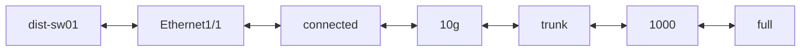
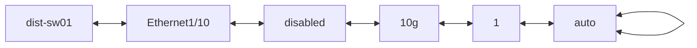
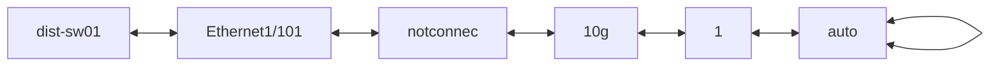
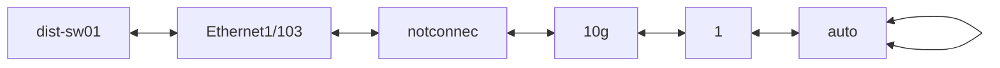
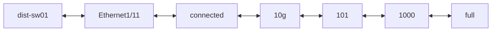
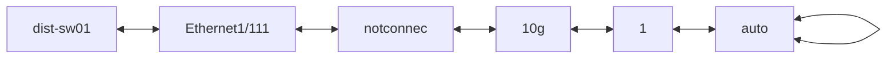
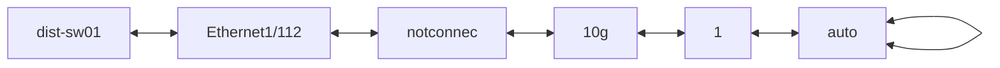
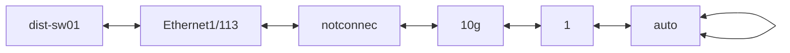
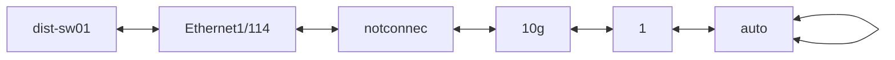

```mermaid
flowchart LR;
dist-sw01 <--> Ethernet1/117 <--> notconnec <--> 10g <--> 1 <--> auto <--> auto
```
```mermaid
flowchart LR;
dist-sw01 <--> Ethernet1/118 <--> notconnec <--> 10g <--> 1 <--> auto <--> auto
```
```mermaid
flowchart LR;
dist-sw01 <--> Ethernet1/119 <--> notconnec <--> 10g <--> 1 <--> auto <--> auto
```
```mermaid
flowchart LR;
dist-sw01 <--> Ethernet1/12 <--> notconnec <--> 10g <--> 1 <--> auto <--> auto
```
```mermaid
flowchart LR;
dist-sw01 <--> Ethernet1/120 <--> notconnec <--> 10g <--> 1 <--> auto <--> auto
```
```mermaid
flowchart LR;
dist-sw01 <--> Ethernet1/121 <--> notconnec <--> 10g <--> 1 <--> auto <--> auto
```
```mermaid
flowchart LR;
dist-sw01 <--> Ethernet1/122 <--> notconnec <--> 10g <--> 1 <--> auto <--> auto
```
```mermaid
flowchart LR;
dist-sw01 <--> Ethernet1/123 <--> notconnec <--> 10g <--> 1 <--> auto <--> auto
```
```mermaid
flowchart LR;
dist-sw01 <--> Ethernet1/124 <--> notconnec <--> 10g <--> 1 <--> auto <--> auto
```
```mermaid
flowchart LR;
dist-sw01 <--> Ethernet1/125 <--> notconnec <--> 10g <--> 1 <--> auto <--> auto
```
```mermaid
flowchart LR;
dist-sw01 <--> Ethernet1/126 <--> notconnec <--> 10g <--> 1 <--> auto <--> auto
```
```mermaid
flowchart LR;
dist-sw01 <--> Ethernet1/127 <--> notconnec <--> 10g <--> 1 <--> auto <--> auto
```
```mermaid
flowchart LR;
dist-sw01 <--> Ethernet1/128 <--> notconnec <--> 10g <--> 1 <--> auto <--> auto
```
```mermaid
flowchart LR;
dist-sw01 <--> Ethernet1/13 <--> notconnec <--> 10g <--> 1 <--> auto <--> auto
```
```mermaid
flowchart LR;
dist-sw01 <--> Ethernet1/14 <--> notconnec <--> 10g <--> 1 <--> auto <--> auto
```
```mermaid
flowchart LR;
dist-sw01 <--> Ethernet1/15 <--> notconnec <--> 10g <--> 1 <--> auto <--> auto
```
```mermaid
flowchart LR;
dist-sw01 <--> Ethernet1/16 <--> notconnec <--> 10g <--> 1 <--> auto <--> auto
```
```mermaid
flowchart LR;
dist-sw01 <--> Ethernet1/17 <--> notconnec <--> 10g <--> 1 <--> auto <--> auto
```
```mermaid
flowchart LR;
dist-sw01 <--> Ethernet1/18 <--> notconnec <--> 10g <--> 1 <--> auto <--> auto
```
```mermaid
flowchart LR;
dist-sw01 <--> Ethernet1/19 <--> notconnec <--> 10g <--> 1 <--> auto <--> auto
```
```mermaid
flowchart LR;
dist-sw01 <--> Ethernet1/2 <--> connected <--> 10g <--> trunk <--> 1000 <--> full
```
```mermaid
flowchart LR;
dist-sw01 <--> Ethernet1/20 <--> notconnec <--> 10g <--> 1 <--> auto <--> auto
```
```mermaid
flowchart LR;
dist-sw01 <--> Ethernet1/21 <--> notconnec <--> 10g <--> 1 <--> auto <--> auto
```
```mermaid
flowchart LR;
dist-sw01 <--> Ethernet1/22 <--> notconnec <--> 10g <--> 1 <--> auto <--> auto
```
```mermaid
flowchart LR;
dist-sw01 <--> Ethernet1/23 <--> notconnec <--> 10g <--> 1 <--> auto <--> auto
```
```mermaid
flowchart LR;
dist-sw01 <--> Ethernet1/24 <--> notconnec <--> 10g <--> 1 <--> auto <--> auto
```
```mermaid
flowchart LR;
dist-sw01 <--> Ethernet1/25 <--> notconnec <--> 10g <--> 1 <--> auto <--> auto
```
```mermaid
flowchart LR;
dist-sw01 <--> Ethernet1/26 <--> notconnec <--> 10g <--> 1 <--> auto <--> auto
```
```mermaid
flowchart LR;
dist-sw01 <--> Ethernet1/27 <--> notconnec <--> 10g <--> 1 <--> auto <--> auto
```
```mermaid
flowchart LR;
dist-sw01 <--> Ethernet1/28 <--> notconnec <--> 10g <--> 1 <--> auto <--> auto
```
```mermaid
flowchart LR;
dist-sw01 <--> Ethernet1/29 <--> notconnec <--> 10g <--> 1 <--> auto <--> auto
```
```mermaid
flowchart LR;
dist-sw01 <--> Ethernet1/3 <--> connected <--> 10g <--> routed <--> 1000 <--> full
```
```mermaid
flowchart LR;
dist-sw01 <--> Ethernet1/30 <--> notconnec <--> 10g <--> 1 <--> auto <--> auto
```
```mermaid
flowchart LR;
dist-sw01 <--> Ethernet1/31 <--> notconnec <--> 10g <--> 1 <--> auto <--> auto
```
```mermaid
flowchart LR;
dist-sw01 <--> Ethernet1/32 <--> notconnec <--> 10g <--> 1 <--> auto <--> auto
```
```mermaid
flowchart LR;
dist-sw01 <--> Ethernet1/33 <--> notconnec <--> 10g <--> 1 <--> auto <--> auto
```
```mermaid
flowchart LR;
dist-sw01 <--> Ethernet1/34 <--> notconnec <--> 10g <--> 1 <--> auto <--> auto
```
```mermaid
flowchart LR;
dist-sw01 <--> Ethernet1/35 <--> notconnec <--> 10g <--> 1 <--> auto <--> auto
```
```mermaid
flowchart LR;
dist-sw01 <--> Ethernet1/36 <--> notconnec <--> 10g <--> 1 <--> auto <--> auto
```
```mermaid
flowchart LR;
dist-sw01 <--> Ethernet1/37 <--> notconnec <--> 10g <--> 1 <--> auto <--> auto
```
```mermaid
flowchart LR;
dist-sw01 <--> Ethernet1/38 <--> notconnec <--> 10g <--> 1 <--> auto <--> auto
```
```mermaid
flowchart LR;
dist-sw01 <--> Ethernet1/39 <--> notconnec <--> 10g <--> 1 <--> auto <--> auto
```
```mermaid
flowchart LR;
dist-sw01 <--> Ethernet1/4 <--> connected <--> 10g <--> routed <--> 1000 <--> full
```
```mermaid
flowchart LR;
dist-sw01 <--> Ethernet1/40 <--> notconnec <--> 10g <--> 1 <--> auto <--> auto
```
```mermaid
flowchart LR;
dist-sw01 <--> Ethernet1/41 <--> notconnec <--> 10g <--> 1 <--> auto <--> auto
```
```mermaid
flowchart LR;
dist-sw01 <--> Ethernet1/42 <--> notconnec <--> 10g <--> 1 <--> auto <--> auto
```
```mermaid
flowchart LR;
dist-sw01 <--> Ethernet1/43 <--> notconnec <--> 10g <--> 1 <--> auto <--> auto
```
```mermaid
flowchart LR;
dist-sw01 <--> Ethernet1/44 <--> notconnec <--> 10g <--> 1 <--> auto <--> auto
```
```mermaid
flowchart LR;
dist-sw01 <--> Ethernet1/45 <--> notconnec <--> 10g <--> 1 <--> auto <--> auto
```
```mermaid
flowchart LR;
dist-sw01 <--> Ethernet1/46 <--> notconnec <--> 10g <--> 1 <--> auto <--> auto
```
```mermaid
flowchart LR;
dist-sw01 <--> Ethernet1/47 <--> notconnec <--> 10g <--> 1 <--> auto <--> auto
```
```mermaid
flowchart LR;
dist-sw01 <--> Ethernet1/48 <--> notconnec <--> 10g <--> 1 <--> auto <--> auto
```
```mermaid
flowchart LR;
dist-sw01 <--> Ethernet1/49 <--> notconnec <--> 10g <--> 1 <--> auto <--> auto
```
```mermaid
flowchart LR;
dist-sw01 <--> Ethernet1/5 <--> disabled <--> 10g <--> 1 <--> auto <--> auto
```
```mermaid
flowchart LR;
dist-sw01 <--> Ethernet1/50 <--> notconnec <--> 10g <--> 1 <--> auto <--> auto
```
```mermaid
flowchart LR;
dist-sw01 <--> Ethernet1/51 <--> notconnec <--> 10g <--> 1 <--> auto <--> auto
```
```mermaid
flowchart LR;
dist-sw01 <--> Ethernet1/52 <--> notconnec <--> 10g <--> 1 <--> auto <--> auto
```
```mermaid
flowchart LR;
dist-sw01 <--> Ethernet1/53 <--> notconnec <--> 10g <--> 1 <--> auto <--> auto
```
```mermaid
flowchart LR;
dist-sw01 <--> Ethernet1/54 <--> notconnec <--> 10g <--> 1 <--> auto <--> auto
```
```mermaid
flowchart LR;
dist-sw01 <--> Ethernet1/55 <--> notconnec <--> 10g <--> 1 <--> auto <--> auto
```
```mermaid
flowchart LR;
dist-sw01 <--> Ethernet1/56 <--> notconnec <--> 10g <--> 1 <--> auto <--> auto
```
```mermaid
flowchart LR;
dist-sw01 <--> Ethernet1/57 <--> notconnec <--> 10g <--> 1 <--> auto <--> auto
```
```mermaid
flowchart LR;
dist-sw01 <--> Ethernet1/58 <--> notconnec <--> 10g <--> 1 <--> auto <--> auto
```
```mermaid
flowchart LR;
dist-sw01 <--> Ethernet1/59 <--> notconnec <--> 10g <--> 1 <--> auto <--> auto
```
```mermaid
flowchart LR;
dist-sw01 <--> Ethernet1/6 <--> disabled <--> 10g <--> 1 <--> auto <--> auto
```
```mermaid
flowchart LR;
dist-sw01 <--> Ethernet1/60 <--> notconnec <--> 10g <--> 1 <--> auto <--> auto
```
```mermaid
flowchart LR;
dist-sw01 <--> Ethernet1/61 <--> notconnec <--> 10g <--> 1 <--> auto <--> auto
```
```mermaid
flowchart LR;
dist-sw01 <--> Ethernet1/62 <--> notconnec <--> 10g <--> 1 <--> auto <--> auto
```
```mermaid
flowchart LR;
dist-sw01 <--> Ethernet1/63 <--> notconnec <--> 10g <--> 1 <--> auto <--> auto
```
```mermaid
flowchart LR;
dist-sw01 <--> Ethernet1/64 <--> notconnec <--> 10g <--> 1 <--> auto <--> auto
```
```mermaid
flowchart LR;
dist-sw01 <--> Ethernet1/65 <--> notconnec <--> 10g <--> 1 <--> auto <--> auto
```
```mermaid
flowchart LR;
dist-sw01 <--> Ethernet1/66 <--> notconnec <--> 10g <--> 1 <--> auto <--> auto
```
```mermaid
flowchart LR;
dist-sw01 <--> Ethernet1/67 <--> notconnec <--> 10g <--> 1 <--> auto <--> auto
```
```mermaid
flowchart LR;
dist-sw01 <--> Ethernet1/68 <--> notconnec <--> 10g <--> 1 <--> auto <--> auto
```
```mermaid
flowchart LR;
dist-sw01 <--> Ethernet1/69 <--> notconnec <--> 10g <--> 1 <--> auto <--> auto
```
```mermaid
flowchart LR;
dist-sw01 <--> Ethernet1/7 <--> disabled <--> 10g <--> 1 <--> auto <--> auto
```
```mermaid
flowchart LR;
dist-sw01 <--> Ethernet1/70 <--> notconnec <--> 10g <--> 1 <--> auto <--> auto
```
```mermaid
flowchart LR;
dist-sw01 <--> Ethernet1/71 <--> notconnec <--> 10g <--> 1 <--> auto <--> auto
```
```mermaid
flowchart LR;
dist-sw01 <--> Ethernet1/72 <--> notconnec <--> 10g <--> 1 <--> auto <--> auto
```
```mermaid
flowchart LR;
dist-sw01 <--> Ethernet1/73 <--> notconnec <--> 10g <--> 1 <--> auto <--> auto
```
```mermaid
flowchart LR;
dist-sw01 <--> Ethernet1/74 <--> notconnec <--> 10g <--> 1 <--> auto <--> auto
```
```mermaid
flowchart LR;
dist-sw01 <--> Ethernet1/75 <--> notconnec <--> 10g <--> 1 <--> auto <--> auto
```
```mermaid
flowchart LR;
dist-sw01 <--> Ethernet1/76 <--> notconnec <--> 10g <--> 1 <--> auto <--> auto
```
```mermaid
flowchart LR;
dist-sw01 <--> Ethernet1/77 <--> notconnec <--> 10g <--> 1 <--> auto <--> auto
```
```mermaid
flowchart LR;
dist-sw01 <--> Ethernet1/78 <--> notconnec <--> 10g <--> 1 <--> auto <--> auto
```
```mermaid
flowchart LR;
dist-sw01 <--> Ethernet1/79 <--> notconnec <--> 10g <--> 1 <--> auto <--> auto
```
```mermaid
flowchart LR;
dist-sw01 <--> Ethernet1/8 <--> disabled <--> 10g <--> 1 <--> auto <--> auto
```
```mermaid
flowchart LR;
dist-sw01 <--> Ethernet1/80 <--> notconnec <--> 10g <--> 1 <--> auto <--> auto
```
```mermaid
flowchart LR;
dist-sw01 <--> Ethernet1/81 <--> notconnec <--> 10g <--> 1 <--> auto <--> auto
```
```mermaid
flowchart LR;
dist-sw01 <--> Ethernet1/82 <--> notconnec <--> 10g <--> 1 <--> auto <--> auto
```
```mermaid
flowchart LR;
dist-sw01 <--> Ethernet1/83 <--> notconnec <--> 10g <--> 1 <--> auto <--> auto
```
```mermaid
flowchart LR;
dist-sw01 <--> Ethernet1/84 <--> notconnec <--> 10g <--> 1 <--> auto <--> auto
```
```mermaid
flowchart LR;
dist-sw01 <--> Ethernet1/85 <--> notconnec <--> 10g <--> 1 <--> auto <--> auto
```
```mermaid
flowchart LR;
dist-sw01 <--> Ethernet1/86 <--> notconnec <--> 10g <--> 1 <--> auto <--> auto
```
```mermaid
flowchart LR;
dist-sw01 <--> Ethernet1/87 <--> notconnec <--> 10g <--> 1 <--> auto <--> auto
```
```mermaid
flowchart LR;
dist-sw01 <--> Ethernet1/88 <--> notconnec <--> 10g <--> 1 <--> auto <--> auto
```
```mermaid
flowchart LR;
dist-sw01 <--> Ethernet1/89 <--> notconnec <--> 10g <--> 1 <--> auto <--> auto
```
```mermaid
flowchart LR;
dist-sw01 <--> Ethernet1/9 <--> disabled <--> 10g <--> 1 <--> auto <--> auto
```
```mermaid
flowchart LR;
dist-sw01 <--> Ethernet1/90 <--> notconnec <--> 10g <--> 1 <--> auto <--> auto
```
```mermaid
flowchart LR;
dist-sw01 <--> Ethernet1/91 <--> notconnec <--> 10g <--> 1 <--> auto <--> auto
```
```mermaid
flowchart LR;
dist-sw01 <--> Ethernet1/92 <--> notconnec <--> 10g <--> 1 <--> auto <--> auto
```
```mermaid
flowchart LR;
dist-sw01 <--> Ethernet1/93 <--> notconnec <--> 10g <--> 1 <--> auto <--> auto
```
```mermaid
flowchart LR;
dist-sw01 <--> Ethernet1/94 <--> notconnec <--> 10g <--> 1 <--> auto <--> auto
```
```mermaid
flowchart LR;
dist-sw01 <--> Ethernet1/95 <--> notconnec <--> 10g <--> 1 <--> auto <--> auto
```
```mermaid
flowchart LR;
dist-sw01 <--> Ethernet1/96 <--> notconnec <--> 10g <--> 1 <--> auto <--> auto
```
```mermaid
flowchart LR;
dist-sw01 <--> Ethernet1/97 <--> notconnec <--> 10g <--> 1 <--> auto <--> auto
```
```mermaid
flowchart LR;
dist-sw01 <--> Ethernet1/98 <--> notconnec <--> 10g <--> 1 <--> auto <--> auto
```
```mermaid
flowchart LR;
dist-sw01 <--> Ethernet1/99 <--> notconnec <--> 10g <--> 1 <--> auto <--> auto
```
```mermaid
flowchart LR;
dist-sw01 <--> Loopback0 <--> disabled <--> Virtual <--> routed <--> auto <--> auto
```
```mermaid
flowchart LR;
dist-sw01 <--> Port-channel1 <--> connected <--> Virtual <--> trunk <--> 1000 <--> full
```
```mermaid
flowchart LR;
dist-sw01 <--> Vlan1 <--> down <--> Virtual <--> routed <--> auto <--> auto
```
```mermaid
flowchart LR;
dist-sw01 <--> Vlan101 <--> routed <--> Virtual <--> auto <--> Virtual <--> auto
```
```mermaid
flowchart LR;
dist-sw01 <--> Vlan102 <--> routed <--> Virtual <--> auto <--> Virtual <--> auto
```
```mermaid
flowchart LR;
dist-sw01 <--> Vlan103 <--> routed <--> Virtual <--> auto <--> Virtual <--> auto
```
```mermaid
flowchart LR;
dist-sw01 <--> Vlan104 <--> routed <--> Virtual <--> auto <--> Virtual <--> auto
```
```mermaid
flowchart LR;
dist-sw01 <--> Vlan105 <--> routed <--> Virtual <--> auto <--> Virtual <--> auto
```
```mermaid
flowchart LR;
dist-sw01 <--> mgmt0 <--> connected <--> Virtual <--> routed <--> 1000 <--> full
```