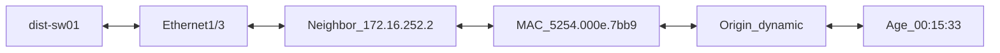
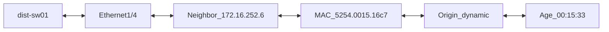
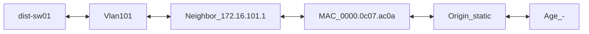
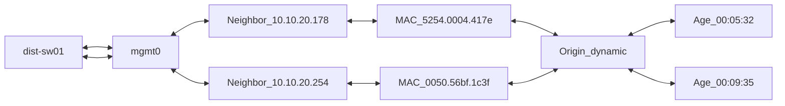

```mermaid
flowchart LR;
dist-sw01 <--> Ethernet1/3 <--> Neighbor_172.16.252.2 <--> MAC_5254.000e.7bb9 <--> Origin_dynamic <--> Age_00:15:33
```

```mermaid
flowchart LR;
dist-sw01 <--> Ethernet1/4 <--> Neighbor_172.16.252.6 <--> MAC_5254.0015.16c7 <--> Origin_dynamic <--> Age_00:15:33
```

```mermaid
flowchart LR;
dist-sw01 <--> Vlan101 <--> Neighbor_172.16.101.1 <--> MAC_0000.0c07.ac0a <--> Origin_static <--> Age_-
```

```mermaid
flowchart LR;
dist-sw01 <--> mgmt0 <--> Neighbor_10.10.20.178 <--> MAC_5254.0004.417e <--> Origin_dynamic <--> Age_00:05:32
dist-sw01 <--> mgmt0 <--> Neighbor_10.10.20.254 <--> MAC_0050.56bf.1c3f <--> Origin_dynamic <--> Age_00:09:35
```