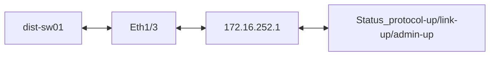
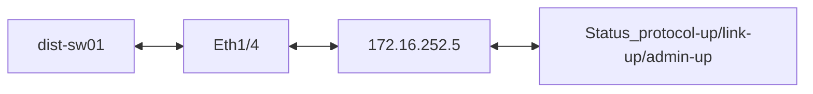
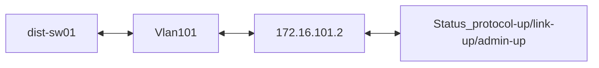
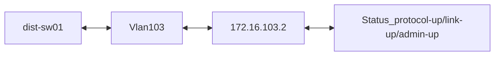
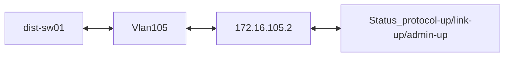

```mermaid
flowchart LR;
dist-sw01 <--> Eth1/3 <--> 172.16.252.1 <--> Status_protocol-up/link-up/admin-up
```

```mermaid
flowchart LR;
dist-sw01 <--> Eth1/4 <--> 172.16.252.5 <--> Status_protocol-up/link-up/admin-up
```

```mermaid
flowchart LR;
dist-sw01 <--> Vlan101 <--> 172.16.101.2 <--> Status_protocol-up/link-up/admin-up
```

```mermaid
flowchart LR;
dist-sw01 <--> Vlan102 <--> 172.16.102.2 <--> Status_protocol-up/link-up/admin-up
```

```mermaid
flowchart LR;
dist-sw01 <--> Vlan103 <--> 172.16.103.2 <--> Status_protocol-up/link-up/admin-up
```

```mermaid
flowchart LR;
dist-sw01 <--> Vlan104 <--> 172.16.104.2 <--> Status_protocol-up/link-up/admin-up
```

```mermaid
flowchart LR;
dist-sw01 <--> Vlan105 <--> 172.16.105.2 <--> Status_protocol-up/link-up/admin-up
```