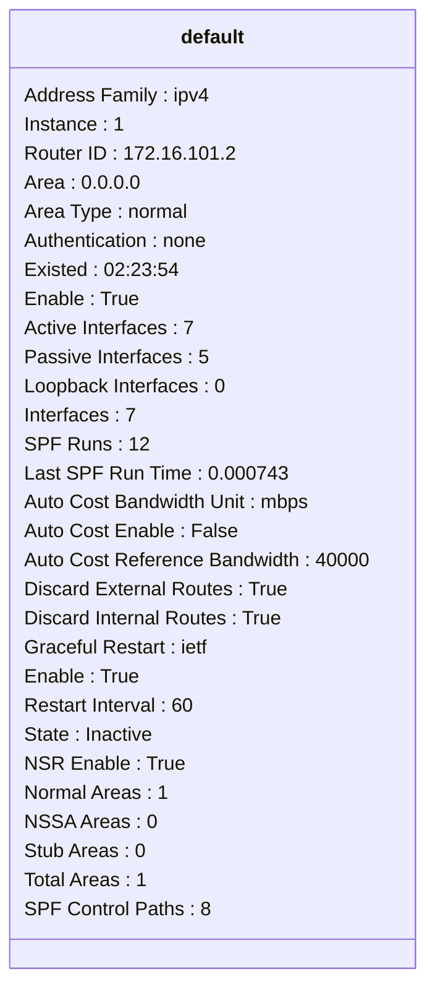

```mermaid
classDiagram
class default {
Address Family : ipv4
Instance : 1
Router ID : 172.16.101.2
Area : 0.0.0.0
Area Type : normal
Authentication : none
Existed : 02:23:54
Enable : True
Active Interfaces : 7
Passive Interfaces : 5
Loopback Interfaces : 0
Interfaces : 7
SPF Runs : 12
Last SPF Run Time : 0.000743
Auto Cost Bandwidth Unit : mbps
Auto Cost Enable : False
Auto Cost Reference Bandwidth : 40000
Discard External Routes : True
Discard Internal Routes : True
Graceful Restart : ietf
Enable : True
Restart Interval : 60
State : Inactive
NSR Enable : True
Normal Areas : 1
NSSA Areas : 0
Stub Areas : 0
Total Areas : 1
SPF Control Paths : 8
}
```