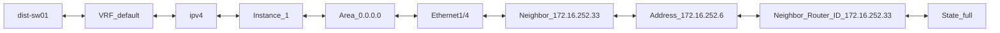

```mermaid
flowchart LR;
dist-sw01 <--> VRF_default <--> ipv4 <--> Instance_1 <--> Area_0.0.0.0 <--> Ethernet1/3 <--> Neighbor_172.16.252.25 <--> Address_172.16.252.2 <--> Neighbor_Router_ID_172.16.252.25 <--> State_full
```

```mermaid
flowchart LR;
dist-sw01 <--> VRF_default <--> ipv4 <--> Instance_1 <--> Area_0.0.0.0 <--> Ethernet1/4 <--> Neighbor_172.16.252.33 <--> Address_172.16.252.6 <--> Neighbor_Router_ID_172.16.252.33 <--> State_full
```