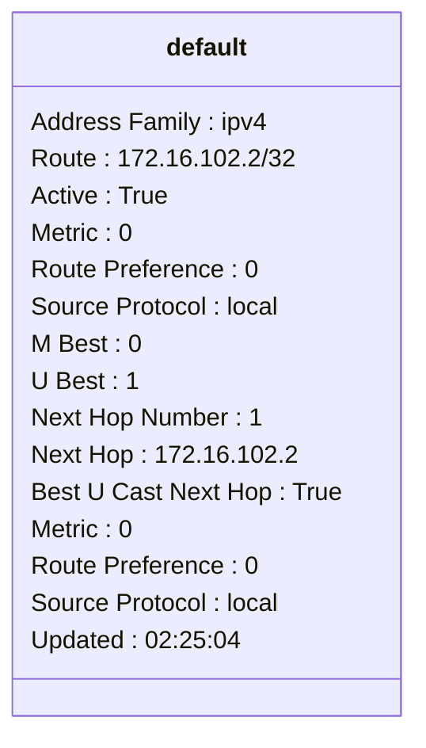
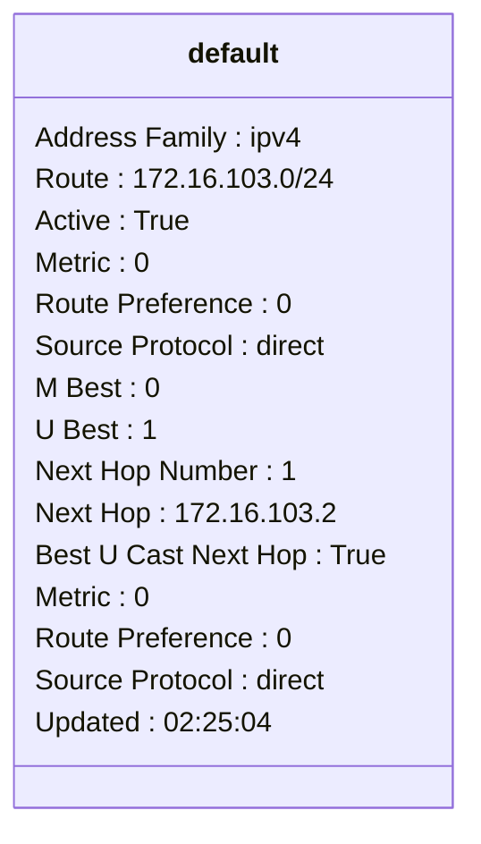
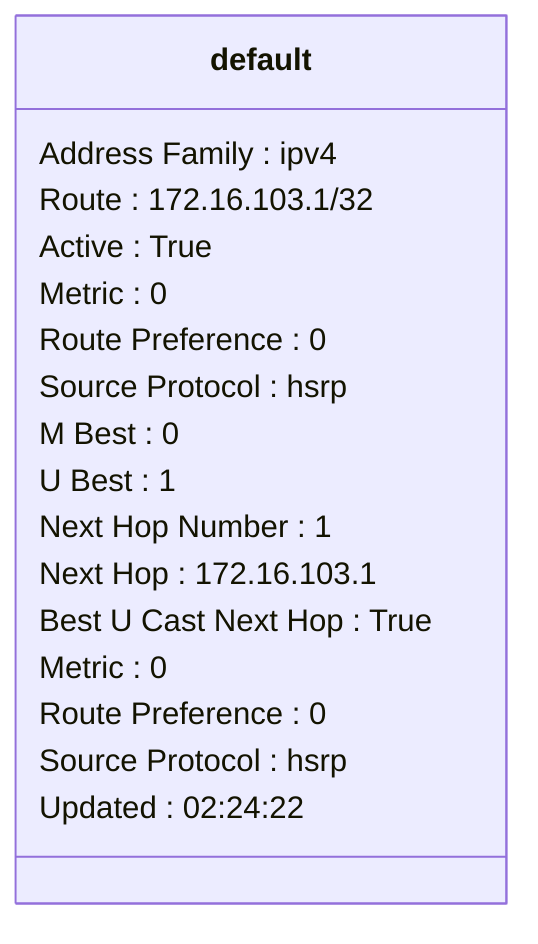
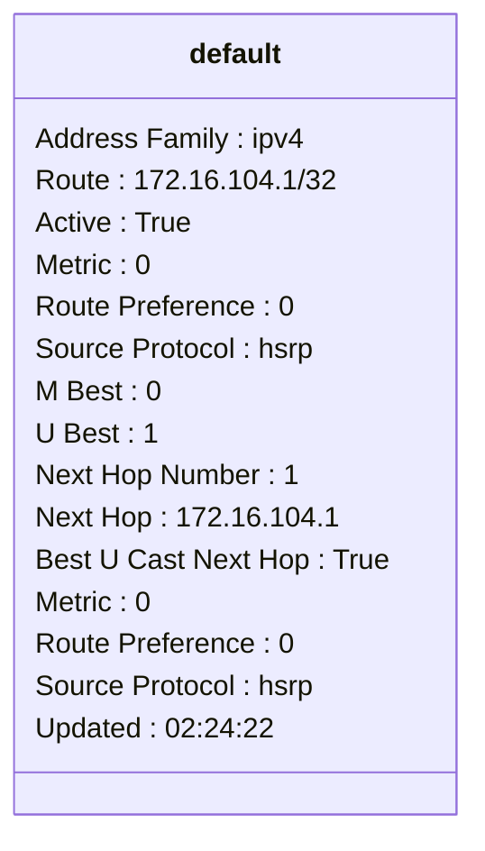
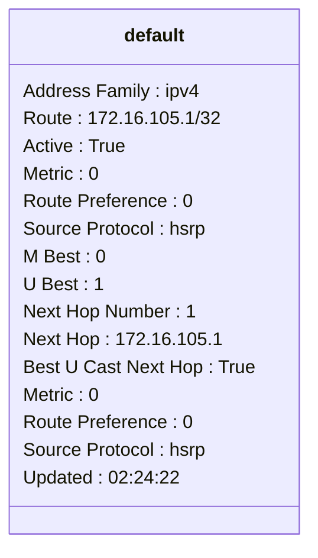
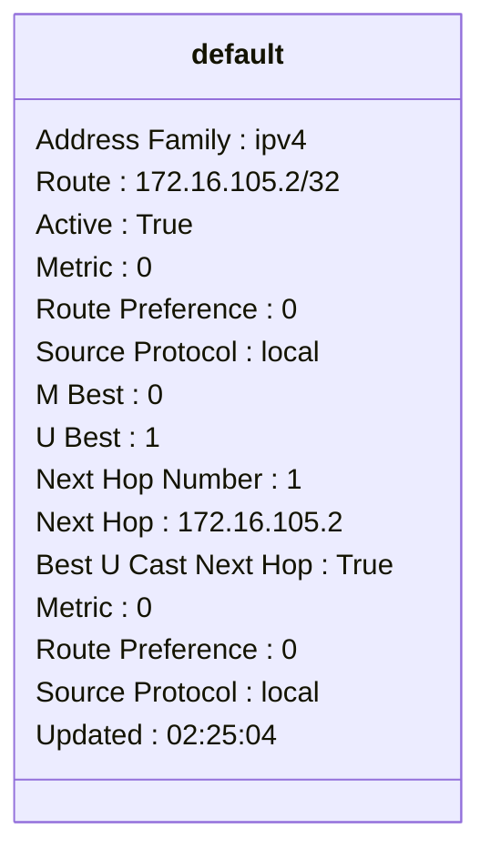
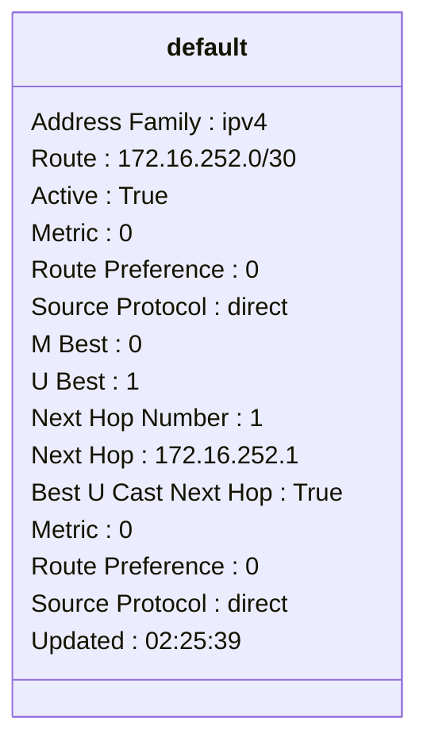
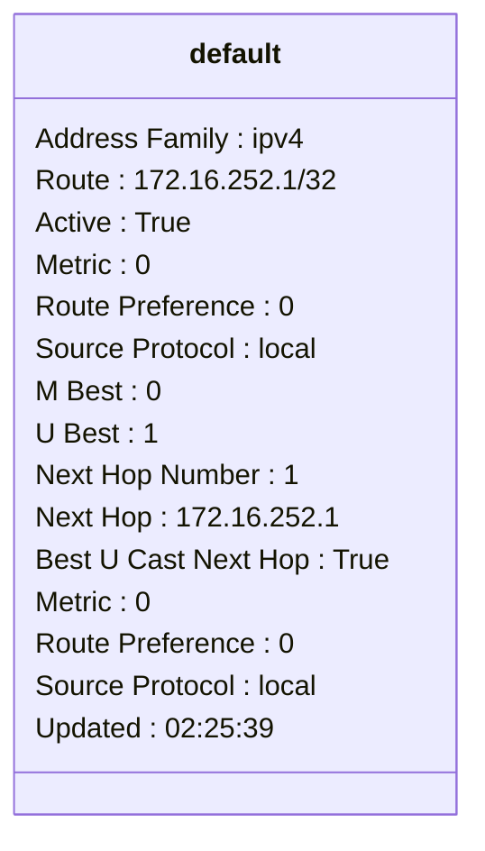
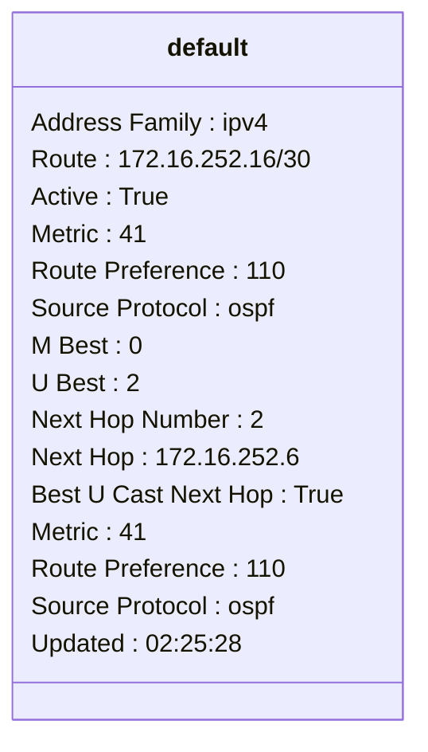

```mermaid
classDiagram
class default {
Address Family : ipv4
Route : 172.16.252.20/30
Active : True
Metric : 41
Route Preference : 110
Source Protocol : ospf
M Best : 0
U Best : 1
Next Hop Number : 1
Next Hop : 172.16.252.2
Best U Cast Next Hop : True
Metric : 41
Route Preference : 110
Source Protocol : ospf
Updated : 02:25:29
}
```
```mermaid
classDiagram
class default {
Address Family : ipv4
Route : 172.16.252.24/30
Active : True
Metric : 41
Route Preference : 110
Source Protocol : ospf
M Best : 0
U Best : 1
Next Hop Number : 1
Next Hop : 172.16.252.2
Best U Cast Next Hop : True
Metric : 41
Route Preference : 110
Source Protocol : ospf
Updated : 02:25:29
}
```
```mermaid
classDiagram
class default {
Address Family : ipv4
Route : 172.16.252.28/30
Active : True
Metric : 41
Route Preference : 110
Source Protocol : ospf
M Best : 0
U Best : 1
Next Hop Number : 1
Next Hop : 172.16.252.6
Best U Cast Next Hop : True
Metric : 41
Route Preference : 110
Source Protocol : ospf
Updated : 02:25:28
}
```
```mermaid
classDiagram
class default {
Address Family : ipv4
Route : 172.16.252.32/30
Active : True
Metric : 41
Route Preference : 110
Source Protocol : ospf
M Best : 0
U Best : 1
Next Hop Number : 1
Next Hop : 172.16.252.6
Best U Cast Next Hop : True
Metric : 41
Route Preference : 110
Source Protocol : ospf
Updated : 02:25:28
}
```
```mermaid
classDiagram
class default {
Address Family : ipv4
Route : 172.16.252.4/30
Active : True
Metric : 0
Route Preference : 0
Source Protocol : direct
M Best : 0
U Best : 1
Next Hop Number : 1
Next Hop : 172.16.252.5
Best U Cast Next Hop : True
Metric : 0
Route Preference : 0
Source Protocol : direct
Updated : 02:25:39
}
```
```mermaid
classDiagram
class default {
Address Family : ipv4
Route : 172.16.252.5/32
Active : True
Metric : 0
Route Preference : 0
Source Protocol : local
M Best : 0
U Best : 1
Next Hop Number : 1
Next Hop : 172.16.252.5
Best U Cast Next Hop : True
Metric : 0
Route Preference : 0
Source Protocol : local
Updated : 02:25:39
}
```
```mermaid
classDiagram
class default {
Address Family : ipv4
Route : 172.16.252.8/30
Active : True
Metric : 41
Route Preference : 110
Source Protocol : ospf
M Best : 0
U Best : 1
Next Hop Number : 1
Next Hop : 172.16.252.2
Best U Cast Next Hop : True
Metric : 41
Route Preference : 110
Source Protocol : ospf
Updated : 02:25:29
}
```
```mermaid
classDiagram
class management {
Address Family : ipv4
Route : 0.0.0.0/0
Active : True
Metric : 0
Route Preference : 1
Source Protocol : static
M Best : 0
U Best : 1
Next Hop Number : 1
Next Hop : 10.10.20.254
Best U Cast Next Hop : True
Metric : 0
Route Preference : 1
Source Protocol : static
Updated : 02:03:35
}
```
```mermaid
classDiagram
class management {
Address Family : ipv4
Route : 10.10.20.0/24
Active : True
Metric : 0
Route Preference : 0
Source Protocol : direct
M Best : 0
U Best : 1
Next Hop Number : 1
Next Hop : 10.10.20.177
Best U Cast Next Hop : True
Metric : 0
Route Preference : 0
Source Protocol : direct
Updated : 02:25:35
}
```
```mermaid
classDiagram
class management {
Address Family : ipv4
Route : 10.10.20.177/32
Active : True
Metric : 0
Route Preference : 0
Source Protocol : local
M Best : 0
U Best : 1
Next Hop Number : 1
Next Hop : 10.10.20.177
Best U Cast Next Hop : True
Metric : 0
Route Preference : 0
Source Protocol : local
Updated : 02:25:35
}
```