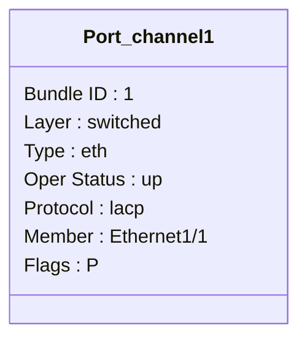
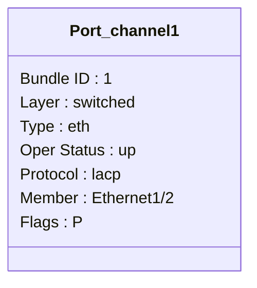

  

```mermaid
classDiagram
class Port_channel1 {
Bundle ID : 1
Layer : switched
Type : eth
Oper Status : up
Protocol : lacp
Member : Ethernet1/1
Flags : P
}
```  

```mermaid
classDiagram
class Port_channel1 {
Bundle ID : 1
Layer : switched
Type : eth
Oper Status : up
Protocol : lacp
Member : Ethernet1/2
Flags : P
}
```