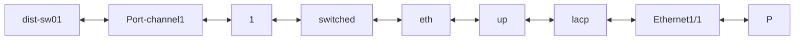

  

```mermaid
flowchart LR;
dist-sw01 <--> Port-channel1 <--> 1 <--> switched <--> eth <--> up <--> lacp <--> Ethernet1/1 <--> P
```  

```mermaid
flowchart LR;
dist-sw01 <--> Port-channel1 <--> 1 <--> switched <--> eth <--> up <--> lacp <--> Ethernet1/2 <--> P
```