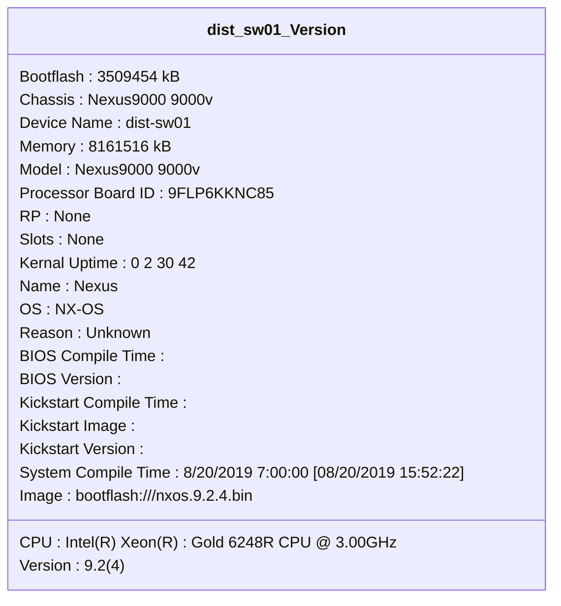

```mermaid
classDiagram
class dist_sw01_Version {
Bootflash : 3509454 kB
Chassis : Nexus9000 9000v
CPU : Intel(R) Xeon(R) Gold 6248R CPU @ 3.00GHz
Device Name : dist-sw01
Memory : 8161516 kB
Model : Nexus9000 9000v
Processor Board ID : 9FLP6KKNC85
RP : None
Slots : None
Kernal Uptime : 0 2 30 42
Name : Nexus
OS : NX-OS
Reason : Unknown
BIOS Compile Time : 
BIOS Version : 
Kickstart Compile Time : 
Kickstart Image : 
Kickstart Version : 
System Compile Time : 8/20/2019 7:00:00 [08/20/2019 15:52:22]
Image : bootflash:///nxos.9.2.4.bin
Version : 9.2(4)
}
```