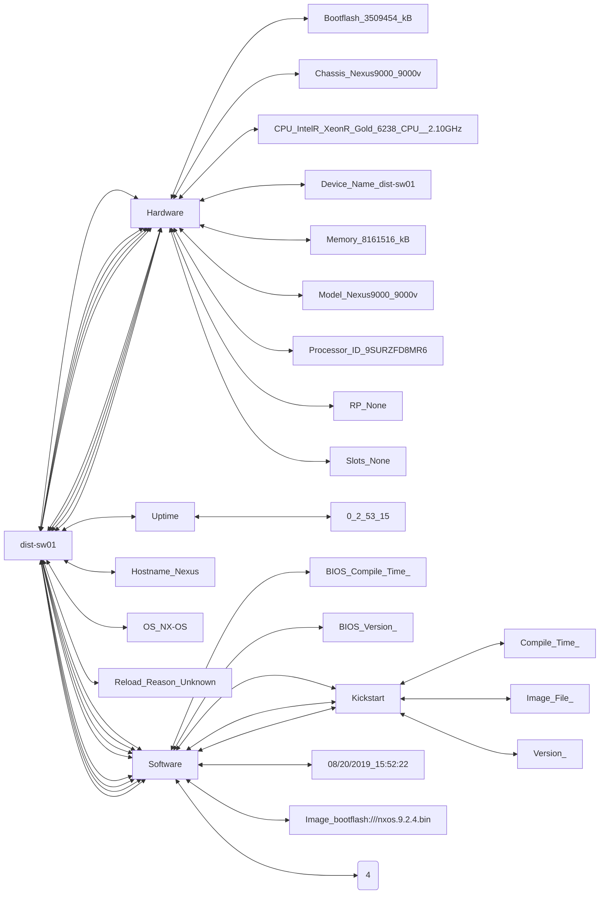

```mermaid
flowchart LR;
dist-sw01 <--> Hardware <--> Bootflash_3509454_kB
dist-sw01 <--> Hardware <--> Chassis_Nexus9000_9000v
dist-sw01 <--> Hardware <--> CPU_IntelR_XeonR_Gold_6238_CPU__2.10GHz
dist-sw01 <--> Hardware <--> Device_Name_dist-sw01
dist-sw01 <--> Hardware <--> Memory_8161516_kB
dist-sw01 <--> Hardware <--> Model_Nexus9000_9000v
dist-sw01 <--> Hardware <--> Processor_ID_9SURZFD8MR6
dist-sw01 <--> Hardware <--> RP_None
dist-sw01 <--> Hardware <--> Slots_None
dist-sw01 <--> Uptime <--> 0_2_53_15
dist-sw01 <--> Hostname_Nexus
dist-sw01 <--> OS_NX-OS
dist-sw01 <--> Reload_Reason_Unknown
dist-sw01 <--> Software <--> BIOS_Compile_Time_
dist-sw01 <--> Software <--> BIOS_Version_
dist-sw01 <--> Software <--> Kickstart <--> Compile_Time_
dist-sw01 <--> Software <--> Kickstart <--> Image_File_
dist-sw01 <--> Software <--> Kickstart <--> Version_
dist-sw01 <--> Software <--> System_Compile_Time_8/20/2019_7:00:00_[08/20/2019_15:52:22]
dist-sw01 <--> Software <--> Image_bootflash:///nxos.9.2.4.bin
dist-sw01 <--> Software <--> Version_9.2(4)
```