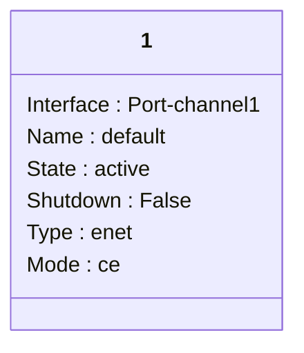
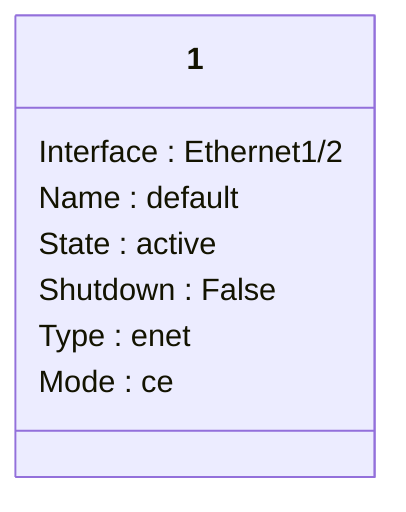
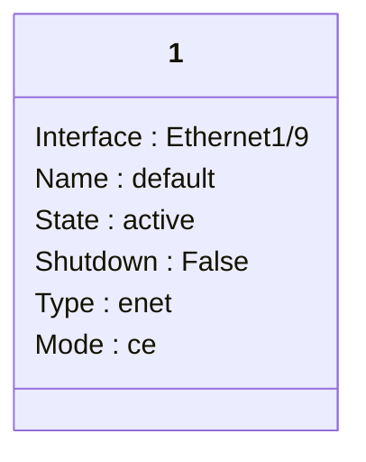
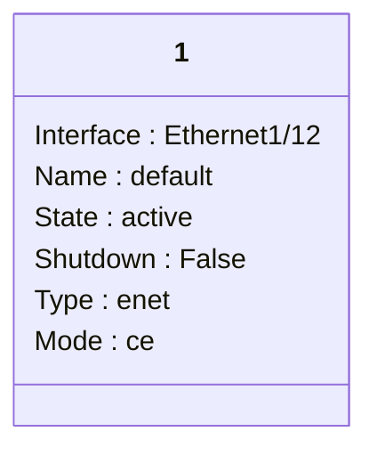
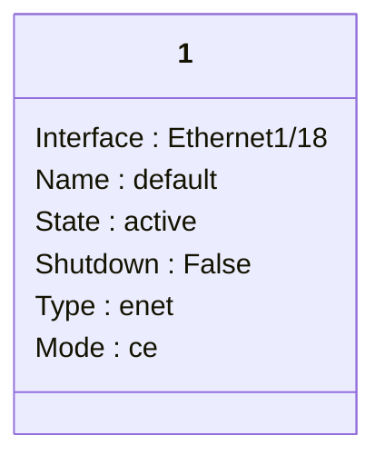

```mermaid
classDiagram
class 1 { 
Interface : Ethernet1/23
Name : default
State : active
Shutdown : False
Type : enet
Mode : ce
}
```
```mermaid
classDiagram
class 1 { 
Interface : Ethernet1/24
Name : default
State : active
Shutdown : False
Type : enet
Mode : ce
}
```
```mermaid
classDiagram
class 1 { 
Interface : Ethernet1/25
Name : default
State : active
Shutdown : False
Type : enet
Mode : ce
}
```
```mermaid
classDiagram
class 1 { 
Interface : Ethernet1/26
Name : default
State : active
Shutdown : False
Type : enet
Mode : ce
}
```
```mermaid
classDiagram
class 1 { 
Interface : Ethernet1/27
Name : default
State : active
Shutdown : False
Type : enet
Mode : ce
}
```
```mermaid
classDiagram
class 1 { 
Interface : Ethernet1/28
Name : default
State : active
Shutdown : False
Type : enet
Mode : ce
}
```
```mermaid
classDiagram
class 1 { 
Interface : Ethernet1/29
Name : default
State : active
Shutdown : False
Type : enet
Mode : ce
}
```
```mermaid
classDiagram
class 1 { 
Interface : Ethernet1/30
Name : default
State : active
Shutdown : False
Type : enet
Mode : ce
}
```
```mermaid
classDiagram
class 1 { 
Interface : Ethernet1/31
Name : default
State : active
Shutdown : False
Type : enet
Mode : ce
}
```
```mermaid
classDiagram
class 1 { 
Interface : Ethernet1/32
Name : default
State : active
Shutdown : False
Type : enet
Mode : ce
}
```
```mermaid
classDiagram
class 1 { 
Interface : Ethernet1/33
Name : default
State : active
Shutdown : False
Type : enet
Mode : ce
}
```
```mermaid
classDiagram
class 1 { 
Interface : Ethernet1/34
Name : default
State : active
Shutdown : False
Type : enet
Mode : ce
}
```
```mermaid
classDiagram
class 1 { 
Interface : Ethernet1/35
Name : default
State : active
Shutdown : False
Type : enet
Mode : ce
}
```
```mermaid
classDiagram
class 1 { 
Interface : Ethernet1/36
Name : default
State : active
Shutdown : False
Type : enet
Mode : ce
}
```
```mermaid
classDiagram
class 1 { 
Interface : Ethernet1/37
Name : default
State : active
Shutdown : False
Type : enet
Mode : ce
}
```
```mermaid
classDiagram
class 1 { 
Interface : Ethernet1/38
Name : default
State : active
Shutdown : False
Type : enet
Mode : ce
}
```
```mermaid
classDiagram
class 1 { 
Interface : Ethernet1/39
Name : default
State : active
Shutdown : False
Type : enet
Mode : ce
}
```
```mermaid
classDiagram
class 1 { 
Interface : Ethernet1/40
Name : default
State : active
Shutdown : False
Type : enet
Mode : ce
}
```
```mermaid
classDiagram
class 1 { 
Interface : Ethernet1/41
Name : default
State : active
Shutdown : False
Type : enet
Mode : ce
}
```
```mermaid
classDiagram
class 1 { 
Interface : Ethernet1/42
Name : default
State : active
Shutdown : False
Type : enet
Mode : ce
}
```
```mermaid
classDiagram
class 1 { 
Interface : Ethernet1/43
Name : default
State : active
Shutdown : False
Type : enet
Mode : ce
}
```
```mermaid
classDiagram
class 1 { 
Interface : Ethernet1/44
Name : default
State : active
Shutdown : False
Type : enet
Mode : ce
}
```
```mermaid
classDiagram
class 1 { 
Interface : Ethernet1/45
Name : default
State : active
Shutdown : False
Type : enet
Mode : ce
}
```
```mermaid
classDiagram
class 1 { 
Interface : Ethernet1/46
Name : default
State : active
Shutdown : False
Type : enet
Mode : ce
}
```
```mermaid
classDiagram
class 1 { 
Interface : Ethernet1/47
Name : default
State : active
Shutdown : False
Type : enet
Mode : ce
}
```
```mermaid
classDiagram
class 1 { 
Interface : Ethernet1/48
Name : default
State : active
Shutdown : False
Type : enet
Mode : ce
}
```
```mermaid
classDiagram
class 1 { 
Interface : Ethernet1/49
Name : default
State : active
Shutdown : False
Type : enet
Mode : ce
}
```
```mermaid
classDiagram
class 1 { 
Interface : Ethernet1/50
Name : default
State : active
Shutdown : False
Type : enet
Mode : ce
}
```
```mermaid
classDiagram
class 1 { 
Interface : Ethernet1/51
Name : default
State : active
Shutdown : False
Type : enet
Mode : ce
}
```
```mermaid
classDiagram
class 1 { 
Interface : Ethernet1/52
Name : default
State : active
Shutdown : False
Type : enet
Mode : ce
}
```
```mermaid
classDiagram
class 1 { 
Interface : Ethernet1/53
Name : default
State : active
Shutdown : False
Type : enet
Mode : ce
}
```
```mermaid
classDiagram
class 1 { 
Interface : Ethernet1/54
Name : default
State : active
Shutdown : False
Type : enet
Mode : ce
}
```
```mermaid
classDiagram
class 1 { 
Interface : Ethernet1/55
Name : default
State : active
Shutdown : False
Type : enet
Mode : ce
}
```
```mermaid
classDiagram
class 1 { 
Interface : Ethernet1/56
Name : default
State : active
Shutdown : False
Type : enet
Mode : ce
}
```
```mermaid
classDiagram
class 1 { 
Interface : Ethernet1/57
Name : default
State : active
Shutdown : False
Type : enet
Mode : ce
}
```
```mermaid
classDiagram
class 1 { 
Interface : Ethernet1/58
Name : default
State : active
Shutdown : False
Type : enet
Mode : ce
}
```
```mermaid
classDiagram
class 1 { 
Interface : Ethernet1/59
Name : default
State : active
Shutdown : False
Type : enet
Mode : ce
}
```
```mermaid
classDiagram
class 1 { 
Interface : Ethernet1/60
Name : default
State : active
Shutdown : False
Type : enet
Mode : ce
}
```
```mermaid
classDiagram
class 1 { 
Interface : Ethernet1/61
Name : default
State : active
Shutdown : False
Type : enet
Mode : ce
}
```
```mermaid
classDiagram
class 1 { 
Interface : Ethernet1/62
Name : default
State : active
Shutdown : False
Type : enet
Mode : ce
}
```
```mermaid
classDiagram
class 1 { 
Interface : Ethernet1/63
Name : default
State : active
Shutdown : False
Type : enet
Mode : ce
}
```
```mermaid
classDiagram
class 1 { 
Interface : Ethernet1/64
Name : default
State : active
Shutdown : False
Type : enet
Mode : ce
}
```
```mermaid
classDiagram
class 1 { 
Interface : Ethernet1/65
Name : default
State : active
Shutdown : False
Type : enet
Mode : ce
}
```
```mermaid
classDiagram
class 1 { 
Interface : Ethernet1/66
Name : default
State : active
Shutdown : False
Type : enet
Mode : ce
}
```
```mermaid
classDiagram
class 1 { 
Interface : Ethernet1/67
Name : default
State : active
Shutdown : False
Type : enet
Mode : ce
}
```
```mermaid
classDiagram
class 1 { 
Interface : Ethernet1/68
Name : default
State : active
Shutdown : False
Type : enet
Mode : ce
}
```
```mermaid
classDiagram
class 1 { 
Interface : Ethernet1/69
Name : default
State : active
Shutdown : False
Type : enet
Mode : ce
}
```
```mermaid
classDiagram
class 1 { 
Interface : Ethernet1/70
Name : default
State : active
Shutdown : False
Type : enet
Mode : ce
}
```
```mermaid
classDiagram
class 1 { 
Interface : Ethernet1/71
Name : default
State : active
Shutdown : False
Type : enet
Mode : ce
}
```
```mermaid
classDiagram
class 1 { 
Interface : Ethernet1/72
Name : default
State : active
Shutdown : False
Type : enet
Mode : ce
}
```
```mermaid
classDiagram
class 1 { 
Interface : Ethernet1/73
Name : default
State : active
Shutdown : False
Type : enet
Mode : ce
}
```
```mermaid
classDiagram
class 1 { 
Interface : Ethernet1/74
Name : default
State : active
Shutdown : False
Type : enet
Mode : ce
}
```
```mermaid
classDiagram
class 1 { 
Interface : Ethernet1/75
Name : default
State : active
Shutdown : False
Type : enet
Mode : ce
}
```
```mermaid
classDiagram
class 1 { 
Interface : Ethernet1/76
Name : default
State : active
Shutdown : False
Type : enet
Mode : ce
}
```
```mermaid
classDiagram
class 1 { 
Interface : Ethernet1/77
Name : default
State : active
Shutdown : False
Type : enet
Mode : ce
}
```
```mermaid
classDiagram
class 1 { 
Interface : Ethernet1/78
Name : default
State : active
Shutdown : False
Type : enet
Mode : ce
}
```
```mermaid
classDiagram
class 1 { 
Interface : Ethernet1/79
Name : default
State : active
Shutdown : False
Type : enet
Mode : ce
}
```
```mermaid
classDiagram
class 1 { 
Interface : Ethernet1/80
Name : default
State : active
Shutdown : False
Type : enet
Mode : ce
}
```
```mermaid
classDiagram
class 1 { 
Interface : Ethernet1/81
Name : default
State : active
Shutdown : False
Type : enet
Mode : ce
}
```
```mermaid
classDiagram
class 1 { 
Interface : Ethernet1/82
Name : default
State : active
Shutdown : False
Type : enet
Mode : ce
}
```
```mermaid
classDiagram
class 1 { 
Interface : Ethernet1/83
Name : default
State : active
Shutdown : False
Type : enet
Mode : ce
}
```
```mermaid
classDiagram
class 1 { 
Interface : Ethernet1/84
Name : default
State : active
Shutdown : False
Type : enet
Mode : ce
}
```
```mermaid
classDiagram
class 1 { 
Interface : Ethernet1/85
Name : default
State : active
Shutdown : False
Type : enet
Mode : ce
}
```
```mermaid
classDiagram
class 1 { 
Interface : Ethernet1/86
Name : default
State : active
Shutdown : False
Type : enet
Mode : ce
}
```
```mermaid
classDiagram
class 1 { 
Interface : Ethernet1/87
Name : default
State : active
Shutdown : False
Type : enet
Mode : ce
}
```
```mermaid
classDiagram
class 1 { 
Interface : Ethernet1/88
Name : default
State : active
Shutdown : False
Type : enet
Mode : ce
}
```
```mermaid
classDiagram
class 1 { 
Interface : Ethernet1/89
Name : default
State : active
Shutdown : False
Type : enet
Mode : ce
}
```
```mermaid
classDiagram
class 1 { 
Interface : Ethernet1/90
Name : default
State : active
Shutdown : False
Type : enet
Mode : ce
}
```
```mermaid
classDiagram
class 1 { 
Interface : Ethernet1/91
Name : default
State : active
Shutdown : False
Type : enet
Mode : ce
}
```
```mermaid
classDiagram
class 1 { 
Interface : Ethernet1/92
Name : default
State : active
Shutdown : False
Type : enet
Mode : ce
}
```
```mermaid
classDiagram
class 1 { 
Interface : Ethernet1/93
Name : default
State : active
Shutdown : False
Type : enet
Mode : ce
}
```
```mermaid
classDiagram
class 1 { 
Interface : Ethernet1/94
Name : default
State : active
Shutdown : False
Type : enet
Mode : ce
}
```
```mermaid
classDiagram
class 1 { 
Interface : Ethernet1/95
Name : default
State : active
Shutdown : False
Type : enet
Mode : ce
}
```
```mermaid
classDiagram
class 1 { 
Interface : Ethernet1/96
Name : default
State : active
Shutdown : False
Type : enet
Mode : ce
}
```
```mermaid
classDiagram
class 1 { 
Interface : Ethernet1/97
Name : default
State : active
Shutdown : False
Type : enet
Mode : ce
}
```
```mermaid
classDiagram
class 1 { 
Interface : Ethernet1/98
Name : default
State : active
Shutdown : False
Type : enet
Mode : ce
}
```
```mermaid
classDiagram
class 1 { 
Interface : Ethernet1/99
Name : default
State : active
Shutdown : False
Type : enet
Mode : ce
}
```
```mermaid
classDiagram
class 1 { 
Interface : Ethernet1/100
Name : default
State : active
Shutdown : False
Type : enet
Mode : ce
}
```
```mermaid
classDiagram
class 1 { 
Interface : Ethernet1/101
Name : default
State : active
Shutdown : False
Type : enet
Mode : ce
}
```
```mermaid
classDiagram
class 1 { 
Interface : Ethernet1/102
Name : default
State : active
Shutdown : False
Type : enet
Mode : ce
}
```
```mermaid
classDiagram
class 1 { 
Interface : Ethernet1/103
Name : default
State : active
Shutdown : False
Type : enet
Mode : ce
}
```
```mermaid
classDiagram
class 1 { 
Interface : Ethernet1/104
Name : default
State : active
Shutdown : False
Type : enet
Mode : ce
}
```
```mermaid
classDiagram
class 1 { 
Interface : Ethernet1/105
Name : default
State : active
Shutdown : False
Type : enet
Mode : ce
}
```
```mermaid
classDiagram
class 1 { 
Interface : Ethernet1/106
Name : default
State : active
Shutdown : False
Type : enet
Mode : ce
}
```
```mermaid
classDiagram
class 1 { 
Interface : Ethernet1/107
Name : default
State : active
Shutdown : False
Type : enet
Mode : ce
}
```
```mermaid
classDiagram
class 1 { 
Interface : Ethernet1/108
Name : default
State : active
Shutdown : False
Type : enet
Mode : ce
}
```
```mermaid
classDiagram
class 1 { 
Interface : Ethernet1/109
Name : default
State : active
Shutdown : False
Type : enet
Mode : ce
}
```
```mermaid
classDiagram
class 1 { 
Interface : Ethernet1/110
Name : default
State : active
Shutdown : False
Type : enet
Mode : ce
}
```
```mermaid
classDiagram
class 1 { 
Interface : Ethernet1/111
Name : default
State : active
Shutdown : False
Type : enet
Mode : ce
}
```
```mermaid
classDiagram
class 1 { 
Interface : Ethernet1/112
Name : default
State : active
Shutdown : False
Type : enet
Mode : ce
}
```
```mermaid
classDiagram
class 1 { 
Interface : Ethernet1/113
Name : default
State : active
Shutdown : False
Type : enet
Mode : ce
}
```
```mermaid
classDiagram
class 1 { 
Interface : Ethernet1/114
Name : default
State : active
Shutdown : False
Type : enet
Mode : ce
}
```
```mermaid
classDiagram
class 1 { 
Interface : Ethernet1/115
Name : default
State : active
Shutdown : False
Type : enet
Mode : ce
}
```
```mermaid
classDiagram
class 1 { 
Interface : Ethernet1/116
Name : default
State : active
Shutdown : False
Type : enet
Mode : ce
}
```
```mermaid
classDiagram
class 1 { 
Interface : Ethernet1/117
Name : default
State : active
Shutdown : False
Type : enet
Mode : ce
}
```
```mermaid
classDiagram
class 1 { 
Interface : Ethernet1/118
Name : default
State : active
Shutdown : False
Type : enet
Mode : ce
}
```
```mermaid
classDiagram
class 1 { 
Interface : Ethernet1/119
Name : default
State : active
Shutdown : False
Type : enet
Mode : ce
}
```
```mermaid
classDiagram
class 1 { 
Interface : Ethernet1/120
Name : default
State : active
Shutdown : False
Type : enet
Mode : ce
}
```
```mermaid
classDiagram
class 1 { 
Interface : Ethernet1/121
Name : default
State : active
Shutdown : False
Type : enet
Mode : ce
}
```
```mermaid
classDiagram
class 1 { 
Interface : Ethernet1/122
Name : default
State : active
Shutdown : False
Type : enet
Mode : ce
}
```
```mermaid
classDiagram
class 1 { 
Interface : Ethernet1/123
Name : default
State : active
Shutdown : False
Type : enet
Mode : ce
}
```
```mermaid
classDiagram
class 1 { 
Interface : Ethernet1/124
Name : default
State : active
Shutdown : False
Type : enet
Mode : ce
}
```
```mermaid
classDiagram
class 1 { 
Interface : Ethernet1/125
Name : default
State : active
Shutdown : False
Type : enet
Mode : ce
}
```
```mermaid
classDiagram
class 1 { 
Interface : Ethernet1/126
Name : default
State : active
Shutdown : False
Type : enet
Mode : ce
}
```
```mermaid
classDiagram
class 1 { 
Interface : Ethernet1/127
Name : default
State : active
Shutdown : False
Type : enet
Mode : ce
}
```
```mermaid
classDiagram
class 1 { 
Interface : Ethernet1/128
Name : default
State : active
Shutdown : False
Type : enet
Mode : ce
}
```
```mermaid
classDiagram
class 101 { 
Interface : Port-channel1
Name : prod
State : active
Shutdown : False
Type : enet
Mode : ce
}
```
```mermaid
classDiagram
class 101 { 
Interface : Ethernet1/1
Name : prod
State : active
Shutdown : False
Type : enet
Mode : ce
}
```
```mermaid
classDiagram
class 101 { 
Interface : Ethernet1/2
Name : prod
State : active
Shutdown : False
Type : enet
Mode : ce
}
```
```mermaid
classDiagram
class 101 { 
Interface : Ethernet1/11
Name : prod
State : active
Shutdown : False
Type : enet
Mode : ce
}
```
```mermaid
classDiagram
class 102 { 
Interface : Port-channel1
Name : dev
State : active
Shutdown : False
Type : enet
Mode : ce
}
```
```mermaid
classDiagram
class 102 { 
Interface : Ethernet1/1
Name : dev
State : active
Shutdown : False
Type : enet
Mode : ce
}
```
```mermaid
classDiagram
class 102 { 
Interface : Ethernet1/2
Name : dev
State : active
Shutdown : False
Type : enet
Mode : ce
}
```
```mermaid
classDiagram
class 103 { 
Interface : Port-channel1
Name : test
State : active
Shutdown : False
Type : enet
Mode : ce
}
```
```mermaid
classDiagram
class 103 { 
Interface : Ethernet1/1
Name : test
State : active
Shutdown : False
Type : enet
Mode : ce
}
```
```mermaid
classDiagram
class 103 { 
Interface : Ethernet1/2
Name : test
State : active
Shutdown : False
Type : enet
Mode : ce
}
```
```mermaid
classDiagram
class 104 { 
Interface : Port-channel1
Name : security
State : active
Shutdown : False
Type : enet
Mode : ce
}
```
```mermaid
classDiagram
class 104 { 
Interface : Ethernet1/1
Name : security
State : active
Shutdown : False
Type : enet
Mode : ce
}
```
```mermaid
classDiagram
class 104 { 
Interface : Ethernet1/2
Name : security
State : active
Shutdown : False
Type : enet
Mode : ce
}
```
```mermaid
classDiagram
class 105 { 
Interface : Port-channel1
Name : iot
State : active
Shutdown : False
Type : enet
Mode : ce
}
```
```mermaid
classDiagram
class 105 { 
Interface : Ethernet1/1
Name : iot
State : active
Shutdown : False
Type : enet
Mode : ce
}
```
```mermaid
classDiagram
class 105 { 
Interface : Ethernet1/2
Name : iot
State : active
Shutdown : False
Type : enet
Mode : ce
}
```