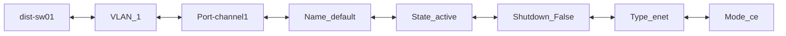
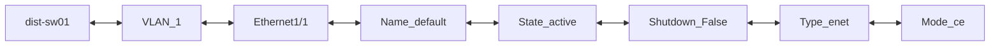
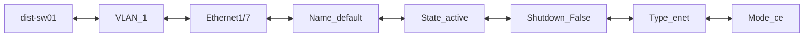
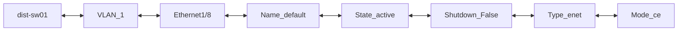
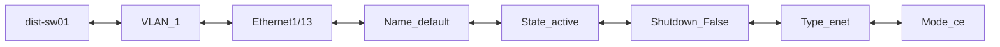
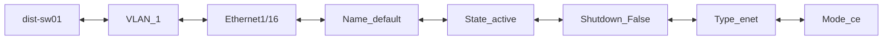
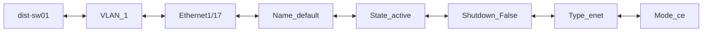

```mermaid
flowchart LR;
dist-sw01 <--> VLAN_1 <--> Ethernet1/23 <--> Name_default <--> State_active <--> Shutdown_False <--> Type_enet <--> Mode_ce
```
```mermaid
flowchart LR;
dist-sw01 <--> VLAN_1 <--> Ethernet1/24 <--> Name_default <--> State_active <--> Shutdown_False <--> Type_enet <--> Mode_ce
```
```mermaid
flowchart LR;
dist-sw01 <--> VLAN_1 <--> Ethernet1/25 <--> Name_default <--> State_active <--> Shutdown_False <--> Type_enet <--> Mode_ce
```
```mermaid
flowchart LR;
dist-sw01 <--> VLAN_1 <--> Ethernet1/26 <--> Name_default <--> State_active <--> Shutdown_False <--> Type_enet <--> Mode_ce
```
```mermaid
flowchart LR;
dist-sw01 <--> VLAN_1 <--> Ethernet1/27 <--> Name_default <--> State_active <--> Shutdown_False <--> Type_enet <--> Mode_ce
```
```mermaid
flowchart LR;
dist-sw01 <--> VLAN_1 <--> Ethernet1/28 <--> Name_default <--> State_active <--> Shutdown_False <--> Type_enet <--> Mode_ce
```
```mermaid
flowchart LR;
dist-sw01 <--> VLAN_1 <--> Ethernet1/29 <--> Name_default <--> State_active <--> Shutdown_False <--> Type_enet <--> Mode_ce
```
```mermaid
flowchart LR;
dist-sw01 <--> VLAN_1 <--> Ethernet1/30 <--> Name_default <--> State_active <--> Shutdown_False <--> Type_enet <--> Mode_ce
```
```mermaid
flowchart LR;
dist-sw01 <--> VLAN_1 <--> Ethernet1/31 <--> Name_default <--> State_active <--> Shutdown_False <--> Type_enet <--> Mode_ce
```
```mermaid
flowchart LR;
dist-sw01 <--> VLAN_1 <--> Ethernet1/32 <--> Name_default <--> State_active <--> Shutdown_False <--> Type_enet <--> Mode_ce
```
```mermaid
flowchart LR;
dist-sw01 <--> VLAN_1 <--> Ethernet1/33 <--> Name_default <--> State_active <--> Shutdown_False <--> Type_enet <--> Mode_ce
```
```mermaid
flowchart LR;
dist-sw01 <--> VLAN_1 <--> Ethernet1/34 <--> Name_default <--> State_active <--> Shutdown_False <--> Type_enet <--> Mode_ce
```
```mermaid
flowchart LR;
dist-sw01 <--> VLAN_1 <--> Ethernet1/35 <--> Name_default <--> State_active <--> Shutdown_False <--> Type_enet <--> Mode_ce
```
```mermaid
flowchart LR;
dist-sw01 <--> VLAN_1 <--> Ethernet1/36 <--> Name_default <--> State_active <--> Shutdown_False <--> Type_enet <--> Mode_ce
```
```mermaid
flowchart LR;
dist-sw01 <--> VLAN_1 <--> Ethernet1/37 <--> Name_default <--> State_active <--> Shutdown_False <--> Type_enet <--> Mode_ce
```
```mermaid
flowchart LR;
dist-sw01 <--> VLAN_1 <--> Ethernet1/38 <--> Name_default <--> State_active <--> Shutdown_False <--> Type_enet <--> Mode_ce
```
```mermaid
flowchart LR;
dist-sw01 <--> VLAN_1 <--> Ethernet1/39 <--> Name_default <--> State_active <--> Shutdown_False <--> Type_enet <--> Mode_ce
```
```mermaid
flowchart LR;
dist-sw01 <--> VLAN_1 <--> Ethernet1/40 <--> Name_default <--> State_active <--> Shutdown_False <--> Type_enet <--> Mode_ce
```
```mermaid
flowchart LR;
dist-sw01 <--> VLAN_1 <--> Ethernet1/41 <--> Name_default <--> State_active <--> Shutdown_False <--> Type_enet <--> Mode_ce
```
```mermaid
flowchart LR;
dist-sw01 <--> VLAN_1 <--> Ethernet1/42 <--> Name_default <--> State_active <--> Shutdown_False <--> Type_enet <--> Mode_ce
```
```mermaid
flowchart LR;
dist-sw01 <--> VLAN_1 <--> Ethernet1/43 <--> Name_default <--> State_active <--> Shutdown_False <--> Type_enet <--> Mode_ce
```
```mermaid
flowchart LR;
dist-sw01 <--> VLAN_1 <--> Ethernet1/44 <--> Name_default <--> State_active <--> Shutdown_False <--> Type_enet <--> Mode_ce
```
```mermaid
flowchart LR;
dist-sw01 <--> VLAN_1 <--> Ethernet1/45 <--> Name_default <--> State_active <--> Shutdown_False <--> Type_enet <--> Mode_ce
```
```mermaid
flowchart LR;
dist-sw01 <--> VLAN_1 <--> Ethernet1/46 <--> Name_default <--> State_active <--> Shutdown_False <--> Type_enet <--> Mode_ce
```
```mermaid
flowchart LR;
dist-sw01 <--> VLAN_1 <--> Ethernet1/47 <--> Name_default <--> State_active <--> Shutdown_False <--> Type_enet <--> Mode_ce
```
```mermaid
flowchart LR;
dist-sw01 <--> VLAN_1 <--> Ethernet1/48 <--> Name_default <--> State_active <--> Shutdown_False <--> Type_enet <--> Mode_ce
```
```mermaid
flowchart LR;
dist-sw01 <--> VLAN_1 <--> Ethernet1/49 <--> Name_default <--> State_active <--> Shutdown_False <--> Type_enet <--> Mode_ce
```
```mermaid
flowchart LR;
dist-sw01 <--> VLAN_1 <--> Ethernet1/50 <--> Name_default <--> State_active <--> Shutdown_False <--> Type_enet <--> Mode_ce
```
```mermaid
flowchart LR;
dist-sw01 <--> VLAN_1 <--> Ethernet1/51 <--> Name_default <--> State_active <--> Shutdown_False <--> Type_enet <--> Mode_ce
```
```mermaid
flowchart LR;
dist-sw01 <--> VLAN_1 <--> Ethernet1/52 <--> Name_default <--> State_active <--> Shutdown_False <--> Type_enet <--> Mode_ce
```
```mermaid
flowchart LR;
dist-sw01 <--> VLAN_1 <--> Ethernet1/53 <--> Name_default <--> State_active <--> Shutdown_False <--> Type_enet <--> Mode_ce
```
```mermaid
flowchart LR;
dist-sw01 <--> VLAN_1 <--> Ethernet1/54 <--> Name_default <--> State_active <--> Shutdown_False <--> Type_enet <--> Mode_ce
```
```mermaid
flowchart LR;
dist-sw01 <--> VLAN_1 <--> Ethernet1/55 <--> Name_default <--> State_active <--> Shutdown_False <--> Type_enet <--> Mode_ce
```
```mermaid
flowchart LR;
dist-sw01 <--> VLAN_1 <--> Ethernet1/56 <--> Name_default <--> State_active <--> Shutdown_False <--> Type_enet <--> Mode_ce
```
```mermaid
flowchart LR;
dist-sw01 <--> VLAN_1 <--> Ethernet1/57 <--> Name_default <--> State_active <--> Shutdown_False <--> Type_enet <--> Mode_ce
```
```mermaid
flowchart LR;
dist-sw01 <--> VLAN_1 <--> Ethernet1/58 <--> Name_default <--> State_active <--> Shutdown_False <--> Type_enet <--> Mode_ce
```
```mermaid
flowchart LR;
dist-sw01 <--> VLAN_1 <--> Ethernet1/59 <--> Name_default <--> State_active <--> Shutdown_False <--> Type_enet <--> Mode_ce
```
```mermaid
flowchart LR;
dist-sw01 <--> VLAN_1 <--> Ethernet1/60 <--> Name_default <--> State_active <--> Shutdown_False <--> Type_enet <--> Mode_ce
```
```mermaid
flowchart LR;
dist-sw01 <--> VLAN_1 <--> Ethernet1/61 <--> Name_default <--> State_active <--> Shutdown_False <--> Type_enet <--> Mode_ce
```
```mermaid
flowchart LR;
dist-sw01 <--> VLAN_1 <--> Ethernet1/62 <--> Name_default <--> State_active <--> Shutdown_False <--> Type_enet <--> Mode_ce
```
```mermaid
flowchart LR;
dist-sw01 <--> VLAN_1 <--> Ethernet1/63 <--> Name_default <--> State_active <--> Shutdown_False <--> Type_enet <--> Mode_ce
```
```mermaid
flowchart LR;
dist-sw01 <--> VLAN_1 <--> Ethernet1/64 <--> Name_default <--> State_active <--> Shutdown_False <--> Type_enet <--> Mode_ce
```
```mermaid
flowchart LR;
dist-sw01 <--> VLAN_1 <--> Ethernet1/65 <--> Name_default <--> State_active <--> Shutdown_False <--> Type_enet <--> Mode_ce
```
```mermaid
flowchart LR;
dist-sw01 <--> VLAN_1 <--> Ethernet1/66 <--> Name_default <--> State_active <--> Shutdown_False <--> Type_enet <--> Mode_ce
```
```mermaid
flowchart LR;
dist-sw01 <--> VLAN_1 <--> Ethernet1/67 <--> Name_default <--> State_active <--> Shutdown_False <--> Type_enet <--> Mode_ce
```
```mermaid
flowchart LR;
dist-sw01 <--> VLAN_1 <--> Ethernet1/68 <--> Name_default <--> State_active <--> Shutdown_False <--> Type_enet <--> Mode_ce
```
```mermaid
flowchart LR;
dist-sw01 <--> VLAN_1 <--> Ethernet1/69 <--> Name_default <--> State_active <--> Shutdown_False <--> Type_enet <--> Mode_ce
```
```mermaid
flowchart LR;
dist-sw01 <--> VLAN_1 <--> Ethernet1/70 <--> Name_default <--> State_active <--> Shutdown_False <--> Type_enet <--> Mode_ce
```
```mermaid
flowchart LR;
dist-sw01 <--> VLAN_1 <--> Ethernet1/71 <--> Name_default <--> State_active <--> Shutdown_False <--> Type_enet <--> Mode_ce
```
```mermaid
flowchart LR;
dist-sw01 <--> VLAN_1 <--> Ethernet1/72 <--> Name_default <--> State_active <--> Shutdown_False <--> Type_enet <--> Mode_ce
```
```mermaid
flowchart LR;
dist-sw01 <--> VLAN_1 <--> Ethernet1/73 <--> Name_default <--> State_active <--> Shutdown_False <--> Type_enet <--> Mode_ce
```
```mermaid
flowchart LR;
dist-sw01 <--> VLAN_1 <--> Ethernet1/74 <--> Name_default <--> State_active <--> Shutdown_False <--> Type_enet <--> Mode_ce
```
```mermaid
flowchart LR;
dist-sw01 <--> VLAN_1 <--> Ethernet1/75 <--> Name_default <--> State_active <--> Shutdown_False <--> Type_enet <--> Mode_ce
```
```mermaid
flowchart LR;
dist-sw01 <--> VLAN_1 <--> Ethernet1/76 <--> Name_default <--> State_active <--> Shutdown_False <--> Type_enet <--> Mode_ce
```
```mermaid
flowchart LR;
dist-sw01 <--> VLAN_1 <--> Ethernet1/77 <--> Name_default <--> State_active <--> Shutdown_False <--> Type_enet <--> Mode_ce
```
```mermaid
flowchart LR;
dist-sw01 <--> VLAN_1 <--> Ethernet1/78 <--> Name_default <--> State_active <--> Shutdown_False <--> Type_enet <--> Mode_ce
```
```mermaid
flowchart LR;
dist-sw01 <--> VLAN_1 <--> Ethernet1/79 <--> Name_default <--> State_active <--> Shutdown_False <--> Type_enet <--> Mode_ce
```
```mermaid
flowchart LR;
dist-sw01 <--> VLAN_1 <--> Ethernet1/80 <--> Name_default <--> State_active <--> Shutdown_False <--> Type_enet <--> Mode_ce
```
```mermaid
flowchart LR;
dist-sw01 <--> VLAN_1 <--> Ethernet1/81 <--> Name_default <--> State_active <--> Shutdown_False <--> Type_enet <--> Mode_ce
```
```mermaid
flowchart LR;
dist-sw01 <--> VLAN_1 <--> Ethernet1/82 <--> Name_default <--> State_active <--> Shutdown_False <--> Type_enet <--> Mode_ce
```
```mermaid
flowchart LR;
dist-sw01 <--> VLAN_1 <--> Ethernet1/83 <--> Name_default <--> State_active <--> Shutdown_False <--> Type_enet <--> Mode_ce
```
```mermaid
flowchart LR;
dist-sw01 <--> VLAN_1 <--> Ethernet1/84 <--> Name_default <--> State_active <--> Shutdown_False <--> Type_enet <--> Mode_ce
```
```mermaid
flowchart LR;
dist-sw01 <--> VLAN_1 <--> Ethernet1/85 <--> Name_default <--> State_active <--> Shutdown_False <--> Type_enet <--> Mode_ce
```
```mermaid
flowchart LR;
dist-sw01 <--> VLAN_1 <--> Ethernet1/86 <--> Name_default <--> State_active <--> Shutdown_False <--> Type_enet <--> Mode_ce
```
```mermaid
flowchart LR;
dist-sw01 <--> VLAN_1 <--> Ethernet1/87 <--> Name_default <--> State_active <--> Shutdown_False <--> Type_enet <--> Mode_ce
```
```mermaid
flowchart LR;
dist-sw01 <--> VLAN_1 <--> Ethernet1/88 <--> Name_default <--> State_active <--> Shutdown_False <--> Type_enet <--> Mode_ce
```
```mermaid
flowchart LR;
dist-sw01 <--> VLAN_1 <--> Ethernet1/89 <--> Name_default <--> State_active <--> Shutdown_False <--> Type_enet <--> Mode_ce
```
```mermaid
flowchart LR;
dist-sw01 <--> VLAN_1 <--> Ethernet1/90 <--> Name_default <--> State_active <--> Shutdown_False <--> Type_enet <--> Mode_ce
```
```mermaid
flowchart LR;
dist-sw01 <--> VLAN_1 <--> Ethernet1/91 <--> Name_default <--> State_active <--> Shutdown_False <--> Type_enet <--> Mode_ce
```
```mermaid
flowchart LR;
dist-sw01 <--> VLAN_1 <--> Ethernet1/92 <--> Name_default <--> State_active <--> Shutdown_False <--> Type_enet <--> Mode_ce
```
```mermaid
flowchart LR;
dist-sw01 <--> VLAN_1 <--> Ethernet1/93 <--> Name_default <--> State_active <--> Shutdown_False <--> Type_enet <--> Mode_ce
```
```mermaid
flowchart LR;
dist-sw01 <--> VLAN_1 <--> Ethernet1/94 <--> Name_default <--> State_active <--> Shutdown_False <--> Type_enet <--> Mode_ce
```
```mermaid
flowchart LR;
dist-sw01 <--> VLAN_1 <--> Ethernet1/95 <--> Name_default <--> State_active <--> Shutdown_False <--> Type_enet <--> Mode_ce
```
```mermaid
flowchart LR;
dist-sw01 <--> VLAN_1 <--> Ethernet1/96 <--> Name_default <--> State_active <--> Shutdown_False <--> Type_enet <--> Mode_ce
```
```mermaid
flowchart LR;
dist-sw01 <--> VLAN_1 <--> Ethernet1/97 <--> Name_default <--> State_active <--> Shutdown_False <--> Type_enet <--> Mode_ce
```
```mermaid
flowchart LR;
dist-sw01 <--> VLAN_1 <--> Ethernet1/98 <--> Name_default <--> State_active <--> Shutdown_False <--> Type_enet <--> Mode_ce
```
```mermaid
flowchart LR;
dist-sw01 <--> VLAN_1 <--> Ethernet1/99 <--> Name_default <--> State_active <--> Shutdown_False <--> Type_enet <--> Mode_ce
```
```mermaid
flowchart LR;
dist-sw01 <--> VLAN_1 <--> Ethernet1/100 <--> Name_default <--> State_active <--> Shutdown_False <--> Type_enet <--> Mode_ce
```
```mermaid
flowchart LR;
dist-sw01 <--> VLAN_1 <--> Ethernet1/101 <--> Name_default <--> State_active <--> Shutdown_False <--> Type_enet <--> Mode_ce
```
```mermaid
flowchart LR;
dist-sw01 <--> VLAN_1 <--> Ethernet1/102 <--> Name_default <--> State_active <--> Shutdown_False <--> Type_enet <--> Mode_ce
```
```mermaid
flowchart LR;
dist-sw01 <--> VLAN_1 <--> Ethernet1/103 <--> Name_default <--> State_active <--> Shutdown_False <--> Type_enet <--> Mode_ce
```
```mermaid
flowchart LR;
dist-sw01 <--> VLAN_1 <--> Ethernet1/104 <--> Name_default <--> State_active <--> Shutdown_False <--> Type_enet <--> Mode_ce
```
```mermaid
flowchart LR;
dist-sw01 <--> VLAN_1 <--> Ethernet1/105 <--> Name_default <--> State_active <--> Shutdown_False <--> Type_enet <--> Mode_ce
```
```mermaid
flowchart LR;
dist-sw01 <--> VLAN_1 <--> Ethernet1/106 <--> Name_default <--> State_active <--> Shutdown_False <--> Type_enet <--> Mode_ce
```
```mermaid
flowchart LR;
dist-sw01 <--> VLAN_1 <--> Ethernet1/107 <--> Name_default <--> State_active <--> Shutdown_False <--> Type_enet <--> Mode_ce
```
```mermaid
flowchart LR;
dist-sw01 <--> VLAN_1 <--> Ethernet1/108 <--> Name_default <--> State_active <--> Shutdown_False <--> Type_enet <--> Mode_ce
```
```mermaid
flowchart LR;
dist-sw01 <--> VLAN_1 <--> Ethernet1/109 <--> Name_default <--> State_active <--> Shutdown_False <--> Type_enet <--> Mode_ce
```
```mermaid
flowchart LR;
dist-sw01 <--> VLAN_1 <--> Ethernet1/110 <--> Name_default <--> State_active <--> Shutdown_False <--> Type_enet <--> Mode_ce
```
```mermaid
flowchart LR;
dist-sw01 <--> VLAN_1 <--> Ethernet1/111 <--> Name_default <--> State_active <--> Shutdown_False <--> Type_enet <--> Mode_ce
```
```mermaid
flowchart LR;
dist-sw01 <--> VLAN_1 <--> Ethernet1/112 <--> Name_default <--> State_active <--> Shutdown_False <--> Type_enet <--> Mode_ce
```
```mermaid
flowchart LR;
dist-sw01 <--> VLAN_1 <--> Ethernet1/113 <--> Name_default <--> State_active <--> Shutdown_False <--> Type_enet <--> Mode_ce
```
```mermaid
flowchart LR;
dist-sw01 <--> VLAN_1 <--> Ethernet1/114 <--> Name_default <--> State_active <--> Shutdown_False <--> Type_enet <--> Mode_ce
```
```mermaid
flowchart LR;
dist-sw01 <--> VLAN_1 <--> Ethernet1/115 <--> Name_default <--> State_active <--> Shutdown_False <--> Type_enet <--> Mode_ce
```
```mermaid
flowchart LR;
dist-sw01 <--> VLAN_1 <--> Ethernet1/116 <--> Name_default <--> State_active <--> Shutdown_False <--> Type_enet <--> Mode_ce
```
```mermaid
flowchart LR;
dist-sw01 <--> VLAN_1 <--> Ethernet1/117 <--> Name_default <--> State_active <--> Shutdown_False <--> Type_enet <--> Mode_ce
```
```mermaid
flowchart LR;
dist-sw01 <--> VLAN_1 <--> Ethernet1/118 <--> Name_default <--> State_active <--> Shutdown_False <--> Type_enet <--> Mode_ce
```
```mermaid
flowchart LR;
dist-sw01 <--> VLAN_1 <--> Ethernet1/119 <--> Name_default <--> State_active <--> Shutdown_False <--> Type_enet <--> Mode_ce
```
```mermaid
flowchart LR;
dist-sw01 <--> VLAN_1 <--> Ethernet1/120 <--> Name_default <--> State_active <--> Shutdown_False <--> Type_enet <--> Mode_ce
```
```mermaid
flowchart LR;
dist-sw01 <--> VLAN_1 <--> Ethernet1/121 <--> Name_default <--> State_active <--> Shutdown_False <--> Type_enet <--> Mode_ce
```
```mermaid
flowchart LR;
dist-sw01 <--> VLAN_1 <--> Ethernet1/122 <--> Name_default <--> State_active <--> Shutdown_False <--> Type_enet <--> Mode_ce
```
```mermaid
flowchart LR;
dist-sw01 <--> VLAN_1 <--> Ethernet1/123 <--> Name_default <--> State_active <--> Shutdown_False <--> Type_enet <--> Mode_ce
```
```mermaid
flowchart LR;
dist-sw01 <--> VLAN_1 <--> Ethernet1/124 <--> Name_default <--> State_active <--> Shutdown_False <--> Type_enet <--> Mode_ce
```
```mermaid
flowchart LR;
dist-sw01 <--> VLAN_1 <--> Ethernet1/125 <--> Name_default <--> State_active <--> Shutdown_False <--> Type_enet <--> Mode_ce
```
```mermaid
flowchart LR;
dist-sw01 <--> VLAN_1 <--> Ethernet1/126 <--> Name_default <--> State_active <--> Shutdown_False <--> Type_enet <--> Mode_ce
```
```mermaid
flowchart LR;
dist-sw01 <--> VLAN_1 <--> Ethernet1/127 <--> Name_default <--> State_active <--> Shutdown_False <--> Type_enet <--> Mode_ce
```
```mermaid
flowchart LR;
dist-sw01 <--> VLAN_1 <--> Ethernet1/128 <--> Name_default <--> State_active <--> Shutdown_False <--> Type_enet <--> Mode_ce
```
```mermaid
flowchart LR;
dist-sw01 <--> VLAN_101 <--> Port-channel1 <--> Name_prod <--> State_active <--> Shutdown_False <--> Type_enet <--> Mode_ce
```
```mermaid
flowchart LR;
dist-sw01 <--> VLAN_101 <--> Ethernet1/1 <--> Name_prod <--> State_active <--> Shutdown_False <--> Type_enet <--> Mode_ce
```
```mermaid
flowchart LR;
dist-sw01 <--> VLAN_101 <--> Ethernet1/2 <--> Name_prod <--> State_active <--> Shutdown_False <--> Type_enet <--> Mode_ce
```
```mermaid
flowchart LR;
dist-sw01 <--> VLAN_101 <--> Ethernet1/11 <--> Name_prod <--> State_active <--> Shutdown_False <--> Type_enet <--> Mode_ce
```
```mermaid
flowchart LR;
dist-sw01 <--> VLAN_102 <--> Port-channel1 <--> Name_dev <--> State_active <--> Shutdown_False <--> Type_enet <--> Mode_ce
```
```mermaid
flowchart LR;
dist-sw01 <--> VLAN_102 <--> Ethernet1/1 <--> Name_dev <--> State_active <--> Shutdown_False <--> Type_enet <--> Mode_ce
```
```mermaid
flowchart LR;
dist-sw01 <--> VLAN_102 <--> Ethernet1/2 <--> Name_dev <--> State_active <--> Shutdown_False <--> Type_enet <--> Mode_ce
```
```mermaid
flowchart LR;
dist-sw01 <--> VLAN_103 <--> Port-channel1 <--> Name_test <--> State_active <--> Shutdown_False <--> Type_enet <--> Mode_ce
```
```mermaid
flowchart LR;
dist-sw01 <--> VLAN_103 <--> Ethernet1/1 <--> Name_test <--> State_active <--> Shutdown_False <--> Type_enet <--> Mode_ce
```
```mermaid
flowchart LR;
dist-sw01 <--> VLAN_103 <--> Ethernet1/2 <--> Name_test <--> State_active <--> Shutdown_False <--> Type_enet <--> Mode_ce
```
```mermaid
flowchart LR;
dist-sw01 <--> VLAN_104 <--> Port-channel1 <--> Name_security <--> State_active <--> Shutdown_False <--> Type_enet <--> Mode_ce
```
```mermaid
flowchart LR;
dist-sw01 <--> VLAN_104 <--> Ethernet1/1 <--> Name_security <--> State_active <--> Shutdown_False <--> Type_enet <--> Mode_ce
```
```mermaid
flowchart LR;
dist-sw01 <--> VLAN_104 <--> Ethernet1/2 <--> Name_security <--> State_active <--> Shutdown_False <--> Type_enet <--> Mode_ce
```
```mermaid
flowchart LR;
dist-sw01 <--> VLAN_105 <--> Port-channel1 <--> Name_iot <--> State_active <--> Shutdown_False <--> Type_enet <--> Mode_ce
```
```mermaid
flowchart LR;
dist-sw01 <--> VLAN_105 <--> Ethernet1/1 <--> Name_iot <--> State_active <--> Shutdown_False <--> Type_enet <--> Mode_ce
```
```mermaid
flowchart LR;
dist-sw01 <--> VLAN_105 <--> Ethernet1/2 <--> Name_iot <--> State_active <--> Shutdown_False <--> Type_enet <--> Mode_ce
```