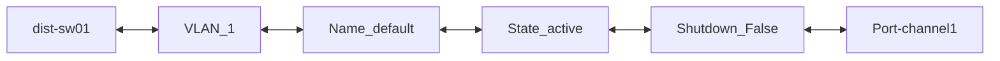
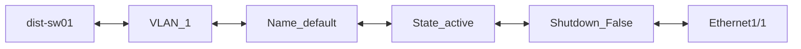
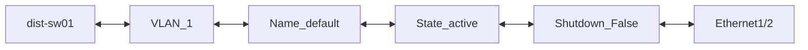
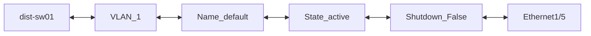
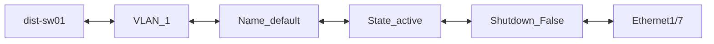
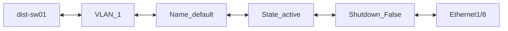
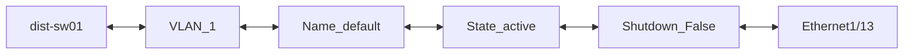
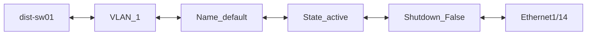

```mermaid
flowchart LR;
dist-sw01 <--> VLAN_1 <--> Name_default <--> State_active <--> Shutdown_False <--> Ethernet1/23
```
```mermaid
flowchart LR;
dist-sw01 <--> VLAN_1 <--> Name_default <--> State_active <--> Shutdown_False <--> Ethernet1/24
```
```mermaid
flowchart LR;
dist-sw01 <--> VLAN_1 <--> Name_default <--> State_active <--> Shutdown_False <--> Ethernet1/25
```
```mermaid
flowchart LR;
dist-sw01 <--> VLAN_1 <--> Name_default <--> State_active <--> Shutdown_False <--> Ethernet1/26
```
```mermaid
flowchart LR;
dist-sw01 <--> VLAN_1 <--> Name_default <--> State_active <--> Shutdown_False <--> Ethernet1/27
```
```mermaid
flowchart LR;
dist-sw01 <--> VLAN_1 <--> Name_default <--> State_active <--> Shutdown_False <--> Ethernet1/28
```
```mermaid
flowchart LR;
dist-sw01 <--> VLAN_1 <--> Name_default <--> State_active <--> Shutdown_False <--> Ethernet1/29
```
```mermaid
flowchart LR;
dist-sw01 <--> VLAN_1 <--> Name_default <--> State_active <--> Shutdown_False <--> Ethernet1/30
```
```mermaid
flowchart LR;
dist-sw01 <--> VLAN_1 <--> Name_default <--> State_active <--> Shutdown_False <--> Ethernet1/31
```
```mermaid
flowchart LR;
dist-sw01 <--> VLAN_1 <--> Name_default <--> State_active <--> Shutdown_False <--> Ethernet1/32
```
```mermaid
flowchart LR;
dist-sw01 <--> VLAN_1 <--> Name_default <--> State_active <--> Shutdown_False <--> Ethernet1/33
```
```mermaid
flowchart LR;
dist-sw01 <--> VLAN_1 <--> Name_default <--> State_active <--> Shutdown_False <--> Ethernet1/34
```
```mermaid
flowchart LR;
dist-sw01 <--> VLAN_1 <--> Name_default <--> State_active <--> Shutdown_False <--> Ethernet1/35
```
```mermaid
flowchart LR;
dist-sw01 <--> VLAN_1 <--> Name_default <--> State_active <--> Shutdown_False <--> Ethernet1/36
```
```mermaid
flowchart LR;
dist-sw01 <--> VLAN_1 <--> Name_default <--> State_active <--> Shutdown_False <--> Ethernet1/37
```
```mermaid
flowchart LR;
dist-sw01 <--> VLAN_1 <--> Name_default <--> State_active <--> Shutdown_False <--> Ethernet1/38
```
```mermaid
flowchart LR;
dist-sw01 <--> VLAN_1 <--> Name_default <--> State_active <--> Shutdown_False <--> Ethernet1/39
```
```mermaid
flowchart LR;
dist-sw01 <--> VLAN_1 <--> Name_default <--> State_active <--> Shutdown_False <--> Ethernet1/40
```
```mermaid
flowchart LR;
dist-sw01 <--> VLAN_1 <--> Name_default <--> State_active <--> Shutdown_False <--> Ethernet1/41
```
```mermaid
flowchart LR;
dist-sw01 <--> VLAN_1 <--> Name_default <--> State_active <--> Shutdown_False <--> Ethernet1/42
```
```mermaid
flowchart LR;
dist-sw01 <--> VLAN_1 <--> Name_default <--> State_active <--> Shutdown_False <--> Ethernet1/43
```
```mermaid
flowchart LR;
dist-sw01 <--> VLAN_1 <--> Name_default <--> State_active <--> Shutdown_False <--> Ethernet1/44
```
```mermaid
flowchart LR;
dist-sw01 <--> VLAN_1 <--> Name_default <--> State_active <--> Shutdown_False <--> Ethernet1/45
```
```mermaid
flowchart LR;
dist-sw01 <--> VLAN_1 <--> Name_default <--> State_active <--> Shutdown_False <--> Ethernet1/46
```
```mermaid
flowchart LR;
dist-sw01 <--> VLAN_1 <--> Name_default <--> State_active <--> Shutdown_False <--> Ethernet1/47
```
```mermaid
flowchart LR;
dist-sw01 <--> VLAN_1 <--> Name_default <--> State_active <--> Shutdown_False <--> Ethernet1/48
```
```mermaid
flowchart LR;
dist-sw01 <--> VLAN_1 <--> Name_default <--> State_active <--> Shutdown_False <--> Ethernet1/49
```
```mermaid
flowchart LR;
dist-sw01 <--> VLAN_1 <--> Name_default <--> State_active <--> Shutdown_False <--> Ethernet1/50
```
```mermaid
flowchart LR;
dist-sw01 <--> VLAN_1 <--> Name_default <--> State_active <--> Shutdown_False <--> Ethernet1/51
```
```mermaid
flowchart LR;
dist-sw01 <--> VLAN_1 <--> Name_default <--> State_active <--> Shutdown_False <--> Ethernet1/52
```
```mermaid
flowchart LR;
dist-sw01 <--> VLAN_1 <--> Name_default <--> State_active <--> Shutdown_False <--> Ethernet1/53
```
```mermaid
flowchart LR;
dist-sw01 <--> VLAN_1 <--> Name_default <--> State_active <--> Shutdown_False <--> Ethernet1/54
```
```mermaid
flowchart LR;
dist-sw01 <--> VLAN_1 <--> Name_default <--> State_active <--> Shutdown_False <--> Ethernet1/55
```
```mermaid
flowchart LR;
dist-sw01 <--> VLAN_1 <--> Name_default <--> State_active <--> Shutdown_False <--> Ethernet1/56
```
```mermaid
flowchart LR;
dist-sw01 <--> VLAN_1 <--> Name_default <--> State_active <--> Shutdown_False <--> Ethernet1/57
```
```mermaid
flowchart LR;
dist-sw01 <--> VLAN_1 <--> Name_default <--> State_active <--> Shutdown_False <--> Ethernet1/58
```
```mermaid
flowchart LR;
dist-sw01 <--> VLAN_1 <--> Name_default <--> State_active <--> Shutdown_False <--> Ethernet1/59
```
```mermaid
flowchart LR;
dist-sw01 <--> VLAN_1 <--> Name_default <--> State_active <--> Shutdown_False <--> Ethernet1/60
```
```mermaid
flowchart LR;
dist-sw01 <--> VLAN_1 <--> Name_default <--> State_active <--> Shutdown_False <--> Ethernet1/61
```
```mermaid
flowchart LR;
dist-sw01 <--> VLAN_1 <--> Name_default <--> State_active <--> Shutdown_False <--> Ethernet1/62
```
```mermaid
flowchart LR;
dist-sw01 <--> VLAN_1 <--> Name_default <--> State_active <--> Shutdown_False <--> Ethernet1/63
```
```mermaid
flowchart LR;
dist-sw01 <--> VLAN_1 <--> Name_default <--> State_active <--> Shutdown_False <--> Ethernet1/64
```
```mermaid
flowchart LR;
dist-sw01 <--> VLAN_1 <--> Name_default <--> State_active <--> Shutdown_False <--> Ethernet1/65
```
```mermaid
flowchart LR;
dist-sw01 <--> VLAN_1 <--> Name_default <--> State_active <--> Shutdown_False <--> Ethernet1/66
```
```mermaid
flowchart LR;
dist-sw01 <--> VLAN_1 <--> Name_default <--> State_active <--> Shutdown_False <--> Ethernet1/67
```
```mermaid
flowchart LR;
dist-sw01 <--> VLAN_1 <--> Name_default <--> State_active <--> Shutdown_False <--> Ethernet1/68
```
```mermaid
flowchart LR;
dist-sw01 <--> VLAN_1 <--> Name_default <--> State_active <--> Shutdown_False <--> Ethernet1/69
```
```mermaid
flowchart LR;
dist-sw01 <--> VLAN_1 <--> Name_default <--> State_active <--> Shutdown_False <--> Ethernet1/70
```
```mermaid
flowchart LR;
dist-sw01 <--> VLAN_1 <--> Name_default <--> State_active <--> Shutdown_False <--> Ethernet1/71
```
```mermaid
flowchart LR;
dist-sw01 <--> VLAN_1 <--> Name_default <--> State_active <--> Shutdown_False <--> Ethernet1/72
```
```mermaid
flowchart LR;
dist-sw01 <--> VLAN_1 <--> Name_default <--> State_active <--> Shutdown_False <--> Ethernet1/73
```
```mermaid
flowchart LR;
dist-sw01 <--> VLAN_1 <--> Name_default <--> State_active <--> Shutdown_False <--> Ethernet1/74
```
```mermaid
flowchart LR;
dist-sw01 <--> VLAN_1 <--> Name_default <--> State_active <--> Shutdown_False <--> Ethernet1/75
```
```mermaid
flowchart LR;
dist-sw01 <--> VLAN_1 <--> Name_default <--> State_active <--> Shutdown_False <--> Ethernet1/76
```
```mermaid
flowchart LR;
dist-sw01 <--> VLAN_1 <--> Name_default <--> State_active <--> Shutdown_False <--> Ethernet1/77
```
```mermaid
flowchart LR;
dist-sw01 <--> VLAN_1 <--> Name_default <--> State_active <--> Shutdown_False <--> Ethernet1/78
```
```mermaid
flowchart LR;
dist-sw01 <--> VLAN_1 <--> Name_default <--> State_active <--> Shutdown_False <--> Ethernet1/79
```
```mermaid
flowchart LR;
dist-sw01 <--> VLAN_1 <--> Name_default <--> State_active <--> Shutdown_False <--> Ethernet1/80
```
```mermaid
flowchart LR;
dist-sw01 <--> VLAN_1 <--> Name_default <--> State_active <--> Shutdown_False <--> Ethernet1/81
```
```mermaid
flowchart LR;
dist-sw01 <--> VLAN_1 <--> Name_default <--> State_active <--> Shutdown_False <--> Ethernet1/82
```
```mermaid
flowchart LR;
dist-sw01 <--> VLAN_1 <--> Name_default <--> State_active <--> Shutdown_False <--> Ethernet1/83
```
```mermaid
flowchart LR;
dist-sw01 <--> VLAN_1 <--> Name_default <--> State_active <--> Shutdown_False <--> Ethernet1/84
```
```mermaid
flowchart LR;
dist-sw01 <--> VLAN_1 <--> Name_default <--> State_active <--> Shutdown_False <--> Ethernet1/85
```
```mermaid
flowchart LR;
dist-sw01 <--> VLAN_1 <--> Name_default <--> State_active <--> Shutdown_False <--> Ethernet1/86
```
```mermaid
flowchart LR;
dist-sw01 <--> VLAN_1 <--> Name_default <--> State_active <--> Shutdown_False <--> Ethernet1/87
```
```mermaid
flowchart LR;
dist-sw01 <--> VLAN_1 <--> Name_default <--> State_active <--> Shutdown_False <--> Ethernet1/88
```
```mermaid
flowchart LR;
dist-sw01 <--> VLAN_1 <--> Name_default <--> State_active <--> Shutdown_False <--> Ethernet1/89
```
```mermaid
flowchart LR;
dist-sw01 <--> VLAN_1 <--> Name_default <--> State_active <--> Shutdown_False <--> Ethernet1/90
```
```mermaid
flowchart LR;
dist-sw01 <--> VLAN_1 <--> Name_default <--> State_active <--> Shutdown_False <--> Ethernet1/91
```
```mermaid
flowchart LR;
dist-sw01 <--> VLAN_1 <--> Name_default <--> State_active <--> Shutdown_False <--> Ethernet1/92
```
```mermaid
flowchart LR;
dist-sw01 <--> VLAN_1 <--> Name_default <--> State_active <--> Shutdown_False <--> Ethernet1/93
```
```mermaid
flowchart LR;
dist-sw01 <--> VLAN_1 <--> Name_default <--> State_active <--> Shutdown_False <--> Ethernet1/94
```
```mermaid
flowchart LR;
dist-sw01 <--> VLAN_1 <--> Name_default <--> State_active <--> Shutdown_False <--> Ethernet1/95
```
```mermaid
flowchart LR;
dist-sw01 <--> VLAN_1 <--> Name_default <--> State_active <--> Shutdown_False <--> Ethernet1/96
```
```mermaid
flowchart LR;
dist-sw01 <--> VLAN_1 <--> Name_default <--> State_active <--> Shutdown_False <--> Ethernet1/97
```
```mermaid
flowchart LR;
dist-sw01 <--> VLAN_1 <--> Name_default <--> State_active <--> Shutdown_False <--> Ethernet1/98
```
```mermaid
flowchart LR;
dist-sw01 <--> VLAN_1 <--> Name_default <--> State_active <--> Shutdown_False <--> Ethernet1/99
```
```mermaid
flowchart LR;
dist-sw01 <--> VLAN_1 <--> Name_default <--> State_active <--> Shutdown_False <--> Ethernet1/100
```
```mermaid
flowchart LR;
dist-sw01 <--> VLAN_1 <--> Name_default <--> State_active <--> Shutdown_False <--> Ethernet1/101
```
```mermaid
flowchart LR;
dist-sw01 <--> VLAN_1 <--> Name_default <--> State_active <--> Shutdown_False <--> Ethernet1/102
```
```mermaid
flowchart LR;
dist-sw01 <--> VLAN_1 <--> Name_default <--> State_active <--> Shutdown_False <--> Ethernet1/103
```
```mermaid
flowchart LR;
dist-sw01 <--> VLAN_1 <--> Name_default <--> State_active <--> Shutdown_False <--> Ethernet1/104
```
```mermaid
flowchart LR;
dist-sw01 <--> VLAN_1 <--> Name_default <--> State_active <--> Shutdown_False <--> Ethernet1/105
```
```mermaid
flowchart LR;
dist-sw01 <--> VLAN_1 <--> Name_default <--> State_active <--> Shutdown_False <--> Ethernet1/106
```
```mermaid
flowchart LR;
dist-sw01 <--> VLAN_1 <--> Name_default <--> State_active <--> Shutdown_False <--> Ethernet1/107
```
```mermaid
flowchart LR;
dist-sw01 <--> VLAN_1 <--> Name_default <--> State_active <--> Shutdown_False <--> Ethernet1/108
```
```mermaid
flowchart LR;
dist-sw01 <--> VLAN_1 <--> Name_default <--> State_active <--> Shutdown_False <--> Ethernet1/109
```
```mermaid
flowchart LR;
dist-sw01 <--> VLAN_1 <--> Name_default <--> State_active <--> Shutdown_False <--> Ethernet1/110
```
```mermaid
flowchart LR;
dist-sw01 <--> VLAN_1 <--> Name_default <--> State_active <--> Shutdown_False <--> Ethernet1/111
```
```mermaid
flowchart LR;
dist-sw01 <--> VLAN_1 <--> Name_default <--> State_active <--> Shutdown_False <--> Ethernet1/112
```
```mermaid
flowchart LR;
dist-sw01 <--> VLAN_1 <--> Name_default <--> State_active <--> Shutdown_False <--> Ethernet1/113
```
```mermaid
flowchart LR;
dist-sw01 <--> VLAN_1 <--> Name_default <--> State_active <--> Shutdown_False <--> Ethernet1/114
```
```mermaid
flowchart LR;
dist-sw01 <--> VLAN_1 <--> Name_default <--> State_active <--> Shutdown_False <--> Ethernet1/115
```
```mermaid
flowchart LR;
dist-sw01 <--> VLAN_1 <--> Name_default <--> State_active <--> Shutdown_False <--> Ethernet1/116
```
```mermaid
flowchart LR;
dist-sw01 <--> VLAN_1 <--> Name_default <--> State_active <--> Shutdown_False <--> Ethernet1/117
```
```mermaid
flowchart LR;
dist-sw01 <--> VLAN_1 <--> Name_default <--> State_active <--> Shutdown_False <--> Ethernet1/118
```
```mermaid
flowchart LR;
dist-sw01 <--> VLAN_1 <--> Name_default <--> State_active <--> Shutdown_False <--> Ethernet1/119
```
```mermaid
flowchart LR;
dist-sw01 <--> VLAN_1 <--> Name_default <--> State_active <--> Shutdown_False <--> Ethernet1/120
```
```mermaid
flowchart LR;
dist-sw01 <--> VLAN_1 <--> Name_default <--> State_active <--> Shutdown_False <--> Ethernet1/121
```
```mermaid
flowchart LR;
dist-sw01 <--> VLAN_1 <--> Name_default <--> State_active <--> Shutdown_False <--> Ethernet1/122
```
```mermaid
flowchart LR;
dist-sw01 <--> VLAN_1 <--> Name_default <--> State_active <--> Shutdown_False <--> Ethernet1/123
```
```mermaid
flowchart LR;
dist-sw01 <--> VLAN_1 <--> Name_default <--> State_active <--> Shutdown_False <--> Ethernet1/124
```
```mermaid
flowchart LR;
dist-sw01 <--> VLAN_1 <--> Name_default <--> State_active <--> Shutdown_False <--> Ethernet1/125
```
```mermaid
flowchart LR;
dist-sw01 <--> VLAN_1 <--> Name_default <--> State_active <--> Shutdown_False <--> Ethernet1/126
```
```mermaid
flowchart LR;
dist-sw01 <--> VLAN_1 <--> Name_default <--> State_active <--> Shutdown_False <--> Ethernet1/127
```
```mermaid
flowchart LR;
dist-sw01 <--> VLAN_1 <--> Name_default <--> State_active <--> Shutdown_False <--> Ethernet1/128
```
```mermaid
flowchart LR;
dist-sw01 <--> VLAN_101 <--> Name_prod <--> State_active <--> Shutdown_False <--> Port-channel1
```
```mermaid
flowchart LR;
dist-sw01 <--> VLAN_101 <--> Name_prod <--> State_active <--> Shutdown_False <--> Ethernet1/1
```
```mermaid
flowchart LR;
dist-sw01 <--> VLAN_101 <--> Name_prod <--> State_active <--> Shutdown_False <--> Ethernet1/2
```
```mermaid
flowchart LR;
dist-sw01 <--> VLAN_101 <--> Name_prod <--> State_active <--> Shutdown_False <--> Ethernet1/11
```
```mermaid
flowchart LR;
dist-sw01 <--> VLAN_102 <--> Name_dev <--> State_active <--> Shutdown_False <--> Port-channel1
```
```mermaid
flowchart LR;
dist-sw01 <--> VLAN_102 <--> Name_dev <--> State_active <--> Shutdown_False <--> Ethernet1/1
```
```mermaid
flowchart LR;
dist-sw01 <--> VLAN_102 <--> Name_dev <--> State_active <--> Shutdown_False <--> Ethernet1/2
```
```mermaid
flowchart LR;
dist-sw01 <--> VLAN_103 <--> Name_test <--> State_active <--> Shutdown_False <--> Port-channel1
```
```mermaid
flowchart LR;
dist-sw01 <--> VLAN_103 <--> Name_test <--> State_active <--> Shutdown_False <--> Ethernet1/1
```
```mermaid
flowchart LR;
dist-sw01 <--> VLAN_103 <--> Name_test <--> State_active <--> Shutdown_False <--> Ethernet1/2
```
```mermaid
flowchart LR;
dist-sw01 <--> VLAN_104 <--> Name_security <--> State_active <--> Shutdown_False <--> Port-channel1
```
```mermaid
flowchart LR;
dist-sw01 <--> VLAN_104 <--> Name_security <--> State_active <--> Shutdown_False <--> Ethernet1/1
```
```mermaid
flowchart LR;
dist-sw01 <--> VLAN_104 <--> Name_security <--> State_active <--> Shutdown_False <--> Ethernet1/2
```
```mermaid
flowchart LR;
dist-sw01 <--> VLAN_105 <--> Name_iot <--> State_active <--> Shutdown_False <--> Port-channel1
```
```mermaid
flowchart LR;
dist-sw01 <--> VLAN_105 <--> Name_iot <--> State_active <--> Shutdown_False <--> Ethernet1/1
```
```mermaid
flowchart LR;
dist-sw01 <--> VLAN_105 <--> Name_iot <--> State_active <--> Shutdown_False <--> Ethernet1/2
```