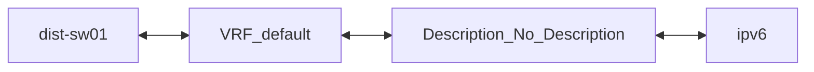
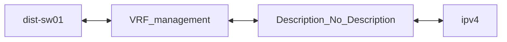

```mermaid
flowchart LR;
dist-sw01 <--> VRF_default <--> Description_No_Description <--> ipv4
```

```mermaid
flowchart LR;
dist-sw01 <--> VRF_default <--> Description_No_Description <--> ipv6
```

```mermaid
flowchart LR;
dist-sw01 <--> VRF_management <--> Description_No_Description <--> ipv4
```

```mermaid
flowchart LR;
dist-sw01 <--> VRF_management <--> Description_No_Description <--> ipv6
```