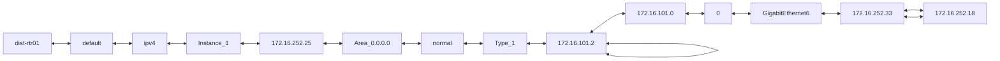
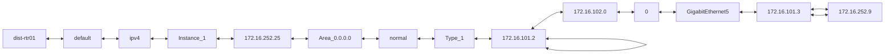
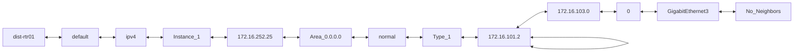
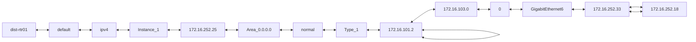
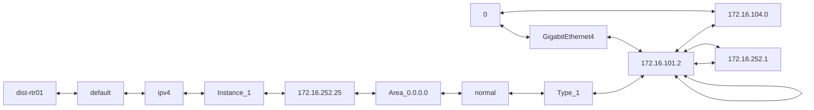

```mermaid
flowchart LR;
dist-rtr01 <--> default <--> ipv4 <--> Instance_1 <--> 172.16.252.25 <--> Area_0.0.0.0 <--> normal <--> Type_1 <--> 172.16.101.2 <--> 172.16.101.2 <--> 172.16.105.0 <--> 0 <--> GigabitEthernet2 <--> No_Neighbors
```

```mermaid
flowchart LR;
dist-rtr01 <--> default <--> ipv4 <--> Instance_1 <--> 172.16.252.25 <--> Area_0.0.0.0 <--> normal <--> Type_1 <--> 172.16.101.2 <--> 172.16.101.2 <--> 172.16.105.0 <--> 0 <--> GigabitEthernet3 <--> No_Neighbors
```

```mermaid
flowchart LR;
dist-rtr01 <--> default <--> ipv4 <--> Instance_1 <--> 172.16.252.25 <--> Area_0.0.0.0 <--> normal <--> Type_1 <--> 172.16.101.2 <--> 172.16.101.2 <--> 172.16.105.0 <--> 0 <--> GigabitEthernet4 <--> 172.16.101.2 <--> 172.16.252.1 <--> 172.16.101.2
```
```mermaid
flowchart LR;
dist-rtr01 <--> default <--> ipv4 <--> Instance_1 <--> 172.16.252.25 <--> Area_0.0.0.0 <--> normal <--> Type_1 <--> 172.16.101.2 <--> 172.16.101.2 <--> 172.16.105.0 <--> 0 <--> GigabitEthernet5 <--> 172.16.101.3 <--> 172.16.252.9 <--> 172.16.101.3
```
```mermaid
flowchart LR;
dist-rtr01 <--> default <--> ipv4 <--> Instance_1 <--> 172.16.252.25 <--> Area_0.0.0.0 <--> normal <--> Type_1 <--> 172.16.101.2 <--> 172.16.101.2 <--> 172.16.105.0 <--> 0 <--> GigabitEthernet6 <--> 172.16.252.33 <--> 172.16.252.18 <--> 172.16.252.33
```
```mermaid
flowchart LR;
dist-rtr01 <--> default <--> ipv4 <--> Instance_1 <--> 172.16.252.25 <--> Area_0.0.0.0 <--> normal <--> Type_1 <--> 172.16.101.2 <--> 172.16.101.2 <--> 172.16.252.2 <--> 0 <--> GigabitEthernet2 <--> No_Neighbors
```

```mermaid
flowchart LR;
dist-rtr01 <--> default <--> ipv4 <--> Instance_1 <--> 172.16.252.25 <--> Area_0.0.0.0 <--> normal <--> Type_1 <--> 172.16.101.2 <--> 172.16.101.2 <--> 172.16.252.2 <--> 0 <--> GigabitEthernet3 <--> No_Neighbors
```

```mermaid
flowchart LR;
dist-rtr01 <--> default <--> ipv4 <--> Instance_1 <--> 172.16.252.25 <--> Area_0.0.0.0 <--> normal <--> Type_1 <--> 172.16.101.2 <--> 172.16.101.2 <--> 172.16.252.2 <--> 0 <--> GigabitEthernet4 <--> 172.16.101.2 <--> 172.16.252.1 <--> 172.16.101.2
```
```mermaid
flowchart LR;
dist-rtr01 <--> default <--> ipv4 <--> Instance_1 <--> 172.16.252.25 <--> Area_0.0.0.0 <--> normal <--> Type_1 <--> 172.16.101.2 <--> 172.16.101.2 <--> 172.16.252.2 <--> 0 <--> GigabitEthernet5 <--> 172.16.101.3 <--> 172.16.252.9 <--> 172.16.101.3
```
```mermaid
flowchart LR;
dist-rtr01 <--> default <--> ipv4 <--> Instance_1 <--> 172.16.252.25 <--> Area_0.0.0.0 <--> normal <--> Type_1 <--> 172.16.101.2 <--> 172.16.101.2 <--> 172.16.252.2 <--> 0 <--> GigabitEthernet6 <--> 172.16.252.33 <--> 172.16.252.18 <--> 172.16.252.33
```
```mermaid
flowchart LR;
dist-rtr01 <--> default <--> ipv4 <--> Instance_1 <--> 172.16.252.25 <--> Area_0.0.0.0 <--> normal <--> Type_1 <--> 172.16.101.2 <--> 172.16.101.2 <--> 172.16.252.6 <--> 0 <--> GigabitEthernet2 <--> No_Neighbors
```

```mermaid
flowchart LR;
dist-rtr01 <--> default <--> ipv4 <--> Instance_1 <--> 172.16.252.25 <--> Area_0.0.0.0 <--> normal <--> Type_1 <--> 172.16.101.2 <--> 172.16.101.2 <--> 172.16.252.6 <--> 0 <--> GigabitEthernet3 <--> No_Neighbors
```

```mermaid
flowchart LR;
dist-rtr01 <--> default <--> ipv4 <--> Instance_1 <--> 172.16.252.25 <--> Area_0.0.0.0 <--> normal <--> Type_1 <--> 172.16.101.2 <--> 172.16.101.2 <--> 172.16.252.6 <--> 0 <--> GigabitEthernet4 <--> 172.16.101.2 <--> 172.16.252.1 <--> 172.16.101.2
```
```mermaid
flowchart LR;
dist-rtr01 <--> default <--> ipv4 <--> Instance_1 <--> 172.16.252.25 <--> Area_0.0.0.0 <--> normal <--> Type_1 <--> 172.16.101.2 <--> 172.16.101.2 <--> 172.16.252.6 <--> 0 <--> GigabitEthernet5 <--> 172.16.101.3 <--> 172.16.252.9 <--> 172.16.101.3
```
```mermaid
flowchart LR;
dist-rtr01 <--> default <--> ipv4 <--> Instance_1 <--> 172.16.252.25 <--> Area_0.0.0.0 <--> normal <--> Type_1 <--> 172.16.101.2 <--> 172.16.101.2 <--> 172.16.252.6 <--> 0 <--> GigabitEthernet6 <--> 172.16.252.33 <--> 172.16.252.18 <--> 172.16.252.33
```
```mermaid
flowchart LR;
dist-rtr01 <--> default <--> ipv4 <--> Instance_1 <--> 172.16.252.25 <--> Area_0.0.0.0 <--> normal <--> Type_1 <--> 172.16.101.3 <--> 172.16.101.3 <--> 172.16.101.0 <--> 0 <--> GigabitEthernet2 <--> No_Neighbors
```

```mermaid
flowchart LR;
dist-rtr01 <--> default <--> ipv4 <--> Instance_1 <--> 172.16.252.25 <--> Area_0.0.0.0 <--> normal <--> Type_1 <--> 172.16.101.3 <--> 172.16.101.3 <--> 172.16.101.0 <--> 0 <--> GigabitEthernet3 <--> No_Neighbors
```

```mermaid
flowchart LR;
dist-rtr01 <--> default <--> ipv4 <--> Instance_1 <--> 172.16.252.25 <--> Area_0.0.0.0 <--> normal <--> Type_1 <--> 172.16.101.3 <--> 172.16.101.3 <--> 172.16.101.0 <--> 0 <--> GigabitEthernet4 <--> 172.16.101.2 <--> 172.16.252.1 <--> 172.16.101.2
```
```mermaid
flowchart LR;
dist-rtr01 <--> default <--> ipv4 <--> Instance_1 <--> 172.16.252.25 <--> Area_0.0.0.0 <--> normal <--> Type_1 <--> 172.16.101.3 <--> 172.16.101.3 <--> 172.16.101.0 <--> 0 <--> GigabitEthernet5 <--> 172.16.101.3 <--> 172.16.252.9 <--> 172.16.101.3
```
```mermaid
flowchart LR;
dist-rtr01 <--> default <--> ipv4 <--> Instance_1 <--> 172.16.252.25 <--> Area_0.0.0.0 <--> normal <--> Type_1 <--> 172.16.101.3 <--> 172.16.101.3 <--> 172.16.101.0 <--> 0 <--> GigabitEthernet6 <--> 172.16.252.33 <--> 172.16.252.18 <--> 172.16.252.33
```
```mermaid
flowchart LR;
dist-rtr01 <--> default <--> ipv4 <--> Instance_1 <--> 172.16.252.25 <--> Area_0.0.0.0 <--> normal <--> Type_1 <--> 172.16.101.3 <--> 172.16.101.3 <--> 172.16.102.0 <--> 0 <--> GigabitEthernet2 <--> No_Neighbors
```

```mermaid
flowchart LR;
dist-rtr01 <--> default <--> ipv4 <--> Instance_1 <--> 172.16.252.25 <--> Area_0.0.0.0 <--> normal <--> Type_1 <--> 172.16.101.3 <--> 172.16.101.3 <--> 172.16.102.0 <--> 0 <--> GigabitEthernet3 <--> No_Neighbors
```

```mermaid
flowchart LR;
dist-rtr01 <--> default <--> ipv4 <--> Instance_1 <--> 172.16.252.25 <--> Area_0.0.0.0 <--> normal <--> Type_1 <--> 172.16.101.3 <--> 172.16.101.3 <--> 172.16.102.0 <--> 0 <--> GigabitEthernet4 <--> 172.16.101.2 <--> 172.16.252.1 <--> 172.16.101.2
```
```mermaid
flowchart LR;
dist-rtr01 <--> default <--> ipv4 <--> Instance_1 <--> 172.16.252.25 <--> Area_0.0.0.0 <--> normal <--> Type_1 <--> 172.16.101.3 <--> 172.16.101.3 <--> 172.16.102.0 <--> 0 <--> GigabitEthernet5 <--> 172.16.101.3 <--> 172.16.252.9 <--> 172.16.101.3
```
```mermaid
flowchart LR;
dist-rtr01 <--> default <--> ipv4 <--> Instance_1 <--> 172.16.252.25 <--> Area_0.0.0.0 <--> normal <--> Type_1 <--> 172.16.101.3 <--> 172.16.101.3 <--> 172.16.102.0 <--> 0 <--> GigabitEthernet6 <--> 172.16.252.33 <--> 172.16.252.18 <--> 172.16.252.33
```
```mermaid
flowchart LR;
dist-rtr01 <--> default <--> ipv4 <--> Instance_1 <--> 172.16.252.25 <--> Area_0.0.0.0 <--> normal <--> Type_1 <--> 172.16.101.3 <--> 172.16.101.3 <--> 172.16.103.0 <--> 0 <--> GigabitEthernet2 <--> No_Neighbors
```

```mermaid
flowchart LR;
dist-rtr01 <--> default <--> ipv4 <--> Instance_1 <--> 172.16.252.25 <--> Area_0.0.0.0 <--> normal <--> Type_1 <--> 172.16.101.3 <--> 172.16.101.3 <--> 172.16.103.0 <--> 0 <--> GigabitEthernet3 <--> No_Neighbors
```

```mermaid
flowchart LR;
dist-rtr01 <--> default <--> ipv4 <--> Instance_1 <--> 172.16.252.25 <--> Area_0.0.0.0 <--> normal <--> Type_1 <--> 172.16.101.3 <--> 172.16.101.3 <--> 172.16.103.0 <--> 0 <--> GigabitEthernet4 <--> 172.16.101.2 <--> 172.16.252.1 <--> 172.16.101.2
```
```mermaid
flowchart LR;
dist-rtr01 <--> default <--> ipv4 <--> Instance_1 <--> 172.16.252.25 <--> Area_0.0.0.0 <--> normal <--> Type_1 <--> 172.16.101.3 <--> 172.16.101.3 <--> 172.16.103.0 <--> 0 <--> GigabitEthernet5 <--> 172.16.101.3 <--> 172.16.252.9 <--> 172.16.101.3
```
```mermaid
flowchart LR;
dist-rtr01 <--> default <--> ipv4 <--> Instance_1 <--> 172.16.252.25 <--> Area_0.0.0.0 <--> normal <--> Type_1 <--> 172.16.101.3 <--> 172.16.101.3 <--> 172.16.103.0 <--> 0 <--> GigabitEthernet6 <--> 172.16.252.33 <--> 172.16.252.18 <--> 172.16.252.33
```
```mermaid
flowchart LR;
dist-rtr01 <--> default <--> ipv4 <--> Instance_1 <--> 172.16.252.25 <--> Area_0.0.0.0 <--> normal <--> Type_1 <--> 172.16.101.3 <--> 172.16.101.3 <--> 172.16.104.0 <--> 0 <--> GigabitEthernet2 <--> No_Neighbors
```

```mermaid
flowchart LR;
dist-rtr01 <--> default <--> ipv4 <--> Instance_1 <--> 172.16.252.25 <--> Area_0.0.0.0 <--> normal <--> Type_1 <--> 172.16.101.3 <--> 172.16.101.3 <--> 172.16.104.0 <--> 0 <--> GigabitEthernet3 <--> No_Neighbors
```

```mermaid
flowchart LR;
dist-rtr01 <--> default <--> ipv4 <--> Instance_1 <--> 172.16.252.25 <--> Area_0.0.0.0 <--> normal <--> Type_1 <--> 172.16.101.3 <--> 172.16.101.3 <--> 172.16.104.0 <--> 0 <--> GigabitEthernet4 <--> 172.16.101.2 <--> 172.16.252.1 <--> 172.16.101.2
```
```mermaid
flowchart LR;
dist-rtr01 <--> default <--> ipv4 <--> Instance_1 <--> 172.16.252.25 <--> Area_0.0.0.0 <--> normal <--> Type_1 <--> 172.16.101.3 <--> 172.16.101.3 <--> 172.16.104.0 <--> 0 <--> GigabitEthernet5 <--> 172.16.101.3 <--> 172.16.252.9 <--> 172.16.101.3
```
```mermaid
flowchart LR;
dist-rtr01 <--> default <--> ipv4 <--> Instance_1 <--> 172.16.252.25 <--> Area_0.0.0.0 <--> normal <--> Type_1 <--> 172.16.101.3 <--> 172.16.101.3 <--> 172.16.104.0 <--> 0 <--> GigabitEthernet6 <--> 172.16.252.33 <--> 172.16.252.18 <--> 172.16.252.33
```
```mermaid
flowchart LR;
dist-rtr01 <--> default <--> ipv4 <--> Instance_1 <--> 172.16.252.25 <--> Area_0.0.0.0 <--> normal <--> Type_1 <--> 172.16.101.3 <--> 172.16.101.3 <--> 172.16.105.0 <--> 0 <--> GigabitEthernet2 <--> No_Neighbors
```

```mermaid
flowchart LR;
dist-rtr01 <--> default <--> ipv4 <--> Instance_1 <--> 172.16.252.25 <--> Area_0.0.0.0 <--> normal <--> Type_1 <--> 172.16.101.3 <--> 172.16.101.3 <--> 172.16.105.0 <--> 0 <--> GigabitEthernet3 <--> No_Neighbors
```

```mermaid
flowchart LR;
dist-rtr01 <--> default <--> ipv4 <--> Instance_1 <--> 172.16.252.25 <--> Area_0.0.0.0 <--> normal <--> Type_1 <--> 172.16.101.3 <--> 172.16.101.3 <--> 172.16.105.0 <--> 0 <--> GigabitEthernet4 <--> 172.16.101.2 <--> 172.16.252.1 <--> 172.16.101.2
```
```mermaid
flowchart LR;
dist-rtr01 <--> default <--> ipv4 <--> Instance_1 <--> 172.16.252.25 <--> Area_0.0.0.0 <--> normal <--> Type_1 <--> 172.16.101.3 <--> 172.16.101.3 <--> 172.16.105.0 <--> 0 <--> GigabitEthernet5 <--> 172.16.101.3 <--> 172.16.252.9 <--> 172.16.101.3
```
```mermaid
flowchart LR;
dist-rtr01 <--> default <--> ipv4 <--> Instance_1 <--> 172.16.252.25 <--> Area_0.0.0.0 <--> normal <--> Type_1 <--> 172.16.101.3 <--> 172.16.101.3 <--> 172.16.105.0 <--> 0 <--> GigabitEthernet6 <--> 172.16.252.33 <--> 172.16.252.18 <--> 172.16.252.33
```
```mermaid
flowchart LR;
dist-rtr01 <--> default <--> ipv4 <--> Instance_1 <--> 172.16.252.25 <--> Area_0.0.0.0 <--> normal <--> Type_1 <--> 172.16.101.3 <--> 172.16.101.3 <--> 172.16.252.10 <--> 0 <--> GigabitEthernet2 <--> No_Neighbors
```

```mermaid
flowchart LR;
dist-rtr01 <--> default <--> ipv4 <--> Instance_1 <--> 172.16.252.25 <--> Area_0.0.0.0 <--> normal <--> Type_1 <--> 172.16.101.3 <--> 172.16.101.3 <--> 172.16.252.10 <--> 0 <--> GigabitEthernet3 <--> No_Neighbors
```

```mermaid
flowchart LR;
dist-rtr01 <--> default <--> ipv4 <--> Instance_1 <--> 172.16.252.25 <--> Area_0.0.0.0 <--> normal <--> Type_1 <--> 172.16.101.3 <--> 172.16.101.3 <--> 172.16.252.10 <--> 0 <--> GigabitEthernet4 <--> 172.16.101.2 <--> 172.16.252.1 <--> 172.16.101.2
```
```mermaid
flowchart LR;
dist-rtr01 <--> default <--> ipv4 <--> Instance_1 <--> 172.16.252.25 <--> Area_0.0.0.0 <--> normal <--> Type_1 <--> 172.16.101.3 <--> 172.16.101.3 <--> 172.16.252.10 <--> 0 <--> GigabitEthernet5 <--> 172.16.101.3 <--> 172.16.252.9 <--> 172.16.101.3
```
```mermaid
flowchart LR;
dist-rtr01 <--> default <--> ipv4 <--> Instance_1 <--> 172.16.252.25 <--> Area_0.0.0.0 <--> normal <--> Type_1 <--> 172.16.101.3 <--> 172.16.101.3 <--> 172.16.252.10 <--> 0 <--> GigabitEthernet6 <--> 172.16.252.33 <--> 172.16.252.18 <--> 172.16.252.33
```
```mermaid
flowchart LR;
dist-rtr01 <--> default <--> ipv4 <--> Instance_1 <--> 172.16.252.25 <--> Area_0.0.0.0 <--> normal <--> Type_1 <--> 172.16.101.3 <--> 172.16.101.3 <--> 172.16.252.14 <--> 0 <--> GigabitEthernet2 <--> No_Neighbors
```

```mermaid
flowchart LR;
dist-rtr01 <--> default <--> ipv4 <--> Instance_1 <--> 172.16.252.25 <--> Area_0.0.0.0 <--> normal <--> Type_1 <--> 172.16.101.3 <--> 172.16.101.3 <--> 172.16.252.14 <--> 0 <--> GigabitEthernet3 <--> No_Neighbors
```

```mermaid
flowchart LR;
dist-rtr01 <--> default <--> ipv4 <--> Instance_1 <--> 172.16.252.25 <--> Area_0.0.0.0 <--> normal <--> Type_1 <--> 172.16.101.3 <--> 172.16.101.3 <--> 172.16.252.14 <--> 0 <--> GigabitEthernet4 <--> 172.16.101.2 <--> 172.16.252.1 <--> 172.16.101.2
```
```mermaid
flowchart LR;
dist-rtr01 <--> default <--> ipv4 <--> Instance_1 <--> 172.16.252.25 <--> Area_0.0.0.0 <--> normal <--> Type_1 <--> 172.16.101.3 <--> 172.16.101.3 <--> 172.16.252.14 <--> 0 <--> GigabitEthernet5 <--> 172.16.101.3 <--> 172.16.252.9 <--> 172.16.101.3
```
```mermaid
flowchart LR;
dist-rtr01 <--> default <--> ipv4 <--> Instance_1 <--> 172.16.252.25 <--> Area_0.0.0.0 <--> normal <--> Type_1 <--> 172.16.101.3 <--> 172.16.101.3 <--> 172.16.252.14 <--> 0 <--> GigabitEthernet6 <--> 172.16.252.33 <--> 172.16.252.18 <--> 172.16.252.33
```
```mermaid
flowchart LR;
dist-rtr01 <--> default <--> ipv4 <--> Instance_1 <--> 172.16.252.25 <--> Area_0.0.0.0 <--> normal <--> Type_1 <--> 172.16.252.25 <--> 172.16.252.25 <--> 172.16.252.10 <--> 0 <--> GigabitEthernet2 <--> No_Neighbors
```

```mermaid
flowchart LR;
dist-rtr01 <--> default <--> ipv4 <--> Instance_1 <--> 172.16.252.25 <--> Area_0.0.0.0 <--> normal <--> Type_1 <--> 172.16.252.25 <--> 172.16.252.25 <--> 172.16.252.10 <--> 0 <--> GigabitEthernet3 <--> No_Neighbors
```

```mermaid
flowchart LR;
dist-rtr01 <--> default <--> ipv4 <--> Instance_1 <--> 172.16.252.25 <--> Area_0.0.0.0 <--> normal <--> Type_1 <--> 172.16.252.25 <--> 172.16.252.25 <--> 172.16.252.10 <--> 0 <--> GigabitEthernet4 <--> 172.16.101.2 <--> 172.16.252.1 <--> 172.16.101.2
```
```mermaid
flowchart LR;
dist-rtr01 <--> default <--> ipv4 <--> Instance_1 <--> 172.16.252.25 <--> Area_0.0.0.0 <--> normal <--> Type_1 <--> 172.16.252.25 <--> 172.16.252.25 <--> 172.16.252.10 <--> 0 <--> GigabitEthernet5 <--> 172.16.101.3 <--> 172.16.252.9 <--> 172.16.101.3
```
```mermaid
flowchart LR;
dist-rtr01 <--> default <--> ipv4 <--> Instance_1 <--> 172.16.252.25 <--> Area_0.0.0.0 <--> normal <--> Type_1 <--> 172.16.252.25 <--> 172.16.252.25 <--> 172.16.252.10 <--> 0 <--> GigabitEthernet6 <--> 172.16.252.33 <--> 172.16.252.18 <--> 172.16.252.33
```
```mermaid
flowchart LR;
dist-rtr01 <--> default <--> ipv4 <--> Instance_1 <--> 172.16.252.25 <--> Area_0.0.0.0 <--> normal <--> Type_1 <--> 172.16.252.25 <--> 172.16.252.25 <--> 172.16.252.18 <--> 0 <--> GigabitEthernet2 <--> No_Neighbors
```

```mermaid
flowchart LR;
dist-rtr01 <--> default <--> ipv4 <--> Instance_1 <--> 172.16.252.25 <--> Area_0.0.0.0 <--> normal <--> Type_1 <--> 172.16.252.25 <--> 172.16.252.25 <--> 172.16.252.18 <--> 0 <--> GigabitEthernet3 <--> No_Neighbors
```

```mermaid
flowchart LR;
dist-rtr01 <--> default <--> ipv4 <--> Instance_1 <--> 172.16.252.25 <--> Area_0.0.0.0 <--> normal <--> Type_1 <--> 172.16.252.25 <--> 172.16.252.25 <--> 172.16.252.18 <--> 0 <--> GigabitEthernet4 <--> 172.16.101.2 <--> 172.16.252.1 <--> 172.16.101.2
```
```mermaid
flowchart LR;
dist-rtr01 <--> default <--> ipv4 <--> Instance_1 <--> 172.16.252.25 <--> Area_0.0.0.0 <--> normal <--> Type_1 <--> 172.16.252.25 <--> 172.16.252.25 <--> 172.16.252.18 <--> 0 <--> GigabitEthernet5 <--> 172.16.101.3 <--> 172.16.252.9 <--> 172.16.101.3
```
```mermaid
flowchart LR;
dist-rtr01 <--> default <--> ipv4 <--> Instance_1 <--> 172.16.252.25 <--> Area_0.0.0.0 <--> normal <--> Type_1 <--> 172.16.252.25 <--> 172.16.252.25 <--> 172.16.252.18 <--> 0 <--> GigabitEthernet6 <--> 172.16.252.33 <--> 172.16.252.18 <--> 172.16.252.33
```
```mermaid
flowchart LR;
dist-rtr01 <--> default <--> ipv4 <--> Instance_1 <--> 172.16.252.25 <--> Area_0.0.0.0 <--> normal <--> Type_1 <--> 172.16.252.25 <--> 172.16.252.25 <--> 172.16.252.2 <--> 0 <--> GigabitEthernet2 <--> No_Neighbors
```

```mermaid
flowchart LR;
dist-rtr01 <--> default <--> ipv4 <--> Instance_1 <--> 172.16.252.25 <--> Area_0.0.0.0 <--> normal <--> Type_1 <--> 172.16.252.25 <--> 172.16.252.25 <--> 172.16.252.2 <--> 0 <--> GigabitEthernet3 <--> No_Neighbors
```

```mermaid
flowchart LR;
dist-rtr01 <--> default <--> ipv4 <--> Instance_1 <--> 172.16.252.25 <--> Area_0.0.0.0 <--> normal <--> Type_1 <--> 172.16.252.25 <--> 172.16.252.25 <--> 172.16.252.2 <--> 0 <--> GigabitEthernet4 <--> 172.16.101.2 <--> 172.16.252.1 <--> 172.16.101.2
```
```mermaid
flowchart LR;
dist-rtr01 <--> default <--> ipv4 <--> Instance_1 <--> 172.16.252.25 <--> Area_0.0.0.0 <--> normal <--> Type_1 <--> 172.16.252.25 <--> 172.16.252.25 <--> 172.16.252.2 <--> 0 <--> GigabitEthernet5 <--> 172.16.101.3 <--> 172.16.252.9 <--> 172.16.101.3
```
```mermaid
flowchart LR;
dist-rtr01 <--> default <--> ipv4 <--> Instance_1 <--> 172.16.252.25 <--> Area_0.0.0.0 <--> normal <--> Type_1 <--> 172.16.252.25 <--> 172.16.252.25 <--> 172.16.252.2 <--> 0 <--> GigabitEthernet6 <--> 172.16.252.33 <--> 172.16.252.18 <--> 172.16.252.33
```
```mermaid
flowchart LR;
dist-rtr01 <--> default <--> ipv4 <--> Instance_1 <--> 172.16.252.25 <--> Area_0.0.0.0 <--> normal <--> Type_1 <--> 172.16.252.25 <--> 172.16.252.25 <--> 172.16.252.20 <--> 0 <--> GigabitEthernet2 <--> No_Neighbors
```

```mermaid
flowchart LR;
dist-rtr01 <--> default <--> ipv4 <--> Instance_1 <--> 172.16.252.25 <--> Area_0.0.0.0 <--> normal <--> Type_1 <--> 172.16.252.25 <--> 172.16.252.25 <--> 172.16.252.20 <--> 0 <--> GigabitEthernet3 <--> No_Neighbors
```

```mermaid
flowchart LR;
dist-rtr01 <--> default <--> ipv4 <--> Instance_1 <--> 172.16.252.25 <--> Area_0.0.0.0 <--> normal <--> Type_1 <--> 172.16.252.25 <--> 172.16.252.25 <--> 172.16.252.20 <--> 0 <--> GigabitEthernet4 <--> 172.16.101.2 <--> 172.16.252.1 <--> 172.16.101.2
```
```mermaid
flowchart LR;
dist-rtr01 <--> default <--> ipv4 <--> Instance_1 <--> 172.16.252.25 <--> Area_0.0.0.0 <--> normal <--> Type_1 <--> 172.16.252.25 <--> 172.16.252.25 <--> 172.16.252.20 <--> 0 <--> GigabitEthernet5 <--> 172.16.101.3 <--> 172.16.252.9 <--> 172.16.101.3
```
```mermaid
flowchart LR;
dist-rtr01 <--> default <--> ipv4 <--> Instance_1 <--> 172.16.252.25 <--> Area_0.0.0.0 <--> normal <--> Type_1 <--> 172.16.252.25 <--> 172.16.252.25 <--> 172.16.252.20 <--> 0 <--> GigabitEthernet6 <--> 172.16.252.33 <--> 172.16.252.18 <--> 172.16.252.33
```
```mermaid
flowchart LR;
dist-rtr01 <--> default <--> ipv4 <--> Instance_1 <--> 172.16.252.25 <--> Area_0.0.0.0 <--> normal <--> Type_1 <--> 172.16.252.25 <--> 172.16.252.25 <--> 172.16.252.24 <--> 0 <--> GigabitEthernet2 <--> No_Neighbors
```

```mermaid
flowchart LR;
dist-rtr01 <--> default <--> ipv4 <--> Instance_1 <--> 172.16.252.25 <--> Area_0.0.0.0 <--> normal <--> Type_1 <--> 172.16.252.25 <--> 172.16.252.25 <--> 172.16.252.24 <--> 0 <--> GigabitEthernet3 <--> No_Neighbors
```

```mermaid
flowchart LR;
dist-rtr01 <--> default <--> ipv4 <--> Instance_1 <--> 172.16.252.25 <--> Area_0.0.0.0 <--> normal <--> Type_1 <--> 172.16.252.25 <--> 172.16.252.25 <--> 172.16.252.24 <--> 0 <--> GigabitEthernet4 <--> 172.16.101.2 <--> 172.16.252.1 <--> 172.16.101.2
```
```mermaid
flowchart LR;
dist-rtr01 <--> default <--> ipv4 <--> Instance_1 <--> 172.16.252.25 <--> Area_0.0.0.0 <--> normal <--> Type_1 <--> 172.16.252.25 <--> 172.16.252.25 <--> 172.16.252.24 <--> 0 <--> GigabitEthernet5 <--> 172.16.101.3 <--> 172.16.252.9 <--> 172.16.101.3
```
```mermaid
flowchart LR;
dist-rtr01 <--> default <--> ipv4 <--> Instance_1 <--> 172.16.252.25 <--> Area_0.0.0.0 <--> normal <--> Type_1 <--> 172.16.252.25 <--> 172.16.252.25 <--> 172.16.252.24 <--> 0 <--> GigabitEthernet6 <--> 172.16.252.33 <--> 172.16.252.18 <--> 172.16.252.33
```
```mermaid
flowchart LR;
dist-rtr01 <--> default <--> ipv4 <--> Instance_1 <--> 172.16.252.25 <--> Area_0.0.0.0 <--> normal <--> Type_1 <--> 172.16.252.33 <--> 172.16.252.33 <--> 172.16.252.14 <--> 0 <--> GigabitEthernet2 <--> No_Neighbors
```

```mermaid
flowchart LR;
dist-rtr01 <--> default <--> ipv4 <--> Instance_1 <--> 172.16.252.25 <--> Area_0.0.0.0 <--> normal <--> Type_1 <--> 172.16.252.33 <--> 172.16.252.33 <--> 172.16.252.14 <--> 0 <--> GigabitEthernet3 <--> No_Neighbors
```

```mermaid
flowchart LR;
dist-rtr01 <--> default <--> ipv4 <--> Instance_1 <--> 172.16.252.25 <--> Area_0.0.0.0 <--> normal <--> Type_1 <--> 172.16.252.33 <--> 172.16.252.33 <--> 172.16.252.14 <--> 0 <--> GigabitEthernet4 <--> 172.16.101.2 <--> 172.16.252.1 <--> 172.16.101.2
```
```mermaid
flowchart LR;
dist-rtr01 <--> default <--> ipv4 <--> Instance_1 <--> 172.16.252.25 <--> Area_0.0.0.0 <--> normal <--> Type_1 <--> 172.16.252.33 <--> 172.16.252.33 <--> 172.16.252.14 <--> 0 <--> GigabitEthernet5 <--> 172.16.101.3 <--> 172.16.252.9 <--> 172.16.101.3
```
```mermaid
flowchart LR;
dist-rtr01 <--> default <--> ipv4 <--> Instance_1 <--> 172.16.252.25 <--> Area_0.0.0.0 <--> normal <--> Type_1 <--> 172.16.252.33 <--> 172.16.252.33 <--> 172.16.252.14 <--> 0 <--> GigabitEthernet6 <--> 172.16.252.33 <--> 172.16.252.18 <--> 172.16.252.33
```
```mermaid
flowchart LR;
dist-rtr01 <--> default <--> ipv4 <--> Instance_1 <--> 172.16.252.25 <--> Area_0.0.0.0 <--> normal <--> Type_1 <--> 172.16.252.33 <--> 172.16.252.33 <--> 172.16.252.18 <--> 0 <--> GigabitEthernet2 <--> No_Neighbors
```

```mermaid
flowchart LR;
dist-rtr01 <--> default <--> ipv4 <--> Instance_1 <--> 172.16.252.25 <--> Area_0.0.0.0 <--> normal <--> Type_1 <--> 172.16.252.33 <--> 172.16.252.33 <--> 172.16.252.18 <--> 0 <--> GigabitEthernet3 <--> No_Neighbors
```

```mermaid
flowchart LR;
dist-rtr01 <--> default <--> ipv4 <--> Instance_1 <--> 172.16.252.25 <--> Area_0.0.0.0 <--> normal <--> Type_1 <--> 172.16.252.33 <--> 172.16.252.33 <--> 172.16.252.18 <--> 0 <--> GigabitEthernet4 <--> 172.16.101.2 <--> 172.16.252.1 <--> 172.16.101.2
```
```mermaid
flowchart LR;
dist-rtr01 <--> default <--> ipv4 <--> Instance_1 <--> 172.16.252.25 <--> Area_0.0.0.0 <--> normal <--> Type_1 <--> 172.16.252.33 <--> 172.16.252.33 <--> 172.16.252.18 <--> 0 <--> GigabitEthernet5 <--> 172.16.101.3 <--> 172.16.252.9 <--> 172.16.101.3
```
```mermaid
flowchart LR;
dist-rtr01 <--> default <--> ipv4 <--> Instance_1 <--> 172.16.252.25 <--> Area_0.0.0.0 <--> normal <--> Type_1 <--> 172.16.252.33 <--> 172.16.252.33 <--> 172.16.252.18 <--> 0 <--> GigabitEthernet6 <--> 172.16.252.33 <--> 172.16.252.18 <--> 172.16.252.33
```
```mermaid
flowchart LR;
dist-rtr01 <--> default <--> ipv4 <--> Instance_1 <--> 172.16.252.25 <--> Area_0.0.0.0 <--> normal <--> Type_1 <--> 172.16.252.33 <--> 172.16.252.33 <--> 172.16.252.28 <--> 0 <--> GigabitEthernet2 <--> No_Neighbors
```

```mermaid
flowchart LR;
dist-rtr01 <--> default <--> ipv4 <--> Instance_1 <--> 172.16.252.25 <--> Area_0.0.0.0 <--> normal <--> Type_1 <--> 172.16.252.33 <--> 172.16.252.33 <--> 172.16.252.28 <--> 0 <--> GigabitEthernet3 <--> No_Neighbors
```

```mermaid
flowchart LR;
dist-rtr01 <--> default <--> ipv4 <--> Instance_1 <--> 172.16.252.25 <--> Area_0.0.0.0 <--> normal <--> Type_1 <--> 172.16.252.33 <--> 172.16.252.33 <--> 172.16.252.28 <--> 0 <--> GigabitEthernet4 <--> 172.16.101.2 <--> 172.16.252.1 <--> 172.16.101.2
```
```mermaid
flowchart LR;
dist-rtr01 <--> default <--> ipv4 <--> Instance_1 <--> 172.16.252.25 <--> Area_0.0.0.0 <--> normal <--> Type_1 <--> 172.16.252.33 <--> 172.16.252.33 <--> 172.16.252.28 <--> 0 <--> GigabitEthernet5 <--> 172.16.101.3 <--> 172.16.252.9 <--> 172.16.101.3
```
```mermaid
flowchart LR;
dist-rtr01 <--> default <--> ipv4 <--> Instance_1 <--> 172.16.252.25 <--> Area_0.0.0.0 <--> normal <--> Type_1 <--> 172.16.252.33 <--> 172.16.252.33 <--> 172.16.252.28 <--> 0 <--> GigabitEthernet6 <--> 172.16.252.33 <--> 172.16.252.18 <--> 172.16.252.33
```
```mermaid
flowchart LR;
dist-rtr01 <--> default <--> ipv4 <--> Instance_1 <--> 172.16.252.25 <--> Area_0.0.0.0 <--> normal <--> Type_1 <--> 172.16.252.33 <--> 172.16.252.33 <--> 172.16.252.32 <--> 0 <--> GigabitEthernet2 <--> No_Neighbors
```

```mermaid
flowchart LR;
dist-rtr01 <--> default <--> ipv4 <--> Instance_1 <--> 172.16.252.25 <--> Area_0.0.0.0 <--> normal <--> Type_1 <--> 172.16.252.33 <--> 172.16.252.33 <--> 172.16.252.32 <--> 0 <--> GigabitEthernet3 <--> No_Neighbors
```

```mermaid
flowchart LR;
dist-rtr01 <--> default <--> ipv4 <--> Instance_1 <--> 172.16.252.25 <--> Area_0.0.0.0 <--> normal <--> Type_1 <--> 172.16.252.33 <--> 172.16.252.33 <--> 172.16.252.32 <--> 0 <--> GigabitEthernet4 <--> 172.16.101.2 <--> 172.16.252.1 <--> 172.16.101.2
```
```mermaid
flowchart LR;
dist-rtr01 <--> default <--> ipv4 <--> Instance_1 <--> 172.16.252.25 <--> Area_0.0.0.0 <--> normal <--> Type_1 <--> 172.16.252.33 <--> 172.16.252.33 <--> 172.16.252.32 <--> 0 <--> GigabitEthernet5 <--> 172.16.101.3 <--> 172.16.252.9 <--> 172.16.101.3
```
```mermaid
flowchart LR;
dist-rtr01 <--> default <--> ipv4 <--> Instance_1 <--> 172.16.252.25 <--> Area_0.0.0.0 <--> normal <--> Type_1 <--> 172.16.252.33 <--> 172.16.252.33 <--> 172.16.252.32 <--> 0 <--> GigabitEthernet6 <--> 172.16.252.33 <--> 172.16.252.18 <--> 172.16.252.33
```
```mermaid
flowchart LR;
dist-rtr01 <--> default <--> ipv4 <--> Instance_1 <--> 172.16.252.25 <--> Area_0.0.0.0 <--> normal <--> Type_1 <--> 172.16.252.33 <--> 172.16.252.33 <--> 172.16.252.6 <--> 0 <--> GigabitEthernet2 <--> No_Neighbors
```

```mermaid
flowchart LR;
dist-rtr01 <--> default <--> ipv4 <--> Instance_1 <--> 172.16.252.25 <--> Area_0.0.0.0 <--> normal <--> Type_1 <--> 172.16.252.33 <--> 172.16.252.33 <--> 172.16.252.6 <--> 0 <--> GigabitEthernet3 <--> No_Neighbors
```

```mermaid
flowchart LR;
dist-rtr01 <--> default <--> ipv4 <--> Instance_1 <--> 172.16.252.25 <--> Area_0.0.0.0 <--> normal <--> Type_1 <--> 172.16.252.33 <--> 172.16.252.33 <--> 172.16.252.6 <--> 0 <--> GigabitEthernet4 <--> 172.16.101.2 <--> 172.16.252.1 <--> 172.16.101.2
```
```mermaid
flowchart LR;
dist-rtr01 <--> default <--> ipv4 <--> Instance_1 <--> 172.16.252.25 <--> Area_0.0.0.0 <--> normal <--> Type_1 <--> 172.16.252.33 <--> 172.16.252.33 <--> 172.16.252.6 <--> 0 <--> GigabitEthernet5 <--> 172.16.101.3 <--> 172.16.252.9 <--> 172.16.101.3
```
```mermaid
flowchart LR;
dist-rtr01 <--> default <--> ipv4 <--> Instance_1 <--> 172.16.252.25 <--> Area_0.0.0.0 <--> normal <--> Type_1 <--> 172.16.252.33 <--> 172.16.252.33 <--> 172.16.252.6 <--> 0 <--> GigabitEthernet6 <--> 172.16.252.33 <--> 172.16.252.18 <--> 172.16.252.33
```
```mermaid
flowchart LR;
dist-rtr01 <--> default <--> ipv4 <--> Instance_1 <--> 172.16.252.25 <--> Area_0.0.0.0 <--> normal <--> Type_1 <--> 172.16.101.2 <--> 172.16.101.2 <--> 172.16.101.0 <--> 0 <--> GigabitEthernet2 <--> No_Neighbors
```

```mermaid
flowchart LR;
dist-rtr01 <--> default <--> ipv4 <--> Instance_1 <--> 172.16.252.25 <--> Area_0.0.0.0 <--> normal <--> Type_1 <--> 172.16.101.2 <--> 172.16.101.2 <--> 172.16.101.0 <--> 0 <--> GigabitEthernet3 <--> No_Neighbors
```

```mermaid
flowchart LR;
dist-rtr01 <--> default <--> ipv4 <--> Instance_1 <--> 172.16.252.25 <--> Area_0.0.0.0 <--> normal <--> Type_1 <--> 172.16.101.2 <--> 172.16.101.2 <--> 172.16.101.0 <--> 0 <--> GigabitEthernet4 <--> 172.16.101.2 <--> 172.16.252.1 <--> 172.16.101.2
```
```mermaid
flowchart LR;
dist-rtr01 <--> default <--> ipv4 <--> Instance_1 <--> 172.16.252.25 <--> Area_0.0.0.0 <--> normal <--> Type_1 <--> 172.16.101.2 <--> 172.16.101.2 <--> 172.16.101.0 <--> 0 <--> GigabitEthernet5 <--> 172.16.101.3 <--> 172.16.252.9 <--> 172.16.101.3
```
```mermaid
flowchart LR;
dist-rtr01 <--> default <--> ipv4 <--> Instance_1 <--> 172.16.252.25 <--> Area_0.0.0.0 <--> normal <--> Type_1 <--> 172.16.101.2 <--> 172.16.101.2 <--> 172.16.101.0 <--> 0 <--> GigabitEthernet6 <--> 172.16.252.33 <--> 172.16.252.18 <--> 172.16.252.33
```
```mermaid
flowchart LR;
dist-rtr01 <--> default <--> ipv4 <--> Instance_1 <--> 172.16.252.25 <--> Area_0.0.0.0 <--> normal <--> Type_1 <--> 172.16.101.2 <--> 172.16.101.2 <--> 172.16.102.0 <--> 0 <--> GigabitEthernet2 <--> No_Neighbors
```

```mermaid
flowchart LR;
dist-rtr01 <--> default <--> ipv4 <--> Instance_1 <--> 172.16.252.25 <--> Area_0.0.0.0 <--> normal <--> Type_1 <--> 172.16.101.2 <--> 172.16.101.2 <--> 172.16.102.0 <--> 0 <--> GigabitEthernet3 <--> No_Neighbors
```

```mermaid
flowchart LR;
dist-rtr01 <--> default <--> ipv4 <--> Instance_1 <--> 172.16.252.25 <--> Area_0.0.0.0 <--> normal <--> Type_1 <--> 172.16.101.2 <--> 172.16.101.2 <--> 172.16.102.0 <--> 0 <--> GigabitEthernet4 <--> 172.16.101.2 <--> 172.16.252.1 <--> 172.16.101.2
```
```mermaid
flowchart LR;
dist-rtr01 <--> default <--> ipv4 <--> Instance_1 <--> 172.16.252.25 <--> Area_0.0.0.0 <--> normal <--> Type_1 <--> 172.16.101.2 <--> 172.16.101.2 <--> 172.16.102.0 <--> 0 <--> GigabitEthernet5 <--> 172.16.101.3 <--> 172.16.252.9 <--> 172.16.101.3
```
```mermaid
flowchart LR;
dist-rtr01 <--> default <--> ipv4 <--> Instance_1 <--> 172.16.252.25 <--> Area_0.0.0.0 <--> normal <--> Type_1 <--> 172.16.101.2 <--> 172.16.101.2 <--> 172.16.102.0 <--> 0 <--> GigabitEthernet6 <--> 172.16.252.33 <--> 172.16.252.18 <--> 172.16.252.33
```
```mermaid
flowchart LR;
dist-rtr01 <--> default <--> ipv4 <--> Instance_1 <--> 172.16.252.25 <--> Area_0.0.0.0 <--> normal <--> Type_1 <--> 172.16.101.2 <--> 172.16.101.2 <--> 172.16.103.0 <--> 0 <--> GigabitEthernet2 <--> No_Neighbors
```

```mermaid
flowchart LR;
dist-rtr01 <--> default <--> ipv4 <--> Instance_1 <--> 172.16.252.25 <--> Area_0.0.0.0 <--> normal <--> Type_1 <--> 172.16.101.2 <--> 172.16.101.2 <--> 172.16.103.0 <--> 0 <--> GigabitEthernet3 <--> No_Neighbors
```

```mermaid
flowchart LR;
dist-rtr01 <--> default <--> ipv4 <--> Instance_1 <--> 172.16.252.25 <--> Area_0.0.0.0 <--> normal <--> Type_1 <--> 172.16.101.2 <--> 172.16.101.2 <--> 172.16.103.0 <--> 0 <--> GigabitEthernet4 <--> 172.16.101.2 <--> 172.16.252.1 <--> 172.16.101.2
```
```mermaid
flowchart LR;
dist-rtr01 <--> default <--> ipv4 <--> Instance_1 <--> 172.16.252.25 <--> Area_0.0.0.0 <--> normal <--> Type_1 <--> 172.16.101.2 <--> 172.16.101.2 <--> 172.16.103.0 <--> 0 <--> GigabitEthernet5 <--> 172.16.101.3 <--> 172.16.252.9 <--> 172.16.101.3
```
```mermaid
flowchart LR;
dist-rtr01 <--> default <--> ipv4 <--> Instance_1 <--> 172.16.252.25 <--> Area_0.0.0.0 <--> normal <--> Type_1 <--> 172.16.101.2 <--> 172.16.101.2 <--> 172.16.103.0 <--> 0 <--> GigabitEthernet6 <--> 172.16.252.33 <--> 172.16.252.18 <--> 172.16.252.33
```
```mermaid
flowchart LR;
dist-rtr01 <--> default <--> ipv4 <--> Instance_1 <--> 172.16.252.25 <--> Area_0.0.0.0 <--> normal <--> Type_1 <--> 172.16.101.2 <--> 172.16.101.2 <--> 172.16.104.0 <--> 0 <--> GigabitEthernet2 <--> No_Neighbors
```

```mermaid
flowchart LR;
dist-rtr01 <--> default <--> ipv4 <--> Instance_1 <--> 172.16.252.25 <--> Area_0.0.0.0 <--> normal <--> Type_1 <--> 172.16.101.2 <--> 172.16.101.2 <--> 172.16.104.0 <--> 0 <--> GigabitEthernet3 <--> No_Neighbors
```

```mermaid
flowchart LR;
dist-rtr01 <--> default <--> ipv4 <--> Instance_1 <--> 172.16.252.25 <--> Area_0.0.0.0 <--> normal <--> Type_1 <--> 172.16.101.2 <--> 172.16.101.2 <--> 172.16.104.0 <--> 0 <--> GigabitEthernet4 <--> 172.16.101.2 <--> 172.16.252.1 <--> 172.16.101.2
```
```mermaid
flowchart LR;
dist-rtr01 <--> default <--> ipv4 <--> Instance_1 <--> 172.16.252.25 <--> Area_0.0.0.0 <--> normal <--> Type_1 <--> 172.16.101.2 <--> 172.16.101.2 <--> 172.16.104.0 <--> 0 <--> GigabitEthernet5 <--> 172.16.101.3 <--> 172.16.252.9 <--> 172.16.101.3
```
```mermaid
flowchart LR;
dist-rtr01 <--> default <--> ipv4 <--> Instance_1 <--> 172.16.252.25 <--> Area_0.0.0.0 <--> normal <--> Type_1 <--> 172.16.101.2 <--> 172.16.101.2 <--> 172.16.104.0 <--> 0 <--> GigabitEthernet6 <--> 172.16.252.33 <--> 172.16.252.18 <--> 172.16.252.33
```
```mermaid
flowchart LR;
dist-rtr01 <--> default <--> ipv4 <--> Instance_1 <--> 172.16.252.25 <--> Area_0.0.0.0 <--> normal <--> Type_1 <--> 172.16.101.2 <--> 172.16.101.2 <--> 172.16.105.0 <--> 0 <--> GigabitEthernet2 <--> No_Neighbors
```

```mermaid
flowchart LR;
dist-rtr01 <--> default <--> ipv4 <--> Instance_1 <--> 172.16.252.25 <--> Area_0.0.0.0 <--> normal <--> Type_1 <--> 172.16.101.2 <--> 172.16.101.2 <--> 172.16.105.0 <--> 0 <--> GigabitEthernet3 <--> No_Neighbors
```

```mermaid
flowchart LR;
dist-rtr01 <--> default <--> ipv4 <--> Instance_1 <--> 172.16.252.25 <--> Area_0.0.0.0 <--> normal <--> Type_1 <--> 172.16.101.2 <--> 172.16.101.2 <--> 172.16.105.0 <--> 0 <--> GigabitEthernet4 <--> 172.16.101.2 <--> 172.16.252.1 <--> 172.16.101.2
```
```mermaid
flowchart LR;
dist-rtr01 <--> default <--> ipv4 <--> Instance_1 <--> 172.16.252.25 <--> Area_0.0.0.0 <--> normal <--> Type_1 <--> 172.16.101.2 <--> 172.16.101.2 <--> 172.16.105.0 <--> 0 <--> GigabitEthernet5 <--> 172.16.101.3 <--> 172.16.252.9 <--> 172.16.101.3
```
```mermaid
flowchart LR;
dist-rtr01 <--> default <--> ipv4 <--> Instance_1 <--> 172.16.252.25 <--> Area_0.0.0.0 <--> normal <--> Type_1 <--> 172.16.101.2 <--> 172.16.101.2 <--> 172.16.105.0 <--> 0 <--> GigabitEthernet6 <--> 172.16.252.33 <--> 172.16.252.18 <--> 172.16.252.33
```
```mermaid
flowchart LR;
dist-rtr01 <--> default <--> ipv4 <--> Instance_1 <--> 172.16.252.25 <--> Area_0.0.0.0 <--> normal <--> Type_1 <--> 172.16.101.2 <--> 172.16.101.2 <--> 172.16.252.2 <--> 0 <--> GigabitEthernet2 <--> No_Neighbors
```

```mermaid
flowchart LR;
dist-rtr01 <--> default <--> ipv4 <--> Instance_1 <--> 172.16.252.25 <--> Area_0.0.0.0 <--> normal <--> Type_1 <--> 172.16.101.2 <--> 172.16.101.2 <--> 172.16.252.2 <--> 0 <--> GigabitEthernet3 <--> No_Neighbors
```

```mermaid
flowchart LR;
dist-rtr01 <--> default <--> ipv4 <--> Instance_1 <--> 172.16.252.25 <--> Area_0.0.0.0 <--> normal <--> Type_1 <--> 172.16.101.2 <--> 172.16.101.2 <--> 172.16.252.2 <--> 0 <--> GigabitEthernet4 <--> 172.16.101.2 <--> 172.16.252.1 <--> 172.16.101.2
```
```mermaid
flowchart LR;
dist-rtr01 <--> default <--> ipv4 <--> Instance_1 <--> 172.16.252.25 <--> Area_0.0.0.0 <--> normal <--> Type_1 <--> 172.16.101.2 <--> 172.16.101.2 <--> 172.16.252.2 <--> 0 <--> GigabitEthernet5 <--> 172.16.101.3 <--> 172.16.252.9 <--> 172.16.101.3
```
```mermaid
flowchart LR;
dist-rtr01 <--> default <--> ipv4 <--> Instance_1 <--> 172.16.252.25 <--> Area_0.0.0.0 <--> normal <--> Type_1 <--> 172.16.101.2 <--> 172.16.101.2 <--> 172.16.252.2 <--> 0 <--> GigabitEthernet6 <--> 172.16.252.33 <--> 172.16.252.18 <--> 172.16.252.33
```
```mermaid
flowchart LR;
dist-rtr01 <--> default <--> ipv4 <--> Instance_1 <--> 172.16.252.25 <--> Area_0.0.0.0 <--> normal <--> Type_1 <--> 172.16.101.2 <--> 172.16.101.2 <--> 172.16.252.6 <--> 0 <--> GigabitEthernet2 <--> No_Neighbors
```

```mermaid
flowchart LR;
dist-rtr01 <--> default <--> ipv4 <--> Instance_1 <--> 172.16.252.25 <--> Area_0.0.0.0 <--> normal <--> Type_1 <--> 172.16.101.2 <--> 172.16.101.2 <--> 172.16.252.6 <--> 0 <--> GigabitEthernet3 <--> No_Neighbors
```

```mermaid
flowchart LR;
dist-rtr01 <--> default <--> ipv4 <--> Instance_1 <--> 172.16.252.25 <--> Area_0.0.0.0 <--> normal <--> Type_1 <--> 172.16.101.2 <--> 172.16.101.2 <--> 172.16.252.6 <--> 0 <--> GigabitEthernet4 <--> 172.16.101.2 <--> 172.16.252.1 <--> 172.16.101.2
```
```mermaid
flowchart LR;
dist-rtr01 <--> default <--> ipv4 <--> Instance_1 <--> 172.16.252.25 <--> Area_0.0.0.0 <--> normal <--> Type_1 <--> 172.16.101.2 <--> 172.16.101.2 <--> 172.16.252.6 <--> 0 <--> GigabitEthernet5 <--> 172.16.101.3 <--> 172.16.252.9 <--> 172.16.101.3
```
```mermaid
flowchart LR;
dist-rtr01 <--> default <--> ipv4 <--> Instance_1 <--> 172.16.252.25 <--> Area_0.0.0.0 <--> normal <--> Type_1 <--> 172.16.101.2 <--> 172.16.101.2 <--> 172.16.252.6 <--> 0 <--> GigabitEthernet6 <--> 172.16.252.33 <--> 172.16.252.18 <--> 172.16.252.33
```
```mermaid
flowchart LR;
dist-rtr01 <--> default <--> ipv4 <--> Instance_1 <--> 172.16.252.25 <--> Area_0.0.0.0 <--> normal <--> Type_1 <--> 172.16.101.3 <--> 172.16.101.3 <--> 172.16.101.0 <--> 0 <--> GigabitEthernet2 <--> No_Neighbors
```

```mermaid
flowchart LR;
dist-rtr01 <--> default <--> ipv4 <--> Instance_1 <--> 172.16.252.25 <--> Area_0.0.0.0 <--> normal <--> Type_1 <--> 172.16.101.3 <--> 172.16.101.3 <--> 172.16.101.0 <--> 0 <--> GigabitEthernet3 <--> No_Neighbors
```

```mermaid
flowchart LR;
dist-rtr01 <--> default <--> ipv4 <--> Instance_1 <--> 172.16.252.25 <--> Area_0.0.0.0 <--> normal <--> Type_1 <--> 172.16.101.3 <--> 172.16.101.3 <--> 172.16.101.0 <--> 0 <--> GigabitEthernet4 <--> 172.16.101.2 <--> 172.16.252.1 <--> 172.16.101.2
```
```mermaid
flowchart LR;
dist-rtr01 <--> default <--> ipv4 <--> Instance_1 <--> 172.16.252.25 <--> Area_0.0.0.0 <--> normal <--> Type_1 <--> 172.16.101.3 <--> 172.16.101.3 <--> 172.16.101.0 <--> 0 <--> GigabitEthernet5 <--> 172.16.101.3 <--> 172.16.252.9 <--> 172.16.101.3
```
```mermaid
flowchart LR;
dist-rtr01 <--> default <--> ipv4 <--> Instance_1 <--> 172.16.252.25 <--> Area_0.0.0.0 <--> normal <--> Type_1 <--> 172.16.101.3 <--> 172.16.101.3 <--> 172.16.101.0 <--> 0 <--> GigabitEthernet6 <--> 172.16.252.33 <--> 172.16.252.18 <--> 172.16.252.33
```
```mermaid
flowchart LR;
dist-rtr01 <--> default <--> ipv4 <--> Instance_1 <--> 172.16.252.25 <--> Area_0.0.0.0 <--> normal <--> Type_1 <--> 172.16.101.3 <--> 172.16.101.3 <--> 172.16.102.0 <--> 0 <--> GigabitEthernet2 <--> No_Neighbors
```

```mermaid
flowchart LR;
dist-rtr01 <--> default <--> ipv4 <--> Instance_1 <--> 172.16.252.25 <--> Area_0.0.0.0 <--> normal <--> Type_1 <--> 172.16.101.3 <--> 172.16.101.3 <--> 172.16.102.0 <--> 0 <--> GigabitEthernet3 <--> No_Neighbors
```

```mermaid
flowchart LR;
dist-rtr01 <--> default <--> ipv4 <--> Instance_1 <--> 172.16.252.25 <--> Area_0.0.0.0 <--> normal <--> Type_1 <--> 172.16.101.3 <--> 172.16.101.3 <--> 172.16.102.0 <--> 0 <--> GigabitEthernet4 <--> 172.16.101.2 <--> 172.16.252.1 <--> 172.16.101.2
```
```mermaid
flowchart LR;
dist-rtr01 <--> default <--> ipv4 <--> Instance_1 <--> 172.16.252.25 <--> Area_0.0.0.0 <--> normal <--> Type_1 <--> 172.16.101.3 <--> 172.16.101.3 <--> 172.16.102.0 <--> 0 <--> GigabitEthernet5 <--> 172.16.101.3 <--> 172.16.252.9 <--> 172.16.101.3
```
```mermaid
flowchart LR;
dist-rtr01 <--> default <--> ipv4 <--> Instance_1 <--> 172.16.252.25 <--> Area_0.0.0.0 <--> normal <--> Type_1 <--> 172.16.101.3 <--> 172.16.101.3 <--> 172.16.102.0 <--> 0 <--> GigabitEthernet6 <--> 172.16.252.33 <--> 172.16.252.18 <--> 172.16.252.33
```
```mermaid
flowchart LR;
dist-rtr01 <--> default <--> ipv4 <--> Instance_1 <--> 172.16.252.25 <--> Area_0.0.0.0 <--> normal <--> Type_1 <--> 172.16.101.3 <--> 172.16.101.3 <--> 172.16.103.0 <--> 0 <--> GigabitEthernet2 <--> No_Neighbors
```

```mermaid
flowchart LR;
dist-rtr01 <--> default <--> ipv4 <--> Instance_1 <--> 172.16.252.25 <--> Area_0.0.0.0 <--> normal <--> Type_1 <--> 172.16.101.3 <--> 172.16.101.3 <--> 172.16.103.0 <--> 0 <--> GigabitEthernet3 <--> No_Neighbors
```

```mermaid
flowchart LR;
dist-rtr01 <--> default <--> ipv4 <--> Instance_1 <--> 172.16.252.25 <--> Area_0.0.0.0 <--> normal <--> Type_1 <--> 172.16.101.3 <--> 172.16.101.3 <--> 172.16.103.0 <--> 0 <--> GigabitEthernet4 <--> 172.16.101.2 <--> 172.16.252.1 <--> 172.16.101.2
```
```mermaid
flowchart LR;
dist-rtr01 <--> default <--> ipv4 <--> Instance_1 <--> 172.16.252.25 <--> Area_0.0.0.0 <--> normal <--> Type_1 <--> 172.16.101.3 <--> 172.16.101.3 <--> 172.16.103.0 <--> 0 <--> GigabitEthernet5 <--> 172.16.101.3 <--> 172.16.252.9 <--> 172.16.101.3
```
```mermaid
flowchart LR;
dist-rtr01 <--> default <--> ipv4 <--> Instance_1 <--> 172.16.252.25 <--> Area_0.0.0.0 <--> normal <--> Type_1 <--> 172.16.101.3 <--> 172.16.101.3 <--> 172.16.103.0 <--> 0 <--> GigabitEthernet6 <--> 172.16.252.33 <--> 172.16.252.18 <--> 172.16.252.33
```
```mermaid
flowchart LR;
dist-rtr01 <--> default <--> ipv4 <--> Instance_1 <--> 172.16.252.25 <--> Area_0.0.0.0 <--> normal <--> Type_1 <--> 172.16.101.3 <--> 172.16.101.3 <--> 172.16.104.0 <--> 0 <--> GigabitEthernet2 <--> No_Neighbors
```

```mermaid
flowchart LR;
dist-rtr01 <--> default <--> ipv4 <--> Instance_1 <--> 172.16.252.25 <--> Area_0.0.0.0 <--> normal <--> Type_1 <--> 172.16.101.3 <--> 172.16.101.3 <--> 172.16.104.0 <--> 0 <--> GigabitEthernet3 <--> No_Neighbors
```

```mermaid
flowchart LR;
dist-rtr01 <--> default <--> ipv4 <--> Instance_1 <--> 172.16.252.25 <--> Area_0.0.0.0 <--> normal <--> Type_1 <--> 172.16.101.3 <--> 172.16.101.3 <--> 172.16.104.0 <--> 0 <--> GigabitEthernet4 <--> 172.16.101.2 <--> 172.16.252.1 <--> 172.16.101.2
```
```mermaid
flowchart LR;
dist-rtr01 <--> default <--> ipv4 <--> Instance_1 <--> 172.16.252.25 <--> Area_0.0.0.0 <--> normal <--> Type_1 <--> 172.16.101.3 <--> 172.16.101.3 <--> 172.16.104.0 <--> 0 <--> GigabitEthernet5 <--> 172.16.101.3 <--> 172.16.252.9 <--> 172.16.101.3
```
```mermaid
flowchart LR;
dist-rtr01 <--> default <--> ipv4 <--> Instance_1 <--> 172.16.252.25 <--> Area_0.0.0.0 <--> normal <--> Type_1 <--> 172.16.101.3 <--> 172.16.101.3 <--> 172.16.104.0 <--> 0 <--> GigabitEthernet6 <--> 172.16.252.33 <--> 172.16.252.18 <--> 172.16.252.33
```
```mermaid
flowchart LR;
dist-rtr01 <--> default <--> ipv4 <--> Instance_1 <--> 172.16.252.25 <--> Area_0.0.0.0 <--> normal <--> Type_1 <--> 172.16.101.3 <--> 172.16.101.3 <--> 172.16.105.0 <--> 0 <--> GigabitEthernet2 <--> No_Neighbors
```

```mermaid
flowchart LR;
dist-rtr01 <--> default <--> ipv4 <--> Instance_1 <--> 172.16.252.25 <--> Area_0.0.0.0 <--> normal <--> Type_1 <--> 172.16.101.3 <--> 172.16.101.3 <--> 172.16.105.0 <--> 0 <--> GigabitEthernet3 <--> No_Neighbors
```

```mermaid
flowchart LR;
dist-rtr01 <--> default <--> ipv4 <--> Instance_1 <--> 172.16.252.25 <--> Area_0.0.0.0 <--> normal <--> Type_1 <--> 172.16.101.3 <--> 172.16.101.3 <--> 172.16.105.0 <--> 0 <--> GigabitEthernet4 <--> 172.16.101.2 <--> 172.16.252.1 <--> 172.16.101.2
```
```mermaid
flowchart LR;
dist-rtr01 <--> default <--> ipv4 <--> Instance_1 <--> 172.16.252.25 <--> Area_0.0.0.0 <--> normal <--> Type_1 <--> 172.16.101.3 <--> 172.16.101.3 <--> 172.16.105.0 <--> 0 <--> GigabitEthernet5 <--> 172.16.101.3 <--> 172.16.252.9 <--> 172.16.101.3
```
```mermaid
flowchart LR;
dist-rtr01 <--> default <--> ipv4 <--> Instance_1 <--> 172.16.252.25 <--> Area_0.0.0.0 <--> normal <--> Type_1 <--> 172.16.101.3 <--> 172.16.101.3 <--> 172.16.105.0 <--> 0 <--> GigabitEthernet6 <--> 172.16.252.33 <--> 172.16.252.18 <--> 172.16.252.33
```
```mermaid
flowchart LR;
dist-rtr01 <--> default <--> ipv4 <--> Instance_1 <--> 172.16.252.25 <--> Area_0.0.0.0 <--> normal <--> Type_1 <--> 172.16.101.3 <--> 172.16.101.3 <--> 172.16.252.10 <--> 0 <--> GigabitEthernet2 <--> No_Neighbors
```

```mermaid
flowchart LR;
dist-rtr01 <--> default <--> ipv4 <--> Instance_1 <--> 172.16.252.25 <--> Area_0.0.0.0 <--> normal <--> Type_1 <--> 172.16.101.3 <--> 172.16.101.3 <--> 172.16.252.10 <--> 0 <--> GigabitEthernet3 <--> No_Neighbors
```

```mermaid
flowchart LR;
dist-rtr01 <--> default <--> ipv4 <--> Instance_1 <--> 172.16.252.25 <--> Area_0.0.0.0 <--> normal <--> Type_1 <--> 172.16.101.3 <--> 172.16.101.3 <--> 172.16.252.10 <--> 0 <--> GigabitEthernet4 <--> 172.16.101.2 <--> 172.16.252.1 <--> 172.16.101.2
```
```mermaid
flowchart LR;
dist-rtr01 <--> default <--> ipv4 <--> Instance_1 <--> 172.16.252.25 <--> Area_0.0.0.0 <--> normal <--> Type_1 <--> 172.16.101.3 <--> 172.16.101.3 <--> 172.16.252.10 <--> 0 <--> GigabitEthernet5 <--> 172.16.101.3 <--> 172.16.252.9 <--> 172.16.101.3
```
```mermaid
flowchart LR;
dist-rtr01 <--> default <--> ipv4 <--> Instance_1 <--> 172.16.252.25 <--> Area_0.0.0.0 <--> normal <--> Type_1 <--> 172.16.101.3 <--> 172.16.101.3 <--> 172.16.252.10 <--> 0 <--> GigabitEthernet6 <--> 172.16.252.33 <--> 172.16.252.18 <--> 172.16.252.33
```
```mermaid
flowchart LR;
dist-rtr01 <--> default <--> ipv4 <--> Instance_1 <--> 172.16.252.25 <--> Area_0.0.0.0 <--> normal <--> Type_1 <--> 172.16.101.3 <--> 172.16.101.3 <--> 172.16.252.14 <--> 0 <--> GigabitEthernet2 <--> No_Neighbors
```

```mermaid
flowchart LR;
dist-rtr01 <--> default <--> ipv4 <--> Instance_1 <--> 172.16.252.25 <--> Area_0.0.0.0 <--> normal <--> Type_1 <--> 172.16.101.3 <--> 172.16.101.3 <--> 172.16.252.14 <--> 0 <--> GigabitEthernet3 <--> No_Neighbors
```

```mermaid
flowchart LR;
dist-rtr01 <--> default <--> ipv4 <--> Instance_1 <--> 172.16.252.25 <--> Area_0.0.0.0 <--> normal <--> Type_1 <--> 172.16.101.3 <--> 172.16.101.3 <--> 172.16.252.14 <--> 0 <--> GigabitEthernet4 <--> 172.16.101.2 <--> 172.16.252.1 <--> 172.16.101.2
```
```mermaid
flowchart LR;
dist-rtr01 <--> default <--> ipv4 <--> Instance_1 <--> 172.16.252.25 <--> Area_0.0.0.0 <--> normal <--> Type_1 <--> 172.16.101.3 <--> 172.16.101.3 <--> 172.16.252.14 <--> 0 <--> GigabitEthernet5 <--> 172.16.101.3 <--> 172.16.252.9 <--> 172.16.101.3
```
```mermaid
flowchart LR;
dist-rtr01 <--> default <--> ipv4 <--> Instance_1 <--> 172.16.252.25 <--> Area_0.0.0.0 <--> normal <--> Type_1 <--> 172.16.101.3 <--> 172.16.101.3 <--> 172.16.252.14 <--> 0 <--> GigabitEthernet6 <--> 172.16.252.33 <--> 172.16.252.18 <--> 172.16.252.33
```
```mermaid
flowchart LR;
dist-rtr01 <--> default <--> ipv4 <--> Instance_1 <--> 172.16.252.25 <--> Area_0.0.0.0 <--> normal <--> Type_1 <--> 172.16.252.25 <--> 172.16.252.25 <--> 172.16.252.10 <--> 0 <--> GigabitEthernet2 <--> No_Neighbors
```

```mermaid
flowchart LR;
dist-rtr01 <--> default <--> ipv4 <--> Instance_1 <--> 172.16.252.25 <--> Area_0.0.0.0 <--> normal <--> Type_1 <--> 172.16.252.25 <--> 172.16.252.25 <--> 172.16.252.10 <--> 0 <--> GigabitEthernet3 <--> No_Neighbors
```

```mermaid
flowchart LR;
dist-rtr01 <--> default <--> ipv4 <--> Instance_1 <--> 172.16.252.25 <--> Area_0.0.0.0 <--> normal <--> Type_1 <--> 172.16.252.25 <--> 172.16.252.25 <--> 172.16.252.10 <--> 0 <--> GigabitEthernet4 <--> 172.16.101.2 <--> 172.16.252.1 <--> 172.16.101.2
```
```mermaid
flowchart LR;
dist-rtr01 <--> default <--> ipv4 <--> Instance_1 <--> 172.16.252.25 <--> Area_0.0.0.0 <--> normal <--> Type_1 <--> 172.16.252.25 <--> 172.16.252.25 <--> 172.16.252.10 <--> 0 <--> GigabitEthernet5 <--> 172.16.101.3 <--> 172.16.252.9 <--> 172.16.101.3
```
```mermaid
flowchart LR;
dist-rtr01 <--> default <--> ipv4 <--> Instance_1 <--> 172.16.252.25 <--> Area_0.0.0.0 <--> normal <--> Type_1 <--> 172.16.252.25 <--> 172.16.252.25 <--> 172.16.252.10 <--> 0 <--> GigabitEthernet6 <--> 172.16.252.33 <--> 172.16.252.18 <--> 172.16.252.33
```
```mermaid
flowchart LR;
dist-rtr01 <--> default <--> ipv4 <--> Instance_1 <--> 172.16.252.25 <--> Area_0.0.0.0 <--> normal <--> Type_1 <--> 172.16.252.25 <--> 172.16.252.25 <--> 172.16.252.18 <--> 0 <--> GigabitEthernet2 <--> No_Neighbors
```

```mermaid
flowchart LR;
dist-rtr01 <--> default <--> ipv4 <--> Instance_1 <--> 172.16.252.25 <--> Area_0.0.0.0 <--> normal <--> Type_1 <--> 172.16.252.25 <--> 172.16.252.25 <--> 172.16.252.18 <--> 0 <--> GigabitEthernet3 <--> No_Neighbors
```

```mermaid
flowchart LR;
dist-rtr01 <--> default <--> ipv4 <--> Instance_1 <--> 172.16.252.25 <--> Area_0.0.0.0 <--> normal <--> Type_1 <--> 172.16.252.25 <--> 172.16.252.25 <--> 172.16.252.18 <--> 0 <--> GigabitEthernet4 <--> 172.16.101.2 <--> 172.16.252.1 <--> 172.16.101.2
```
```mermaid
flowchart LR;
dist-rtr01 <--> default <--> ipv4 <--> Instance_1 <--> 172.16.252.25 <--> Area_0.0.0.0 <--> normal <--> Type_1 <--> 172.16.252.25 <--> 172.16.252.25 <--> 172.16.252.18 <--> 0 <--> GigabitEthernet5 <--> 172.16.101.3 <--> 172.16.252.9 <--> 172.16.101.3
```
```mermaid
flowchart LR;
dist-rtr01 <--> default <--> ipv4 <--> Instance_1 <--> 172.16.252.25 <--> Area_0.0.0.0 <--> normal <--> Type_1 <--> 172.16.252.25 <--> 172.16.252.25 <--> 172.16.252.18 <--> 0 <--> GigabitEthernet6 <--> 172.16.252.33 <--> 172.16.252.18 <--> 172.16.252.33
```
```mermaid
flowchart LR;
dist-rtr01 <--> default <--> ipv4 <--> Instance_1 <--> 172.16.252.25 <--> Area_0.0.0.0 <--> normal <--> Type_1 <--> 172.16.252.25 <--> 172.16.252.25 <--> 172.16.252.2 <--> 0 <--> GigabitEthernet2 <--> No_Neighbors
```

```mermaid
flowchart LR;
dist-rtr01 <--> default <--> ipv4 <--> Instance_1 <--> 172.16.252.25 <--> Area_0.0.0.0 <--> normal <--> Type_1 <--> 172.16.252.25 <--> 172.16.252.25 <--> 172.16.252.2 <--> 0 <--> GigabitEthernet3 <--> No_Neighbors
```

```mermaid
flowchart LR;
dist-rtr01 <--> default <--> ipv4 <--> Instance_1 <--> 172.16.252.25 <--> Area_0.0.0.0 <--> normal <--> Type_1 <--> 172.16.252.25 <--> 172.16.252.25 <--> 172.16.252.2 <--> 0 <--> GigabitEthernet4 <--> 172.16.101.2 <--> 172.16.252.1 <--> 172.16.101.2
```
```mermaid
flowchart LR;
dist-rtr01 <--> default <--> ipv4 <--> Instance_1 <--> 172.16.252.25 <--> Area_0.0.0.0 <--> normal <--> Type_1 <--> 172.16.252.25 <--> 172.16.252.25 <--> 172.16.252.2 <--> 0 <--> GigabitEthernet5 <--> 172.16.101.3 <--> 172.16.252.9 <--> 172.16.101.3
```
```mermaid
flowchart LR;
dist-rtr01 <--> default <--> ipv4 <--> Instance_1 <--> 172.16.252.25 <--> Area_0.0.0.0 <--> normal <--> Type_1 <--> 172.16.252.25 <--> 172.16.252.25 <--> 172.16.252.2 <--> 0 <--> GigabitEthernet6 <--> 172.16.252.33 <--> 172.16.252.18 <--> 172.16.252.33
```
```mermaid
flowchart LR;
dist-rtr01 <--> default <--> ipv4 <--> Instance_1 <--> 172.16.252.25 <--> Area_0.0.0.0 <--> normal <--> Type_1 <--> 172.16.252.25 <--> 172.16.252.25 <--> 172.16.252.20 <--> 0 <--> GigabitEthernet2 <--> No_Neighbors
```

```mermaid
flowchart LR;
dist-rtr01 <--> default <--> ipv4 <--> Instance_1 <--> 172.16.252.25 <--> Area_0.0.0.0 <--> normal <--> Type_1 <--> 172.16.252.25 <--> 172.16.252.25 <--> 172.16.252.20 <--> 0 <--> GigabitEthernet3 <--> No_Neighbors
```

```mermaid
flowchart LR;
dist-rtr01 <--> default <--> ipv4 <--> Instance_1 <--> 172.16.252.25 <--> Area_0.0.0.0 <--> normal <--> Type_1 <--> 172.16.252.25 <--> 172.16.252.25 <--> 172.16.252.20 <--> 0 <--> GigabitEthernet4 <--> 172.16.101.2 <--> 172.16.252.1 <--> 172.16.101.2
```
```mermaid
flowchart LR;
dist-rtr01 <--> default <--> ipv4 <--> Instance_1 <--> 172.16.252.25 <--> Area_0.0.0.0 <--> normal <--> Type_1 <--> 172.16.252.25 <--> 172.16.252.25 <--> 172.16.252.20 <--> 0 <--> GigabitEthernet5 <--> 172.16.101.3 <--> 172.16.252.9 <--> 172.16.101.3
```
```mermaid
flowchart LR;
dist-rtr01 <--> default <--> ipv4 <--> Instance_1 <--> 172.16.252.25 <--> Area_0.0.0.0 <--> normal <--> Type_1 <--> 172.16.252.25 <--> 172.16.252.25 <--> 172.16.252.20 <--> 0 <--> GigabitEthernet6 <--> 172.16.252.33 <--> 172.16.252.18 <--> 172.16.252.33
```
```mermaid
flowchart LR;
dist-rtr01 <--> default <--> ipv4 <--> Instance_1 <--> 172.16.252.25 <--> Area_0.0.0.0 <--> normal <--> Type_1 <--> 172.16.252.25 <--> 172.16.252.25 <--> 172.16.252.24 <--> 0 <--> GigabitEthernet2 <--> No_Neighbors
```

```mermaid
flowchart LR;
dist-rtr01 <--> default <--> ipv4 <--> Instance_1 <--> 172.16.252.25 <--> Area_0.0.0.0 <--> normal <--> Type_1 <--> 172.16.252.25 <--> 172.16.252.25 <--> 172.16.252.24 <--> 0 <--> GigabitEthernet3 <--> No_Neighbors
```

```mermaid
flowchart LR;
dist-rtr01 <--> default <--> ipv4 <--> Instance_1 <--> 172.16.252.25 <--> Area_0.0.0.0 <--> normal <--> Type_1 <--> 172.16.252.25 <--> 172.16.252.25 <--> 172.16.252.24 <--> 0 <--> GigabitEthernet4 <--> 172.16.101.2 <--> 172.16.252.1 <--> 172.16.101.2
```
```mermaid
flowchart LR;
dist-rtr01 <--> default <--> ipv4 <--> Instance_1 <--> 172.16.252.25 <--> Area_0.0.0.0 <--> normal <--> Type_1 <--> 172.16.252.25 <--> 172.16.252.25 <--> 172.16.252.24 <--> 0 <--> GigabitEthernet5 <--> 172.16.101.3 <--> 172.16.252.9 <--> 172.16.101.3
```
```mermaid
flowchart LR;
dist-rtr01 <--> default <--> ipv4 <--> Instance_1 <--> 172.16.252.25 <--> Area_0.0.0.0 <--> normal <--> Type_1 <--> 172.16.252.25 <--> 172.16.252.25 <--> 172.16.252.24 <--> 0 <--> GigabitEthernet6 <--> 172.16.252.33 <--> 172.16.252.18 <--> 172.16.252.33
```
```mermaid
flowchart LR;
dist-rtr01 <--> default <--> ipv4 <--> Instance_1 <--> 172.16.252.25 <--> Area_0.0.0.0 <--> normal <--> Type_1 <--> 172.16.252.33 <--> 172.16.252.33 <--> 172.16.252.14 <--> 0 <--> GigabitEthernet2 <--> No_Neighbors
```

```mermaid
flowchart LR;
dist-rtr01 <--> default <--> ipv4 <--> Instance_1 <--> 172.16.252.25 <--> Area_0.0.0.0 <--> normal <--> Type_1 <--> 172.16.252.33 <--> 172.16.252.33 <--> 172.16.252.14 <--> 0 <--> GigabitEthernet3 <--> No_Neighbors
```

```mermaid
flowchart LR;
dist-rtr01 <--> default <--> ipv4 <--> Instance_1 <--> 172.16.252.25 <--> Area_0.0.0.0 <--> normal <--> Type_1 <--> 172.16.252.33 <--> 172.16.252.33 <--> 172.16.252.14 <--> 0 <--> GigabitEthernet4 <--> 172.16.101.2 <--> 172.16.252.1 <--> 172.16.101.2
```
```mermaid
flowchart LR;
dist-rtr01 <--> default <--> ipv4 <--> Instance_1 <--> 172.16.252.25 <--> Area_0.0.0.0 <--> normal <--> Type_1 <--> 172.16.252.33 <--> 172.16.252.33 <--> 172.16.252.14 <--> 0 <--> GigabitEthernet5 <--> 172.16.101.3 <--> 172.16.252.9 <--> 172.16.101.3
```
```mermaid
flowchart LR;
dist-rtr01 <--> default <--> ipv4 <--> Instance_1 <--> 172.16.252.25 <--> Area_0.0.0.0 <--> normal <--> Type_1 <--> 172.16.252.33 <--> 172.16.252.33 <--> 172.16.252.14 <--> 0 <--> GigabitEthernet6 <--> 172.16.252.33 <--> 172.16.252.18 <--> 172.16.252.33
```
```mermaid
flowchart LR;
dist-rtr01 <--> default <--> ipv4 <--> Instance_1 <--> 172.16.252.25 <--> Area_0.0.0.0 <--> normal <--> Type_1 <--> 172.16.252.33 <--> 172.16.252.33 <--> 172.16.252.18 <--> 0 <--> GigabitEthernet2 <--> No_Neighbors
```

```mermaid
flowchart LR;
dist-rtr01 <--> default <--> ipv4 <--> Instance_1 <--> 172.16.252.25 <--> Area_0.0.0.0 <--> normal <--> Type_1 <--> 172.16.252.33 <--> 172.16.252.33 <--> 172.16.252.18 <--> 0 <--> GigabitEthernet3 <--> No_Neighbors
```

```mermaid
flowchart LR;
dist-rtr01 <--> default <--> ipv4 <--> Instance_1 <--> 172.16.252.25 <--> Area_0.0.0.0 <--> normal <--> Type_1 <--> 172.16.252.33 <--> 172.16.252.33 <--> 172.16.252.18 <--> 0 <--> GigabitEthernet4 <--> 172.16.101.2 <--> 172.16.252.1 <--> 172.16.101.2
```
```mermaid
flowchart LR;
dist-rtr01 <--> default <--> ipv4 <--> Instance_1 <--> 172.16.252.25 <--> Area_0.0.0.0 <--> normal <--> Type_1 <--> 172.16.252.33 <--> 172.16.252.33 <--> 172.16.252.18 <--> 0 <--> GigabitEthernet5 <--> 172.16.101.3 <--> 172.16.252.9 <--> 172.16.101.3
```
```mermaid
flowchart LR;
dist-rtr01 <--> default <--> ipv4 <--> Instance_1 <--> 172.16.252.25 <--> Area_0.0.0.0 <--> normal <--> Type_1 <--> 172.16.252.33 <--> 172.16.252.33 <--> 172.16.252.18 <--> 0 <--> GigabitEthernet6 <--> 172.16.252.33 <--> 172.16.252.18 <--> 172.16.252.33
```
```mermaid
flowchart LR;
dist-rtr01 <--> default <--> ipv4 <--> Instance_1 <--> 172.16.252.25 <--> Area_0.0.0.0 <--> normal <--> Type_1 <--> 172.16.252.33 <--> 172.16.252.33 <--> 172.16.252.28 <--> 0 <--> GigabitEthernet2 <--> No_Neighbors
```

```mermaid
flowchart LR;
dist-rtr01 <--> default <--> ipv4 <--> Instance_1 <--> 172.16.252.25 <--> Area_0.0.0.0 <--> normal <--> Type_1 <--> 172.16.252.33 <--> 172.16.252.33 <--> 172.16.252.28 <--> 0 <--> GigabitEthernet3 <--> No_Neighbors
```

```mermaid
flowchart LR;
dist-rtr01 <--> default <--> ipv4 <--> Instance_1 <--> 172.16.252.25 <--> Area_0.0.0.0 <--> normal <--> Type_1 <--> 172.16.252.33 <--> 172.16.252.33 <--> 172.16.252.28 <--> 0 <--> GigabitEthernet4 <--> 172.16.101.2 <--> 172.16.252.1 <--> 172.16.101.2
```
```mermaid
flowchart LR;
dist-rtr01 <--> default <--> ipv4 <--> Instance_1 <--> 172.16.252.25 <--> Area_0.0.0.0 <--> normal <--> Type_1 <--> 172.16.252.33 <--> 172.16.252.33 <--> 172.16.252.28 <--> 0 <--> GigabitEthernet5 <--> 172.16.101.3 <--> 172.16.252.9 <--> 172.16.101.3
```
```mermaid
flowchart LR;
dist-rtr01 <--> default <--> ipv4 <--> Instance_1 <--> 172.16.252.25 <--> Area_0.0.0.0 <--> normal <--> Type_1 <--> 172.16.252.33 <--> 172.16.252.33 <--> 172.16.252.28 <--> 0 <--> GigabitEthernet6 <--> 172.16.252.33 <--> 172.16.252.18 <--> 172.16.252.33
```
```mermaid
flowchart LR;
dist-rtr01 <--> default <--> ipv4 <--> Instance_1 <--> 172.16.252.25 <--> Area_0.0.0.0 <--> normal <--> Type_1 <--> 172.16.252.33 <--> 172.16.252.33 <--> 172.16.252.32 <--> 0 <--> GigabitEthernet2 <--> No_Neighbors
```

```mermaid
flowchart LR;
dist-rtr01 <--> default <--> ipv4 <--> Instance_1 <--> 172.16.252.25 <--> Area_0.0.0.0 <--> normal <--> Type_1 <--> 172.16.252.33 <--> 172.16.252.33 <--> 172.16.252.32 <--> 0 <--> GigabitEthernet3 <--> No_Neighbors
```

```mermaid
flowchart LR;
dist-rtr01 <--> default <--> ipv4 <--> Instance_1 <--> 172.16.252.25 <--> Area_0.0.0.0 <--> normal <--> Type_1 <--> 172.16.252.33 <--> 172.16.252.33 <--> 172.16.252.32 <--> 0 <--> GigabitEthernet4 <--> 172.16.101.2 <--> 172.16.252.1 <--> 172.16.101.2
```
```mermaid
flowchart LR;
dist-rtr01 <--> default <--> ipv4 <--> Instance_1 <--> 172.16.252.25 <--> Area_0.0.0.0 <--> normal <--> Type_1 <--> 172.16.252.33 <--> 172.16.252.33 <--> 172.16.252.32 <--> 0 <--> GigabitEthernet5 <--> 172.16.101.3 <--> 172.16.252.9 <--> 172.16.101.3
```
```mermaid
flowchart LR;
dist-rtr01 <--> default <--> ipv4 <--> Instance_1 <--> 172.16.252.25 <--> Area_0.0.0.0 <--> normal <--> Type_1 <--> 172.16.252.33 <--> 172.16.252.33 <--> 172.16.252.32 <--> 0 <--> GigabitEthernet6 <--> 172.16.252.33 <--> 172.16.252.18 <--> 172.16.252.33
```
```mermaid
flowchart LR;
dist-rtr01 <--> default <--> ipv4 <--> Instance_1 <--> 172.16.252.25 <--> Area_0.0.0.0 <--> normal <--> Type_1 <--> 172.16.252.33 <--> 172.16.252.33 <--> 172.16.252.6 <--> 0 <--> GigabitEthernet2 <--> No_Neighbors
```

```mermaid
flowchart LR;
dist-rtr01 <--> default <--> ipv4 <--> Instance_1 <--> 172.16.252.25 <--> Area_0.0.0.0 <--> normal <--> Type_1 <--> 172.16.252.33 <--> 172.16.252.33 <--> 172.16.252.6 <--> 0 <--> GigabitEthernet3 <--> No_Neighbors
```

```mermaid
flowchart LR;
dist-rtr01 <--> default <--> ipv4 <--> Instance_1 <--> 172.16.252.25 <--> Area_0.0.0.0 <--> normal <--> Type_1 <--> 172.16.252.33 <--> 172.16.252.33 <--> 172.16.252.6 <--> 0 <--> GigabitEthernet4 <--> 172.16.101.2 <--> 172.16.252.1 <--> 172.16.101.2
```
```mermaid
flowchart LR;
dist-rtr01 <--> default <--> ipv4 <--> Instance_1 <--> 172.16.252.25 <--> Area_0.0.0.0 <--> normal <--> Type_1 <--> 172.16.252.33 <--> 172.16.252.33 <--> 172.16.252.6 <--> 0 <--> GigabitEthernet5 <--> 172.16.101.3 <--> 172.16.252.9 <--> 172.16.101.3
```
```mermaid
flowchart LR;
dist-rtr01 <--> default <--> ipv4 <--> Instance_1 <--> 172.16.252.25 <--> Area_0.0.0.0 <--> normal <--> Type_1 <--> 172.16.252.33 <--> 172.16.252.33 <--> 172.16.252.6 <--> 0 <--> GigabitEthernet6 <--> 172.16.252.33 <--> 172.16.252.18 <--> 172.16.252.33
```
```