```mermaid
flowchart LR;
dist-rtr01 <--> default <--> ipv4 <--> Instance_1 <--> Router_ID_172.16.252.25 <--> Area_0.0.0.0 <--> normal <--> LSA_Type_1 <--> Advertising_Router_172.16.101.2 <--> LSA_ID_172.16.101.2 <--> Link_172.16.101.0 <--> Topology_0 <--> GigabitEthernet2 <--> No_Neighbors
```

```mermaid
flowchart LR;
dist-rtr01 <--> default <--> ipv4 <--> Instance_1 <--> Router_ID_172.16.252.25 <--> Area_0.0.0.0 <--> normal <--> LSA_Type_1 <--> Advertising_Router_172.16.101.2 <--> LSA_ID_172.16.101.2 <--> Link_172.16.101.0 <--> Topology_0 <--> GigabitEthernet3 <--> No_Neighbors
```

```mermaid
flowchart LR;
dist-rtr01 <--> default <--> ipv4 <--> Instance_1 <--> Router_ID172.16.252.25 <--> Area_0.0.0.0 <--> normal <--> LSA_Type_1 <--> Advertising_Router_172.16.101.2 <--> LSA_ID_172.16.101.2 <--> Link_172.16.101.0 <--> Topology_0 <--> GigabitEthernet5 <--> Neighbor_172.16.101.3 <--> Address_172.16.252.9 <--> Router_ID_172.16.101.3
```

```mermaid
flowchart LR;
dist-rtr01 <--> default <--> ipv4 <--> Instance_1 <--> Router_ID172.16.252.25 <--> Area_0.0.0.0 <--> normal <--> LSA_Type_1 <--> Advertising_Router_172.16.101.2 <--> LSA_ID_172.16.101.2 <--> Link_172.16.101.0 <--> Topology_0 <--> GigabitEthernet6 <--> Neighbor_172.16.252.33 <--> Address_172.16.252.18 <--> Router_ID_172.16.252.33
```

```mermaid
flowchart LR;
dist-rtr01 <--> default <--> ipv4 <--> Instance_1 <--> Router_ID172.16.252.25 <--> Area_0.0.0.0 <--> normal <--> LSA_Type_1 <--> Advertising_Router_172.16.101.2 <--> LSA_ID_172.16.101.2 <--> Link_172.16.102.0 <--> Topology_0 <--> GigabitEthernet5 <--> Neighbor_172.16.101.3 <--> Address_172.16.252.9 <--> Router_ID_172.16.101.3
```

```mermaid
flowchart LR;
dist-rtr01 <--> default <--> ipv4 <--> Instance_1 <--> Router_ID172.16.252.25 <--> Area_0.0.0.0 <--> normal <--> LSA_Type_1 <--> Advertising_Router_172.16.101.2 <--> LSA_ID_172.16.101.2 <--> Link_172.16.103.0 <--> Topology_0 <--> GigabitEthernet4 <--> Neighbor_172.16.101.2 <--> Address_172.16.252.1 <--> Router_ID_172.16.101.2
```

```mermaid
flowchart LR;
dist-rtr01 <--> default <--> ipv4 <--> Instance_1 <--> Router_ID172.16.252.25 <--> Area_0.0.0.0 <--> normal <--> LSA_Type_1 <--> Advertising_Router_172.16.101.2 <--> LSA_ID_172.16.101.2 <--> Link_172.16.103.0 <--> Topology_0 <--> GigabitEthernet6 <--> Neighbor_172.16.252.33 <--> Address_172.16.252.18 <--> Router_ID_172.16.252.33
```

```mermaid
flowchart LR;
dist-rtr01 <--> default <--> ipv4 <--> Instance_1 <--> Router_ID_172.16.252.25 <--> Area_0.0.0.0 <--> normal <--> LSA_Type_1 <--> Advertising_Router_172.16.101.2 <--> LSA_ID_172.16.101.2 <--> Link_172.16.104.0 <--> Topology_0 <--> GigabitEthernet3 <--> No_Neighbors
```

```mermaid
flowchart LR;
dist-rtr01 <--> default <--> ipv4 <--> Instance_1 <--> Router_ID_172.16.252.25 <--> Area_0.0.0.0 <--> normal <--> LSA_Type_1 <--> Advertising_Router_172.16.101.2 <--> LSA_ID_172.16.101.2 <--> Link_172.16.105.0 <--> Topology_0 <--> GigabitEthernet2 <--> No_Neighbors
```

```mermaid
flowchart LR;
dist-rtr01 <--> default <--> ipv4 <--> Instance_1 <--> Router_ID_172.16.252.25 <--> Area_0.0.0.0 <--> normal <--> LSA_Type_1 <--> Advertising_Router_172.16.101.2 <--> LSA_ID_172.16.101.2 <--> Link_172.16.105.0 <--> Topology_0 <--> GigabitEthernet3 <--> No_Neighbors
```

```mermaid
flowchart LR;
dist-rtr01 <--> default <--> ipv4 <--> Instance_1 <--> Router_ID172.16.252.25 <--> Area_0.0.0.0 <--> normal <--> LSA_Type_1 <--> Advertising_Router_172.16.101.2 <--> LSA_ID_172.16.101.2 <--> Link_172.16.105.0 <--> Topology_0 <--> GigabitEthernet4 <--> Neighbor_172.16.101.2 <--> Address_172.16.252.1 <--> Router_ID_172.16.101.2
```
```mermaid
flowchart LR;
dist-rtr01 <--> default <--> ipv4 <--> Instance_1 <--> Router_ID172.16.252.25 <--> Area_0.0.0.0 <--> normal <--> LSA_Type_1 <--> Advertising_Router_172.16.101.2 <--> LSA_ID_172.16.101.2 <--> Link_172.16.105.0 <--> Topology_0 <--> GigabitEthernet5 <--> Neighbor_172.16.101.3 <--> Address_172.16.252.9 <--> Router_ID_172.16.101.3
```
```mermaid
flowchart LR;
dist-rtr01 <--> default <--> ipv4 <--> Instance_1 <--> Router_ID172.16.252.25 <--> Area_0.0.0.0 <--> normal <--> LSA_Type_1 <--> Advertising_Router_172.16.101.2 <--> LSA_ID_172.16.101.2 <--> Link_172.16.105.0 <--> Topology_0 <--> GigabitEthernet6 <--> Neighbor_172.16.252.33 <--> Address_172.16.252.18 <--> Router_ID_172.16.252.33
```
```mermaid
flowchart LR;
dist-rtr01 <--> default <--> ipv4 <--> Instance_1 <--> Router_ID_172.16.252.25 <--> Area_0.0.0.0 <--> normal <--> LSA_Type_1 <--> Advertising_Router_172.16.101.2 <--> LSA_ID_172.16.101.2 <--> Link_172.16.252.2 <--> Topology_0 <--> GigabitEthernet2 <--> No_Neighbors
```

```mermaid
flowchart LR;
dist-rtr01 <--> default <--> ipv4 <--> Instance_1 <--> Router_ID_172.16.252.25 <--> Area_0.0.0.0 <--> normal <--> LSA_Type_1 <--> Advertising_Router_172.16.101.2 <--> LSA_ID_172.16.101.2 <--> Link_172.16.252.2 <--> Topology_0 <--> GigabitEthernet3 <--> No_Neighbors
```

```mermaid
flowchart LR;
dist-rtr01 <--> default <--> ipv4 <--> Instance_1 <--> Router_ID172.16.252.25 <--> Area_0.0.0.0 <--> normal <--> LSA_Type_1 <--> Advertising_Router_172.16.101.2 <--> LSA_ID_172.16.101.2 <--> Link_172.16.252.2 <--> Topology_0 <--> GigabitEthernet4 <--> Neighbor_172.16.101.2 <--> Address_172.16.252.1 <--> Router_ID_172.16.101.2
```
```mermaid
flowchart LR;
dist-rtr01 <--> default <--> ipv4 <--> Instance_1 <--> Router_ID172.16.252.25 <--> Area_0.0.0.0 <--> normal <--> LSA_Type_1 <--> Advertising_Router_172.16.101.2 <--> LSA_ID_172.16.101.2 <--> Link_172.16.252.2 <--> Topology_0 <--> GigabitEthernet5 <--> Neighbor_172.16.101.3 <--> Address_172.16.252.9 <--> Router_ID_172.16.101.3
```
```mermaid
flowchart LR;
dist-rtr01 <--> default <--> ipv4 <--> Instance_1 <--> Router_ID172.16.252.25 <--> Area_0.0.0.0 <--> normal <--> LSA_Type_1 <--> Advertising_Router_172.16.101.2 <--> LSA_ID_172.16.101.2 <--> Link_172.16.252.2 <--> Topology_0 <--> GigabitEthernet6 <--> Neighbor_172.16.252.33 <--> Address_172.16.252.18 <--> Router_ID_172.16.252.33
```
```mermaid
flowchart LR;
dist-rtr01 <--> default <--> ipv4 <--> Instance_1 <--> Router_ID_172.16.252.25 <--> Area_0.0.0.0 <--> normal <--> LSA_Type_1 <--> Advertising_Router_172.16.101.2 <--> LSA_ID_172.16.101.2 <--> Link_172.16.252.6 <--> Topology_0 <--> GigabitEthernet2 <--> No_Neighbors
```

```mermaid
flowchart LR;
dist-rtr01 <--> default <--> ipv4 <--> Instance_1 <--> Router_ID_172.16.252.25 <--> Area_0.0.0.0 <--> normal <--> LSA_Type_1 <--> Advertising_Router_172.16.101.2 <--> LSA_ID_172.16.101.2 <--> Link_172.16.252.6 <--> Topology_0 <--> GigabitEthernet3 <--> No_Neighbors
```

```mermaid
flowchart LR;
dist-rtr01 <--> default <--> ipv4 <--> Instance_1 <--> Router_ID172.16.252.25 <--> Area_0.0.0.0 <--> normal <--> LSA_Type_1 <--> Advertising_Router_172.16.101.2 <--> LSA_ID_172.16.101.2 <--> Link_172.16.252.6 <--> Topology_0 <--> GigabitEthernet4 <--> Neighbor_172.16.101.2 <--> Address_172.16.252.1 <--> Router_ID_172.16.101.2
```
```mermaid
flowchart LR;
dist-rtr01 <--> default <--> ipv4 <--> Instance_1 <--> Router_ID172.16.252.25 <--> Area_0.0.0.0 <--> normal <--> LSA_Type_1 <--> Advertising_Router_172.16.101.2 <--> LSA_ID_172.16.101.2 <--> Link_172.16.252.6 <--> Topology_0 <--> GigabitEthernet5 <--> Neighbor_172.16.101.3 <--> Address_172.16.252.9 <--> Router_ID_172.16.101.3
```
```mermaid
flowchart LR;
dist-rtr01 <--> default <--> ipv4 <--> Instance_1 <--> Router_ID172.16.252.25 <--> Area_0.0.0.0 <--> normal <--> LSA_Type_1 <--> Advertising_Router_172.16.101.2 <--> LSA_ID_172.16.101.2 <--> Link_172.16.252.6 <--> Topology_0 <--> GigabitEthernet6 <--> Neighbor_172.16.252.33 <--> Address_172.16.252.18 <--> Router_ID_172.16.252.33
```
```mermaid
flowchart LR;
dist-rtr01 <--> default <--> ipv4 <--> Instance_1 <--> Router_ID_172.16.252.25 <--> Area_0.0.0.0 <--> normal <--> LSA_Type_1 <--> Advertising_Router_172.16.101.3 <--> LSA_ID_172.16.101.3 <--> Link_172.16.101.0 <--> Topology_0 <--> GigabitEthernet2 <--> No_Neighbors
```

```mermaid
flowchart LR;
dist-rtr01 <--> default <--> ipv4 <--> Instance_1 <--> Router_ID_172.16.252.25 <--> Area_0.0.0.0 <--> normal <--> LSA_Type_1 <--> Advertising_Router_172.16.101.3 <--> LSA_ID_172.16.101.3 <--> Link_172.16.101.0 <--> Topology_0 <--> GigabitEthernet3 <--> No_Neighbors
```

```mermaid
flowchart LR;
dist-rtr01 <--> default <--> ipv4 <--> Instance_1 <--> Router_ID172.16.252.25 <--> Area_0.0.0.0 <--> normal <--> LSA_Type_1 <--> Advertising_Router_172.16.101.3 <--> LSA_ID_172.16.101.3 <--> Link_172.16.101.0 <--> Topology_0 <--> GigabitEthernet4 <--> Neighbor_172.16.101.2 <--> Address_172.16.252.1 <--> Router_ID_172.16.101.2
```
```mermaid
flowchart LR;
dist-rtr01 <--> default <--> ipv4 <--> Instance_1 <--> Router_ID172.16.252.25 <--> Area_0.0.0.0 <--> normal <--> LSA_Type_1 <--> Advertising_Router_172.16.101.3 <--> LSA_ID_172.16.101.3 <--> Link_172.16.101.0 <--> Topology_0 <--> GigabitEthernet5 <--> Neighbor_172.16.101.3 <--> Address_172.16.252.9 <--> Router_ID_172.16.101.3
```
```mermaid
flowchart LR;
dist-rtr01 <--> default <--> ipv4 <--> Instance_1 <--> Router_ID172.16.252.25 <--> Area_0.0.0.0 <--> normal <--> LSA_Type_1 <--> Advertising_Router_172.16.101.3 <--> LSA_ID_172.16.101.3 <--> Link_172.16.101.0 <--> Topology_0 <--> GigabitEthernet6 <--> Neighbor_172.16.252.33 <--> Address_172.16.252.18 <--> Router_ID_172.16.252.33
```
```mermaid
flowchart LR;
dist-rtr01 <--> default <--> ipv4 <--> Instance_1 <--> Router_ID_172.16.252.25 <--> Area_0.0.0.0 <--> normal <--> LSA_Type_1 <--> Advertising_Router_172.16.101.3 <--> LSA_ID_172.16.101.3 <--> Link_172.16.102.0 <--> Topology_0 <--> GigabitEthernet2 <--> No_Neighbors
```

```mermaid
flowchart LR;
dist-rtr01 <--> default <--> ipv4 <--> Instance_1 <--> Router_ID_172.16.252.25 <--> Area_0.0.0.0 <--> normal <--> LSA_Type_1 <--> Advertising_Router_172.16.101.3 <--> LSA_ID_172.16.101.3 <--> Link_172.16.102.0 <--> Topology_0 <--> GigabitEthernet3 <--> No_Neighbors
```

```mermaid
flowchart LR;
dist-rtr01 <--> default <--> ipv4 <--> Instance_1 <--> Router_ID172.16.252.25 <--> Area_0.0.0.0 <--> normal <--> LSA_Type_1 <--> Advertising_Router_172.16.101.3 <--> LSA_ID_172.16.101.3 <--> Link_172.16.102.0 <--> Topology_0 <--> GigabitEthernet4 <--> Neighbor_172.16.101.2 <--> Address_172.16.252.1 <--> Router_ID_172.16.101.2
```
```mermaid
flowchart LR;
dist-rtr01 <--> default <--> ipv4 <--> Instance_1 <--> Router_ID172.16.252.25 <--> Area_0.0.0.0 <--> normal <--> LSA_Type_1 <--> Advertising_Router_172.16.101.3 <--> LSA_ID_172.16.101.3 <--> Link_172.16.102.0 <--> Topology_0 <--> GigabitEthernet5 <--> Neighbor_172.16.101.3 <--> Address_172.16.252.9 <--> Router_ID_172.16.101.3
```
```mermaid
flowchart LR;
dist-rtr01 <--> default <--> ipv4 <--> Instance_1 <--> Router_ID172.16.252.25 <--> Area_0.0.0.0 <--> normal <--> LSA_Type_1 <--> Advertising_Router_172.16.101.3 <--> LSA_ID_172.16.101.3 <--> Link_172.16.102.0 <--> Topology_0 <--> GigabitEthernet6 <--> Neighbor_172.16.252.33 <--> Address_172.16.252.18 <--> Router_ID_172.16.252.33
```
```mermaid
flowchart LR;
dist-rtr01 <--> default <--> ipv4 <--> Instance_1 <--> Router_ID_172.16.252.25 <--> Area_0.0.0.0 <--> normal <--> LSA_Type_1 <--> Advertising_Router_172.16.101.3 <--> LSA_ID_172.16.101.3 <--> Link_172.16.103.0 <--> Topology_0 <--> GigabitEthernet2 <--> No_Neighbors
```

```mermaid
flowchart LR;
dist-rtr01 <--> default <--> ipv4 <--> Instance_1 <--> Router_ID_172.16.252.25 <--> Area_0.0.0.0 <--> normal <--> LSA_Type_1 <--> Advertising_Router_172.16.101.3 <--> LSA_ID_172.16.101.3 <--> Link_172.16.103.0 <--> Topology_0 <--> GigabitEthernet3 <--> No_Neighbors
```

```mermaid
flowchart LR;
dist-rtr01 <--> default <--> ipv4 <--> Instance_1 <--> Router_ID172.16.252.25 <--> Area_0.0.0.0 <--> normal <--> LSA_Type_1 <--> Advertising_Router_172.16.101.3 <--> LSA_ID_172.16.101.3 <--> Link_172.16.103.0 <--> Topology_0 <--> GigabitEthernet4 <--> Neighbor_172.16.101.2 <--> Address_172.16.252.1 <--> Router_ID_172.16.101.2
```
```mermaid
flowchart LR;
dist-rtr01 <--> default <--> ipv4 <--> Instance_1 <--> Router_ID172.16.252.25 <--> Area_0.0.0.0 <--> normal <--> LSA_Type_1 <--> Advertising_Router_172.16.101.3 <--> LSA_ID_172.16.101.3 <--> Link_172.16.103.0 <--> Topology_0 <--> GigabitEthernet5 <--> Neighbor_172.16.101.3 <--> Address_172.16.252.9 <--> Router_ID_172.16.101.3
```
```mermaid
flowchart LR;
dist-rtr01 <--> default <--> ipv4 <--> Instance_1 <--> Router_ID172.16.252.25 <--> Area_0.0.0.0 <--> normal <--> LSA_Type_1 <--> Advertising_Router_172.16.101.3 <--> LSA_ID_172.16.101.3 <--> Link_172.16.103.0 <--> Topology_0 <--> GigabitEthernet6 <--> Neighbor_172.16.252.33 <--> Address_172.16.252.18 <--> Router_ID_172.16.252.33
```
```mermaid
flowchart LR;
dist-rtr01 <--> default <--> ipv4 <--> Instance_1 <--> Router_ID_172.16.252.25 <--> Area_0.0.0.0 <--> normal <--> LSA_Type_1 <--> Advertising_Router_172.16.101.3 <--> LSA_ID_172.16.101.3 <--> Link_172.16.104.0 <--> Topology_0 <--> GigabitEthernet2 <--> No_Neighbors
```

```mermaid
flowchart LR;
dist-rtr01 <--> default <--> ipv4 <--> Instance_1 <--> Router_ID_172.16.252.25 <--> Area_0.0.0.0 <--> normal <--> LSA_Type_1 <--> Advertising_Router_172.16.101.3 <--> LSA_ID_172.16.101.3 <--> Link_172.16.104.0 <--> Topology_0 <--> GigabitEthernet3 <--> No_Neighbors
```

```mermaid
flowchart LR;
dist-rtr01 <--> default <--> ipv4 <--> Instance_1 <--> Router_ID172.16.252.25 <--> Area_0.0.0.0 <--> normal <--> LSA_Type_1 <--> Advertising_Router_172.16.101.3 <--> LSA_ID_172.16.101.3 <--> Link_172.16.104.0 <--> Topology_0 <--> GigabitEthernet4 <--> Neighbor_172.16.101.2 <--> Address_172.16.252.1 <--> Router_ID_172.16.101.2
```
```mermaid
flowchart LR;
dist-rtr01 <--> default <--> ipv4 <--> Instance_1 <--> Router_ID172.16.252.25 <--> Area_0.0.0.0 <--> normal <--> LSA_Type_1 <--> Advertising_Router_172.16.101.3 <--> LSA_ID_172.16.101.3 <--> Link_172.16.104.0 <--> Topology_0 <--> GigabitEthernet5 <--> Neighbor_172.16.101.3 <--> Address_172.16.252.9 <--> Router_ID_172.16.101.3
```
```mermaid
flowchart LR;
dist-rtr01 <--> default <--> ipv4 <--> Instance_1 <--> Router_ID172.16.252.25 <--> Area_0.0.0.0 <--> normal <--> LSA_Type_1 <--> Advertising_Router_172.16.101.3 <--> LSA_ID_172.16.101.3 <--> Link_172.16.104.0 <--> Topology_0 <--> GigabitEthernet6 <--> Neighbor_172.16.252.33 <--> Address_172.16.252.18 <--> Router_ID_172.16.252.33
```
```mermaid
flowchart LR;
dist-rtr01 <--> default <--> ipv4 <--> Instance_1 <--> Router_ID_172.16.252.25 <--> Area_0.0.0.0 <--> normal <--> LSA_Type_1 <--> Advertising_Router_172.16.101.3 <--> LSA_ID_172.16.101.3 <--> Link_172.16.105.0 <--> Topology_0 <--> GigabitEthernet2 <--> No_Neighbors
```

```mermaid
flowchart LR;
dist-rtr01 <--> default <--> ipv4 <--> Instance_1 <--> Router_ID_172.16.252.25 <--> Area_0.0.0.0 <--> normal <--> LSA_Type_1 <--> Advertising_Router_172.16.101.3 <--> LSA_ID_172.16.101.3 <--> Link_172.16.105.0 <--> Topology_0 <--> GigabitEthernet3 <--> No_Neighbors
```

```mermaid
flowchart LR;
dist-rtr01 <--> default <--> ipv4 <--> Instance_1 <--> Router_ID172.16.252.25 <--> Area_0.0.0.0 <--> normal <--> LSA_Type_1 <--> Advertising_Router_172.16.101.3 <--> LSA_ID_172.16.101.3 <--> Link_172.16.105.0 <--> Topology_0 <--> GigabitEthernet4 <--> Neighbor_172.16.101.2 <--> Address_172.16.252.1 <--> Router_ID_172.16.101.2
```
```mermaid
flowchart LR;
dist-rtr01 <--> default <--> ipv4 <--> Instance_1 <--> Router_ID172.16.252.25 <--> Area_0.0.0.0 <--> normal <--> LSA_Type_1 <--> Advertising_Router_172.16.101.3 <--> LSA_ID_172.16.101.3 <--> Link_172.16.105.0 <--> Topology_0 <--> GigabitEthernet5 <--> Neighbor_172.16.101.3 <--> Address_172.16.252.9 <--> Router_ID_172.16.101.3
```
```mermaid
flowchart LR;
dist-rtr01 <--> default <--> ipv4 <--> Instance_1 <--> Router_ID172.16.252.25 <--> Area_0.0.0.0 <--> normal <--> LSA_Type_1 <--> Advertising_Router_172.16.101.3 <--> LSA_ID_172.16.101.3 <--> Link_172.16.105.0 <--> Topology_0 <--> GigabitEthernet6 <--> Neighbor_172.16.252.33 <--> Address_172.16.252.18 <--> Router_ID_172.16.252.33
```
```mermaid
flowchart LR;
dist-rtr01 <--> default <--> ipv4 <--> Instance_1 <--> Router_ID_172.16.252.25 <--> Area_0.0.0.0 <--> normal <--> LSA_Type_1 <--> Advertising_Router_172.16.101.3 <--> LSA_ID_172.16.101.3 <--> Link_172.16.252.10 <--> Topology_0 <--> GigabitEthernet2 <--> No_Neighbors
```

```mermaid
flowchart LR;
dist-rtr01 <--> default <--> ipv4 <--> Instance_1 <--> Router_ID_172.16.252.25 <--> Area_0.0.0.0 <--> normal <--> LSA_Type_1 <--> Advertising_Router_172.16.101.3 <--> LSA_ID_172.16.101.3 <--> Link_172.16.252.10 <--> Topology_0 <--> GigabitEthernet3 <--> No_Neighbors
```

```mermaid
flowchart LR;
dist-rtr01 <--> default <--> ipv4 <--> Instance_1 <--> Router_ID172.16.252.25 <--> Area_0.0.0.0 <--> normal <--> LSA_Type_1 <--> Advertising_Router_172.16.101.3 <--> LSA_ID_172.16.101.3 <--> Link_172.16.252.10 <--> Topology_0 <--> GigabitEthernet4 <--> Neighbor_172.16.101.2 <--> Address_172.16.252.1 <--> Router_ID_172.16.101.2
```
```mermaid
flowchart LR;
dist-rtr01 <--> default <--> ipv4 <--> Instance_1 <--> Router_ID172.16.252.25 <--> Area_0.0.0.0 <--> normal <--> LSA_Type_1 <--> Advertising_Router_172.16.101.3 <--> LSA_ID_172.16.101.3 <--> Link_172.16.252.10 <--> Topology_0 <--> GigabitEthernet5 <--> Neighbor_172.16.101.3 <--> Address_172.16.252.9 <--> Router_ID_172.16.101.3
```
```mermaid
flowchart LR;
dist-rtr01 <--> default <--> ipv4 <--> Instance_1 <--> Router_ID172.16.252.25 <--> Area_0.0.0.0 <--> normal <--> LSA_Type_1 <--> Advertising_Router_172.16.101.3 <--> LSA_ID_172.16.101.3 <--> Link_172.16.252.10 <--> Topology_0 <--> GigabitEthernet6 <--> Neighbor_172.16.252.33 <--> Address_172.16.252.18 <--> Router_ID_172.16.252.33
```
```mermaid
flowchart LR;
dist-rtr01 <--> default <--> ipv4 <--> Instance_1 <--> Router_ID_172.16.252.25 <--> Area_0.0.0.0 <--> normal <--> LSA_Type_1 <--> Advertising_Router_172.16.101.3 <--> LSA_ID_172.16.101.3 <--> Link_172.16.252.14 <--> Topology_0 <--> GigabitEthernet2 <--> No_Neighbors
```

```mermaid
flowchart LR;
dist-rtr01 <--> default <--> ipv4 <--> Instance_1 <--> Router_ID_172.16.252.25 <--> Area_0.0.0.0 <--> normal <--> LSA_Type_1 <--> Advertising_Router_172.16.101.3 <--> LSA_ID_172.16.101.3 <--> Link_172.16.252.14 <--> Topology_0 <--> GigabitEthernet3 <--> No_Neighbors
```

```mermaid
flowchart LR;
dist-rtr01 <--> default <--> ipv4 <--> Instance_1 <--> Router_ID172.16.252.25 <--> Area_0.0.0.0 <--> normal <--> LSA_Type_1 <--> Advertising_Router_172.16.101.3 <--> LSA_ID_172.16.101.3 <--> Link_172.16.252.14 <--> Topology_0 <--> GigabitEthernet4 <--> Neighbor_172.16.101.2 <--> Address_172.16.252.1 <--> Router_ID_172.16.101.2
```
```mermaid
flowchart LR;
dist-rtr01 <--> default <--> ipv4 <--> Instance_1 <--> Router_ID172.16.252.25 <--> Area_0.0.0.0 <--> normal <--> LSA_Type_1 <--> Advertising_Router_172.16.101.3 <--> LSA_ID_172.16.101.3 <--> Link_172.16.252.14 <--> Topology_0 <--> GigabitEthernet5 <--> Neighbor_172.16.101.3 <--> Address_172.16.252.9 <--> Router_ID_172.16.101.3
```
```mermaid
flowchart LR;
dist-rtr01 <--> default <--> ipv4 <--> Instance_1 <--> Router_ID172.16.252.25 <--> Area_0.0.0.0 <--> normal <--> LSA_Type_1 <--> Advertising_Router_172.16.101.3 <--> LSA_ID_172.16.101.3 <--> Link_172.16.252.14 <--> Topology_0 <--> GigabitEthernet6 <--> Neighbor_172.16.252.33 <--> Address_172.16.252.18 <--> Router_ID_172.16.252.33
```
```mermaid
flowchart LR;
dist-rtr01 <--> default <--> ipv4 <--> Instance_1 <--> Router_ID_172.16.252.25 <--> Area_0.0.0.0 <--> normal <--> LSA_Type_1 <--> Advertising_Router_172.16.252.25 <--> LSA_ID_172.16.252.25 <--> Link_172.16.252.10 <--> Topology_0 <--> GigabitEthernet2 <--> No_Neighbors
```

```mermaid
flowchart LR;
dist-rtr01 <--> default <--> ipv4 <--> Instance_1 <--> Router_ID_172.16.252.25 <--> Area_0.0.0.0 <--> normal <--> LSA_Type_1 <--> Advertising_Router_172.16.252.25 <--> LSA_ID_172.16.252.25 <--> Link_172.16.252.10 <--> Topology_0 <--> GigabitEthernet3 <--> No_Neighbors
```

```mermaid
flowchart LR;
dist-rtr01 <--> default <--> ipv4 <--> Instance_1 <--> Router_ID172.16.252.25 <--> Area_0.0.0.0 <--> normal <--> LSA_Type_1 <--> Advertising_Router_172.16.252.25 <--> LSA_ID_172.16.252.25 <--> Link_172.16.252.10 <--> Topology_0 <--> GigabitEthernet4 <--> Neighbor_172.16.101.2 <--> Address_172.16.252.1 <--> Router_ID_172.16.101.2
```
```mermaid
flowchart LR;
dist-rtr01 <--> default <--> ipv4 <--> Instance_1 <--> Router_ID172.16.252.25 <--> Area_0.0.0.0 <--> normal <--> LSA_Type_1 <--> Advertising_Router_172.16.252.25 <--> LSA_ID_172.16.252.25 <--> Link_172.16.252.10 <--> Topology_0 <--> GigabitEthernet5 <--> Neighbor_172.16.101.3 <--> Address_172.16.252.9 <--> Router_ID_172.16.101.3
```
```mermaid
flowchart LR;
dist-rtr01 <--> default <--> ipv4 <--> Instance_1 <--> Router_ID172.16.252.25 <--> Area_0.0.0.0 <--> normal <--> LSA_Type_1 <--> Advertising_Router_172.16.252.25 <--> LSA_ID_172.16.252.25 <--> Link_172.16.252.10 <--> Topology_0 <--> GigabitEthernet6 <--> Neighbor_172.16.252.33 <--> Address_172.16.252.18 <--> Router_ID_172.16.252.33
```
```mermaid
flowchart LR;
dist-rtr01 <--> default <--> ipv4 <--> Instance_1 <--> Router_ID_172.16.252.25 <--> Area_0.0.0.0 <--> normal <--> LSA_Type_1 <--> Advertising_Router_172.16.252.25 <--> LSA_ID_172.16.252.25 <--> Link_172.16.252.18 <--> Topology_0 <--> GigabitEthernet2 <--> No_Neighbors
```

```mermaid
flowchart LR;
dist-rtr01 <--> default <--> ipv4 <--> Instance_1 <--> Router_ID_172.16.252.25 <--> Area_0.0.0.0 <--> normal <--> LSA_Type_1 <--> Advertising_Router_172.16.252.25 <--> LSA_ID_172.16.252.25 <--> Link_172.16.252.18 <--> Topology_0 <--> GigabitEthernet3 <--> No_Neighbors
```

```mermaid
flowchart LR;
dist-rtr01 <--> default <--> ipv4 <--> Instance_1 <--> Router_ID172.16.252.25 <--> Area_0.0.0.0 <--> normal <--> LSA_Type_1 <--> Advertising_Router_172.16.252.25 <--> LSA_ID_172.16.252.25 <--> Link_172.16.252.18 <--> Topology_0 <--> GigabitEthernet4 <--> Neighbor_172.16.101.2 <--> Address_172.16.252.1 <--> Router_ID_172.16.101.2
```
```mermaid
flowchart LR;
dist-rtr01 <--> default <--> ipv4 <--> Instance_1 <--> Router_ID172.16.252.25 <--> Area_0.0.0.0 <--> normal <--> LSA_Type_1 <--> Advertising_Router_172.16.252.25 <--> LSA_ID_172.16.252.25 <--> Link_172.16.252.18 <--> Topology_0 <--> GigabitEthernet5 <--> Neighbor_172.16.101.3 <--> Address_172.16.252.9 <--> Router_ID_172.16.101.3
```
```mermaid
flowchart LR;
dist-rtr01 <--> default <--> ipv4 <--> Instance_1 <--> Router_ID172.16.252.25 <--> Area_0.0.0.0 <--> normal <--> LSA_Type_1 <--> Advertising_Router_172.16.252.25 <--> LSA_ID_172.16.252.25 <--> Link_172.16.252.18 <--> Topology_0 <--> GigabitEthernet6 <--> Neighbor_172.16.252.33 <--> Address_172.16.252.18 <--> Router_ID_172.16.252.33
```
```mermaid
flowchart LR;
dist-rtr01 <--> default <--> ipv4 <--> Instance_1 <--> Router_ID_172.16.252.25 <--> Area_0.0.0.0 <--> normal <--> LSA_Type_1 <--> Advertising_Router_172.16.252.25 <--> LSA_ID_172.16.252.25 <--> Link_172.16.252.2 <--> Topology_0 <--> GigabitEthernet2 <--> No_Neighbors
```

```mermaid
flowchart LR;
dist-rtr01 <--> default <--> ipv4 <--> Instance_1 <--> Router_ID_172.16.252.25 <--> Area_0.0.0.0 <--> normal <--> LSA_Type_1 <--> Advertising_Router_172.16.252.25 <--> LSA_ID_172.16.252.25 <--> Link_172.16.252.2 <--> Topology_0 <--> GigabitEthernet3 <--> No_Neighbors
```

```mermaid
flowchart LR;
dist-rtr01 <--> default <--> ipv4 <--> Instance_1 <--> Router_ID172.16.252.25 <--> Area_0.0.0.0 <--> normal <--> LSA_Type_1 <--> Advertising_Router_172.16.252.25 <--> LSA_ID_172.16.252.25 <--> Link_172.16.252.2 <--> Topology_0 <--> GigabitEthernet4 <--> Neighbor_172.16.101.2 <--> Address_172.16.252.1 <--> Router_ID_172.16.101.2
```
```mermaid
flowchart LR;
dist-rtr01 <--> default <--> ipv4 <--> Instance_1 <--> Router_ID172.16.252.25 <--> Area_0.0.0.0 <--> normal <--> LSA_Type_1 <--> Advertising_Router_172.16.252.25 <--> LSA_ID_172.16.252.25 <--> Link_172.16.252.2 <--> Topology_0 <--> GigabitEthernet5 <--> Neighbor_172.16.101.3 <--> Address_172.16.252.9 <--> Router_ID_172.16.101.3
```
```mermaid
flowchart LR;
dist-rtr01 <--> default <--> ipv4 <--> Instance_1 <--> Router_ID172.16.252.25 <--> Area_0.0.0.0 <--> normal <--> LSA_Type_1 <--> Advertising_Router_172.16.252.25 <--> LSA_ID_172.16.252.25 <--> Link_172.16.252.2 <--> Topology_0 <--> GigabitEthernet6 <--> Neighbor_172.16.252.33 <--> Address_172.16.252.18 <--> Router_ID_172.16.252.33
```
```mermaid
flowchart LR;
dist-rtr01 <--> default <--> ipv4 <--> Instance_1 <--> Router_ID_172.16.252.25 <--> Area_0.0.0.0 <--> normal <--> LSA_Type_1 <--> Advertising_Router_172.16.252.25 <--> LSA_ID_172.16.252.25 <--> Link_172.16.252.20 <--> Topology_0 <--> GigabitEthernet2 <--> No_Neighbors
```

```mermaid
flowchart LR;
dist-rtr01 <--> default <--> ipv4 <--> Instance_1 <--> Router_ID_172.16.252.25 <--> Area_0.0.0.0 <--> normal <--> LSA_Type_1 <--> Advertising_Router_172.16.252.25 <--> LSA_ID_172.16.252.25 <--> Link_172.16.252.20 <--> Topology_0 <--> GigabitEthernet3 <--> No_Neighbors
```

```mermaid
flowchart LR;
dist-rtr01 <--> default <--> ipv4 <--> Instance_1 <--> Router_ID172.16.252.25 <--> Area_0.0.0.0 <--> normal <--> LSA_Type_1 <--> Advertising_Router_172.16.252.25 <--> LSA_ID_172.16.252.25 <--> Link_172.16.252.20 <--> Topology_0 <--> GigabitEthernet4 <--> Neighbor_172.16.101.2 <--> Address_172.16.252.1 <--> Router_ID_172.16.101.2
```
```mermaid
flowchart LR;
dist-rtr01 <--> default <--> ipv4 <--> Instance_1 <--> Router_ID172.16.252.25 <--> Area_0.0.0.0 <--> normal <--> LSA_Type_1 <--> Advertising_Router_172.16.252.25 <--> LSA_ID_172.16.252.25 <--> Link_172.16.252.20 <--> Topology_0 <--> GigabitEthernet5 <--> Neighbor_172.16.101.3 <--> Address_172.16.252.9 <--> Router_ID_172.16.101.3
```
```mermaid
flowchart LR;
dist-rtr01 <--> default <--> ipv4 <--> Instance_1 <--> Router_ID172.16.252.25 <--> Area_0.0.0.0 <--> normal <--> LSA_Type_1 <--> Advertising_Router_172.16.252.25 <--> LSA_ID_172.16.252.25 <--> Link_172.16.252.20 <--> Topology_0 <--> GigabitEthernet6 <--> Neighbor_172.16.252.33 <--> Address_172.16.252.18 <--> Router_ID_172.16.252.33
```
```mermaid
flowchart LR;
dist-rtr01 <--> default <--> ipv4 <--> Instance_1 <--> Router_ID_172.16.252.25 <--> Area_0.0.0.0 <--> normal <--> LSA_Type_1 <--> Advertising_Router_172.16.252.25 <--> LSA_ID_172.16.252.25 <--> Link_172.16.252.24 <--> Topology_0 <--> GigabitEthernet2 <--> No_Neighbors
```

```mermaid
flowchart LR;
dist-rtr01 <--> default <--> ipv4 <--> Instance_1 <--> Router_ID_172.16.252.25 <--> Area_0.0.0.0 <--> normal <--> LSA_Type_1 <--> Advertising_Router_172.16.252.25 <--> LSA_ID_172.16.252.25 <--> Link_172.16.252.24 <--> Topology_0 <--> GigabitEthernet3 <--> No_Neighbors
```

```mermaid
flowchart LR;
dist-rtr01 <--> default <--> ipv4 <--> Instance_1 <--> Router_ID172.16.252.25 <--> Area_0.0.0.0 <--> normal <--> LSA_Type_1 <--> Advertising_Router_172.16.252.25 <--> LSA_ID_172.16.252.25 <--> Link_172.16.252.24 <--> Topology_0 <--> GigabitEthernet4 <--> Neighbor_172.16.101.2 <--> Address_172.16.252.1 <--> Router_ID_172.16.101.2
```
```mermaid
flowchart LR;
dist-rtr01 <--> default <--> ipv4 <--> Instance_1 <--> Router_ID172.16.252.25 <--> Area_0.0.0.0 <--> normal <--> LSA_Type_1 <--> Advertising_Router_172.16.252.25 <--> LSA_ID_172.16.252.25 <--> Link_172.16.252.24 <--> Topology_0 <--> GigabitEthernet5 <--> Neighbor_172.16.101.3 <--> Address_172.16.252.9 <--> Router_ID_172.16.101.3
```
```mermaid
flowchart LR;
dist-rtr01 <--> default <--> ipv4 <--> Instance_1 <--> Router_ID172.16.252.25 <--> Area_0.0.0.0 <--> normal <--> LSA_Type_1 <--> Advertising_Router_172.16.252.25 <--> LSA_ID_172.16.252.25 <--> Link_172.16.252.24 <--> Topology_0 <--> GigabitEthernet6 <--> Neighbor_172.16.252.33 <--> Address_172.16.252.18 <--> Router_ID_172.16.252.33
```
```mermaid
flowchart LR;
dist-rtr01 <--> default <--> ipv4 <--> Instance_1 <--> Router_ID_172.16.252.25 <--> Area_0.0.0.0 <--> normal <--> LSA_Type_1 <--> Advertising_Router_172.16.252.33 <--> LSA_ID_172.16.252.33 <--> Link_172.16.252.14 <--> Topology_0 <--> GigabitEthernet2 <--> No_Neighbors
```

```mermaid
flowchart LR;
dist-rtr01 <--> default <--> ipv4 <--> Instance_1 <--> Router_ID_172.16.252.25 <--> Area_0.0.0.0 <--> normal <--> LSA_Type_1 <--> Advertising_Router_172.16.252.33 <--> LSA_ID_172.16.252.33 <--> Link_172.16.252.14 <--> Topology_0 <--> GigabitEthernet3 <--> No_Neighbors
```

```mermaid
flowchart LR;
dist-rtr01 <--> default <--> ipv4 <--> Instance_1 <--> Router_ID172.16.252.25 <--> Area_0.0.0.0 <--> normal <--> LSA_Type_1 <--> Advertising_Router_172.16.252.33 <--> LSA_ID_172.16.252.33 <--> Link_172.16.252.14 <--> Topology_0 <--> GigabitEthernet4 <--> Neighbor_172.16.101.2 <--> Address_172.16.252.1 <--> Router_ID_172.16.101.2
```
```mermaid
flowchart LR;
dist-rtr01 <--> default <--> ipv4 <--> Instance_1 <--> Router_ID172.16.252.25 <--> Area_0.0.0.0 <--> normal <--> LSA_Type_1 <--> Advertising_Router_172.16.252.33 <--> LSA_ID_172.16.252.33 <--> Link_172.16.252.14 <--> Topology_0 <--> GigabitEthernet5 <--> Neighbor_172.16.101.3 <--> Address_172.16.252.9 <--> Router_ID_172.16.101.3
```
```mermaid
flowchart LR;
dist-rtr01 <--> default <--> ipv4 <--> Instance_1 <--> Router_ID172.16.252.25 <--> Area_0.0.0.0 <--> normal <--> LSA_Type_1 <--> Advertising_Router_172.16.252.33 <--> LSA_ID_172.16.252.33 <--> Link_172.16.252.14 <--> Topology_0 <--> GigabitEthernet6 <--> Neighbor_172.16.252.33 <--> Address_172.16.252.18 <--> Router_ID_172.16.252.33
```
```mermaid
flowchart LR;
dist-rtr01 <--> default <--> ipv4 <--> Instance_1 <--> Router_ID_172.16.252.25 <--> Area_0.0.0.0 <--> normal <--> LSA_Type_1 <--> Advertising_Router_172.16.252.33 <--> LSA_ID_172.16.252.33 <--> Link_172.16.252.18 <--> Topology_0 <--> GigabitEthernet2 <--> No_Neighbors
```

```mermaid
flowchart LR;
dist-rtr01 <--> default <--> ipv4 <--> Instance_1 <--> Router_ID_172.16.252.25 <--> Area_0.0.0.0 <--> normal <--> LSA_Type_1 <--> Advertising_Router_172.16.252.33 <--> LSA_ID_172.16.252.33 <--> Link_172.16.252.18 <--> Topology_0 <--> GigabitEthernet3 <--> No_Neighbors
```

```mermaid
flowchart LR;
dist-rtr01 <--> default <--> ipv4 <--> Instance_1 <--> Router_ID172.16.252.25 <--> Area_0.0.0.0 <--> normal <--> LSA_Type_1 <--> Advertising_Router_172.16.252.33 <--> LSA_ID_172.16.252.33 <--> Link_172.16.252.18 <--> Topology_0 <--> GigabitEthernet4 <--> Neighbor_172.16.101.2 <--> Address_172.16.252.1 <--> Router_ID_172.16.101.2
```
```mermaid
flowchart LR;
dist-rtr01 <--> default <--> ipv4 <--> Instance_1 <--> Router_ID172.16.252.25 <--> Area_0.0.0.0 <--> normal <--> LSA_Type_1 <--> Advertising_Router_172.16.252.33 <--> LSA_ID_172.16.252.33 <--> Link_172.16.252.18 <--> Topology_0 <--> GigabitEthernet5 <--> Neighbor_172.16.101.3 <--> Address_172.16.252.9 <--> Router_ID_172.16.101.3
```
```mermaid
flowchart LR;
dist-rtr01 <--> default <--> ipv4 <--> Instance_1 <--> Router_ID172.16.252.25 <--> Area_0.0.0.0 <--> normal <--> LSA_Type_1 <--> Advertising_Router_172.16.252.33 <--> LSA_ID_172.16.252.33 <--> Link_172.16.252.18 <--> Topology_0 <--> GigabitEthernet6 <--> Neighbor_172.16.252.33 <--> Address_172.16.252.18 <--> Router_ID_172.16.252.33
```
```mermaid
flowchart LR;
dist-rtr01 <--> default <--> ipv4 <--> Instance_1 <--> Router_ID_172.16.252.25 <--> Area_0.0.0.0 <--> normal <--> LSA_Type_1 <--> Advertising_Router_172.16.252.33 <--> LSA_ID_172.16.252.33 <--> Link_172.16.252.28 <--> Topology_0 <--> GigabitEthernet2 <--> No_Neighbors
```

```mermaid
flowchart LR;
dist-rtr01 <--> default <--> ipv4 <--> Instance_1 <--> Router_ID_172.16.252.25 <--> Area_0.0.0.0 <--> normal <--> LSA_Type_1 <--> Advertising_Router_172.16.252.33 <--> LSA_ID_172.16.252.33 <--> Link_172.16.252.28 <--> Topology_0 <--> GigabitEthernet3 <--> No_Neighbors
```

```mermaid
flowchart LR;
dist-rtr01 <--> default <--> ipv4 <--> Instance_1 <--> Router_ID172.16.252.25 <--> Area_0.0.0.0 <--> normal <--> LSA_Type_1 <--> Advertising_Router_172.16.252.33 <--> LSA_ID_172.16.252.33 <--> Link_172.16.252.28 <--> Topology_0 <--> GigabitEthernet4 <--> Neighbor_172.16.101.2 <--> Address_172.16.252.1 <--> Router_ID_172.16.101.2
```
```mermaid
flowchart LR;
dist-rtr01 <--> default <--> ipv4 <--> Instance_1 <--> Router_ID172.16.252.25 <--> Area_0.0.0.0 <--> normal <--> LSA_Type_1 <--> Advertising_Router_172.16.252.33 <--> LSA_ID_172.16.252.33 <--> Link_172.16.252.28 <--> Topology_0 <--> GigabitEthernet5 <--> Neighbor_172.16.101.3 <--> Address_172.16.252.9 <--> Router_ID_172.16.101.3
```
```mermaid
flowchart LR;
dist-rtr01 <--> default <--> ipv4 <--> Instance_1 <--> Router_ID172.16.252.25 <--> Area_0.0.0.0 <--> normal <--> LSA_Type_1 <--> Advertising_Router_172.16.252.33 <--> LSA_ID_172.16.252.33 <--> Link_172.16.252.28 <--> Topology_0 <--> GigabitEthernet6 <--> Neighbor_172.16.252.33 <--> Address_172.16.252.18 <--> Router_ID_172.16.252.33
```
```mermaid
flowchart LR;
dist-rtr01 <--> default <--> ipv4 <--> Instance_1 <--> Router_ID_172.16.252.25 <--> Area_0.0.0.0 <--> normal <--> LSA_Type_1 <--> Advertising_Router_172.16.252.33 <--> LSA_ID_172.16.252.33 <--> Link_172.16.252.32 <--> Topology_0 <--> GigabitEthernet2 <--> No_Neighbors
```

```mermaid
flowchart LR;
dist-rtr01 <--> default <--> ipv4 <--> Instance_1 <--> Router_ID_172.16.252.25 <--> Area_0.0.0.0 <--> normal <--> LSA_Type_1 <--> Advertising_Router_172.16.252.33 <--> LSA_ID_172.16.252.33 <--> Link_172.16.252.32 <--> Topology_0 <--> GigabitEthernet3 <--> No_Neighbors
```

```mermaid
flowchart LR;
dist-rtr01 <--> default <--> ipv4 <--> Instance_1 <--> Router_ID172.16.252.25 <--> Area_0.0.0.0 <--> normal <--> LSA_Type_1 <--> Advertising_Router_172.16.252.33 <--> LSA_ID_172.16.252.33 <--> Link_172.16.252.32 <--> Topology_0 <--> GigabitEthernet4 <--> Neighbor_172.16.101.2 <--> Address_172.16.252.1 <--> Router_ID_172.16.101.2
```
```mermaid
flowchart LR;
dist-rtr01 <--> default <--> ipv4 <--> Instance_1 <--> Router_ID172.16.252.25 <--> Area_0.0.0.0 <--> normal <--> LSA_Type_1 <--> Advertising_Router_172.16.252.33 <--> LSA_ID_172.16.252.33 <--> Link_172.16.252.32 <--> Topology_0 <--> GigabitEthernet5 <--> Neighbor_172.16.101.3 <--> Address_172.16.252.9 <--> Router_ID_172.16.101.3
```
```mermaid
flowchart LR;
dist-rtr01 <--> default <--> ipv4 <--> Instance_1 <--> Router_ID172.16.252.25 <--> Area_0.0.0.0 <--> normal <--> LSA_Type_1 <--> Advertising_Router_172.16.252.33 <--> LSA_ID_172.16.252.33 <--> Link_172.16.252.32 <--> Topology_0 <--> GigabitEthernet6 <--> Neighbor_172.16.252.33 <--> Address_172.16.252.18 <--> Router_ID_172.16.252.33
```
```mermaid
flowchart LR;
dist-rtr01 <--> default <--> ipv4 <--> Instance_1 <--> Router_ID_172.16.252.25 <--> Area_0.0.0.0 <--> normal <--> LSA_Type_1 <--> Advertising_Router_172.16.252.33 <--> LSA_ID_172.16.252.33 <--> Link_172.16.252.6 <--> Topology_0 <--> GigabitEthernet2 <--> No_Neighbors
```

```mermaid
flowchart LR;
dist-rtr01 <--> default <--> ipv4 <--> Instance_1 <--> Router_ID_172.16.252.25 <--> Area_0.0.0.0 <--> normal <--> LSA_Type_1 <--> Advertising_Router_172.16.252.33 <--> LSA_ID_172.16.252.33 <--> Link_172.16.252.6 <--> Topology_0 <--> GigabitEthernet3 <--> No_Neighbors
```

```mermaid
flowchart LR;
dist-rtr01 <--> default <--> ipv4 <--> Instance_1 <--> Router_ID172.16.252.25 <--> Area_0.0.0.0 <--> normal <--> LSA_Type_1 <--> Advertising_Router_172.16.252.33 <--> LSA_ID_172.16.252.33 <--> Link_172.16.252.6 <--> Topology_0 <--> GigabitEthernet4 <--> Neighbor_172.16.101.2 <--> Address_172.16.252.1 <--> Router_ID_172.16.101.2
```
```mermaid
flowchart LR;
dist-rtr01 <--> default <--> ipv4 <--> Instance_1 <--> Router_ID172.16.252.25 <--> Area_0.0.0.0 <--> normal <--> LSA_Type_1 <--> Advertising_Router_172.16.252.33 <--> LSA_ID_172.16.252.33 <--> Link_172.16.252.6 <--> Topology_0 <--> GigabitEthernet5 <--> Neighbor_172.16.101.3 <--> Address_172.16.252.9 <--> Router_ID_172.16.101.3
```
```mermaid
flowchart LR;
dist-rtr01 <--> default <--> ipv4 <--> Instance_1 <--> Router_ID172.16.252.25 <--> Area_0.0.0.0 <--> normal <--> LSA_Type_1 <--> Advertising_Router_172.16.252.33 <--> LSA_ID_172.16.252.33 <--> Link_172.16.252.6 <--> Topology_0 <--> GigabitEthernet6 <--> Neighbor_172.16.252.33 <--> Address_172.16.252.18 <--> Router_ID_172.16.252.33
```
```mermaid
flowchart LR;
dist-rtr01 <--> default <--> ipv4 <--> Instance_1 <--> Router_ID_172.16.252.25 <--> Area_0.0.0.0 <--> normal <--> LSA_Type_1 <--> Advertising_Router_172.16.101.2 <--> LSA_ID_172.16.101.2 <--> Link_172.16.101.0 <--> Topology_0 <--> GigabitEthernet2 <--> No_Neighbors
```

```mermaid
flowchart LR;
dist-rtr01 <--> default <--> ipv4 <--> Instance_1 <--> Router_ID_172.16.252.25 <--> Area_0.0.0.0 <--> normal <--> LSA_Type_1 <--> Advertising_Router_172.16.101.2 <--> LSA_ID_172.16.101.2 <--> Link_172.16.101.0 <--> Topology_0 <--> GigabitEthernet3 <--> No_Neighbors
```

```mermaid
flowchart LR;
dist-rtr01 <--> default <--> ipv4 <--> Instance_1 <--> Router_ID172.16.252.25 <--> Area_0.0.0.0 <--> normal <--> LSA_Type_1 <--> Advertising_Router_172.16.101.2 <--> LSA_ID_172.16.101.2 <--> Link_172.16.101.0 <--> Topology_0 <--> GigabitEthernet4 <--> Neighbor_172.16.101.2 <--> Address_172.16.252.1 <--> Router_ID_172.16.101.2
```
```mermaid
flowchart LR;
dist-rtr01 <--> default <--> ipv4 <--> Instance_1 <--> Router_ID172.16.252.25 <--> Area_0.0.0.0 <--> normal <--> LSA_Type_1 <--> Advertising_Router_172.16.101.2 <--> LSA_ID_172.16.101.2 <--> Link_172.16.101.0 <--> Topology_0 <--> GigabitEthernet5 <--> Neighbor_172.16.101.3 <--> Address_172.16.252.9 <--> Router_ID_172.16.101.3
```
```mermaid
flowchart LR;
dist-rtr01 <--> default <--> ipv4 <--> Instance_1 <--> Router_ID172.16.252.25 <--> Area_0.0.0.0 <--> normal <--> LSA_Type_1 <--> Advertising_Router_172.16.101.2 <--> LSA_ID_172.16.101.2 <--> Link_172.16.101.0 <--> Topology_0 <--> GigabitEthernet6 <--> Neighbor_172.16.252.33 <--> Address_172.16.252.18 <--> Router_ID_172.16.252.33
```
```mermaid
flowchart LR;
dist-rtr01 <--> default <--> ipv4 <--> Instance_1 <--> Router_ID_172.16.252.25 <--> Area_0.0.0.0 <--> normal <--> LSA_Type_1 <--> Advertising_Router_172.16.101.2 <--> LSA_ID_172.16.101.2 <--> Link_172.16.102.0 <--> Topology_0 <--> GigabitEthernet2 <--> No_Neighbors
```

```mermaid
flowchart LR;
dist-rtr01 <--> default <--> ipv4 <--> Instance_1 <--> Router_ID_172.16.252.25 <--> Area_0.0.0.0 <--> normal <--> LSA_Type_1 <--> Advertising_Router_172.16.101.2 <--> LSA_ID_172.16.101.2 <--> Link_172.16.102.0 <--> Topology_0 <--> GigabitEthernet3 <--> No_Neighbors
```

```mermaid
flowchart LR;
dist-rtr01 <--> default <--> ipv4 <--> Instance_1 <--> Router_ID172.16.252.25 <--> Area_0.0.0.0 <--> normal <--> LSA_Type_1 <--> Advertising_Router_172.16.101.2 <--> LSA_ID_172.16.101.2 <--> Link_172.16.102.0 <--> Topology_0 <--> GigabitEthernet4 <--> Neighbor_172.16.101.2 <--> Address_172.16.252.1 <--> Router_ID_172.16.101.2
```
```mermaid
flowchart LR;
dist-rtr01 <--> default <--> ipv4 <--> Instance_1 <--> Router_ID172.16.252.25 <--> Area_0.0.0.0 <--> normal <--> LSA_Type_1 <--> Advertising_Router_172.16.101.2 <--> LSA_ID_172.16.101.2 <--> Link_172.16.102.0 <--> Topology_0 <--> GigabitEthernet5 <--> Neighbor_172.16.101.3 <--> Address_172.16.252.9 <--> Router_ID_172.16.101.3
```
```mermaid
flowchart LR;
dist-rtr01 <--> default <--> ipv4 <--> Instance_1 <--> Router_ID172.16.252.25 <--> Area_0.0.0.0 <--> normal <--> LSA_Type_1 <--> Advertising_Router_172.16.101.2 <--> LSA_ID_172.16.101.2 <--> Link_172.16.102.0 <--> Topology_0 <--> GigabitEthernet6 <--> Neighbor_172.16.252.33 <--> Address_172.16.252.18 <--> Router_ID_172.16.252.33
```
```mermaid
flowchart LR;
dist-rtr01 <--> default <--> ipv4 <--> Instance_1 <--> Router_ID_172.16.252.25 <--> Area_0.0.0.0 <--> normal <--> LSA_Type_1 <--> Advertising_Router_172.16.101.2 <--> LSA_ID_172.16.101.2 <--> Link_172.16.103.0 <--> Topology_0 <--> GigabitEthernet2 <--> No_Neighbors
```

```mermaid
flowchart LR;
dist-rtr01 <--> default <--> ipv4 <--> Instance_1 <--> Router_ID_172.16.252.25 <--> Area_0.0.0.0 <--> normal <--> LSA_Type_1 <--> Advertising_Router_172.16.101.2 <--> LSA_ID_172.16.101.2 <--> Link_172.16.103.0 <--> Topology_0 <--> GigabitEthernet3 <--> No_Neighbors
```

```mermaid
flowchart LR;
dist-rtr01 <--> default <--> ipv4 <--> Instance_1 <--> Router_ID172.16.252.25 <--> Area_0.0.0.0 <--> normal <--> LSA_Type_1 <--> Advertising_Router_172.16.101.2 <--> LSA_ID_172.16.101.2 <--> Link_172.16.103.0 <--> Topology_0 <--> GigabitEthernet4 <--> Neighbor_172.16.101.2 <--> Address_172.16.252.1 <--> Router_ID_172.16.101.2
```
```mermaid
flowchart LR;
dist-rtr01 <--> default <--> ipv4 <--> Instance_1 <--> Router_ID172.16.252.25 <--> Area_0.0.0.0 <--> normal <--> LSA_Type_1 <--> Advertising_Router_172.16.101.2 <--> LSA_ID_172.16.101.2 <--> Link_172.16.103.0 <--> Topology_0 <--> GigabitEthernet5 <--> Neighbor_172.16.101.3 <--> Address_172.16.252.9 <--> Router_ID_172.16.101.3
```
```mermaid
flowchart LR;
dist-rtr01 <--> default <--> ipv4 <--> Instance_1 <--> Router_ID172.16.252.25 <--> Area_0.0.0.0 <--> normal <--> LSA_Type_1 <--> Advertising_Router_172.16.101.2 <--> LSA_ID_172.16.101.2 <--> Link_172.16.103.0 <--> Topology_0 <--> GigabitEthernet6 <--> Neighbor_172.16.252.33 <--> Address_172.16.252.18 <--> Router_ID_172.16.252.33
```
```mermaid
flowchart LR;
dist-rtr01 <--> default <--> ipv4 <--> Instance_1 <--> Router_ID_172.16.252.25 <--> Area_0.0.0.0 <--> normal <--> LSA_Type_1 <--> Advertising_Router_172.16.101.2 <--> LSA_ID_172.16.101.2 <--> Link_172.16.104.0 <--> Topology_0 <--> GigabitEthernet2 <--> No_Neighbors
```

```mermaid
flowchart LR;
dist-rtr01 <--> default <--> ipv4 <--> Instance_1 <--> Router_ID_172.16.252.25 <--> Area_0.0.0.0 <--> normal <--> LSA_Type_1 <--> Advertising_Router_172.16.101.2 <--> LSA_ID_172.16.101.2 <--> Link_172.16.104.0 <--> Topology_0 <--> GigabitEthernet3 <--> No_Neighbors
```

```mermaid
flowchart LR;
dist-rtr01 <--> default <--> ipv4 <--> Instance_1 <--> Router_ID172.16.252.25 <--> Area_0.0.0.0 <--> normal <--> LSA_Type_1 <--> Advertising_Router_172.16.101.2 <--> LSA_ID_172.16.101.2 <--> Link_172.16.104.0 <--> Topology_0 <--> GigabitEthernet4 <--> Neighbor_172.16.101.2 <--> Address_172.16.252.1 <--> Router_ID_172.16.101.2
```
```mermaid
flowchart LR;
dist-rtr01 <--> default <--> ipv4 <--> Instance_1 <--> Router_ID172.16.252.25 <--> Area_0.0.0.0 <--> normal <--> LSA_Type_1 <--> Advertising_Router_172.16.101.2 <--> LSA_ID_172.16.101.2 <--> Link_172.16.104.0 <--> Topology_0 <--> GigabitEthernet5 <--> Neighbor_172.16.101.3 <--> Address_172.16.252.9 <--> Router_ID_172.16.101.3
```
```mermaid
flowchart LR;
dist-rtr01 <--> default <--> ipv4 <--> Instance_1 <--> Router_ID172.16.252.25 <--> Area_0.0.0.0 <--> normal <--> LSA_Type_1 <--> Advertising_Router_172.16.101.2 <--> LSA_ID_172.16.101.2 <--> Link_172.16.104.0 <--> Topology_0 <--> GigabitEthernet6 <--> Neighbor_172.16.252.33 <--> Address_172.16.252.18 <--> Router_ID_172.16.252.33
```
```mermaid
flowchart LR;
dist-rtr01 <--> default <--> ipv4 <--> Instance_1 <--> Router_ID_172.16.252.25 <--> Area_0.0.0.0 <--> normal <--> LSA_Type_1 <--> Advertising_Router_172.16.101.2 <--> LSA_ID_172.16.101.2 <--> Link_172.16.105.0 <--> Topology_0 <--> GigabitEthernet2 <--> No_Neighbors
```

```mermaid
flowchart LR;
dist-rtr01 <--> default <--> ipv4 <--> Instance_1 <--> Router_ID_172.16.252.25 <--> Area_0.0.0.0 <--> normal <--> LSA_Type_1 <--> Advertising_Router_172.16.101.2 <--> LSA_ID_172.16.101.2 <--> Link_172.16.105.0 <--> Topology_0 <--> GigabitEthernet3 <--> No_Neighbors
```

```mermaid
flowchart LR;
dist-rtr01 <--> default <--> ipv4 <--> Instance_1 <--> Router_ID172.16.252.25 <--> Area_0.0.0.0 <--> normal <--> LSA_Type_1 <--> Advertising_Router_172.16.101.2 <--> LSA_ID_172.16.101.2 <--> Link_172.16.105.0 <--> Topology_0 <--> GigabitEthernet4 <--> Neighbor_172.16.101.2 <--> Address_172.16.252.1 <--> Router_ID_172.16.101.2
```
```mermaid
flowchart LR;
dist-rtr01 <--> default <--> ipv4 <--> Instance_1 <--> Router_ID172.16.252.25 <--> Area_0.0.0.0 <--> normal <--> LSA_Type_1 <--> Advertising_Router_172.16.101.2 <--> LSA_ID_172.16.101.2 <--> Link_172.16.105.0 <--> Topology_0 <--> GigabitEthernet5 <--> Neighbor_172.16.101.3 <--> Address_172.16.252.9 <--> Router_ID_172.16.101.3
```
```mermaid
flowchart LR;
dist-rtr01 <--> default <--> ipv4 <--> Instance_1 <--> Router_ID172.16.252.25 <--> Area_0.0.0.0 <--> normal <--> LSA_Type_1 <--> Advertising_Router_172.16.101.2 <--> LSA_ID_172.16.101.2 <--> Link_172.16.105.0 <--> Topology_0 <--> GigabitEthernet6 <--> Neighbor_172.16.252.33 <--> Address_172.16.252.18 <--> Router_ID_172.16.252.33
```
```mermaid
flowchart LR;
dist-rtr01 <--> default <--> ipv4 <--> Instance_1 <--> Router_ID_172.16.252.25 <--> Area_0.0.0.0 <--> normal <--> LSA_Type_1 <--> Advertising_Router_172.16.101.2 <--> LSA_ID_172.16.101.2 <--> Link_172.16.252.2 <--> Topology_0 <--> GigabitEthernet2 <--> No_Neighbors
```

```mermaid
flowchart LR;
dist-rtr01 <--> default <--> ipv4 <--> Instance_1 <--> Router_ID_172.16.252.25 <--> Area_0.0.0.0 <--> normal <--> LSA_Type_1 <--> Advertising_Router_172.16.101.2 <--> LSA_ID_172.16.101.2 <--> Link_172.16.252.2 <--> Topology_0 <--> GigabitEthernet3 <--> No_Neighbors
```

```mermaid
flowchart LR;
dist-rtr01 <--> default <--> ipv4 <--> Instance_1 <--> Router_ID172.16.252.25 <--> Area_0.0.0.0 <--> normal <--> LSA_Type_1 <--> Advertising_Router_172.16.101.2 <--> LSA_ID_172.16.101.2 <--> Link_172.16.252.2 <--> Topology_0 <--> GigabitEthernet4 <--> Neighbor_172.16.101.2 <--> Address_172.16.252.1 <--> Router_ID_172.16.101.2
```
```mermaid
flowchart LR;
dist-rtr01 <--> default <--> ipv4 <--> Instance_1 <--> Router_ID172.16.252.25 <--> Area_0.0.0.0 <--> normal <--> LSA_Type_1 <--> Advertising_Router_172.16.101.2 <--> LSA_ID_172.16.101.2 <--> Link_172.16.252.2 <--> Topology_0 <--> GigabitEthernet5 <--> Neighbor_172.16.101.3 <--> Address_172.16.252.9 <--> Router_ID_172.16.101.3
```
```mermaid
flowchart LR;
dist-rtr01 <--> default <--> ipv4 <--> Instance_1 <--> Router_ID172.16.252.25 <--> Area_0.0.0.0 <--> normal <--> LSA_Type_1 <--> Advertising_Router_172.16.101.2 <--> LSA_ID_172.16.101.2 <--> Link_172.16.252.2 <--> Topology_0 <--> GigabitEthernet6 <--> Neighbor_172.16.252.33 <--> Address_172.16.252.18 <--> Router_ID_172.16.252.33
```
```mermaid
flowchart LR;
dist-rtr01 <--> default <--> ipv4 <--> Instance_1 <--> Router_ID_172.16.252.25 <--> Area_0.0.0.0 <--> normal <--> LSA_Type_1 <--> Advertising_Router_172.16.101.2 <--> LSA_ID_172.16.101.2 <--> Link_172.16.252.6 <--> Topology_0 <--> GigabitEthernet2 <--> No_Neighbors
```

```mermaid
flowchart LR;
dist-rtr01 <--> default <--> ipv4 <--> Instance_1 <--> Router_ID_172.16.252.25 <--> Area_0.0.0.0 <--> normal <--> LSA_Type_1 <--> Advertising_Router_172.16.101.2 <--> LSA_ID_172.16.101.2 <--> Link_172.16.252.6 <--> Topology_0 <--> GigabitEthernet3 <--> No_Neighbors
```

```mermaid
flowchart LR;
dist-rtr01 <--> default <--> ipv4 <--> Instance_1 <--> Router_ID172.16.252.25 <--> Area_0.0.0.0 <--> normal <--> LSA_Type_1 <--> Advertising_Router_172.16.101.2 <--> LSA_ID_172.16.101.2 <--> Link_172.16.252.6 <--> Topology_0 <--> GigabitEthernet4 <--> Neighbor_172.16.101.2 <--> Address_172.16.252.1 <--> Router_ID_172.16.101.2
```
```mermaid
flowchart LR;
dist-rtr01 <--> default <--> ipv4 <--> Instance_1 <--> Router_ID172.16.252.25 <--> Area_0.0.0.0 <--> normal <--> LSA_Type_1 <--> Advertising_Router_172.16.101.2 <--> LSA_ID_172.16.101.2 <--> Link_172.16.252.6 <--> Topology_0 <--> GigabitEthernet5 <--> Neighbor_172.16.101.3 <--> Address_172.16.252.9 <--> Router_ID_172.16.101.3
```
```mermaid
flowchart LR;
dist-rtr01 <--> default <--> ipv4 <--> Instance_1 <--> Router_ID172.16.252.25 <--> Area_0.0.0.0 <--> normal <--> LSA_Type_1 <--> Advertising_Router_172.16.101.2 <--> LSA_ID_172.16.101.2 <--> Link_172.16.252.6 <--> Topology_0 <--> GigabitEthernet6 <--> Neighbor_172.16.252.33 <--> Address_172.16.252.18 <--> Router_ID_172.16.252.33
```
```mermaid
flowchart LR;
dist-rtr01 <--> default <--> ipv4 <--> Instance_1 <--> Router_ID_172.16.252.25 <--> Area_0.0.0.0 <--> normal <--> LSA_Type_1 <--> Advertising_Router_172.16.101.3 <--> LSA_ID_172.16.101.3 <--> Link_172.16.101.0 <--> Topology_0 <--> GigabitEthernet2 <--> No_Neighbors
```

```mermaid
flowchart LR;
dist-rtr01 <--> default <--> ipv4 <--> Instance_1 <--> Router_ID_172.16.252.25 <--> Area_0.0.0.0 <--> normal <--> LSA_Type_1 <--> Advertising_Router_172.16.101.3 <--> LSA_ID_172.16.101.3 <--> Link_172.16.101.0 <--> Topology_0 <--> GigabitEthernet3 <--> No_Neighbors
```

```mermaid
flowchart LR;
dist-rtr01 <--> default <--> ipv4 <--> Instance_1 <--> Router_ID172.16.252.25 <--> Area_0.0.0.0 <--> normal <--> LSA_Type_1 <--> Advertising_Router_172.16.101.3 <--> LSA_ID_172.16.101.3 <--> Link_172.16.101.0 <--> Topology_0 <--> GigabitEthernet4 <--> Neighbor_172.16.101.2 <--> Address_172.16.252.1 <--> Router_ID_172.16.101.2
```
```mermaid
flowchart LR;
dist-rtr01 <--> default <--> ipv4 <--> Instance_1 <--> Router_ID172.16.252.25 <--> Area_0.0.0.0 <--> normal <--> LSA_Type_1 <--> Advertising_Router_172.16.101.3 <--> LSA_ID_172.16.101.3 <--> Link_172.16.101.0 <--> Topology_0 <--> GigabitEthernet5 <--> Neighbor_172.16.101.3 <--> Address_172.16.252.9 <--> Router_ID_172.16.101.3
```
```mermaid
flowchart LR;
dist-rtr01 <--> default <--> ipv4 <--> Instance_1 <--> Router_ID172.16.252.25 <--> Area_0.0.0.0 <--> normal <--> LSA_Type_1 <--> Advertising_Router_172.16.101.3 <--> LSA_ID_172.16.101.3 <--> Link_172.16.101.0 <--> Topology_0 <--> GigabitEthernet6 <--> Neighbor_172.16.252.33 <--> Address_172.16.252.18 <--> Router_ID_172.16.252.33
```
```mermaid
flowchart LR;
dist-rtr01 <--> default <--> ipv4 <--> Instance_1 <--> Router_ID_172.16.252.25 <--> Area_0.0.0.0 <--> normal <--> LSA_Type_1 <--> Advertising_Router_172.16.101.3 <--> LSA_ID_172.16.101.3 <--> Link_172.16.102.0 <--> Topology_0 <--> GigabitEthernet2 <--> No_Neighbors
```

```mermaid
flowchart LR;
dist-rtr01 <--> default <--> ipv4 <--> Instance_1 <--> Router_ID_172.16.252.25 <--> Area_0.0.0.0 <--> normal <--> LSA_Type_1 <--> Advertising_Router_172.16.101.3 <--> LSA_ID_172.16.101.3 <--> Link_172.16.102.0 <--> Topology_0 <--> GigabitEthernet3 <--> No_Neighbors
```

```mermaid
flowchart LR;
dist-rtr01 <--> default <--> ipv4 <--> Instance_1 <--> Router_ID172.16.252.25 <--> Area_0.0.0.0 <--> normal <--> LSA_Type_1 <--> Advertising_Router_172.16.101.3 <--> LSA_ID_172.16.101.3 <--> Link_172.16.102.0 <--> Topology_0 <--> GigabitEthernet4 <--> Neighbor_172.16.101.2 <--> Address_172.16.252.1 <--> Router_ID_172.16.101.2
```
```mermaid
flowchart LR;
dist-rtr01 <--> default <--> ipv4 <--> Instance_1 <--> Router_ID172.16.252.25 <--> Area_0.0.0.0 <--> normal <--> LSA_Type_1 <--> Advertising_Router_172.16.101.3 <--> LSA_ID_172.16.101.3 <--> Link_172.16.102.0 <--> Topology_0 <--> GigabitEthernet5 <--> Neighbor_172.16.101.3 <--> Address_172.16.252.9 <--> Router_ID_172.16.101.3
```
```mermaid
flowchart LR;
dist-rtr01 <--> default <--> ipv4 <--> Instance_1 <--> Router_ID172.16.252.25 <--> Area_0.0.0.0 <--> normal <--> LSA_Type_1 <--> Advertising_Router_172.16.101.3 <--> LSA_ID_172.16.101.3 <--> Link_172.16.102.0 <--> Topology_0 <--> GigabitEthernet6 <--> Neighbor_172.16.252.33 <--> Address_172.16.252.18 <--> Router_ID_172.16.252.33
```
```mermaid
flowchart LR;
dist-rtr01 <--> default <--> ipv4 <--> Instance_1 <--> Router_ID_172.16.252.25 <--> Area_0.0.0.0 <--> normal <--> LSA_Type_1 <--> Advertising_Router_172.16.101.3 <--> LSA_ID_172.16.101.3 <--> Link_172.16.103.0 <--> Topology_0 <--> GigabitEthernet2 <--> No_Neighbors
```

```mermaid
flowchart LR;
dist-rtr01 <--> default <--> ipv4 <--> Instance_1 <--> Router_ID_172.16.252.25 <--> Area_0.0.0.0 <--> normal <--> LSA_Type_1 <--> Advertising_Router_172.16.101.3 <--> LSA_ID_172.16.101.3 <--> Link_172.16.103.0 <--> Topology_0 <--> GigabitEthernet3 <--> No_Neighbors
```

```mermaid
flowchart LR;
dist-rtr01 <--> default <--> ipv4 <--> Instance_1 <--> Router_ID172.16.252.25 <--> Area_0.0.0.0 <--> normal <--> LSA_Type_1 <--> Advertising_Router_172.16.101.3 <--> LSA_ID_172.16.101.3 <--> Link_172.16.103.0 <--> Topology_0 <--> GigabitEthernet4 <--> Neighbor_172.16.101.2 <--> Address_172.16.252.1 <--> Router_ID_172.16.101.2
```
```mermaid
flowchart LR;
dist-rtr01 <--> default <--> ipv4 <--> Instance_1 <--> Router_ID172.16.252.25 <--> Area_0.0.0.0 <--> normal <--> LSA_Type_1 <--> Advertising_Router_172.16.101.3 <--> LSA_ID_172.16.101.3 <--> Link_172.16.103.0 <--> Topology_0 <--> GigabitEthernet5 <--> Neighbor_172.16.101.3 <--> Address_172.16.252.9 <--> Router_ID_172.16.101.3
```
```mermaid
flowchart LR;
dist-rtr01 <--> default <--> ipv4 <--> Instance_1 <--> Router_ID172.16.252.25 <--> Area_0.0.0.0 <--> normal <--> LSA_Type_1 <--> Advertising_Router_172.16.101.3 <--> LSA_ID_172.16.101.3 <--> Link_172.16.103.0 <--> Topology_0 <--> GigabitEthernet6 <--> Neighbor_172.16.252.33 <--> Address_172.16.252.18 <--> Router_ID_172.16.252.33
```
```mermaid
flowchart LR;
dist-rtr01 <--> default <--> ipv4 <--> Instance_1 <--> Router_ID_172.16.252.25 <--> Area_0.0.0.0 <--> normal <--> LSA_Type_1 <--> Advertising_Router_172.16.101.3 <--> LSA_ID_172.16.101.3 <--> Link_172.16.104.0 <--> Topology_0 <--> GigabitEthernet2 <--> No_Neighbors
```

```mermaid
flowchart LR;
dist-rtr01 <--> default <--> ipv4 <--> Instance_1 <--> Router_ID_172.16.252.25 <--> Area_0.0.0.0 <--> normal <--> LSA_Type_1 <--> Advertising_Router_172.16.101.3 <--> LSA_ID_172.16.101.3 <--> Link_172.16.104.0 <--> Topology_0 <--> GigabitEthernet3 <--> No_Neighbors
```

```mermaid
flowchart LR;
dist-rtr01 <--> default <--> ipv4 <--> Instance_1 <--> Router_ID172.16.252.25 <--> Area_0.0.0.0 <--> normal <--> LSA_Type_1 <--> Advertising_Router_172.16.101.3 <--> LSA_ID_172.16.101.3 <--> Link_172.16.104.0 <--> Topology_0 <--> GigabitEthernet4 <--> Neighbor_172.16.101.2 <--> Address_172.16.252.1 <--> Router_ID_172.16.101.2
```
```mermaid
flowchart LR;
dist-rtr01 <--> default <--> ipv4 <--> Instance_1 <--> Router_ID172.16.252.25 <--> Area_0.0.0.0 <--> normal <--> LSA_Type_1 <--> Advertising_Router_172.16.101.3 <--> LSA_ID_172.16.101.3 <--> Link_172.16.104.0 <--> Topology_0 <--> GigabitEthernet5 <--> Neighbor_172.16.101.3 <--> Address_172.16.252.9 <--> Router_ID_172.16.101.3
```
```mermaid
flowchart LR;
dist-rtr01 <--> default <--> ipv4 <--> Instance_1 <--> Router_ID172.16.252.25 <--> Area_0.0.0.0 <--> normal <--> LSA_Type_1 <--> Advertising_Router_172.16.101.3 <--> LSA_ID_172.16.101.3 <--> Link_172.16.104.0 <--> Topology_0 <--> GigabitEthernet6 <--> Neighbor_172.16.252.33 <--> Address_172.16.252.18 <--> Router_ID_172.16.252.33
```
```mermaid
flowchart LR;
dist-rtr01 <--> default <--> ipv4 <--> Instance_1 <--> Router_ID_172.16.252.25 <--> Area_0.0.0.0 <--> normal <--> LSA_Type_1 <--> Advertising_Router_172.16.101.3 <--> LSA_ID_172.16.101.3 <--> Link_172.16.105.0 <--> Topology_0 <--> GigabitEthernet2 <--> No_Neighbors
```

```mermaid
flowchart LR;
dist-rtr01 <--> default <--> ipv4 <--> Instance_1 <--> Router_ID_172.16.252.25 <--> Area_0.0.0.0 <--> normal <--> LSA_Type_1 <--> Advertising_Router_172.16.101.3 <--> LSA_ID_172.16.101.3 <--> Link_172.16.105.0 <--> Topology_0 <--> GigabitEthernet3 <--> No_Neighbors
```

```mermaid
flowchart LR;
dist-rtr01 <--> default <--> ipv4 <--> Instance_1 <--> Router_ID172.16.252.25 <--> Area_0.0.0.0 <--> normal <--> LSA_Type_1 <--> Advertising_Router_172.16.101.3 <--> LSA_ID_172.16.101.3 <--> Link_172.16.105.0 <--> Topology_0 <--> GigabitEthernet4 <--> Neighbor_172.16.101.2 <--> Address_172.16.252.1 <--> Router_ID_172.16.101.2
```
```mermaid
flowchart LR;
dist-rtr01 <--> default <--> ipv4 <--> Instance_1 <--> Router_ID172.16.252.25 <--> Area_0.0.0.0 <--> normal <--> LSA_Type_1 <--> Advertising_Router_172.16.101.3 <--> LSA_ID_172.16.101.3 <--> Link_172.16.105.0 <--> Topology_0 <--> GigabitEthernet5 <--> Neighbor_172.16.101.3 <--> Address_172.16.252.9 <--> Router_ID_172.16.101.3
```
```mermaid
flowchart LR;
dist-rtr01 <--> default <--> ipv4 <--> Instance_1 <--> Router_ID172.16.252.25 <--> Area_0.0.0.0 <--> normal <--> LSA_Type_1 <--> Advertising_Router_172.16.101.3 <--> LSA_ID_172.16.101.3 <--> Link_172.16.105.0 <--> Topology_0 <--> GigabitEthernet6 <--> Neighbor_172.16.252.33 <--> Address_172.16.252.18 <--> Router_ID_172.16.252.33
```
```mermaid
flowchart LR;
dist-rtr01 <--> default <--> ipv4 <--> Instance_1 <--> Router_ID_172.16.252.25 <--> Area_0.0.0.0 <--> normal <--> LSA_Type_1 <--> Advertising_Router_172.16.101.3 <--> LSA_ID_172.16.101.3 <--> Link_172.16.252.10 <--> Topology_0 <--> GigabitEthernet2 <--> No_Neighbors
```

```mermaid
flowchart LR;
dist-rtr01 <--> default <--> ipv4 <--> Instance_1 <--> Router_ID_172.16.252.25 <--> Area_0.0.0.0 <--> normal <--> LSA_Type_1 <--> Advertising_Router_172.16.101.3 <--> LSA_ID_172.16.101.3 <--> Link_172.16.252.10 <--> Topology_0 <--> GigabitEthernet3 <--> No_Neighbors
```

```mermaid
flowchart LR;
dist-rtr01 <--> default <--> ipv4 <--> Instance_1 <--> Router_ID172.16.252.25 <--> Area_0.0.0.0 <--> normal <--> LSA_Type_1 <--> Advertising_Router_172.16.101.3 <--> LSA_ID_172.16.101.3 <--> Link_172.16.252.10 <--> Topology_0 <--> GigabitEthernet4 <--> Neighbor_172.16.101.2 <--> Address_172.16.252.1 <--> Router_ID_172.16.101.2
```
```mermaid
flowchart LR;
dist-rtr01 <--> default <--> ipv4 <--> Instance_1 <--> Router_ID172.16.252.25 <--> Area_0.0.0.0 <--> normal <--> LSA_Type_1 <--> Advertising_Router_172.16.101.3 <--> LSA_ID_172.16.101.3 <--> Link_172.16.252.10 <--> Topology_0 <--> GigabitEthernet5 <--> Neighbor_172.16.101.3 <--> Address_172.16.252.9 <--> Router_ID_172.16.101.3
```
```mermaid
flowchart LR;
dist-rtr01 <--> default <--> ipv4 <--> Instance_1 <--> Router_ID172.16.252.25 <--> Area_0.0.0.0 <--> normal <--> LSA_Type_1 <--> Advertising_Router_172.16.101.3 <--> LSA_ID_172.16.101.3 <--> Link_172.16.252.10 <--> Topology_0 <--> GigabitEthernet6 <--> Neighbor_172.16.252.33 <--> Address_172.16.252.18 <--> Router_ID_172.16.252.33
```
```mermaid
flowchart LR;
dist-rtr01 <--> default <--> ipv4 <--> Instance_1 <--> Router_ID_172.16.252.25 <--> Area_0.0.0.0 <--> normal <--> LSA_Type_1 <--> Advertising_Router_172.16.101.3 <--> LSA_ID_172.16.101.3 <--> Link_172.16.252.14 <--> Topology_0 <--> GigabitEthernet2 <--> No_Neighbors
```

```mermaid
flowchart LR;
dist-rtr01 <--> default <--> ipv4 <--> Instance_1 <--> Router_ID_172.16.252.25 <--> Area_0.0.0.0 <--> normal <--> LSA_Type_1 <--> Advertising_Router_172.16.101.3 <--> LSA_ID_172.16.101.3 <--> Link_172.16.252.14 <--> Topology_0 <--> GigabitEthernet3 <--> No_Neighbors
```

```mermaid
flowchart LR;
dist-rtr01 <--> default <--> ipv4 <--> Instance_1 <--> Router_ID172.16.252.25 <--> Area_0.0.0.0 <--> normal <--> LSA_Type_1 <--> Advertising_Router_172.16.101.3 <--> LSA_ID_172.16.101.3 <--> Link_172.16.252.14 <--> Topology_0 <--> GigabitEthernet4 <--> Neighbor_172.16.101.2 <--> Address_172.16.252.1 <--> Router_ID_172.16.101.2
```
```mermaid
flowchart LR;
dist-rtr01 <--> default <--> ipv4 <--> Instance_1 <--> Router_ID172.16.252.25 <--> Area_0.0.0.0 <--> normal <--> LSA_Type_1 <--> Advertising_Router_172.16.101.3 <--> LSA_ID_172.16.101.3 <--> Link_172.16.252.14 <--> Topology_0 <--> GigabitEthernet5 <--> Neighbor_172.16.101.3 <--> Address_172.16.252.9 <--> Router_ID_172.16.101.3
```
```mermaid
flowchart LR;
dist-rtr01 <--> default <--> ipv4 <--> Instance_1 <--> Router_ID172.16.252.25 <--> Area_0.0.0.0 <--> normal <--> LSA_Type_1 <--> Advertising_Router_172.16.101.3 <--> LSA_ID_172.16.101.3 <--> Link_172.16.252.14 <--> Topology_0 <--> GigabitEthernet6 <--> Neighbor_172.16.252.33 <--> Address_172.16.252.18 <--> Router_ID_172.16.252.33
```
```mermaid
flowchart LR;
dist-rtr01 <--> default <--> ipv4 <--> Instance_1 <--> Router_ID_172.16.252.25 <--> Area_0.0.0.0 <--> normal <--> LSA_Type_1 <--> Advertising_Router_172.16.252.25 <--> LSA_ID_172.16.252.25 <--> Link_172.16.252.10 <--> Topology_0 <--> GigabitEthernet2 <--> No_Neighbors
```

```mermaid
flowchart LR;
dist-rtr01 <--> default <--> ipv4 <--> Instance_1 <--> Router_ID_172.16.252.25 <--> Area_0.0.0.0 <--> normal <--> LSA_Type_1 <--> Advertising_Router_172.16.252.25 <--> LSA_ID_172.16.252.25 <--> Link_172.16.252.10 <--> Topology_0 <--> GigabitEthernet3 <--> No_Neighbors
```

```mermaid
flowchart LR;
dist-rtr01 <--> default <--> ipv4 <--> Instance_1 <--> Router_ID172.16.252.25 <--> Area_0.0.0.0 <--> normal <--> LSA_Type_1 <--> Advertising_Router_172.16.252.25 <--> LSA_ID_172.16.252.25 <--> Link_172.16.252.10 <--> Topology_0 <--> GigabitEthernet4 <--> Neighbor_172.16.101.2 <--> Address_172.16.252.1 <--> Router_ID_172.16.101.2
```
```mermaid
flowchart LR;
dist-rtr01 <--> default <--> ipv4 <--> Instance_1 <--> Router_ID172.16.252.25 <--> Area_0.0.0.0 <--> normal <--> LSA_Type_1 <--> Advertising_Router_172.16.252.25 <--> LSA_ID_172.16.252.25 <--> Link_172.16.252.10 <--> Topology_0 <--> GigabitEthernet5 <--> Neighbor_172.16.101.3 <--> Address_172.16.252.9 <--> Router_ID_172.16.101.3
```
```mermaid
flowchart LR;
dist-rtr01 <--> default <--> ipv4 <--> Instance_1 <--> Router_ID172.16.252.25 <--> Area_0.0.0.0 <--> normal <--> LSA_Type_1 <--> Advertising_Router_172.16.252.25 <--> LSA_ID_172.16.252.25 <--> Link_172.16.252.10 <--> Topology_0 <--> GigabitEthernet6 <--> Neighbor_172.16.252.33 <--> Address_172.16.252.18 <--> Router_ID_172.16.252.33
```
```mermaid
flowchart LR;
dist-rtr01 <--> default <--> ipv4 <--> Instance_1 <--> Router_ID_172.16.252.25 <--> Area_0.0.0.0 <--> normal <--> LSA_Type_1 <--> Advertising_Router_172.16.252.25 <--> LSA_ID_172.16.252.25 <--> Link_172.16.252.18 <--> Topology_0 <--> GigabitEthernet2 <--> No_Neighbors
```

```mermaid
flowchart LR;
dist-rtr01 <--> default <--> ipv4 <--> Instance_1 <--> Router_ID_172.16.252.25 <--> Area_0.0.0.0 <--> normal <--> LSA_Type_1 <--> Advertising_Router_172.16.252.25 <--> LSA_ID_172.16.252.25 <--> Link_172.16.252.18 <--> Topology_0 <--> GigabitEthernet3 <--> No_Neighbors
```

```mermaid
flowchart LR;
dist-rtr01 <--> default <--> ipv4 <--> Instance_1 <--> Router_ID172.16.252.25 <--> Area_0.0.0.0 <--> normal <--> LSA_Type_1 <--> Advertising_Router_172.16.252.25 <--> LSA_ID_172.16.252.25 <--> Link_172.16.252.18 <--> Topology_0 <--> GigabitEthernet4 <--> Neighbor_172.16.101.2 <--> Address_172.16.252.1 <--> Router_ID_172.16.101.2
```
```mermaid
flowchart LR;
dist-rtr01 <--> default <--> ipv4 <--> Instance_1 <--> Router_ID172.16.252.25 <--> Area_0.0.0.0 <--> normal <--> LSA_Type_1 <--> Advertising_Router_172.16.252.25 <--> LSA_ID_172.16.252.25 <--> Link_172.16.252.18 <--> Topology_0 <--> GigabitEthernet5 <--> Neighbor_172.16.101.3 <--> Address_172.16.252.9 <--> Router_ID_172.16.101.3
```
```mermaid
flowchart LR;
dist-rtr01 <--> default <--> ipv4 <--> Instance_1 <--> Router_ID172.16.252.25 <--> Area_0.0.0.0 <--> normal <--> LSA_Type_1 <--> Advertising_Router_172.16.252.25 <--> LSA_ID_172.16.252.25 <--> Link_172.16.252.18 <--> Topology_0 <--> GigabitEthernet6 <--> Neighbor_172.16.252.33 <--> Address_172.16.252.18 <--> Router_ID_172.16.252.33
```
```mermaid
flowchart LR;
dist-rtr01 <--> default <--> ipv4 <--> Instance_1 <--> Router_ID_172.16.252.25 <--> Area_0.0.0.0 <--> normal <--> LSA_Type_1 <--> Advertising_Router_172.16.252.25 <--> LSA_ID_172.16.252.25 <--> Link_172.16.252.2 <--> Topology_0 <--> GigabitEthernet2 <--> No_Neighbors
```

```mermaid
flowchart LR;
dist-rtr01 <--> default <--> ipv4 <--> Instance_1 <--> Router_ID_172.16.252.25 <--> Area_0.0.0.0 <--> normal <--> LSA_Type_1 <--> Advertising_Router_172.16.252.25 <--> LSA_ID_172.16.252.25 <--> Link_172.16.252.2 <--> Topology_0 <--> GigabitEthernet3 <--> No_Neighbors
```

```mermaid
flowchart LR;
dist-rtr01 <--> default <--> ipv4 <--> Instance_1 <--> Router_ID172.16.252.25 <--> Area_0.0.0.0 <--> normal <--> LSA_Type_1 <--> Advertising_Router_172.16.252.25 <--> LSA_ID_172.16.252.25 <--> Link_172.16.252.2 <--> Topology_0 <--> GigabitEthernet4 <--> Neighbor_172.16.101.2 <--> Address_172.16.252.1 <--> Router_ID_172.16.101.2
```
```mermaid
flowchart LR;
dist-rtr01 <--> default <--> ipv4 <--> Instance_1 <--> Router_ID172.16.252.25 <--> Area_0.0.0.0 <--> normal <--> LSA_Type_1 <--> Advertising_Router_172.16.252.25 <--> LSA_ID_172.16.252.25 <--> Link_172.16.252.2 <--> Topology_0 <--> GigabitEthernet5 <--> Neighbor_172.16.101.3 <--> Address_172.16.252.9 <--> Router_ID_172.16.101.3
```
```mermaid
flowchart LR;
dist-rtr01 <--> default <--> ipv4 <--> Instance_1 <--> Router_ID172.16.252.25 <--> Area_0.0.0.0 <--> normal <--> LSA_Type_1 <--> Advertising_Router_172.16.252.25 <--> LSA_ID_172.16.252.25 <--> Link_172.16.252.2 <--> Topology_0 <--> GigabitEthernet6 <--> Neighbor_172.16.252.33 <--> Address_172.16.252.18 <--> Router_ID_172.16.252.33
```
```mermaid
flowchart LR;
dist-rtr01 <--> default <--> ipv4 <--> Instance_1 <--> Router_ID_172.16.252.25 <--> Area_0.0.0.0 <--> normal <--> LSA_Type_1 <--> Advertising_Router_172.16.252.25 <--> LSA_ID_172.16.252.25 <--> Link_172.16.252.20 <--> Topology_0 <--> GigabitEthernet2 <--> No_Neighbors
```

```mermaid
flowchart LR;
dist-rtr01 <--> default <--> ipv4 <--> Instance_1 <--> Router_ID_172.16.252.25 <--> Area_0.0.0.0 <--> normal <--> LSA_Type_1 <--> Advertising_Router_172.16.252.25 <--> LSA_ID_172.16.252.25 <--> Link_172.16.252.20 <--> Topology_0 <--> GigabitEthernet3 <--> No_Neighbors
```

```mermaid
flowchart LR;
dist-rtr01 <--> default <--> ipv4 <--> Instance_1 <--> Router_ID172.16.252.25 <--> Area_0.0.0.0 <--> normal <--> LSA_Type_1 <--> Advertising_Router_172.16.252.25 <--> LSA_ID_172.16.252.25 <--> Link_172.16.252.20 <--> Topology_0 <--> GigabitEthernet4 <--> Neighbor_172.16.101.2 <--> Address_172.16.252.1 <--> Router_ID_172.16.101.2
```
```mermaid
flowchart LR;
dist-rtr01 <--> default <--> ipv4 <--> Instance_1 <--> Router_ID172.16.252.25 <--> Area_0.0.0.0 <--> normal <--> LSA_Type_1 <--> Advertising_Router_172.16.252.25 <--> LSA_ID_172.16.252.25 <--> Link_172.16.252.20 <--> Topology_0 <--> GigabitEthernet5 <--> Neighbor_172.16.101.3 <--> Address_172.16.252.9 <--> Router_ID_172.16.101.3
```
```mermaid
flowchart LR;
dist-rtr01 <--> default <--> ipv4 <--> Instance_1 <--> Router_ID172.16.252.25 <--> Area_0.0.0.0 <--> normal <--> LSA_Type_1 <--> Advertising_Router_172.16.252.25 <--> LSA_ID_172.16.252.25 <--> Link_172.16.252.20 <--> Topology_0 <--> GigabitEthernet6 <--> Neighbor_172.16.252.33 <--> Address_172.16.252.18 <--> Router_ID_172.16.252.33
```
```mermaid
flowchart LR;
dist-rtr01 <--> default <--> ipv4 <--> Instance_1 <--> Router_ID_172.16.252.25 <--> Area_0.0.0.0 <--> normal <--> LSA_Type_1 <--> Advertising_Router_172.16.252.25 <--> LSA_ID_172.16.252.25 <--> Link_172.16.252.24 <--> Topology_0 <--> GigabitEthernet2 <--> No_Neighbors
```

```mermaid
flowchart LR;
dist-rtr01 <--> default <--> ipv4 <--> Instance_1 <--> Router_ID_172.16.252.25 <--> Area_0.0.0.0 <--> normal <--> LSA_Type_1 <--> Advertising_Router_172.16.252.25 <--> LSA_ID_172.16.252.25 <--> Link_172.16.252.24 <--> Topology_0 <--> GigabitEthernet3 <--> No_Neighbors
```

```mermaid
flowchart LR;
dist-rtr01 <--> default <--> ipv4 <--> Instance_1 <--> Router_ID172.16.252.25 <--> Area_0.0.0.0 <--> normal <--> LSA_Type_1 <--> Advertising_Router_172.16.252.25 <--> LSA_ID_172.16.252.25 <--> Link_172.16.252.24 <--> Topology_0 <--> GigabitEthernet4 <--> Neighbor_172.16.101.2 <--> Address_172.16.252.1 <--> Router_ID_172.16.101.2
```
```mermaid
flowchart LR;
dist-rtr01 <--> default <--> ipv4 <--> Instance_1 <--> Router_ID172.16.252.25 <--> Area_0.0.0.0 <--> normal <--> LSA_Type_1 <--> Advertising_Router_172.16.252.25 <--> LSA_ID_172.16.252.25 <--> Link_172.16.252.24 <--> Topology_0 <--> GigabitEthernet5 <--> Neighbor_172.16.101.3 <--> Address_172.16.252.9 <--> Router_ID_172.16.101.3
```
```mermaid
flowchart LR;
dist-rtr01 <--> default <--> ipv4 <--> Instance_1 <--> Router_ID172.16.252.25 <--> Area_0.0.0.0 <--> normal <--> LSA_Type_1 <--> Advertising_Router_172.16.252.25 <--> LSA_ID_172.16.252.25 <--> Link_172.16.252.24 <--> Topology_0 <--> GigabitEthernet6 <--> Neighbor_172.16.252.33 <--> Address_172.16.252.18 <--> Router_ID_172.16.252.33
```
```mermaid
flowchart LR;
dist-rtr01 <--> default <--> ipv4 <--> Instance_1 <--> Router_ID_172.16.252.25 <--> Area_0.0.0.0 <--> normal <--> LSA_Type_1 <--> Advertising_Router_172.16.252.33 <--> LSA_ID_172.16.252.33 <--> Link_172.16.252.14 <--> Topology_0 <--> GigabitEthernet2 <--> No_Neighbors
```

```mermaid
flowchart LR;
dist-rtr01 <--> default <--> ipv4 <--> Instance_1 <--> Router_ID_172.16.252.25 <--> Area_0.0.0.0 <--> normal <--> LSA_Type_1 <--> Advertising_Router_172.16.252.33 <--> LSA_ID_172.16.252.33 <--> Link_172.16.252.14 <--> Topology_0 <--> GigabitEthernet3 <--> No_Neighbors
```

```mermaid
flowchart LR;
dist-rtr01 <--> default <--> ipv4 <--> Instance_1 <--> Router_ID172.16.252.25 <--> Area_0.0.0.0 <--> normal <--> LSA_Type_1 <--> Advertising_Router_172.16.252.33 <--> LSA_ID_172.16.252.33 <--> Link_172.16.252.14 <--> Topology_0 <--> GigabitEthernet4 <--> Neighbor_172.16.101.2 <--> Address_172.16.252.1 <--> Router_ID_172.16.101.2
```
```mermaid
flowchart LR;
dist-rtr01 <--> default <--> ipv4 <--> Instance_1 <--> Router_ID172.16.252.25 <--> Area_0.0.0.0 <--> normal <--> LSA_Type_1 <--> Advertising_Router_172.16.252.33 <--> LSA_ID_172.16.252.33 <--> Link_172.16.252.14 <--> Topology_0 <--> GigabitEthernet5 <--> Neighbor_172.16.101.3 <--> Address_172.16.252.9 <--> Router_ID_172.16.101.3
```
```mermaid
flowchart LR;
dist-rtr01 <--> default <--> ipv4 <--> Instance_1 <--> Router_ID172.16.252.25 <--> Area_0.0.0.0 <--> normal <--> LSA_Type_1 <--> Advertising_Router_172.16.252.33 <--> LSA_ID_172.16.252.33 <--> Link_172.16.252.14 <--> Topology_0 <--> GigabitEthernet6 <--> Neighbor_172.16.252.33 <--> Address_172.16.252.18 <--> Router_ID_172.16.252.33
```
```mermaid
flowchart LR;
dist-rtr01 <--> default <--> ipv4 <--> Instance_1 <--> Router_ID_172.16.252.25 <--> Area_0.0.0.0 <--> normal <--> LSA_Type_1 <--> Advertising_Router_172.16.252.33 <--> LSA_ID_172.16.252.33 <--> Link_172.16.252.18 <--> Topology_0 <--> GigabitEthernet2 <--> No_Neighbors
```

```mermaid
flowchart LR;
dist-rtr01 <--> default <--> ipv4 <--> Instance_1 <--> Router_ID_172.16.252.25 <--> Area_0.0.0.0 <--> normal <--> LSA_Type_1 <--> Advertising_Router_172.16.252.33 <--> LSA_ID_172.16.252.33 <--> Link_172.16.252.18 <--> Topology_0 <--> GigabitEthernet3 <--> No_Neighbors
```

```mermaid
flowchart LR;
dist-rtr01 <--> default <--> ipv4 <--> Instance_1 <--> Router_ID172.16.252.25 <--> Area_0.0.0.0 <--> normal <--> LSA_Type_1 <--> Advertising_Router_172.16.252.33 <--> LSA_ID_172.16.252.33 <--> Link_172.16.252.18 <--> Topology_0 <--> GigabitEthernet4 <--> Neighbor_172.16.101.2 <--> Address_172.16.252.1 <--> Router_ID_172.16.101.2
```
```mermaid
flowchart LR;
dist-rtr01 <--> default <--> ipv4 <--> Instance_1 <--> Router_ID172.16.252.25 <--> Area_0.0.0.0 <--> normal <--> LSA_Type_1 <--> Advertising_Router_172.16.252.33 <--> LSA_ID_172.16.252.33 <--> Link_172.16.252.18 <--> Topology_0 <--> GigabitEthernet5 <--> Neighbor_172.16.101.3 <--> Address_172.16.252.9 <--> Router_ID_172.16.101.3
```
```mermaid
flowchart LR;
dist-rtr01 <--> default <--> ipv4 <--> Instance_1 <--> Router_ID172.16.252.25 <--> Area_0.0.0.0 <--> normal <--> LSA_Type_1 <--> Advertising_Router_172.16.252.33 <--> LSA_ID_172.16.252.33 <--> Link_172.16.252.18 <--> Topology_0 <--> GigabitEthernet6 <--> Neighbor_172.16.252.33 <--> Address_172.16.252.18 <--> Router_ID_172.16.252.33
```
```mermaid
flowchart LR;
dist-rtr01 <--> default <--> ipv4 <--> Instance_1 <--> Router_ID_172.16.252.25 <--> Area_0.0.0.0 <--> normal <--> LSA_Type_1 <--> Advertising_Router_172.16.252.33 <--> LSA_ID_172.16.252.33 <--> Link_172.16.252.28 <--> Topology_0 <--> GigabitEthernet2 <--> No_Neighbors
```

```mermaid
flowchart LR;
dist-rtr01 <--> default <--> ipv4 <--> Instance_1 <--> Router_ID_172.16.252.25 <--> Area_0.0.0.0 <--> normal <--> LSA_Type_1 <--> Advertising_Router_172.16.252.33 <--> LSA_ID_172.16.252.33 <--> Link_172.16.252.28 <--> Topology_0 <--> GigabitEthernet3 <--> No_Neighbors
```

```mermaid
flowchart LR;
dist-rtr01 <--> default <--> ipv4 <--> Instance_1 <--> Router_ID172.16.252.25 <--> Area_0.0.0.0 <--> normal <--> LSA_Type_1 <--> Advertising_Router_172.16.252.33 <--> LSA_ID_172.16.252.33 <--> Link_172.16.252.28 <--> Topology_0 <--> GigabitEthernet4 <--> Neighbor_172.16.101.2 <--> Address_172.16.252.1 <--> Router_ID_172.16.101.2
```
```mermaid
flowchart LR;
dist-rtr01 <--> default <--> ipv4 <--> Instance_1 <--> Router_ID172.16.252.25 <--> Area_0.0.0.0 <--> normal <--> LSA_Type_1 <--> Advertising_Router_172.16.252.33 <--> LSA_ID_172.16.252.33 <--> Link_172.16.252.28 <--> Topology_0 <--> GigabitEthernet5 <--> Neighbor_172.16.101.3 <--> Address_172.16.252.9 <--> Router_ID_172.16.101.3
```
```mermaid
flowchart LR;
dist-rtr01 <--> default <--> ipv4 <--> Instance_1 <--> Router_ID172.16.252.25 <--> Area_0.0.0.0 <--> normal <--> LSA_Type_1 <--> Advertising_Router_172.16.252.33 <--> LSA_ID_172.16.252.33 <--> Link_172.16.252.28 <--> Topology_0 <--> GigabitEthernet6 <--> Neighbor_172.16.252.33 <--> Address_172.16.252.18 <--> Router_ID_172.16.252.33
```
```mermaid
flowchart LR;
dist-rtr01 <--> default <--> ipv4 <--> Instance_1 <--> Router_ID_172.16.252.25 <--> Area_0.0.0.0 <--> normal <--> LSA_Type_1 <--> Advertising_Router_172.16.252.33 <--> LSA_ID_172.16.252.33 <--> Link_172.16.252.32 <--> Topology_0 <--> GigabitEthernet2 <--> No_Neighbors
```

```mermaid
flowchart LR;
dist-rtr01 <--> default <--> ipv4 <--> Instance_1 <--> Router_ID_172.16.252.25 <--> Area_0.0.0.0 <--> normal <--> LSA_Type_1 <--> Advertising_Router_172.16.252.33 <--> LSA_ID_172.16.252.33 <--> Link_172.16.252.32 <--> Topology_0 <--> GigabitEthernet3 <--> No_Neighbors
```

```mermaid
flowchart LR;
dist-rtr01 <--> default <--> ipv4 <--> Instance_1 <--> Router_ID172.16.252.25 <--> Area_0.0.0.0 <--> normal <--> LSA_Type_1 <--> Advertising_Router_172.16.252.33 <--> LSA_ID_172.16.252.33 <--> Link_172.16.252.32 <--> Topology_0 <--> GigabitEthernet4 <--> Neighbor_172.16.101.2 <--> Address_172.16.252.1 <--> Router_ID_172.16.101.2
```
```mermaid
flowchart LR;
dist-rtr01 <--> default <--> ipv4 <--> Instance_1 <--> Router_ID172.16.252.25 <--> Area_0.0.0.0 <--> normal <--> LSA_Type_1 <--> Advertising_Router_172.16.252.33 <--> LSA_ID_172.16.252.33 <--> Link_172.16.252.32 <--> Topology_0 <--> GigabitEthernet5 <--> Neighbor_172.16.101.3 <--> Address_172.16.252.9 <--> Router_ID_172.16.101.3
```
```mermaid
flowchart LR;
dist-rtr01 <--> default <--> ipv4 <--> Instance_1 <--> Router_ID172.16.252.25 <--> Area_0.0.0.0 <--> normal <--> LSA_Type_1 <--> Advertising_Router_172.16.252.33 <--> LSA_ID_172.16.252.33 <--> Link_172.16.252.32 <--> Topology_0 <--> GigabitEthernet6 <--> Neighbor_172.16.252.33 <--> Address_172.16.252.18 <--> Router_ID_172.16.252.33
```
```mermaid
flowchart LR;
dist-rtr01 <--> default <--> ipv4 <--> Instance_1 <--> Router_ID_172.16.252.25 <--> Area_0.0.0.0 <--> normal <--> LSA_Type_1 <--> Advertising_Router_172.16.252.33 <--> LSA_ID_172.16.252.33 <--> Link_172.16.252.6 <--> Topology_0 <--> GigabitEthernet2 <--> No_Neighbors
```

```mermaid
flowchart LR;
dist-rtr01 <--> default <--> ipv4 <--> Instance_1 <--> Router_ID_172.16.252.25 <--> Area_0.0.0.0 <--> normal <--> LSA_Type_1 <--> Advertising_Router_172.16.252.33 <--> LSA_ID_172.16.252.33 <--> Link_172.16.252.6 <--> Topology_0 <--> GigabitEthernet3 <--> No_Neighbors
```

```mermaid
flowchart LR;
dist-rtr01 <--> default <--> ipv4 <--> Instance_1 <--> Router_ID172.16.252.25 <--> Area_0.0.0.0 <--> normal <--> LSA_Type_1 <--> Advertising_Router_172.16.252.33 <--> LSA_ID_172.16.252.33 <--> Link_172.16.252.6 <--> Topology_0 <--> GigabitEthernet4 <--> Neighbor_172.16.101.2 <--> Address_172.16.252.1 <--> Router_ID_172.16.101.2
```
```mermaid
flowchart LR;
dist-rtr01 <--> default <--> ipv4 <--> Instance_1 <--> Router_ID172.16.252.25 <--> Area_0.0.0.0 <--> normal <--> LSA_Type_1 <--> Advertising_Router_172.16.252.33 <--> LSA_ID_172.16.252.33 <--> Link_172.16.252.6 <--> Topology_0 <--> GigabitEthernet5 <--> Neighbor_172.16.101.3 <--> Address_172.16.252.9 <--> Router_ID_172.16.101.3
```
```mermaid
flowchart LR;
dist-rtr01 <--> default <--> ipv4 <--> Instance_1 <--> Router_ID172.16.252.25 <--> Area_0.0.0.0 <--> normal <--> LSA_Type_1 <--> Advertising_Router_172.16.252.33 <--> LSA_ID_172.16.252.33 <--> Link_172.16.252.6 <--> Topology_0 <--> GigabitEthernet6 <--> Neighbor_172.16.252.33 <--> Address_172.16.252.18 <--> Router_ID_172.16.252.33
```
```