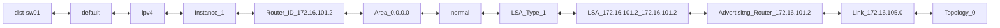

```mermaid
flowchart LR;
dist-sw01 <--> default <--> ipv4 <--> Instance_1 <--> Router_ID_172.16.101.2 <--> Area_0.0.0.0 <--> normal <--> LSA_Type_1 <--> LSA_172.16.101.3_172.16.101.3 <--> Advertisitng_Router_172.16.101.3 <--> Link_172.16.252.10 <--> Topology_0
```

```mermaid
flowchart LR;
dist-sw01 <--> default <--> ipv4 <--> Instance_1 <--> Router_ID_172.16.101.2 <--> Area_0.0.0.0 <--> normal <--> LSA_Type_1 <--> LSA_172.16.252.25_172.16.252.25 <--> Advertisitng_Router_172.16.252.25 <--> Link_172.16.252.10 <--> Topology_0
```

```mermaid
flowchart LR;
dist-sw01 <--> default <--> ipv4 <--> Instance_1 <--> Router_ID_172.16.101.2 <--> Area_0.0.0.0 <--> normal <--> LSA_Type_1 <--> LSA_172.16.252.25_172.16.252.25 <--> Advertisitng_Router_172.16.252.25 <--> Link_172.16.252.2 <--> Topology_0
```

```mermaid
flowchart LR;
dist-sw01 <--> default <--> ipv4 <--> Instance_1 <--> Router_ID_172.16.101.2 <--> Area_0.0.0.0 <--> normal <--> LSA_Type_1 <--> LSA_172.16.252.25_172.16.252.25 <--> Advertisitng_Router_172.16.252.25 <--> Link_172.16.252.24 <--> Topology_0
```

```mermaid
flowchart LR;
dist-sw01 <--> default <--> ipv4 <--> Instance_1 <--> Router_ID_172.16.101.2 <--> Area_0.0.0.0 <--> normal <--> LSA_Type_1 <--> LSA_172.16.252.33_172.16.252.33 <--> Advertisitng_Router_172.16.252.33 <--> Link_172.16.252.18 <--> Topology_0
```
```mermaid
flowchart LR;
dist-sw01 <--> default <--> ipv4 <--> Instance_1 <--> Router_ID_172.16.101.2 <--> Area_0.0.0.0 <--> normal <--> LSA_Type_1 <--> LSA_172.16.252.33_172.16.252.33 <--> Advertisitng_Router_172.16.252.33 <--> Link_172.16.252.28 <--> Topology_0
```
```mermaid
flowchart LR;
dist-sw01 <--> default <--> ipv4 <--> Instance_1 <--> Router_ID_172.16.101.2 <--> Area_0.0.0.0 <--> normal <--> LSA_Type_1 <--> LSA_172.16.252.33_172.16.252.33 <--> Advertisitng_Router_172.16.252.33 <--> Link_172.16.252.32 <--> Topology_0
```
```mermaid
flowchart LR;
dist-sw01 <--> default <--> ipv4 <--> Instance_1 <--> Router_ID_172.16.101.2 <--> Area_0.0.0.0 <--> normal <--> LSA_Type_1 <--> LSA_172.16.252.33_172.16.252.33 <--> Advertisitng_Router_172.16.252.33 <--> Link_172.16.252.6 <--> Topology_0
```


```mermaid
flowchart LR;
dist-sw01 <--> default <--> ipv4 <--> Instance_1 <--> Router_ID_172.16.101.2 <--> Area_0.0.0.0 <--> Ethernet1/3 <--> Neighbor_172.16.252.25 <--> Neighbor_Address_172.16.252.2
```
```mermaid
flowchart LR;
dist-sw01 <--> default <--> ipv4 <--> Instance_1 <--> Router_ID_172.16.101.2 <--> Area_0.0.0.0 <--> Ethernet1/4 <--> Neighbor_172.16.252.33 <--> Neighbor_Address_172.16.252.6
```