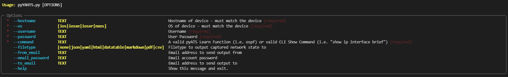

# pyYAHTS
An interpretation of pyATS

pyYAHTS is a dyanmic, on-demand, YAML-free / testbed.yaml free, implementation of pyATS. 

It works with any IOS / IOS-XE / IOS-XR / NXOS device!

The results are Rich JSON printed to the screen

## Requirements
pyYAHTS is an extension of pyATS, which is required, and only runs on Linux operating systems
## Installation

1. pip install pyYAHTS

## Getting Started

pyYAHTS works on any Cisco OS IOS / IOS-XE / IOS-XR / NXOS

pyYAHTS requires the follow options be speficied at runtime:

1. (Required) Hostname of the device - must exactly match the configured hostname
2. (Required) Operating System - Either ios, iosxe, iosxr, or nxos
3. (Required) Username
4. (Required) Password
5. (Required) Command - Either a pyATS Learn Function, such as ospf, or any supported pyATS Parsed CLI Show Command, such as "show ip interface brief"
6. (Optional) Filetype - Creates an output file - 

    Supported filetpyes: JSON, YAML, HTML, Datatable HTML, Markdown, PDF, CSV

7. (Optional) Email - 3 required fields if you want to e-mail the output with GMail

    --from_email - Your GMail Address

    --email_password - Your Gmail Password

    --to_email - The recipients Email
    


For a list of supported Learn Functions please visit [Available Learn Functions](https://pubhub.devnetcloud.com/media/genie-feature-browser/docs/#/models)


For a list of supported Parsers please visit [Available Show Command Parsers](https://pubhub.devnetcloud.com/media/genie-feature-browser/docs/#/parsers)


A sample of "Show IP Interface" Parsers for IOS-XE


## Using pyYAHTS

In any virtual environment with pyATS installed pyYAHTS can be executed several ways

1. Prompted Inputs

```python
(virtualenv)$ pyYAHTS
Hostname: dist-sw01
OS (ios, iosxe, iosxr, nxos): nxos
Username: cisco
Password:
Command: ospf
```

2. Directly supplying options

```python
(virtualenv)$ pyYAHTS --hostname dist-sw01 --os nxos --username cisco --password cisco --command ospf
```

3. Mixing supplied options and prompted responses

```python
(virtualenv)$ pyYAHTS --hostname dist-sw01 --os nxos --username cisco --password cisco
Command: ospf
```

## Creating Output files

If you include the optional --filetype flag you can create JSON and YAML files from the data 

```python
pyYAHTS --hostname dist-sw01 --os nxos --username cisco --password cisco --command ospf --filetype json
pyYAHTS --hostname dist-sw01 --os nxos --username cisco --password cisco --command ospf --filetype yaml
pyYAHTS --hostname dist-sw01 --os nxos --username cisco --password cisco --command ospf --filetype html
pyYAHTS --hostname dist-sw01 --os nxos --username cisco --password cisco --command ospf --filetype datatable
pyYAHTS --hostname dist-sw01 --os nxos --username cisco --password cisco --command ospf --filetype markdown
pyYAHTS --hostname dist-sw01 --os nxos --username cisco --password cisco --command ospf --filetype pdf
pyYAHTS --hostname dist-sw01 --os nxos --username cisco --password cisco --command ospf --filetype csv
```

## E-Mail Network State

If you include the optional E-Mail flags you can send the network state data using GMail 

You will have to enable IMAP permissions on your GMail Account [Enable IMAP in GMail](https://support.google.com/mail/answer/7126229?hl=en#zippy=%2Cstep-check-that-imap-is-turned-on)

You may also have to enable support for [Less Secure Apps](https://support.google.com/accounts/answer/6010255?hl=en)

The three required flags to send an email are:

--from_email - Your GMail Address

--email_password - Your Gmail Password

--to_email - The recipients Email

Additonally if you specify a filetype (--filetype) the output file will be automatically attached to the email
## Help

pyYAHTS includes a handy Rich Click Help! Simple type:

```python
$ pyYAHTS --help
```


## Contact

Please reach out on Twitter [Twitter](https://twitter.com/john_capobianco) or open an issue if you hit any snags or have any questions!