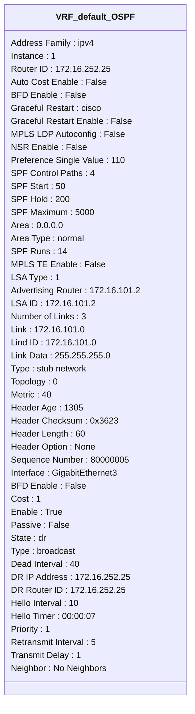

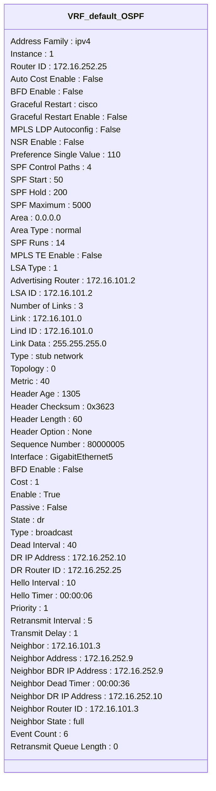
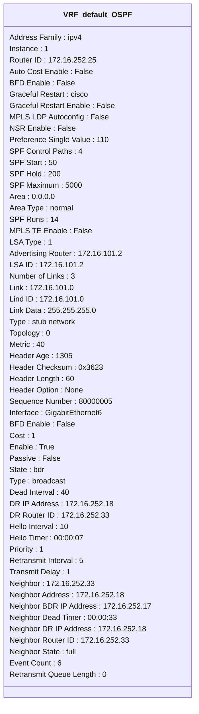
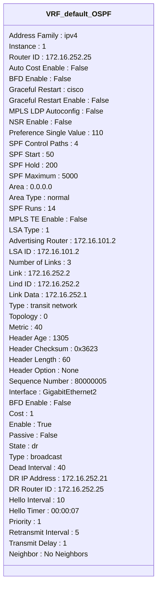
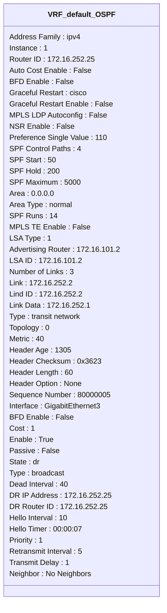

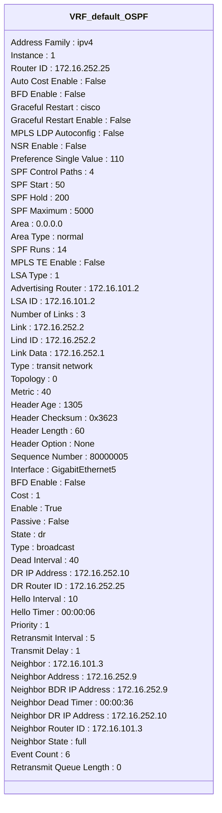

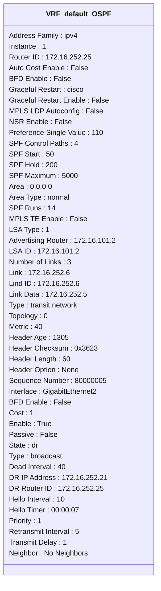
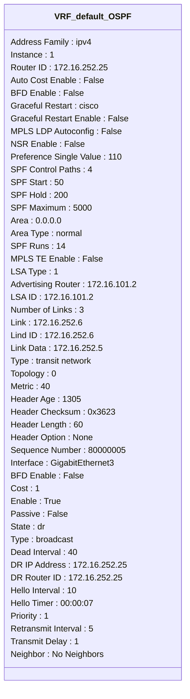
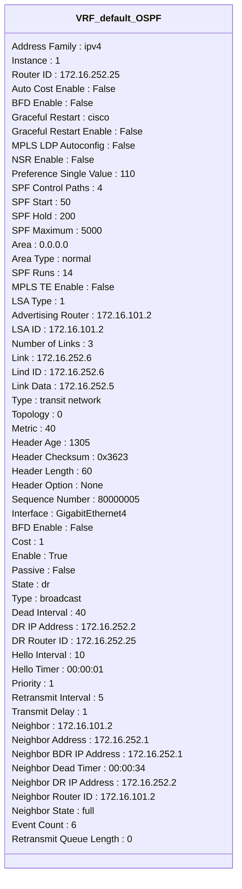
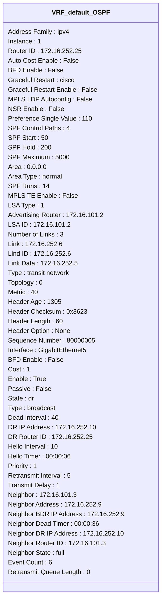
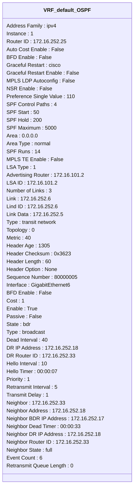


```mermaid
classDiagram
class VRF_default_OSPF{
Address Family : ipv4
Instance : 1
Router ID : 172.16.252.25
Auto Cost Enable : False
BFD Enable : False
Graceful Restart : cisco
Graceful Restart Enable : False
MPLS LDP Autoconfig : False
NSR Enable : False
Preference Single Value : 110
SPF Control Paths : 4
SPF Start : 50
SPF Hold : 200
SPF Maximum : 5000
Area : 0.0.0.0
Area Type : normal
SPF Runs : 14
MPLS TE Enable : False
LSA Type : 1
Advertising Router : 172.16.101.3
LSA ID : 172.16.101.3
Number of Links : 3
Link : 172.16.252.10
Lind ID : 172.16.252.10
Link Data : 172.16.252.9
Type : transit network
Topology : 0
Metric : 40
Header Age : 1293
Header Checksum : 0x87AD
Header Length : 60
Header Option : None
Sequence Number : 80000006
Interface : GigabitEthernet2
BFD Enable : False
Cost : 1
Enable : True
Passive : False
State : dr
Type : broadcast
Dead Interval : 40
DR IP Address : 172.16.252.21
DR Router ID : 172.16.252.25
Hello Interval : 10
Hello Timer : 00:00:07
Priority : 1
Retransmit Interval : 5
Transmit Delay : 1
Neighbor : No Neighbors
}
```
```mermaid
classDiagram
class VRF_default_OSPF{
Address Family : ipv4
Instance : 1
Router ID : 172.16.252.25
Auto Cost Enable : False
BFD Enable : False
Graceful Restart : cisco
Graceful Restart Enable : False
MPLS LDP Autoconfig : False
NSR Enable : False
Preference Single Value : 110
SPF Control Paths : 4
SPF Start : 50
SPF Hold : 200
SPF Maximum : 5000
Area : 0.0.0.0
Area Type : normal
SPF Runs : 14
MPLS TE Enable : False
LSA Type : 1
Advertising Router : 172.16.101.3
LSA ID : 172.16.101.3
Number of Links : 3
Link : 172.16.252.10
Lind ID : 172.16.252.10
Link Data : 172.16.252.9
Type : transit network
Topology : 0
Metric : 40
Header Age : 1293
Header Checksum : 0x87AD
Header Length : 60
Header Option : None
Sequence Number : 80000006
Interface : GigabitEthernet3
BFD Enable : False
Cost : 1
Enable : True
Passive : False
State : dr
Type : broadcast
Dead Interval : 40
DR IP Address : 172.16.252.25
DR Router ID : 172.16.252.25
Hello Interval : 10
Hello Timer : 00:00:07
Priority : 1
Retransmit Interval : 5
Transmit Delay : 1
Neighbor : No Neighbors
}
```
```mermaid
classDiagram
class VRF_default_OSPF{
Address Family : ipv4
Instance : 1
Router ID : 172.16.252.25
Auto Cost Enable : False
BFD Enable : False
Graceful Restart : cisco
Graceful Restart Enable : False
MPLS LDP Autoconfig : False
NSR Enable : False
Preference Single Value : 110
SPF Control Paths : 4
SPF Start : 50
SPF Hold : 200
SPF Maximum : 5000
Area : 0.0.0.0
Area Type : normal
SPF Runs : 14
MPLS TE Enable : False
LSA Type : 1
Advertising Router : 172.16.101.3
LSA ID : 172.16.101.3
Number of Links : 3
Link : 172.16.252.10
Lind ID : 172.16.252.10
Link Data : 172.16.252.9
Type : transit network
Topology : 0
Metric : 40
Header Age : 1293
Header Checksum : 0x87AD
Header Length : 60
Header Option : None
Sequence Number : 80000006
Interface : GigabitEthernet4
BFD Enable : False
Cost : 1
Enable : True
Passive : False
State : dr
Type : broadcast
Dead Interval : 40
DR IP Address : 172.16.252.2
DR Router ID : 172.16.252.25
Hello Interval : 10
Hello Timer : 00:00:01
Priority : 1
Retransmit Interval : 5
Transmit Delay : 1
Neighbor : 172.16.101.2
Neighbor Address : 172.16.252.1
Neighbor BDR IP Address : 172.16.252.1
Neighbor Dead Timer : 00:00:34
Neighbor DR IP Address : 172.16.252.2
Neighbor Router ID : 172.16.101.2
Neighbor State : full
Event Count : 6
Retransmit Queue Length : 0
}
```
```mermaid
classDiagram
class VRF_default_OSPF{
Address Family : ipv4
Instance : 1
Router ID : 172.16.252.25
Auto Cost Enable : False
BFD Enable : False
Graceful Restart : cisco
Graceful Restart Enable : False
MPLS LDP Autoconfig : False
NSR Enable : False
Preference Single Value : 110
SPF Control Paths : 4
SPF Start : 50
SPF Hold : 200
SPF Maximum : 5000
Area : 0.0.0.0
Area Type : normal
SPF Runs : 14
MPLS TE Enable : False
LSA Type : 1
Advertising Router : 172.16.101.3
LSA ID : 172.16.101.3
Number of Links : 3
Link : 172.16.252.10
Lind ID : 172.16.252.10
Link Data : 172.16.252.9
Type : transit network
Topology : 0
Metric : 40
Header Age : 1293
Header Checksum : 0x87AD
Header Length : 60
Header Option : None
Sequence Number : 80000006
Interface : GigabitEthernet5
BFD Enable : False
Cost : 1
Enable : True
Passive : False
State : dr
Type : broadcast
Dead Interval : 40
DR IP Address : 172.16.252.10
DR Router ID : 172.16.252.25
Hello Interval : 10
Hello Timer : 00:00:06
Priority : 1
Retransmit Interval : 5
Transmit Delay : 1
Neighbor : 172.16.101.3
Neighbor Address : 172.16.252.9
Neighbor BDR IP Address : 172.16.252.9
Neighbor Dead Timer : 00:00:36
Neighbor DR IP Address : 172.16.252.10
Neighbor Router ID : 172.16.101.3
Neighbor State : full
Event Count : 6
Retransmit Queue Length : 0
}
```
```mermaid
classDiagram
class VRF_default_OSPF{
Address Family : ipv4
Instance : 1
Router ID : 172.16.252.25
Auto Cost Enable : False
BFD Enable : False
Graceful Restart : cisco
Graceful Restart Enable : False
MPLS LDP Autoconfig : False
NSR Enable : False
Preference Single Value : 110
SPF Control Paths : 4
SPF Start : 50
SPF Hold : 200
SPF Maximum : 5000
Area : 0.0.0.0
Area Type : normal
SPF Runs : 14
MPLS TE Enable : False
LSA Type : 1
Advertising Router : 172.16.101.3
LSA ID : 172.16.101.3
Number of Links : 3
Link : 172.16.252.10
Lind ID : 172.16.252.10
Link Data : 172.16.252.9
Type : transit network
Topology : 0
Metric : 40
Header Age : 1293
Header Checksum : 0x87AD
Header Length : 60
Header Option : None
Sequence Number : 80000006
Interface : GigabitEthernet6
BFD Enable : False
Cost : 1
Enable : True
Passive : False
State : bdr
Type : broadcast
Dead Interval : 40
DR IP Address : 172.16.252.18
DR Router ID : 172.16.252.33
Hello Interval : 10
Hello Timer : 00:00:07
Priority : 1
Retransmit Interval : 5
Transmit Delay : 1
Neighbor : 172.16.252.33
Neighbor Address : 172.16.252.18
Neighbor BDR IP Address : 172.16.252.17
Neighbor Dead Timer : 00:00:33
Neighbor DR IP Address : 172.16.252.18
Neighbor Router ID : 172.16.252.33
Neighbor State : full
Event Count : 6
Retransmit Queue Length : 0
}
```
```mermaid
classDiagram
class VRF_default_OSPF{
Address Family : ipv4
Instance : 1
Router ID : 172.16.252.25
Auto Cost Enable : False
BFD Enable : False
Graceful Restart : cisco
Graceful Restart Enable : False
MPLS LDP Autoconfig : False
NSR Enable : False
Preference Single Value : 110
SPF Control Paths : 4
SPF Start : 50
SPF Hold : 200
SPF Maximum : 5000
Area : 0.0.0.0
Area Type : normal
SPF Runs : 14
MPLS TE Enable : False
LSA Type : 1
Advertising Router : 172.16.101.3
LSA ID : 172.16.101.3
Number of Links : 3
Link : 172.16.252.14
Lind ID : 172.16.252.14
Link Data : 172.16.252.13
Type : transit network
Topology : 0
Metric : 40
Header Age : 1293
Header Checksum : 0x87AD
Header Length : 60
Header Option : None
Sequence Number : 80000006
Interface : GigabitEthernet2
BFD Enable : False
Cost : 1
Enable : True
Passive : False
State : dr
Type : broadcast
Dead Interval : 40
DR IP Address : 172.16.252.21
DR Router ID : 172.16.252.25
Hello Interval : 10
Hello Timer : 00:00:07
Priority : 1
Retransmit Interval : 5
Transmit Delay : 1
Neighbor : No Neighbors
}
```
```mermaid
classDiagram
class VRF_default_OSPF{
Address Family : ipv4
Instance : 1
Router ID : 172.16.252.25
Auto Cost Enable : False
BFD Enable : False
Graceful Restart : cisco
Graceful Restart Enable : False
MPLS LDP Autoconfig : False
NSR Enable : False
Preference Single Value : 110
SPF Control Paths : 4
SPF Start : 50
SPF Hold : 200
SPF Maximum : 5000
Area : 0.0.0.0
Area Type : normal
SPF Runs : 14
MPLS TE Enable : False
LSA Type : 1
Advertising Router : 172.16.101.3
LSA ID : 172.16.101.3
Number of Links : 3
Link : 172.16.252.14
Lind ID : 172.16.252.14
Link Data : 172.16.252.13
Type : transit network
Topology : 0
Metric : 40
Header Age : 1293
Header Checksum : 0x87AD
Header Length : 60
Header Option : None
Sequence Number : 80000006
Interface : GigabitEthernet3
BFD Enable : False
Cost : 1
Enable : True
Passive : False
State : dr
Type : broadcast
Dead Interval : 40
DR IP Address : 172.16.252.25
DR Router ID : 172.16.252.25
Hello Interval : 10
Hello Timer : 00:00:07
Priority : 1
Retransmit Interval : 5
Transmit Delay : 1
Neighbor : No Neighbors
}
```
```mermaid
classDiagram
class VRF_default_OSPF{
Address Family : ipv4
Instance : 1
Router ID : 172.16.252.25
Auto Cost Enable : False
BFD Enable : False
Graceful Restart : cisco
Graceful Restart Enable : False
MPLS LDP Autoconfig : False
NSR Enable : False
Preference Single Value : 110
SPF Control Paths : 4
SPF Start : 50
SPF Hold : 200
SPF Maximum : 5000
Area : 0.0.0.0
Area Type : normal
SPF Runs : 14
MPLS TE Enable : False
LSA Type : 1
Advertising Router : 172.16.101.3
LSA ID : 172.16.101.3
Number of Links : 3
Link : 172.16.252.14
Lind ID : 172.16.252.14
Link Data : 172.16.252.13
Type : transit network
Topology : 0
Metric : 40
Header Age : 1293
Header Checksum : 0x87AD
Header Length : 60
Header Option : None
Sequence Number : 80000006
Interface : GigabitEthernet4
BFD Enable : False
Cost : 1
Enable : True
Passive : False
State : dr
Type : broadcast
Dead Interval : 40
DR IP Address : 172.16.252.2
DR Router ID : 172.16.252.25
Hello Interval : 10
Hello Timer : 00:00:01
Priority : 1
Retransmit Interval : 5
Transmit Delay : 1
Neighbor : 172.16.101.2
Neighbor Address : 172.16.252.1
Neighbor BDR IP Address : 172.16.252.1
Neighbor Dead Timer : 00:00:34
Neighbor DR IP Address : 172.16.252.2
Neighbor Router ID : 172.16.101.2
Neighbor State : full
Event Count : 6
Retransmit Queue Length : 0
}
```
```mermaid
classDiagram
class VRF_default_OSPF{
Address Family : ipv4
Instance : 1
Router ID : 172.16.252.25
Auto Cost Enable : False
BFD Enable : False
Graceful Restart : cisco
Graceful Restart Enable : False
MPLS LDP Autoconfig : False
NSR Enable : False
Preference Single Value : 110
SPF Control Paths : 4
SPF Start : 50
SPF Hold : 200
SPF Maximum : 5000
Area : 0.0.0.0
Area Type : normal
SPF Runs : 14
MPLS TE Enable : False
LSA Type : 1
Advertising Router : 172.16.101.3
LSA ID : 172.16.101.3
Number of Links : 3
Link : 172.16.252.14
Lind ID : 172.16.252.14
Link Data : 172.16.252.13
Type : transit network
Topology : 0
Metric : 40
Header Age : 1293
Header Checksum : 0x87AD
Header Length : 60
Header Option : None
Sequence Number : 80000006
Interface : GigabitEthernet5
BFD Enable : False
Cost : 1
Enable : True
Passive : False
State : dr
Type : broadcast
Dead Interval : 40
DR IP Address : 172.16.252.10
DR Router ID : 172.16.252.25
Hello Interval : 10
Hello Timer : 00:00:06
Priority : 1
Retransmit Interval : 5
Transmit Delay : 1
Neighbor : 172.16.101.3
Neighbor Address : 172.16.252.9
Neighbor BDR IP Address : 172.16.252.9
Neighbor Dead Timer : 00:00:36
Neighbor DR IP Address : 172.16.252.10
Neighbor Router ID : 172.16.101.3
Neighbor State : full
Event Count : 6
Retransmit Queue Length : 0
}
```
```mermaid
classDiagram
class VRF_default_OSPF{
Address Family : ipv4
Instance : 1
Router ID : 172.16.252.25
Auto Cost Enable : False
BFD Enable : False
Graceful Restart : cisco
Graceful Restart Enable : False
MPLS LDP Autoconfig : False
NSR Enable : False
Preference Single Value : 110
SPF Control Paths : 4
SPF Start : 50
SPF Hold : 200
SPF Maximum : 5000
Area : 0.0.0.0
Area Type : normal
SPF Runs : 14
MPLS TE Enable : False
LSA Type : 1
Advertising Router : 172.16.101.3
LSA ID : 172.16.101.3
Number of Links : 3
Link : 172.16.252.14
Lind ID : 172.16.252.14
Link Data : 172.16.252.13
Type : transit network
Topology : 0
Metric : 40
Header Age : 1293
Header Checksum : 0x87AD
Header Length : 60
Header Option : None
Sequence Number : 80000006
Interface : GigabitEthernet6
BFD Enable : False
Cost : 1
Enable : True
Passive : False
State : bdr
Type : broadcast
Dead Interval : 40
DR IP Address : 172.16.252.18
DR Router ID : 172.16.252.33
Hello Interval : 10
Hello Timer : 00:00:07
Priority : 1
Retransmit Interval : 5
Transmit Delay : 1
Neighbor : 172.16.252.33
Neighbor Address : 172.16.252.18
Neighbor BDR IP Address : 172.16.252.17
Neighbor Dead Timer : 00:00:33
Neighbor DR IP Address : 172.16.252.18
Neighbor Router ID : 172.16.252.33
Neighbor State : full
Event Count : 6
Retransmit Queue Length : 0
}
```
```mermaid
classDiagram
class VRF_default_OSPF{
Address Family : ipv4
Instance : 1
Router ID : 172.16.252.25
Auto Cost Enable : False
BFD Enable : False
Graceful Restart : cisco
Graceful Restart Enable : False
MPLS LDP Autoconfig : False
NSR Enable : False
Preference Single Value : 110
SPF Control Paths : 4
SPF Start : 50
SPF Hold : 200
SPF Maximum : 5000
Area : 0.0.0.0
Area Type : normal
SPF Runs : 14
MPLS TE Enable : False
LSA Type : 1
Advertising Router : 172.16.252.25
LSA ID : 172.16.252.25
Number of Links : 5
Link : 172.16.252.10
Lind ID : 172.16.252.10
Link Data : 172.16.252.10
Type : transit network
Topology : 0
Metric : 1
Header Age : 1048
Header Checksum : 0xEF21
Header Length : 84
Header Option : None
Sequence Number : 8000000C
Interface : GigabitEthernet2
BFD Enable : False
Cost : 1
Enable : True
Passive : False
State : dr
Type : broadcast
Dead Interval : 40
DR IP Address : 172.16.252.21
DR Router ID : 172.16.252.25
Hello Interval : 10
Hello Timer : 00:00:07
Priority : 1
Retransmit Interval : 5
Transmit Delay : 1
Neighbor : No Neighbors
}
```
```mermaid
classDiagram
class VRF_default_OSPF{
Address Family : ipv4
Instance : 1
Router ID : 172.16.252.25
Auto Cost Enable : False
BFD Enable : False
Graceful Restart : cisco
Graceful Restart Enable : False
MPLS LDP Autoconfig : False
NSR Enable : False
Preference Single Value : 110
SPF Control Paths : 4
SPF Start : 50
SPF Hold : 200
SPF Maximum : 5000
Area : 0.0.0.0
Area Type : normal
SPF Runs : 14
MPLS TE Enable : False
LSA Type : 1
Advertising Router : 172.16.252.25
LSA ID : 172.16.252.25
Number of Links : 5
Link : 172.16.252.10
Lind ID : 172.16.252.10
Link Data : 172.16.252.10
Type : transit network
Topology : 0
Metric : 1
Header Age : 1048
Header Checksum : 0xEF21
Header Length : 84
Header Option : None
Sequence Number : 8000000C
Interface : GigabitEthernet3
BFD Enable : False
Cost : 1
Enable : True
Passive : False
State : dr
Type : broadcast
Dead Interval : 40
DR IP Address : 172.16.252.25
DR Router ID : 172.16.252.25
Hello Interval : 10
Hello Timer : 00:00:07
Priority : 1
Retransmit Interval : 5
Transmit Delay : 1
Neighbor : No Neighbors
}
```
```mermaid
classDiagram
class VRF_default_OSPF{
Address Family : ipv4
Instance : 1
Router ID : 172.16.252.25
Auto Cost Enable : False
BFD Enable : False
Graceful Restart : cisco
Graceful Restart Enable : False
MPLS LDP Autoconfig : False
NSR Enable : False
Preference Single Value : 110
SPF Control Paths : 4
SPF Start : 50
SPF Hold : 200
SPF Maximum : 5000
Area : 0.0.0.0
Area Type : normal
SPF Runs : 14
MPLS TE Enable : False
LSA Type : 1
Advertising Router : 172.16.252.25
LSA ID : 172.16.252.25
Number of Links : 5
Link : 172.16.252.10
Lind ID : 172.16.252.10
Link Data : 172.16.252.10
Type : transit network
Topology : 0
Metric : 1
Header Age : 1048
Header Checksum : 0xEF21
Header Length : 84
Header Option : None
Sequence Number : 8000000C
Interface : GigabitEthernet4
BFD Enable : False
Cost : 1
Enable : True
Passive : False
State : dr
Type : broadcast
Dead Interval : 40
DR IP Address : 172.16.252.2
DR Router ID : 172.16.252.25
Hello Interval : 10
Hello Timer : 00:00:01
Priority : 1
Retransmit Interval : 5
Transmit Delay : 1
Neighbor : 172.16.101.2
Neighbor Address : 172.16.252.1
Neighbor BDR IP Address : 172.16.252.1
Neighbor Dead Timer : 00:00:34
Neighbor DR IP Address : 172.16.252.2
Neighbor Router ID : 172.16.101.2
Neighbor State : full
Event Count : 6
Retransmit Queue Length : 0
}
```
```mermaid
classDiagram
class VRF_default_OSPF{
Address Family : ipv4
Instance : 1
Router ID : 172.16.252.25
Auto Cost Enable : False
BFD Enable : False
Graceful Restart : cisco
Graceful Restart Enable : False
MPLS LDP Autoconfig : False
NSR Enable : False
Preference Single Value : 110
SPF Control Paths : 4
SPF Start : 50
SPF Hold : 200
SPF Maximum : 5000
Area : 0.0.0.0
Area Type : normal
SPF Runs : 14
MPLS TE Enable : False
LSA Type : 1
Advertising Router : 172.16.252.25
LSA ID : 172.16.252.25
Number of Links : 5
Link : 172.16.252.10
Lind ID : 172.16.252.10
Link Data : 172.16.252.10
Type : transit network
Topology : 0
Metric : 1
Header Age : 1048
Header Checksum : 0xEF21
Header Length : 84
Header Option : None
Sequence Number : 8000000C
Interface : GigabitEthernet5
BFD Enable : False
Cost : 1
Enable : True
Passive : False
State : dr
Type : broadcast
Dead Interval : 40
DR IP Address : 172.16.252.10
DR Router ID : 172.16.252.25
Hello Interval : 10
Hello Timer : 00:00:06
Priority : 1
Retransmit Interval : 5
Transmit Delay : 1
Neighbor : 172.16.101.3
Neighbor Address : 172.16.252.9
Neighbor BDR IP Address : 172.16.252.9
Neighbor Dead Timer : 00:00:36
Neighbor DR IP Address : 172.16.252.10
Neighbor Router ID : 172.16.101.3
Neighbor State : full
Event Count : 6
Retransmit Queue Length : 0
}
```
```mermaid
classDiagram
class VRF_default_OSPF{
Address Family : ipv4
Instance : 1
Router ID : 172.16.252.25
Auto Cost Enable : False
BFD Enable : False
Graceful Restart : cisco
Graceful Restart Enable : False
MPLS LDP Autoconfig : False
NSR Enable : False
Preference Single Value : 110
SPF Control Paths : 4
SPF Start : 50
SPF Hold : 200
SPF Maximum : 5000
Area : 0.0.0.0
Area Type : normal
SPF Runs : 14
MPLS TE Enable : False
LSA Type : 1
Advertising Router : 172.16.252.25
LSA ID : 172.16.252.25
Number of Links : 5
Link : 172.16.252.10
Lind ID : 172.16.252.10
Link Data : 172.16.252.10
Type : transit network
Topology : 0
Metric : 1
Header Age : 1048
Header Checksum : 0xEF21
Header Length : 84
Header Option : None
Sequence Number : 8000000C
Interface : GigabitEthernet6
BFD Enable : False
Cost : 1
Enable : True
Passive : False
State : bdr
Type : broadcast
Dead Interval : 40
DR IP Address : 172.16.252.18
DR Router ID : 172.16.252.33
Hello Interval : 10
Hello Timer : 00:00:07
Priority : 1
Retransmit Interval : 5
Transmit Delay : 1
Neighbor : 172.16.252.33
Neighbor Address : 172.16.252.18
Neighbor BDR IP Address : 172.16.252.17
Neighbor Dead Timer : 00:00:33
Neighbor DR IP Address : 172.16.252.18
Neighbor Router ID : 172.16.252.33
Neighbor State : full
Event Count : 6
Retransmit Queue Length : 0
}
```
```mermaid
classDiagram
class VRF_default_OSPF{
Address Family : ipv4
Instance : 1
Router ID : 172.16.252.25
Auto Cost Enable : False
BFD Enable : False
Graceful Restart : cisco
Graceful Restart Enable : False
MPLS LDP Autoconfig : False
NSR Enable : False
Preference Single Value : 110
SPF Control Paths : 4
SPF Start : 50
SPF Hold : 200
SPF Maximum : 5000
Area : 0.0.0.0
Area Type : normal
SPF Runs : 14
MPLS TE Enable : False
LSA Type : 1
Advertising Router : 172.16.252.25
LSA ID : 172.16.252.25
Number of Links : 5
Link : 172.16.252.18
Lind ID : 172.16.252.18
Link Data : 172.16.252.17
Type : transit network
Topology : 0
Metric : 1
Header Age : 1048
Header Checksum : 0xEF21
Header Length : 84
Header Option : None
Sequence Number : 8000000C
Interface : GigabitEthernet2
BFD Enable : False
Cost : 1
Enable : True
Passive : False
State : dr
Type : broadcast
Dead Interval : 40
DR IP Address : 172.16.252.21
DR Router ID : 172.16.252.25
Hello Interval : 10
Hello Timer : 00:00:07
Priority : 1
Retransmit Interval : 5
Transmit Delay : 1
Neighbor : No Neighbors
}
```
```mermaid
classDiagram
class VRF_default_OSPF{
Address Family : ipv4
Instance : 1
Router ID : 172.16.252.25
Auto Cost Enable : False
BFD Enable : False
Graceful Restart : cisco
Graceful Restart Enable : False
MPLS LDP Autoconfig : False
NSR Enable : False
Preference Single Value : 110
SPF Control Paths : 4
SPF Start : 50
SPF Hold : 200
SPF Maximum : 5000
Area : 0.0.0.0
Area Type : normal
SPF Runs : 14
MPLS TE Enable : False
LSA Type : 1
Advertising Router : 172.16.252.25
LSA ID : 172.16.252.25
Number of Links : 5
Link : 172.16.252.18
Lind ID : 172.16.252.18
Link Data : 172.16.252.17
Type : transit network
Topology : 0
Metric : 1
Header Age : 1048
Header Checksum : 0xEF21
Header Length : 84
Header Option : None
Sequence Number : 8000000C
Interface : GigabitEthernet3
BFD Enable : False
Cost : 1
Enable : True
Passive : False
State : dr
Type : broadcast
Dead Interval : 40
DR IP Address : 172.16.252.25
DR Router ID : 172.16.252.25
Hello Interval : 10
Hello Timer : 00:00:07
Priority : 1
Retransmit Interval : 5
Transmit Delay : 1
Neighbor : No Neighbors
}
```
```mermaid
classDiagram
class VRF_default_OSPF{
Address Family : ipv4
Instance : 1
Router ID : 172.16.252.25
Auto Cost Enable : False
BFD Enable : False
Graceful Restart : cisco
Graceful Restart Enable : False
MPLS LDP Autoconfig : False
NSR Enable : False
Preference Single Value : 110
SPF Control Paths : 4
SPF Start : 50
SPF Hold : 200
SPF Maximum : 5000
Area : 0.0.0.0
Area Type : normal
SPF Runs : 14
MPLS TE Enable : False
LSA Type : 1
Advertising Router : 172.16.252.25
LSA ID : 172.16.252.25
Number of Links : 5
Link : 172.16.252.18
Lind ID : 172.16.252.18
Link Data : 172.16.252.17
Type : transit network
Topology : 0
Metric : 1
Header Age : 1048
Header Checksum : 0xEF21
Header Length : 84
Header Option : None
Sequence Number : 8000000C
Interface : GigabitEthernet4
BFD Enable : False
Cost : 1
Enable : True
Passive : False
State : dr
Type : broadcast
Dead Interval : 40
DR IP Address : 172.16.252.2
DR Router ID : 172.16.252.25
Hello Interval : 10
Hello Timer : 00:00:01
Priority : 1
Retransmit Interval : 5
Transmit Delay : 1
Neighbor : 172.16.101.2
Neighbor Address : 172.16.252.1
Neighbor BDR IP Address : 172.16.252.1
Neighbor Dead Timer : 00:00:34
Neighbor DR IP Address : 172.16.252.2
Neighbor Router ID : 172.16.101.2
Neighbor State : full
Event Count : 6
Retransmit Queue Length : 0
}
```
```mermaid
classDiagram
class VRF_default_OSPF{
Address Family : ipv4
Instance : 1
Router ID : 172.16.252.25
Auto Cost Enable : False
BFD Enable : False
Graceful Restart : cisco
Graceful Restart Enable : False
MPLS LDP Autoconfig : False
NSR Enable : False
Preference Single Value : 110
SPF Control Paths : 4
SPF Start : 50
SPF Hold : 200
SPF Maximum : 5000
Area : 0.0.0.0
Area Type : normal
SPF Runs : 14
MPLS TE Enable : False
LSA Type : 1
Advertising Router : 172.16.252.25
LSA ID : 172.16.252.25
Number of Links : 5
Link : 172.16.252.18
Lind ID : 172.16.252.18
Link Data : 172.16.252.17
Type : transit network
Topology : 0
Metric : 1
Header Age : 1048
Header Checksum : 0xEF21
Header Length : 84
Header Option : None
Sequence Number : 8000000C
Interface : GigabitEthernet5
BFD Enable : False
Cost : 1
Enable : True
Passive : False
State : dr
Type : broadcast
Dead Interval : 40
DR IP Address : 172.16.252.10
DR Router ID : 172.16.252.25
Hello Interval : 10
Hello Timer : 00:00:06
Priority : 1
Retransmit Interval : 5
Transmit Delay : 1
Neighbor : 172.16.101.3
Neighbor Address : 172.16.252.9
Neighbor BDR IP Address : 172.16.252.9
Neighbor Dead Timer : 00:00:36
Neighbor DR IP Address : 172.16.252.10
Neighbor Router ID : 172.16.101.3
Neighbor State : full
Event Count : 6
Retransmit Queue Length : 0
}
```
```mermaid
classDiagram
class VRF_default_OSPF{
Address Family : ipv4
Instance : 1
Router ID : 172.16.252.25
Auto Cost Enable : False
BFD Enable : False
Graceful Restart : cisco
Graceful Restart Enable : False
MPLS LDP Autoconfig : False
NSR Enable : False
Preference Single Value : 110
SPF Control Paths : 4
SPF Start : 50
SPF Hold : 200
SPF Maximum : 5000
Area : 0.0.0.0
Area Type : normal
SPF Runs : 14
MPLS TE Enable : False
LSA Type : 1
Advertising Router : 172.16.252.25
LSA ID : 172.16.252.25
Number of Links : 5
Link : 172.16.252.18
Lind ID : 172.16.252.18
Link Data : 172.16.252.17
Type : transit network
Topology : 0
Metric : 1
Header Age : 1048
Header Checksum : 0xEF21
Header Length : 84
Header Option : None
Sequence Number : 8000000C
Interface : GigabitEthernet6
BFD Enable : False
Cost : 1
Enable : True
Passive : False
State : bdr
Type : broadcast
Dead Interval : 40
DR IP Address : 172.16.252.18
DR Router ID : 172.16.252.33
Hello Interval : 10
Hello Timer : 00:00:07
Priority : 1
Retransmit Interval : 5
Transmit Delay : 1
Neighbor : 172.16.252.33
Neighbor Address : 172.16.252.18
Neighbor BDR IP Address : 172.16.252.17
Neighbor Dead Timer : 00:00:33
Neighbor DR IP Address : 172.16.252.18
Neighbor Router ID : 172.16.252.33
Neighbor State : full
Event Count : 6
Retransmit Queue Length : 0
}
```
```mermaid
classDiagram
class VRF_default_OSPF{
Address Family : ipv4
Instance : 1
Router ID : 172.16.252.25
Auto Cost Enable : False
BFD Enable : False
Graceful Restart : cisco
Graceful Restart Enable : False
MPLS LDP Autoconfig : False
NSR Enable : False
Preference Single Value : 110
SPF Control Paths : 4
SPF Start : 50
SPF Hold : 200
SPF Maximum : 5000
Area : 0.0.0.0
Area Type : normal
SPF Runs : 14
MPLS TE Enable : False
LSA Type : 1
Advertising Router : 172.16.252.25
LSA ID : 172.16.252.25
Number of Links : 5
Link : 172.16.252.2
Lind ID : 172.16.252.2
Link Data : 172.16.252.2
Type : transit network
Topology : 0
Metric : 1
Header Age : 1048
Header Checksum : 0xEF21
Header Length : 84
Header Option : None
Sequence Number : 8000000C
Interface : GigabitEthernet2
BFD Enable : False
Cost : 1
Enable : True
Passive : False
State : dr
Type : broadcast
Dead Interval : 40
DR IP Address : 172.16.252.21
DR Router ID : 172.16.252.25
Hello Interval : 10
Hello Timer : 00:00:07
Priority : 1
Retransmit Interval : 5
Transmit Delay : 1
Neighbor : No Neighbors
}
```
```mermaid
classDiagram
class VRF_default_OSPF{
Address Family : ipv4
Instance : 1
Router ID : 172.16.252.25
Auto Cost Enable : False
BFD Enable : False
Graceful Restart : cisco
Graceful Restart Enable : False
MPLS LDP Autoconfig : False
NSR Enable : False
Preference Single Value : 110
SPF Control Paths : 4
SPF Start : 50
SPF Hold : 200
SPF Maximum : 5000
Area : 0.0.0.0
Area Type : normal
SPF Runs : 14
MPLS TE Enable : False
LSA Type : 1
Advertising Router : 172.16.252.25
LSA ID : 172.16.252.25
Number of Links : 5
Link : 172.16.252.2
Lind ID : 172.16.252.2
Link Data : 172.16.252.2
Type : transit network
Topology : 0
Metric : 1
Header Age : 1048
Header Checksum : 0xEF21
Header Length : 84
Header Option : None
Sequence Number : 8000000C
Interface : GigabitEthernet3
BFD Enable : False
Cost : 1
Enable : True
Passive : False
State : dr
Type : broadcast
Dead Interval : 40
DR IP Address : 172.16.252.25
DR Router ID : 172.16.252.25
Hello Interval : 10
Hello Timer : 00:00:07
Priority : 1
Retransmit Interval : 5
Transmit Delay : 1
Neighbor : No Neighbors
}
```
```mermaid
classDiagram
class VRF_default_OSPF{
Address Family : ipv4
Instance : 1
Router ID : 172.16.252.25
Auto Cost Enable : False
BFD Enable : False
Graceful Restart : cisco
Graceful Restart Enable : False
MPLS LDP Autoconfig : False
NSR Enable : False
Preference Single Value : 110
SPF Control Paths : 4
SPF Start : 50
SPF Hold : 200
SPF Maximum : 5000
Area : 0.0.0.0
Area Type : normal
SPF Runs : 14
MPLS TE Enable : False
LSA Type : 1
Advertising Router : 172.16.252.25
LSA ID : 172.16.252.25
Number of Links : 5
Link : 172.16.252.2
Lind ID : 172.16.252.2
Link Data : 172.16.252.2
Type : transit network
Topology : 0
Metric : 1
Header Age : 1048
Header Checksum : 0xEF21
Header Length : 84
Header Option : None
Sequence Number : 8000000C
Interface : GigabitEthernet4
BFD Enable : False
Cost : 1
Enable : True
Passive : False
State : dr
Type : broadcast
Dead Interval : 40
DR IP Address : 172.16.252.2
DR Router ID : 172.16.252.25
Hello Interval : 10
Hello Timer : 00:00:01
Priority : 1
Retransmit Interval : 5
Transmit Delay : 1
Neighbor : 172.16.101.2
Neighbor Address : 172.16.252.1
Neighbor BDR IP Address : 172.16.252.1
Neighbor Dead Timer : 00:00:34
Neighbor DR IP Address : 172.16.252.2
Neighbor Router ID : 172.16.101.2
Neighbor State : full
Event Count : 6
Retransmit Queue Length : 0
}
```
```mermaid
classDiagram
class VRF_default_OSPF{
Address Family : ipv4
Instance : 1
Router ID : 172.16.252.25
Auto Cost Enable : False
BFD Enable : False
Graceful Restart : cisco
Graceful Restart Enable : False
MPLS LDP Autoconfig : False
NSR Enable : False
Preference Single Value : 110
SPF Control Paths : 4
SPF Start : 50
SPF Hold : 200
SPF Maximum : 5000
Area : 0.0.0.0
Area Type : normal
SPF Runs : 14
MPLS TE Enable : False
LSA Type : 1
Advertising Router : 172.16.252.25
LSA ID : 172.16.252.25
Number of Links : 5
Link : 172.16.252.2
Lind ID : 172.16.252.2
Link Data : 172.16.252.2
Type : transit network
Topology : 0
Metric : 1
Header Age : 1048
Header Checksum : 0xEF21
Header Length : 84
Header Option : None
Sequence Number : 8000000C
Interface : GigabitEthernet5
BFD Enable : False
Cost : 1
Enable : True
Passive : False
State : dr
Type : broadcast
Dead Interval : 40
DR IP Address : 172.16.252.10
DR Router ID : 172.16.252.25
Hello Interval : 10
Hello Timer : 00:00:06
Priority : 1
Retransmit Interval : 5
Transmit Delay : 1
Neighbor : 172.16.101.3
Neighbor Address : 172.16.252.9
Neighbor BDR IP Address : 172.16.252.9
Neighbor Dead Timer : 00:00:36
Neighbor DR IP Address : 172.16.252.10
Neighbor Router ID : 172.16.101.3
Neighbor State : full
Event Count : 6
Retransmit Queue Length : 0
}
```
```mermaid
classDiagram
class VRF_default_OSPF{
Address Family : ipv4
Instance : 1
Router ID : 172.16.252.25
Auto Cost Enable : False
BFD Enable : False
Graceful Restart : cisco
Graceful Restart Enable : False
MPLS LDP Autoconfig : False
NSR Enable : False
Preference Single Value : 110
SPF Control Paths : 4
SPF Start : 50
SPF Hold : 200
SPF Maximum : 5000
Area : 0.0.0.0
Area Type : normal
SPF Runs : 14
MPLS TE Enable : False
LSA Type : 1
Advertising Router : 172.16.252.25
LSA ID : 172.16.252.25
Number of Links : 5
Link : 172.16.252.2
Lind ID : 172.16.252.2
Link Data : 172.16.252.2
Type : transit network
Topology : 0
Metric : 1
Header Age : 1048
Header Checksum : 0xEF21
Header Length : 84
Header Option : None
Sequence Number : 8000000C
Interface : GigabitEthernet6
BFD Enable : False
Cost : 1
Enable : True
Passive : False
State : bdr
Type : broadcast
Dead Interval : 40
DR IP Address : 172.16.252.18
DR Router ID : 172.16.252.33
Hello Interval : 10
Hello Timer : 00:00:07
Priority : 1
Retransmit Interval : 5
Transmit Delay : 1
Neighbor : 172.16.252.33
Neighbor Address : 172.16.252.18
Neighbor BDR IP Address : 172.16.252.17
Neighbor Dead Timer : 00:00:33
Neighbor DR IP Address : 172.16.252.18
Neighbor Router ID : 172.16.252.33
Neighbor State : full
Event Count : 6
Retransmit Queue Length : 0
}
```
```mermaid
classDiagram
class VRF_default_OSPF{
Address Family : ipv4
Instance : 1
Router ID : 172.16.252.25
Auto Cost Enable : False
BFD Enable : False
Graceful Restart : cisco
Graceful Restart Enable : False
MPLS LDP Autoconfig : False
NSR Enable : False
Preference Single Value : 110
SPF Control Paths : 4
SPF Start : 50
SPF Hold : 200
SPF Maximum : 5000
Area : 0.0.0.0
Area Type : normal
SPF Runs : 14
MPLS TE Enable : False
LSA Type : 1
Advertising Router : 172.16.252.25
LSA ID : 172.16.252.25
Number of Links : 5
Link : 172.16.252.20
Lind ID : 172.16.252.20
Link Data : 255.255.255.252
Type : stub network
Topology : 0
Metric : 1
Header Age : 1048
Header Checksum : 0xEF21
Header Length : 84
Header Option : None
Sequence Number : 8000000C
Interface : GigabitEthernet2
BFD Enable : False
Cost : 1
Enable : True
Passive : False
State : dr
Type : broadcast
Dead Interval : 40
DR IP Address : 172.16.252.21
DR Router ID : 172.16.252.25
Hello Interval : 10
Hello Timer : 00:00:07
Priority : 1
Retransmit Interval : 5
Transmit Delay : 1
Neighbor : No Neighbors
}
```
```mermaid
classDiagram
class VRF_default_OSPF{
Address Family : ipv4
Instance : 1
Router ID : 172.16.252.25
Auto Cost Enable : False
BFD Enable : False
Graceful Restart : cisco
Graceful Restart Enable : False
MPLS LDP Autoconfig : False
NSR Enable : False
Preference Single Value : 110
SPF Control Paths : 4
SPF Start : 50
SPF Hold : 200
SPF Maximum : 5000
Area : 0.0.0.0
Area Type : normal
SPF Runs : 14
MPLS TE Enable : False
LSA Type : 1
Advertising Router : 172.16.252.25
LSA ID : 172.16.252.25
Number of Links : 5
Link : 172.16.252.20
Lind ID : 172.16.252.20
Link Data : 255.255.255.252
Type : stub network
Topology : 0
Metric : 1
Header Age : 1048
Header Checksum : 0xEF21
Header Length : 84
Header Option : None
Sequence Number : 8000000C
Interface : GigabitEthernet3
BFD Enable : False
Cost : 1
Enable : True
Passive : False
State : dr
Type : broadcast
Dead Interval : 40
DR IP Address : 172.16.252.25
DR Router ID : 172.16.252.25
Hello Interval : 10
Hello Timer : 00:00:07
Priority : 1
Retransmit Interval : 5
Transmit Delay : 1
Neighbor : No Neighbors
}
```
```mermaid
classDiagram
class VRF_default_OSPF{
Address Family : ipv4
Instance : 1
Router ID : 172.16.252.25
Auto Cost Enable : False
BFD Enable : False
Graceful Restart : cisco
Graceful Restart Enable : False
MPLS LDP Autoconfig : False
NSR Enable : False
Preference Single Value : 110
SPF Control Paths : 4
SPF Start : 50
SPF Hold : 200
SPF Maximum : 5000
Area : 0.0.0.0
Area Type : normal
SPF Runs : 14
MPLS TE Enable : False
LSA Type : 1
Advertising Router : 172.16.252.25
LSA ID : 172.16.252.25
Number of Links : 5
Link : 172.16.252.20
Lind ID : 172.16.252.20
Link Data : 255.255.255.252
Type : stub network
Topology : 0
Metric : 1
Header Age : 1048
Header Checksum : 0xEF21
Header Length : 84
Header Option : None
Sequence Number : 8000000C
Interface : GigabitEthernet4
BFD Enable : False
Cost : 1
Enable : True
Passive : False
State : dr
Type : broadcast
Dead Interval : 40
DR IP Address : 172.16.252.2
DR Router ID : 172.16.252.25
Hello Interval : 10
Hello Timer : 00:00:01
Priority : 1
Retransmit Interval : 5
Transmit Delay : 1
Neighbor : 172.16.101.2
Neighbor Address : 172.16.252.1
Neighbor BDR IP Address : 172.16.252.1
Neighbor Dead Timer : 00:00:34
Neighbor DR IP Address : 172.16.252.2
Neighbor Router ID : 172.16.101.2
Neighbor State : full
Event Count : 6
Retransmit Queue Length : 0
}
```
```mermaid
classDiagram
class VRF_default_OSPF{
Address Family : ipv4
Instance : 1
Router ID : 172.16.252.25
Auto Cost Enable : False
BFD Enable : False
Graceful Restart : cisco
Graceful Restart Enable : False
MPLS LDP Autoconfig : False
NSR Enable : False
Preference Single Value : 110
SPF Control Paths : 4
SPF Start : 50
SPF Hold : 200
SPF Maximum : 5000
Area : 0.0.0.0
Area Type : normal
SPF Runs : 14
MPLS TE Enable : False
LSA Type : 1
Advertising Router : 172.16.252.25
LSA ID : 172.16.252.25
Number of Links : 5
Link : 172.16.252.20
Lind ID : 172.16.252.20
Link Data : 255.255.255.252
Type : stub network
Topology : 0
Metric : 1
Header Age : 1048
Header Checksum : 0xEF21
Header Length : 84
Header Option : None
Sequence Number : 8000000C
Interface : GigabitEthernet5
BFD Enable : False
Cost : 1
Enable : True
Passive : False
State : dr
Type : broadcast
Dead Interval : 40
DR IP Address : 172.16.252.10
DR Router ID : 172.16.252.25
Hello Interval : 10
Hello Timer : 00:00:06
Priority : 1
Retransmit Interval : 5
Transmit Delay : 1
Neighbor : 172.16.101.3
Neighbor Address : 172.16.252.9
Neighbor BDR IP Address : 172.16.252.9
Neighbor Dead Timer : 00:00:36
Neighbor DR IP Address : 172.16.252.10
Neighbor Router ID : 172.16.101.3
Neighbor State : full
Event Count : 6
Retransmit Queue Length : 0
}
```
```mermaid
classDiagram
class VRF_default_OSPF{
Address Family : ipv4
Instance : 1
Router ID : 172.16.252.25
Auto Cost Enable : False
BFD Enable : False
Graceful Restart : cisco
Graceful Restart Enable : False
MPLS LDP Autoconfig : False
NSR Enable : False
Preference Single Value : 110
SPF Control Paths : 4
SPF Start : 50
SPF Hold : 200
SPF Maximum : 5000
Area : 0.0.0.0
Area Type : normal
SPF Runs : 14
MPLS TE Enable : False
LSA Type : 1
Advertising Router : 172.16.252.25
LSA ID : 172.16.252.25
Number of Links : 5
Link : 172.16.252.20
Lind ID : 172.16.252.20
Link Data : 255.255.255.252
Type : stub network
Topology : 0
Metric : 1
Header Age : 1048
Header Checksum : 0xEF21
Header Length : 84
Header Option : None
Sequence Number : 8000000C
Interface : GigabitEthernet6
BFD Enable : False
Cost : 1
Enable : True
Passive : False
State : bdr
Type : broadcast
Dead Interval : 40
DR IP Address : 172.16.252.18
DR Router ID : 172.16.252.33
Hello Interval : 10
Hello Timer : 00:00:07
Priority : 1
Retransmit Interval : 5
Transmit Delay : 1
Neighbor : 172.16.252.33
Neighbor Address : 172.16.252.18
Neighbor BDR IP Address : 172.16.252.17
Neighbor Dead Timer : 00:00:33
Neighbor DR IP Address : 172.16.252.18
Neighbor Router ID : 172.16.252.33
Neighbor State : full
Event Count : 6
Retransmit Queue Length : 0
}
```
```mermaid
classDiagram
class VRF_default_OSPF{
Address Family : ipv4
Instance : 1
Router ID : 172.16.252.25
Auto Cost Enable : False
BFD Enable : False
Graceful Restart : cisco
Graceful Restart Enable : False
MPLS LDP Autoconfig : False
NSR Enable : False
Preference Single Value : 110
SPF Control Paths : 4
SPF Start : 50
SPF Hold : 200
SPF Maximum : 5000
Area : 0.0.0.0
Area Type : normal
SPF Runs : 14
MPLS TE Enable : False
LSA Type : 1
Advertising Router : 172.16.252.25
LSA ID : 172.16.252.25
Number of Links : 5
Link : 172.16.252.24
Lind ID : 172.16.252.24
Link Data : 255.255.255.252
Type : stub network
Topology : 0
Metric : 1
Header Age : 1048
Header Checksum : 0xEF21
Header Length : 84
Header Option : None
Sequence Number : 8000000C
Interface : GigabitEthernet2
BFD Enable : False
Cost : 1
Enable : True
Passive : False
State : dr
Type : broadcast
Dead Interval : 40
DR IP Address : 172.16.252.21
DR Router ID : 172.16.252.25
Hello Interval : 10
Hello Timer : 00:00:07
Priority : 1
Retransmit Interval : 5
Transmit Delay : 1
Neighbor : No Neighbors
}
```
```mermaid
classDiagram
class VRF_default_OSPF{
Address Family : ipv4
Instance : 1
Router ID : 172.16.252.25
Auto Cost Enable : False
BFD Enable : False
Graceful Restart : cisco
Graceful Restart Enable : False
MPLS LDP Autoconfig : False
NSR Enable : False
Preference Single Value : 110
SPF Control Paths : 4
SPF Start : 50
SPF Hold : 200
SPF Maximum : 5000
Area : 0.0.0.0
Area Type : normal
SPF Runs : 14
MPLS TE Enable : False
LSA Type : 1
Advertising Router : 172.16.252.25
LSA ID : 172.16.252.25
Number of Links : 5
Link : 172.16.252.24
Lind ID : 172.16.252.24
Link Data : 255.255.255.252
Type : stub network
Topology : 0
Metric : 1
Header Age : 1048
Header Checksum : 0xEF21
Header Length : 84
Header Option : None
Sequence Number : 8000000C
Interface : GigabitEthernet3
BFD Enable : False
Cost : 1
Enable : True
Passive : False
State : dr
Type : broadcast
Dead Interval : 40
DR IP Address : 172.16.252.25
DR Router ID : 172.16.252.25
Hello Interval : 10
Hello Timer : 00:00:07
Priority : 1
Retransmit Interval : 5
Transmit Delay : 1
Neighbor : No Neighbors
}
```
```mermaid
classDiagram
class VRF_default_OSPF{
Address Family : ipv4
Instance : 1
Router ID : 172.16.252.25
Auto Cost Enable : False
BFD Enable : False
Graceful Restart : cisco
Graceful Restart Enable : False
MPLS LDP Autoconfig : False
NSR Enable : False
Preference Single Value : 110
SPF Control Paths : 4
SPF Start : 50
SPF Hold : 200
SPF Maximum : 5000
Area : 0.0.0.0
Area Type : normal
SPF Runs : 14
MPLS TE Enable : False
LSA Type : 1
Advertising Router : 172.16.252.25
LSA ID : 172.16.252.25
Number of Links : 5
Link : 172.16.252.24
Lind ID : 172.16.252.24
Link Data : 255.255.255.252
Type : stub network
Topology : 0
Metric : 1
Header Age : 1048
Header Checksum : 0xEF21
Header Length : 84
Header Option : None
Sequence Number : 8000000C
Interface : GigabitEthernet4
BFD Enable : False
Cost : 1
Enable : True
Passive : False
State : dr
Type : broadcast
Dead Interval : 40
DR IP Address : 172.16.252.2
DR Router ID : 172.16.252.25
Hello Interval : 10
Hello Timer : 00:00:01
Priority : 1
Retransmit Interval : 5
Transmit Delay : 1
Neighbor : 172.16.101.2
Neighbor Address : 172.16.252.1
Neighbor BDR IP Address : 172.16.252.1
Neighbor Dead Timer : 00:00:34
Neighbor DR IP Address : 172.16.252.2
Neighbor Router ID : 172.16.101.2
Neighbor State : full
Event Count : 6
Retransmit Queue Length : 0
}
```
```mermaid
classDiagram
class VRF_default_OSPF{
Address Family : ipv4
Instance : 1
Router ID : 172.16.252.25
Auto Cost Enable : False
BFD Enable : False
Graceful Restart : cisco
Graceful Restart Enable : False
MPLS LDP Autoconfig : False
NSR Enable : False
Preference Single Value : 110
SPF Control Paths : 4
SPF Start : 50
SPF Hold : 200
SPF Maximum : 5000
Area : 0.0.0.0
Area Type : normal
SPF Runs : 14
MPLS TE Enable : False
LSA Type : 1
Advertising Router : 172.16.252.25
LSA ID : 172.16.252.25
Number of Links : 5
Link : 172.16.252.24
Lind ID : 172.16.252.24
Link Data : 255.255.255.252
Type : stub network
Topology : 0
Metric : 1
Header Age : 1048
Header Checksum : 0xEF21
Header Length : 84
Header Option : None
Sequence Number : 8000000C
Interface : GigabitEthernet5
BFD Enable : False
Cost : 1
Enable : True
Passive : False
State : dr
Type : broadcast
Dead Interval : 40
DR IP Address : 172.16.252.10
DR Router ID : 172.16.252.25
Hello Interval : 10
Hello Timer : 00:00:06
Priority : 1
Retransmit Interval : 5
Transmit Delay : 1
Neighbor : 172.16.101.3
Neighbor Address : 172.16.252.9
Neighbor BDR IP Address : 172.16.252.9
Neighbor Dead Timer : 00:00:36
Neighbor DR IP Address : 172.16.252.10
Neighbor Router ID : 172.16.101.3
Neighbor State : full
Event Count : 6
Retransmit Queue Length : 0
}
```
```mermaid
classDiagram
class VRF_default_OSPF{
Address Family : ipv4
Instance : 1
Router ID : 172.16.252.25
Auto Cost Enable : False
BFD Enable : False
Graceful Restart : cisco
Graceful Restart Enable : False
MPLS LDP Autoconfig : False
NSR Enable : False
Preference Single Value : 110
SPF Control Paths : 4
SPF Start : 50
SPF Hold : 200
SPF Maximum : 5000
Area : 0.0.0.0
Area Type : normal
SPF Runs : 14
MPLS TE Enable : False
LSA Type : 1
Advertising Router : 172.16.252.25
LSA ID : 172.16.252.25
Number of Links : 5
Link : 172.16.252.24
Lind ID : 172.16.252.24
Link Data : 255.255.255.252
Type : stub network
Topology : 0
Metric : 1
Header Age : 1048
Header Checksum : 0xEF21
Header Length : 84
Header Option : None
Sequence Number : 8000000C
Interface : GigabitEthernet6
BFD Enable : False
Cost : 1
Enable : True
Passive : False
State : bdr
Type : broadcast
Dead Interval : 40
DR IP Address : 172.16.252.18
DR Router ID : 172.16.252.33
Hello Interval : 10
Hello Timer : 00:00:07
Priority : 1
Retransmit Interval : 5
Transmit Delay : 1
Neighbor : 172.16.252.33
Neighbor Address : 172.16.252.18
Neighbor BDR IP Address : 172.16.252.17
Neighbor Dead Timer : 00:00:33
Neighbor DR IP Address : 172.16.252.18
Neighbor Router ID : 172.16.252.33
Neighbor State : full
Event Count : 6
Retransmit Queue Length : 0
}
```
```mermaid
classDiagram
class VRF_default_OSPF{
Address Family : ipv4
Instance : 1
Router ID : 172.16.252.25
Auto Cost Enable : False
BFD Enable : False
Graceful Restart : cisco
Graceful Restart Enable : False
MPLS LDP Autoconfig : False
NSR Enable : False
Preference Single Value : 110
SPF Control Paths : 4
SPF Start : 50
SPF Hold : 200
SPF Maximum : 5000
Area : 0.0.0.0
Area Type : normal
SPF Runs : 14
MPLS TE Enable : False
LSA Type : 1
Advertising Router : 172.16.252.33
LSA ID : 172.16.252.33
Number of Links : 5
Link : 172.16.252.14
Lind ID : 172.16.252.14
Link Data : 172.16.252.14
Type : transit network
Topology : 0
Metric : 1
Header Age : 1061
Header Checksum : 0xA43C
Header Length : 84
Header Option : None
Sequence Number : 8000000B
Interface : GigabitEthernet2
BFD Enable : False
Cost : 1
Enable : True
Passive : False
State : dr
Type : broadcast
Dead Interval : 40
DR IP Address : 172.16.252.21
DR Router ID : 172.16.252.25
Hello Interval : 10
Hello Timer : 00:00:07
Priority : 1
Retransmit Interval : 5
Transmit Delay : 1
Neighbor : No Neighbors
}
```
```mermaid
classDiagram
class VRF_default_OSPF{
Address Family : ipv4
Instance : 1
Router ID : 172.16.252.25
Auto Cost Enable : False
BFD Enable : False
Graceful Restart : cisco
Graceful Restart Enable : False
MPLS LDP Autoconfig : False
NSR Enable : False
Preference Single Value : 110
SPF Control Paths : 4
SPF Start : 50
SPF Hold : 200
SPF Maximum : 5000
Area : 0.0.0.0
Area Type : normal
SPF Runs : 14
MPLS TE Enable : False
LSA Type : 1
Advertising Router : 172.16.252.33
LSA ID : 172.16.252.33
Number of Links : 5
Link : 172.16.252.14
Lind ID : 172.16.252.14
Link Data : 172.16.252.14
Type : transit network
Topology : 0
Metric : 1
Header Age : 1061
Header Checksum : 0xA43C
Header Length : 84
Header Option : None
Sequence Number : 8000000B
Interface : GigabitEthernet3
BFD Enable : False
Cost : 1
Enable : True
Passive : False
State : dr
Type : broadcast
Dead Interval : 40
DR IP Address : 172.16.252.25
DR Router ID : 172.16.252.25
Hello Interval : 10
Hello Timer : 00:00:07
Priority : 1
Retransmit Interval : 5
Transmit Delay : 1
Neighbor : No Neighbors
}
```
```mermaid
classDiagram
class VRF_default_OSPF{
Address Family : ipv4
Instance : 1
Router ID : 172.16.252.25
Auto Cost Enable : False
BFD Enable : False
Graceful Restart : cisco
Graceful Restart Enable : False
MPLS LDP Autoconfig : False
NSR Enable : False
Preference Single Value : 110
SPF Control Paths : 4
SPF Start : 50
SPF Hold : 200
SPF Maximum : 5000
Area : 0.0.0.0
Area Type : normal
SPF Runs : 14
MPLS TE Enable : False
LSA Type : 1
Advertising Router : 172.16.252.33
LSA ID : 172.16.252.33
Number of Links : 5
Link : 172.16.252.14
Lind ID : 172.16.252.14
Link Data : 172.16.252.14
Type : transit network
Topology : 0
Metric : 1
Header Age : 1061
Header Checksum : 0xA43C
Header Length : 84
Header Option : None
Sequence Number : 8000000B
Interface : GigabitEthernet4
BFD Enable : False
Cost : 1
Enable : True
Passive : False
State : dr
Type : broadcast
Dead Interval : 40
DR IP Address : 172.16.252.2
DR Router ID : 172.16.252.25
Hello Interval : 10
Hello Timer : 00:00:01
Priority : 1
Retransmit Interval : 5
Transmit Delay : 1
Neighbor : 172.16.101.2
Neighbor Address : 172.16.252.1
Neighbor BDR IP Address : 172.16.252.1
Neighbor Dead Timer : 00:00:34
Neighbor DR IP Address : 172.16.252.2
Neighbor Router ID : 172.16.101.2
Neighbor State : full
Event Count : 6
Retransmit Queue Length : 0
}
```
```mermaid
classDiagram
class VRF_default_OSPF{
Address Family : ipv4
Instance : 1
Router ID : 172.16.252.25
Auto Cost Enable : False
BFD Enable : False
Graceful Restart : cisco
Graceful Restart Enable : False
MPLS LDP Autoconfig : False
NSR Enable : False
Preference Single Value : 110
SPF Control Paths : 4
SPF Start : 50
SPF Hold : 200
SPF Maximum : 5000
Area : 0.0.0.0
Area Type : normal
SPF Runs : 14
MPLS TE Enable : False
LSA Type : 1
Advertising Router : 172.16.252.33
LSA ID : 172.16.252.33
Number of Links : 5
Link : 172.16.252.14
Lind ID : 172.16.252.14
Link Data : 172.16.252.14
Type : transit network
Topology : 0
Metric : 1
Header Age : 1061
Header Checksum : 0xA43C
Header Length : 84
Header Option : None
Sequence Number : 8000000B
Interface : GigabitEthernet5
BFD Enable : False
Cost : 1
Enable : True
Passive : False
State : dr
Type : broadcast
Dead Interval : 40
DR IP Address : 172.16.252.10
DR Router ID : 172.16.252.25
Hello Interval : 10
Hello Timer : 00:00:06
Priority : 1
Retransmit Interval : 5
Transmit Delay : 1
Neighbor : 172.16.101.3
Neighbor Address : 172.16.252.9
Neighbor BDR IP Address : 172.16.252.9
Neighbor Dead Timer : 00:00:36
Neighbor DR IP Address : 172.16.252.10
Neighbor Router ID : 172.16.101.3
Neighbor State : full
Event Count : 6
Retransmit Queue Length : 0
}
```
```mermaid
classDiagram
class VRF_default_OSPF{
Address Family : ipv4
Instance : 1
Router ID : 172.16.252.25
Auto Cost Enable : False
BFD Enable : False
Graceful Restart : cisco
Graceful Restart Enable : False
MPLS LDP Autoconfig : False
NSR Enable : False
Preference Single Value : 110
SPF Control Paths : 4
SPF Start : 50
SPF Hold : 200
SPF Maximum : 5000
Area : 0.0.0.0
Area Type : normal
SPF Runs : 14
MPLS TE Enable : False
LSA Type : 1
Advertising Router : 172.16.252.33
LSA ID : 172.16.252.33
Number of Links : 5
Link : 172.16.252.14
Lind ID : 172.16.252.14
Link Data : 172.16.252.14
Type : transit network
Topology : 0
Metric : 1
Header Age : 1061
Header Checksum : 0xA43C
Header Length : 84
Header Option : None
Sequence Number : 8000000B
Interface : GigabitEthernet6
BFD Enable : False
Cost : 1
Enable : True
Passive : False
State : bdr
Type : broadcast
Dead Interval : 40
DR IP Address : 172.16.252.18
DR Router ID : 172.16.252.33
Hello Interval : 10
Hello Timer : 00:00:07
Priority : 1
Retransmit Interval : 5
Transmit Delay : 1
Neighbor : 172.16.252.33
Neighbor Address : 172.16.252.18
Neighbor BDR IP Address : 172.16.252.17
Neighbor Dead Timer : 00:00:33
Neighbor DR IP Address : 172.16.252.18
Neighbor Router ID : 172.16.252.33
Neighbor State : full
Event Count : 6
Retransmit Queue Length : 0
}
```
```mermaid
classDiagram
class VRF_default_OSPF{
Address Family : ipv4
Instance : 1
Router ID : 172.16.252.25
Auto Cost Enable : False
BFD Enable : False
Graceful Restart : cisco
Graceful Restart Enable : False
MPLS LDP Autoconfig : False
NSR Enable : False
Preference Single Value : 110
SPF Control Paths : 4
SPF Start : 50
SPF Hold : 200
SPF Maximum : 5000
Area : 0.0.0.0
Area Type : normal
SPF Runs : 14
MPLS TE Enable : False
LSA Type : 1
Advertising Router : 172.16.252.33
LSA ID : 172.16.252.33
Number of Links : 5
Link : 172.16.252.18
Lind ID : 172.16.252.18
Link Data : 172.16.252.18
Type : transit network
Topology : 0
Metric : 1
Header Age : 1061
Header Checksum : 0xA43C
Header Length : 84
Header Option : None
Sequence Number : 8000000B
Interface : GigabitEthernet2
BFD Enable : False
Cost : 1
Enable : True
Passive : False
State : dr
Type : broadcast
Dead Interval : 40
DR IP Address : 172.16.252.21
DR Router ID : 172.16.252.25
Hello Interval : 10
Hello Timer : 00:00:07
Priority : 1
Retransmit Interval : 5
Transmit Delay : 1
Neighbor : No Neighbors
}
```
```mermaid
classDiagram
class VRF_default_OSPF{
Address Family : ipv4
Instance : 1
Router ID : 172.16.252.25
Auto Cost Enable : False
BFD Enable : False
Graceful Restart : cisco
Graceful Restart Enable : False
MPLS LDP Autoconfig : False
NSR Enable : False
Preference Single Value : 110
SPF Control Paths : 4
SPF Start : 50
SPF Hold : 200
SPF Maximum : 5000
Area : 0.0.0.0
Area Type : normal
SPF Runs : 14
MPLS TE Enable : False
LSA Type : 1
Advertising Router : 172.16.252.33
LSA ID : 172.16.252.33
Number of Links : 5
Link : 172.16.252.18
Lind ID : 172.16.252.18
Link Data : 172.16.252.18
Type : transit network
Topology : 0
Metric : 1
Header Age : 1061
Header Checksum : 0xA43C
Header Length : 84
Header Option : None
Sequence Number : 8000000B
Interface : GigabitEthernet3
BFD Enable : False
Cost : 1
Enable : True
Passive : False
State : dr
Type : broadcast
Dead Interval : 40
DR IP Address : 172.16.252.25
DR Router ID : 172.16.252.25
Hello Interval : 10
Hello Timer : 00:00:07
Priority : 1
Retransmit Interval : 5
Transmit Delay : 1
Neighbor : No Neighbors
}
```
```mermaid
classDiagram
class VRF_default_OSPF{
Address Family : ipv4
Instance : 1
Router ID : 172.16.252.25
Auto Cost Enable : False
BFD Enable : False
Graceful Restart : cisco
Graceful Restart Enable : False
MPLS LDP Autoconfig : False
NSR Enable : False
Preference Single Value : 110
SPF Control Paths : 4
SPF Start : 50
SPF Hold : 200
SPF Maximum : 5000
Area : 0.0.0.0
Area Type : normal
SPF Runs : 14
MPLS TE Enable : False
LSA Type : 1
Advertising Router : 172.16.252.33
LSA ID : 172.16.252.33
Number of Links : 5
Link : 172.16.252.18
Lind ID : 172.16.252.18
Link Data : 172.16.252.18
Type : transit network
Topology : 0
Metric : 1
Header Age : 1061
Header Checksum : 0xA43C
Header Length : 84
Header Option : None
Sequence Number : 8000000B
Interface : GigabitEthernet4
BFD Enable : False
Cost : 1
Enable : True
Passive : False
State : dr
Type : broadcast
Dead Interval : 40
DR IP Address : 172.16.252.2
DR Router ID : 172.16.252.25
Hello Interval : 10
Hello Timer : 00:00:01
Priority : 1
Retransmit Interval : 5
Transmit Delay : 1
Neighbor : 172.16.101.2
Neighbor Address : 172.16.252.1
Neighbor BDR IP Address : 172.16.252.1
Neighbor Dead Timer : 00:00:34
Neighbor DR IP Address : 172.16.252.2
Neighbor Router ID : 172.16.101.2
Neighbor State : full
Event Count : 6
Retransmit Queue Length : 0
}
```
```mermaid
classDiagram
class VRF_default_OSPF{
Address Family : ipv4
Instance : 1
Router ID : 172.16.252.25
Auto Cost Enable : False
BFD Enable : False
Graceful Restart : cisco
Graceful Restart Enable : False
MPLS LDP Autoconfig : False
NSR Enable : False
Preference Single Value : 110
SPF Control Paths : 4
SPF Start : 50
SPF Hold : 200
SPF Maximum : 5000
Area : 0.0.0.0
Area Type : normal
SPF Runs : 14
MPLS TE Enable : False
LSA Type : 1
Advertising Router : 172.16.252.33
LSA ID : 172.16.252.33
Number of Links : 5
Link : 172.16.252.18
Lind ID : 172.16.252.18
Link Data : 172.16.252.18
Type : transit network
Topology : 0
Metric : 1
Header Age : 1061
Header Checksum : 0xA43C
Header Length : 84
Header Option : None
Sequence Number : 8000000B
Interface : GigabitEthernet5
BFD Enable : False
Cost : 1
Enable : True
Passive : False
State : dr
Type : broadcast
Dead Interval : 40
DR IP Address : 172.16.252.10
DR Router ID : 172.16.252.25
Hello Interval : 10
Hello Timer : 00:00:06
Priority : 1
Retransmit Interval : 5
Transmit Delay : 1
Neighbor : 172.16.101.3
Neighbor Address : 172.16.252.9
Neighbor BDR IP Address : 172.16.252.9
Neighbor Dead Timer : 00:00:36
Neighbor DR IP Address : 172.16.252.10
Neighbor Router ID : 172.16.101.3
Neighbor State : full
Event Count : 6
Retransmit Queue Length : 0
}
```
```mermaid
classDiagram
class VRF_default_OSPF{
Address Family : ipv4
Instance : 1
Router ID : 172.16.252.25
Auto Cost Enable : False
BFD Enable : False
Graceful Restart : cisco
Graceful Restart Enable : False
MPLS LDP Autoconfig : False
NSR Enable : False
Preference Single Value : 110
SPF Control Paths : 4
SPF Start : 50
SPF Hold : 200
SPF Maximum : 5000
Area : 0.0.0.0
Area Type : normal
SPF Runs : 14
MPLS TE Enable : False
LSA Type : 1
Advertising Router : 172.16.252.33
LSA ID : 172.16.252.33
Number of Links : 5
Link : 172.16.252.18
Lind ID : 172.16.252.18
Link Data : 172.16.252.18
Type : transit network
Topology : 0
Metric : 1
Header Age : 1061
Header Checksum : 0xA43C
Header Length : 84
Header Option : None
Sequence Number : 8000000B
Interface : GigabitEthernet6
BFD Enable : False
Cost : 1
Enable : True
Passive : False
State : bdr
Type : broadcast
Dead Interval : 40
DR IP Address : 172.16.252.18
DR Router ID : 172.16.252.33
Hello Interval : 10
Hello Timer : 00:00:07
Priority : 1
Retransmit Interval : 5
Transmit Delay : 1
Neighbor : 172.16.252.33
Neighbor Address : 172.16.252.18
Neighbor BDR IP Address : 172.16.252.17
Neighbor Dead Timer : 00:00:33
Neighbor DR IP Address : 172.16.252.18
Neighbor Router ID : 172.16.252.33
Neighbor State : full
Event Count : 6
Retransmit Queue Length : 0
}
```
```mermaid
classDiagram
class VRF_default_OSPF{
Address Family : ipv4
Instance : 1
Router ID : 172.16.252.25
Auto Cost Enable : False
BFD Enable : False
Graceful Restart : cisco
Graceful Restart Enable : False
MPLS LDP Autoconfig : False
NSR Enable : False
Preference Single Value : 110
SPF Control Paths : 4
SPF Start : 50
SPF Hold : 200
SPF Maximum : 5000
Area : 0.0.0.0
Area Type : normal
SPF Runs : 14
MPLS TE Enable : False
LSA Type : 1
Advertising Router : 172.16.252.33
LSA ID : 172.16.252.33
Number of Links : 5
Link : 172.16.252.28
Lind ID : 172.16.252.28
Link Data : 255.255.255.252
Type : stub network
Topology : 0
Metric : 1
Header Age : 1061
Header Checksum : 0xA43C
Header Length : 84
Header Option : None
Sequence Number : 8000000B
Interface : GigabitEthernet2
BFD Enable : False
Cost : 1
Enable : True
Passive : False
State : dr
Type : broadcast
Dead Interval : 40
DR IP Address : 172.16.252.21
DR Router ID : 172.16.252.25
Hello Interval : 10
Hello Timer : 00:00:07
Priority : 1
Retransmit Interval : 5
Transmit Delay : 1
Neighbor : No Neighbors
}
```
```mermaid
classDiagram
class VRF_default_OSPF{
Address Family : ipv4
Instance : 1
Router ID : 172.16.252.25
Auto Cost Enable : False
BFD Enable : False
Graceful Restart : cisco
Graceful Restart Enable : False
MPLS LDP Autoconfig : False
NSR Enable : False
Preference Single Value : 110
SPF Control Paths : 4
SPF Start : 50
SPF Hold : 200
SPF Maximum : 5000
Area : 0.0.0.0
Area Type : normal
SPF Runs : 14
MPLS TE Enable : False
LSA Type : 1
Advertising Router : 172.16.252.33
LSA ID : 172.16.252.33
Number of Links : 5
Link : 172.16.252.28
Lind ID : 172.16.252.28
Link Data : 255.255.255.252
Type : stub network
Topology : 0
Metric : 1
Header Age : 1061
Header Checksum : 0xA43C
Header Length : 84
Header Option : None
Sequence Number : 8000000B
Interface : GigabitEthernet3
BFD Enable : False
Cost : 1
Enable : True
Passive : False
State : dr
Type : broadcast
Dead Interval : 40
DR IP Address : 172.16.252.25
DR Router ID : 172.16.252.25
Hello Interval : 10
Hello Timer : 00:00:07
Priority : 1
Retransmit Interval : 5
Transmit Delay : 1
Neighbor : No Neighbors
}
```
```mermaid
classDiagram
class VRF_default_OSPF{
Address Family : ipv4
Instance : 1
Router ID : 172.16.252.25
Auto Cost Enable : False
BFD Enable : False
Graceful Restart : cisco
Graceful Restart Enable : False
MPLS LDP Autoconfig : False
NSR Enable : False
Preference Single Value : 110
SPF Control Paths : 4
SPF Start : 50
SPF Hold : 200
SPF Maximum : 5000
Area : 0.0.0.0
Area Type : normal
SPF Runs : 14
MPLS TE Enable : False
LSA Type : 1
Advertising Router : 172.16.252.33
LSA ID : 172.16.252.33
Number of Links : 5
Link : 172.16.252.28
Lind ID : 172.16.252.28
Link Data : 255.255.255.252
Type : stub network
Topology : 0
Metric : 1
Header Age : 1061
Header Checksum : 0xA43C
Header Length : 84
Header Option : None
Sequence Number : 8000000B
Interface : GigabitEthernet4
BFD Enable : False
Cost : 1
Enable : True
Passive : False
State : dr
Type : broadcast
Dead Interval : 40
DR IP Address : 172.16.252.2
DR Router ID : 172.16.252.25
Hello Interval : 10
Hello Timer : 00:00:01
Priority : 1
Retransmit Interval : 5
Transmit Delay : 1
Neighbor : 172.16.101.2
Neighbor Address : 172.16.252.1
Neighbor BDR IP Address : 172.16.252.1
Neighbor Dead Timer : 00:00:34
Neighbor DR IP Address : 172.16.252.2
Neighbor Router ID : 172.16.101.2
Neighbor State : full
Event Count : 6
Retransmit Queue Length : 0
}
```
```mermaid
classDiagram
class VRF_default_OSPF{
Address Family : ipv4
Instance : 1
Router ID : 172.16.252.25
Auto Cost Enable : False
BFD Enable : False
Graceful Restart : cisco
Graceful Restart Enable : False
MPLS LDP Autoconfig : False
NSR Enable : False
Preference Single Value : 110
SPF Control Paths : 4
SPF Start : 50
SPF Hold : 200
SPF Maximum : 5000
Area : 0.0.0.0
Area Type : normal
SPF Runs : 14
MPLS TE Enable : False
LSA Type : 1
Advertising Router : 172.16.252.33
LSA ID : 172.16.252.33
Number of Links : 5
Link : 172.16.252.28
Lind ID : 172.16.252.28
Link Data : 255.255.255.252
Type : stub network
Topology : 0
Metric : 1
Header Age : 1061
Header Checksum : 0xA43C
Header Length : 84
Header Option : None
Sequence Number : 8000000B
Interface : GigabitEthernet5
BFD Enable : False
Cost : 1
Enable : True
Passive : False
State : dr
Type : broadcast
Dead Interval : 40
DR IP Address : 172.16.252.10
DR Router ID : 172.16.252.25
Hello Interval : 10
Hello Timer : 00:00:06
Priority : 1
Retransmit Interval : 5
Transmit Delay : 1
Neighbor : 172.16.101.3
Neighbor Address : 172.16.252.9
Neighbor BDR IP Address : 172.16.252.9
Neighbor Dead Timer : 00:00:36
Neighbor DR IP Address : 172.16.252.10
Neighbor Router ID : 172.16.101.3
Neighbor State : full
Event Count : 6
Retransmit Queue Length : 0
}
```
```mermaid
classDiagram
class VRF_default_OSPF{
Address Family : ipv4
Instance : 1
Router ID : 172.16.252.25
Auto Cost Enable : False
BFD Enable : False
Graceful Restart : cisco
Graceful Restart Enable : False
MPLS LDP Autoconfig : False
NSR Enable : False
Preference Single Value : 110
SPF Control Paths : 4
SPF Start : 50
SPF Hold : 200
SPF Maximum : 5000
Area : 0.0.0.0
Area Type : normal
SPF Runs : 14
MPLS TE Enable : False
LSA Type : 1
Advertising Router : 172.16.252.33
LSA ID : 172.16.252.33
Number of Links : 5
Link : 172.16.252.28
Lind ID : 172.16.252.28
Link Data : 255.255.255.252
Type : stub network
Topology : 0
Metric : 1
Header Age : 1061
Header Checksum : 0xA43C
Header Length : 84
Header Option : None
Sequence Number : 8000000B
Interface : GigabitEthernet6
BFD Enable : False
Cost : 1
Enable : True
Passive : False
State : bdr
Type : broadcast
Dead Interval : 40
DR IP Address : 172.16.252.18
DR Router ID : 172.16.252.33
Hello Interval : 10
Hello Timer : 00:00:07
Priority : 1
Retransmit Interval : 5
Transmit Delay : 1
Neighbor : 172.16.252.33
Neighbor Address : 172.16.252.18
Neighbor BDR IP Address : 172.16.252.17
Neighbor Dead Timer : 00:00:33
Neighbor DR IP Address : 172.16.252.18
Neighbor Router ID : 172.16.252.33
Neighbor State : full
Event Count : 6
Retransmit Queue Length : 0
}
```
```mermaid
classDiagram
class VRF_default_OSPF{
Address Family : ipv4
Instance : 1
Router ID : 172.16.252.25
Auto Cost Enable : False
BFD Enable : False
Graceful Restart : cisco
Graceful Restart Enable : False
MPLS LDP Autoconfig : False
NSR Enable : False
Preference Single Value : 110
SPF Control Paths : 4
SPF Start : 50
SPF Hold : 200
SPF Maximum : 5000
Area : 0.0.0.0
Area Type : normal
SPF Runs : 14
MPLS TE Enable : False
LSA Type : 1
Advertising Router : 172.16.252.33
LSA ID : 172.16.252.33
Number of Links : 5
Link : 172.16.252.32
Lind ID : 172.16.252.32
Link Data : 255.255.255.252
Type : stub network
Topology : 0
Metric : 1
Header Age : 1061
Header Checksum : 0xA43C
Header Length : 84
Header Option : None
Sequence Number : 8000000B
Interface : GigabitEthernet2
BFD Enable : False
Cost : 1
Enable : True
Passive : False
State : dr
Type : broadcast
Dead Interval : 40
DR IP Address : 172.16.252.21
DR Router ID : 172.16.252.25
Hello Interval : 10
Hello Timer : 00:00:07
Priority : 1
Retransmit Interval : 5
Transmit Delay : 1
Neighbor : No Neighbors
}
```
```mermaid
classDiagram
class VRF_default_OSPF{
Address Family : ipv4
Instance : 1
Router ID : 172.16.252.25
Auto Cost Enable : False
BFD Enable : False
Graceful Restart : cisco
Graceful Restart Enable : False
MPLS LDP Autoconfig : False
NSR Enable : False
Preference Single Value : 110
SPF Control Paths : 4
SPF Start : 50
SPF Hold : 200
SPF Maximum : 5000
Area : 0.0.0.0
Area Type : normal
SPF Runs : 14
MPLS TE Enable : False
LSA Type : 1
Advertising Router : 172.16.252.33
LSA ID : 172.16.252.33
Number of Links : 5
Link : 172.16.252.32
Lind ID : 172.16.252.32
Link Data : 255.255.255.252
Type : stub network
Topology : 0
Metric : 1
Header Age : 1061
Header Checksum : 0xA43C
Header Length : 84
Header Option : None
Sequence Number : 8000000B
Interface : GigabitEthernet3
BFD Enable : False
Cost : 1
Enable : True
Passive : False
State : dr
Type : broadcast
Dead Interval : 40
DR IP Address : 172.16.252.25
DR Router ID : 172.16.252.25
Hello Interval : 10
Hello Timer : 00:00:07
Priority : 1
Retransmit Interval : 5
Transmit Delay : 1
Neighbor : No Neighbors
}
```
```mermaid
classDiagram
class VRF_default_OSPF{
Address Family : ipv4
Instance : 1
Router ID : 172.16.252.25
Auto Cost Enable : False
BFD Enable : False
Graceful Restart : cisco
Graceful Restart Enable : False
MPLS LDP Autoconfig : False
NSR Enable : False
Preference Single Value : 110
SPF Control Paths : 4
SPF Start : 50
SPF Hold : 200
SPF Maximum : 5000
Area : 0.0.0.0
Area Type : normal
SPF Runs : 14
MPLS TE Enable : False
LSA Type : 1
Advertising Router : 172.16.252.33
LSA ID : 172.16.252.33
Number of Links : 5
Link : 172.16.252.32
Lind ID : 172.16.252.32
Link Data : 255.255.255.252
Type : stub network
Topology : 0
Metric : 1
Header Age : 1061
Header Checksum : 0xA43C
Header Length : 84
Header Option : None
Sequence Number : 8000000B
Interface : GigabitEthernet4
BFD Enable : False
Cost : 1
Enable : True
Passive : False
State : dr
Type : broadcast
Dead Interval : 40
DR IP Address : 172.16.252.2
DR Router ID : 172.16.252.25
Hello Interval : 10
Hello Timer : 00:00:01
Priority : 1
Retransmit Interval : 5
Transmit Delay : 1
Neighbor : 172.16.101.2
Neighbor Address : 172.16.252.1
Neighbor BDR IP Address : 172.16.252.1
Neighbor Dead Timer : 00:00:34
Neighbor DR IP Address : 172.16.252.2
Neighbor Router ID : 172.16.101.2
Neighbor State : full
Event Count : 6
Retransmit Queue Length : 0
}
```
```mermaid
classDiagram
class VRF_default_OSPF{
Address Family : ipv4
Instance : 1
Router ID : 172.16.252.25
Auto Cost Enable : False
BFD Enable : False
Graceful Restart : cisco
Graceful Restart Enable : False
MPLS LDP Autoconfig : False
NSR Enable : False
Preference Single Value : 110
SPF Control Paths : 4
SPF Start : 50
SPF Hold : 200
SPF Maximum : 5000
Area : 0.0.0.0
Area Type : normal
SPF Runs : 14
MPLS TE Enable : False
LSA Type : 1
Advertising Router : 172.16.252.33
LSA ID : 172.16.252.33
Number of Links : 5
Link : 172.16.252.32
Lind ID : 172.16.252.32
Link Data : 255.255.255.252
Type : stub network
Topology : 0
Metric : 1
Header Age : 1061
Header Checksum : 0xA43C
Header Length : 84
Header Option : None
Sequence Number : 8000000B
Interface : GigabitEthernet5
BFD Enable : False
Cost : 1
Enable : True
Passive : False
State : dr
Type : broadcast
Dead Interval : 40
DR IP Address : 172.16.252.10
DR Router ID : 172.16.252.25
Hello Interval : 10
Hello Timer : 00:00:06
Priority : 1
Retransmit Interval : 5
Transmit Delay : 1
Neighbor : 172.16.101.3
Neighbor Address : 172.16.252.9
Neighbor BDR IP Address : 172.16.252.9
Neighbor Dead Timer : 00:00:36
Neighbor DR IP Address : 172.16.252.10
Neighbor Router ID : 172.16.101.3
Neighbor State : full
Event Count : 6
Retransmit Queue Length : 0
}
```
```mermaid
classDiagram
class VRF_default_OSPF{
Address Family : ipv4
Instance : 1
Router ID : 172.16.252.25
Auto Cost Enable : False
BFD Enable : False
Graceful Restart : cisco
Graceful Restart Enable : False
MPLS LDP Autoconfig : False
NSR Enable : False
Preference Single Value : 110
SPF Control Paths : 4
SPF Start : 50
SPF Hold : 200
SPF Maximum : 5000
Area : 0.0.0.0
Area Type : normal
SPF Runs : 14
MPLS TE Enable : False
LSA Type : 1
Advertising Router : 172.16.252.33
LSA ID : 172.16.252.33
Number of Links : 5
Link : 172.16.252.32
Lind ID : 172.16.252.32
Link Data : 255.255.255.252
Type : stub network
Topology : 0
Metric : 1
Header Age : 1061
Header Checksum : 0xA43C
Header Length : 84
Header Option : None
Sequence Number : 8000000B
Interface : GigabitEthernet6
BFD Enable : False
Cost : 1
Enable : True
Passive : False
State : bdr
Type : broadcast
Dead Interval : 40
DR IP Address : 172.16.252.18
DR Router ID : 172.16.252.33
Hello Interval : 10
Hello Timer : 00:00:07
Priority : 1
Retransmit Interval : 5
Transmit Delay : 1
Neighbor : 172.16.252.33
Neighbor Address : 172.16.252.18
Neighbor BDR IP Address : 172.16.252.17
Neighbor Dead Timer : 00:00:33
Neighbor DR IP Address : 172.16.252.18
Neighbor Router ID : 172.16.252.33
Neighbor State : full
Event Count : 6
Retransmit Queue Length : 0
}
```
```mermaid
classDiagram
class VRF_default_OSPF{
Address Family : ipv4
Instance : 1
Router ID : 172.16.252.25
Auto Cost Enable : False
BFD Enable : False
Graceful Restart : cisco
Graceful Restart Enable : False
MPLS LDP Autoconfig : False
NSR Enable : False
Preference Single Value : 110
SPF Control Paths : 4
SPF Start : 50
SPF Hold : 200
SPF Maximum : 5000
Area : 0.0.0.0
Area Type : normal
SPF Runs : 14
MPLS TE Enable : False
LSA Type : 1
Advertising Router : 172.16.252.33
LSA ID : 172.16.252.33
Number of Links : 5
Link : 172.16.252.6
Lind ID : 172.16.252.6
Link Data : 172.16.252.6
Type : transit network
Topology : 0
Metric : 1
Header Age : 1061
Header Checksum : 0xA43C
Header Length : 84
Header Option : None
Sequence Number : 8000000B
Interface : GigabitEthernet2
BFD Enable : False
Cost : 1
Enable : True
Passive : False
State : dr
Type : broadcast
Dead Interval : 40
DR IP Address : 172.16.252.21
DR Router ID : 172.16.252.25
Hello Interval : 10
Hello Timer : 00:00:07
Priority : 1
Retransmit Interval : 5
Transmit Delay : 1
Neighbor : No Neighbors
}
```
```mermaid
classDiagram
class VRF_default_OSPF{
Address Family : ipv4
Instance : 1
Router ID : 172.16.252.25
Auto Cost Enable : False
BFD Enable : False
Graceful Restart : cisco
Graceful Restart Enable : False
MPLS LDP Autoconfig : False
NSR Enable : False
Preference Single Value : 110
SPF Control Paths : 4
SPF Start : 50
SPF Hold : 200
SPF Maximum : 5000
Area : 0.0.0.0
Area Type : normal
SPF Runs : 14
MPLS TE Enable : False
LSA Type : 1
Advertising Router : 172.16.252.33
LSA ID : 172.16.252.33
Number of Links : 5
Link : 172.16.252.6
Lind ID : 172.16.252.6
Link Data : 172.16.252.6
Type : transit network
Topology : 0
Metric : 1
Header Age : 1061
Header Checksum : 0xA43C
Header Length : 84
Header Option : None
Sequence Number : 8000000B
Interface : GigabitEthernet3
BFD Enable : False
Cost : 1
Enable : True
Passive : False
State : dr
Type : broadcast
Dead Interval : 40
DR IP Address : 172.16.252.25
DR Router ID : 172.16.252.25
Hello Interval : 10
Hello Timer : 00:00:07
Priority : 1
Retransmit Interval : 5
Transmit Delay : 1
Neighbor : No Neighbors
}
```
```mermaid
classDiagram
class VRF_default_OSPF{
Address Family : ipv4
Instance : 1
Router ID : 172.16.252.25
Auto Cost Enable : False
BFD Enable : False
Graceful Restart : cisco
Graceful Restart Enable : False
MPLS LDP Autoconfig : False
NSR Enable : False
Preference Single Value : 110
SPF Control Paths : 4
SPF Start : 50
SPF Hold : 200
SPF Maximum : 5000
Area : 0.0.0.0
Area Type : normal
SPF Runs : 14
MPLS TE Enable : False
LSA Type : 1
Advertising Router : 172.16.252.33
LSA ID : 172.16.252.33
Number of Links : 5
Link : 172.16.252.6
Lind ID : 172.16.252.6
Link Data : 172.16.252.6
Type : transit network
Topology : 0
Metric : 1
Header Age : 1061
Header Checksum : 0xA43C
Header Length : 84
Header Option : None
Sequence Number : 8000000B
Interface : GigabitEthernet4
BFD Enable : False
Cost : 1
Enable : True
Passive : False
State : dr
Type : broadcast
Dead Interval : 40
DR IP Address : 172.16.252.2
DR Router ID : 172.16.252.25
Hello Interval : 10
Hello Timer : 00:00:01
Priority : 1
Retransmit Interval : 5
Transmit Delay : 1
Neighbor : 172.16.101.2
Neighbor Address : 172.16.252.1
Neighbor BDR IP Address : 172.16.252.1
Neighbor Dead Timer : 00:00:34
Neighbor DR IP Address : 172.16.252.2
Neighbor Router ID : 172.16.101.2
Neighbor State : full
Event Count : 6
Retransmit Queue Length : 0
}
```
```mermaid
classDiagram
class VRF_default_OSPF{
Address Family : ipv4
Instance : 1
Router ID : 172.16.252.25
Auto Cost Enable : False
BFD Enable : False
Graceful Restart : cisco
Graceful Restart Enable : False
MPLS LDP Autoconfig : False
NSR Enable : False
Preference Single Value : 110
SPF Control Paths : 4
SPF Start : 50
SPF Hold : 200
SPF Maximum : 5000
Area : 0.0.0.0
Area Type : normal
SPF Runs : 14
MPLS TE Enable : False
LSA Type : 1
Advertising Router : 172.16.252.33
LSA ID : 172.16.252.33
Number of Links : 5
Link : 172.16.252.6
Lind ID : 172.16.252.6
Link Data : 172.16.252.6
Type : transit network
Topology : 0
Metric : 1
Header Age : 1061
Header Checksum : 0xA43C
Header Length : 84
Header Option : None
Sequence Number : 8000000B
Interface : GigabitEthernet5
BFD Enable : False
Cost : 1
Enable : True
Passive : False
State : dr
Type : broadcast
Dead Interval : 40
DR IP Address : 172.16.252.10
DR Router ID : 172.16.252.25
Hello Interval : 10
Hello Timer : 00:00:06
Priority : 1
Retransmit Interval : 5
Transmit Delay : 1
Neighbor : 172.16.101.3
Neighbor Address : 172.16.252.9
Neighbor BDR IP Address : 172.16.252.9
Neighbor Dead Timer : 00:00:36
Neighbor DR IP Address : 172.16.252.10
Neighbor Router ID : 172.16.101.3
Neighbor State : full
Event Count : 6
Retransmit Queue Length : 0
}
```
```mermaid
classDiagram
class VRF_default_OSPF{
Address Family : ipv4
Instance : 1
Router ID : 172.16.252.25
Auto Cost Enable : False
BFD Enable : False
Graceful Restart : cisco
Graceful Restart Enable : False
MPLS LDP Autoconfig : False
NSR Enable : False
Preference Single Value : 110
SPF Control Paths : 4
SPF Start : 50
SPF Hold : 200
SPF Maximum : 5000
Area : 0.0.0.0
Area Type : normal
SPF Runs : 14
MPLS TE Enable : False
LSA Type : 1
Advertising Router : 172.16.252.33
LSA ID : 172.16.252.33
Number of Links : 5
Link : 172.16.252.6
Lind ID : 172.16.252.6
Link Data : 172.16.252.6
Type : transit network
Topology : 0
Metric : 1
Header Age : 1061
Header Checksum : 0xA43C
Header Length : 84
Header Option : None
Sequence Number : 8000000B
Interface : GigabitEthernet6
BFD Enable : False
Cost : 1
Enable : True
Passive : False
State : bdr
Type : broadcast
Dead Interval : 40
DR IP Address : 172.16.252.18
DR Router ID : 172.16.252.33
Hello Interval : 10
Hello Timer : 00:00:07
Priority : 1
Retransmit Interval : 5
Transmit Delay : 1
Neighbor : 172.16.252.33
Neighbor Address : 172.16.252.18
Neighbor BDR IP Address : 172.16.252.17
Neighbor Dead Timer : 00:00:33
Neighbor DR IP Address : 172.16.252.18
Neighbor Router ID : 172.16.252.33
Neighbor State : full
Event Count : 6
Retransmit Queue Length : 0
}
```
```mermaid
classDiagram
class VRF_default_OSPF{
Address Family : ipv4
Instance : 1
Router ID : 172.16.252.25
Auto Cost Enable : False
BFD Enable : False
Graceful Restart : ietf
Graceful Restart Enable : False
MPLS LDP Autoconfig : False
NSR Enable : False
Preference Single Value : 110
SPF Control Paths : 4
SPF Start : 50
SPF Hold : 200
SPF Maximum : 5000
Area : 0.0.0.0
Area Type : normal
SPF Runs : 14
MPLS TE Enable : False
LSA Type : 1
Advertising Router : 172.16.101.2
LSA ID : 172.16.101.2
Number of Links : 3
Link : 172.16.101.0
Lind ID : 172.16.101.0
Link Data : 255.255.255.0
Type : stub network
Topology : 0
Metric : 40
Header Age : 1305
Header Checksum : 0x3623
Header Length : 60
Header Option : None
Sequence Number : 80000005
Interface : GigabitEthernet2
BFD Enable : False
Cost : 1
Enable : True
Passive : False
State : dr
Type : broadcast
Dead Interval : 40
DR IP Address : 172.16.252.21
DR Router ID : 172.16.252.25
Hello Interval : 10
Hello Timer : 00:00:07
Priority : 1
Retransmit Interval : 5
Transmit Delay : 1
Neighbor : No Neighbors
}
```
```mermaid
classDiagram
class VRF_default_OSPF{
Address Family : ipv4
Instance : 1
Router ID : 172.16.252.25
Auto Cost Enable : False
BFD Enable : False
Graceful Restart : ietf
Graceful Restart Enable : False
MPLS LDP Autoconfig : False
NSR Enable : False
Preference Single Value : 110
SPF Control Paths : 4
SPF Start : 50
SPF Hold : 200
SPF Maximum : 5000
Area : 0.0.0.0
Area Type : normal
SPF Runs : 14
MPLS TE Enable : False
LSA Type : 1
Advertising Router : 172.16.101.2
LSA ID : 172.16.101.2
Number of Links : 3
Link : 172.16.101.0
Lind ID : 172.16.101.0
Link Data : 255.255.255.0
Type : stub network
Topology : 0
Metric : 40
Header Age : 1305
Header Checksum : 0x3623
Header Length : 60
Header Option : None
Sequence Number : 80000005
Interface : GigabitEthernet3
BFD Enable : False
Cost : 1
Enable : True
Passive : False
State : dr
Type : broadcast
Dead Interval : 40
DR IP Address : 172.16.252.25
DR Router ID : 172.16.252.25
Hello Interval : 10
Hello Timer : 00:00:07
Priority : 1
Retransmit Interval : 5
Transmit Delay : 1
Neighbor : No Neighbors
}
```
```mermaid
classDiagram
class VRF_default_OSPF{
Address Family : ipv4
Instance : 1
Router ID : 172.16.252.25
Auto Cost Enable : False
BFD Enable : False
Graceful Restart : ietf
Graceful Restart Enable : False
MPLS LDP Autoconfig : False
NSR Enable : False
Preference Single Value : 110
SPF Control Paths : 4
SPF Start : 50
SPF Hold : 200
SPF Maximum : 5000
Area : 0.0.0.0
Area Type : normal
SPF Runs : 14
MPLS TE Enable : False
LSA Type : 1
Advertising Router : 172.16.101.2
LSA ID : 172.16.101.2
Number of Links : 3
Link : 172.16.101.0
Lind ID : 172.16.101.0
Link Data : 255.255.255.0
Type : stub network
Topology : 0
Metric : 40
Header Age : 1305
Header Checksum : 0x3623
Header Length : 60
Header Option : None
Sequence Number : 80000005
Interface : GigabitEthernet4
BFD Enable : False
Cost : 1
Enable : True
Passive : False
State : dr
Type : broadcast
Dead Interval : 40
DR IP Address : 172.16.252.2
DR Router ID : 172.16.252.25
Hello Interval : 10
Hello Timer : 00:00:01
Priority : 1
Retransmit Interval : 5
Transmit Delay : 1
Neighbor : 172.16.101.2
Neighbor Address : 172.16.252.1
Neighbor BDR IP Address : 172.16.252.1
Neighbor Dead Timer : 00:00:34
Neighbor DR IP Address : 172.16.252.2
Neighbor Router ID : 172.16.101.2
Neighbor State : full
Event Count : 6
Retransmit Queue Length : 0
}
```
```mermaid
classDiagram
class VRF_default_OSPF{
Address Family : ipv4
Instance : 1
Router ID : 172.16.252.25
Auto Cost Enable : False
BFD Enable : False
Graceful Restart : ietf
Graceful Restart Enable : False
MPLS LDP Autoconfig : False
NSR Enable : False
Preference Single Value : 110
SPF Control Paths : 4
SPF Start : 50
SPF Hold : 200
SPF Maximum : 5000
Area : 0.0.0.0
Area Type : normal
SPF Runs : 14
MPLS TE Enable : False
LSA Type : 1
Advertising Router : 172.16.101.2
LSA ID : 172.16.101.2
Number of Links : 3
Link : 172.16.101.0
Lind ID : 172.16.101.0
Link Data : 255.255.255.0
Type : stub network
Topology : 0
Metric : 40
Header Age : 1305
Header Checksum : 0x3623
Header Length : 60
Header Option : None
Sequence Number : 80000005
Interface : GigabitEthernet5
BFD Enable : False
Cost : 1
Enable : True
Passive : False
State : dr
Type : broadcast
Dead Interval : 40
DR IP Address : 172.16.252.10
DR Router ID : 172.16.252.25
Hello Interval : 10
Hello Timer : 00:00:06
Priority : 1
Retransmit Interval : 5
Transmit Delay : 1
Neighbor : 172.16.101.3
Neighbor Address : 172.16.252.9
Neighbor BDR IP Address : 172.16.252.9
Neighbor Dead Timer : 00:00:36
Neighbor DR IP Address : 172.16.252.10
Neighbor Router ID : 172.16.101.3
Neighbor State : full
Event Count : 6
Retransmit Queue Length : 0
}
```
```mermaid
classDiagram
class VRF_default_OSPF{
Address Family : ipv4
Instance : 1
Router ID : 172.16.252.25
Auto Cost Enable : False
BFD Enable : False
Graceful Restart : ietf
Graceful Restart Enable : False
MPLS LDP Autoconfig : False
NSR Enable : False
Preference Single Value : 110
SPF Control Paths : 4
SPF Start : 50
SPF Hold : 200
SPF Maximum : 5000
Area : 0.0.0.0
Area Type : normal
SPF Runs : 14
MPLS TE Enable : False
LSA Type : 1
Advertising Router : 172.16.101.2
LSA ID : 172.16.101.2
Number of Links : 3
Link : 172.16.101.0
Lind ID : 172.16.101.0
Link Data : 255.255.255.0
Type : stub network
Topology : 0
Metric : 40
Header Age : 1305
Header Checksum : 0x3623
Header Length : 60
Header Option : None
Sequence Number : 80000005
Interface : GigabitEthernet6
BFD Enable : False
Cost : 1
Enable : True
Passive : False
State : bdr
Type : broadcast
Dead Interval : 40
DR IP Address : 172.16.252.18
DR Router ID : 172.16.252.33
Hello Interval : 10
Hello Timer : 00:00:07
Priority : 1
Retransmit Interval : 5
Transmit Delay : 1
Neighbor : 172.16.252.33
Neighbor Address : 172.16.252.18
Neighbor BDR IP Address : 172.16.252.17
Neighbor Dead Timer : 00:00:33
Neighbor DR IP Address : 172.16.252.18
Neighbor Router ID : 172.16.252.33
Neighbor State : full
Event Count : 6
Retransmit Queue Length : 0
}
```
```mermaid
classDiagram
class VRF_default_OSPF{
Address Family : ipv4
Instance : 1
Router ID : 172.16.252.25
Auto Cost Enable : False
BFD Enable : False
Graceful Restart : ietf
Graceful Restart Enable : False
MPLS LDP Autoconfig : False
NSR Enable : False
Preference Single Value : 110
SPF Control Paths : 4
SPF Start : 50
SPF Hold : 200
SPF Maximum : 5000
Area : 0.0.0.0
Area Type : normal
SPF Runs : 14
MPLS TE Enable : False
LSA Type : 1
Advertising Router : 172.16.101.2
LSA ID : 172.16.101.2
Number of Links : 3
Link : 172.16.252.2
Lind ID : 172.16.252.2
Link Data : 172.16.252.1
Type : transit network
Topology : 0
Metric : 40
Header Age : 1305
Header Checksum : 0x3623
Header Length : 60
Header Option : None
Sequence Number : 80000005
Interface : GigabitEthernet2
BFD Enable : False
Cost : 1
Enable : True
Passive : False
State : dr
Type : broadcast
Dead Interval : 40
DR IP Address : 172.16.252.21
DR Router ID : 172.16.252.25
Hello Interval : 10
Hello Timer : 00:00:07
Priority : 1
Retransmit Interval : 5
Transmit Delay : 1
Neighbor : No Neighbors
}
```
```mermaid
classDiagram
class VRF_default_OSPF{
Address Family : ipv4
Instance : 1
Router ID : 172.16.252.25
Auto Cost Enable : False
BFD Enable : False
Graceful Restart : ietf
Graceful Restart Enable : False
MPLS LDP Autoconfig : False
NSR Enable : False
Preference Single Value : 110
SPF Control Paths : 4
SPF Start : 50
SPF Hold : 200
SPF Maximum : 5000
Area : 0.0.0.0
Area Type : normal
SPF Runs : 14
MPLS TE Enable : False
LSA Type : 1
Advertising Router : 172.16.101.2
LSA ID : 172.16.101.2
Number of Links : 3
Link : 172.16.252.2
Lind ID : 172.16.252.2
Link Data : 172.16.252.1
Type : transit network
Topology : 0
Metric : 40
Header Age : 1305
Header Checksum : 0x3623
Header Length : 60
Header Option : None
Sequence Number : 80000005
Interface : GigabitEthernet3
BFD Enable : False
Cost : 1
Enable : True
Passive : False
State : dr
Type : broadcast
Dead Interval : 40
DR IP Address : 172.16.252.25
DR Router ID : 172.16.252.25
Hello Interval : 10
Hello Timer : 00:00:07
Priority : 1
Retransmit Interval : 5
Transmit Delay : 1
Neighbor : No Neighbors
}
```
```mermaid
classDiagram
class VRF_default_OSPF{
Address Family : ipv4
Instance : 1
Router ID : 172.16.252.25
Auto Cost Enable : False
BFD Enable : False
Graceful Restart : ietf
Graceful Restart Enable : False
MPLS LDP Autoconfig : False
NSR Enable : False
Preference Single Value : 110
SPF Control Paths : 4
SPF Start : 50
SPF Hold : 200
SPF Maximum : 5000
Area : 0.0.0.0
Area Type : normal
SPF Runs : 14
MPLS TE Enable : False
LSA Type : 1
Advertising Router : 172.16.101.2
LSA ID : 172.16.101.2
Number of Links : 3
Link : 172.16.252.2
Lind ID : 172.16.252.2
Link Data : 172.16.252.1
Type : transit network
Topology : 0
Metric : 40
Header Age : 1305
Header Checksum : 0x3623
Header Length : 60
Header Option : None
Sequence Number : 80000005
Interface : GigabitEthernet4
BFD Enable : False
Cost : 1
Enable : True
Passive : False
State : dr
Type : broadcast
Dead Interval : 40
DR IP Address : 172.16.252.2
DR Router ID : 172.16.252.25
Hello Interval : 10
Hello Timer : 00:00:01
Priority : 1
Retransmit Interval : 5
Transmit Delay : 1
Neighbor : 172.16.101.2
Neighbor Address : 172.16.252.1
Neighbor BDR IP Address : 172.16.252.1
Neighbor Dead Timer : 00:00:34
Neighbor DR IP Address : 172.16.252.2
Neighbor Router ID : 172.16.101.2
Neighbor State : full
Event Count : 6
Retransmit Queue Length : 0
}
```
```mermaid
classDiagram
class VRF_default_OSPF{
Address Family : ipv4
Instance : 1
Router ID : 172.16.252.25
Auto Cost Enable : False
BFD Enable : False
Graceful Restart : ietf
Graceful Restart Enable : False
MPLS LDP Autoconfig : False
NSR Enable : False
Preference Single Value : 110
SPF Control Paths : 4
SPF Start : 50
SPF Hold : 200
SPF Maximum : 5000
Area : 0.0.0.0
Area Type : normal
SPF Runs : 14
MPLS TE Enable : False
LSA Type : 1
Advertising Router : 172.16.101.2
LSA ID : 172.16.101.2
Number of Links : 3
Link : 172.16.252.2
Lind ID : 172.16.252.2
Link Data : 172.16.252.1
Type : transit network
Topology : 0
Metric : 40
Header Age : 1305
Header Checksum : 0x3623
Header Length : 60
Header Option : None
Sequence Number : 80000005
Interface : GigabitEthernet5
BFD Enable : False
Cost : 1
Enable : True
Passive : False
State : dr
Type : broadcast
Dead Interval : 40
DR IP Address : 172.16.252.10
DR Router ID : 172.16.252.25
Hello Interval : 10
Hello Timer : 00:00:06
Priority : 1
Retransmit Interval : 5
Transmit Delay : 1
Neighbor : 172.16.101.3
Neighbor Address : 172.16.252.9
Neighbor BDR IP Address : 172.16.252.9
Neighbor Dead Timer : 00:00:36
Neighbor DR IP Address : 172.16.252.10
Neighbor Router ID : 172.16.101.3
Neighbor State : full
Event Count : 6
Retransmit Queue Length : 0
}
```
```mermaid
classDiagram
class VRF_default_OSPF{
Address Family : ipv4
Instance : 1
Router ID : 172.16.252.25
Auto Cost Enable : False
BFD Enable : False
Graceful Restart : ietf
Graceful Restart Enable : False
MPLS LDP Autoconfig : False
NSR Enable : False
Preference Single Value : 110
SPF Control Paths : 4
SPF Start : 50
SPF Hold : 200
SPF Maximum : 5000
Area : 0.0.0.0
Area Type : normal
SPF Runs : 14
MPLS TE Enable : False
LSA Type : 1
Advertising Router : 172.16.101.2
LSA ID : 172.16.101.2
Number of Links : 3
Link : 172.16.252.2
Lind ID : 172.16.252.2
Link Data : 172.16.252.1
Type : transit network
Topology : 0
Metric : 40
Header Age : 1305
Header Checksum : 0x3623
Header Length : 60
Header Option : None
Sequence Number : 80000005
Interface : GigabitEthernet6
BFD Enable : False
Cost : 1
Enable : True
Passive : False
State : bdr
Type : broadcast
Dead Interval : 40
DR IP Address : 172.16.252.18
DR Router ID : 172.16.252.33
Hello Interval : 10
Hello Timer : 00:00:07
Priority : 1
Retransmit Interval : 5
Transmit Delay : 1
Neighbor : 172.16.252.33
Neighbor Address : 172.16.252.18
Neighbor BDR IP Address : 172.16.252.17
Neighbor Dead Timer : 00:00:33
Neighbor DR IP Address : 172.16.252.18
Neighbor Router ID : 172.16.252.33
Neighbor State : full
Event Count : 6
Retransmit Queue Length : 0
}
```
```mermaid
classDiagram
class VRF_default_OSPF{
Address Family : ipv4
Instance : 1
Router ID : 172.16.252.25
Auto Cost Enable : False
BFD Enable : False
Graceful Restart : ietf
Graceful Restart Enable : False
MPLS LDP Autoconfig : False
NSR Enable : False
Preference Single Value : 110
SPF Control Paths : 4
SPF Start : 50
SPF Hold : 200
SPF Maximum : 5000
Area : 0.0.0.0
Area Type : normal
SPF Runs : 14
MPLS TE Enable : False
LSA Type : 1
Advertising Router : 172.16.101.2
LSA ID : 172.16.101.2
Number of Links : 3
Link : 172.16.252.6
Lind ID : 172.16.252.6
Link Data : 172.16.252.5
Type : transit network
Topology : 0
Metric : 40
Header Age : 1305
Header Checksum : 0x3623
Header Length : 60
Header Option : None
Sequence Number : 80000005
Interface : GigabitEthernet2
BFD Enable : False
Cost : 1
Enable : True
Passive : False
State : dr
Type : broadcast
Dead Interval : 40
DR IP Address : 172.16.252.21
DR Router ID : 172.16.252.25
Hello Interval : 10
Hello Timer : 00:00:07
Priority : 1
Retransmit Interval : 5
Transmit Delay : 1
Neighbor : No Neighbors
}
```
```mermaid
classDiagram
class VRF_default_OSPF{
Address Family : ipv4
Instance : 1
Router ID : 172.16.252.25
Auto Cost Enable : False
BFD Enable : False
Graceful Restart : ietf
Graceful Restart Enable : False
MPLS LDP Autoconfig : False
NSR Enable : False
Preference Single Value : 110
SPF Control Paths : 4
SPF Start : 50
SPF Hold : 200
SPF Maximum : 5000
Area : 0.0.0.0
Area Type : normal
SPF Runs : 14
MPLS TE Enable : False
LSA Type : 1
Advertising Router : 172.16.101.2
LSA ID : 172.16.101.2
Number of Links : 3
Link : 172.16.252.6
Lind ID : 172.16.252.6
Link Data : 172.16.252.5
Type : transit network
Topology : 0
Metric : 40
Header Age : 1305
Header Checksum : 0x3623
Header Length : 60
Header Option : None
Sequence Number : 80000005
Interface : GigabitEthernet3
BFD Enable : False
Cost : 1
Enable : True
Passive : False
State : dr
Type : broadcast
Dead Interval : 40
DR IP Address : 172.16.252.25
DR Router ID : 172.16.252.25
Hello Interval : 10
Hello Timer : 00:00:07
Priority : 1
Retransmit Interval : 5
Transmit Delay : 1
Neighbor : No Neighbors
}
```
```mermaid
classDiagram
class VRF_default_OSPF{
Address Family : ipv4
Instance : 1
Router ID : 172.16.252.25
Auto Cost Enable : False
BFD Enable : False
Graceful Restart : ietf
Graceful Restart Enable : False
MPLS LDP Autoconfig : False
NSR Enable : False
Preference Single Value : 110
SPF Control Paths : 4
SPF Start : 50
SPF Hold : 200
SPF Maximum : 5000
Area : 0.0.0.0
Area Type : normal
SPF Runs : 14
MPLS TE Enable : False
LSA Type : 1
Advertising Router : 172.16.101.2
LSA ID : 172.16.101.2
Number of Links : 3
Link : 172.16.252.6
Lind ID : 172.16.252.6
Link Data : 172.16.252.5
Type : transit network
Topology : 0
Metric : 40
Header Age : 1305
Header Checksum : 0x3623
Header Length : 60
Header Option : None
Sequence Number : 80000005
Interface : GigabitEthernet4
BFD Enable : False
Cost : 1
Enable : True
Passive : False
State : dr
Type : broadcast
Dead Interval : 40
DR IP Address : 172.16.252.2
DR Router ID : 172.16.252.25
Hello Interval : 10
Hello Timer : 00:00:01
Priority : 1
Retransmit Interval : 5
Transmit Delay : 1
Neighbor : 172.16.101.2
Neighbor Address : 172.16.252.1
Neighbor BDR IP Address : 172.16.252.1
Neighbor Dead Timer : 00:00:34
Neighbor DR IP Address : 172.16.252.2
Neighbor Router ID : 172.16.101.2
Neighbor State : full
Event Count : 6
Retransmit Queue Length : 0
}
```
```mermaid
classDiagram
class VRF_default_OSPF{
Address Family : ipv4
Instance : 1
Router ID : 172.16.252.25
Auto Cost Enable : False
BFD Enable : False
Graceful Restart : ietf
Graceful Restart Enable : False
MPLS LDP Autoconfig : False
NSR Enable : False
Preference Single Value : 110
SPF Control Paths : 4
SPF Start : 50
SPF Hold : 200
SPF Maximum : 5000
Area : 0.0.0.0
Area Type : normal
SPF Runs : 14
MPLS TE Enable : False
LSA Type : 1
Advertising Router : 172.16.101.2
LSA ID : 172.16.101.2
Number of Links : 3
Link : 172.16.252.6
Lind ID : 172.16.252.6
Link Data : 172.16.252.5
Type : transit network
Topology : 0
Metric : 40
Header Age : 1305
Header Checksum : 0x3623
Header Length : 60
Header Option : None
Sequence Number : 80000005
Interface : GigabitEthernet5
BFD Enable : False
Cost : 1
Enable : True
Passive : False
State : dr
Type : broadcast
Dead Interval : 40
DR IP Address : 172.16.252.10
DR Router ID : 172.16.252.25
Hello Interval : 10
Hello Timer : 00:00:06
Priority : 1
Retransmit Interval : 5
Transmit Delay : 1
Neighbor : 172.16.101.3
Neighbor Address : 172.16.252.9
Neighbor BDR IP Address : 172.16.252.9
Neighbor Dead Timer : 00:00:36
Neighbor DR IP Address : 172.16.252.10
Neighbor Router ID : 172.16.101.3
Neighbor State : full
Event Count : 6
Retransmit Queue Length : 0
}
```
```mermaid
classDiagram
class VRF_default_OSPF{
Address Family : ipv4
Instance : 1
Router ID : 172.16.252.25
Auto Cost Enable : False
BFD Enable : False
Graceful Restart : ietf
Graceful Restart Enable : False
MPLS LDP Autoconfig : False
NSR Enable : False
Preference Single Value : 110
SPF Control Paths : 4
SPF Start : 50
SPF Hold : 200
SPF Maximum : 5000
Area : 0.0.0.0
Area Type : normal
SPF Runs : 14
MPLS TE Enable : False
LSA Type : 1
Advertising Router : 172.16.101.2
LSA ID : 172.16.101.2
Number of Links : 3
Link : 172.16.252.6
Lind ID : 172.16.252.6
Link Data : 172.16.252.5
Type : transit network
Topology : 0
Metric : 40
Header Age : 1305
Header Checksum : 0x3623
Header Length : 60
Header Option : None
Sequence Number : 80000005
Interface : GigabitEthernet6
BFD Enable : False
Cost : 1
Enable : True
Passive : False
State : bdr
Type : broadcast
Dead Interval : 40
DR IP Address : 172.16.252.18
DR Router ID : 172.16.252.33
Hello Interval : 10
Hello Timer : 00:00:07
Priority : 1
Retransmit Interval : 5
Transmit Delay : 1
Neighbor : 172.16.252.33
Neighbor Address : 172.16.252.18
Neighbor BDR IP Address : 172.16.252.17
Neighbor Dead Timer : 00:00:33
Neighbor DR IP Address : 172.16.252.18
Neighbor Router ID : 172.16.252.33
Neighbor State : full
Event Count : 6
Retransmit Queue Length : 0
}
```
```mermaid
classDiagram
class VRF_default_OSPF{
Address Family : ipv4
Instance : 1
Router ID : 172.16.252.25
Auto Cost Enable : False
BFD Enable : False
Graceful Restart : ietf
Graceful Restart Enable : False
MPLS LDP Autoconfig : False
NSR Enable : False
Preference Single Value : 110
SPF Control Paths : 4
SPF Start : 50
SPF Hold : 200
SPF Maximum : 5000
Area : 0.0.0.0
Area Type : normal
SPF Runs : 14
MPLS TE Enable : False
LSA Type : 1
Advertising Router : 172.16.101.3
LSA ID : 172.16.101.3
Number of Links : 3
Link : 172.16.102.0
Lind ID : 172.16.102.0
Link Data : 255.255.255.0
Type : stub network
Topology : 0
Metric : 40
Header Age : 1293
Header Checksum : 0x87AD
Header Length : 60
Header Option : None
Sequence Number : 80000006
Interface : GigabitEthernet2
BFD Enable : False
Cost : 1
Enable : True
Passive : False
State : dr
Type : broadcast
Dead Interval : 40
DR IP Address : 172.16.252.21
DR Router ID : 172.16.252.25
Hello Interval : 10
Hello Timer : 00:00:07
Priority : 1
Retransmit Interval : 5
Transmit Delay : 1
Neighbor : No Neighbors
}
```
```mermaid
classDiagram
class VRF_default_OSPF{
Address Family : ipv4
Instance : 1
Router ID : 172.16.252.25
Auto Cost Enable : False
BFD Enable : False
Graceful Restart : ietf
Graceful Restart Enable : False
MPLS LDP Autoconfig : False
NSR Enable : False
Preference Single Value : 110
SPF Control Paths : 4
SPF Start : 50
SPF Hold : 200
SPF Maximum : 5000
Area : 0.0.0.0
Area Type : normal
SPF Runs : 14
MPLS TE Enable : False
LSA Type : 1
Advertising Router : 172.16.101.3
LSA ID : 172.16.101.3
Number of Links : 3
Link : 172.16.102.0
Lind ID : 172.16.102.0
Link Data : 255.255.255.0
Type : stub network
Topology : 0
Metric : 40
Header Age : 1293
Header Checksum : 0x87AD
Header Length : 60
Header Option : None
Sequence Number : 80000006
Interface : GigabitEthernet3
BFD Enable : False
Cost : 1
Enable : True
Passive : False
State : dr
Type : broadcast
Dead Interval : 40
DR IP Address : 172.16.252.25
DR Router ID : 172.16.252.25
Hello Interval : 10
Hello Timer : 00:00:07
Priority : 1
Retransmit Interval : 5
Transmit Delay : 1
Neighbor : No Neighbors
}
```
```mermaid
classDiagram
class VRF_default_OSPF{
Address Family : ipv4
Instance : 1
Router ID : 172.16.252.25
Auto Cost Enable : False
BFD Enable : False
Graceful Restart : ietf
Graceful Restart Enable : False
MPLS LDP Autoconfig : False
NSR Enable : False
Preference Single Value : 110
SPF Control Paths : 4
SPF Start : 50
SPF Hold : 200
SPF Maximum : 5000
Area : 0.0.0.0
Area Type : normal
SPF Runs : 14
MPLS TE Enable : False
LSA Type : 1
Advertising Router : 172.16.101.3
LSA ID : 172.16.101.3
Number of Links : 3
Link : 172.16.102.0
Lind ID : 172.16.102.0
Link Data : 255.255.255.0
Type : stub network
Topology : 0
Metric : 40
Header Age : 1293
Header Checksum : 0x87AD
Header Length : 60
Header Option : None
Sequence Number : 80000006
Interface : GigabitEthernet4
BFD Enable : False
Cost : 1
Enable : True
Passive : False
State : dr
Type : broadcast
Dead Interval : 40
DR IP Address : 172.16.252.2
DR Router ID : 172.16.252.25
Hello Interval : 10
Hello Timer : 00:00:01
Priority : 1
Retransmit Interval : 5
Transmit Delay : 1
Neighbor : 172.16.101.2
Neighbor Address : 172.16.252.1
Neighbor BDR IP Address : 172.16.252.1
Neighbor Dead Timer : 00:00:34
Neighbor DR IP Address : 172.16.252.2
Neighbor Router ID : 172.16.101.2
Neighbor State : full
Event Count : 6
Retransmit Queue Length : 0
}
```
```mermaid
classDiagram
class VRF_default_OSPF{
Address Family : ipv4
Instance : 1
Router ID : 172.16.252.25
Auto Cost Enable : False
BFD Enable : False
Graceful Restart : ietf
Graceful Restart Enable : False
MPLS LDP Autoconfig : False
NSR Enable : False
Preference Single Value : 110
SPF Control Paths : 4
SPF Start : 50
SPF Hold : 200
SPF Maximum : 5000
Area : 0.0.0.0
Area Type : normal
SPF Runs : 14
MPLS TE Enable : False
LSA Type : 1
Advertising Router : 172.16.101.3
LSA ID : 172.16.101.3
Number of Links : 3
Link : 172.16.102.0
Lind ID : 172.16.102.0
Link Data : 255.255.255.0
Type : stub network
Topology : 0
Metric : 40
Header Age : 1293
Header Checksum : 0x87AD
Header Length : 60
Header Option : None
Sequence Number : 80000006
Interface : GigabitEthernet5
BFD Enable : False
Cost : 1
Enable : True
Passive : False
State : dr
Type : broadcast
Dead Interval : 40
DR IP Address : 172.16.252.10
DR Router ID : 172.16.252.25
Hello Interval : 10
Hello Timer : 00:00:06
Priority : 1
Retransmit Interval : 5
Transmit Delay : 1
Neighbor : 172.16.101.3
Neighbor Address : 172.16.252.9
Neighbor BDR IP Address : 172.16.252.9
Neighbor Dead Timer : 00:00:36
Neighbor DR IP Address : 172.16.252.10
Neighbor Router ID : 172.16.101.3
Neighbor State : full
Event Count : 6
Retransmit Queue Length : 0
}
```
```mermaid
classDiagram
class VRF_default_OSPF{
Address Family : ipv4
Instance : 1
Router ID : 172.16.252.25
Auto Cost Enable : False
BFD Enable : False
Graceful Restart : ietf
Graceful Restart Enable : False
MPLS LDP Autoconfig : False
NSR Enable : False
Preference Single Value : 110
SPF Control Paths : 4
SPF Start : 50
SPF Hold : 200
SPF Maximum : 5000
Area : 0.0.0.0
Area Type : normal
SPF Runs : 14
MPLS TE Enable : False
LSA Type : 1
Advertising Router : 172.16.101.3
LSA ID : 172.16.101.3
Number of Links : 3
Link : 172.16.102.0
Lind ID : 172.16.102.0
Link Data : 255.255.255.0
Type : stub network
Topology : 0
Metric : 40
Header Age : 1293
Header Checksum : 0x87AD
Header Length : 60
Header Option : None
Sequence Number : 80000006
Interface : GigabitEthernet6
BFD Enable : False
Cost : 1
Enable : True
Passive : False
State : bdr
Type : broadcast
Dead Interval : 40
DR IP Address : 172.16.252.18
DR Router ID : 172.16.252.33
Hello Interval : 10
Hello Timer : 00:00:07
Priority : 1
Retransmit Interval : 5
Transmit Delay : 1
Neighbor : 172.16.252.33
Neighbor Address : 172.16.252.18
Neighbor BDR IP Address : 172.16.252.17
Neighbor Dead Timer : 00:00:33
Neighbor DR IP Address : 172.16.252.18
Neighbor Router ID : 172.16.252.33
Neighbor State : full
Event Count : 6
Retransmit Queue Length : 0
}
```
```mermaid
classDiagram
class VRF_default_OSPF{
Address Family : ipv4
Instance : 1
Router ID : 172.16.252.25
Auto Cost Enable : False
BFD Enable : False
Graceful Restart : ietf
Graceful Restart Enable : False
MPLS LDP Autoconfig : False
NSR Enable : False
Preference Single Value : 110
SPF Control Paths : 4
SPF Start : 50
SPF Hold : 200
SPF Maximum : 5000
Area : 0.0.0.0
Area Type : normal
SPF Runs : 14
MPLS TE Enable : False
LSA Type : 1
Advertising Router : 172.16.101.3
LSA ID : 172.16.101.3
Number of Links : 3
Link : 172.16.252.10
Lind ID : 172.16.252.10
Link Data : 172.16.252.9
Type : transit network
Topology : 0
Metric : 40
Header Age : 1293
Header Checksum : 0x87AD
Header Length : 60
Header Option : None
Sequence Number : 80000006
Interface : GigabitEthernet2
BFD Enable : False
Cost : 1
Enable : True
Passive : False
State : dr
Type : broadcast
Dead Interval : 40
DR IP Address : 172.16.252.21
DR Router ID : 172.16.252.25
Hello Interval : 10
Hello Timer : 00:00:07
Priority : 1
Retransmit Interval : 5
Transmit Delay : 1
Neighbor : No Neighbors
}
```
```mermaid
classDiagram
class VRF_default_OSPF{
Address Family : ipv4
Instance : 1
Router ID : 172.16.252.25
Auto Cost Enable : False
BFD Enable : False
Graceful Restart : ietf
Graceful Restart Enable : False
MPLS LDP Autoconfig : False
NSR Enable : False
Preference Single Value : 110
SPF Control Paths : 4
SPF Start : 50
SPF Hold : 200
SPF Maximum : 5000
Area : 0.0.0.0
Area Type : normal
SPF Runs : 14
MPLS TE Enable : False
LSA Type : 1
Advertising Router : 172.16.101.3
LSA ID : 172.16.101.3
Number of Links : 3
Link : 172.16.252.10
Lind ID : 172.16.252.10
Link Data : 172.16.252.9
Type : transit network
Topology : 0
Metric : 40
Header Age : 1293
Header Checksum : 0x87AD
Header Length : 60
Header Option : None
Sequence Number : 80000006
Interface : GigabitEthernet3
BFD Enable : False
Cost : 1
Enable : True
Passive : False
State : dr
Type : broadcast
Dead Interval : 40
DR IP Address : 172.16.252.25
DR Router ID : 172.16.252.25
Hello Interval : 10
Hello Timer : 00:00:07
Priority : 1
Retransmit Interval : 5
Transmit Delay : 1
Neighbor : No Neighbors
}
```
```mermaid
classDiagram
class VRF_default_OSPF{
Address Family : ipv4
Instance : 1
Router ID : 172.16.252.25
Auto Cost Enable : False
BFD Enable : False
Graceful Restart : ietf
Graceful Restart Enable : False
MPLS LDP Autoconfig : False
NSR Enable : False
Preference Single Value : 110
SPF Control Paths : 4
SPF Start : 50
SPF Hold : 200
SPF Maximum : 5000
Area : 0.0.0.0
Area Type : normal
SPF Runs : 14
MPLS TE Enable : False
LSA Type : 1
Advertising Router : 172.16.101.3
LSA ID : 172.16.101.3
Number of Links : 3
Link : 172.16.252.10
Lind ID : 172.16.252.10
Link Data : 172.16.252.9
Type : transit network
Topology : 0
Metric : 40
Header Age : 1293
Header Checksum : 0x87AD
Header Length : 60
Header Option : None
Sequence Number : 80000006
Interface : GigabitEthernet4
BFD Enable : False
Cost : 1
Enable : True
Passive : False
State : dr
Type : broadcast
Dead Interval : 40
DR IP Address : 172.16.252.2
DR Router ID : 172.16.252.25
Hello Interval : 10
Hello Timer : 00:00:01
Priority : 1
Retransmit Interval : 5
Transmit Delay : 1
Neighbor : 172.16.101.2
Neighbor Address : 172.16.252.1
Neighbor BDR IP Address : 172.16.252.1
Neighbor Dead Timer : 00:00:34
Neighbor DR IP Address : 172.16.252.2
Neighbor Router ID : 172.16.101.2
Neighbor State : full
Event Count : 6
Retransmit Queue Length : 0
}
```
```mermaid
classDiagram
class VRF_default_OSPF{
Address Family : ipv4
Instance : 1
Router ID : 172.16.252.25
Auto Cost Enable : False
BFD Enable : False
Graceful Restart : ietf
Graceful Restart Enable : False
MPLS LDP Autoconfig : False
NSR Enable : False
Preference Single Value : 110
SPF Control Paths : 4
SPF Start : 50
SPF Hold : 200
SPF Maximum : 5000
Area : 0.0.0.0
Area Type : normal
SPF Runs : 14
MPLS TE Enable : False
LSA Type : 1
Advertising Router : 172.16.101.3
LSA ID : 172.16.101.3
Number of Links : 3
Link : 172.16.252.10
Lind ID : 172.16.252.10
Link Data : 172.16.252.9
Type : transit network
Topology : 0
Metric : 40
Header Age : 1293
Header Checksum : 0x87AD
Header Length : 60
Header Option : None
Sequence Number : 80000006
Interface : GigabitEthernet5
BFD Enable : False
Cost : 1
Enable : True
Passive : False
State : dr
Type : broadcast
Dead Interval : 40
DR IP Address : 172.16.252.10
DR Router ID : 172.16.252.25
Hello Interval : 10
Hello Timer : 00:00:06
Priority : 1
Retransmit Interval : 5
Transmit Delay : 1
Neighbor : 172.16.101.3
Neighbor Address : 172.16.252.9
Neighbor BDR IP Address : 172.16.252.9
Neighbor Dead Timer : 00:00:36
Neighbor DR IP Address : 172.16.252.10
Neighbor Router ID : 172.16.101.3
Neighbor State : full
Event Count : 6
Retransmit Queue Length : 0
}
```
```mermaid
classDiagram
class VRF_default_OSPF{
Address Family : ipv4
Instance : 1
Router ID : 172.16.252.25
Auto Cost Enable : False
BFD Enable : False
Graceful Restart : ietf
Graceful Restart Enable : False
MPLS LDP Autoconfig : False
NSR Enable : False
Preference Single Value : 110
SPF Control Paths : 4
SPF Start : 50
SPF Hold : 200
SPF Maximum : 5000
Area : 0.0.0.0
Area Type : normal
SPF Runs : 14
MPLS TE Enable : False
LSA Type : 1
Advertising Router : 172.16.101.3
LSA ID : 172.16.101.3
Number of Links : 3
Link : 172.16.252.10
Lind ID : 172.16.252.10
Link Data : 172.16.252.9
Type : transit network
Topology : 0
Metric : 40
Header Age : 1293
Header Checksum : 0x87AD
Header Length : 60
Header Option : None
Sequence Number : 80000006
Interface : GigabitEthernet6
BFD Enable : False
Cost : 1
Enable : True
Passive : False
State : bdr
Type : broadcast
Dead Interval : 40
DR IP Address : 172.16.252.18
DR Router ID : 172.16.252.33
Hello Interval : 10
Hello Timer : 00:00:07
Priority : 1
Retransmit Interval : 5
Transmit Delay : 1
Neighbor : 172.16.252.33
Neighbor Address : 172.16.252.18
Neighbor BDR IP Address : 172.16.252.17
Neighbor Dead Timer : 00:00:33
Neighbor DR IP Address : 172.16.252.18
Neighbor Router ID : 172.16.252.33
Neighbor State : full
Event Count : 6
Retransmit Queue Length : 0
}
```
```mermaid
classDiagram
class VRF_default_OSPF{
Address Family : ipv4
Instance : 1
Router ID : 172.16.252.25
Auto Cost Enable : False
BFD Enable : False
Graceful Restart : ietf
Graceful Restart Enable : False
MPLS LDP Autoconfig : False
NSR Enable : False
Preference Single Value : 110
SPF Control Paths : 4
SPF Start : 50
SPF Hold : 200
SPF Maximum : 5000
Area : 0.0.0.0
Area Type : normal
SPF Runs : 14
MPLS TE Enable : False
LSA Type : 1
Advertising Router : 172.16.101.3
LSA ID : 172.16.101.3
Number of Links : 3
Link : 172.16.252.14
Lind ID : 172.16.252.14
Link Data : 172.16.252.13
Type : transit network
Topology : 0
Metric : 40
Header Age : 1293
Header Checksum : 0x87AD
Header Length : 60
Header Option : None
Sequence Number : 80000006
Interface : GigabitEthernet2
BFD Enable : False
Cost : 1
Enable : True
Passive : False
State : dr
Type : broadcast
Dead Interval : 40
DR IP Address : 172.16.252.21
DR Router ID : 172.16.252.25
Hello Interval : 10
Hello Timer : 00:00:07
Priority : 1
Retransmit Interval : 5
Transmit Delay : 1
Neighbor : No Neighbors
}
```
```mermaid
classDiagram
class VRF_default_OSPF{
Address Family : ipv4
Instance : 1
Router ID : 172.16.252.25
Auto Cost Enable : False
BFD Enable : False
Graceful Restart : ietf
Graceful Restart Enable : False
MPLS LDP Autoconfig : False
NSR Enable : False
Preference Single Value : 110
SPF Control Paths : 4
SPF Start : 50
SPF Hold : 200
SPF Maximum : 5000
Area : 0.0.0.0
Area Type : normal
SPF Runs : 14
MPLS TE Enable : False
LSA Type : 1
Advertising Router : 172.16.101.3
LSA ID : 172.16.101.3
Number of Links : 3
Link : 172.16.252.14
Lind ID : 172.16.252.14
Link Data : 172.16.252.13
Type : transit network
Topology : 0
Metric : 40
Header Age : 1293
Header Checksum : 0x87AD
Header Length : 60
Header Option : None
Sequence Number : 80000006
Interface : GigabitEthernet3
BFD Enable : False
Cost : 1
Enable : True
Passive : False
State : dr
Type : broadcast
Dead Interval : 40
DR IP Address : 172.16.252.25
DR Router ID : 172.16.252.25
Hello Interval : 10
Hello Timer : 00:00:07
Priority : 1
Retransmit Interval : 5
Transmit Delay : 1
Neighbor : No Neighbors
}
```
```mermaid
classDiagram
class VRF_default_OSPF{
Address Family : ipv4
Instance : 1
Router ID : 172.16.252.25
Auto Cost Enable : False
BFD Enable : False
Graceful Restart : ietf
Graceful Restart Enable : False
MPLS LDP Autoconfig : False
NSR Enable : False
Preference Single Value : 110
SPF Control Paths : 4
SPF Start : 50
SPF Hold : 200
SPF Maximum : 5000
Area : 0.0.0.0
Area Type : normal
SPF Runs : 14
MPLS TE Enable : False
LSA Type : 1
Advertising Router : 172.16.101.3
LSA ID : 172.16.101.3
Number of Links : 3
Link : 172.16.252.14
Lind ID : 172.16.252.14
Link Data : 172.16.252.13
Type : transit network
Topology : 0
Metric : 40
Header Age : 1293
Header Checksum : 0x87AD
Header Length : 60
Header Option : None
Sequence Number : 80000006
Interface : GigabitEthernet4
BFD Enable : False
Cost : 1
Enable : True
Passive : False
State : dr
Type : broadcast
Dead Interval : 40
DR IP Address : 172.16.252.2
DR Router ID : 172.16.252.25
Hello Interval : 10
Hello Timer : 00:00:01
Priority : 1
Retransmit Interval : 5
Transmit Delay : 1
Neighbor : 172.16.101.2
Neighbor Address : 172.16.252.1
Neighbor BDR IP Address : 172.16.252.1
Neighbor Dead Timer : 00:00:34
Neighbor DR IP Address : 172.16.252.2
Neighbor Router ID : 172.16.101.2
Neighbor State : full
Event Count : 6
Retransmit Queue Length : 0
}
```
```mermaid
classDiagram
class VRF_default_OSPF{
Address Family : ipv4
Instance : 1
Router ID : 172.16.252.25
Auto Cost Enable : False
BFD Enable : False
Graceful Restart : ietf
Graceful Restart Enable : False
MPLS LDP Autoconfig : False
NSR Enable : False
Preference Single Value : 110
SPF Control Paths : 4
SPF Start : 50
SPF Hold : 200
SPF Maximum : 5000
Area : 0.0.0.0
Area Type : normal
SPF Runs : 14
MPLS TE Enable : False
LSA Type : 1
Advertising Router : 172.16.101.3
LSA ID : 172.16.101.3
Number of Links : 3
Link : 172.16.252.14
Lind ID : 172.16.252.14
Link Data : 172.16.252.13
Type : transit network
Topology : 0
Metric : 40
Header Age : 1293
Header Checksum : 0x87AD
Header Length : 60
Header Option : None
Sequence Number : 80000006
Interface : GigabitEthernet5
BFD Enable : False
Cost : 1
Enable : True
Passive : False
State : dr
Type : broadcast
Dead Interval : 40
DR IP Address : 172.16.252.10
DR Router ID : 172.16.252.25
Hello Interval : 10
Hello Timer : 00:00:06
Priority : 1
Retransmit Interval : 5
Transmit Delay : 1
Neighbor : 172.16.101.3
Neighbor Address : 172.16.252.9
Neighbor BDR IP Address : 172.16.252.9
Neighbor Dead Timer : 00:00:36
Neighbor DR IP Address : 172.16.252.10
Neighbor Router ID : 172.16.101.3
Neighbor State : full
Event Count : 6
Retransmit Queue Length : 0
}
```
```mermaid
classDiagram
class VRF_default_OSPF{
Address Family : ipv4
Instance : 1
Router ID : 172.16.252.25
Auto Cost Enable : False
BFD Enable : False
Graceful Restart : ietf
Graceful Restart Enable : False
MPLS LDP Autoconfig : False
NSR Enable : False
Preference Single Value : 110
SPF Control Paths : 4
SPF Start : 50
SPF Hold : 200
SPF Maximum : 5000
Area : 0.0.0.0
Area Type : normal
SPF Runs : 14
MPLS TE Enable : False
LSA Type : 1
Advertising Router : 172.16.101.3
LSA ID : 172.16.101.3
Number of Links : 3
Link : 172.16.252.14
Lind ID : 172.16.252.14
Link Data : 172.16.252.13
Type : transit network
Topology : 0
Metric : 40
Header Age : 1293
Header Checksum : 0x87AD
Header Length : 60
Header Option : None
Sequence Number : 80000006
Interface : GigabitEthernet6
BFD Enable : False
Cost : 1
Enable : True
Passive : False
State : bdr
Type : broadcast
Dead Interval : 40
DR IP Address : 172.16.252.18
DR Router ID : 172.16.252.33
Hello Interval : 10
Hello Timer : 00:00:07
Priority : 1
Retransmit Interval : 5
Transmit Delay : 1
Neighbor : 172.16.252.33
Neighbor Address : 172.16.252.18
Neighbor BDR IP Address : 172.16.252.17
Neighbor Dead Timer : 00:00:33
Neighbor DR IP Address : 172.16.252.18
Neighbor Router ID : 172.16.252.33
Neighbor State : full
Event Count : 6
Retransmit Queue Length : 0
}
```
```mermaid
classDiagram
class VRF_default_OSPF{
Address Family : ipv4
Instance : 1
Router ID : 172.16.252.25
Auto Cost Enable : False
BFD Enable : False
Graceful Restart : ietf
Graceful Restart Enable : False
MPLS LDP Autoconfig : False
NSR Enable : False
Preference Single Value : 110
SPF Control Paths : 4
SPF Start : 50
SPF Hold : 200
SPF Maximum : 5000
Area : 0.0.0.0
Area Type : normal
SPF Runs : 14
MPLS TE Enable : False
LSA Type : 1
Advertising Router : 172.16.252.25
LSA ID : 172.16.252.25
Number of Links : 5
Link : 172.16.252.10
Lind ID : 172.16.252.10
Link Data : 172.16.252.10
Type : transit network
Topology : 0
Metric : 1
Header Age : 1048
Header Checksum : 0xEF21
Header Length : 84
Header Option : None
Sequence Number : 8000000C
Interface : GigabitEthernet2
BFD Enable : False
Cost : 1
Enable : True
Passive : False
State : dr
Type : broadcast
Dead Interval : 40
DR IP Address : 172.16.252.21
DR Router ID : 172.16.252.25
Hello Interval : 10
Hello Timer : 00:00:07
Priority : 1
Retransmit Interval : 5
Transmit Delay : 1
Neighbor : No Neighbors
}
```
```mermaid
classDiagram
class VRF_default_OSPF{
Address Family : ipv4
Instance : 1
Router ID : 172.16.252.25
Auto Cost Enable : False
BFD Enable : False
Graceful Restart : ietf
Graceful Restart Enable : False
MPLS LDP Autoconfig : False
NSR Enable : False
Preference Single Value : 110
SPF Control Paths : 4
SPF Start : 50
SPF Hold : 200
SPF Maximum : 5000
Area : 0.0.0.0
Area Type : normal
SPF Runs : 14
MPLS TE Enable : False
LSA Type : 1
Advertising Router : 172.16.252.25
LSA ID : 172.16.252.25
Number of Links : 5
Link : 172.16.252.10
Lind ID : 172.16.252.10
Link Data : 172.16.252.10
Type : transit network
Topology : 0
Metric : 1
Header Age : 1048
Header Checksum : 0xEF21
Header Length : 84
Header Option : None
Sequence Number : 8000000C
Interface : GigabitEthernet3
BFD Enable : False
Cost : 1
Enable : True
Passive : False
State : dr
Type : broadcast
Dead Interval : 40
DR IP Address : 172.16.252.25
DR Router ID : 172.16.252.25
Hello Interval : 10
Hello Timer : 00:00:07
Priority : 1
Retransmit Interval : 5
Transmit Delay : 1
Neighbor : No Neighbors
}
```
```mermaid
classDiagram
class VRF_default_OSPF{
Address Family : ipv4
Instance : 1
Router ID : 172.16.252.25
Auto Cost Enable : False
BFD Enable : False
Graceful Restart : ietf
Graceful Restart Enable : False
MPLS LDP Autoconfig : False
NSR Enable : False
Preference Single Value : 110
SPF Control Paths : 4
SPF Start : 50
SPF Hold : 200
SPF Maximum : 5000
Area : 0.0.0.0
Area Type : normal
SPF Runs : 14
MPLS TE Enable : False
LSA Type : 1
Advertising Router : 172.16.252.25
LSA ID : 172.16.252.25
Number of Links : 5
Link : 172.16.252.10
Lind ID : 172.16.252.10
Link Data : 172.16.252.10
Type : transit network
Topology : 0
Metric : 1
Header Age : 1048
Header Checksum : 0xEF21
Header Length : 84
Header Option : None
Sequence Number : 8000000C
Interface : GigabitEthernet4
BFD Enable : False
Cost : 1
Enable : True
Passive : False
State : dr
Type : broadcast
Dead Interval : 40
DR IP Address : 172.16.252.2
DR Router ID : 172.16.252.25
Hello Interval : 10
Hello Timer : 00:00:01
Priority : 1
Retransmit Interval : 5
Transmit Delay : 1
Neighbor : 172.16.101.2
Neighbor Address : 172.16.252.1
Neighbor BDR IP Address : 172.16.252.1
Neighbor Dead Timer : 00:00:34
Neighbor DR IP Address : 172.16.252.2
Neighbor Router ID : 172.16.101.2
Neighbor State : full
Event Count : 6
Retransmit Queue Length : 0
}
```
```mermaid
classDiagram
class VRF_default_OSPF{
Address Family : ipv4
Instance : 1
Router ID : 172.16.252.25
Auto Cost Enable : False
BFD Enable : False
Graceful Restart : ietf
Graceful Restart Enable : False
MPLS LDP Autoconfig : False
NSR Enable : False
Preference Single Value : 110
SPF Control Paths : 4
SPF Start : 50
SPF Hold : 200
SPF Maximum : 5000
Area : 0.0.0.0
Area Type : normal
SPF Runs : 14
MPLS TE Enable : False
LSA Type : 1
Advertising Router : 172.16.252.25
LSA ID : 172.16.252.25
Number of Links : 5
Link : 172.16.252.10
Lind ID : 172.16.252.10
Link Data : 172.16.252.10
Type : transit network
Topology : 0
Metric : 1
Header Age : 1048
Header Checksum : 0xEF21
Header Length : 84
Header Option : None
Sequence Number : 8000000C
Interface : GigabitEthernet5
BFD Enable : False
Cost : 1
Enable : True
Passive : False
State : dr
Type : broadcast
Dead Interval : 40
DR IP Address : 172.16.252.10
DR Router ID : 172.16.252.25
Hello Interval : 10
Hello Timer : 00:00:06
Priority : 1
Retransmit Interval : 5
Transmit Delay : 1
Neighbor : 172.16.101.3
Neighbor Address : 172.16.252.9
Neighbor BDR IP Address : 172.16.252.9
Neighbor Dead Timer : 00:00:36
Neighbor DR IP Address : 172.16.252.10
Neighbor Router ID : 172.16.101.3
Neighbor State : full
Event Count : 6
Retransmit Queue Length : 0
}
```
```mermaid
classDiagram
class VRF_default_OSPF{
Address Family : ipv4
Instance : 1
Router ID : 172.16.252.25
Auto Cost Enable : False
BFD Enable : False
Graceful Restart : ietf
Graceful Restart Enable : False
MPLS LDP Autoconfig : False
NSR Enable : False
Preference Single Value : 110
SPF Control Paths : 4
SPF Start : 50
SPF Hold : 200
SPF Maximum : 5000
Area : 0.0.0.0
Area Type : normal
SPF Runs : 14
MPLS TE Enable : False
LSA Type : 1
Advertising Router : 172.16.252.25
LSA ID : 172.16.252.25
Number of Links : 5
Link : 172.16.252.10
Lind ID : 172.16.252.10
Link Data : 172.16.252.10
Type : transit network
Topology : 0
Metric : 1
Header Age : 1048
Header Checksum : 0xEF21
Header Length : 84
Header Option : None
Sequence Number : 8000000C
Interface : GigabitEthernet6
BFD Enable : False
Cost : 1
Enable : True
Passive : False
State : bdr
Type : broadcast
Dead Interval : 40
DR IP Address : 172.16.252.18
DR Router ID : 172.16.252.33
Hello Interval : 10
Hello Timer : 00:00:07
Priority : 1
Retransmit Interval : 5
Transmit Delay : 1
Neighbor : 172.16.252.33
Neighbor Address : 172.16.252.18
Neighbor BDR IP Address : 172.16.252.17
Neighbor Dead Timer : 00:00:33
Neighbor DR IP Address : 172.16.252.18
Neighbor Router ID : 172.16.252.33
Neighbor State : full
Event Count : 6
Retransmit Queue Length : 0
}
```
```mermaid
classDiagram
class VRF_default_OSPF{
Address Family : ipv4
Instance : 1
Router ID : 172.16.252.25
Auto Cost Enable : False
BFD Enable : False
Graceful Restart : ietf
Graceful Restart Enable : False
MPLS LDP Autoconfig : False
NSR Enable : False
Preference Single Value : 110
SPF Control Paths : 4
SPF Start : 50
SPF Hold : 200
SPF Maximum : 5000
Area : 0.0.0.0
Area Type : normal
SPF Runs : 14
MPLS TE Enable : False
LSA Type : 1
Advertising Router : 172.16.252.25
LSA ID : 172.16.252.25
Number of Links : 5
Link : 172.16.252.18
Lind ID : 172.16.252.18
Link Data : 172.16.252.17
Type : transit network
Topology : 0
Metric : 1
Header Age : 1048
Header Checksum : 0xEF21
Header Length : 84
Header Option : None
Sequence Number : 8000000C
Interface : GigabitEthernet2
BFD Enable : False
Cost : 1
Enable : True
Passive : False
State : dr
Type : broadcast
Dead Interval : 40
DR IP Address : 172.16.252.21
DR Router ID : 172.16.252.25
Hello Interval : 10
Hello Timer : 00:00:07
Priority : 1
Retransmit Interval : 5
Transmit Delay : 1
Neighbor : No Neighbors
}
```
```mermaid
classDiagram
class VRF_default_OSPF{
Address Family : ipv4
Instance : 1
Router ID : 172.16.252.25
Auto Cost Enable : False
BFD Enable : False
Graceful Restart : ietf
Graceful Restart Enable : False
MPLS LDP Autoconfig : False
NSR Enable : False
Preference Single Value : 110
SPF Control Paths : 4
SPF Start : 50
SPF Hold : 200
SPF Maximum : 5000
Area : 0.0.0.0
Area Type : normal
SPF Runs : 14
MPLS TE Enable : False
LSA Type : 1
Advertising Router : 172.16.252.25
LSA ID : 172.16.252.25
Number of Links : 5
Link : 172.16.252.18
Lind ID : 172.16.252.18
Link Data : 172.16.252.17
Type : transit network
Topology : 0
Metric : 1
Header Age : 1048
Header Checksum : 0xEF21
Header Length : 84
Header Option : None
Sequence Number : 8000000C
Interface : GigabitEthernet3
BFD Enable : False
Cost : 1
Enable : True
Passive : False
State : dr
Type : broadcast
Dead Interval : 40
DR IP Address : 172.16.252.25
DR Router ID : 172.16.252.25
Hello Interval : 10
Hello Timer : 00:00:07
Priority : 1
Retransmit Interval : 5
Transmit Delay : 1
Neighbor : No Neighbors
}
```
```mermaid
classDiagram
class VRF_default_OSPF{
Address Family : ipv4
Instance : 1
Router ID : 172.16.252.25
Auto Cost Enable : False
BFD Enable : False
Graceful Restart : ietf
Graceful Restart Enable : False
MPLS LDP Autoconfig : False
NSR Enable : False
Preference Single Value : 110
SPF Control Paths : 4
SPF Start : 50
SPF Hold : 200
SPF Maximum : 5000
Area : 0.0.0.0
Area Type : normal
SPF Runs : 14
MPLS TE Enable : False
LSA Type : 1
Advertising Router : 172.16.252.25
LSA ID : 172.16.252.25
Number of Links : 5
Link : 172.16.252.18
Lind ID : 172.16.252.18
Link Data : 172.16.252.17
Type : transit network
Topology : 0
Metric : 1
Header Age : 1048
Header Checksum : 0xEF21
Header Length : 84
Header Option : None
Sequence Number : 8000000C
Interface : GigabitEthernet4
BFD Enable : False
Cost : 1
Enable : True
Passive : False
State : dr
Type : broadcast
Dead Interval : 40
DR IP Address : 172.16.252.2
DR Router ID : 172.16.252.25
Hello Interval : 10
Hello Timer : 00:00:01
Priority : 1
Retransmit Interval : 5
Transmit Delay : 1
Neighbor : 172.16.101.2
Neighbor Address : 172.16.252.1
Neighbor BDR IP Address : 172.16.252.1
Neighbor Dead Timer : 00:00:34
Neighbor DR IP Address : 172.16.252.2
Neighbor Router ID : 172.16.101.2
Neighbor State : full
Event Count : 6
Retransmit Queue Length : 0
}
```
```mermaid
classDiagram
class VRF_default_OSPF{
Address Family : ipv4
Instance : 1
Router ID : 172.16.252.25
Auto Cost Enable : False
BFD Enable : False
Graceful Restart : ietf
Graceful Restart Enable : False
MPLS LDP Autoconfig : False
NSR Enable : False
Preference Single Value : 110
SPF Control Paths : 4
SPF Start : 50
SPF Hold : 200
SPF Maximum : 5000
Area : 0.0.0.0
Area Type : normal
SPF Runs : 14
MPLS TE Enable : False
LSA Type : 1
Advertising Router : 172.16.252.25
LSA ID : 172.16.252.25
Number of Links : 5
Link : 172.16.252.18
Lind ID : 172.16.252.18
Link Data : 172.16.252.17
Type : transit network
Topology : 0
Metric : 1
Header Age : 1048
Header Checksum : 0xEF21
Header Length : 84
Header Option : None
Sequence Number : 8000000C
Interface : GigabitEthernet5
BFD Enable : False
Cost : 1
Enable : True
Passive : False
State : dr
Type : broadcast
Dead Interval : 40
DR IP Address : 172.16.252.10
DR Router ID : 172.16.252.25
Hello Interval : 10
Hello Timer : 00:00:06
Priority : 1
Retransmit Interval : 5
Transmit Delay : 1
Neighbor : 172.16.101.3
Neighbor Address : 172.16.252.9
Neighbor BDR IP Address : 172.16.252.9
Neighbor Dead Timer : 00:00:36
Neighbor DR IP Address : 172.16.252.10
Neighbor Router ID : 172.16.101.3
Neighbor State : full
Event Count : 6
Retransmit Queue Length : 0
}
```
```mermaid
classDiagram
class VRF_default_OSPF{
Address Family : ipv4
Instance : 1
Router ID : 172.16.252.25
Auto Cost Enable : False
BFD Enable : False
Graceful Restart : ietf
Graceful Restart Enable : False
MPLS LDP Autoconfig : False
NSR Enable : False
Preference Single Value : 110
SPF Control Paths : 4
SPF Start : 50
SPF Hold : 200
SPF Maximum : 5000
Area : 0.0.0.0
Area Type : normal
SPF Runs : 14
MPLS TE Enable : False
LSA Type : 1
Advertising Router : 172.16.252.25
LSA ID : 172.16.252.25
Number of Links : 5
Link : 172.16.252.18
Lind ID : 172.16.252.18
Link Data : 172.16.252.17
Type : transit network
Topology : 0
Metric : 1
Header Age : 1048
Header Checksum : 0xEF21
Header Length : 84
Header Option : None
Sequence Number : 8000000C
Interface : GigabitEthernet6
BFD Enable : False
Cost : 1
Enable : True
Passive : False
State : bdr
Type : broadcast
Dead Interval : 40
DR IP Address : 172.16.252.18
DR Router ID : 172.16.252.33
Hello Interval : 10
Hello Timer : 00:00:07
Priority : 1
Retransmit Interval : 5
Transmit Delay : 1
Neighbor : 172.16.252.33
Neighbor Address : 172.16.252.18
Neighbor BDR IP Address : 172.16.252.17
Neighbor Dead Timer : 00:00:33
Neighbor DR IP Address : 172.16.252.18
Neighbor Router ID : 172.16.252.33
Neighbor State : full
Event Count : 6
Retransmit Queue Length : 0
}
```
```mermaid
classDiagram
class VRF_default_OSPF{
Address Family : ipv4
Instance : 1
Router ID : 172.16.252.25
Auto Cost Enable : False
BFD Enable : False
Graceful Restart : ietf
Graceful Restart Enable : False
MPLS LDP Autoconfig : False
NSR Enable : False
Preference Single Value : 110
SPF Control Paths : 4
SPF Start : 50
SPF Hold : 200
SPF Maximum : 5000
Area : 0.0.0.0
Area Type : normal
SPF Runs : 14
MPLS TE Enable : False
LSA Type : 1
Advertising Router : 172.16.252.25
LSA ID : 172.16.252.25
Number of Links : 5
Link : 172.16.252.2
Lind ID : 172.16.252.2
Link Data : 172.16.252.2
Type : transit network
Topology : 0
Metric : 1
Header Age : 1048
Header Checksum : 0xEF21
Header Length : 84
Header Option : None
Sequence Number : 8000000C
Interface : GigabitEthernet2
BFD Enable : False
Cost : 1
Enable : True
Passive : False
State : dr
Type : broadcast
Dead Interval : 40
DR IP Address : 172.16.252.21
DR Router ID : 172.16.252.25
Hello Interval : 10
Hello Timer : 00:00:07
Priority : 1
Retransmit Interval : 5
Transmit Delay : 1
Neighbor : No Neighbors
}
```
```mermaid
classDiagram
class VRF_default_OSPF{
Address Family : ipv4
Instance : 1
Router ID : 172.16.252.25
Auto Cost Enable : False
BFD Enable : False
Graceful Restart : ietf
Graceful Restart Enable : False
MPLS LDP Autoconfig : False
NSR Enable : False
Preference Single Value : 110
SPF Control Paths : 4
SPF Start : 50
SPF Hold : 200
SPF Maximum : 5000
Area : 0.0.0.0
Area Type : normal
SPF Runs : 14
MPLS TE Enable : False
LSA Type : 1
Advertising Router : 172.16.252.25
LSA ID : 172.16.252.25
Number of Links : 5
Link : 172.16.252.2
Lind ID : 172.16.252.2
Link Data : 172.16.252.2
Type : transit network
Topology : 0
Metric : 1
Header Age : 1048
Header Checksum : 0xEF21
Header Length : 84
Header Option : None
Sequence Number : 8000000C
Interface : GigabitEthernet3
BFD Enable : False
Cost : 1
Enable : True
Passive : False
State : dr
Type : broadcast
Dead Interval : 40
DR IP Address : 172.16.252.25
DR Router ID : 172.16.252.25
Hello Interval : 10
Hello Timer : 00:00:07
Priority : 1
Retransmit Interval : 5
Transmit Delay : 1
Neighbor : No Neighbors
}
```
```mermaid
classDiagram
class VRF_default_OSPF{
Address Family : ipv4
Instance : 1
Router ID : 172.16.252.25
Auto Cost Enable : False
BFD Enable : False
Graceful Restart : ietf
Graceful Restart Enable : False
MPLS LDP Autoconfig : False
NSR Enable : False
Preference Single Value : 110
SPF Control Paths : 4
SPF Start : 50
SPF Hold : 200
SPF Maximum : 5000
Area : 0.0.0.0
Area Type : normal
SPF Runs : 14
MPLS TE Enable : False
LSA Type : 1
Advertising Router : 172.16.252.25
LSA ID : 172.16.252.25
Number of Links : 5
Link : 172.16.252.2
Lind ID : 172.16.252.2
Link Data : 172.16.252.2
Type : transit network
Topology : 0
Metric : 1
Header Age : 1048
Header Checksum : 0xEF21
Header Length : 84
Header Option : None
Sequence Number : 8000000C
Interface : GigabitEthernet4
BFD Enable : False
Cost : 1
Enable : True
Passive : False
State : dr
Type : broadcast
Dead Interval : 40
DR IP Address : 172.16.252.2
DR Router ID : 172.16.252.25
Hello Interval : 10
Hello Timer : 00:00:01
Priority : 1
Retransmit Interval : 5
Transmit Delay : 1
Neighbor : 172.16.101.2
Neighbor Address : 172.16.252.1
Neighbor BDR IP Address : 172.16.252.1
Neighbor Dead Timer : 00:00:34
Neighbor DR IP Address : 172.16.252.2
Neighbor Router ID : 172.16.101.2
Neighbor State : full
Event Count : 6
Retransmit Queue Length : 0
}
```
```mermaid
classDiagram
class VRF_default_OSPF{
Address Family : ipv4
Instance : 1
Router ID : 172.16.252.25
Auto Cost Enable : False
BFD Enable : False
Graceful Restart : ietf
Graceful Restart Enable : False
MPLS LDP Autoconfig : False
NSR Enable : False
Preference Single Value : 110
SPF Control Paths : 4
SPF Start : 50
SPF Hold : 200
SPF Maximum : 5000
Area : 0.0.0.0
Area Type : normal
SPF Runs : 14
MPLS TE Enable : False
LSA Type : 1
Advertising Router : 172.16.252.25
LSA ID : 172.16.252.25
Number of Links : 5
Link : 172.16.252.2
Lind ID : 172.16.252.2
Link Data : 172.16.252.2
Type : transit network
Topology : 0
Metric : 1
Header Age : 1048
Header Checksum : 0xEF21
Header Length : 84
Header Option : None
Sequence Number : 8000000C
Interface : GigabitEthernet5
BFD Enable : False
Cost : 1
Enable : True
Passive : False
State : dr
Type : broadcast
Dead Interval : 40
DR IP Address : 172.16.252.10
DR Router ID : 172.16.252.25
Hello Interval : 10
Hello Timer : 00:00:06
Priority : 1
Retransmit Interval : 5
Transmit Delay : 1
Neighbor : 172.16.101.3
Neighbor Address : 172.16.252.9
Neighbor BDR IP Address : 172.16.252.9
Neighbor Dead Timer : 00:00:36
Neighbor DR IP Address : 172.16.252.10
Neighbor Router ID : 172.16.101.3
Neighbor State : full
Event Count : 6
Retransmit Queue Length : 0
}
```
```mermaid
classDiagram
class VRF_default_OSPF{
Address Family : ipv4
Instance : 1
Router ID : 172.16.252.25
Auto Cost Enable : False
BFD Enable : False
Graceful Restart : ietf
Graceful Restart Enable : False
MPLS LDP Autoconfig : False
NSR Enable : False
Preference Single Value : 110
SPF Control Paths : 4
SPF Start : 50
SPF Hold : 200
SPF Maximum : 5000
Area : 0.0.0.0
Area Type : normal
SPF Runs : 14
MPLS TE Enable : False
LSA Type : 1
Advertising Router : 172.16.252.25
LSA ID : 172.16.252.25
Number of Links : 5
Link : 172.16.252.2
Lind ID : 172.16.252.2
Link Data : 172.16.252.2
Type : transit network
Topology : 0
Metric : 1
Header Age : 1048
Header Checksum : 0xEF21
Header Length : 84
Header Option : None
Sequence Number : 8000000C
Interface : GigabitEthernet6
BFD Enable : False
Cost : 1
Enable : True
Passive : False
State : bdr
Type : broadcast
Dead Interval : 40
DR IP Address : 172.16.252.18
DR Router ID : 172.16.252.33
Hello Interval : 10
Hello Timer : 00:00:07
Priority : 1
Retransmit Interval : 5
Transmit Delay : 1
Neighbor : 172.16.252.33
Neighbor Address : 172.16.252.18
Neighbor BDR IP Address : 172.16.252.17
Neighbor Dead Timer : 00:00:33
Neighbor DR IP Address : 172.16.252.18
Neighbor Router ID : 172.16.252.33
Neighbor State : full
Event Count : 6
Retransmit Queue Length : 0
}
```
```mermaid
classDiagram
class VRF_default_OSPF{
Address Family : ipv4
Instance : 1
Router ID : 172.16.252.25
Auto Cost Enable : False
BFD Enable : False
Graceful Restart : ietf
Graceful Restart Enable : False
MPLS LDP Autoconfig : False
NSR Enable : False
Preference Single Value : 110
SPF Control Paths : 4
SPF Start : 50
SPF Hold : 200
SPF Maximum : 5000
Area : 0.0.0.0
Area Type : normal
SPF Runs : 14
MPLS TE Enable : False
LSA Type : 1
Advertising Router : 172.16.252.25
LSA ID : 172.16.252.25
Number of Links : 5
Link : 172.16.252.20
Lind ID : 172.16.252.20
Link Data : 255.255.255.252
Type : stub network
Topology : 0
Metric : 1
Header Age : 1048
Header Checksum : 0xEF21
Header Length : 84
Header Option : None
Sequence Number : 8000000C
Interface : GigabitEthernet2
BFD Enable : False
Cost : 1
Enable : True
Passive : False
State : dr
Type : broadcast
Dead Interval : 40
DR IP Address : 172.16.252.21
DR Router ID : 172.16.252.25
Hello Interval : 10
Hello Timer : 00:00:07
Priority : 1
Retransmit Interval : 5
Transmit Delay : 1
Neighbor : No Neighbors
}
```
```mermaid
classDiagram
class VRF_default_OSPF{
Address Family : ipv4
Instance : 1
Router ID : 172.16.252.25
Auto Cost Enable : False
BFD Enable : False
Graceful Restart : ietf
Graceful Restart Enable : False
MPLS LDP Autoconfig : False
NSR Enable : False
Preference Single Value : 110
SPF Control Paths : 4
SPF Start : 50
SPF Hold : 200
SPF Maximum : 5000
Area : 0.0.0.0
Area Type : normal
SPF Runs : 14
MPLS TE Enable : False
LSA Type : 1
Advertising Router : 172.16.252.25
LSA ID : 172.16.252.25
Number of Links : 5
Link : 172.16.252.20
Lind ID : 172.16.252.20
Link Data : 255.255.255.252
Type : stub network
Topology : 0
Metric : 1
Header Age : 1048
Header Checksum : 0xEF21
Header Length : 84
Header Option : None
Sequence Number : 8000000C
Interface : GigabitEthernet3
BFD Enable : False
Cost : 1
Enable : True
Passive : False
State : dr
Type : broadcast
Dead Interval : 40
DR IP Address : 172.16.252.25
DR Router ID : 172.16.252.25
Hello Interval : 10
Hello Timer : 00:00:07
Priority : 1
Retransmit Interval : 5
Transmit Delay : 1
Neighbor : No Neighbors
}
```
```mermaid
classDiagram
class VRF_default_OSPF{
Address Family : ipv4
Instance : 1
Router ID : 172.16.252.25
Auto Cost Enable : False
BFD Enable : False
Graceful Restart : ietf
Graceful Restart Enable : False
MPLS LDP Autoconfig : False
NSR Enable : False
Preference Single Value : 110
SPF Control Paths : 4
SPF Start : 50
SPF Hold : 200
SPF Maximum : 5000
Area : 0.0.0.0
Area Type : normal
SPF Runs : 14
MPLS TE Enable : False
LSA Type : 1
Advertising Router : 172.16.252.25
LSA ID : 172.16.252.25
Number of Links : 5
Link : 172.16.252.20
Lind ID : 172.16.252.20
Link Data : 255.255.255.252
Type : stub network
Topology : 0
Metric : 1
Header Age : 1048
Header Checksum : 0xEF21
Header Length : 84
Header Option : None
Sequence Number : 8000000C
Interface : GigabitEthernet4
BFD Enable : False
Cost : 1
Enable : True
Passive : False
State : dr
Type : broadcast
Dead Interval : 40
DR IP Address : 172.16.252.2
DR Router ID : 172.16.252.25
Hello Interval : 10
Hello Timer : 00:00:01
Priority : 1
Retransmit Interval : 5
Transmit Delay : 1
Neighbor : 172.16.101.2
Neighbor Address : 172.16.252.1
Neighbor BDR IP Address : 172.16.252.1
Neighbor Dead Timer : 00:00:34
Neighbor DR IP Address : 172.16.252.2
Neighbor Router ID : 172.16.101.2
Neighbor State : full
Event Count : 6
Retransmit Queue Length : 0
}
```
```mermaid
classDiagram
class VRF_default_OSPF{
Address Family : ipv4
Instance : 1
Router ID : 172.16.252.25
Auto Cost Enable : False
BFD Enable : False
Graceful Restart : ietf
Graceful Restart Enable : False
MPLS LDP Autoconfig : False
NSR Enable : False
Preference Single Value : 110
SPF Control Paths : 4
SPF Start : 50
SPF Hold : 200
SPF Maximum : 5000
Area : 0.0.0.0
Area Type : normal
SPF Runs : 14
MPLS TE Enable : False
LSA Type : 1
Advertising Router : 172.16.252.25
LSA ID : 172.16.252.25
Number of Links : 5
Link : 172.16.252.20
Lind ID : 172.16.252.20
Link Data : 255.255.255.252
Type : stub network
Topology : 0
Metric : 1
Header Age : 1048
Header Checksum : 0xEF21
Header Length : 84
Header Option : None
Sequence Number : 8000000C
Interface : GigabitEthernet5
BFD Enable : False
Cost : 1
Enable : True
Passive : False
State : dr
Type : broadcast
Dead Interval : 40
DR IP Address : 172.16.252.10
DR Router ID : 172.16.252.25
Hello Interval : 10
Hello Timer : 00:00:06
Priority : 1
Retransmit Interval : 5
Transmit Delay : 1
Neighbor : 172.16.101.3
Neighbor Address : 172.16.252.9
Neighbor BDR IP Address : 172.16.252.9
Neighbor Dead Timer : 00:00:36
Neighbor DR IP Address : 172.16.252.10
Neighbor Router ID : 172.16.101.3
Neighbor State : full
Event Count : 6
Retransmit Queue Length : 0
}
```
```mermaid
classDiagram
class VRF_default_OSPF{
Address Family : ipv4
Instance : 1
Router ID : 172.16.252.25
Auto Cost Enable : False
BFD Enable : False
Graceful Restart : ietf
Graceful Restart Enable : False
MPLS LDP Autoconfig : False
NSR Enable : False
Preference Single Value : 110
SPF Control Paths : 4
SPF Start : 50
SPF Hold : 200
SPF Maximum : 5000
Area : 0.0.0.0
Area Type : normal
SPF Runs : 14
MPLS TE Enable : False
LSA Type : 1
Advertising Router : 172.16.252.25
LSA ID : 172.16.252.25
Number of Links : 5
Link : 172.16.252.20
Lind ID : 172.16.252.20
Link Data : 255.255.255.252
Type : stub network
Topology : 0
Metric : 1
Header Age : 1048
Header Checksum : 0xEF21
Header Length : 84
Header Option : None
Sequence Number : 8000000C
Interface : GigabitEthernet6
BFD Enable : False
Cost : 1
Enable : True
Passive : False
State : bdr
Type : broadcast
Dead Interval : 40
DR IP Address : 172.16.252.18
DR Router ID : 172.16.252.33
Hello Interval : 10
Hello Timer : 00:00:07
Priority : 1
Retransmit Interval : 5
Transmit Delay : 1
Neighbor : 172.16.252.33
Neighbor Address : 172.16.252.18
Neighbor BDR IP Address : 172.16.252.17
Neighbor Dead Timer : 00:00:33
Neighbor DR IP Address : 172.16.252.18
Neighbor Router ID : 172.16.252.33
Neighbor State : full
Event Count : 6
Retransmit Queue Length : 0
}
```
```mermaid
classDiagram
class VRF_default_OSPF{
Address Family : ipv4
Instance : 1
Router ID : 172.16.252.25
Auto Cost Enable : False
BFD Enable : False
Graceful Restart : ietf
Graceful Restart Enable : False
MPLS LDP Autoconfig : False
NSR Enable : False
Preference Single Value : 110
SPF Control Paths : 4
SPF Start : 50
SPF Hold : 200
SPF Maximum : 5000
Area : 0.0.0.0
Area Type : normal
SPF Runs : 14
MPLS TE Enable : False
LSA Type : 1
Advertising Router : 172.16.252.25
LSA ID : 172.16.252.25
Number of Links : 5
Link : 172.16.252.24
Lind ID : 172.16.252.24
Link Data : 255.255.255.252
Type : stub network
Topology : 0
Metric : 1
Header Age : 1048
Header Checksum : 0xEF21
Header Length : 84
Header Option : None
Sequence Number : 8000000C
Interface : GigabitEthernet2
BFD Enable : False
Cost : 1
Enable : True
Passive : False
State : dr
Type : broadcast
Dead Interval : 40
DR IP Address : 172.16.252.21
DR Router ID : 172.16.252.25
Hello Interval : 10
Hello Timer : 00:00:07
Priority : 1
Retransmit Interval : 5
Transmit Delay : 1
Neighbor : No Neighbors
}
```
```mermaid
classDiagram
class VRF_default_OSPF{
Address Family : ipv4
Instance : 1
Router ID : 172.16.252.25
Auto Cost Enable : False
BFD Enable : False
Graceful Restart : ietf
Graceful Restart Enable : False
MPLS LDP Autoconfig : False
NSR Enable : False
Preference Single Value : 110
SPF Control Paths : 4
SPF Start : 50
SPF Hold : 200
SPF Maximum : 5000
Area : 0.0.0.0
Area Type : normal
SPF Runs : 14
MPLS TE Enable : False
LSA Type : 1
Advertising Router : 172.16.252.25
LSA ID : 172.16.252.25
Number of Links : 5
Link : 172.16.252.24
Lind ID : 172.16.252.24
Link Data : 255.255.255.252
Type : stub network
Topology : 0
Metric : 1
Header Age : 1048
Header Checksum : 0xEF21
Header Length : 84
Header Option : None
Sequence Number : 8000000C
Interface : GigabitEthernet3
BFD Enable : False
Cost : 1
Enable : True
Passive : False
State : dr
Type : broadcast
Dead Interval : 40
DR IP Address : 172.16.252.25
DR Router ID : 172.16.252.25
Hello Interval : 10
Hello Timer : 00:00:07
Priority : 1
Retransmit Interval : 5
Transmit Delay : 1
Neighbor : No Neighbors
}
```
```mermaid
classDiagram
class VRF_default_OSPF{
Address Family : ipv4
Instance : 1
Router ID : 172.16.252.25
Auto Cost Enable : False
BFD Enable : False
Graceful Restart : ietf
Graceful Restart Enable : False
MPLS LDP Autoconfig : False
NSR Enable : False
Preference Single Value : 110
SPF Control Paths : 4
SPF Start : 50
SPF Hold : 200
SPF Maximum : 5000
Area : 0.0.0.0
Area Type : normal
SPF Runs : 14
MPLS TE Enable : False
LSA Type : 1
Advertising Router : 172.16.252.25
LSA ID : 172.16.252.25
Number of Links : 5
Link : 172.16.252.24
Lind ID : 172.16.252.24
Link Data : 255.255.255.252
Type : stub network
Topology : 0
Metric : 1
Header Age : 1048
Header Checksum : 0xEF21
Header Length : 84
Header Option : None
Sequence Number : 8000000C
Interface : GigabitEthernet4
BFD Enable : False
Cost : 1
Enable : True
Passive : False
State : dr
Type : broadcast
Dead Interval : 40
DR IP Address : 172.16.252.2
DR Router ID : 172.16.252.25
Hello Interval : 10
Hello Timer : 00:00:01
Priority : 1
Retransmit Interval : 5
Transmit Delay : 1
Neighbor : 172.16.101.2
Neighbor Address : 172.16.252.1
Neighbor BDR IP Address : 172.16.252.1
Neighbor Dead Timer : 00:00:34
Neighbor DR IP Address : 172.16.252.2
Neighbor Router ID : 172.16.101.2
Neighbor State : full
Event Count : 6
Retransmit Queue Length : 0
}
```
```mermaid
classDiagram
class VRF_default_OSPF{
Address Family : ipv4
Instance : 1
Router ID : 172.16.252.25
Auto Cost Enable : False
BFD Enable : False
Graceful Restart : ietf
Graceful Restart Enable : False
MPLS LDP Autoconfig : False
NSR Enable : False
Preference Single Value : 110
SPF Control Paths : 4
SPF Start : 50
SPF Hold : 200
SPF Maximum : 5000
Area : 0.0.0.0
Area Type : normal
SPF Runs : 14
MPLS TE Enable : False
LSA Type : 1
Advertising Router : 172.16.252.25
LSA ID : 172.16.252.25
Number of Links : 5
Link : 172.16.252.24
Lind ID : 172.16.252.24
Link Data : 255.255.255.252
Type : stub network
Topology : 0
Metric : 1
Header Age : 1048
Header Checksum : 0xEF21
Header Length : 84
Header Option : None
Sequence Number : 8000000C
Interface : GigabitEthernet5
BFD Enable : False
Cost : 1
Enable : True
Passive : False
State : dr
Type : broadcast
Dead Interval : 40
DR IP Address : 172.16.252.10
DR Router ID : 172.16.252.25
Hello Interval : 10
Hello Timer : 00:00:06
Priority : 1
Retransmit Interval : 5
Transmit Delay : 1
Neighbor : 172.16.101.3
Neighbor Address : 172.16.252.9
Neighbor BDR IP Address : 172.16.252.9
Neighbor Dead Timer : 00:00:36
Neighbor DR IP Address : 172.16.252.10
Neighbor Router ID : 172.16.101.3
Neighbor State : full
Event Count : 6
Retransmit Queue Length : 0
}
```
```mermaid
classDiagram
class VRF_default_OSPF{
Address Family : ipv4
Instance : 1
Router ID : 172.16.252.25
Auto Cost Enable : False
BFD Enable : False
Graceful Restart : ietf
Graceful Restart Enable : False
MPLS LDP Autoconfig : False
NSR Enable : False
Preference Single Value : 110
SPF Control Paths : 4
SPF Start : 50
SPF Hold : 200
SPF Maximum : 5000
Area : 0.0.0.0
Area Type : normal
SPF Runs : 14
MPLS TE Enable : False
LSA Type : 1
Advertising Router : 172.16.252.25
LSA ID : 172.16.252.25
Number of Links : 5
Link : 172.16.252.24
Lind ID : 172.16.252.24
Link Data : 255.255.255.252
Type : stub network
Topology : 0
Metric : 1
Header Age : 1048
Header Checksum : 0xEF21
Header Length : 84
Header Option : None
Sequence Number : 8000000C
Interface : GigabitEthernet6
BFD Enable : False
Cost : 1
Enable : True
Passive : False
State : bdr
Type : broadcast
Dead Interval : 40
DR IP Address : 172.16.252.18
DR Router ID : 172.16.252.33
Hello Interval : 10
Hello Timer : 00:00:07
Priority : 1
Retransmit Interval : 5
Transmit Delay : 1
Neighbor : 172.16.252.33
Neighbor Address : 172.16.252.18
Neighbor BDR IP Address : 172.16.252.17
Neighbor Dead Timer : 00:00:33
Neighbor DR IP Address : 172.16.252.18
Neighbor Router ID : 172.16.252.33
Neighbor State : full
Event Count : 6
Retransmit Queue Length : 0
}
```
```mermaid
classDiagram
class VRF_default_OSPF{
Address Family : ipv4
Instance : 1
Router ID : 172.16.252.25
Auto Cost Enable : False
BFD Enable : False
Graceful Restart : ietf
Graceful Restart Enable : False
MPLS LDP Autoconfig : False
NSR Enable : False
Preference Single Value : 110
SPF Control Paths : 4
SPF Start : 50
SPF Hold : 200
SPF Maximum : 5000
Area : 0.0.0.0
Area Type : normal
SPF Runs : 14
MPLS TE Enable : False
LSA Type : 1
Advertising Router : 172.16.252.33
LSA ID : 172.16.252.33
Number of Links : 5
Link : 172.16.252.14
Lind ID : 172.16.252.14
Link Data : 172.16.252.14
Type : transit network
Topology : 0
Metric : 1
Header Age : 1061
Header Checksum : 0xA43C
Header Length : 84
Header Option : None
Sequence Number : 8000000B
Interface : GigabitEthernet2
BFD Enable : False
Cost : 1
Enable : True
Passive : False
State : dr
Type : broadcast
Dead Interval : 40
DR IP Address : 172.16.252.21
DR Router ID : 172.16.252.25
Hello Interval : 10
Hello Timer : 00:00:07
Priority : 1
Retransmit Interval : 5
Transmit Delay : 1
Neighbor : No Neighbors
}
```
```mermaid
classDiagram
class VRF_default_OSPF{
Address Family : ipv4
Instance : 1
Router ID : 172.16.252.25
Auto Cost Enable : False
BFD Enable : False
Graceful Restart : ietf
Graceful Restart Enable : False
MPLS LDP Autoconfig : False
NSR Enable : False
Preference Single Value : 110
SPF Control Paths : 4
SPF Start : 50
SPF Hold : 200
SPF Maximum : 5000
Area : 0.0.0.0
Area Type : normal
SPF Runs : 14
MPLS TE Enable : False
LSA Type : 1
Advertising Router : 172.16.252.33
LSA ID : 172.16.252.33
Number of Links : 5
Link : 172.16.252.14
Lind ID : 172.16.252.14
Link Data : 172.16.252.14
Type : transit network
Topology : 0
Metric : 1
Header Age : 1061
Header Checksum : 0xA43C
Header Length : 84
Header Option : None
Sequence Number : 8000000B
Interface : GigabitEthernet3
BFD Enable : False
Cost : 1
Enable : True
Passive : False
State : dr
Type : broadcast
Dead Interval : 40
DR IP Address : 172.16.252.25
DR Router ID : 172.16.252.25
Hello Interval : 10
Hello Timer : 00:00:07
Priority : 1
Retransmit Interval : 5
Transmit Delay : 1
Neighbor : No Neighbors
}
```
```mermaid
classDiagram
class VRF_default_OSPF{
Address Family : ipv4
Instance : 1
Router ID : 172.16.252.25
Auto Cost Enable : False
BFD Enable : False
Graceful Restart : ietf
Graceful Restart Enable : False
MPLS LDP Autoconfig : False
NSR Enable : False
Preference Single Value : 110
SPF Control Paths : 4
SPF Start : 50
SPF Hold : 200
SPF Maximum : 5000
Area : 0.0.0.0
Area Type : normal
SPF Runs : 14
MPLS TE Enable : False
LSA Type : 1
Advertising Router : 172.16.252.33
LSA ID : 172.16.252.33
Number of Links : 5
Link : 172.16.252.14
Lind ID : 172.16.252.14
Link Data : 172.16.252.14
Type : transit network
Topology : 0
Metric : 1
Header Age : 1061
Header Checksum : 0xA43C
Header Length : 84
Header Option : None
Sequence Number : 8000000B
Interface : GigabitEthernet4
BFD Enable : False
Cost : 1
Enable : True
Passive : False
State : dr
Type : broadcast
Dead Interval : 40
DR IP Address : 172.16.252.2
DR Router ID : 172.16.252.25
Hello Interval : 10
Hello Timer : 00:00:01
Priority : 1
Retransmit Interval : 5
Transmit Delay : 1
Neighbor : 172.16.101.2
Neighbor Address : 172.16.252.1
Neighbor BDR IP Address : 172.16.252.1
Neighbor Dead Timer : 00:00:34
Neighbor DR IP Address : 172.16.252.2
Neighbor Router ID : 172.16.101.2
Neighbor State : full
Event Count : 6
Retransmit Queue Length : 0
}
```
```mermaid
classDiagram
class VRF_default_OSPF{
Address Family : ipv4
Instance : 1
Router ID : 172.16.252.25
Auto Cost Enable : False
BFD Enable : False
Graceful Restart : ietf
Graceful Restart Enable : False
MPLS LDP Autoconfig : False
NSR Enable : False
Preference Single Value : 110
SPF Control Paths : 4
SPF Start : 50
SPF Hold : 200
SPF Maximum : 5000
Area : 0.0.0.0
Area Type : normal
SPF Runs : 14
MPLS TE Enable : False
LSA Type : 1
Advertising Router : 172.16.252.33
LSA ID : 172.16.252.33
Number of Links : 5
Link : 172.16.252.14
Lind ID : 172.16.252.14
Link Data : 172.16.252.14
Type : transit network
Topology : 0
Metric : 1
Header Age : 1061
Header Checksum : 0xA43C
Header Length : 84
Header Option : None
Sequence Number : 8000000B
Interface : GigabitEthernet5
BFD Enable : False
Cost : 1
Enable : True
Passive : False
State : dr
Type : broadcast
Dead Interval : 40
DR IP Address : 172.16.252.10
DR Router ID : 172.16.252.25
Hello Interval : 10
Hello Timer : 00:00:06
Priority : 1
Retransmit Interval : 5
Transmit Delay : 1
Neighbor : 172.16.101.3
Neighbor Address : 172.16.252.9
Neighbor BDR IP Address : 172.16.252.9
Neighbor Dead Timer : 00:00:36
Neighbor DR IP Address : 172.16.252.10
Neighbor Router ID : 172.16.101.3
Neighbor State : full
Event Count : 6
Retransmit Queue Length : 0
}
```
```mermaid
classDiagram
class VRF_default_OSPF{
Address Family : ipv4
Instance : 1
Router ID : 172.16.252.25
Auto Cost Enable : False
BFD Enable : False
Graceful Restart : ietf
Graceful Restart Enable : False
MPLS LDP Autoconfig : False
NSR Enable : False
Preference Single Value : 110
SPF Control Paths : 4
SPF Start : 50
SPF Hold : 200
SPF Maximum : 5000
Area : 0.0.0.0
Area Type : normal
SPF Runs : 14
MPLS TE Enable : False
LSA Type : 1
Advertising Router : 172.16.252.33
LSA ID : 172.16.252.33
Number of Links : 5
Link : 172.16.252.14
Lind ID : 172.16.252.14
Link Data : 172.16.252.14
Type : transit network
Topology : 0
Metric : 1
Header Age : 1061
Header Checksum : 0xA43C
Header Length : 84
Header Option : None
Sequence Number : 8000000B
Interface : GigabitEthernet6
BFD Enable : False
Cost : 1
Enable : True
Passive : False
State : bdr
Type : broadcast
Dead Interval : 40
DR IP Address : 172.16.252.18
DR Router ID : 172.16.252.33
Hello Interval : 10
Hello Timer : 00:00:07
Priority : 1
Retransmit Interval : 5
Transmit Delay : 1
Neighbor : 172.16.252.33
Neighbor Address : 172.16.252.18
Neighbor BDR IP Address : 172.16.252.17
Neighbor Dead Timer : 00:00:33
Neighbor DR IP Address : 172.16.252.18
Neighbor Router ID : 172.16.252.33
Neighbor State : full
Event Count : 6
Retransmit Queue Length : 0
}
```
```mermaid
classDiagram
class VRF_default_OSPF{
Address Family : ipv4
Instance : 1
Router ID : 172.16.252.25
Auto Cost Enable : False
BFD Enable : False
Graceful Restart : ietf
Graceful Restart Enable : False
MPLS LDP Autoconfig : False
NSR Enable : False
Preference Single Value : 110
SPF Control Paths : 4
SPF Start : 50
SPF Hold : 200
SPF Maximum : 5000
Area : 0.0.0.0
Area Type : normal
SPF Runs : 14
MPLS TE Enable : False
LSA Type : 1
Advertising Router : 172.16.252.33
LSA ID : 172.16.252.33
Number of Links : 5
Link : 172.16.252.18
Lind ID : 172.16.252.18
Link Data : 172.16.252.18
Type : transit network
Topology : 0
Metric : 1
Header Age : 1061
Header Checksum : 0xA43C
Header Length : 84
Header Option : None
Sequence Number : 8000000B
Interface : GigabitEthernet2
BFD Enable : False
Cost : 1
Enable : True
Passive : False
State : dr
Type : broadcast
Dead Interval : 40
DR IP Address : 172.16.252.21
DR Router ID : 172.16.252.25
Hello Interval : 10
Hello Timer : 00:00:07
Priority : 1
Retransmit Interval : 5
Transmit Delay : 1
Neighbor : No Neighbors
}
```
```mermaid
classDiagram
class VRF_default_OSPF{
Address Family : ipv4
Instance : 1
Router ID : 172.16.252.25
Auto Cost Enable : False
BFD Enable : False
Graceful Restart : ietf
Graceful Restart Enable : False
MPLS LDP Autoconfig : False
NSR Enable : False
Preference Single Value : 110
SPF Control Paths : 4
SPF Start : 50
SPF Hold : 200
SPF Maximum : 5000
Area : 0.0.0.0
Area Type : normal
SPF Runs : 14
MPLS TE Enable : False
LSA Type : 1
Advertising Router : 172.16.252.33
LSA ID : 172.16.252.33
Number of Links : 5
Link : 172.16.252.18
Lind ID : 172.16.252.18
Link Data : 172.16.252.18
Type : transit network
Topology : 0
Metric : 1
Header Age : 1061
Header Checksum : 0xA43C
Header Length : 84
Header Option : None
Sequence Number : 8000000B
Interface : GigabitEthernet3
BFD Enable : False
Cost : 1
Enable : True
Passive : False
State : dr
Type : broadcast
Dead Interval : 40
DR IP Address : 172.16.252.25
DR Router ID : 172.16.252.25
Hello Interval : 10
Hello Timer : 00:00:07
Priority : 1
Retransmit Interval : 5
Transmit Delay : 1
Neighbor : No Neighbors
}
```
```mermaid
classDiagram
class VRF_default_OSPF{
Address Family : ipv4
Instance : 1
Router ID : 172.16.252.25
Auto Cost Enable : False
BFD Enable : False
Graceful Restart : ietf
Graceful Restart Enable : False
MPLS LDP Autoconfig : False
NSR Enable : False
Preference Single Value : 110
SPF Control Paths : 4
SPF Start : 50
SPF Hold : 200
SPF Maximum : 5000
Area : 0.0.0.0
Area Type : normal
SPF Runs : 14
MPLS TE Enable : False
LSA Type : 1
Advertising Router : 172.16.252.33
LSA ID : 172.16.252.33
Number of Links : 5
Link : 172.16.252.18
Lind ID : 172.16.252.18
Link Data : 172.16.252.18
Type : transit network
Topology : 0
Metric : 1
Header Age : 1061
Header Checksum : 0xA43C
Header Length : 84
Header Option : None
Sequence Number : 8000000B
Interface : GigabitEthernet4
BFD Enable : False
Cost : 1
Enable : True
Passive : False
State : dr
Type : broadcast
Dead Interval : 40
DR IP Address : 172.16.252.2
DR Router ID : 172.16.252.25
Hello Interval : 10
Hello Timer : 00:00:01
Priority : 1
Retransmit Interval : 5
Transmit Delay : 1
Neighbor : 172.16.101.2
Neighbor Address : 172.16.252.1
Neighbor BDR IP Address : 172.16.252.1
Neighbor Dead Timer : 00:00:34
Neighbor DR IP Address : 172.16.252.2
Neighbor Router ID : 172.16.101.2
Neighbor State : full
Event Count : 6
Retransmit Queue Length : 0
}
```
```mermaid
classDiagram
class VRF_default_OSPF{
Address Family : ipv4
Instance : 1
Router ID : 172.16.252.25
Auto Cost Enable : False
BFD Enable : False
Graceful Restart : ietf
Graceful Restart Enable : False
MPLS LDP Autoconfig : False
NSR Enable : False
Preference Single Value : 110
SPF Control Paths : 4
SPF Start : 50
SPF Hold : 200
SPF Maximum : 5000
Area : 0.0.0.0
Area Type : normal
SPF Runs : 14
MPLS TE Enable : False
LSA Type : 1
Advertising Router : 172.16.252.33
LSA ID : 172.16.252.33
Number of Links : 5
Link : 172.16.252.18
Lind ID : 172.16.252.18
Link Data : 172.16.252.18
Type : transit network
Topology : 0
Metric : 1
Header Age : 1061
Header Checksum : 0xA43C
Header Length : 84
Header Option : None
Sequence Number : 8000000B
Interface : GigabitEthernet5
BFD Enable : False
Cost : 1
Enable : True
Passive : False
State : dr
Type : broadcast
Dead Interval : 40
DR IP Address : 172.16.252.10
DR Router ID : 172.16.252.25
Hello Interval : 10
Hello Timer : 00:00:06
Priority : 1
Retransmit Interval : 5
Transmit Delay : 1
Neighbor : 172.16.101.3
Neighbor Address : 172.16.252.9
Neighbor BDR IP Address : 172.16.252.9
Neighbor Dead Timer : 00:00:36
Neighbor DR IP Address : 172.16.252.10
Neighbor Router ID : 172.16.101.3
Neighbor State : full
Event Count : 6
Retransmit Queue Length : 0
}
```
```mermaid
classDiagram
class VRF_default_OSPF{
Address Family : ipv4
Instance : 1
Router ID : 172.16.252.25
Auto Cost Enable : False
BFD Enable : False
Graceful Restart : ietf
Graceful Restart Enable : False
MPLS LDP Autoconfig : False
NSR Enable : False
Preference Single Value : 110
SPF Control Paths : 4
SPF Start : 50
SPF Hold : 200
SPF Maximum : 5000
Area : 0.0.0.0
Area Type : normal
SPF Runs : 14
MPLS TE Enable : False
LSA Type : 1
Advertising Router : 172.16.252.33
LSA ID : 172.16.252.33
Number of Links : 5
Link : 172.16.252.18
Lind ID : 172.16.252.18
Link Data : 172.16.252.18
Type : transit network
Topology : 0
Metric : 1
Header Age : 1061
Header Checksum : 0xA43C
Header Length : 84
Header Option : None
Sequence Number : 8000000B
Interface : GigabitEthernet6
BFD Enable : False
Cost : 1
Enable : True
Passive : False
State : bdr
Type : broadcast
Dead Interval : 40
DR IP Address : 172.16.252.18
DR Router ID : 172.16.252.33
Hello Interval : 10
Hello Timer : 00:00:07
Priority : 1
Retransmit Interval : 5
Transmit Delay : 1
Neighbor : 172.16.252.33
Neighbor Address : 172.16.252.18
Neighbor BDR IP Address : 172.16.252.17
Neighbor Dead Timer : 00:00:33
Neighbor DR IP Address : 172.16.252.18
Neighbor Router ID : 172.16.252.33
Neighbor State : full
Event Count : 6
Retransmit Queue Length : 0
}
```
```mermaid
classDiagram
class VRF_default_OSPF{
Address Family : ipv4
Instance : 1
Router ID : 172.16.252.25
Auto Cost Enable : False
BFD Enable : False
Graceful Restart : ietf
Graceful Restart Enable : False
MPLS LDP Autoconfig : False
NSR Enable : False
Preference Single Value : 110
SPF Control Paths : 4
SPF Start : 50
SPF Hold : 200
SPF Maximum : 5000
Area : 0.0.0.0
Area Type : normal
SPF Runs : 14
MPLS TE Enable : False
LSA Type : 1
Advertising Router : 172.16.252.33
LSA ID : 172.16.252.33
Number of Links : 5
Link : 172.16.252.28
Lind ID : 172.16.252.28
Link Data : 255.255.255.252
Type : stub network
Topology : 0
Metric : 1
Header Age : 1061
Header Checksum : 0xA43C
Header Length : 84
Header Option : None
Sequence Number : 8000000B
Interface : GigabitEthernet2
BFD Enable : False
Cost : 1
Enable : True
Passive : False
State : dr
Type : broadcast
Dead Interval : 40
DR IP Address : 172.16.252.21
DR Router ID : 172.16.252.25
Hello Interval : 10
Hello Timer : 00:00:07
Priority : 1
Retransmit Interval : 5
Transmit Delay : 1
Neighbor : No Neighbors
}
```
```mermaid
classDiagram
class VRF_default_OSPF{
Address Family : ipv4
Instance : 1
Router ID : 172.16.252.25
Auto Cost Enable : False
BFD Enable : False
Graceful Restart : ietf
Graceful Restart Enable : False
MPLS LDP Autoconfig : False
NSR Enable : False
Preference Single Value : 110
SPF Control Paths : 4
SPF Start : 50
SPF Hold : 200
SPF Maximum : 5000
Area : 0.0.0.0
Area Type : normal
SPF Runs : 14
MPLS TE Enable : False
LSA Type : 1
Advertising Router : 172.16.252.33
LSA ID : 172.16.252.33
Number of Links : 5
Link : 172.16.252.28
Lind ID : 172.16.252.28
Link Data : 255.255.255.252
Type : stub network
Topology : 0
Metric : 1
Header Age : 1061
Header Checksum : 0xA43C
Header Length : 84
Header Option : None
Sequence Number : 8000000B
Interface : GigabitEthernet3
BFD Enable : False
Cost : 1
Enable : True
Passive : False
State : dr
Type : broadcast
Dead Interval : 40
DR IP Address : 172.16.252.25
DR Router ID : 172.16.252.25
Hello Interval : 10
Hello Timer : 00:00:07
Priority : 1
Retransmit Interval : 5
Transmit Delay : 1
Neighbor : No Neighbors
}
```
```mermaid
classDiagram
class VRF_default_OSPF{
Address Family : ipv4
Instance : 1
Router ID : 172.16.252.25
Auto Cost Enable : False
BFD Enable : False
Graceful Restart : ietf
Graceful Restart Enable : False
MPLS LDP Autoconfig : False
NSR Enable : False
Preference Single Value : 110
SPF Control Paths : 4
SPF Start : 50
SPF Hold : 200
SPF Maximum : 5000
Area : 0.0.0.0
Area Type : normal
SPF Runs : 14
MPLS TE Enable : False
LSA Type : 1
Advertising Router : 172.16.252.33
LSA ID : 172.16.252.33
Number of Links : 5
Link : 172.16.252.28
Lind ID : 172.16.252.28
Link Data : 255.255.255.252
Type : stub network
Topology : 0
Metric : 1
Header Age : 1061
Header Checksum : 0xA43C
Header Length : 84
Header Option : None
Sequence Number : 8000000B
Interface : GigabitEthernet4
BFD Enable : False
Cost : 1
Enable : True
Passive : False
State : dr
Type : broadcast
Dead Interval : 40
DR IP Address : 172.16.252.2
DR Router ID : 172.16.252.25
Hello Interval : 10
Hello Timer : 00:00:01
Priority : 1
Retransmit Interval : 5
Transmit Delay : 1
Neighbor : 172.16.101.2
Neighbor Address : 172.16.252.1
Neighbor BDR IP Address : 172.16.252.1
Neighbor Dead Timer : 00:00:34
Neighbor DR IP Address : 172.16.252.2
Neighbor Router ID : 172.16.101.2
Neighbor State : full
Event Count : 6
Retransmit Queue Length : 0
}
```
```mermaid
classDiagram
class VRF_default_OSPF{
Address Family : ipv4
Instance : 1
Router ID : 172.16.252.25
Auto Cost Enable : False
BFD Enable : False
Graceful Restart : ietf
Graceful Restart Enable : False
MPLS LDP Autoconfig : False
NSR Enable : False
Preference Single Value : 110
SPF Control Paths : 4
SPF Start : 50
SPF Hold : 200
SPF Maximum : 5000
Area : 0.0.0.0
Area Type : normal
SPF Runs : 14
MPLS TE Enable : False
LSA Type : 1
Advertising Router : 172.16.252.33
LSA ID : 172.16.252.33
Number of Links : 5
Link : 172.16.252.28
Lind ID : 172.16.252.28
Link Data : 255.255.255.252
Type : stub network
Topology : 0
Metric : 1
Header Age : 1061
Header Checksum : 0xA43C
Header Length : 84
Header Option : None
Sequence Number : 8000000B
Interface : GigabitEthernet5
BFD Enable : False
Cost : 1
Enable : True
Passive : False
State : dr
Type : broadcast
Dead Interval : 40
DR IP Address : 172.16.252.10
DR Router ID : 172.16.252.25
Hello Interval : 10
Hello Timer : 00:00:06
Priority : 1
Retransmit Interval : 5
Transmit Delay : 1
Neighbor : 172.16.101.3
Neighbor Address : 172.16.252.9
Neighbor BDR IP Address : 172.16.252.9
Neighbor Dead Timer : 00:00:36
Neighbor DR IP Address : 172.16.252.10
Neighbor Router ID : 172.16.101.3
Neighbor State : full
Event Count : 6
Retransmit Queue Length : 0
}
```
```mermaid
classDiagram
class VRF_default_OSPF{
Address Family : ipv4
Instance : 1
Router ID : 172.16.252.25
Auto Cost Enable : False
BFD Enable : False
Graceful Restart : ietf
Graceful Restart Enable : False
MPLS LDP Autoconfig : False
NSR Enable : False
Preference Single Value : 110
SPF Control Paths : 4
SPF Start : 50
SPF Hold : 200
SPF Maximum : 5000
Area : 0.0.0.0
Area Type : normal
SPF Runs : 14
MPLS TE Enable : False
LSA Type : 1
Advertising Router : 172.16.252.33
LSA ID : 172.16.252.33
Number of Links : 5
Link : 172.16.252.28
Lind ID : 172.16.252.28
Link Data : 255.255.255.252
Type : stub network
Topology : 0
Metric : 1
Header Age : 1061
Header Checksum : 0xA43C
Header Length : 84
Header Option : None
Sequence Number : 8000000B
Interface : GigabitEthernet6
BFD Enable : False
Cost : 1
Enable : True
Passive : False
State : bdr
Type : broadcast
Dead Interval : 40
DR IP Address : 172.16.252.18
DR Router ID : 172.16.252.33
Hello Interval : 10
Hello Timer : 00:00:07
Priority : 1
Retransmit Interval : 5
Transmit Delay : 1
Neighbor : 172.16.252.33
Neighbor Address : 172.16.252.18
Neighbor BDR IP Address : 172.16.252.17
Neighbor Dead Timer : 00:00:33
Neighbor DR IP Address : 172.16.252.18
Neighbor Router ID : 172.16.252.33
Neighbor State : full
Event Count : 6
Retransmit Queue Length : 0
}
```
```mermaid
classDiagram
class VRF_default_OSPF{
Address Family : ipv4
Instance : 1
Router ID : 172.16.252.25
Auto Cost Enable : False
BFD Enable : False
Graceful Restart : ietf
Graceful Restart Enable : False
MPLS LDP Autoconfig : False
NSR Enable : False
Preference Single Value : 110
SPF Control Paths : 4
SPF Start : 50
SPF Hold : 200
SPF Maximum : 5000
Area : 0.0.0.0
Area Type : normal
SPF Runs : 14
MPLS TE Enable : False
LSA Type : 1
Advertising Router : 172.16.252.33
LSA ID : 172.16.252.33
Number of Links : 5
Link : 172.16.252.32
Lind ID : 172.16.252.32
Link Data : 255.255.255.252
Type : stub network
Topology : 0
Metric : 1
Header Age : 1061
Header Checksum : 0xA43C
Header Length : 84
Header Option : None
Sequence Number : 8000000B
Interface : GigabitEthernet2
BFD Enable : False
Cost : 1
Enable : True
Passive : False
State : dr
Type : broadcast
Dead Interval : 40
DR IP Address : 172.16.252.21
DR Router ID : 172.16.252.25
Hello Interval : 10
Hello Timer : 00:00:07
Priority : 1
Retransmit Interval : 5
Transmit Delay : 1
Neighbor : No Neighbors
}
```
```mermaid
classDiagram
class VRF_default_OSPF{
Address Family : ipv4
Instance : 1
Router ID : 172.16.252.25
Auto Cost Enable : False
BFD Enable : False
Graceful Restart : ietf
Graceful Restart Enable : False
MPLS LDP Autoconfig : False
NSR Enable : False
Preference Single Value : 110
SPF Control Paths : 4
SPF Start : 50
SPF Hold : 200
SPF Maximum : 5000
Area : 0.0.0.0
Area Type : normal
SPF Runs : 14
MPLS TE Enable : False
LSA Type : 1
Advertising Router : 172.16.252.33
LSA ID : 172.16.252.33
Number of Links : 5
Link : 172.16.252.32
Lind ID : 172.16.252.32
Link Data : 255.255.255.252
Type : stub network
Topology : 0
Metric : 1
Header Age : 1061
Header Checksum : 0xA43C
Header Length : 84
Header Option : None
Sequence Number : 8000000B
Interface : GigabitEthernet3
BFD Enable : False
Cost : 1
Enable : True
Passive : False
State : dr
Type : broadcast
Dead Interval : 40
DR IP Address : 172.16.252.25
DR Router ID : 172.16.252.25
Hello Interval : 10
Hello Timer : 00:00:07
Priority : 1
Retransmit Interval : 5
Transmit Delay : 1
Neighbor : No Neighbors
}
```
```mermaid
classDiagram
class VRF_default_OSPF{
Address Family : ipv4
Instance : 1
Router ID : 172.16.252.25
Auto Cost Enable : False
BFD Enable : False
Graceful Restart : ietf
Graceful Restart Enable : False
MPLS LDP Autoconfig : False
NSR Enable : False
Preference Single Value : 110
SPF Control Paths : 4
SPF Start : 50
SPF Hold : 200
SPF Maximum : 5000
Area : 0.0.0.0
Area Type : normal
SPF Runs : 14
MPLS TE Enable : False
LSA Type : 1
Advertising Router : 172.16.252.33
LSA ID : 172.16.252.33
Number of Links : 5
Link : 172.16.252.32
Lind ID : 172.16.252.32
Link Data : 255.255.255.252
Type : stub network
Topology : 0
Metric : 1
Header Age : 1061
Header Checksum : 0xA43C
Header Length : 84
Header Option : None
Sequence Number : 8000000B
Interface : GigabitEthernet4
BFD Enable : False
Cost : 1
Enable : True
Passive : False
State : dr
Type : broadcast
Dead Interval : 40
DR IP Address : 172.16.252.2
DR Router ID : 172.16.252.25
Hello Interval : 10
Hello Timer : 00:00:01
Priority : 1
Retransmit Interval : 5
Transmit Delay : 1
Neighbor : 172.16.101.2
Neighbor Address : 172.16.252.1
Neighbor BDR IP Address : 172.16.252.1
Neighbor Dead Timer : 00:00:34
Neighbor DR IP Address : 172.16.252.2
Neighbor Router ID : 172.16.101.2
Neighbor State : full
Event Count : 6
Retransmit Queue Length : 0
}
```
```mermaid
classDiagram
class VRF_default_OSPF{
Address Family : ipv4
Instance : 1
Router ID : 172.16.252.25
Auto Cost Enable : False
BFD Enable : False
Graceful Restart : ietf
Graceful Restart Enable : False
MPLS LDP Autoconfig : False
NSR Enable : False
Preference Single Value : 110
SPF Control Paths : 4
SPF Start : 50
SPF Hold : 200
SPF Maximum : 5000
Area : 0.0.0.0
Area Type : normal
SPF Runs : 14
MPLS TE Enable : False
LSA Type : 1
Advertising Router : 172.16.252.33
LSA ID : 172.16.252.33
Number of Links : 5
Link : 172.16.252.32
Lind ID : 172.16.252.32
Link Data : 255.255.255.252
Type : stub network
Topology : 0
Metric : 1
Header Age : 1061
Header Checksum : 0xA43C
Header Length : 84
Header Option : None
Sequence Number : 8000000B
Interface : GigabitEthernet5
BFD Enable : False
Cost : 1
Enable : True
Passive : False
State : dr
Type : broadcast
Dead Interval : 40
DR IP Address : 172.16.252.10
DR Router ID : 172.16.252.25
Hello Interval : 10
Hello Timer : 00:00:06
Priority : 1
Retransmit Interval : 5
Transmit Delay : 1
Neighbor : 172.16.101.3
Neighbor Address : 172.16.252.9
Neighbor BDR IP Address : 172.16.252.9
Neighbor Dead Timer : 00:00:36
Neighbor DR IP Address : 172.16.252.10
Neighbor Router ID : 172.16.101.3
Neighbor State : full
Event Count : 6
Retransmit Queue Length : 0
}
```
```mermaid
classDiagram
class VRF_default_OSPF{
Address Family : ipv4
Instance : 1
Router ID : 172.16.252.25
Auto Cost Enable : False
BFD Enable : False
Graceful Restart : ietf
Graceful Restart Enable : False
MPLS LDP Autoconfig : False
NSR Enable : False
Preference Single Value : 110
SPF Control Paths : 4
SPF Start : 50
SPF Hold : 200
SPF Maximum : 5000
Area : 0.0.0.0
Area Type : normal
SPF Runs : 14
MPLS TE Enable : False
LSA Type : 1
Advertising Router : 172.16.252.33
LSA ID : 172.16.252.33
Number of Links : 5
Link : 172.16.252.32
Lind ID : 172.16.252.32
Link Data : 255.255.255.252
Type : stub network
Topology : 0
Metric : 1
Header Age : 1061
Header Checksum : 0xA43C
Header Length : 84
Header Option : None
Sequence Number : 8000000B
Interface : GigabitEthernet6
BFD Enable : False
Cost : 1
Enable : True
Passive : False
State : bdr
Type : broadcast
Dead Interval : 40
DR IP Address : 172.16.252.18
DR Router ID : 172.16.252.33
Hello Interval : 10
Hello Timer : 00:00:07
Priority : 1
Retransmit Interval : 5
Transmit Delay : 1
Neighbor : 172.16.252.33
Neighbor Address : 172.16.252.18
Neighbor BDR IP Address : 172.16.252.17
Neighbor Dead Timer : 00:00:33
Neighbor DR IP Address : 172.16.252.18
Neighbor Router ID : 172.16.252.33
Neighbor State : full
Event Count : 6
Retransmit Queue Length : 0
}
```
```mermaid
classDiagram
class VRF_default_OSPF{
Address Family : ipv4
Instance : 1
Router ID : 172.16.252.25
Auto Cost Enable : False
BFD Enable : False
Graceful Restart : ietf
Graceful Restart Enable : False
MPLS LDP Autoconfig : False
NSR Enable : False
Preference Single Value : 110
SPF Control Paths : 4
SPF Start : 50
SPF Hold : 200
SPF Maximum : 5000
Area : 0.0.0.0
Area Type : normal
SPF Runs : 14
MPLS TE Enable : False
LSA Type : 1
Advertising Router : 172.16.252.33
LSA ID : 172.16.252.33
Number of Links : 5
Link : 172.16.252.6
Lind ID : 172.16.252.6
Link Data : 172.16.252.6
Type : transit network
Topology : 0
Metric : 1
Header Age : 1061
Header Checksum : 0xA43C
Header Length : 84
Header Option : None
Sequence Number : 8000000B
Interface : GigabitEthernet2
BFD Enable : False
Cost : 1
Enable : True
Passive : False
State : dr
Type : broadcast
Dead Interval : 40
DR IP Address : 172.16.252.21
DR Router ID : 172.16.252.25
Hello Interval : 10
Hello Timer : 00:00:07
Priority : 1
Retransmit Interval : 5
Transmit Delay : 1
Neighbor : No Neighbors
}
```
```mermaid
classDiagram
class VRF_default_OSPF{
Address Family : ipv4
Instance : 1
Router ID : 172.16.252.25
Auto Cost Enable : False
BFD Enable : False
Graceful Restart : ietf
Graceful Restart Enable : False
MPLS LDP Autoconfig : False
NSR Enable : False
Preference Single Value : 110
SPF Control Paths : 4
SPF Start : 50
SPF Hold : 200
SPF Maximum : 5000
Area : 0.0.0.0
Area Type : normal
SPF Runs : 14
MPLS TE Enable : False
LSA Type : 1
Advertising Router : 172.16.252.33
LSA ID : 172.16.252.33
Number of Links : 5
Link : 172.16.252.6
Lind ID : 172.16.252.6
Link Data : 172.16.252.6
Type : transit network
Topology : 0
Metric : 1
Header Age : 1061
Header Checksum : 0xA43C
Header Length : 84
Header Option : None
Sequence Number : 8000000B
Interface : GigabitEthernet3
BFD Enable : False
Cost : 1
Enable : True
Passive : False
State : dr
Type : broadcast
Dead Interval : 40
DR IP Address : 172.16.252.25
DR Router ID : 172.16.252.25
Hello Interval : 10
Hello Timer : 00:00:07
Priority : 1
Retransmit Interval : 5
Transmit Delay : 1
Neighbor : No Neighbors
}
```
```mermaid
classDiagram
class VRF_default_OSPF{
Address Family : ipv4
Instance : 1
Router ID : 172.16.252.25
Auto Cost Enable : False
BFD Enable : False
Graceful Restart : ietf
Graceful Restart Enable : False
MPLS LDP Autoconfig : False
NSR Enable : False
Preference Single Value : 110
SPF Control Paths : 4
SPF Start : 50
SPF Hold : 200
SPF Maximum : 5000
Area : 0.0.0.0
Area Type : normal
SPF Runs : 14
MPLS TE Enable : False
LSA Type : 1
Advertising Router : 172.16.252.33
LSA ID : 172.16.252.33
Number of Links : 5
Link : 172.16.252.6
Lind ID : 172.16.252.6
Link Data : 172.16.252.6
Type : transit network
Topology : 0
Metric : 1
Header Age : 1061
Header Checksum : 0xA43C
Header Length : 84
Header Option : None
Sequence Number : 8000000B
Interface : GigabitEthernet4
BFD Enable : False
Cost : 1
Enable : True
Passive : False
State : dr
Type : broadcast
Dead Interval : 40
DR IP Address : 172.16.252.2
DR Router ID : 172.16.252.25
Hello Interval : 10
Hello Timer : 00:00:01
Priority : 1
Retransmit Interval : 5
Transmit Delay : 1
Neighbor : 172.16.101.2
Neighbor Address : 172.16.252.1
Neighbor BDR IP Address : 172.16.252.1
Neighbor Dead Timer : 00:00:34
Neighbor DR IP Address : 172.16.252.2
Neighbor Router ID : 172.16.101.2
Neighbor State : full
Event Count : 6
Retransmit Queue Length : 0
}
```
```mermaid
classDiagram
class VRF_default_OSPF{
Address Family : ipv4
Instance : 1
Router ID : 172.16.252.25
Auto Cost Enable : False
BFD Enable : False
Graceful Restart : ietf
Graceful Restart Enable : False
MPLS LDP Autoconfig : False
NSR Enable : False
Preference Single Value : 110
SPF Control Paths : 4
SPF Start : 50
SPF Hold : 200
SPF Maximum : 5000
Area : 0.0.0.0
Area Type : normal
SPF Runs : 14
MPLS TE Enable : False
LSA Type : 1
Advertising Router : 172.16.252.33
LSA ID : 172.16.252.33
Number of Links : 5
Link : 172.16.252.6
Lind ID : 172.16.252.6
Link Data : 172.16.252.6
Type : transit network
Topology : 0
Metric : 1
Header Age : 1061
Header Checksum : 0xA43C
Header Length : 84
Header Option : None
Sequence Number : 8000000B
Interface : GigabitEthernet5
BFD Enable : False
Cost : 1
Enable : True
Passive : False
State : dr
Type : broadcast
Dead Interval : 40
DR IP Address : 172.16.252.10
DR Router ID : 172.16.252.25
Hello Interval : 10
Hello Timer : 00:00:06
Priority : 1
Retransmit Interval : 5
Transmit Delay : 1
Neighbor : 172.16.101.3
Neighbor Address : 172.16.252.9
Neighbor BDR IP Address : 172.16.252.9
Neighbor Dead Timer : 00:00:36
Neighbor DR IP Address : 172.16.252.10
Neighbor Router ID : 172.16.101.3
Neighbor State : full
Event Count : 6
Retransmit Queue Length : 0
}
```
```mermaid
classDiagram
class VRF_default_OSPF{
Address Family : ipv4
Instance : 1
Router ID : 172.16.252.25
Auto Cost Enable : False
BFD Enable : False
Graceful Restart : ietf
Graceful Restart Enable : False
MPLS LDP Autoconfig : False
NSR Enable : False
Preference Single Value : 110
SPF Control Paths : 4
SPF Start : 50
SPF Hold : 200
SPF Maximum : 5000
Area : 0.0.0.0
Area Type : normal
SPF Runs : 14
MPLS TE Enable : False
LSA Type : 1
Advertising Router : 172.16.252.33
LSA ID : 172.16.252.33
Number of Links : 5
Link : 172.16.252.6
Lind ID : 172.16.252.6
Link Data : 172.16.252.6
Type : transit network
Topology : 0
Metric : 1
Header Age : 1061
Header Checksum : 0xA43C
Header Length : 84
Header Option : None
Sequence Number : 8000000B
Interface : GigabitEthernet6
BFD Enable : False
Cost : 1
Enable : True
Passive : False
State : bdr
Type : broadcast
Dead Interval : 40
DR IP Address : 172.16.252.18
DR Router ID : 172.16.252.33
Hello Interval : 10
Hello Timer : 00:00:07
Priority : 1
Retransmit Interval : 5
Transmit Delay : 1
Neighbor : 172.16.252.33
Neighbor Address : 172.16.252.18
Neighbor BDR IP Address : 172.16.252.17
Neighbor Dead Timer : 00:00:33
Neighbor DR IP Address : 172.16.252.18
Neighbor Router ID : 172.16.252.33
Neighbor State : full
Event Count : 6
Retransmit Queue Length : 0
}
```